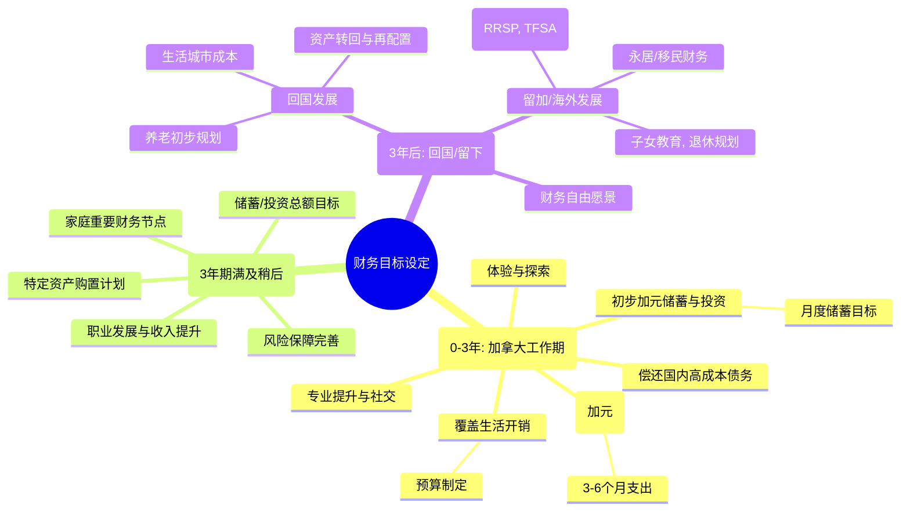

# 第三章：目标设定——3年加拿大工作期的财务蓝图

在对个人资产和相关政策法规有了清晰认知之后，我们正式进入财务规划的核心环节——为未来三年的加拿大工作期设定明确、可量化的财务目标。这如同航海前校准罗盘、设定航线，将指引您在瞬息万变的金融海洋中保持方向，最大化利用这三年的宝贵时光，实现个人财务的稳健增值与生活品质的提升。本章将引导您如何明确短期、中期及潜在的长期财务目标，如何科学评估自身的风险承受能力，并在此基础上初步构想跨境资产配置的框架，最终通过实操问卷来固化您的个性化财务蓝图。

## 3.1 明确财务目标：短期生活开销、中期储蓄/投资、长期（回国/留下）规划

财务目标的设定并非一蹴而就，它是一个需要结合个人实际情况、职业发展、家庭责任以及对未来生活期望进行综合考量的过程。对于为期三年的加拿大工作者，我们可以从短期、中期和长期三个维度来梳理和明确。

### 3.1.1 短期财务目标（加拿大工作期内，0-3年）

短期目标主要聚焦于保障您在加拿大三年工作期间的日常生活品质、财务安全以及初步的资本积累。

*   **覆盖在加基本生活开销：** 这是最首要的目标。
    *   **具体化：** 估算每月/每年的固定支出（房租/房贷、水电煤网、交通、通讯）和弹性支出（餐饮、购物、娱乐、社交）。可以参考加拿大主要城市的生活成本数据（如温哥华、多伦多、蒙特利尔等），并结合您的生活习惯进行调整。
    *   **行动：** 制定详细的月度/年度预算表。例如：每月房租$1500-$2500 CAD，交通费$100-$200 CAD，伙食费$400-$600 CAD等。
*   **建立应急储备金（加拿大）：** 在异国他乡，一笔随时可用的应急资金至关重要。
    *   **具体化：** 通常建议储备3-6个月的生活总支出作为应急金，以应对失业、疾病、家庭突发状况等不可预见的风险。
    *   **存放：** 这笔资金应存放于高流动性、低风险的加元账户中，如高息储蓄账户（HISA）或货币市场基金。
*   **偿还国内高成本债务（如适用）：** 如前所述，若有国内的信用卡欠款、高利率消费贷等，应优先计划清偿。
    *   **具体化：** 列出债务清单、利率、每月还款额，制定还款计划。
*   **初步的加元储蓄与投资：** 在满足生活所需后，开始进行加元资产的积累。
    *   **具体化：** 设定每月的储蓄目标金额或收入百分比（例如，月收入的15%-25%）。
    *   **目标：** 这笔储蓄可以用于短期旅游、购买大件消费品，或作为后续中期投资的启动资金。
*   **专业技能提升与社交拓展：** 虽然不是直接的财务数字，但投入于提升专业技能、拓展人脉，对未来职业发展和收入增长具有重要意义，也应纳入短期规划并预留相应预算。
*   **体验与探索：** 利用在加拿大的机会，体验当地文化、旅游等，这也是人生财富的一部分。可以为此设立专项储蓄。

### 3.1.2 中期财务目标（3年期满时或稍长一段时间）

中期目标着眼于3年工作期结束时您希望达成的财务状态，以及为更长远的未来打下基础。

*   **明确的储蓄/投资总额目标：**
    *   **具体化：** 例如，希望3年后能积累等值XX万人民币或XX万加元的金融资产。这个数字应基于您的收入水平、消费习惯和储蓄能力来设定，力求具有挑战性但又可实现。
    *   **用途：** 这笔资金可能是为了回国后的购房首付、创业启动金、子女教育储备，或是选择继续在海外深造/生活的资本。
*   **特定资产购置计划（如有）：**
    *   **具体化：** 是否计划在3年内或期满时在加拿大或国内购置某项重要资产（如汽车，或为未来房产积累首付）？为此需要储蓄多少？
*   **职业发展里程碑带来的财务提升：**
    *   **具体化：** 是否期望通过3年的加拿大工作经验，在回国后获得更高薪酬的职位？或者在加拿大本地实现职位晋升和薪资增长？这可以间接转化为财务目标的达成。
*   **针对性风险保障的完善：**
    *   **具体化：** 在加拿大期间，除了基本的医疗保险，是否需要配置额外的商业健康保险、意外险或定期寿险，以应对更大的风险？这需要一定的保费支出预算。
*   **个人或家庭重要财务节点：**
    *   **具体化：** 如计划结婚、生育子女等，这些人生大事都需要相应的财务准备。

### 3.1.3 长期财务目标（3年后，回国/留下/其他）

长期目标更多的是一种方向性的指引，它会随着您中期目标的实现情况和人生境遇的变化而调整，但提前思考有助于您在关键节点做出更明智的决策。

*   **回国发展的财务规划：**
    *   **生活城市与成本：** 计划回国后在哪个城市生活？该城市的生活成本、房价水平如何？
    *   **职业规划：** 回国后的职业方向和预期收入水平。
    *   **资产配置调整：** 如何将加拿大的资产安全、合规、低成本地转回国内，并进行人民币资产的再配置。
    *   **养老规划初步：** 虽然尚早，但可以开始考虑国内的养老体系和个人补充养老金的准备。
*   **选择在加拿大（或其他国家）长期发展的财务规划：**
    *   **永居/移民身份获取：** 如果有此打算，了解相关的财务要求和申请成本。
    *   **长期投资策略：** 在加拿大进行更长期的投资规划，如RRSP（注册退休储蓄计划）的持续投入、TFSA（免税储蓄账户）的长期利用、房产购置等。
    *   **子女教育规划（加拿大）：** 如果计划子女在加拿大接受教育，需要储备相应的教育基金。
    *   **退休规划（加拿大）：** 了解加拿大的养老金体系（CPP, OAS）以及个人商业养老保险和投资的作用。
    *   **财富传承：** 初步考虑财富传承的工具和方式（如遗嘱、信托等）。
*   **财务自由的愿景：**
    *   **定义：** 您心目中的财务自由是什么状态？（例如，被动收入覆盖生活支出）
    *   **路径：** 实现这一目标大致需要多少净资产？计划通过哪些方式（如投资增值、创业）来实现？

**目标设定的SMART原则：**
为了使目标更具可操作性，可以运用SMART原则来检视和修正您的财务目标：
*   **S (Specific - 具体的)：** 目标明确不模糊。例如，"每月储蓄1000加元"比"多存钱"更具体。
*   **M (Measurable - 可衡量的)：** 目标可以用数字量化。例如，"3年后金融资产达到5万加元"。
*   **A (Achievable - 可实现的)：** 目标在努力后可以达到，不好高骛远也不妄自菲薄。
*   **R (Relevant - 相关的)：** 目标与您的人生规划和价值观相符。
*   **T (Time-bound - 有时限的)：** 目标有明确的完成时间。例如，"在202X年底前还清XX信用卡债务"。

## 3.2 风险承受能力评估：结合年龄、收入、家庭状况和投资期限

在设定了清晰的财务目标之后，下一步是客观评估您能承受多大的投资风险。风险承受能力是主观意愿（风险偏好）和客观条件（风险承担能力）的结合体，它直接决定了您在后续资产配置中的策略选择。一个与风险承受能力不匹配的投资组合，要么可能因过于保守而错失增长机会，无法达成目标；要么可能因过于激进而在市场波动时产生无法承受的损失和焦虑。

### 3.2.1 影响风险承受能力的因素

*   **年龄：**
    *   **年轻人：** 通常有更长的时间来弥补潜在的投资损失，可以承受更高的风险以追求更高的回报。例如，25-35岁的专业人士，其人力资本（未来赚钱能力）较高，投资期限也较长。
    *   **临近退休或已退休人士：** 投资期限较短，对本金安全性的要求更高，风险承受能力相对较低。
*   **收入水平与稳定性：**
    *   **高收入且稳定：** 如果您的收入较高且来源稳定，即使部分投资短期出现亏损，对日常生活影响也较小，因此可以承担更高风险。
    *   **收入较低或不稳定：** 需要优先保障生活开支和应急储备，可用于高风险投资的资金相对有限。
*   **财务状况与净资产：**
    *   **净资产较高，负债率低：** 拥有较多可支配的净资产，且债务负担不重，抵御风险的能力更强。
    *   **净资产较低，负债率高：** 财务弹性较差，应避免高风险投资，以免陷入财务困境。
*   **家庭状况与责任：**
    *   **单身或丁克家庭：** 家庭责任相对较轻，财务决策更灵活，可承受风险略高。
    *   **有年幼子女、赡养老人：** 家庭责任重，需要保障家庭成员的生活和教育等刚性支出，风险承受能力会相应降低。
*   **投资期限：**
    *   **长期投资（如5-10年以上）：** 可以通过时间来平滑市场短期波动，承受较高风险的投资（如股票、成长型基金）以获取长期资本增值。
    *   **短期投资（如1-3年）：** 资金很快需要使用，应以本金安全和流动性为首要目标，选择低风险投资（如高息储蓄、短期债券基金）。对于3年加拿大工作期而言，大部分用于此期间的投资目标，其投资期限都偏短期。
*   **投资知识与经验：**
    *   **经验丰富，理解风险：** 对投资产品和市场有较好理解的投资者，更能理性看待波动，承受能力相对较高。
    *   **新手投资者：** 建议从低风险产品入手，逐步积累经验，不宜盲目追求高收益而承担超出认知范围的风险。
*   **心理素质（风险偏好）：**
    *   **主观感受：** 您对亏损的容忍度如何？当投资组合下跌10%、20%甚至更多时，您是否会寝食难安？这是非常个人化的因素。
    *   **风险厌恶型：** 宁愿牺牲部分潜在收益以求本金安全。
    *   **风险中性型：** 在一定风险范围内追求合理回报。
    *   **风险偏好型：** 愿意承担较高风险以博取较高收益。

### 3.2.2 如何进行自我评估

没有绝对标准的公式来精确计算风险承受能力，但可以通过回答一系列问题来进行定性或半定量的评估：

1.  **您的年龄段是？**
    *   A. 30岁以下
    *   B. 30-45岁
    *   C. 45-55岁
    *   D. 55岁以上
2.  **您目前的年收入（折合人民币）大约是？您对未来3-5年收入增长的预期是？**
    *   （开放性回答，评估收入水平和稳定性）
3.  **您家庭的净资产（总资产减总负债）大约是多少？其中可用于投资的金融资产占比多少？**
    *   （开放性回答，评估财务实力）
4.  **您是否有尚未偿还的债务（如房贷、车贷、消费贷）？每月还款额占收入比重如何？**
    *   A. 无债务或占比很小（<10%）
    *   B. 占比适中（10%-30%）
    *   C. 占比较高（>30%）
5.  **您的家庭结构和主要财务责任是？**
    *   A. 单身，财务自由度高
    *   B. 已婚无子女，共同分担
    *   C. 已婚有年幼子女或计划生育
    *   D. 需要赡养老人
6.  **您本次投资的主要目标资金，计划在多长时间后使用？**
    *   A. 1年以内
    *   B. 1-3年
    *   C. 3-5年
    *   D. 5年以上
7.  **您的投资经验如何？**
    *   A. 几乎没有经验，以银行存款为主
    *   B. 购买过基金、理财产品，略有了解
    *   C. 有股票、期货等复杂产品投资经验
8.  **如果您的一笔10万元的投资，在1个月内亏损了1万元（-10%），您的反应更可能是？**
    *   A. 非常焦虑，立即赎回，以后再也不碰了
    *   B. 有些不安，会密切关注，但暂时持有
    *   C. 认为市场正常波动，如果看好长期趋势，可能会考虑补仓
9.  **您对投资回报的期望是？**
    *   A. 保本即可，略高于银行存款就行
    *   B. 希望能跑赢通货膨胀，获得稳健回报
    *   C. 期望获得远超市场平均水平的高回报，愿意为此承担较大风险

**评估结果的运用：**
根据以上问题的回答，您可以初步判断自己的风险承受能力属于保守型、稳健型（或平衡型）、还是进取型（或成长型）。
*   **保守型投资者：** 更看重本金安全和流动性，适合配置较高比例的低风险资产，如存款、货币基金、短期债券等。
*   **稳健型投资者：** 追求风险与回报的平衡，可以配置一定比例的权益类资产（如股票基金）和固定收益类资产。
*   **进取型投资者：** 追求长期资本的高速增长，能够承受较大的市场波动，可以配置较高比例的权益类资产。

**重要提示：** 风险承受能力不是一成不变的，它会随着您的年龄增长、家庭状况变化、收入增减、投资经验积累以及市场环境变迁而动态调整。因此，定期（如每年一次）重新评估风险承受能力是必要的。

## 3.3 初步跨境资产配置构想：人民币与加元资产的比例思考

在明确了财务目标和风险承受能力之后，我们可以开始初步勾勒跨境资产配置的蓝图。对于即将在加拿大工作三年的您而言，核心问题之一就是：在中国的人民币资产和在加拿大的加元资产之间，应该如何进行合理的比例分配和管理？

### 3.3.1 影响中加资产配置比例的因素

*   **财务目标侧重：**
    *   如果您的主要财务目标是短期内在加拿大积累生活和应急资金，并为期满后的不确定性做准备，那么初期加元资产的流动性和安全性是首位，人民币资产则以稳健和远程管理便利为主。
    *   如果您的长期目标是回国发展，那么人民币核心资产（如国内房产、长期投资）的保值增值仍然重要。
    *   如果倾向于未来在加拿大长期发展，则应逐步增加加元资产的配置比例和长期投资的比重。
*   **在加工作收入与支出：**
    *   您在加拿大的薪资水平（扣除税费后）将是加元资产积累的主要来源。薪资越高，储蓄能力越强，可配置的加元资产就越多。
    *   加拿大的生活成本直接影响您的储蓄率。如果生活成本高昂，大部分收入用于开销，那么加元资产的积累速度会减慢。
*   **人民币资产的现状与特性：**
    *   **流动性：** 国内资产中有多少是易于变现的？有多少是难以短期处置的（如房产）？
    *   **收益性与风险：** 国内资产的预期回报和风险水平如何？是否需要调整以降低风险或提高流动性，从而为购汇或海外投资腾出资金？
    *   **管理难度：** 人在加拿大，远程管理国内资产的便捷性和成本如何？
*   **汇率预期与风险：**
    *   对人民币兑加元汇率的未来走势判断，会影响您换汇的时机和资产配置的币种倾向。但预测汇率非常困难，因此更重要的是进行风险分散和管理，而非单边押注汇率方向。
    *   持有不同币种的资产本身就是一种汇率风险的分散。
*   **中加两国投资机会的比较：**
    *   您对中国和加拿大两国资本市场的了解程度和投资偏好。
    *   两国市场的预期回报率、风险水平、可选投资工具的差异。
*   **税务考量：**
    *   您在中加两国的税务居民身份（详见第五章）以及两国对于海外资产和收入的税务规定，会影响您的资产配置决策，以实现税务优化。

### 3.3.2 不同情境下的配置思路（示例）

以下仅为几种简化情境下的初步思路，具体比例需高度个性化定制：

*   **情境一：年轻专业人士，计划3年后回国，国内有一定资产基础，加拿大薪资中等。**
    *   **人民币资产：** 保留国内核心房产（如有自住或稳定出租），对高风险、高流动性要求的金融资产可适当减持或转为稳健型产品，确保远程管理便利。保留足够的人民币流动资金应付国内不时之需或作为汇率合适时的换汇储备。
    *   **加元资产：** 优先建立应急储备金（3-6个月生活费）。每月固定储蓄一部分薪资，初期可投资于低风险的加元理财产品（如GIC、高息储蓄账户）。随着对加拿大市场了解加深和资金积累，可逐步小额尝试风险略高的投资（如ETF指数基金），但整体以稳健和流动性为主，为回国时的资金转移或使用做准备。
    *   **币种比例大致构想：** 初期可能人民币资产占比仍较高（如70-80%），加元资产逐步积累。目标是3年期满时，加元资产能覆盖回国后一段时间的过渡或某个特定目标（如购车款）。

*   **情境二：已有家庭和子女，计划3年后根据情况决定是否移民，国内资产较多，加拿大薪资较高。**
    *   **人民币资产：** 对国内资产进行优化，流动性较差或管理不便的非核心资产可考虑逐步处置。保留优质核心资产。一部分资金通过合规渠道（如QDII）进行全球配置，分散风险。
    *   **加元资产：** 除了应急金和生活储蓄，更积极地利用TFSA、RRSP（若适用短期策略）等加拿大特色账户进行投资，为未来可能的移民或长期居住打下基础。投资组合可适当增加成长性资产的比重，但仍需与风险承受能力匹配。
    *   **币种比例大致构想：** 可能会有意识地逐步提高加元及其他外币资产的比例，例如力争在3年内使外币资产（含加元）占比达到家庭总金融资产的30%-50%（视家庭总资产规模和移民倾向而定）。

*   **情境三：财务基础相对薄弱，主要依靠加拿大工作实现初步财富积累，未来计划不确定。**
    *   **人民币资产：** 若国内资产不多，则以保障家人生活和国内必要开支为主，其余尽量转化为流动性好的资产，伺机换汇支持加拿大初期生活。
    *   **加元资产：** 核心目标是尽快在加拿大站稳脚跟，强制储蓄，严格控制开支。加元资产首先确保应急和生活，其次是进行低风险的强制储蓄。在有一定积累后，再考虑小额、分散的投资，以学习和体验为主。
    *   **币种比例大致构想：** 初期人民币资产可能很快消耗或转为加元。重点是最大化加元储蓄率。由于未来不确定性大，资产配置以灵活性和安全性为首要考量。

### 3.3.3 动态调整的必要性

跨境资产配置的比例不是一成不变的静态数字，而是一个需要根据以下因素进行**定期回顾和动态调整**的过程：
*   **财务目标的进展和变化。**
*   **个人和家庭状况的改变（如结婚、生子、失业、重大疾病等）。**
*   **中加两国经济、金融市场和政策法规的变化。**
*   **汇率的显著波动。**
*   **您对两国投资环境认知的加深。**

建议至少每年对您的跨境资产配置策略进行一次审视和必要的调整。

## 3.4 实操流程：制定个性化3年期财务目标与风险评估问卷

为了将前述的理论和思考落到实处，本节提供一个结构化的问卷，帮助您梳理并记录下针对您个人情况的3年期财务目标和风险承受能力评估结果。这份问卷的完成，将是您构建个性化跨境投资计划的坚实一步。

**问卷名称：我的3年加拿大工作期财务蓝图**

**个人基本信息（可选填写，用于自我提醒）：**
*   姓名/昵称：________________________
*   年龄：________________________
*   赴加日期（预计）：________________________
*   职业/职位（加拿大）：________________________

**第一部分：我的财务目标（未来3年）**

1.  **短期核心生活保障（加拿大）：**
    *   预计每月固定生活开销（加元）：__________ CAD (房租/贷、水电煤网、交通、通讯等)
    *   预计每月弹性生活开销（加元）：__________ CAD (餐饮、购物、娱乐、社交等)
    *   **我的加拿大应急储备金目标（3-6个月总开销）：** __________ CAD

2.  **短期储蓄/投资目标（加拿大，3年内）：**
    *   我计划每月储蓄/投资（加元）：__________ CAD 或 月收入的 ______%
    *   这笔储蓄/投资的主要用途是：
        *   [ ] 短期旅游/体验 (预算: ________ CAD)
        *   [ ] 购买特定大件消费品 (物品: __________, 预算: ________ CAD)
        *   [ ] 专业技能提升/课程 (预算: ________ CAD)
        *   [ ] 作为3年期满时的一笔积累资金 (目标总额: ________ CAD)
        *   [ ] 其他：________________________________ (预算: ________ CAD)

3.  **中期财务目标（3年期满时希望达成）：**
    *   我希望3年后在加拿大积累的金融资产总额（加元）大约为：__________ CAD
    *   我希望3年后个人/家庭净资产（含国内外，折合人民币）能达到：__________ RMB
    *   是否有特定的大额财务目标（如购房首付的一部分、创业启动资金等）？请描述：
        ______________________________________________________________________ (目标金额: ________ CAD/RMB)

4.  **长期方向性思考（3年后，初步想法）：**
    *   关于3年后的发展，我目前的倾向是：
        *   [ ] 计划回中国发展 (意向城市: __________)
        *   [ ] 倾向于申请加拿大永居/移民
        *   [ ] 考虑去其他国家/地区发展
        *   [ ] 尚未确定，保持灵活性
    *   这个长期方向对我当前的财务规划有何启示？
        ______________________________________________________________________

**第二部分：我的风险承受能力评估**

1.  **年龄与投资期限：** 我的年龄处在____阶段，本次财务规划主要针对未来3年的资金，部分目标可能涉及更长期限（如____年）。
2.  **收入与财务稳定性：** 我在加拿大的预期税后月收入大约为________CAD，收入稳定性评估为（高/中/低）。我国内的财务支持情况为：________________。
3.  **家庭责任：** 我目前的家庭责任包括：[ ]无 [ ]配偶 [ ]子女 (___人) [ ]赡养父母 [ ]其他：________。
4.  **投资经验：** 我的投资经验：[ ]无 [ ]少 (仅存款/货币基金) [ ]中等 (基金/理财) [ ]丰富 (股票/衍生品)。
5.  **风险态度（心理承受力）：**
    *   如果我的10,000加元投资在一个月内下跌10%（亏损1,000加元），我可能会：
        *   [ ] 非常焦虑，考虑立即卖出以避免更大损失。
        *   [ ] 感到不安，但会观察等待，或咨询专业意见。
        *   [ ] 认为这是正常波动，如果长期看好，可能考虑持有或在合适时机加仓。
    *   我对投资的首要期望是：
        *   [ ] 本金绝对安全，可以接受较低收益。
        *   [ ] 在可控风险下，追求温和、稳健的增长，跑赢通胀。
        *   [ ] 愿意承担较高市场风险，以博取较高的潜在回报。
6.  **综合自我评估：** 基于以上，我认为我的整体风险承受能力属于：
    *   [ ] 保守型 (Conservative)
    *   [ ] 稳健型/平衡型 (Moderate/Balanced)
    *   [ ] 进取型/成长型 (Aggressive/Growth)

**第三部分：初步跨境资产配置构想**

1.  **目前我的人民币资产主要构成（大致比例或金额）：**
    *   流动性资产（现金、活期、货币基金）：________%
    *   固定收益类（定期、银行理财、债券）：________%
    *   权益类（股票、股票基金）：________%
    *   房地产（自用/投资）：________%
    *   其他：________%
2.  **赴加前，我对国内人民币资产的初步处理打算是：**
    ______________________________________________________________________
3.  **对于在加拿大积累的加元资产，我的初步投资偏好（可多选）：**
    *   [ ] 高息储蓄账户 (HISA) / 定期存款 (GICs)
    *   [ ] 货币市场基金
    *   [ ] 债券基金 / ETF
    *   [ ] 平衡型基金 / ETF
    *   [ ] 股票基金 / ETF (如追踪S&P/TSX指数)
    *   [ ] 个股投资 (加拿大市场)
    *   [ ] TFSA账户优先利用
    *   [ ] RRSP账户（根据情况考虑）
4.  **我对未来3年内，人民币资产和加元（及其他外币）资产的期望大致比例范围是：**
    *   人民币资产占比：____% 至 ____%
    *   加元及其他外币资产占比：____% 至 ____%

**问卷完成日期：** ____年____月____日

**后续行动：**
*   [ ] 定期回顾此问卷（建议每6-12个月一次，或当个人情况/市场发生重大变化时）。
*   [ ] 基于此问卷的结果，与专业财务顾问（如需要）进行更深入的讨论，制定详细的投资组合方案。
*   [ ] 开始执行我的财务计划！

---

填写这份问卷的过程，本身就是一次深刻的自我对话和财务梳理。它将帮助您把模糊的想法转化为清晰的目标和策略方向。请认真对待，并将其作为您未来三年加拿大财务之旅的行动指南和参照基准。至此，我们完成了"启程之前——中国的准备与规划"这一部分的所有内容。下一部分，我们将聚焦"落地生根——加拿大的金融体系融入"，为您在加拿大的财务生活做好实际准备。 