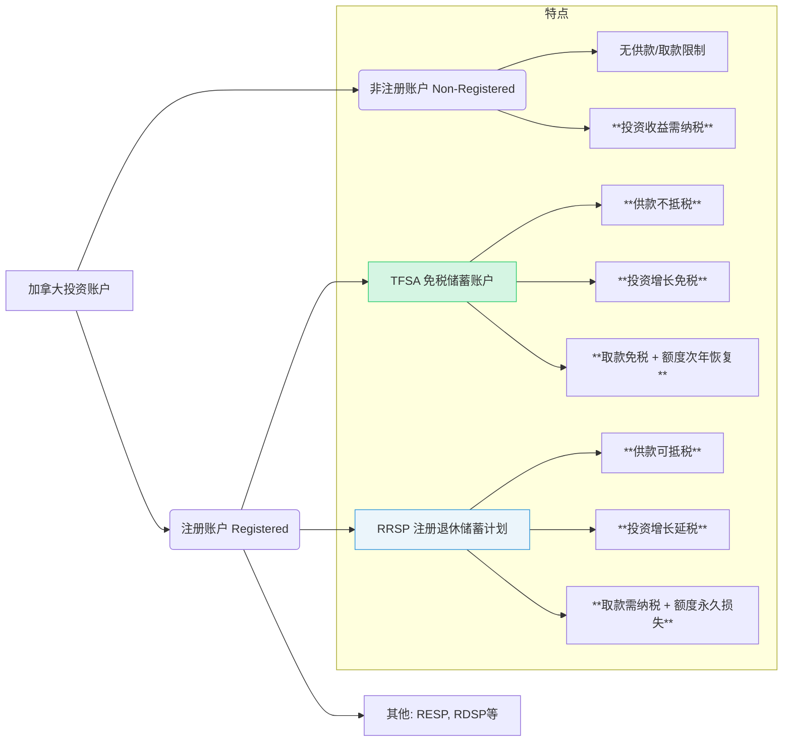

# 第六章：初识加拿大投资市场

在逐步适应加拿大的生活并建立起基本的银行和信用体系后，您的目光自然会投向如何让在加拿大辛苦赚取的收入实现保值增值。本章将为您揭开加拿大投资市场的面纱，介绍主要的金融市场构成、核心的投资账户类型（特别是TFSA和RRSP这两个加拿大特色的注册账户），并重点分析它们对于持有3年工作签证人士的适用性与策略，最后提供开设投资账户的实操指引。了解这些基础知识，将是您开启加拿大投资之旅的第一步。

## 6.1 加拿大金融市场概览：股市（TSX）、债券、基金（Mutual Funds, ETFs）

加拿大的金融市场成熟、规范且多元化，为投资者提供了丰富的选择。以下是几个主要的组成部分：

### 6.1.1 股票市场 (Stock Market)

*   **多伦多证券交易所 (Toronto Stock Exchange, TSX):**
    *   是加拿大**最大**的股票交易所，也是全球主要的交易所之一。
    *   上市公司涵盖了加拿大经济的各个支柱行业，尤其以**金融服务、能源和原材料**板块权重较高。
    *   许多加拿大知名的大型蓝筹股（如五大银行、大型能源公司、电信巨头等）都在TSX上市。
    *   **主要指数:** S&P/TSX综合指数 (S&P/TSX Composite Index) 是衡量加拿大股市整体表现的最重要基准，包含了在TSX上市的大约250家市值最大、交易最活跃的公司。S&P/TSX 60指数则聚焦于其中规模最大、流动性最好的60家公司。
*   **TSX创业交易所 (TSX Venture Exchange, TSXV):**
    *   是TSX集团旗下的另一个交易所，主要服务于**新兴的、规模较小的上市公司**，特别是矿业、科技和生物技术等领域的初创或成长型企业。
    *   相比主板市场，TSXV的上市公司风险更高，股价波动性更大，但潜在增长空间也可能更大。
*   **其他交易所:** 如加拿大证券交易所 (Canadian Securities Exchange, CSE) 等，规模相对较小。
*   **投资方式:** 个人投资者可以通过在**券商 (Brokerage Firm)** 开设的投资账户，直接买卖在这些交易所上市的股票。

### 6.1.2 债券市场 (Bond Market)

债券代表着借款人（政府或公司）向投资者发行的债务凭证，承诺在未来支付利息并偿还本金。通常被认为是风险低于股票的投资类别。

*   **政府债券 (Government Bonds):**
    *   由加拿大联邦政府、省政府或市政府发行。
    *   被视为风险最低的债券，尤其是联邦政府债券，几乎没有违约风险。
    *   根据期限长短分为短期国库券 (Treasury Bills, T-Bills)、中期国债 (Government of Canada Bonds) 等。
*   **公司债券 (Corporate Bonds):**
    *   由公司发行，用于筹集资金。
    *   风险高于政府债券，取决于发行公司的信用评级。信用评级高的公司（投资级债券, Investment-Grade Bonds）风险较低，评级低的公司（高收益债券/垃圾债券, High-Yield/Junk Bonds）风险较高，但通常提供更高的票面利率作为风险补偿。
*   **投资方式:** 个人投资者可以通过券商账户直接购买某些债券（通常起投金额较高），或者更普遍地通过投资**债券基金 (Bond Funds) 或债券ETF (Bond ETFs)** 来间接投资于一篮子债券。

### 6.1.3 投资基金 (Investment Funds)

投资基金是将众多投资者的资金汇集起来，由专业的基金经理根据特定的投资目标和策略，投资于股票、债券、货币市场工具或其他资产的集合投资工具。对于个人投资者来说，这是实现投资组合多元化、降低风险、并借助专业管理能力的便捷方式。

*   **互惠基金 (Mutual Funds):**
    *   是最传统的基金形式之一，由基金公司发行和管理。
    *   **特点:**
        *   通常是**主动管理型 (Actively Managed)**，基金经理会积极进行证券选择和买卖决策，试图跑赢市场基准。
        *   投资者在每个交易日结束时，按照当日计算出的**基金单位净值 (Net Asset Value, NAV)** 进行申购或赎回。
        *   **购买渠道:** 主要通过银行、财务顾问、基金公司直销等渠道购买。
        *   **费用:** 互惠基金的管理费（Management Expense Ratio, MER）通常相对较高，尤其是主动管理型基金，因为包含了基金经理的研究和管理成本。可能还有申购费 (Load Fee) 或赎回费。
*   **交易所交易基金 (Exchange-Traded Funds, ETFs):**
    *   近年来发展迅猛，越来越受投资者欢迎。
    *   **特点:**
        *   像股票一样，在**证券交易所上市交易**。投资者可以在交易时间内，随时按市场价格买卖ETF份额。
        *   大部分ETF是**被动管理型 (Passively Managed)**，旨在**追踪特定市场指数**的表现（如S&P/TSX 60指数、S&P 500指数、债券指数等）。由于是被动追踪，其管理费用通常远低于主动管理的互惠基金。
        *   也有一部分主动管理型ETF。
        *   **购买渠道:** 通过任何可以交易股票的券商账户即可买卖。
        *   **费用:** 管理费 (MER) 通常较低，交易时需支付券商佣金（部分券商提供免佣金ETF交易）。
        *   **透明度高:** 通常会每日公布其持仓。
        *   **投资范围广:** ETF可以追踪股票指数、债券指数、商品指数、特定行业、特定地区等，种类非常丰富。

**互惠基金 vs. ETF (简化对比):**

| 特点         | 互惠基金 (Mutual Funds)                  | 交易所交易基金 (ETFs)                      |
| :----------- | :--------------------------------------- | :----------------------------------------- |
| **交易方式** | 按日终净值 (NAV) 申购/赎回             | 交易所内按市场价实时买卖                   |
| **管理方式** | 主动管理为主                             | 被动管理 (追踪指数) 为主                   |
| **管理费(MER)** | 相对较高                                 | 相对较低                                   |
| **购买渠道** | 银行, 财务顾问, 基金公司               | 股票券商账户                               |
| **透明度**   | 通常较低 (定期披露持仓)                  | 通常较高 (每日披露持仓)                    |
| **适合谁**   | 偏好主动管理, 通过传统渠道购买的投资者 | 对成本敏感, 偏好指数化投资, 自主交易的投资者 |

**对于3年工作期的投资者：** 考虑到投资期限相对较短，且可能刚开始接触加拿大市场，**低成本、高透明度、易于分散风险的ETF**，尤其是追踪大盘股指（如S&P/TSX 60 ETF）或综合债券指数（如加拿大综合债券ETF）的ETF，通常是更值得优先考虑的选择。

## 6.2 主要投资账户类型：非注册账户 vs. 注册账户 (TFSA, RRSP)

在加拿大进行投资，首先需要选择合适的投资账户类型。这些账户类型决定了您的投资收益将如何被征税，从而对您的最终回报产生重大影响。主要分为两大类：非注册账户和注册账户。

### 6.2.1 非注册账户 (Non-Registered Account)

也称为**应税账户 (Taxable Account)** 或现金账户 (Cash Account)。

*   **特点:**
    *   **没有供款限制:** 您可以随时存入任意金额的资金进行投资（但要注意资金来源的合规性）。
    *   **没有取款限制:** 您可以随时提取账户中的资金，没有税务罚款（但出售投资可能产生资本利得税）。
    *   **投资收益需要纳税:** 这是其最重要的特点。在非注册账户中实现的任何投资收益，都需要在当年向CRA申报并纳税：
        *   **利息收入 (Interest Income):** 按照您的边际税率100%计入应税收入。
        *   **股息收入 (Dividend Income):** 加拿大合格公司的股息享有股息税收抵免 (Dividend Tax Credit)，实际税负通常低于利息收入。外国股息则通常按100%计入应税收入。
        *   **资本利得 (Capital Gains):** 实现的资本利得只有50%计入应税收入 (Taxable Capital Gains)。
*   **适用场景:**
    *   当您的注册账户（TFSA, RRSP）额度已用尽时。
    *   需要高度灵活性的资金，可能随时需要取出使用。
    *   进行某些特定类型的投资（如某些衍生品）可能只能在非注册账户中进行。
*   **缺点:** 投资收益面临税务拖累 (Tax Drag)，即税收会侵蚀您的投资回报，降低复利效应。

### 6.2.2 注册账户 (Registered Account)

这是加拿大政府为了鼓励国民为特定目标（如退休、教育、购房、一般储蓄）进行储蓄和投资而设立的具有**税收优惠**的账户类型。最常见的注册账户包括TFSA和RRSP。

*   **共同特点:**
    *   **有供款额度限制:** 政府每年会规定您可以向这些账户存入（供款）的最高金额。超额供款通常会面临罚款。
    *   **税收优惠:** 这是注册账户最大的优势，具体优惠方式因账户类型而异（如下所述）。
    *   **投资选择:** 在这些账户内，您可以持有多种类型的合格投资 (Qualified Investments)，如现金、GIC、债券、股票、互惠基金、ETF等。

#### 6.2.2.1 免税储蓄账户 (Tax-Free Savings Account, TFSA)

*   **核心优势:** **账户内的所有投资收益（利息、股息、资本利得）完全免税！取出时也无需纳税。**
*   **供款 (Contribution):**
    *   您向TFSA账户存入的资金**不能**在报税时抵扣收入（即税后供款）。
    *   **供款额度 (Contribution Room):**
        *   每年政府会公布新的年度供款额度（例如，2023年为$6,500，2024年为$7,000）。
        *   只要您年满18岁且持有有效的SIN号（包括以9开头的临时居民SIN），从2009年（TFSA设立年份）或您年满18岁的年份（以较晚者为准）开始，您就可以累积每年的供款额度。
        *   **未使用的额度可以无限期向未来累积。** 例如，如果您在2024年初次抵达加拿大，年满18岁且拥有SIN，您当年的额度是$7,000。如果您只存了$2,000，剩余的$5,000额度可以带到2025年使用。
        *   **计算累积额度:** 对于2009年后一直符合资格的个人，截至2024年初的总累积额度为$95,000 CAD。对于较晚符合资格的人（如新移民），需要从您符合条件的年份开始计算。您可以登录CRA的"My Account"查询您个人的准确TFSA供款额度。
*   **取款 (Withdrawal):**
    *   您可以**随时**从TFSA账户中取款，取出的金额**完全免税**。
    *   更妙的是，您取出的金额（本金+收益）会在**下一个日历年**重新加回到您的供款额度中。例如，您在2024年从TFSA取款$5,000，那么在2025年1月1日，您的TFSA供款额度会增加$5,000（再加上2025年的新增年度额度）。
*   **适用性分析 (对3年工作期人士):** **TFSA通常是短期工作签证持有者最值得优先考虑和利用的注册账户！**
    *   **税务优势显著:** 投资收益完全免税，简单直接。
    *   **灵活性高:** 随时可以取款应急或用于其他目标，且不损失额度（次年恢复）。这对于未来计划不确定（回国还是留下）的人来说非常有价值。
    *   **额度累积:** 即使您只在加拿大工作3年，累积的TFSA额度也相当可观。
    *   **无收入要求:** 即使您某年收入较低或没有收入，只要符合年龄和SIN要求，就能获得供款额度。

#### 6.2.2.2 注册退休储蓄计划 (Registered Retirement Savings Plan, RRSP)

*   **核心优势:** **供款可以抵扣当年的应税收入，从而降低当年的所得税。账户内的投资收益可以延税增长，直到您取款时才需要作为收入纳税。**
*   **供款 (Contribution):**
    *   您向RRSP账户存入的资金（供款）可以**直接从您当年的总收入中扣除**，从而降低您的应纳税收入额 (Taxable Income)。这对于处于较高税阶的人尤其有吸引力。
    *   **供款额度 (Contribution Room):**
        *   您的RRSP供款额度是基于您**前一年**在加拿大赚取的"劳动收入"(Earned Income，主要指就业收入和自雇收入) 的18%来计算的，并且有一个年度上限（例如，2023年收入对应的2024年供款上限为$31,560）。
        *   **新移民第一年通常没有RRSP额度，** 因为额度基于前一年的加拿大收入。您需要在加拿大工作并报税后，才能在第二年获得RRSP供款额度。
        *   未使用的RRSP额度也可以向未来累积。
*   **取款 (Withdrawal):**
    *   **从RRSP取款通常需要作为应税收入在取款当年纳税。** 取款时，金融机构通常会预扣一部分税款 (Withholding Tax)。
    *   **提前取款会永久损失该部分的供款额度。** (特殊情况除外，如购房者计划HBP和终身学习计划LLP)。
    *   RRSP的主要设计目的是用于退休储蓄，鼓励您将资金保留到退休后（通常收入较低，税阶也较低时）再取出。
*   **适用性分析 (对3年工作期人士):** **RRSP对于短期工作签证持有者来说，吸引力相对TFSA较低，需要谨慎考虑。**
    *   **优点:** 如果您在加拿大的收入较高，处于较高的边际税率，RRSP的供款退税效果会很显著，可以立刻降低您的税负。账户内的延税增长也是优势。
    *   **缺点:**
        *   **第一年无额度:** 刚来的第一年无法供款。
        *   **取款不灵活且有税务后果:** 如果您计划3年后离开加拿大并将RRSP中的资金取出，这笔取款将被视为收入纳税（可能按非税务居民的预扣税率，或根据您当年的税务身份处理），并且损失的供款额度无法恢复。这对于短期目标来说非常不利。
        *   **未来税阶不确定:** RRSP的最佳策略是"高税阶供款，低税阶取款"。如果您预计3年后回国，或者未来的收入/税阶不确定，提前从RRSP取款可能并不划算。
    *   **例外情况:** 如果您非常确定未来会在加拿大退休，或者您的雇主提供RRSP匹配计划 (Employer Matching Program，即雇主为您存入RRSP的供款提供匹配资金)，那么即使是短期工作，参与RRSP也可能有意义（特别是雇主匹配部分相当于"免费的钱"）。

**TFSA vs. RRSP 核心对比 (简化):**

| 特点         | TFSA (免税储蓄账户)                      | RRSP (注册退休储蓄计划)                      |
| :----------- | :--------------------------------------- | :------------------------------------------- |
| **供款税务处理** | **税后**供款 (不能抵扣收入)              | **税前**供款 (可抵扣当年收入)                |
| **投资增长**   | **完全免税**                             | **延税增长**                               |
| **取款税务处理** | **完全免税**                             | **作为收入纳税**                             |
| **供款额度来源** | 年龄+SIN (与收入无关)                    | 前一年劳动收入的18% (有上限)                 |
| **新移民首年额度** | 有 (若符合年龄+SIN)                      | **无**                                       |
| **取款后额度恢复** | **是** (次年恢复)                        | **否** (永久损失)                            |
| **主要目的**   | 灵活储蓄与投资                           | 退休储蓄                                     |
| **对短期工签者** | **通常非常适合 (高优先级)**              | **通常吸引力较低 (需谨慎评估)**              |

## 6.3 TFSA（免税储蓄账户）：3年工作期的"黄金"账户？额度、规则与投资策略

如前所述，TFSA因其独特的税务优势和高度的灵活性，对于在加拿大进行为期三年工作的人士来说，往往是**最具价值和最应优先利用**的投资账户。本节将更深入地探讨TFSA的规则细节和针对短期投资者的策略。

### 6.3.1 TFSA额度详解

*   **资格:** 您必须年满18岁，并拥有有效的加拿大社会保险号码 (SIN)。临时居民（如持有工作签证并拥有9字头SIN）同样有资格获得TFSA额度。
*   **年度额度:** 由政府每年公布。历年额度如下：
    *   2009-2012: $5,000 /年
    *   2013-2014: $5,500 /年
    *   2015: $10,000 /年
    *   2016-2018: $5,500 /年
    *   2019-2022: $6,000 /年
    *   2023: $6,500 /年
    *   2024: $7,000 /年
*   **累积额度:** 您从**年满18岁且拥有有效SIN的年份**开始累积额度，无论当年您是否在加拿大居住或是否开设了TFSA账户。
    *   **示例1:** 小张2000年出生，2024年1月持工签首次抵达加拿大并获得SIN。他在2018年已满18岁。那么他2024年初可用的TFSA总额度 = 2018($5,500) + 2019($6,000) + 2020($6,000) + 2021($6,000) + 2022($6,000) + 2023($6,500) + 2024($7,000) = **$43,000**。
    *   **示例2:** 老李1985年出生，2023年7月持工签首次抵达加拿大并获得SIN。他从2009年TFSA设立起就符合年龄要求，但直到2023年才获得SIN。他从获得SIN的2023年开始累积额度。因此，他2024年初可用的TFSA总额度 = 2023($6,500) + 2024($7,000) = **$13,500**。（注意：关于临时居民何时开始累积额度，建议以CRA官方信息或My Account为准，规则可能有细微变化）。通常理解是只要满足年龄和SIN条件即可开始累积。最稳妥的方式是**查询CRA My Account**获取个人准确额度。
*   **查询额度:** 最准确的方式是注册并登录加拿大税务局 (CRA) 的**"My Account"**在线服务平台，里面会显示您当前的TFSA供款额度。银行或券商无法准确告知您的总额度（因为您可能在多家机构开设TFSA）。
*   **超额供款罚款:** 如果您的供款超过了您的可用额度，超额部分将面临**每月1%**的罚款，直到您取出超额部分为止。务必准确追踪自己的供款额度。

### 6.3.2 取款规则与额度恢复

*   **随时免税取款:** 您可以因任何理由，随时从TFSA账户中提取任意金额，无需缴纳任何税款。
*   **额度次年恢复:** 您在某一年从TFSA取出的总金额，会在**紧接着的下一个日历年1月1日**加回到您的供款额度中。
    *   **示例:** 假设您2024年初有$10,000的TFSA额度。您在2024年供款了$7,000，之后又因急用取出了$3,000。到2024年底，您当年的额度使用了$7,000，剩余$3,000未用。在2025年1月1日，您的新额度 = 2024年剩余额度($3,000) + 2024年取款额度恢复($3,000) + 2025年新增年度额度 (假设为$7,000) = $13,000。
    *   **注意:** 取款额度在**当年**不能重新使用，必须等到**次年**才恢复。如果在额度恢复前再次存入取出的金额，可能会导致超额供款。

### 6.3.3 TFSA内的合格投资

TFSA只是一个**账户类型**，您可以在这个账户"壳"里面持有多种合格投资 (Qualified Investments)，常见的包括：
*   现金 (Cash)
*   担保投资证 (Guaranteed Investment Certificates, GICs)
*   债券 (Bonds)
*   股票 (Stocks) - 在指定交易所上市的公司股票
*   互惠基金 (Mutual Funds)
*   交易所交易基金 (Exchange-Traded Funds, ETFs)
*   某些类型的小企业股份 (但规则复杂，需谨慎)

**禁止的投资 (Prohibited Investments)** 和 **不合格投资 (Non-Qualified Investments)** 会导致严重的税务后果，应避免。常见的合格投资通常由主流金融机构提供。

### 6.3.4 针对3年工作期的TFSA投资策略思考

考虑到3年的投资期限相对较短，以及可能的流动性需求，在TFSA内的投资策略应侧重于：

1.  **优先利用额度:** 尽可能将您的储蓄优先放入TFSA，以享受免税增长的福利。根据您的累积额度和储蓄能力，制定供款计划。
2.  **风险管理是关键:** 由于时间窗口有限，承受巨大损失的空间不大。投资组合应与您的风险承受能力匹配。
3.  **高息储蓄账户 (HISA) 或 GICs:** 对于风险承受能力较低，或需要确保资金在3年后可用的投资者，将TFSA额度用于持有HISA或短期（1-3年）的GIC是一个非常安全的选择。虽然回报不高，但利息完全免税，且本金有保障（GIC）或风险极低（HISA）。EQ Bank, Tangerine等数字银行通常提供开设在TFSA内的HISA选项。
4.  **债券基金/ETF:** 风险和回报介于储蓄和股票之间。可以选择投资于加拿大综合债券指数的ETF (如VAB, ZAG)，以获取相对稳定的回报并分散风险。
5.  **平衡型基金/ETF:** 如果能承受一定的市场波动，可以考虑投资于股债混合的平衡型ETF (如VBAL, XBAL) 或目标风险投资组合ETF (Asset Allocation ETFs)。这类ETF自动进行资产配置和再平衡，省心省力，风险相对分散。
6.  **股票基金/ETF (谨慎选择):** 如果您的风险承受能力较高，并且理解股票市场的波动性，可以考虑配置**一部分**资金到追踪大盘股指的ETF（如追踪S&P/TSX 60的XIU, HXT，或更广泛的加拿大市场如VCN, XIC；甚至可以考虑配置部分美国或全球市场ETF，如VFV, XUU, VXC）。但请记住，3年时间对于股市投资来说仍然偏短，可能无法完全平滑市场波动。**不建议在TFSA内进行高风险的个股投机或频繁交易**（可能被CRA视为商业行为而失去免税资格）。
7.  **成本控制:** 选择低管理费 (MER) 的投资产品，如ETF，以最大化您的净回报。
8.  **避免频繁交易:** 短期频繁买卖不仅增加交易成本，也可能增加犯错的概率。对于ETF等指数化投资，采取买入并持有 (Buy and Hold) 的策略通常更佳。

**示例组合（根据风险偏好调整）：**
*   **保守型:** 100% HISA 或 1-3年 GIC。
*   **稳健型:** 40% HISA/GIC + 60% 加拿大综合债券ETF。
*   **平衡型:** 30% HISA/GIC + 40% 加拿大综合债券ETF + 30% 加拿大/全球股票ETF (如Asset Allocation ETF)。
*   **进取型 (需谨慎):** 20% HISA/GIC + 20% 债券ETF + 60% 加拿大/全球股票ETF。

**最重要的是，选择与您目标、期限和风险承受能力相符的投资。** TFSA提供了一个强大的免税增长平台，善用它将为您在加拿大的财富积累添砖加瓦。

## 6.4 RRSP（注册退休储蓄计划）：是否适合短期工作者？税务优惠与取款限制

RRSP是加拿大政府为鼓励居民为退休进行储蓄而设立的核心工具。它通过税收优惠激励人们存钱，但其设计初衷是长期投资，对于计划仅在加拿大工作3年的人士来说，其适用性需要仔细权衡。

### 6.4.1 RRSP的税务优惠机制

*   **供款抵税 (Tax Deduction):** 您向RRSP账户的供款可以直接从您当年的应税收入中扣除。
    *   **示例:** 您年收入$70,000 CAD，向RRSP供款$5,000。那么您当年计算所得税的基础收入就降为$65,000。这$5,000的抵扣额可以为您带来一笔退税，退税金额取决于您的边际税率 (Marginal Tax Rate)。如果您的边际税率是30%，那么$5,000的供款大约能带来$1,500的退税。
    *   边际税率越高，RRSP供款的退税效果越明显。
*   **延税增长 (Tax-Deferred Growth):** 存入RRSP的资金及其产生的投资收益（利息、股息、资本利得）在账户内增长时**无需纳税**。只有当您从RRSP中取款时，取出的金额才需要作为当年的收入来纳税。
    *   这使得您的投资可以在不受税务拖累的情况下实现更快的复利增长。

### 6.4.2 RRSP供款额度

*   **基于前一年劳动收入:** 您的RRSP供款额度是您上一个纳税年度在加拿大境内赚取的"劳动收入"(Earned Income) 的18%，但不能超过政府设定的年度最高限额。
*   **新移民无首年额度:** 因为额度基于前一年的加拿大收入，所以您抵达加拿大的第一个纳税年度通常是没有RRSP供款额度的（除非您在前一年已有加拿大收入）。您需要在加拿大工作并完成第一次报税后，CRA才会在您的税单评估通知 (Notice of Assessment, NOA) 上告知您下一年度的RRSP额度。
*   **额度累积:** 未使用的RRSP额度可以无限期向未来累积。

### 6.4.3 RRSP取款规则与限制

*   **取款需纳税:** 这是RRSP与TFSA最核心的区别之一。任何时候从RRSP账户取款（除了HBP和LLP等特殊计划），取出的金额都会被视为您取款当年的**应税收入**，需要缴纳所得税。
*   **预扣税 (Withholding Tax):** 金融机构在您取款时，会根据取款金额预扣一部分税款直接交给CRA：
    *   取款 $\le\$5,000$: 预扣10% (魁北克省不同)
    *   $\$5,001 \le \text{取款} \le \$15,000$: 预扣20%
    *   取款 > \$15,000$: 预扣30%
    这只是预扣税，最终您需要缴纳的税款取决于您取款当年的总收入和边际税率，可能比预扣的多或少，需要在报税时多退少补。对于非税务居民取款，预扣税率通常是固定的25%（除非税收协定另有规定）。
*   **永久损失供款额度:** 从RRSP取款后，该部分的供款额度**不能恢复**。这与TFSA取款后额度次年恢复的机制完全不同。
*   **购房者计划 (Home Buyers' Plan, HBP):** 允许符合条件的首次购房者从其RRSP中**免税借款**（每人最高$35,000，夫妻可达$70,000）用于购买或建造自住房。借出的款项需要在未来15年内分期还回RRSP账户。HBP对于在加拿大长期定居的人更有意义。对于短期工作者，需要仔细评估是否符合资格以及还款的可行性。
*   **终身学习计划 (Lifelong Learning Plan, LLP):** 允许您或您的配偶从RRSP中取款用于全日制教育或培训。规则与HBP类似，需要按时还款。

### 6.4.4 RRSP对3年短期工作者的利弊分析

**潜在优势:**

1.  **显著的即时退税:** 如果您在加拿大的收入较高，处于较高的税阶（例如，联邦+省的综合边际税率达到30%或更高），那么RRSP供款带来的退税是非常直接和诱人的。这笔退税可以增加您当年的可支配现金流，或用于再投资（例如投入TFSA）。
2.  **雇主匹配计划 (Employer Matching):** 如果您的雇主提供RRSP匹配供款（例如，您存入工资的3%，雇主也为您额外存入3%），这相当于立刻获得100%的回报。在这种情况下，即使您是短期工作者，也强烈建议至少供款到能获得**全额匹配**的上限，否则等于放弃了"免费的钱"。
3.  **延税增长:** 账户内的投资可以不受年度税收干扰地增长。

**显著劣势:**

1.  **第一年无额度:** 无法在刚来的第一年利用此工具。
2.  **取款的税务后果:** 这是最大的障碍。如果您计划3年后离开加拿大，很可能需要将RRSP中的资金取出。这笔取款需要纳税（可能按非居民25%的税率预扣，或根据您离境当年的税务身份处理），这可能会**侵蚀甚至完全抵消**当年供款时获得的退税好处。
3.  **永久损失额度:** 取款后损失的供款额度无法恢复，对于未来可能重返加拿大或长期留下的规划不利。
4.  **高进低出的风险:** RRSP的最佳效果是"高税阶供款，低税阶取款"。如果您在加拿大工作时税阶较高，但几年后离开加拿大并在一个同样高税阶（甚至更高）的情况下取款，那么RRSP的税务优势就大打折扣，甚至可能起到反效果。
5.  **复杂性:** RRSP的规则相对TFSA更复杂，特别是涉及跨境取款和税务协定时。

**结论：RRSP是否适合您？**

*   **对于绝大多数计划仅在加拿大工作3年、之后大概率离开加拿大的临时工作者来说，TFSA通常是远优于RRSP的选择。** TFSA的免税增长、免税取款和额度恢复机制更符合短期、灵活的需求。
*   **在以下特定情况下，可以考虑RRSP：**
    *   **您的雇主提供非常诱人的RRSP匹配计划。** (务必参与以获取匹配部分)
    *   **您在加拿大的收入非常高，边际税率极高，** 即使考虑到未来取款纳税，当年的高额退税仍然具有吸引力（需要精确计算和专业评估）。
    *   **您有较大概率会在加拿大长期居留或移民，** 并且预计退休后的税阶会低于当前工作时的税阶。
    *   **您计划利用HBP在加拿大购房**（但这需要更长远的规划和对还款义务的承诺）。

**建议：优先填满TFSA额度。在TFSA额度用尽后，如果仍有储蓄能力，并且符合上述可以考虑RRSP的特定情况，再谨慎评估是否向RRSP供款。** 在做决定前，务必咨询专业的税务或财务顾问，结合您的个人情况进行详细测算。

## 6.5 实操流程：如何在加拿大开设投资账户

要在加拿大开始投资股票、ETF、基金等，您需要在一个金融机构开设专门的投资账户。这个过程通常比开设银行账户略微复杂一些，因为涉及风险评估和投资知识确认。

**第一步：选择投资平台/券商 (Brokerage Firm)**

加拿大的投资平台主要有以下几类：

1.  **银行附属券商 (Bank-Owned Brokerages):**
    *   **例子:** RBC Direct Investing, TD Direct Investing, BMO InvestorLine, Scotiabank iTRADE, CIBC Investor's Edge。
    *   **优点:** 通常与您的银行账户集成度高，资金划转方便；品牌信任度高；提供较全面的研究工具和市场信息；客户服务渠道较多。
    *   **缺点:** 交易佣金通常较高（每笔股票/ETF交易可能在$7-$10 CAD左右，或更高）；账户维护费可能存在（但通常满足一定资产规模或交易频率可豁免）。
2.  **独立在线券商 (Independent Online Brokers):**
    *   **例子:** Questrade, Wealthsimple Trade, National Bank Direct Brokerage (NBDB), Interactive Brokers (IBKR Canada)。
    *   **优点:**
        *   **低佣金甚至零佣金:** Wealthsimple Trade 对加拿大股票/ETF交易提供零佣金；Questrade 对ETF购买提供零佣金（卖出收费）；NBDB 对所有加拿大股票/ETF提供零佣金；IBKR 以其极低的佣金和外汇兑换率著称（但平台相对复杂）。
        *   账户维护费通常较低或更容易豁免。
        *   平台通常专注于交易体验，界面可能更现代化（如Wealthsimple Trade）。
    *   **缺点:** 研究工具和数据可能不如银行券商全面（但Questrade, IBKR等也提供强大功能）；客户服务可能以在线或电话为主；品牌认知度相对较低（但Questrade, Wealthsimple等已非常流行）。
3.  **机器人顾问 (Robo-Advisors):**
    *   **例子:** Wealthsimple Invest, BMO SmartFolio, RBC InvestEase, Questwealth Portfolios。
    *   **运作模式:** 根据您的风险承受能力和投资目标，自动为您构建和管理一个低成本的ETF投资组合。您只需定期存钱，无需自己挑选投资产品或进行交易。
    *   **优点:** 适合完全没有投资经验、希望"省心省力"的投资者；管理费通常低于传统的人工投资顾问；投资组合自动平衡。
    *   **缺点:** 投资组合由平台决定，缺乏自主选择权；除了管理费，底层ETF本身也有管理费(MER)。

**选择建议 (对3年工作期人士):**
*   如果您追求**低成本**，并且计划主要投资**ETF**，**独立在线券商**如 Wealthsimple Trade (零佣金加股/ETF), Questrade (免佣金买ETF), NBDB (零佣金加股/ETF) 是非常好的选择。
*   如果您希望**省心省力**，完全不想自己管理，可以考虑**机器人顾问**。
*   如果您已经习惯使用某家**五大行**的服务，并且不介意略高的交易佣金，使用其**附属券商**也可以，方便资金管理。
*   **Interactive Brokers (IBKR)** 适合交易频繁、需要投资全球市场、对低佣金和低汇率要求极高的有经验投资者，但平台对新手可能较复杂。

**第二步：准备所需信息和文件**

开设投资账户通常需要提供比银行账户更多的信息：
*   **个人信息:** 姓名、地址、出生日期、联系方式。
*   **社会保险号码 (SIN):** 开设所有注册账户 (TFSA, RRSP) 和会产生利息/股息的非注册账户都必须提供SIN。
*   **身份证明:** 可能需要提供政府签发的带照片ID的副本（如驾照、护照）。
*   **就业信息:** 雇主名称、地址、您的职位、年收入范围。
*   **财务信息:** 您的净资产估算（流动资产、固定资产、总负债）。
*   **银行账户信息:** 用于关联投资账户进行资金转入转出（电子资金转账 EFT 或账单支付 Bill Payment）。
*   **投资知识与经验问卷:** 您需要回答一系列关于您投资目标、风险承受能力、投资期限以及对不同投资产品（股票、债券、基金等）了解程度的问题。这是监管要求，券商需要确保推荐或允许您交易的产品适合您。请如实回答。

**第三步：在线或纸质申请**

*   **在线申请:** 大部分现代券商都提供完全在线的开户流程。访问券商官网，选择"开设账户"(Open Account)，按照指引填写信息、上传文件、完成风险评估问卷。
*   **身份验证:** 可能通过电子方式（如信用报告核对、关联银行账户小额验证）或需要您邮寄签名文件/前往邮局验证等方式完成。
*   **账户类型选择:** 在申请过程中，您需要明确要开设哪种类型的账户：
    *   **非注册账户 (Non-Registered):** 通常称为 Cash Account 或 Margin Account (融资账户，允许借钱投资，风险更高，新手不建议)。
    *   **注册账户 (Registered):** TFSA, RRSP。您可以同时开设多种类型的账户。

**第四步：账户批准与注资**

*   **审批:** 券商审核您的申请材料，可能需要几个工作日。
*   **批准通知:** 账户批准后，您会收到通知，并获得登录平台的凭证。
*   **注资 (Funding):** 您需要将资金从您的银行账户转入投资账户才能开始交易。常用的方式包括：
    *   **电子资金转账 (Electronic Funds Transfer, EFT):** 从您关联的银行账户直接转账，通常免费，但可能需要1-3个工作日到账。
    *   **账单支付 (Bill Payment):** 将您的投资账户设置为银行账户的收款人 (Payee)，像付账单一样转账。通常较快到账。
    *   **内部转账:** 如果您的券商是银行附属的，可以直接从该银行的账户快速转账。

**第五步：开始投资**

*   资金到账后，您就可以根据您的投资计划，在交易平台上搜索您想购买的股票、ETF或基金，并下单交易了。
*   **熟悉平台:** 花些时间熟悉交易平台的功能，如下单类型（市价单Market Order, 限价单Limit Order）、查看持仓、损益、研究工具等。
*   **持续学习:** 投资是一个持续学习的过程。关注市场动态，了解您投资的产品，定期审视您的投资组合。

**小贴士:**
*   **从小额开始:** 如果您是投资新手，可以先投入少量资金进行尝试和学习。
*   **不要把所有鸡蛋放在一个篮子里:** 通过投资ETF或多只不同行业的股票来实现分散风险。
*   **保持长期视角:** 即使是3年的时间框架，也尽量避免被市场短期波动干扰情绪，坚持您的投资策略。
*   **善用TFSA:** 再次强调，优先将资金投入TFSA进行投资，享受免税增长的巨大优势。

通过本章的学习，您对加拿大的金融市场、核心投资账户类型（尤其TFSA和RRSP）及其适用性有了初步认识，并了解了开设投资账户的基本流程。这为您在加拿大进行投资打下了基础。接下来的第三部分，我们将深入探讨构建3年期跨境投资组合的核心策略。 