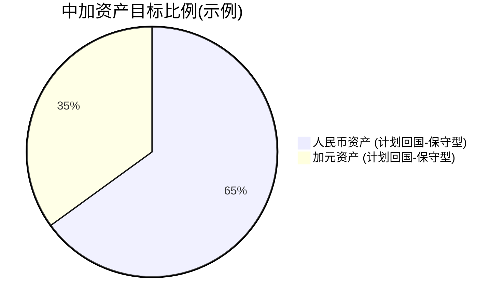
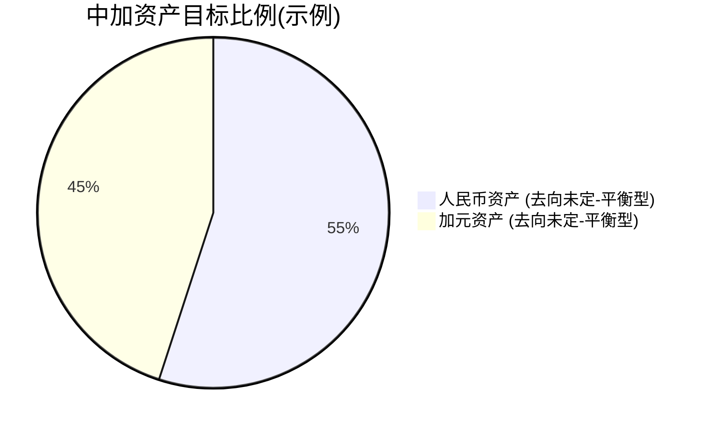
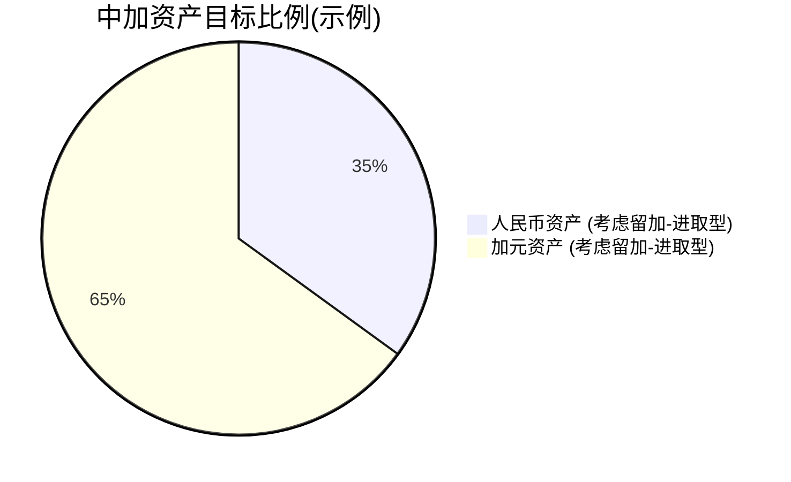
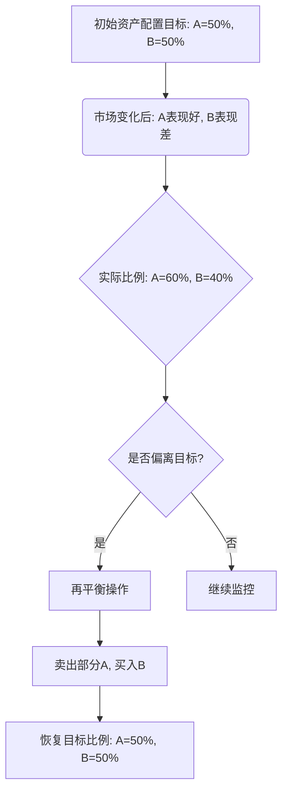
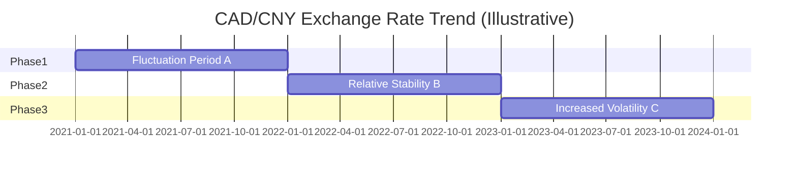

# 第七章：跨境资产配置原则与实践

当您作为一名中国精英，踏上为期三年的加拿大工作之旅时，您不仅面临着职业生涯的新挑战，更迎来了一个重塑个人全球财务版图的绝佳契机。在初步安顿并熟悉加拿大金融体系之后，如何有效整合您在中国和加拿大的资产，制定科学的跨境投资策略，将直接决定您能否在这三年中实现财富的稳健增值，并为未来的财务目标打下坚实基础。

本章将聚焦于"3年工作期"这一特定情境下的跨境资产配置核心原则与实践方法。我们将从全局视角出发，探讨如何再平衡您的中加资产，管理复杂的货币风险，制定符合短期流动性与安全性的投资方案，并为可能的中期目标（如回国发展或继续海外生活）进行前瞻性布局。最后，本章还将引入"核心-卫星"这一经典投资策略，并解析其在跨境投资场景下的具体应用，为您提供一套既稳健又灵活的资产配置框架。

跨境资产配置并非一蹴而就的简单任务，它需要您结合自身的财务状况、风险承受能力、未来规划以及对两国市场的理解，进行动态的、个性化的调整。本章旨在为您提供一套系统性的思考工具和实操指引，助您在枫叶之国运筹帷幄，决胜千里。

## 7.1 再平衡你的全球资产：基于新环境调整中加资产比例

踏足加拿大，意味着您的个人财务版图从单一国家扩展到了全球视野。原有的以人民币计价为主的资产结构，需要根据新的生活环境、工作状态以及未来规划进行战略性的审视与调整。再平衡您的全球资产，特别是合理调整在中国和加拿大的资产比例，是跨境投资成功的第一步。

### 7.1.1 理解全球资产配置的必要性

在全球化日益深入的今天，将所有资产局限于单一国家或单一市场，无疑会放大风险并错失多元化的增长机遇。对于计划在加拿大工作生活3年的您而言，全球资产配置的意义尤为重大。

#### 7.1.1.1 分散风险：国别风险与市场风险

"不要把所有鸡蛋放在同一个篮子里"这句古老的投资谚语，在全球资产配置中体现得淋漓尽致。
*   **国别风险 (Country Risk):** 每个国家都有其独特的政治、经济、法律及社会环境风险。例如，政策突变、经济周期波动、特定行业监管收紧等，都可能对该国资产的价值产生重大影响。通过将资产分散到不同国家（如中国和加拿大），可以有效降低因某一特定国家发生不利事件而导致整体财富遭受重创的风险。
*   **市场风险 (Market Risk):** 不同国家、不同类型的金融市场（股市、债市、房地产市场等）往往不会完全同涨同跌，它们之间存在一定的负相关性或弱相关性。例如，当中国A股市场表现不佳时，加拿大股市可能表现稳健，反之亦然。通过配置不同市场的资产，可以在一定程度上平滑整体投资组合的波动。

#### 7.1.1.2 捕捉全球增长机会

不同国家和地区在经济发展的不同阶段，会展现出不同的增长潜力和投资机会。中国作为快速发展的新兴市场，在某些领域（如科技创新、消费升级）可能拥有高成长性机会；而加拿大作为成熟发达国家，在资源、金融服务、稳定收益型资产等方面则具备独特优势。
通过全球资产配置，您可以根据各市场的特点和自身的投资目标，灵活捕捉不同区域的增长红利，而不是仅仅局限于本土市场的机会。

#### 7.1.1.3 对冲单一货币风险

如果您的资产和收入完全以单一货币（如人民币）计价，那么您将完全暴露在该货币的汇率波动风险之下。对于需要在加拿大生活和消费的您来说，人民币对加元的汇率变动会直接影响您的购买力。
通过持有不同币种的资产（如人民币资产和加元资产），可以在一定程度上对冲汇率风险。当一种货币贬值时，另一种货币的相对升值可以弥补部分损失。

### 7.1.2 评估当前资产状况（回顾第一章）

在进行全球资产再平衡之前，清晰了解您当前的财务全貌是至关重要的。这需要您回顾本书第一章《审视家底——中国资产盘点与优化》的内容，并结合您在加拿大的初期财务状况进行更新。

#### 7.1.2.1 中国境内资产的再审视

*   **流动资产：** 现金、银行存款、货币基金、短期理财产品等。评估其规模、收益率以及转换为加元或其他币种的便利性和成本。
*   **金融投资：** 股票（A股、港股）、公募/私募基金、债券、信托、保险产品等。分析其当前的市值、风险等级、未来预期以及远程管理的可行性。
*   **固定资产：** 主要是房产。明确其当前市场估值、是否有按揭贷款、出租情况（现金流）、未来处置计划（持有、继续出租或择机出售）。
*   **负债：** 房贷、车贷、消费贷、信用卡欠款等。统计总额、利率、还款期限和方式。

#### 7.1.2.2 加拿大初期资产的形成

*   **安家资金：** 您为初期生活、租房押金、购买必需品等带来的加元资金。
*   **银行账户余额：** 在加拿大本地银行开设的支票账户和储蓄账户中的加元。
*   **初期收入：** 如果已经开始工作，您的第一笔或前几笔加元薪资收入。
*   **潜在负债：** 是否申请了加拿大本地信用卡，或有其他本地借款。

综合以上两方面，绘制一张更新的个人/家庭跨境资产负债表，将是您制定再平衡策略的基石。

### 7.1.3 确定新的资产配置目标比例

明确了当前的资产状况后，下一步是设定一个切合实际的、新的全球资产配置目标比例，特别是中加两国资产的比例。这个比例并非一成不变，而是需要根据多种因素动态调整。

#### 7.1.3.1 影响中加资产比例的关键因素

*   **工作期限（3年）：** 这是一个中短期的时间窗口。对于3年内需要在加拿大产生的明确支出（如生活费、房租、旅游等），应确保有足够的加元流动性资产覆盖。
*   **未来规划：**
    *   **计划3年后回国：** 如果回国意愿强烈，那么人民币资产仍应占据重要地位，加元资产的配置更侧重于3年内的生活开销、应急储备以及短期稳健投资。同时，也需要考虑将部分在加积累的财富安全、合规地转回国内。
    *   **考虑长期留在加拿大或移民：** 如果有此打算，则应逐步增加加元资产的配置比例，更深入地参与加拿大的长期投资（如RRSP、房地产等），并相应调整中国资产的结构。
    *   **未来不确定：** 若尚未决定，则应采取更为均衡和灵活的策略，保持一定的资产流动性，以便根据未来决策快速调整。
*   **风险承受能力：** 您对投资风险的接受程度直接影响资产配置的积极性。风险承受能力较高者，可以考虑在新市场（加拿大）配置较高比例的成长型资产；保守型投资者则应更注重资产的保值和流动性。
*   **两国市场预期：** 您对中加两国未来经济和市场走势的判断，也会影响您的配置偏好。但这需要基于理性的分析而非短期情绪。
*   **家庭状况：** 是否有家庭成员一同在加拿大生活，是否有子女教育等安排，都会影响资产配置的重心。

#### 7.1.3.2 短期（3年内）与中长期（回国后/留下）目标的差异化配置

*   **短期（加拿大工作期）：**
    *   **加元资产：** 主要满足生活开支、应急储备、短期旅游、以及利用TFSA等账户进行稳健的免税增值。流动性和安全性是首要考量。
    *   **人民币资产：** 对于暂时不用的资金，可继续在中国进行稳健理财或投资，关注流动性以便需要时转换。对于需要远程管理的资产，确保操作便捷安全。
*   **中期（3年后）：**
    *   **若回国：** 提前规划加元资产如何处置（变现、转回），以及回国后的投资方向和人民币资产的再配置。
    *   **若留下：** 逐步将资产重心向加拿大转移，规划长期投资（如养老金、子女教育基金、房产等），并考虑如何优化全球税务负担。

#### 7.1.3.3 案例分析：不同风险偏好下的目标比例设定

假设一位投资者当前总净资产为200万人民币等值。
*   **案例一：保守型投资者，计划3年后确定回国。**
    *   **目标：** 保证在加3年生活品质，资金安全，略有增值。
    *   **可能的中加资产目标比例（仅为示例）：**
        *   人民币资产：60-70% （主要为国内稳健理财、定期存款、低风险基金，少量优质蓝筹股）
        *   加元资产：30-40% （主要为高息储蓄、GIC、TFSA内配置的短期债券ETF，少量用于生活开销的流动资金）
*   **案例二：平衡型投资者，未来去向未定，但对加拿大市场有一定兴趣。**
    *   **目标：** 覆盖在加开销，利用加拿大投资工具实现资产增值，同时保留回国选项。
    *   **可能的中加资产目标比例（仅为示例）：**
        *   人民币资产：50-60% （国内稳健理财+部分A股/港股指数基金）
        *   加元资产：40-50% （TFSA充分利用并配置平衡型ETF，部分资金投资加拿大蓝筹股或房地产投资信托REITs，高息储蓄）
*   **案例三：进取型投资者，考虑长期留加可能性较大，风险承受能力较高。**
    *   **目标：** 最大化全球资产增值，积极参与加拿大市场投资。
    *   **可能的中加资产目标比例（仅为示例）：**
        *   人民币资产：30-40% （国内成长型基金、优质股票，部分资金考虑通过QDII等渠道投资海外）
        *   加元资产：60-70% （积极利用TFSA和RRSP，配置加拿大/美国股票ETF，成长型股票，甚至考虑早期参与加拿大房地产投资）

**重要提示：** 以上比例仅为高度简化的示例，实际配置需结合个人详细财务分析和专业建议。





### 7.1.4 调整策略与路径

确定了新的资产配置目标比例后，如何从当前状态调整到目标状态，需要一个清晰的策略和路径。

#### 7.1.4.1 增量资金的优先配置方向

对于您在加拿大工作期间获得的新的收入（主要是加元薪资），可以优先按照目标配置比例进行投资。
*   **优先填补加元资产的缺口：** 如果您的目标是增加加元资产比例，那么每月储蓄下来的加元应首先用于构建在加拿大的投资组合（如定投TFSA、购买GIC等）。
*   **部分转换为人民币：** 如果仍需维持或增加人民币资产比例，或有国内的特定资金需求（如偿还人民币贷款），可以考虑在合适的汇率时点将部分加元收入换汇转回国内。

#### 7.1.4.2 存量资产的逐步调整

调整存量资产，尤其是大规模的、流动性较差的资产（如中国房产），通常需要更长的时间和更周全的计划。
*   **流动性好的人民币资产：** 如银行存款、货币基金、短期理财，可以根据需要和汇率情况，分批转换为加元，用于配置加拿大的投资。
*   **中国金融投资：** 对于股票、基金等，可以根据市场情况和您的配置目标，逐步减持部分仓位，将资金转移出来。注意交易成本和可能的税费。
*   **中国房产：** 这是调整难度最大的部分。
    *   **若计划长期持有：** 确保有可靠的远程管理方案（如委托家人或专业机构出租和维护）。
    *   **若计划出售：** 需要关注中国房地产市场走势、限售政策、交易流程、税费以及资金如何合规出境等复杂问题，务必寻求专业建议。通常不建议在短期内（如3年内）仅仅为了调整资产比例而仓促出售主要房产，除非有明确的变现需求或认为房产风险过高。

#### 7.1.4.3 跨境资金流动的合规性考量（回顾第二章）

无论是将人民币资金转往加拿大，还是将加元资金转回中国，都必须严格遵守两国的外汇管理和反洗钱法规。回顾第二章《政策解读——中国外汇与跨境法规》中关于个人购汇额度、资金出境渠道、CRS申报等内容至关重要。
*   **避免使用非正规渠道进行大额资金跨境转移，** 以免触犯法律法规，导致资金损失或法律风险。
*   对于大额资金的跨境流动，建议咨询银行和专业税务/法律顾问，确保操作的合规性。

### 7.1.5 定期审视与再平衡机制

资产配置并非一劳永逸，市场在变，您的个人情况也在变。建立一个定期审视和再平衡的机制，是确保您的投资组合始终与目标保持一致的关键。

#### 7.1.5.1 为何需要再平衡？

*   **市场波动导致比例偏离：** 不同资产类别的表现不同，会导致您的实际资产比例偏离最初设定的目标比例。例如，如果加拿大股市表现优异，您的加元股票资产占比可能会超出预期，从而增加了整体投资组合的风险。
*   **个人财务状况变化：** 收入水平、支出需求、家庭成员变化等，都可能需要您重新评估和调整资产配置目标。
*   **投资目标或风险偏好调整：** 随着时间的推移，您对未来的规划可能更加清晰，风险承受能力也可能发生变化。

#### 7.1.5.2 再平衡的触发条件

*   **基于时间的再平衡：** 例如，每半年或每年度在固定时间点（如年底、年中）检查资产配置比例，并进行调整。这是最简单易行的方法。
*   **基于偏离度的再平衡：** 设定一个允许的偏离阈值（如目标比例的±5%或±10%）。当任何一类资产的实际比例超出这个阈值时，就触发再平衡操作。这种方法更为灵活，能更及时地应对市场变化，但需要更密切的监控。
*   **重大事件驱动的再平衡：** 当发生重大的个人财务事件（如获得大额奖金、失业、家庭成员增减）或市场极端波动时，也应主动审视并考虑是否需要再平衡。

#### 7.1.5.3 再平衡的操作方法

再平衡的核心思想是"卖出表现较好（占比过高）的资产，买入表现较差（占比过低）的资产"，使其恢复到目标比例。
*   **利用新增资金：** 如果您有新的资金投入，可以优先投向占比偏低的资产类别，这是一种成本较低的再平衡方式。
*   **直接调整存量：** 如果没有新增资金，或偏离度较大，则需要卖出部分高占比资产，用所得资金买入低占比资产。此时需要考虑交易成本（佣金、税费）和市场冲击。



**大师提醒：** 再平衡的目的是控制风险，而非追求短期收益最大化。频繁的再平衡可能会增加交易成本，并可能错失某些资产的长期上涨趋势。因此，找到适合自己的再平衡频率和方法非常重要。

## 7.2 货币风险管理：加元 vs. 人民币汇率波动应对

对于跨境投资者而言，汇率风险是一个无法回避的议题。当您的资产、收入和支出涉及多种货币时（在您的情况下，主要是加元CAD和人民币CNY），两国货币之间的汇率波动将直接影响您的资产价值、投资回报以及在不同国家的生活成本。在为期3年的加拿大工作期间，有效地管理货币风险至关重要。

### 7.2.1 理解货币风险及其对跨境投资者的影响

#### 7.2.1.1 什么是汇率风险 (Exchange Rate Risk)？

汇率风险，也称为外汇风险 (Foreign Exchange Risk)，是指由于汇率（一种货币相对于另一种货币的价格）发生不利变动，而导致个人或企业遭受经济损失的可能性。
例如，如果您持有人民币资产，并计划将其转换为加元在加拿大使用。如果人民币兑加元贬值（即需要更多人民币才能兑换相同数量的加元），那么您的人民币资产在转换为加元后的实际价值就会下降。

#### 7.2.1.2 汇率波动对资产价值和购买力的影响

*   **对资产价值的影响：**
    *   **人民币升值/加元贬值：** 如果人民币对加元升值，您持有的人民币资产在折算成加元时会更值钱；反之，您持有的加元资产在折算成人民币时价值会缩水。
    *   **人民币贬值/加元升值：** 如果人民币对加元贬值，您持有的人民币资产折算成加元时价值会减少；而您持有的加元资产折算成人民币时会更值钱。
*   **对购买力的影响：**
    *   如果您主要收入是人民币，但在加拿大用加元消费。若人民币贬值，您需要用更多的人民币换取加元，导致在加拿大的购买力下降。
    *   如果您主要收入是加元，并计划将部分储蓄换成人民币用于国内消费或投资。若加元贬值，您能换到的人民币就会减少。

#### 7.2.1.3 3年工作期内汇率风险的特殊性

*   **中短期风险暴露：** 3年的时间窗口相对较短，您可能没有足够长的时间来平滑汇率的短期大幅波动。一次不利的汇率变动可能对您3年内的财务目标产生显著影响。
*   **资金双向流动需求：** 您可能既有将人民币换成加元用于在加生活的需求，也有在工作期结束时将积累的加元换回人民币（如果计划回国）的需求。这意味着您在两个方向上都可能面临汇率风险。
*   **心理预期管理：** 对于不常接触外汇市场的个人而言，汇率的日常波动可能会带来焦虑感。

### 7.2.2 加元与人民币汇率历史回顾与展望

理解影响汇率的主要因素和历史走势，有助于您对未来的汇率波动形成一个更为理性的预期，但请注意，历史数据不代表未来，任何对汇率的预测都存在不确定性。

#### 7.2.2.1 影响CAD/CNY汇率的主要因素

CAD/CNY的汇率（即1加元可以兑换多少人民币，或1人民币可以兑换多少加元）受到多种复杂因素的驱动：
*   **两国经济基本面：**
    *   **经济增长率 (GDP)：** 经济增长强劲的国家，其货币通常更具吸引力。
    *   **通货膨胀率 (Inflation)：** 高通胀通常会导致货币贬值。
    *   **就业数据：** 强劲的就业市场支持货币走强。
    *   **贸易差额：** 持续的贸易顺差通常利好本币。
*   **利率政策与利差：**
    *   **央行利率决策：** 加拿大央行 (Bank of Canada) 和中国人民银行 (People's Bank of China) 的利率调整会直接影响两国货币的相对吸引力。一国提高利率，通常会吸引资本流入，推高其货币价值。
    *   **两国利差：** 两国之间的利率差异是影响汇率的重要因素。
*   **大宗商品价格（尤其对加元）：** 加拿大是重要的资源出口国（尤其是石油、天然气、金属矿产）。国际大宗商品价格（特别是油价）的波动对加元汇率有显著影响。油价上涨通常利好加元。
*   **全球风险偏好：** 在全球金融市场动荡、避险情绪升温时，美元、日元等传统避险货币可能走强，而与大宗商品相关的货币（如加元）或新兴市场货币（如人民币在某些情况下）可能承压。
*   **资本流动：** 国际资本的流向会影响外汇市场的供求关系，从而影响汇率。
*   **政府干预与外汇政策：** 两国政府的外汇管理政策和市场干预行为也会对汇率产生影响。
*   **地缘政治事件：** 重大的国际政治事件也可能引发汇率的短期剧烈波动。

#### 7.2.2.2 近期汇率走势分析

*   **（此处可插入一个简化的CAD/CNY近年汇率走势图的文字描述或Mermaid图表占位符，提示用户自行查阅实时数据）**
    *   例如：近年来，CAD/CNY汇率受到全球疫情、俄乌冲突、主要经济体货币政策分化、中国经济结构调整以及国际油价波动等多重因素影响，呈现出一定的波动性。
    *   建议关注权威财经新闻网站或银行提供的外汇图表，了解过去1年、3年、5年的CAD/CNY（或USD/CNY与USD/CAD的交叉汇率）走势。


*   **实际操作：** 您可以通过中国银行、工商银行等大型商业银行官网或App，或者加拿大主要银行（RBC, TD, BMO, Scotiabank, CIBC）的官网查询当前的CAD/CNY汇率及历史数据。也可以参考XE.com等专业外汇网站。

#### 7.2.2.3 专业机构对未来汇率的预测

许多大型金融机构的经济学家和外汇策略师会定期发布对主要货币汇率的预测。
*   **获取渠道：** 这些预测通常可以在机构的研究报告、财经新闻（如路透、彭博、华尔街日报金融版）中找到。
*   **理性看待：** 需要强调的是，汇率预测难度极大，不同机构的观点可能存在显著差异，且市场常常会走出超预期的行情。**任何预测都应仅作为参考，不能作为投资决策的唯一依据。**
*   **关注预测逻辑：** 比起具体的预测数字，更重要的是理解机构做出预测背后的逻辑和所依赖的关键假设。

### 7.2.3 自然对冲策略 (Natural Hedge)

自然对冲是指通过调整自身的经济活动或资产负债结构，来自然地抵消部分汇率风险，而无需借助复杂的金融衍生工具。

#### 7.2.3.1 资产与负债的币种匹配

这是最基本的自然对冲方法。尽量使您在某一币种下的资产与负债相匹配。
*   **示例：** 如果您在加拿大有加元计价的抵押贷款或车贷，那么持有相应的加元资产（如GIC、加元储蓄）或拥有稳定的加元收入流，就可以在一定程度上对冲这部分负债的汇率风险。当加元贬值时，您的负债折算成其他货币虽然减少了，但您的加元资产或收入的价值也在相应降低，反之亦然。

#### 7.2.3.2 收入与支出的币种匹配

尽量使您的主要收入币种与主要支出币种保持一致。
*   **在加拿大生活：** 您在加拿大的日常开销（房租、食物、交通、娱乐等）主要是以加元支付。如果您在加拿大的主要收入也是加元（如工资），那么这部分日常运营层面的汇率风险就相对较小。
*   **计划回国后的支出：** 如果您计划3年后回国，并且预期在国内有较大额的人民币支出（如购房首付、子女教育），那么在国内保留或积累一定量的人民币资产，或计划将部分加元储蓄在合适时机换回人民币，就形成了对未来人民币支出的自然对冲。

#### 7.2.3.3 案例：如何通过本地化生活降低汇率敏感度

王先生在加拿大工作，每月薪资为8000加元。他的主要生活开销（房租、水电、伙食、交通、通讯等）约为4000加元。
*   由于他的收入和主要即期支出都是加元，这4000加元的购买力基本不受CAD/CNY汇率的直接影响。
*   对于他储蓄下来的4000加元，如果他计划未来用于在加拿大本地的投资或大额消费（如购买本地商品或服务），那么这部分资金的汇率风险也相对较低。
*   只有当他计划将这部分储蓄换成人民币或其他外币时，才会直接面临汇率波动的影响。

通过尽可能地使收入、支出、资产、负债在币种上"本地化"和匹配，可以降低您对汇率波动的直接敏感度。

### 7.2.4 主动对冲工具与策略

对于自然对冲无法完全覆盖的汇率风险，或者当您对汇率有明确的预期并希望主动管理风险时，可以考虑使用一些金融工具。但需要强调的是，这些工具通常较为复杂，涉及成本，且可能带来新的风险，对于非专业个人投资者应谨慎使用。

#### 7.2.4.1 外汇远期合约 (Forex Forward Contracts)

*   **定义：** 远期合约是交易双方约定在未来某一特定日期，按照约定的汇率买卖特定数量的某种货币。
*   **作用：** 可以帮助锁定未来的换汇成本或收益，从而规避汇率波动风险。
*   **示例：** 如果您预计在6个月后需要将10万加元换成人民币汇回国，担心届时加元贬值。您可以与银行签订一份6个月期的加元卖出远期合约，锁定一个未来的CAD/CNY汇率。无论6个月后即期汇率如何变动，您都将按照合约约定的汇率进行兑换。
*   **适用性：** 银行通常对个人办理远期合约有一定门槛（如金额要求），且合约一旦签订即有履约义务。适合有较大额、确定性较强的未来外汇收支需求的个人。

#### 7.2.4.2 外汇期权 (Forex Options)

*   **定义：** 外汇期权赋予持有者在未来某一特定日期或之前，以约定价格买入或卖出特定数量某种货币的"权利"（而非义务）。买方需要支付一定的期权费 (Premium)。
*   **作用：** 相比远期合约，期权更为灵活。如果汇率向有利方向变动，您可以放弃行使期权，选择按更有利的即期汇率交易（损失的仅是期权费）；如果汇率向不利方向变动，您可以行使期权，锁定一个最差的汇率。
*   **示例：** 您计划3个月后用人民币购买价值5万加元的商品，担心人民币贬值。您可以购买一份3个月期的人民币看跌/加元看涨期权。
*   **适用性：** 外汇期权比远期更复杂，期权费的定价也受多种因素影响。个人投资者直接参与场外外汇期权交易的渠道有限，成本也可能较高。

#### 7.2.4.3 货币ETF或结构性产品 (Currency ETFs/Structured Products)

*   **货币ETF：** 某些国家（如美国）有追踪特定货币汇率或一篮子货币指数的ETF。通过买卖这类ETF，可以在一定程度上间接对冲汇率风险或进行方向性押注。加拿大市场上的货币ETF选择相对较少。
*   **结构性产品：** 银行有时会推出与汇率挂钩的结构性存款或理财产品，提供有条件的保本或增强收益，同时内嵌了某种形式的汇率对冲或投机机制。投资者需要仔细阅读产品说明，理解其复杂的风险收益结构。
*   **适用性：** 对于普通个人投资者，这些产品的透明度和成本效益需要仔细评估。

#### 7.2.4.4 对于短期个人投资者的适用性与局限性

*   **成本：** 主动对冲工具通常涉及交易成本、手续费或隐含的费用（如远期的买卖价差、期权费），这些成本会侵蚀您的潜在收益。
*   **复杂性：** 理解这些工具的运作机制和风险需要一定的专业知识。
*   **门槛：** 某些工具（如场外远期和期权）可能对个人投资者有较高的资金门槛。
*   **风险：** 如果判断失误，主动对冲不仅无法规避风险，反而可能造成额外损失。
**建议：** 对于大多数仅在加拿大工作3年的个人投资者，除非有非常大额且时间点确定的跨境资金流动需求，否则不必过于追求复杂的主动对冲工具。优先考虑自然对冲和下述的非金融对冲手段。如果确实需要，务必咨询银行的专业人士或财务顾问。

### 7.2.5 非金融对冲手段

除了上述策略外，还有一些更为简单易行的非金融方法可以帮助您管理汇率风险。

#### 7.2.5.1 分期换汇策略 (Dollar-Cost Averaging for Currency)

如果您有持续的换汇需求（例如，每月将部分加元收入换成人民币，或定期将人民币储蓄换成加元），可以采取分期、分批换汇的方式，而不是试图预测最佳汇率点一次性完成。
*   **原理：** 通过在不同时间点以不同汇率进行兑换，可以平滑掉短期汇率波动的影响，获得一个相对平均的换汇成本。这类似于基金定投的理念。
*   **操作：** 例如，设定每月固定日期或在汇率达到某个心理价位时换取一定金额。

#### 7.2.5.2 持有多币种资产

如7.1节所述，在全球资产配置的框架下，自然地持有多币种资产（如一部分人民币资产，一部分加元资产，甚至少量美元或其他主要货币资产），本身就是一种有效的汇率风险分散方式。
*   当一种货币相对弱势时，另一种货币可能相对强势，从而在整体资产价值上起到一定的平衡作用。

#### 7.2.5.3 心理建设：接受一定程度的汇率波动

对于无法完全对冲或没有必要对冲的汇率风险敞口，培养正确的心理预期非常重要。
*   **认识到汇率波动是常态：** 没有任何一种货币的汇率是永远固定不变的。接受一定程度的波动是参与全球经济活动的必然部分。
*   **关注长期趋势而非短期噪音：** 避免因每日的汇率小幅波动而过度焦虑或频繁操作。
*   **聚焦于核心财务目标：** 只要汇率波动没有严重影响您的核心财务目标（如在加拿大的生活质量、必要的储蓄计划），就可以在战略上保持一定的定力。

**总结：** 货币风险管理是一个系统工程，需要结合您的具体情况、风险承受能力和成本效益综合考量。对于3年工作期的跨境精英，以自然对冲和简单的非金融对冲手段为主，辅以对主动对冲工具的了解（并在必要时谨慎使用），通常是更为稳妥和有效的方法。

## 7.3 短期（<3年）投资策略：流动性、安全性优先

对于仅在加拿大工作3年的您来说，这段时间内的投资策略应具有鲜明的"短期"特征。与长达数十年甚至更久的传统投资规划不同，3年时间窗口对投资组合的构建提出了特殊的要求，其中流动性和安全性往往需要被置于比追求高收益更优先的地位。

### 7.3.1 短期投资目标与约束条件

在制定短期投资策略之前，必须清晰地认识到这一阶段的核心目标和客观存在的约束。

#### 7.3.1.1 3年时间窗口的特性："短、平、快"？

*   **短 (Short Duration):** 3年（36个月）在投资领域通常被视为短期。这意味着没有足够长的时间来完全消化市场的剧烈波动，或者等待某些长期投资策略开花结果。一次较大的市场回调，如果在您计划用款之前发生且未能恢复，可能会对您的财务计划造成实质性影响。
*   **平 (Smooth Ride Preferred):** 由于时间短，投资者通常期望投资净值曲线相对平稳，避免大起大落。心理上，短期内经历较大亏损的承受能力也较低。
*   **快 (Quick Access to Funds):** 您可能在3年内的不同时间点有资金需求，例如大额消费、回国探亲、应对突发事件，或者在工作期结束时需要将大部分资金变现。因此，投资的流动性，即资金转换为现金的难易程度和速度，非常重要。

#### 7.3.1.2 资本保值的重要性 (Capital Preservation)

在短期投资中，保护本金的安全往往比追求高额回报更为关键。如果本金发生较大损失，在短短3年内通过后续投资完全弥补回来的难度很大。因此，风险控制是短期投资的首要任务。任何投资决策都应首先评估其潜在的最大损失，并确保该损失在您的可承受范围之内。

#### 7.3.1.3 流动性需求：应急资金与潜在机会

*   **应急资金 (Emergency Fund):** 在异国他乡生活，保留一笔随时可取的应急资金（通常建议覆盖3-6个月的生活开销）至关重要，以应对失业、疾病、家庭急事等不可预见的支出。这部分资金应投资于流动性最高、风险最低的资产。
*   **潜在机会与支出：** 3年内您可能会遇到一些计划内或计划外的支出，如购买大件耐用品、短期旅游、职业培训，或是发现一些短暂的投资机会。因此，部分投资也需要具备较好的流动性。

#### 7.3.1.4 税务效率的考量 (TFSA的优先利用)

正如第六章所述，加拿大的免税储蓄账户 (TFSA) 是一个强大的税务优惠工具。对于短期投资者而言，将符合条件的投资置于TFSA中，可以使投资收益（利息、股息、资本利得）完全免税，这对于提升短期投资的实际回报率非常有帮助。因此，在制定短期投资策略时，应优先考虑最大限度地利用您可用的TFSA供款额度。

### 7.3.2 构建短期投资组合的核心原则

基于以上目标与约束，短期投资组合的构建应遵循以下核心原则：

#### 7.3.2.1 安全性第一：避免高风险、高波动性资产

*   **选择低风险投资工具：** 优先考虑那些信用等级高、历史波动性低、本金损失风险小的投资产品。
*   **规避投机性资产：** 避免将主要资金投入到如个别小型成长股、加密货币、高风险衍生品等波动巨大、前景不明的资产类别中。虽然这些资产可能带来高回报，但短期内也可能导致巨额亏损。
*   **适度分散：** 即使是低风险投资，也应进行适度分散，避免将所有短期资金集中在单一机构的单一产品上（例如，要注意单个金融机构的存款保险上限，如CDIC的保障范围）。

#### 7.3.2.2 流动性第二：确保资金可以快速变现

*   **选择易于变现的资产：** 投资应能以较小的成本和较短的时间转换回现金。
*   **注意锁定期和提前支取条款：** 对于某些定期产品（如GIC），要了解其是否有锁定期，以及提前支取的条件和罚金。
*   **构建流动性阶梯：** 可以将短期资金根据预期的使用时间，配置到不同流动性的产品上。例如，应急资金放入活期高息储蓄，几个月内可能用到的资金放入短期GIC或货币市场基金。

#### 7.3.2.3 收益性第三：在安全和流动的基础上追求合理回报

在确保了安全性和流动性的前提下，再力求获得一个合理的、与所承担风险相匹配的回报。
*   **不盲目追求高收益：** 高收益往往伴随着高风险。对于短期投资，接受一个相对温和但稳健的回报率，通常是更明智的选择。
*   **比较不同低风险产品的收益：** 在同等风险和流动性水平下，货比三家，选择收益率相对更优的产品。例如，不同银行的HISA利率可能不同，不同期限的GIC利率也不同。
*   **考虑税后收益：** 如前所述，利用TFSA可以有效提高税后收益。

### 7.3.3 适合短期投资的资产类别（加拿大市场为主，结合第六章）

结合第六章对加拿大投资市场的介绍，以下是一些适合在3年短期内重点考虑的资产类别：

#### 7.3.3.1 高息储蓄账户 (High-Interest Savings Accounts, HISAs) 和现金等价物

*   **特点：**
    *   **安全性高：** 通常由加拿大存款保险公司 (CDIC) 成员机构提供，在保险额度内（目前通常为每账户类别每会员机构10万加元）本金有保障。
    *   **流动性极高：** 资金通常可以随时存取，没有限制。
    *   **收益：** 利率通常高于传统银行的支票账户或普通储蓄账户，但会随市场利率波动。数字银行（如EQ Bank, Tangerine）或某些信用合作社 (Credit Unions) 通常提供更具竞争力的HISA利率。
*   **投资策略：**
    *   是存放应急资金的最佳选择。
    *   可作为短期内随时可能动用资金的临时停泊港。
    *   可以在TFSA内开设HISA，使利息收入免税。
*   **注意事项：** 某些HISA的促销高利率可能有期限或附加条件，需仔细阅读条款。

#### 7.3.3.2 短期担保投资证 (Short-Term Guaranteed Investment Certificates, GICs)

*   **特点：**
    *   **安全性高：** 与HISA类似，符合条件的GIC也受到CDIC的保障。
    *   **固定收益：** 在购买时即锁定利率和期限，收益确定。
    *   **流动性：** 通常有固定期限（如3个月、6个月、1年、2年、3年）。在到期前一般不可赎回 (Non-redeemable GIC)，或者提前赎回会损失部分利息甚至本金 (Cashable/Redeemable GIC，但其利率通常较低)。
*   **投资策略：**
    *   适合那些在未来特定时间点（如1年后、2年后）有明确资金需求，且在此期间不需要动用这笔钱的投资者。
    *   可以构建GIC阶梯 (GIC Laddering)：将资金分成几份，分别购买不同期限的GIC（如1/3买1年期，1/3买2年期，1/3买3年期）。这样每年都有一笔GIC到期，既能享受相对较高的长期GIC利率，又能保持一定的流动性。
    *   同样可以在TFSA内购买GIC，利息免税。
*   **注意事项：** Non-redeemable GIC的流动性较差，购买前需确认资金在该期限内不会被动用。

#### 7.3.3.3 货币市场基金 (Money Market Funds / Money Market ETFs)

*   **特点：**
    *   **低风险：** 主要投资于短期、高质量的债务工具（如政府短期债券、银行承兑汇票、商业票据等）。目标是保持净值稳定（通常为每单位10加元）并提供少量利息收入。
    *   **高流动性：** 基金份额通常可以每日赎回。货币市场ETF像股票一样在交易所交易，流动性也很好。
    *   **收益：** 收益率通常略高于HISA，但也会随市场利率波动。
*   **投资策略：**
    *   可作为现金的替代管理工具，用于存放短期闲置资金，追求略高于银行活期存款的收益。
    *   适合不确定何时需要用钱，但又希望获得一定收益的投资者。
*   **注意事项：** 虽然风险极低，但货币市场基金并不保本，理论上净值仍有跌破面值的可能（尽管非常罕见）。此外，基金会收取一定的管理费 (MER)，会影响最终收益。

#### 7.3.3.4 短期债券/债券ETF (Short-Term Bonds/Bond ETFs)

*   **特点：**
    *   **风险：** 短期债券（通常指剩余期限在1-5年或更短的债券）的利率风险和信用风险相对低于长期债券。投资于高质量的政府短期债券或投资级公司短期债券，风险较低。
    *   **收益：** 收益率通常高于货币市场基金，但也会随市场利率波动。债券价格与利率呈反向关系。
    *   **流动性：** 单个债券的流动性可能不一，但投资于短期债券ETF则具有良好的流动性，ETF份额可在交易所随时买卖。
*   **投资策略：**
    *   对于风险承受能力略高于GIC或货币市场基金，并希望获得稍高收益的短期投资者，可以考虑配置一部分短期债券ETF（例如，追踪加拿大短期政府债券指数或综合短期债券指数的ETF）。
    *   应选择那些久期 (Duration) 较短的债券ETF，以降低利率敏感性。
    *   可在TFSA内持有，使利息和资本利得（若有）免税。
*   **注意事项：** 即使是短期债券，在利率快速上升的环境下，其价格也可能下跌，导致短期内账面亏损。债券ETF会收取管理费 (MER)。

#### 7.3.3.5 低波动性股息股/ETF (适度配置，谨慎选择)

*   **特点：**
    *   **风险：** 股票类资产本质上风险高于上述固定收益类产品。但某些历史上波动性较低、财务稳健、能持续派发稳定股息的蓝筹股（如公用事业、必需消费品、大型金融机构的股票），或专门投资于这类股票的低波动/股息ETF，其风险可能相对可控。
    *   **收益：** 潜在收益可能高于固定收益产品，包括股息收入和潜在的资本增值。
    *   **流动性：** 上市股票和ETF流动性好。
*   **投资策略：**
    *   **仅适合风险承受能力相对较高，且短期投资组合中已有充足安全垫（HISA, GIC等）的投资者，作为"卫星"配置的一小部分。**
    *   **严格筛选：** 选择那些股息增长历史良好、负债率低、现金流充裕、估值合理的公司或ETF。
    *   **分散投资：** 不要将过多资金集中在少数几只股票上。
    *   **3年时间仍短：** 必须认识到，即使是低波动股票，在3年内也可能遭遇市场系统性风险或个别公司风险，导致本金损失。
*   **注意事项：** **不建议将大部分短期资金投入股票类资产。** 如果配置，仓位务必严格控制。优先考虑在TFSA中持有，以使股息和资本利得免税。

### 7.3.4 短期投资的常见误区与规避

在进行短期投资时，一些常见的思维误区可能会导致不理想的结果。

#### 7.3.4.1 追逐短期热点与高收益陷阱

*   **误区：** 市场上总会有一些短期内涨幅惊人的"热点"或宣称能提供远超市场平均水平"高收益"的产品。短期投资者容易被这些表象所吸引，希望能"赚快钱"。
*   **风险：** 这些热点往往缺乏基本面支撑，波动巨大，来的快去的也快。所谓的高收益产品背后往往隐藏着高风险、不透明的结构或甚至是骗局。
*   **规避：** 坚持安全性优先的原则，不为短期诱惑所动。对任何承诺不切实际高回报的投资保持警惕。

#### 7.3.4.2 忽视交易成本与税收影响

*   **误区：** 在追求微薄的短期收益时，容易忽视交易佣金、账户管理费、基金管理费(MER)等成本，以及投资收益可能产生的税负。
*   **影响：** 这些成本和税费会直接侵蚀本已不高的短期投资回报。
*   **规避：**
    *   选择低成本的投资工具（如某些免佣金交易平台的ETF，低MER的指数基金）。
    *   仔细比较不同机构的收费标准。
    *   最大限度利用TFSA等税收优惠账户。

#### 7.3.4.3 缺乏明确的退出机制

*   **误区：** 投入资金时没有清晰地规划何时以及在何种情况下退出投资。
*   **影响：** 可能导致在需要用款时投资尚未到期或处于亏损状态，或者错过了最佳的变现时机。
*   **规避：**
    *   在投资之初就设定明确的投资期限或目标（例如，GIC到期日，或某个ETF达到预期收益/止损点）。
    *   定期审视投资，根据实际情况调整退出计划。

### 7.3.5 案例：为3年期目标配置的保守型与稳健型短期投资组合

以下为两个高度简化的示例组合，仅供说明思路，实际配置需个性化定制。假设投资者有10万加元可用于3年期投资，且已预留充足的活期应急资金。所有投资均考虑在TFSA内进行（若额度允许）。

**案例一：保守型短期投资组合**
*   **目标：** 绝对本金安全，追求超越通胀的稳定回报，流动性好。
*   **配置方案：**
    *   **30% HISA (高息储蓄账户):** 30,000加元。确保随时可取，利率可能随市场变动。
    *   **40% GIC Ladder (GIC阶梯):** 40,000加元。
        *   1年期GIC：13,333加元
        *   2年期GIC：13,333加元
        *   3年期GIC：13,334加元
        （每年都有GIC到期，可根据届时利率和需求再投资或取出）
    *   **30% 货币市场基金/ETF 或短期债券ETF (Short-Term Bond ETF with low duration):** 30,000加元。追求略高于HISA/GIC的收益，同时保持较好流动性和较低风险。
*   **预期特点：** 整体风险极低，收益相对稳定但有限，流动性管理良好。

**案例二：稳健型短期投资组合**
*   **目标：** 本金相对安全，追求温和的资本增值，兼顾流动性。
*   **配置方案：**
    *   **20% HISA:** 20,000加元。
    *   **30% GIC (可部分选择略长期限如2-3年，或Cashable GIC增加灵活性):** 30,000加元。
    *   **40% 加拿大短期/综合债券ETF (Canadian Short-Term or Aggregate Bond ETF):** 40,000加元。承担略高于货币市场基金的利率风险，以换取潜在更高回报。
    *   **10% 低波动加拿大股息ETF (Low Volatility Canadian Dividend ETF):** 10,000加元。小部分仓位尝试获取股市的阿尔法收益，股息可再投资。此部分需密切关注，并设有止损预期。
*   **预期特点：** 整体风险较低，收益潜力略高于保守型组合，大部分资产流动性好，小部分股票ETF带来一定波动性。

**重要提示：** 上述组合未考虑投资者的具体风险承受能力细节、确切的TFSA额度、以及市场当前利率环境等。在实际操作前，务必进行详细规划并咨询专业人士。

## 7.4 中期（考虑回国后）投资布局：兼顾两国机会

虽然您的加拿大工作期是3年，但在进行财务规划时，有远见地为3年后的"中期"阶段进行布局同样重要。这个中期阶段可能是您按计划返回中国发展，也可能是您选择继续在加拿大或其他国家寻求机会。无论何种选择，一个兼顾中加两国机会的中期投资策略，将为您未来的财务自由和生活品质提供有力支持。

### 7.4.1 定义中期投资目标与视野

#### 7.4.1.1 "回国后"的多样化情景

"回国后"并非单一情景，它可能意味着：
*   **重返原有行业或城市继续职业生涯。**
*   **寻求新的职业发展机会，可能涉及转行或创业。**
*   **进入半退休状态，或从事更为自由的职业。**
*   **在国内二三线城市或家乡享受较低成本的生活。**
*   **有明确的大额支出计划，如在国内购房、子女教育投入、改善生活品质等。**

不同的回国情景对资金的需求、风险承受能力以及投资回报的期望都会有所不同。

#### 7.4.1.2 中期投资的时间跨度

中期投资通常指3-7年，甚至可以延伸至10年。这个时间跨度允许投资者承担适度的市场波动，以换取更高的潜在长期回报。与3年内的短期投资相比，中期投资可以更积极地配置成长型资产。

#### 7.4.1.3 中国与加拿大市场的长期潜力评估

*   **中国市场：**
    *   **优势：** 巨大的国内市场、持续的城镇化进程、科技创新的投入、部分行业的全球竞争力、政策对特定新兴产业的支持。对于熟悉本土市场的中国投资者而言，更容易把握结构性机会。
    *   **挑战：** 经济增速放缓的压力、房地产市场调整、地方政府债务风险、资本市场波动性较大、政策不确定性等。
*   **加拿大市场：**
    *   **优势：** 成熟稳定的金融体系、丰富的自然资源、部分高科技行业（如AI、清洁能源）的发展、与美国市场的高度联动性、相对稳健的法律和政治环境。
    *   **挑战：** 经济体量相对较小、对资源行业的依赖、部分行业创新能力有待加强、房地产价格较高（某些城市）。

对两国市场的长期潜力进行客观评估，是制定中期跨境投资策略的基础。这意味着您需要持续关注两国的宏观经济动态、产业发展趋势和政策走向。

### 7.4.2 中期投资组合的资产配置考量

#### 7.4.2.1 风险承受能力与收益预期的再评估

随着投资期限的拉长，您可以适度提高风险承受能力，配置更高比例的权益类资产（如股票、股票型基金）。同时，对中期投资的收益预期也应更为现实，避免期望过高。设定一个合理的年化回报目标（例如，跑赢通胀并获得一定的超额收益）比追求短期暴利更为重要。

#### 7.4.2.2 跨市场、跨币种的分散化配置

中期投资组合应继续强调分散化原则：
*   **跨市场分散：** 根据对两国市场的判断，合理分配在中国市场和加拿大市场（甚至可以考虑配置少量美国或其他国际市场）的投资比例。
*   **跨币种分散：** 继续持有人民币和加元资产，并可根据需要和预期，考虑配置少量美元等硬通货资产，以对冲单一货币风险和地缘政治风险。
*   **跨资产类别分散：** 在股票、债券、现金、房地产（若条件允许）等不同资产类别之间进行配置。

#### 7.4.2.3 成长性与价值性的平衡

*   **成长性投资：** 投资于那些预期未来盈利增长速度较快的公司或行业（如科技、医疗保健、新兴消费等）。风险较高，但潜在回报也较高。
*   **价值性投资：** 投资于那些当前市场价格低于其内在价值的公司（如市盈率较低、股息率较高的成熟行业蓝筹股）。风险相对较低，追求稳定回报。
在中期投资组合中，根据市场环境和个人偏好，平衡配置成长性资产和价值性资产，有助于实现风险和收益的优化。

### 7.4.3 在加拿大为中期目标进行的投资布局

即使您计划3年后回国，在加拿大工作期间，也可以为更长远的中期目标进行一些前瞻性的投资布局。

#### 7.4.3.1 利用TFSA/RRSP的长期增值潜力（若适用）

*   **TFSA：** 即使您回国，TFSA账户中的投资收益依然是免税的（根据加拿大税法）。如果您的TFSA额度充足，可以考虑在其中配置一些具有长期增长潜力的ETF或个股，让其在未来几年持续享受免税复利。回国后您依然可以远程管理TFSA账户（但需确认券商是否支持非居民账户的持续操作及相关规定）。
*   **RRSP：** 如果您在加拿大工作期间因高收入而使用了RRSP额度，并且不打算在离境时立即取出（以避免较高的预扣税），那么RRSP中的资金也可以进行长期投资。但需注意，作为非税务居民从RRSP取款时，通常会有25%的预扣税（除非税收协定另有规定）。您需要权衡延税增长的好处与未来取款时的税务影响。

#### 7.4.3.2 投资于具有长期增长潜力的加拿大行业/ETF

如果看好加拿大的某些特定行业（如清洁能源、人工智能、资源升级等）或整体市场（如通过追踪S&P/TSX综合指数的ETF），可以在风险可控的前提下，配置一部分资金进行中期持有。

#### 7.4.3.3 加拿大房地产的考量（若有长期居住或投资意愿）

对于仅在加拿大工作3年且计划回国的人士，在加拿大购房通常不是优先选项，因为交易成本高、持有期间涉及管理和税费、且短期内市场波动风险较大。
但是，如果您有较强的意愿未来重返加拿大生活，或者纯粹从全球资产配置角度看好加拿大特定区域的房地产市场，并有足够的资金和风险承受能力，可以将其纳入中期（甚至长期）规划中。但这需要非常审慎的研究和专业的法律、税务建议，特别是考虑到外国买家税等政策。

### 7.4.4 为回国后的生活与投资做准备

如果您确定回国，那么在加拿大期间的部分投资行为也应服务于回国后的目标。

#### 7.4.4.1 中国资本市场的投资机会（A股、基金、理财产品）

*   **保持关注：** 即使身在加拿大，也应通过财经新闻、研究报告等方式，保持对中国资本市场动态的关注。
*   **远程操作：** 确保您国内的证券账户、银行账户等可以进行便捷、安全的远程操作。
*   **资金规划：** 规划好在工作期结束时，如何将部分在加拿大的储蓄/投资收益，合规、高效地转回国内，用于参与中国市场的投资。
*   **投资选择：** 回国后，您可以利用对本土市场更深的理解，投资于A股市场的优质公司、各类公募/私募基金、银行理财产品、国债逆回购等。

#### 7.4.4.2 资金回流中国的规划与合规性

*   **外汇额度：** 中国公民每年有等值5万美元的便利化购汇/结汇额度。对于超过此额度的大额资金回流，需要符合外管局的相关规定，可能需要提供资金来源证明等文件。
*   **渠道选择：** 通过正规银行渠道进行电汇是主要方式。了解不同银行的手续费、电报费、处理时间等。
*   **税务申报：** 如果资金来源于海外的投资收益，根据中国个人所得税法，境外所得也需要申报。具体申报要求和流程可咨询税务专业人士。

#### 7.4.4.3 如何衔接两国的养老、医疗等保障体系

*   **养老金：** 您在加拿大工作期间可能缴纳了CPP（加拿大养老金计划）。了解CPP的领取资格、与中国养老体系是否可以进行某种形式的衔接或互认（目前中加之间尚未有全面的社保协定允许养老金双边总额计算和转移，但需关注政策更新）。
*   **医疗保险：** 加拿大的省医疗保险通常在您离开加拿大后失效。回国后需及时接续国内的医疗保险（如城镇职工医保、居民医保等）。可以考虑购买商业医疗保险作为补充。
*   **商业保险：** 如果您在加拿大购买了人寿保险、重大疾病保险等，需要了解这些保单在您回国后的效力、理赔流程等。部分全球性的保险产品可能在两国都有效。

### 7.4.5 案例：为回国发展目标构建的中期跨境投资组合

假设李先生计划在加拿大工作3年后返回中国上海创业，他风险承受能力中等偏上，预计创业初期需要一笔启动资金，同时希望为未来10年的财富增长打下基础。他在加拿大的年储蓄约为3万加元。

**中期投资组合思路（示例）：**
*   **加拿大资产部分 (利用在加工作的便利性):**
    *   **TFSA (每年积极供款):**
        *   60% 投资于全球股票市场ETF (如追踪MSCI World或S&P 500的ETF，兼顾加元和美元计价)，追求长期资本增值。
        *   40% 投资于加拿大综合债券ETF或平衡型ETF，作为稳定器。
        *   目标：在免税环境下实现长期复利增长，作为未来财富储备的一部分。离境时不急于取出，可继续持有并远程管理。
    *   **非注册账户 (少量配置):**
        *   如果看好特定加拿大成长型行业，可小仓位尝试，严格控制风险。
        *   部分加元现金通过高息储蓄或短期GIC管理，作为回国前或创业初期的灵活资金。
*   **中国资产部分 (持续关注与远程管理):**
    *   **原有A股/基金投资：** 根据市场情况进行优化调整，偏向于具有长期增长潜力的行业龙头和绩优基金。
    *   **新增人民币储蓄/理财：** 将部分在加拿大节省下来并计划用于国内创业的资金，在汇率合适时分批换回人民币，存入国内银行或购买流动性较好的稳健理财产品，作为创业启动资金的储备。
    *   **关注国内创业相关的政策支持和融资渠道。**
*   **资金流动规划：**
    *   在离境前一年左右开始规划大额资金（如TFSA中较大增值部分、或非注册账户中需要变现的资金）的回流路径和税务影响。
    *   小额资金可通过年度便利化额度逐步转回。
*   **风险管理：**
    *   保持中加两国资产配置的动态平衡，不将所有鸡蛋放在一个篮子里。
    *   定期审视创业计划的资金需求，确保投资组合的流动性能匹配。

**此案例的核心思想是：** 利用在加拿大的3年时间，不仅积累了工作经验和即期储蓄，更通过TFSA等工具为未来的长期财富播下了种子；同时，没有放弃对国内机遇的关注和准备，实现了跨境资源的有效整合。

## 7.5 大师洞见："核心-卫星"策略在跨境场景的应用

在复杂的跨境投资环境中，如何构建一个既能抓住机遇、又能控制风险，并且具有长期生命力的投资组合？"核心-卫星"(Core-Satellite)策略提供了一个经典且实用的框架。这一策略强调将大部分资产配置于稳健、低成本的"核心"投资，同时用较小部分的资产去追逐具有更高增长潜力的"卫星"机会。

### 7.5.1 "核心-卫星"(Core-Satellite)策略的基本原理

#### 7.5.1.1 核心部分 (Core Portfolio)

*   **定位：** 投资组合的基石和稳定器，占据总资产的较大比例（通常为60%-90%）。
*   **特点：**
    *   **广泛分散 (Broad Diversification):** 通常投资于追踪主要市场指数的低成本ETF或互惠基金，覆盖多个国家、多个行业和多种资产类别（如全球股票、全球债券）。
    *   **低成本 (Low Cost):** 优先选择管理费用率 (MER) 低的被动型指数产品。
    *   **长期持有 (Long-Term Hold):** 核心部分不追求短期择时，而是通过长期持有分享市场的整体增长（贝塔收益 Beta）。
    *   **透明度高 (High Transparency):** 指数基金的持仓通常较为透明。
*   **目标：** 提供市场平均回报，控制整体组合的波动性，实现长期稳健的资本增值。

#### 7.5.1.2 卫星部分 (Satellite Portfolio)

*   **定位：** 投资组合的增强器和阿尔法收益 (Alpha) 的追求者，占据总资产的较小比例（通常为10%-40%）。
*   **特点：**
    *   **主动管理/积极选股 (Active Management/Stock Picking):** 可能投资于特定行业ETF、主题基金、主动管理型基金，甚至是精选的个股。
    *   **高风险高潜在回报 (Higher Risk, Higher Potential Return):** 卫星部分通常承担比核心部分更高的风险，以期获得超越市场平均水平的回报。
    *   **灵活性 (Flexibility):** 卫星部分的配置可以根据市场机会和投资者判断进行更为灵活的调整。
    *   **专业性要求较高 (Requires Expertise):** 选择和管理卫星投资通常需要更深入的市场研究和专业知识。
*   **目标：** 捕捉特定的投资机会，争取获得超额收益，提升整体组合的长期表现。

#### 7.5.1.3 该策略的优势

*   **兼顾稳健与弹性：** 核心部分保证了组合的"底盘"稳定，而卫星部分则提供了向上突破的弹性。
*   **成本控制：** 由于大部分资产投资于低成本的核心产品，整体组合的平均费用可以得到有效控制。
*   **风险管理：** 核心部分的广泛分散有助于降低整体风险。卫星部分虽然风险较高，但由于占比有限，对整体组合的负面冲击也相对可控。
*   **纪律性与主动性的结合：** 核心部分的长期持有培养了投资纪律性，而卫星部分则满足了投资者主动参与市场、发挥个人判断的需求。
*   **易于理解和执行：** 相比于完全依赖主动择时或复杂的量化策略，核心-卫星策略的框架相对清晰，更容易被个人投资者理解和执行。

```mermaid
graph TD
    A[总投资组合] --> B["核心部分 (Core) - 70-90%"];
    A --> C["卫星部分 (Satellite) - 10-30%"];

    B --> B1[低成本指数ETF/基金];
    B --> B2[广泛分散 (全球股/债)];
    B --> B3[长期持有/市场回报];
    B --> B4[稳定/风险控制];

    C --> C1[主题ETF/主动基金/个股];
    C --> C2[特定行业/区域/机会];
    C --> C3[灵活调整/超额收益];
    C --> C4[高风险/专业判断];

    style B fill:#D5F5E3,stroke:#2ECC71;
    style C fill:#EBF5FB,stroke:#3498DB;
```

### 7.5.2 构建跨境"核心"组合

对于身处加拿大的中国投资者，核心组合的构建需要兼顾两国的市场特点以及全球视野。

#### 7.5.2.1 核心资产的选择标准

*   **全球股票市场ETF：**
    *   **追踪全球主要指数：** 如MSCI World Index (发达国家市场), FTSE Global All Cap Index (覆盖发达与新兴市场), S&P 500 Index (美国市场)。
    *   **在加拿大或美国交易所上市：** 加拿大投资者可以通过本地券商方便地购买在TSX上市的追踪全球或美国指数的ETF（通常以加元或美元计价）。也可以考虑在美国券商（如果开设了账户）直接购买美元计价的ETF，选择更丰富。
    *   **低MER是关键：** 例如，Vanguard, iShares, BMO 等公司都提供MER非常低的全球股票ETF。
*   **全球债券市场ETF：**
    *   **追踪全球综合债券指数：** 如Bloomberg Barclays Global Aggregate Bond Index。
    *   **对冲或非对冲版本：** 债券ETF通常有对汇率风险进行对冲（Hedged）和非对冲（Unhedged）的版本。对于核心组合，如果主要目标是分散风险，可以考虑部分配置对冲版本以降低汇率波动对债券收益的影响。
    *   **加拿大债券ETF：** 也可以配置一部分追踪加拿大综合债券指数的ETF (如VAB, ZAG)，作为加元固定收益的核心。
*   **低成本全球平衡型ETF (All-in-One ETFs / Asset Allocation ETFs):**
    *   这类ETF将全球股票和债券按照预设的比例（如60%股/40%债，40%股/60%债等）打包在一个产品中，并自动进行再平衡。
    *   对于希望极简投资的投资者，这类产品是构建核心组合的绝佳选择，如Vanguard的VBAL/VGRO，iShares的XBAL/XGRO等。

#### 7.5.2.2 中加两国市场在核心组合中的权重分配

在核心组合的全球配置中，是否以及如何对中国市场和加拿大市场进行适度的"本土偏好"(Home Bias)配置，是一个值得思考的问题。
*   **加拿大市场：** 作为您当前的生活和工作所在地，配置一定比例的加拿大市场ETF（如追踪S&P/TSX Composite Index的ETF，如XIC, VCN）是合理的，可以对冲部分本地通胀风险，也更贴近您的日常感知。
*   **中国市场：** 如果您看好中国经济的长期发展，并且计划未来回国，可以在全球核心组合中通过合格的投资渠道（如在美国或香港上市的追踪中国A股或MSCI China的ETF，或通过QDII基金）配置一定比例的中国市场资产。
*   **权重考量：** 一般来说，核心组合应以全球市值为主要参考，但可以根据个人情况对本土市场给予10%-30%的超配（相对于其在全球市场中的实际权重）。过度集中的本土偏好会削弱分散化效果。

#### 7.5.2.3 核心组合的币种配置考量

*   **主要配置：** 对于加拿大投资者，核心组合中的全球ETF通常以加元或美元计价。
*   **加元资产：** 持有一定比例的加元计价的核心资产（如加拿大股票/债券ETF）有助于满足在加的长期生活需求和对冲加元负债。
*   **美元资产：** 许多全球性的ETF以美元计价，美元作为全球主要的储备和交易货币，配置美元资产有助于进一步分散风险。可以通过购买在加拿大上市的美元对冲或非对冲版本的ETF，或者直接在美国市场购买。
*   **人民币资产（作为核心的一部分）：** 如前述，如果未来有人民币需求，保留或配置人民币计价的低风险核心资产（如国内的国债、高等级信用债、货币基金等）也是必要的。

### 7.5.3 挑选跨境"卫星"资产

卫星部分的配置更具灵活性和主动性，旨在捕捉特定机会，但务必控制好风险和比例。

#### 7.5.3.1 卫星资产的投资主题

*   **特定行业ETF：** 如科技（AI、云计算、半导体）、医疗保健、清洁能源、金融科技等高成长性或具有防御性的行业。
*   **特定区域/国家ETF：** 如新兴市场（除中国外）、欧洲特定国家、亚太区域等，寻找价值洼地或增长热点。
*   **因子ETF (Factor ETFs)：** 如追踪价值因子、成长因子、动量因子、低波动因子的ETF。
*   **主题投资：** 如ESG（环境、社会、治理）投资、基础设施投资、数字经济等。
*   **主动管理型基金：** 选择那些具有良好长期业绩记录、投资理念清晰、基金经理稳定的主动型基金（但要注意其较高的管理费）。
*   **精选个股：** 如果您有深入研究和专业判断能力，可以配置少量经过仔细分析的个股（但对大多数个人投资者而言，风险较高，不建议作为主要卫星策略）。

#### 7.5.3.2 加拿大市场的卫星机会

*   **中小型成长股/ETF：** TSX Venture Exchange (TSXV) 上有一些具有潜力但风险也较高的小型公司。也可以关注投资于加拿大中小型企业的ETF。
*   **特定行业：** 如加拿大的可再生能源公司、矿业（特别是与新能源相关的关键矿产）、科技创新公司等。
*   **房地产投资信托 (REITs)：** 投资于加拿大的商业、住宅或工业地产，获取租金收入和潜在资本增值，流动性优于直接投资房产。

#### 7.5.3.3 中国市场的卫星机会

*   **A股高成长板块：** 如科创板、创业板中的优质公司，或特定政策支持的战略性新兴产业（如新能源汽车产业链、高端制造、生物医药）。
*   **港股特色公司：** 香港市场有一些独特的中国新经济公司、生物科技公司或具有稀缺性的标的。
*   **消费升级主题：** 随着中国中产阶级的壮大，与大消费相关的行业仍有增长潜力。
*   **投资渠道：** 对于海外投资者，可以通过沪深港通（若有香港账户）、QFII/RQFII（机构为主）、或投资于在海外上市的中国相关ETF来参与。对于身在海外的中国公民，管理国内证券账户也相对便利。

#### 7.5.3.4 卫星组合的风险控制与资金比例

*   **严格控制比例：** 卫星组合的总资金不宜超过总投资组合的30%-40%，对于风险承受能力较低的投资者，应进一步降低比例（如10%-20%）。
*   **单项投资上限：** 避免将过多卫星资金集中在单一主题、单一行业或单一个股上。设定单个卫星投资的资金上限（例如，不超过卫星总资金的10%-20%，或不超过总投资组合的1%-5%）。
*   **止损纪律：** 对于风险较高的卫星投资，可以考虑设定明确的止损点，以控制潜在的最大损失。
*   **定期审视与调整：** 卫星投资更需要密切关注市场变化和投资标的基本面情况，适时进行调整或退出。

### 7.5.4 "核心-卫星"策略的动态调整与管理

核心-卫星策略不是一成不变的静态模型，它也需要根据市场和个人情况进行动态管理。

#### 7.5.4.1 定期评估核心与卫星部分的表现

*   **核心部分：** 主要关注其是否能有效追踪基准指数，以及费用是否保持在合理水平。核心部分的调整频率应较低。
*   **卫星部分：** 更需要关注其是否达到了预期的超额收益目标（或至少没有大幅跑输），以及最初的投资逻辑是否依然成立。

#### 7.5.4.2 根据市场环境和个人目标调整卫星配置

*   当市场出现新的投资热点或结构性机会时，可以考虑在卫星组合中增加相应的配置。
*   当某些卫星投资的逻辑不再成立，或风险收益比变得不具吸引力时，应果断减持或清仓。
*   如果您的风险承受能力发生变化，或有新的财务目标，也需要相应调整卫星组合的风险水平和投资方向。

#### 7.5.4.3 保持纪律性，避免频繁调整核心组合

核心组合的价值在于其长期稳健性和低成本。应避免因为短期的市场波动或试图"择时"而频繁买卖核心部分的ETF或基金，这会增加交易成本并可能破坏长期复利效果。核心组合的调整应主要基于长期的战略性资产配置目标的变化。

### 7.5.5 案例：应用"核心-卫星"策略构建3年期跨境投资组合

考虑到3年期的特殊性，核心-卫星策略的应用也需要进行适配。以下案例仅为思路启发。

**案例1：偏保守的3年期投资者 (小林，30岁，工程师，计划3年后回国，对投资了解不多)**
*   **总投资额（TFSA为主）：** 5万加元
*   **核心部分 (85% = 42,500加元):**
    *   加拿大高息储蓄账户 (HISA) 或1-2年期GIC组合：50% (21,250加元) - 保证流动性和本金安全
    *   全球/加拿大综合债券ETF (低久期)：35% (14,875加元) - 获取稳定票息，风险较低
*   **卫星部分 (15% = 7,500加元):**
    *   加拿大低波动股息ETF：10% (5,000加元) - 追求略高收益和股息，相对稳健
    *   黄金ETF (小部分对冲)：5% (2,500加元) - 在不确定环境下提供一定避险功能 (可选)
*   **策略解读：** 核心部分极度保守，以现金和短期固定收益为主。卫星部分仓位很低，也选择相对稳健的资产。整体以资本保值为首要目标，兼顾一定的免税收益。

**案例2：偏进取的3年期投资者 (张女士，35岁，市场经理，未来可能留加，有一定投资经验)**
*   **总投资额（TFSA+部分非注册账户）：** 10万加元
*   **核心部分 (70% = 70,000加元):**
    *   全球股票市场ETF (如VXC或XAW - 追踪全球除加拿大外市场，加元对冲或非对冲)：30% (30,000加元)
    *   加拿大S&P/TSX综合指数ETF (如XIC或VCN)：20% (20,000加元)
    *   加拿大综合债券ETF (如VAB或ZAG)：20% (20,000加元)
*   **卫星部分 (30% = 30,000加元):**
    *   美国科技股ETF (如QQC.F - 纳斯达克100加元对冲版本)：10% (10,000加元)
    *   加拿大特定行业ETF (如清洁能源或REITs ETF)：10% (10,000加元)
    *   中国市场ETF (如追踪MSCI China或沪深300的ETF，通过香港或美国市场)：5% (5,000加元)
    *   灵活现金/高息储蓄 (用于捕捉短期机会或等待配置)：5% (5,000加元)
*   **策略解读：** 核心部分实现了全球股债均衡配置，兼顾加拿大本土市场。卫星部分积极寻求在科技、特定行业和中国市场的超额收益机会。整体风险高于案例1，但潜在回报也更高。3年期内仍需关注流动性管理和风险控制，可能需要根据市场情况对卫星部分进行主动调整。

**大师总结：** 核心-卫星策略是一个强大而灵活的框架，可以帮助跨境投资者在不确定性中找到确定性，在稳健的基础上追求卓越。关键在于根据自身的风险承受能力、投资期限、财务目标以及对市场的理解，量身定制核心与卫星的比例及具体投向。对于3年工作期的投资者，即便采用此策略，也应整体更偏重核心部分的稳定性和流动性，对卫星部分的风险和比例进行更为严格的控制。

本章系统阐述了跨境资产配置的宏观原则和中观策略，包括如何再平衡全球资产、管理货币风险、制定短期投资方案、布局中期机会，并介绍了核心-卫星策略的应用。这些原则和方法为您在加拿大3年工作期间的投资实践提供了理论基础和行动指南。下一章，我们将更聚焦于加拿大本土市场的具体投资工具和实战技巧。 