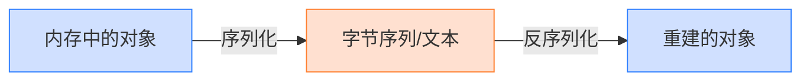
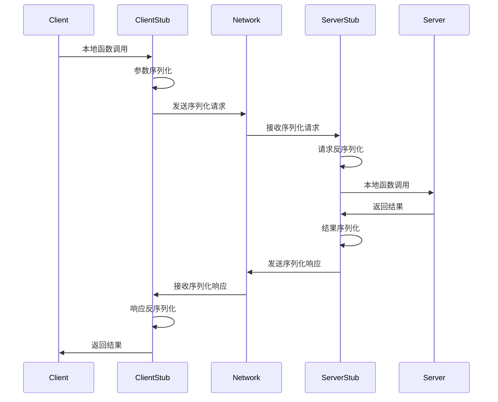

# 第1章：初识序列化：数据穿梭的艺术

## 1.1 什么是序列化与反序列化？

### 1.1.1 基本定义

**序列化**（Serialization）是将内存中的数据结构或对象转换为特定格式的过程，使其可以被存储（如保存到文件、内存缓冲区等）或传输（如通过网络发送）。序列化后的数据可以稍后被还原为原始的数据结构或对象，这个还原过程称为**反序列化**（Deserialization）。

从技术角度看，序列化可以定义为：
> 序列化是将数据结构或对象状态转换为可以存储或传输的格式，并能够在稍后重建的过程。

这个定义包含了序列化的几个关键特性：

1. **转换**：将复杂的内存数据结构转换为线性的字节序列
2. **存储/传输**：转换后的数据可以被持久化存储或网络传输
3. **重建**：能够从序列化格式中精确地重建原始数据

为了更直观地理解序列化，我们可以将其比喻为将三维物体"拍平"成二维图纸，反序列化则是根据图纸"重建"三维物体的过程。



### 1.1.2 序列化与反序列化的基本流程

序列化过程通常包括以下步骤：

1. **对象遍历**：分析内存中对象的结构和状态
2. **类型映射**：将编程语言特定的数据类型映射到序列化格式支持的类型
3. **数据转换**：将对象数据按照特定格式进行编码
4. **元数据处理**：根据需要添加类型信息、版本信息等元数据
5. **输出生成**：生成最终的序列化数据（文本格式或二进制格式）

反序列化则是上述过程的逆向操作：

1. **输入解析**：读取序列化数据
2. **元数据解读**：处理类型信息、版本信息等
3. **数据解码**：将序列化格式转换回编程语言的数据类型
4. **对象构建**：创建和初始化对象
5. **关系重建**：处理对象间的引用关系

让我们通过一个简单的Java示例来说明序列化和反序列化过程：

```java
// 定义一个可序列化的类
public class Person implements Serializable {
    private String name;
    private int age;
    private Address address;  // 嵌套对象
    
    public Person(String name, int age, Address address) {
        this.name = name;
        this.age = age;
        this.address = address;
    }
    
    // getter和setter方法省略
}

// 序列化示例
public void serializeExample() {
    try {
        // 创建对象
        Address address = new Address("123 Main St", "Anytown", "12345");
        Person person = new Person("John Doe", 30, address);
        
        // 序列化到文件
        FileOutputStream fileOut = new FileOutputStream("person.ser");
        ObjectOutputStream out = new ObjectOutputStream(fileOut);
        out.writeObject(person);  // 序列化操作
        out.close();
        fileOut.close();
        
        System.out.println("对象已序列化到person.ser");
    } catch (IOException e) {
        e.printStackTrace();
    }
}

// 反序列化示例
public void deserializeExample() {
    try {
        // 从文件反序列化
        FileInputStream fileIn = new FileInputStream("person.ser");
        ObjectInputStream in = new ObjectInputStream(fileIn);
        Person person = (Person) in.readObject();  // 反序列化操作
        in.close();
        fileIn.close();
        
        System.out.println("反序列化成功：" + person.getName());
    } catch (IOException | ClassNotFoundException e) {
        e.printStackTrace();
    }
}
```

### 1.1.3 深入理解序列化的本质

从本质上看，序列化解决的是**数据表示形式转换**的问题。计算机内存中的数据结构通常是复杂的、非线性的、特定语言的表示形式，而存储和传输则需要线性的、标准化的表示形式。

序列化需要处理的关键问题包括：

1. **复杂结构线性化**：如何将具有复杂引用关系的对象图转换为线性表示
2. **类型系统桥接**：如何在不同的类型系统之间建立映射关系
3. **元数据管理**：确定需要保存哪些元数据，以及如何保存
4. **版本兼容**：如何处理数据结构随时间演化产生的版本差异

从广义上讲，序列化实际上是一种**信息编码**，是信息论和计算机科学交叉的产物。它需要考虑编码效率（空间利用率）、处理效率（时间复杂度）以及编码鲁棒性（抗错误能力）等多方面因素。

## 1.2 为何需要序列化？

序列化技术解决了现代计算环境中的多种核心需求，从数据存储到分布式计算，几乎无处不在。下面我们将深入探讨序列化的主要应用场景。

### 1.2.1 数据持久化

数据持久化是序列化最基本的应用场景之一。程序运行过程中，数据结构存在于易失性内存中；当程序终止或系统关闭时，这些数据会丢失。序列化提供了将运行时数据保存到持久存储介质的机制。

数据持久化的典型场景包括：

1. **应用程序状态保存**
   - 文档编辑器保存文档
   - 游戏存档
   - 应用程序配置文件

2. **数据库存储**
   - NoSQL数据库中的文档存储
   - 对象关系映射(ORM)系统
   - 大数据系统中的数据存储

3. **缓存系统**
   - Web应用中的会话缓存
   - 分布式缓存系统（如Redis）

以游戏存档为例，玩家在游戏中的进度、角色状态、物品等都是内存中的复杂数据结构，通过序列化可以将这些数据保存到文件中，允许玩家稍后继续游戏。

```python
# Python游戏存档示例
import pickle

class GameState:
    def __init__(self):
        self.player_position = (0, 0)
        self.player_health = 100
        self.inventory = ["剑", "盾"]
        self.completed_quests = set()
    
    def add_item(self, item):
        self.inventory.append(item)
    
    def complete_quest(self, quest_id):
        self.completed_quests.add(quest_id)

# 创建游戏状态
game_state = GameState()
game_state.player_position = (120, 45)
game_state.add_item("魔法药水")
game_state.complete_quest("main_quest_1")

# 序列化（保存）游戏状态
with open("save_game.dat", "wb") as f:
    pickle.dump(game_state, f)
    
print("游戏已保存")

# 反序列化（加载）游戏状态
with open("save_game.dat", "rb") as f:
    loaded_game = pickle.load(f)
    
print(f"加载的游戏状态: 位置={loaded_game.player_position}, 物品={loaded_game.inventory}")
```

### 1.2.2 进程间通信

操作系统为安全和稳定性考虑，通常将不同程序运行在隔离的进程中。然而，这些进程之间经常需要交换数据，这就是进程间通信(IPC)的需求。

序列化在以下IPC机制中发挥着关键作用：

1. **管道与命名管道**：在管道通信中，数据需要序列化为字节流
2. **共享内存**：虽然共享内存允许直接访问，但通常仍需序列化以处理复杂数据结构
3. **消息队列**：消息队列中的数据需要序列化为标准格式
4. **套接字通信**：本地套接字通信也需要数据序列化

以下是使用消息队列进行IPC的简化示例：

```c
// 生产者进程
void producer() {
    // 创建消息队列
    int msgid = msgget(KEY, 0666 | IPC_CREAT);
    
    // 准备数据
    struct DataPacket {
        long msg_type;
        char name[20];
        int values[10];
        // 其他字段...
    };
    
    // 序列化数据（在C中通常是直接构造结构体）
    struct DataPacket data;
    data.msg_type = 1;
    strcpy(data.name, "sample");
    for (int i = 0; i < 10; i++) {
        data.values[i] = i * 10;
    }
    
    // 发送数据
    msgsnd(msgid, &data, sizeof(data) - sizeof(long), 0);
}

// 消费者进程
void consumer() {
    // 连接到消息队列
    int msgid = msgget(KEY, 0666);
    
    // 接收数据
    struct DataPacket data;
    msgrcv(msgid, &data, sizeof(data) - sizeof(long), 1, 0);
    
    // 使用反序列化的数据
    printf("收到消息: %s\n", data.name);
    for (int i = 0; i < 10; i++) {
        printf("%d ", data.values[i]);
    }
}
```

在现代操作系统中，IPC机制通常内置于系统API中，但底层依然需要某种形式的序列化来处理数据传输。

### 1.2.3 远程过程调用

远程过程调用(RPC)允许程序调用另一台计算机上的子程序，就像调用本地函数一样。RPC是分布式系统的基础，也是微服务架构的核心机制之一。

在RPC中，序列化的角色尤为关键：

1. **参数序列化**：调用方需要将函数参数序列化
2. **结果反序列化**：调用方需要将返回结果反序列化
3. **请求反序列化**：服务方需要将接收到的调用请求反序列化
4. **响应序列化**：服务方需要将执行结果序列化返回

现代RPC框架（如gRPC、Thrift、Dubbo等）都内置了高效的序列化机制，这些机制直接影响RPC的性能和可用性。



以下是使用gRPC框架的简化示例，展示了序列化在RPC中的应用：

```protobuf
// 使用Protocol Buffers定义服务接口（user_service.proto）
syntax = "proto3";

message User {
  string id = 1;
  string name = 2;
  int32 age = 3;
  string email = 4;
}

message GetUserRequest {
  string user_id = 1;
}

service UserService {
  rpc GetUser(GetUserRequest) returns (User);
}
```

```java
// Java客户端调用
public void callRemoteService() {
    // 创建gRPC通道和存根
    ManagedChannel channel = ManagedChannelBuilder
        .forAddress("localhost", 50051)
        .usePlaintext()
        .build();
    UserServiceGrpc.UserServiceBlockingStub stub = UserServiceGrpc.newBlockingStub(channel);
    
    // 构建请求
    GetUserRequest request = GetUserRequest.newBuilder()
        .setUserId("user123")
        .build();
    
    // 发起RPC调用（序列化和反序列化由gRPC框架处理）
    User user = stub.getUser(request);
    
    System.out.println("收到用户信息: " + user.getName() + ", " + user.getEmail());
    
    channel.shutdown();
}
```

### 1.2.4 网络数据传输

在网络通信中，序列化是必不可少的环节。网络协议栈的应用层需要处理各种复杂数据结构，而传输层只能传输字节流，这一转换正是序列化的职责。

网络数据传输中的序列化应用包括：

1. **Web API通信**：RESTful API、GraphQL等
2. **消息传递系统**：Kafka、RabbitMQ等消息队列
3. **实时通信**：WebSocket、游戏服务器
4. **分布式数据同步**：数据库复制、缓存同步

现代Web开发中，JSON已成为API通信的主导格式：

```javascript
// JavaScript前端发送API请求
async function fetchUserData(userId) {
    // 准备请求数据
    const requestData = {
        userId: userId,
        fields: ['name', 'email', 'preferences'],
        includeDeleted: false
    };
    
    // 发送请求（序列化为JSON）
    const response = await fetch('/api/users/get', {
        method: 'POST',
        headers: {
            'Content-Type': 'application/json'
        },
        body: JSON.stringify(requestData)  // 序列化
    });
    
    // 接收响应（从JSON反序列化）
    const userData = await response.json();  // 反序列化
    
    console.log('用户名:', userData.name);
    console.log('电子邮件:', userData.email);
}
```

在Web服务器端，序列化同样发挥着关键作用：

```python
# Python Flask后端处理API请求
@app.route('/api/users/get', methods=['POST'])
def get_user():
    // 接收和反序列化请求数据
    request_data = request.get_json()  // 从JSON反序列化
    
    user_id = request_data.get('userId')
    fields = request_data.get('fields', [])
    include_deleted = request_data.get('includeDeleted', False)
    
    // 处理业务逻辑
    user = database.find_user(user_id, include_deleted)
    
    // 准备响应数据
    response_data = {
        'id': user.id,
        'name': user.name,
        'email': user.email,
        'preferences': user.preferences
    }
    
    // 序列化并返回响应
    return jsonify(response_data)  // 序列化为JSON
```

## 1.3 序列化的核心挑战

序列化虽然概念简单，但在实际应用中面临着诸多挑战。这些挑战不仅影响具体实现选择，也驱动着序列化技术的不断创新。

### 1.3.1 性能

性能是序列化中最关键的挑战之一，它直接影响系统的响应时间和吞吐量。序列化性能主要包括两个方面：

1. **序列化/反序列化速度**：完成转换所需的CPU时间
2. **处理效率**：CPU利用率、内存分配和垃圾回收开销

影响序列化性能的因素包括：

- **格式复杂度**：文本格式（如JSON、XML）通常比二进制格式（如Protocol Buffers）慢
- **数据遍历方式**：反射（动态分析）通常比代码生成（静态分析）慢
- **内存管理**：频繁分配小内存块会增加垃圾回收压力
- **数据结构复杂性**：深层嵌套结构和循环引用处理较为复杂
- **并行处理能力**：是否能利用多核处理器并行序列化

在高性能系统中，性能关键点包括：

```
时间复杂度 = 序列化时间 + 传输时间 + 反序列化时间
```

其中，对于小数据量，序列化/反序列化时间通常占主导；对于大数据量，传输时间可能更为关键。

下面是一个简化的性能对比示例：

```java
// 性能测试示例
public void performanceTest() {
    User user = new User("John", "Doe", 30, "john@example.com");
    
    // JSON序列化测试
    long jsonStart = System.nanoTime();
    String jsonStr = objectMapper.writeValueAsString(user);
    User jsonUser = objectMapper.readValue(jsonStr, User.class);
    long jsonEnd = System.nanoTime();
    
    // Protocol Buffers序列化测试
    long pbStart = System.nanoTime();
    byte[] pbBytes = user.toProto().toByteArray();
    User pbUser = User.fromProto(UserProto.parseFrom(pbBytes));
    long pbEnd = System.nanoTime();
    
    System.out.println("JSON序列化+反序列化时间: " + (jsonEnd - jsonStart) + "ns");
    System.out.println("Protobuf序列化+反序列化时间: " + (pbEnd - pbStart) + "ns");
}
```

### 1.3.2 空间效率

空间效率关注序列化后数据的大小，这直接影响存储成本和网络传输效率。尤其在移动环境、IoT设备和大规模分布式系统中，空间效率显得尤为重要。

影响空间效率的因素包括：

- **编码方式**：文本格式通常比二进制格式占用更多空间
- **元数据开销**：保存属性名、类型信息等元数据会增加空间占用
- **数据表示**：数值、日期等不同表示方式的空间效率差异
- **压缩技术**：是否应用压缩算法以及压缩算法的选择

空间效率通常与性能和可读性之间存在权衡。例如，JSON虽然空间效率不如二进制格式，但具有良好的可读性和广泛的兼容性。

不同序列化格式的空间效率比较：

| 数据格式             | 相对大小 | 特点                   |
| ---------------- | ---- | -------------------- |
| XML              | 最大   | 冗长的标签结构，属性和命名空间增加开销  |
| JSON             | 中等   | 属性名重复，但结构简洁          |
| BSON             | 中等   | 二进制JSON，某些类型更高效      |
| MessagePack      | 较小   | 压缩的二进制格式，减少属性名存储     |
| Protocol Buffers | 小    | 高效的二进制编码，使用字段ID代替属性名 |
| FlatBuffers      | 小    | 零拷贝访问的二进制格式          |

以下示例展示了相同数据在不同格式下的大小差异：

```json
// JSON格式示例（182字节）
{
  "id": 12345,
  "name": "John Doe",
  "email": "john@example.com",
  "age": 30,
  "active": true,
  "scores": [85, 90, 78],
  "address": {
    "street": "123 Main St",
    "city": "Anytown"
  }
}
```

同样的数据使用Protocol Buffers可能只需要约90字节，减少约50%的空间占用。

### 1.3.3 可读性

可读性是衡量序列化格式对人类友好程度的指标。高可读性的格式便于调试、文档编写和手动编辑，但通常会牺牲一定的性能和空间效率。

可读性主要体现在：

1. **直观性**：格式是否容易理解
2. **结构清晰度**：数据结构是否明显
3. **可编辑性**：是否便于手动修改
4. **调试便利性**：是否易于排查问题

文本格式（如JSON、XML、YAML）通常具有良好可读性，而二进制格式则需要专门的工具进行解析和查看。

以下对比展示了不同格式的可读性差异：

```yaml
# YAML格式（最高可读性）
id: 12345
name: John Doe
email: john@example.com
age: 30
active: true
scores:
  - 85
  - 90
  - 78
address:
  street: 123 Main St
  city: Anytown
```

```json
// JSON格式（良好可读性）
{
  "id": 12345,
  "name": "John Doe",
  "email": "john@example.com",
  "age": 30,
  "active": true,
  "scores": [85, 90, 78],
  "address": {
    "street": "123 Main St",
    "city": "Anytown"
  }
}
```

```xml
<!-- XML格式（冗长但结构化） -->
<user>
  <id>12345</id>
  <name>John Doe</name>
  <email>john@example.com</email>
  <age>30</age>
  <active>true</active>
  <scores>
    <score>85</score>
    <score>90</score>
    <score>78</score>
  </scores>
  <address>
    <street>123 Main St</street>
    <city>Anytown</city>
  </address>
</user>
```

二进制格式（如Protocol Buffers）则需要通过专门工具解析后才能阅读。

### 1.3.4 跨语言/平台兼容性

现代系统通常由多种编程语言实现的组件组成，这些组件需要无缝交换数据。跨语言/平台兼容性是衡量序列化技术在异构环境中可用性的关键指标。

跨语言兼容性的主要挑战包括：

1. **类型系统差异**：不同语言的基本类型和复杂类型存在差异
2. **语言特性映射**：某些语言特有的特性（如Java的反射、Python的动态类型）难以跨语言表达
3. **字符编码**：不同平台对字符编码的处理存在差异
4. **字节序**：不同硬件平台可能使用不同的字节序（大端序vs小端序）
5. **数据大小限制**：32位vs64位平台的整数大小差异

主流序列化技术通过以下方式解决跨语言兼容问题：

- **中立数据模型**：定义与具体语言无关的数据模型
- **接口定义语言(IDL)**：使用专门的语言定义数据结构和服务接口
- **代码生成**：为不同语言生成兼容的序列化/反序列化代码
- **标准化编码**：使用规范的编码方案处理字符和数字

以Protocol Buffers为例，通过单一的`.proto`文件可以生成多种语言的兼容代码：

```protobuf
// person.proto
message Person {
  string name = 1;
  int32 id = 2;
  string email = 3;
  
  enum PhoneType {
    MOBILE = 0;
    HOME = 1;
    WORK = 2;
  }
  
  message PhoneNumber {
    string number = 1;
    PhoneType type = 2;
  }
  
  repeated PhoneNumber phones = 4;
}
```

使用Protocol Buffers的编译器可以生成Java、C++、Python、Go等多种语言的代码，确保跨语言数据交换的一致性。

### 1.3.5 版本兼容与演进

软件系统会随着时间演进，数据结构也会相应变化。版本兼容性是指序列化系统处理不同版本数据的能力，是构建可维护长期系统的关键。

版本兼容性包括两个方向：

1. **向前兼容(Forward Compatibility)**：新版本系统能处理旧版本的数据
2. **向后兼容(Backward Compatibility)**：旧版本系统能处理新版本的数据

版本演进的常见场景包括：

- **添加新字段**：向数据结构添加新属性
- **移除字段**：不再使用某些属性
- **重命名字段**：改变属性名称
- **更改类型**：修改属性类型（如从整数改为浮点数）
- **重构结构**：调整数据结构层次

处理版本兼容的常用策略：

1. **字段标识符**：使用数字ID而非名称标识字段（如Protocol Buffers）
2. **默认值处理**：为缺失字段定义合理默认值
3. **Schema演进规则**：制定严格的字段添加/删除规则
4. **可选字段**：将新增字段设为可选
5. **版本标记**：在序列化数据中包含版本信息

以下示例展示Protocol Buffers如何处理版本演进：

```protobuf
// 原始版本
message Person {
  string name = 1;
  int32 id = 2;
  string email = 3;
}

// 演进版本 - 添加新字段
message Person {
  string name = 1;
  int32 id = 2;
  string email = 3;
  string phone = 4;  // 新增字段
  repeated string tags = 5;  // 新增字段
}
```

使用Protocol Buffers，旧版本的程序可以忽略新增字段，而新版本程序处理旧数据时会为缺失字段使用默认值，实现良好的双向兼容。

### 1.3.6 安全性

序列化和反序列化过程可能引入安全风险，特别是处理不受信任来源的数据时。安全挑战主要包括：

1. **反序列化漏洞**：恶意数据可能触发代码执行
2. **数据篡改**：未经验证的数据可能被篡改
3. **信息泄露**：序列化数据可能包含敏感信息
4. **拒绝服务攻击**：特制的序列化数据可能导致资源耗尽
5. **注入攻击**：某些序列化格式（如XML）可能受到注入攻击

著名的反序列化漏洞示例包括Java的Apache Commons Collections漏洞、Python的pickle漏洞等，这些漏洞可能导致远程代码执行(RCE)。

安全防护策略包括：

1. **输入验证**：验证所有输入数据的合法性
2. **类型限制**：限制可反序列化的类型
3. **沙箱执行**：在受限环境中执行反序列化
4. **数据签名**：验证数据完整性和来源
5. **避免使用原生序列化**：对不受信任的数据使用更安全的替代方案（如JSON）

以下是Java中存在安全风险的序列化代码示例：

```java
// 不安全的反序列化示例
public Object deserializeUnsafe(byte[] data) {
    try {
        ByteArrayInputStream bis = new ByteArrayInputStream(data);
        ObjectInputStream ois = new ObjectInputStream(bis);
        return ois.readObject();  // 潜在安全风险
    } catch (Exception e) {
        return null;
    }
}
```

更安全的替代方案：

```java
// 更安全的JSON反序列化示例
public User deserializeSafe(String json) {
    try {
        // 使用Jackson进行受控反序列化
        ObjectMapper mapper = new ObjectMapper();
        // 禁用不安全功能
        mapper.disable(DeserializationFeature.ACCEPT_SINGLE_VALUE_AS_ARRAY);
        mapper.disable(DeserializationFeature.ACCEPT_FLOAT_AS_INT);
        // 限制特定类型
        return mapper.readValue(json, User.class);  // 只允许反序列化为User类
    } catch (Exception e) {
        return null;
    }
}
```

## 1.4 本章小结

本章介绍了序列化技术的基础概念及其在现代计算环境中的重要性。我们深入探讨了序列化与反序列化的定义、过程和本质，列举了序列化在数据持久化、进程间通信、远程过程调用和网络数据传输等领域的广泛应用。

我们还详细分析了序列化技术面临的核心挑战：性能、空间效率、可读性、跨语言/平台兼容性、版本兼容与演进以及安全性。这些挑战体现了序列化技术的复杂性，也为不同序列化方案的设计提供了多维度的评价标准。

理解序列化的基本概念和挑战是深入学习和应用序列化技术的基础。在接下来的章节中，我们将探索序列化技术的历史演进，并深入研究各种主流序列化格式的特点与适用场景。

**关键要点回顾**：

1. **序列化的本质**是将内存中的数据结构转换为可存储或传输的格式，反序列化则是这个过程的逆向操作。
2. **序列化的应用场景**极其广泛，包括数据持久化、进程间通信、远程过程调用和网络数据传输。
3. **选择序列化技术**需要考虑多种因素，包括性能、空间效率、可读性、跨语言兼容性、版本演进和安全性。
4. **没有万能的序列化方案**，不同应用场景需要根据具体需求和约束选择适当的序列化技术。
5. **序列化安全**是系统设计中容易被忽视却至关重要的一环，不安全的反序列化可能导致严重的安全漏洞。 