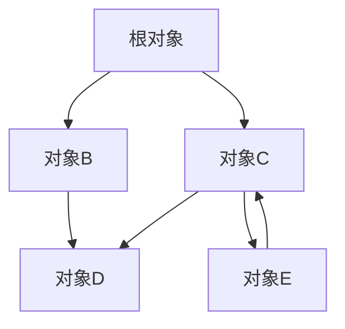

# 第3章：序列化核心概念与原理

## 3.1 数据类型映射

序列化的核心挑战之一是如何在不同的类型系统之间建立映射关系。编程语言和序列化格式通常具有各自的类型系统，二者需要建立合理的转换规则。

### 3.1.1 基本数据类型的映射

最简单的映射发生在基本数据类型层面，这些类型在大多数编程语言中都存在，但实现细节可能不同。

**整数类型**

整数映射需要考虑的关键因素：

- **取值范围**：不同语言的整数类型范围不同（如C#的int是32位，JavaScript的Number可表示53位精确整数）
- **有无符号**：有些语言区分有符号和无符号整数，有些不区分
- **位长度**：8位、16位、32位、64位等不同长度整数的处理

典型的整数类型映射示例：

| 序列化格式    | Java整数类型                  | C++整数类型                           | JavaScript | Python 3   |
| -------- | ------------------------- | --------------------------------- | ---------- | ---------- |
| JSON     | 所有整数统一表示                  | 所有整数统一表示                          | Number     | int（无大小限制） |
| Protobuf | int32/int64/uint32/uint64 | int32_t/int64_t/uint32_t/uint64_t | Number     | int        |
| Avro     | int/long                  | int32_t/int64_t                   | Number     | int        |

**浮点数类型**

浮点数映射的主要考虑因素：

- **精度**：单精度(float)vs双精度(double)
- **特殊值**：NaN、正无穷、负无穷的处理
- **序列化误差**：浮点数序列化可能引入微小误差

**布尔类型**

布尔值看似简单，但在不同语言中也存在差异：

- C/C++中0表示false，非0表示true
- SQL中使用三值逻辑（true, false, null）
- 某些动态语言有"真值"概念（如Python中空字符串被视为false）

**字符和字符串**

字符和字符串处理中的关键考量：

- **字符编码**：ASCII、ISO-8859、UTF-8、UTF-16等
- **字符集**：不同语言支持的字符集范围
- **字符串表示**：长度前缀vs终止符号
- **特殊字符**：转义字符的处理

### 3.1.2 复合数据类型的映射

复合类型的映射更为复杂，涉及多层次的结构转换。

**数组和集合**

数组和集合类型的映射考虑因素：

- **同质vs异质**：是否允许不同类型元素混合
- **固定长度vs可变长度**
- **嵌套层次**：多维数组的表示
- **稀疏性**：稀疏数组的高效表示

**对象和记录**

对象映射的关键点：

- **字段标识**：名称vs位置vs ID
- **数据封装**：公有字段vs私有字段
- **方法处理**：序列化通常只处理数据，不处理方法
- **多态性**：对象层次结构的处理

**映射和词典**

键值对数据结构的映射：

- **键的类型限制**：有些格式要求键为字符串（如JSON）
- **顺序保留**：是否保留键值对的原始顺序
- **重复键处理**：如何处理同名键

### 3.1.3 特殊数据类型的处理

除了常见的基本类型和复合类型，序列化还需要处理一些特殊类型。

**日期和时间**

日期时间的表示方法多样：

- **时间戳**：Unix时间戳（秒或毫秒）
- **ISO格式**：如ISO 8601标准格式
- **分解表示**：年、月、日、时、分、秒分别存储
- **时区处理**：UTC时间vs本地时间

```java
// Java中不同的日期时间序列化示例
Date date = new Date();

// 1. 时间戳形式
long timestamp = date.getTime();  // 毫秒时间戳

// 2. ISO 8601格式
String isoDate = new SimpleDateFormat("yyyy-MM-dd'T'HH:mm:ss.SSSXXX").format(date);

// 3. 分解表示
Calendar cal = Calendar.getInstance();
cal.setTime(date);
int year = cal.get(Calendar.YEAR);
int month = cal.get(Calendar.MONTH) + 1;  // Calendar.MONTH从0开始
int day = cal.get(Calendar.DAY_OF_MONTH);
```

**枚举类型**

枚举的序列化方式：

- **名称表示**：使用枚举值的名称
- **序号表示**：使用枚举值的数字序号
- **混合表示**：同时保存名称和序号

**二进制数据**

二进制数据的处理策略：

- **Base64编码**：文本格式常用（如JSON中）
- **直接二进制**：二进制格式常用（如Protobuf）
- **十六进制表示**：某些文本格式使用

**空值（null）**

空值处理在不同系统中差异很大：

- **显式表示**：专门的null标记
- **默认值**：使用类型默认值代替null
- **省略**：完全省略空值字段
- **可选类型**：如Protobuf的optional字段

### 3.1.4 跨语言类型系统的挑战

跨语言序列化面临的类型系统挑战：

**精度损失**

当源语言类型比目标语言类型精度更高时会发生精度损失：

- 64位整数序列化到JavaScript（精确表示仅53位）
- 双精度浮点数序列化到单精度环境

**语言特有类型**

处理语言特有类型的策略：

- **转换为通用表示**：如将C#的decimal转为字符串
- **自定义扩展**：序列化格式提供扩展机制
- **近似映射**：映射到最接近的可用类型

**动态类型vs静态类型**

不同类型系统的哲学差异：

- 静态语言（Java/C++）需要确切类型信息
- 动态语言（JavaScript/Python）可以运行时决定类型
- 序列化系统需要在二者间取得平衡

## 3.2 对象图遍历

序列化过程中需要遍历内存中的对象图（对象及其引用关系构成的网络），这涉及多种复杂情况的处理。

### 3.2.1 对象引用与对象图

在面向对象语言中，对象通常通过引用相互关联，形成复杂的对象图：



上图展示了一个典型的对象图，其中：
- 对象D被B和C共享引用
- 对象C和E之间存在循环引用

序列化系统需要正确处理这种复杂结构。

### 3.2.2 深度优先vs广度优先遍历

序列化时有两种主要的遍历策略：

**深度优先遍历 (DFS)**

```
遍历(节点):
    处理当前节点
    对于节点的每个引用:
        如果引用指向未访问节点:
            遍历(引用的节点)
```

**广度优先遍历 (BFS)**

```
初始化队列，添加根节点
标记根节点为已访问
当队列非空时:
    节点 = 队列出队
    处理节点
    对于节点的每个引用:
        如果引用指向未访问节点:
            标记为已访问
            加入队列
```

大多数序列化实现使用DFS，但具体选择可能基于性能和内存考量。

### 3.2.3 循环引用检测与处理

循环引用是序列化中的关键挑战，不正确处理可能导致无限递归和栈溢出。

**检测循环**

最常见的循环检测方法是维护已访问对象集合：

```python
def serialize(obj, visited=None):
    if visited is None:
        visited = set()
        
    # 检查循环引用
    obj_id = id(obj)
    if obj_id in visited:
        return handle_cycle(obj_id)  # 处理循环引用
        
    visited.add(obj_id)
    
    # 正常序列化逻辑
    # ...
```

**处理策略**

循环引用的处理策略包括：

1. **引用ID**：为对象分配唯一ID，循环引用时只保存ID
2. **截断**：在循环点截断引用（可能导致数据丢失）
3. **错误**：检测到循环时抛出错误（如原生Java序列化）
4. **特殊标记**：使用特殊标记表示循环引用点

不同序列化格式对循环引用支持不同：

- JSON原生不支持循环引用
- Protocol Buffers的设计不易产生循环（但可能有间接循环）
- 专用序列化库（如Java的XStream）提供循环引用支持

### 3.2.4 共享引用的处理

多个引用指向同一对象时的处理策略：

**复制策略**

每次遇到对象时都完整序列化，忽略共享关系：

```
A → B
↓   ↑
C ---
```

序列化为：
```
A: {
  B_reference: {...},
  C: {
    B_reference: {...}  // B的副本
  }
}
```

优点是简单，缺点是数据冗余和可能破坏对象标识。

**共享引用策略**

保留共享关系，只序列化对象一次：

```
A: {
  B_reference: #ID1,
  C: {
    B_reference: #ID1  // 引用同一对象
  }
}
对象表:
#ID1: {...}  // B的实际内容
```

优点是保留对象标识，缺点是格式更复杂。

**混合策略**

某些场景采用混合策略：

- 复杂对象使用共享引用
- 简单值类型对象使用复制
- 基于配置动态决定策略

## 3.3 编码方式：文本 vs 二进制

序列化格式可以基于文本或二进制编码，二者各有优缺点。

### 3.3.1 文本编码基础

文本格式将数据编码为人类可读的字符序列，常见的文本格式包括JSON、XML、YAML等。

**文本编码的特点**：

- **可读性**：直接可读，便于调试和手动编辑
- **自描述**：通常包含字段名等元信息
- **通用性**：几乎所有平台都支持文本处理
- **处理简单**：可使用标准文本工具处理

**文本编码的常见挑战**：

1. **字符编码**：需要指定UTF-8/UTF-16等编码方式
2. **特殊字符处理**：如引号、换行符等需要转义
3. **数字表示**：处理精度、格式化等问题

**JSON编码示例**：

```json
{
  "name": "Zhang San",
  "age": 28,
  "isActive": true,
  "skills": ["Java", "Python", "SQL"],
  "address": {
    "city": "Beijing",
    "postcode": "100000"
  }
}
```

**XML编码示例**：

```xml
<person>
  <name>Zhang San</name>
  <age>28</age>
  <isActive>true</isActive>
  <skills>
    <skill>Java</skill>
    <skill>Python</skill>
    <skill>SQL</skill>
  </skills>
  <address>
    <city>Beijing</city>
    <postcode>100000</postcode>
  </address>
</person>
```

### 3.3.2 二进制编码基础

二进制格式将数据编码为紧凑的字节序列，常见的二进制格式包括Protocol Buffers、Avro、MessagePack等。

**二进制编码的特点**：

- **紧凑**：数据体积小，适合存储和传输
- **解析高效**：解析速度快，CPU消耗低
- **类型保真**：更准确保留类型信息
- **专为机器设计**：优化计算机处理，而非人类阅读

**二进制编码的常见挑战**：

1. **可读性差**：需要专门工具解读
2. **调试困难**：不易于人工检查和修改
3. **平台相关性**：需要处理字节序等平台差异

**Protocol Buffers编码示例**：
(十六进制表示)
```
0A 09 5A 68 61 6E 67 20 53 61 6E 10 1C 18 01 22 0F 0A 04 
4A 61 76 61 0A 06 50 79 74 68 6F 6E 0A 03 53 51 4C 2A 11 
0A 07 42 65 69 6A 69 6E 67 12 06 31 30 30 30 30 30
```

这段二进制数据对人类几乎不可读，但对计算机更高效。

### 3.3.3 文本与二进制格式的详细对比

文本和二进制格式各有优缺点，选择取决于具体应用场景：

**性能对比**

| 方面     | 文本格式 | 二进制格式 |
| ------ | ---- | ----- |
| 序列化速度  | 较慢   | 较快    |
| 反序列化速度 | 较慢   | 较快    |
| 解析开销   | 高    | 低     |
| 内存使用   | 较高   | 较低    |

**功能对比**

| 特性   | 文本格式  | 二进制格式 |
| ---- | ----- | ----- |
| 类型安全 | 有限    | 较强    |
| 模式验证 | 通常分离  | 通常集成  |
| 扩展性  | 灵活但无序 | 结构化   |
| 版本兼容 | 手动实现  | 常内置支持 |

**实用性对比**

| 场景 | 文本格式 | 二进制格式 |
|-----|---------|-----------|
| 调试/开发 | 优秀 | 较差 |
| 生产环境 | 可接受 | 优秀 |
| 外部接口 | 常用 | 少用 |
| 内部通信 | 少用 | 常用 |

### 3.3.4 混合编码方式

现代序列化解决方案常采用混合方法，结合文本和二进制格式的优点：

**文本结构，二进制内容**

保持整体结构为文本格式，但对特定字段使用二进制编码。例如JSON中使用Base64编码二进制数据：

```json
{
  "metadata": {
    "name": "example.jpg",
    "type": "image/jpeg"
  },
  "content": "iVBORw0KGgoAAAANSUhEUgAA..."  // Base64编码的二进制数据
}
```

**二进制编码，文本Schema**

使用文本格式定义Schema，但数据本身使用二进制编码。Protocol Buffers和Avro都采用这种方法：

```protobuf
// 文本格式的Schema定义
syntax = "proto3";
message Person {
  string name = 1;
  int32 age = 2;
  bool is_active = 3;
  repeated string skills = 4;
  // ...
}
```

实际数据使用对应的二进制格式编码。

## 3.4 Schema（模式）：定义数据结构

Schema是序列化系统中描述数据结构和约束的正式规范，对于确保数据一致性、类型安全和版本兼容至关重要。

### 3.4.1 显式Schema vs 隐式Schema

序列化技术可以根据Schema的明确程度分为两类：

**显式Schema**

显式Schema要求预先定义数据结构，并用于验证数据。特点：

- 在数据之外单独定义
- 强制执行类型和结构约束
- 支持代码生成和文档生成
- 便于版本管理

示例：Protocol Buffers、Avro、XML Schema

```protobuf
// Protocol Buffers显式Schema示例
syntax = "proto3";

message User {
  string username = 1;
  int32 user_id = 2;
  repeated string roles = 3;
  UserStatus status = 4;
  
  enum UserStatus {
    ACTIVE = 0;
    INACTIVE = 1;
    SUSPENDED = 2;
  }
}
```

**隐式Schema**

隐式Schema没有正式的外部定义，而是从代码或数据中推断。特点：

- 无需预定义结构
- 通常由序列化/反序列化代码隐含
- 灵活性高，但类型安全性较低
- 版本管理较困难

示例：JSON、YAML、Python的pickle

```javascript
// JSON中的隐式Schema示例
let user = {
  username: "alice",
  user_id: 12345,
  roles: ["admin", "editor"],
  status: "ACTIVE"
};

// Schema仅存在于代码结构和文档中
```

**两种方法的对比**

| 特性 | 显式Schema | 隐式Schema |
|-----|-----------|-----------|
| 灵活性 | 较低 | 较高 |
| 类型安全 | 高 | 低 |
| 开发速度 | 前期较慢 | 前期较快 |
| 维护难度 | 较低 | 较高 |
| 版本控制 | 良好支持 | 支持有限 |
| 文档化 | 自动生成 | 需手动维护 |

### 3.4.2 Schema定义语言

Schema定义语言(SDL)或接口定义语言(IDL)用于正式描述数据结构。主要的SDL/IDL包括：

**XML Schema (XSD)**

XML的正式Schema语言，功能强大但复杂。

```xml
<xs:schema xmlns:xs="http://www.w3.org/2001/XMLSchema">
  <xs:element name="User">
    <xs:complexType>
      <xs:sequence>
        <xs:element name="username" type="xs:string"/>
        <xs:element name="user_id" type="xs:integer"/>
        <xs:element name="roles">
          <xs:complexType>
            <xs:sequence>
              <xs:element name="role" type="xs:string" minOccurs="0" maxOccurs="unbounded"/>
            </xs:sequence>
          </xs:complexType>
        </xs:element>
        <xs:element name="status">
          <xs:simpleType>
            <xs:restriction base="xs:string">
              <xs:enumeration value="ACTIVE"/>
              <xs:enumeration value="INACTIVE"/>
              <xs:enumeration value="SUSPENDED"/>
            </xs:restriction>
          </xs:simpleType>
        </xs:element>
      </xs:sequence>
    </xs:complexType>
  </xs:element>
</xs:schema>
```

**JSON Schema**

用于验证JSON数据的规范，逐渐标准化。

```json
{
  "$schema": "http://json-schema.org/draft-07/schema#",
  "type": "object",
  "properties": {
    "username": {
      "type": "string"
    },
    "user_id": {
      "type": "integer"
    },
    "roles": {
      "type": "array",
      "items": {
        "type": "string"
      }
    },
    "status": {
      "type": "string",
      "enum": ["ACTIVE", "INACTIVE", "SUSPENDED"]
    }
  },
  "required": ["username", "user_id"]
}
```

**Protocol Buffers IDL**

简洁高效的二进制序列化格式定义语言。

```protobuf
syntax = "proto3";

message User {
  string username = 1;
  int32 user_id = 2;
  repeated string roles = 3;
  
  enum Status {
    ACTIVE = 0;
    INACTIVE = 1;
    SUSPENDED = 2;
  }
  
  Status status = 4;
}
```

**Apache Avro IDL**

大数据生态系统中常用的Schema定义语言。

```avro
@namespace("com.example")
protocol UserService {
  enum Status {
    ACTIVE,
    INACTIVE,
    SUSPENDED
  }

  record User {
    string username;
    int user_id;
    array<string> roles;
    Status status;
  }
}
```

**每种Schema语言的特点**

| Schema语言 | 复杂度 | 表达能力 | 主要用途 | 生态系统 |
|-----------|-------|---------|---------|---------|
| XML Schema | 高 | 非常强 | 企业应用, SOAP | 成熟但复杂 |
| JSON Schema | 中 | 强 | Web API, 配置 | 快速发展 |
| Protobuf IDL | 低 | 中等 | RPC, 高性能通信 | 完善, 专注效率 |
| Avro IDL | 中 | 强 | 大数据, 存储 | Hadoop生态 |
| GraphQL | 中 | 强 | API查询 | Web前端友好 |

### 3.4.3 Schema验证过程

Schema验证确保数据符合预定义的结构和约束。

**验证的时机**：

1. **序列化时**：防止无效数据被序列化
2. **反序列化时**：确保接收到的数据有效
3. **独立验证**：作为单独的质量检查步骤

**验证的内容**：

- **结构合规性**：字段的存在性和嵌套关系
- **类型合规性**：值类型是否匹配
- **值约束**：范围、格式、枚举等
- **关系约束**：依赖字段、互斥关系等

**验证过程示例**：

```javascript
// 使用JSON Schema验证
const Ajv = require('ajv');
const ajv = new Ajv();

// 定义schema
const schema = {
  type: 'object',
  properties: {
    username: { type: 'string', minLength: 3 },
    user_id: { type: 'integer', minimum: 1 },
    roles: { 
      type: 'array',
      items: { type: 'string' }
    },
    status: { 
      type: 'string',
      enum: ['ACTIVE', 'INACTIVE', 'SUSPENDED']
    }
  },
  required: ['username', 'user_id']
};

// 编译schema
const validate = ajv.compile(schema);

// 验证数据
const valid = validate({
  username: 'alice',
  user_id: 12345,
  roles: ['admin'],
  status: 'ACTIVE'
});

if (!valid) console.log(validate.errors);
```

### 3.4.4 自描述数据与Schema分离

在设计序列化系统时，Schema与数据的关系有两种主要模式：

**自描述数据**

自描述数据包含足够的元信息，可以在没有外部Schema的情况下理解其结构：

- **优点**：自包含、独立、便于调试
- **缺点**：数据冗余、体积大、效率低

自描述数据示例（XML）：
```xml
<user>
  <username>alice</username>
  <user_id>12345</user_id>
  <roles>
    <role>admin</role>
    <role>editor</role>
  </roles>
  <status>ACTIVE</status>
</user>
```

每条数据都包含完整的结构信息（标签名）。

**Schema分离**

Schema分离模式下，数据与结构定义分开存储：

- **优点**：数据紧凑、传输效率高、集中管理Schema
- **缺点**：数据理解依赖外部Schema、调试困难

Schema分离示例（Protocol Buffers）：

Schema文件（.proto）：
```protobuf
message User {
  string username = 1;
  int32 user_id = 2;
  repeated string roles = 3;
  string status = 4;
}
```

二进制数据：
```
0A 05 61 6C 69 63 65 10 B9 60 1A 05 61 64 6D 69 6E 1A 06 65 64 69 74 6F 72 22 06 41 43 54 49 56 45
```

该数据没有字段名信息，需要配合Schema才能解释。

**混合方法**

现代系统常采用混合方法，平衡两种模式的优缺点：

- **Schema ID引用**：数据包含Schema版本或ID引用，而非完整Schema
- **部分自描述**：核心结构自描述，但省略详细类型信息
- **按需自描述**：允许配置自描述程度

Avro就采用这种混合方法，数据可以内嵌Schema或引用外部Schema。

## 3.5 关键评价指标详解

选择序列化技术时需要考虑多种指标，不同应用场景对这些指标的优先级不同。

### 3.5.1 性能指标深度分析

**序列化/反序列化速度**

影响序列化速度的因素：
- **格式复杂度**：更简单的格式通常更快
- **实现方式**：反射vs代码生成
- **内存管理**：缓冲区策略、零拷贝支持
- **预分配优化**：是否需要多次内存分配

测量方法：
- 对大量对象进行序列化/反序列化
- 测量完成所需的时间
- 计算每秒可处理的对象数或数据量

```java
// 性能测试示例代码
long startTime = System.nanoTime();
for (int i = 0; i < ITERATIONS; i++) {
    byte[] serialized = serialize(testObject);
    Object deserialized = deserialize(serialized);
}
long endTime = System.nanoTime();
double seconds = (endTime - startTime) / 1_000_000_000.0;
double objectsPerSecond = ITERATIONS / seconds;
```

**内存使用**

序列化过程的内存效率考量：
- **中间缓冲区**：是否创建多个临时对象
- **峰值内存**：处理过程中的最大内存占用
- **对象复用**：是否支持对象池和缓冲区复用

内存使用测量：
- 堆内存监控
- 垃圾回收活动观察
- 临时对象分析

**CPU利用率**

序列化的CPU消耗方面：
- **指令效率**：所需CPU指令数
- **并行处理**：多线程支持
- **分支预测友好性**：代码路径的可预测性
- **缓存局部性**：数据访问模式对CPU缓存的影响

### 3.5.2 空间效率详细考量

**静态数据大小**

数据的静态大小取决于：
- **字段名存储**：是否存储完整字段名
- **类型信息**：是否包含类型元数据
- **数值编码**：定长vs变长整数编码
- **对齐填充**：是否添加填充字节

不同格式的空间效率比较（同样数据的近似大小）：
- XML: 100%（基准）
- JSON: 60-80%
- BSON: 50-70%
- Protocol Buffers: 20-60%
- Avro: 20-60%
- 自定义二进制格式: 10-40%

**压缩率**

序列化数据的可压缩性：
- **冗余度**：数据中的重复模式
- **压缩亲和性**：格式是否便于压缩
- **内置压缩**：是否内置压缩机制

压缩结合不同序列化格式的效果：
- 文本格式（XML/JSON）+ gzip: 显著减小（通常压缩率高）
- 二进制格式 + gzip: 中等收益（已经相对紧凑）
- 专用二进制格式 + 领域特定压缩: 最佳效果

### 3.5.3 可读性与调试能力

可读性对于开发和调试至关重要：

**人类可读性**
- **直接可读**：无需工具即可理解（如JSON）
- **结构清晰**：结构和嵌套关系明确
- **查看便捷性**：在日志或控制台中的可读性

**工具支持**
- **查看器**：专用数据查看工具
- **调试器集成**：与IDE调试器的集成
- **转换工具**：二进制与文本表示转换

**错误处理**
- **错误信息清晰度**：错误定位精确性
- **部分数据恢复**：数据损坏时的恢复能力
- **验证功能**：内置的数据验证

### 3.5.4 扩展性和兼容性评估

**模式演进能力**

数据结构随时间变化的适应能力：
- **向前兼容**：新系统可读取旧数据
- **向后兼容**：旧系统可读取新数据
- **字段添加/删除**：如何处理模式变更
- **类型变更**：数据类型变化的处理

**未知字段处理**

处理未知数据的策略：
- **保留**：存储未知字段以备将来使用
- **忽略**：丢弃未识别的字段
- **错误**：遇到未知字段时报错
- **自定义处理器**：提供扩展点处理特殊情况

**版本策略**

版本管理的实现方式：
- **显式版本标记**：数据中包含版本号
- **结构化兼容性规则**：明确定义哪些更改是兼容的
- **版本检测**：运行时版本兼容性检查

## 3.6 本章小结

本章详细探讨了序列化的核心概念和原理，从数据类型映射、对象图遍历、编码方式到Schema定义和关键评价指标。这些基础知识构成了理解各种序列化技术的理论框架。

**关键概念回顾**：

1. **数据类型映射**是序列化的基本挑战，涉及如何在不同类型系统间建立转换规则，处理基本类型、复合类型和特殊类型。

2. **对象图遍历**处理内存中对象的引用关系，需要解决循环引用和共享引用等复杂问题。

3. **编码方式**分为文本和二进制两大类，各有优缺点。文本格式可读性好但效率低，二进制格式效率高但不易读。

4. **Schema定义**可以是显式或隐式的，影响序列化系统的类型安全性、验证能力和版本兼容性。

5. **评价指标**包括性能、空间效率、可读性和兼容性等多个维度，需要根据应用场景平衡取舍。

随着对这些基础概念的理解，我们可以更深入地分析和评估各种序列化技术，为不同应用场景选择最合适的方案。在接下来的章节中，我们将详细探讨主流序列化格式，并分析它们如何应用这些原理来解决实际问题。 