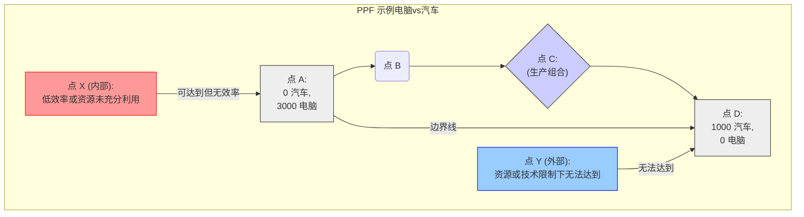

# 第一章：经济学之魂：稀缺、选择与理性之光 (The Soul of Economics: Scarcity, Choice, and the Light of Rationality)

> "经济学是研究人类行为作为目的与具有多重用途的稀缺资源之间关系的科学。" —— 莱昂内尔·罗宾斯 (Lionel Robbins)

欢迎来到经济学的世界！这门学科有时被误解为仅仅关于金钱、股市或商业，但其核心远比这更为深刻和广泛。经济学是一门研究 **选择 (Choice)** 的科学，探讨在 **稀缺 (Scarcity)** 条件下，个体、企业和政府如何做出决策以最有效地配置有限资源，从而满足无限欲望的学科。本章将为您揭开经济学的面纱，探索其最基本、最核心的概念——稀缺性、选择、机会成本、边际分析以及经济模型——这些构成了经济学思维的基石，也是理解后续所有经济现象和投资决策的起点。

## 1.1 经济学的疆域：我们研究什么，为何重要？

经济学的研究对象无处不在，渗透于我们生活的方方面面。它不仅仅存在于宏伟的议会殿堂或喧嚣的交易大厅，更存在于我们每天面临的无数决策之中：

*   **个人层面：** 你如何在有限的收入下分配支出，是购买最新的电子产品，还是存钱用于未来教育或旅行？你如何在有限的时间里分配精力，是投入工作以获取更高收入，还是享受闲暇与陪伴家人？这些都是经济学意义上的选择问题。
*   **企业层面：** 公司如何决定生产什么产品、采用何种技术、雇佣多少员工？如何在竞争激烈的市场中定价？如何分配利润，是用于再投资扩大生产，还是回报股东？这些决策直接关系到企业的生存与发展，是微观经济学的核心研究内容。
*   **社会与政府层面：** 一个国家如何决定公共资源的投向，是优先发展教育、医疗，还是加强基础设施建设？如何制定税收政策来平衡财政收入与社会公平？如何通过货币政策来调控通货膨胀和失业率？这些宏观决策影响着整个社会的福祉和经济的走向。

**为何经济学如此重要？**

1.  **理解世界运行的底层逻辑：** 经济学提供了一个强大的分析框架，帮助我们理解个体行为、市场机制、宏观经济波动以及全球经济联系背后的驱动力。它解释了价格为何涨跌、为何有些国家富裕而另一些国家贫穷、金融危机为何会发生等一系列关键问题。
2.  **提升决策能力：** 无论是个人理财、职业规划，还是企业管理、公共政策制定，经济学的原理都能提供重要的指导。它教会我们权衡利弊、评估成本效益、识别风险与机遇，从而做出更明智、更理性的决策。
3.  **成为负责任的公民：** 理解经济政策的制定过程、影响及其背后的权衡，有助于我们更深入地参与公共讨论，对政府行为进行更有效的监督，推动社会向更公平、更高效的方向发展。
4.  **赋能投资决策（本书重点）：** 对于投资者而言，经济学是不可或缺的工具箱。理解宏观经济周期、行业发展趋势、企业竞争优势、资产估值逻辑，都是基于经济学的基本原理。掌握经济学思维，能帮助投资者在纷繁复杂的市场信息中抓住本质，做出更具前瞻性和逻辑支撑的投资判断。

经济学的疆域广阔，从个体的微小选择到全球的宏大叙事，它试图揭示的是人类在资源约束条件下追求福利最大化的永恒主题。

## 1.2 稀缺性定律：欲望无穷与资源有限的永恒张力

**稀缺性 (Scarcity)** 是经济学存在的基础，也是所有经济问题的根源。它指的是这样一个基本事实：相对于人类无穷无尽的欲望 (wants)，可用于满足这些欲望的资源 (resources) 是有限的。

*   **欲望是无限的：** 人类总是渴望拥有更多的商品、更好的服务、更舒适的生活、更高的社会地位。一旦基本需求得到满足，新的、更高层次的欲望就会产生。这种欲望的无限性是人类进步的动力，也是经济活动永不停止的原因。
*   **资源是有限的：** 资源，也称为生产要素 (factors of production)，通常包括：
    *   **土地 (Land)：** 自然界提供的所有资源，如土地、矿产、水资源、森林等。
    *   **劳动 (Labor)：** 人类在生产过程中投入的体力和脑力。
    *   **资本 (Capital)：** 用于生产其他商品和服务的工具、设备、建筑物等（物质资本），以及知识、技能和经验（人力资本）。
    *   **企业家才能 (Entrepreneurship)：** 组织、管理和承担风险以进行生产的特殊才能。
    这些资源的数量和质量在特定时期内都是有限的。即使技术进步可以提高资源利用效率或发现新资源，但相对于不断增长的欲望，资源的相对稀缺性始终存在。

**稀缺性意味着选择：** 正因为资源稀缺而欲望无限，我们才**必须做出选择 (make choices)**。我们无法同时拥有所有想要的东西。个人必须选择如何花费时间和金钱；企业必须选择生产什么以及如何生产；社会必须选择如何在不同的公共目标之间分配资源。

**稀缺性并非贫穷：** 需要强调的是，稀缺性是一个普遍存在的经济事实，即使在富裕的社会也同样存在。亿万富翁也面临时间资源的稀缺，无法同时参与所有感兴趣的活动。一个发达国家也面临着如何在国防、教育、医疗等众多需求之间分配财政资源的稀缺问题。稀缺性关注的是**相对**有限性，而非绝对贫困。

理解稀缺性定律是理解经济学的第一步。它迫使我们认识到，每一个决策都伴随着放弃其他可能性的代价，这便引出了下一个核心概念——机会成本。

## 1.3 机会成本：决策的真实代价与隐含价值评估

由于稀缺性迫使我们做出选择，那么衡量一项选择的真实代价就变得至关重要。经济学提供了一个独特的视角：**机会成本 (Opportunity Cost)**。

**定义：** 一项选择的机会成本是指，为了做出该选择而**不得不放弃**的**所有其他可能性中价值最高的那一个 (the value of the best alternative forgone)**。

换句话说，你选择做某事的成本，不仅仅是你为之付出的显性成本（比如金钱），更重要的是你**因此失去了什么**。

**示例：**

*   **大学教育的机会成本：** 你决定花费四年时间攻读大学学位。其机会成本不仅仅是学费、书本费和生活费（显性成本），还包括你在这四年里如果去工作本可以获得的收入（这是你放弃的最佳替代选择的价值）。
*   **创业的机会成本：** 你辞去一份年薪 50 万的工作，投入 100 万积蓄创办一家公司。创业的机会成本不仅包括投入的 100 万资金（如果用于投资可能产生的回报），更重要的是那份被放弃的 50 万年薪。
*   **政府项目的机会成本：** 政府决定投资 100 亿元修建一条高速公路。其机会成本可能是用这笔钱本可以建设的学校、医院，或者用于减税。

**机会成本的重要性：**

1.  **揭示决策的真实代价：** 机会成本提醒我们，天下没有免费的午餐 (There ain't no such thing as a free lunch - TANSTAAFL)。任何选择都有代价，即使表面上看起来没有花费金钱。例如，"免费"的公园，其维护需要税收，这些税收本可以用在其他地方，这就是其机会成本的一部分。
2.  **优化资源配置：** 比较不同选择的机会成本，可以帮助我们做出更有效率的决策。理性的决策者会选择机会成本最低的方案，这意味着以最小的代价获得最大的收益。
3.  **评估隐含价值：** 机会成本的概念有助于我们评估那些没有明确市场价格的资源的价值。例如，你的闲暇时间是有价值的，其机会成本就是你利用这段时间可以从事的其他活动（如工作赚钱、学习充电）所能带来的最高价值。

**投资中的机会成本：** 在投资决策中，机会成本的概念尤为关键。当你选择投资于某个资产（如股票 A）时，你的机会成本就是你放弃的其他投资选项（如债券、房地产、或者股票 B）中预期回报最高的那个。优秀的投资者会不断地比较现有持仓与潜在投资标的的机会成本，以优化其投资组合。

### 1.3.1 沉没成本谬误：避免被过去绑架

在理解机会成本的同时，区分**沉没成本 (Sunk Cost)** 至关重要。

**定义：** 沉没成本是指**已经发生且无法收回**的成本。无论你未来做出何种决策，这些成本都不会改变。

**沉没成本谬误 (Sunk Cost Fallacy)：** 指人们在做决策时，倾向于考虑已经投入且无法收回的沉没成本，而不是基于未来的成本和收益进行理性判断。这是一种非理性的行为，因为沉没成本与未来的决策结果无关。

**示例：**

*   **电影票：** 你花 50 元买了一张电影票，看了 10 分钟发现电影极其难看。此时，50 元已经是沉没成本。你应该基于未来继续观看的"收益"（可能没有）和"成本"（浪费时间和潜在的不悦）来决定是否离开，而不是因为"已经花了 50 元"而强迫自己看完。
*   **失败的项目：** 公司投入了 1000 万研发一个新产品，但市场前景黯淡。此时，1000 万是沉没成本。决定是否继续投入更多资金，应该基于未来的预期收益和额外投入的成本，而不是已经花掉的 1000 万。如果未来的预期收益低于继续投入的成本，就应该果断止损。
*   **股票投资：** 你以 10 元/股的价格买入某股票，现价跌至 5 元。你为买入股票支付的成本是沉没成本。决定是否卖出，应该基于你对该股票未来价值的判断（它是否还会继续下跌？是否有更好的投资机会？），而不是基于"我已经亏损了 5 元"这个事实。

**理性决策法则：** 在做决策时，**忽略沉没成本，关注未来**。决策应该基于对未来增量成本 (incremental costs) 和增量收益 (incremental benefits) 的比较。机会成本是关乎未来的，而沉没成本是关乎过去的。不被沉没成本绑架，是理性决策的关键一环。

## 1.4 边际革命：理性决策的精髓——"增量"的智慧

经济学中一个极其重要的分析方法是**边际分析 (Marginal Analysis)**，它关注的是微小的**增量变化**对决策的影响。经济学家假设，理性的决策者会通过比较行动的**边际收益 (Marginal Benefit, MB)** 和 **边际成本 (Marginal Cost, MC)** 来做出最优选择。

*   **边际收益 (MB)：** 每增加一单位行动（如多消费一个苹果、多生产一件产品、多学习一小时）所带来的额外收益。
*   **边际成本 (MC)：** 每增加一单位行动所带来的额外成本。

**理性决策法则 (边际原则)：**

*   如果 **MB > MC**，则应该增加该行动。因为额外增加一单位行动带来的好处大于其代价。
*   如果 **MB < MC**，则应该减少该行动。因为额外增加一单位行动带来的好处小于其代价。
*   当 **MB = MC** 时，达到了最优决策点。此时再增加或减少行动都无法带来净收益的提升。

**边际分析的普遍性：** 这个看似简单的法则，实际上是解释大量经济行为的基础。

*   **消费者决策：** 你会一直吃冰淇淋，直到多吃一个冰淇淋带来的额外满足感（边际效用，一种边际收益）低于你需要为之付出的价格（边际成本）。
*   **生产者决策：** 企业会一直增加产量，直到多生产一件产品带来的额外收入（边际收益）等于多生产这件产品所需的额外成本（边际成本）。
*   **学习决策：** 你会一直学习，直到多学习一小时带来的知识或技能提升（边际收益）等于你因此放弃的闲暇或其他活动的价值（边际成本，即机会成本）。

**注意区分"边际"与"平均"：** 边际分析关注的是"下一个单位"的变化，而不是"所有单位"的平均值。例如，一家航空公司考虑是否以 300 美元的价格出售最后几个空余座位。虽然该航班的平均成本（总成本/总乘客数）可能是 500 美元，但只要这名额外乘客带来的边际收益（300 美元）大于其边际成本（可能仅仅是一份飞机餐和少量燃油的成本，远低于 300 美元），接受这名乘客就是理性的。

**边际革命 (Marginal Revolution)：** 19 世纪末，经济学家威廉姆·斯坦利·杰文斯、卡尔·门格尔和莱昂·瓦尔拉斯等人独立发展了边际效用理论，将分析重点从总量转向边际量，深刻地改变了经济学的研究范式，构成了现代微观经济学的基础。

### 1.4.1 边际分析在生活与投资中的应用实例

*   **生活：**
    *   **自助餐：** 为何人们在吃自助餐时往往会吃到过撑？因为支付固定费用后，多吃一盘食物的边际货币成本为零，人们倾向于吃到边际效用（满足感）也接近于零甚至为负（不适感）的程度。
    *   **商店促销：** "第二件半价"的策略正是利用了边际思维。消费者购买第一件商品后，购买第二件的边际成本降低了，从而刺激了额外购买。
*   **投资：**
    *   **资产配置调整：** 投资者决定是否增持或减持某项资产，应该基于这项调整带来的预期边际收益（更高的潜在回报或更低的风险）与边际成本（交易费用、税收、放弃其他机会的成本）的比较。
    *   **企业扩张决策：** 一家公司决定是否开设新的分店或进入新的市场，需要评估此举带来的边际收入增长是否能覆盖相应的边际成本（租金、人力、营销等）。
    *   **择时决策：** 投资者考虑是否立即买入
    * 或卖出，实际上是在权衡立即行动的边际收益（抓住潜在涨幅或避免潜在跌幅）与等待的边际收益（获取更多信息、等待更好价格）以及相应的边际成本（错过机会、承担隔夜风险等）。

边际分析是经济学中最强大、最常用的工具之一。培养边际思维，关注"增量"的变化，有助于我们在各种决策场景中做出更精准、更有效的判断。

## 1.5 生产可能性边界 (PPF)：可视化效率、权衡与增长潜力

为了更直观地理解稀缺性、选择和机会成本的概念，经济学家使用了**生产可能性边界 (Production Possibilities Frontier, PPF)** 这个模型。

**定义：** PPF 是一条曲线，表示一个经济体在**现有资源和技术水平下**，所能生产的**两种产品**的最大可能组合。

**假设：**

1.  经济体只生产两种产品（为了简化图形表示，实际可以推广到多种产品）。
2.  生产过程中使用的资源数量是固定的。
3.  技术水平是既定的。
4.  所有资源都得到了充分利用（没有闲置资源）。
5.  生产是有效率的（以最低成本生产）。

**图形解释：**



*   **横轴和纵轴：** 分别代表两种产品的产量（例如，电脑和汽车）。
*   **边界线 (PPF Curve)：** 线上的每一点（如 A, B, C, D）代表在资源充分利用且生产有效率的情况下，可以实现的最大产量组合。例如，点 A 表示所有资源用于生产电脑，点 D 表示所有资源用于生产汽车，点 B 和 C 表示同时生产两种产品的不同组合。
*   **边界线内部的点 (如 X)：** 表示生产组合是**可行的 (Attainable)**，但**无效率 (Inefficient)**。这意味着经济体要么没有充分利用其资源（存在失业或闲置设备），要么生产方式效率低下。可以通过改进资源利用或提高效率达到边界线上的某一点，在不减少一种产品产量的情况下增加另一种产品的产量。
*   **边界线外部的点 (如 Y)：** 表示在当前的资源和技术条件下**无法达到 (Unattainable)** 的生产组合。

**PPF 揭示的核心概念：**

1.  **稀缺性：** 边界的存在本身就说明了稀缺性。由于资源有限，不可能无限地生产两种产品，存在一个生产的极限。外部的点是无法达到的。
2.  **选择与权衡 (Trade-offs)：** 沿着 PPF 边界移动，意味着必须在两种产品的生产之间进行权衡。要想多生产一种产品（如从 B 点移动到 C 点，增加汽车产量），就必须减少另一种产品（电脑）的产量。这就是选择的体现。
3.  **机会成本：** PPF 的**斜率**代表了生产**额外一单位**横轴产品（汽车）的**机会成本**，这个机会成本是以必须放弃的纵轴产品（电脑）的数量来衡量的。
    *   **机会成本递增定律 (Law of Increasing Opportunity Cost)：** PPF 曲线通常是**向外凸（弯向原点）**的 (bowed outward)。这反映了机会成本递增定律。当经济体将资源从一种产品的生产（如电脑）转向另一种产品（如汽车）时，最初转移的是最适合生产汽车、最不适合生产电脑的资源，因此放弃的电脑数量较少。但随着汽车产量的持续增加，需要转移越来越适合生产电脑的资源，导致每增加一单位汽车所必须放弃的电脑数量越来越多。这就是机会成本递增的原因，源于资源并非完全同质且适用于所有生产活动。
4.  **效率：** 边界线上的点代表了**生产效率 (Productive Efficiency)**，意味着在不减少任何其他产品产量的情况下，无法再增加任何一种产品的产量。内部的点则是无效率的。
5.  **经济增长：** PPF 并非一成不变。当发生以下情况时，PPF 会向外移动，表示经济增长，整个经济体的生产能力提高：
    *   **资源增加：** 如发现新的矿产资源、劳动力人口增长、资本积累增加。
    *   **技术进步：** 新的技术可以提高资源利用效率，用同样的资源生产更多的产品。

### 1.5.1 技术进步与资源增加如何拓展边界

```mermaid
graph TD
    subgraph PPF 的移动
        direction LR
        subgraph 初始状态
            direction TB
            A1[原始 PPF]
        end
        subgraph 技术进步 (偏向电脑)
             direction TB
             A2[电脑技术进步,<br/>PPF 沿电脑轴外移]
        end
         subgraph 资源增加或全面技术进步
             direction TB
             A3[整体 PPF 外移]
        end

        A1 -->|技术进步(仅电脑)| A2
        A1 -->|资源增加/全面技术进步| A3
    end
```

*   **偏向性技术进步：** 如果技术进步主要发生在某个行业（如电脑制造业），PPF 会沿着该产品对应的轴向外移动更多。
*   **资源增加或中性技术进步：** 如果资源普遍增加，或者技术进步对两个行业都有利，PPF 会大致平行地向外移动。

PPF 模型虽然简单，但它清晰地展示了稀缺性、选择、机会成本、效率和经济增长这些经济学的基本概念及其相互关系。

## 1.6 经济模型：洞察复杂世界的"地图"

经济学研究的是极其复杂的现实世界，充满了无数变量和相互作用。为了理解这种复杂性，经济学家使用**经济模型 (Economic Models)**。

**定义：** 经济模型是对现实世界某个方面的**简化表示 (simplified representation)**，旨在抓住关键特征、解释经济现象、预测未来趋势或评估政策效果。

**模型如同地图：** 正如地图省略了大量细节（如每栋建筑、每棵树）以突出关键信息（如道路、城市、河流）一样，经济模型也通过**假设 (assumptions)** 来简化现实，从而使分析成为可能。一个好的模型应该：

*   **抓住本质：** 突出研究问题最相关的因素，忽略次要细节。
*   **逻辑一致：** 模型内部的推理过程应该是严谨和符合逻辑的。
*   **具有解释力：** 能够解释观察到的经济现象或数据。
*   **具有预测力 (有时)：** 能够对未来的经济结果或政策影响做出一定的预测（尽管经济预测充满挑战）。

**常见的模型形式：**

*   **语言模型：** 通过文字描述经济关系，如"价格上涨，需求量下降"。
*   **图形模型：** 使用图形来表示变量之间的关系，如供求曲线、PPF 曲线。图形直观易懂，是经济学教学和分析的重要工具。
*   **数学模型：** 使用数学方程来精确表达经济变量之间的关系。数学模型有助于进行更严谨的推导和量化分析，是现代经济学研究的主流。

### 1.6.1 模型的构建：假设、简化与预测力

构建经济模型通常涉及以下步骤：

1.  **确定研究问题：** 想要解释什么现象或回答什么问题？
2.  **做出假设：** 这是模型构建的关键。假设是为了简化现实，隔离出核心因素。常见的假设包括：
    *   **理性人假设 (Rationality Assumption)：** 个体追求自身利益最大化（如消费者追求效用最大化，生产者追求利润最大化）。这是许多基础模型的出发点，但行为经济学对此提出了挑战和修正。
    *   **其他条件不变 (Ceteris Paribus)：** 在分析某个变量的影响时，假设其他所有相关因素都保持不变。这有助于分离出特定变量的效果。
    *   **特定市场结构假设：** 如完全竞争、垄断等。
3.  **确定变量：** 区分**内生变量 (Endogenous Variables)**（模型试图解释的变量，其值由模型内部决定）和**外生变量 (Exogenous Variables)**（模型假定为给定的变量，其值来自模型外部）。
4.  **建立关系：** 通过逻辑推理、图形或数学方程描述变量之间的关系。
5.  **求解与分析：** 推导模型的均衡结果，分析外生变量变化对内生变量的影响（比较静态分析），或分析系统随时间变化的路径（动态分析）。

**预测力：** 模型的预测能力是衡量其有效性的重要标准之一，但并非唯一标准。有些模型更侧重于解释机制而非精确预测。经济系统本身的复杂性和人类行为的难以预测性，使得经济预测本身就非常困难。

### 1.6.2 模型的检验与局限性：保持批判性思维

**模型的检验：** 经济学家通过将模型的预测或推论与**现实世界的数据**进行比较来检验模型的有效性。如果模型的预测与数据显著不符，就需要对模型进行修正、重新设定假设，甚至放弃该模型。经济计量学 (Econometrics) 是使用统计方法检验经济理论和模型的专门领域。

**模型的局限性：**

*   **简化带来的偏差：** 为了简化，模型必然会忽略现实的某些方面，这可能导致模型的结论与现实存在偏差。模型的适用范围是有限的。
*   **假设的合理性：** 模型的结论很大程度上取决于其初始假设。如果假设不符合现实，模型的有效性就会受到质疑（例如，完全理性的假设在很多情况下并不成立）。
*   **数据的可得性与质量：** 检验和应用模型需要数据支持，但经济数据的获取可能困难，且数据本身可能存在测量误差。
*   **"垃圾进，垃圾出" (Garbage In, Garbage Out - GIGO)：** 如果模型的输入（假设、数据）存在问题，那么即使模型逻辑再严谨，输出的结果也可能是无意义的。

**批判性思维：** 在使用经济模型时，必须保持批判性思维：

*   **理解模型的假设：** 明确模型是建立在哪些假设之上的？这些假设在多大程度上符合现实？
*   **认识模型的适用范围：** 这个模型是为了解释什么特定问题而设计的？它能应用于其他情景吗？
*   **关注模型的预测能力与解释力：** 模型对现实的解释程度如何？其预测是否经过了实证检验？
*   **对比不同模型：** 对于同一个经济问题，可能存在不同的模型，它们可能基于不同的假设，得出不同的结论。比较不同模型的优劣和适用性。

经济模型是强大的思维工具，但绝非完美无缺。它们是我们理解复杂经济世界的"地图"，能提供有价值的洞见，但使用者必须清楚地图的局限性，并结合现实情况进行判断。

---

***投资启示：建立价值评估基础，理解成本效益分析，认识增长来源。***

本章介绍的经济学基本概念，为后续理解更复杂的经济理论和进行投资决策奠定了基础：

1.  **价值评估基础 (稀缺性、机会成本)：** 认识到资源的稀缺性，意味着任何资产的价值都源于其满足人类欲望的能力以及其相对稀缺程度。理解机会成本是进行价值评估的核心。投资决策本质上是在各种可能性之间进行选择，评估一项投资的真正"成本"是放弃了的其他最佳投资机会的回报。这要求投资者具备广阔的视野，不断比较和权衡。
2.  **成本效益分析 (机会成本、边际分析、沉没成本)：** 投资决策是典型的成本效益分析过程。机会成本帮助识别真实成本，边际分析提供了决策优化的框架（比较增量收益与增量成本），而区分沉没成本则有助于避免被历史亏损绑架，做出理性的前瞻性决策（如止损或调整仓位）。
3.  **认识增长来源 (PPF)：** PPF 模型直观地展示了经济增长的来源——资源积累和技术进步。这对于理解宏观经济增长潜力、行业发展前景以及企业扩张能力至关重要。投资者应关注那些能够推动 PPF 外移的因素，如技术创新投入、人力资本提升、资源有效利用等，并寻找能够从中受益的投资标的。

掌握这些基础概念，是培养"经济学直觉"的第一步，有助于投资者建立更扎实、更理性的投资分析框架。 