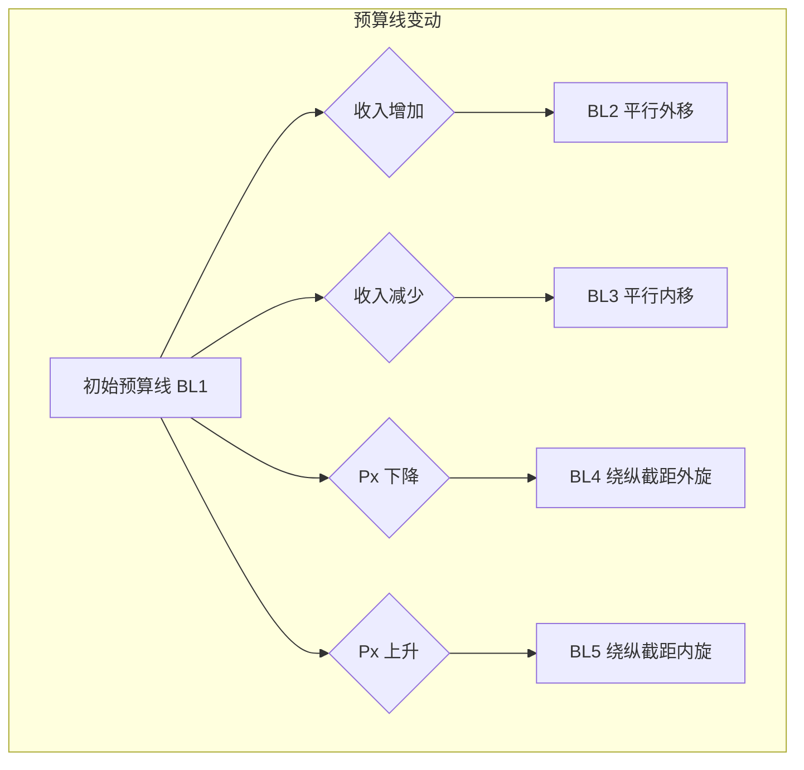

# 第三章：消费者选择的微观世界：偏好、预算与最优决策 (The Micro-World of Consumer Choice: Preferences, Budgets, and Optimal Decisions)

> "人类几乎随时随地都需要同胞的协助，要想仅仅依赖他人的恩惠，那是一定不行的。" —— 亚当·斯密 (Adam Smith)，《国富论》

上一章我们探讨了市场的宏观力量——供给与需求，它们共同决定了价格。但需求曲线为何向下倾斜？消费者是如何在琳琅满目的商品和有限的预算之间做出选择的？本章将深入消费者决策的微观世界，探索驱动个体购买行为的底层逻辑。我们将从经典的**效用理论 (Utility Theory)** 出发，理解消费者如何衡量满足感；然后引入现代消费者理论的核心工具——**无差异曲线 (Indifference Curves)** 和**预算线 (Budget Lines)**，分析消费者如何在偏好和预算约束下实现最优选择；接着，我们将剖析价格变化如何通过**替代效应 (Substitution Effect)** 和**收入效应 (Income Effect)** 影响消费决策；最后，我们将超越传统的完全理性假设，引入**行为经济学 (Behavioral Economics)** 的洞察，理解现实中消费者决策的复杂性和常见偏差。掌握这些理论，有助于我们更深刻地理解市场需求、品牌价值、消费趋势，并最终指导投资实践。

## 3.1 效用理论：从基数效用到序数效用

**效用 (Utility)** 是经济学中用来衡量消费者从消费某种商品或服务组合中获得的**满足感或幸福感 (satisfaction or happiness)** 的概念。它是主观的，因人而异，因时而异。

经济学家最初试图将效用视为一个可以**量化和测量**的指标，就像长度或重量一样，这被称为**基数效用理论 (Cardinal Utility Theory)**。基数效用论者假设效用可以用具体的单位（例如，"效用单位" utils）来衡量和比较。例如，消费一个苹果可能带来 10 utils 的效用，一个香蕉带来 8 utils。

**总效用 (Total Utility, TU)：** 消费者在一定时期内，从消费一定数量的某种商品或服务中获得的总满足感。
**边际效用 (Marginal Utility, MU)：** 每**额外增加一单位**商品或服务的消费所带来的**总效用的增量**。

$MU = \frac{\Delta TU}{\Delta Q}$

其中 $\Delta TU$ 是总效用的变化量，$\Delta Q$ 是消费量的变化量（通常 $\Delta Q = 1$）。

### 3.1.1 边际效用递减：解释需求曲线的基础

基数效用理论最重要的贡献之一是提出了**边际效用递减定律 (Law of Diminishing Marginal Utility)**。

**定律内容：** 在其他条件不变的情况下，随着消费者对某种商品的消费量持续增加，他从**连续增加的每一单位**消费中所获得的**边际效用是递减的**。

**直观解释：** 当你非常口渴时，喝第一杯水感觉非常爽（边际效用很高）；喝第二杯水感觉也不错，但满足感不如第一杯（边际效用下降）；继续喝下去，第三杯、第四杯带来的额外满足感会越来越少，甚至可能产生不适感（边际效用变为负数）。

| 饮水量 (杯) | 总效用 (TU) | 边际效用 (MU) |
| :---------- | :---------- | :------------ |
| 0           | 0           | -             |
| 1           | 10          | 10            |
| 2           | 18          | 8             |
| 3           | 24          | 6             |
| 4           | 28          | 4             |
| 5           | 30          | 2             |
| 6           | 30          | 0             |
| 7           | 28          | -2            |

```mermaid
xychart-beta
    title "总效用 (TU) 与边际效用 (MU)"
    x-axis "饮水量 (Q)" 0 --> 8
    y-axis "效用 (Utils)" -5 --> 35
    line "TU" data {
        x: [0, 1, 2, 3, 4, 5, 6, 7],
        y: [0, 10, 18, 24, 28, 30, 30, 28]
    }
    bar "MU" data {
        x: [1, 2, 3, 4, 5, 6, 7],
        y: [10, 8, 6, 4, 2, 0, -2]
    }
    annotation "MU=0, TU 最大" { x: 6, y: 30, text: "TU 达峰值, MU=0" dy: -10 }
```

**边际效用递减与需求曲线向下倾斜：**

边际效用递减定律为解释需求曲线为何向下倾斜提供了理论基础。

假设消费者是理性的，追求**效用最大化 (Utility Maximization)**。在用货币购买商品时，消费者会比较消费该商品获得的**边际效用 (MU)** 和为之付出的**价格 (P)** 所代表的**货币的边际效用 ($MU_m$)**（即牺牲掉的购买其他商品的机会）。

一个简化的决策法则是：消费者会一直购买某种商品，直到消费最后一单位该商品获得的边际效用 (MU) 等于其价格 (P) 与货币边际效用 ($MU_m$) 的乘积，即 $MU = P \times MU_m$。

更常用的消费者均衡条件是（假设货币边际效用恒定或比较不同商品）：消费者会在不同商品之间分配其支出，使得花费在**每一种商品上的最后一元钱**所带来的**边际效用相等**。

$\frac{MU_A}{P_A} = \frac{MU_B}{P_B} = ... = \frac{MU_N}{P_N}$

其中 $MU_A, MU_B, ..., MU_N$ 分别是商品 A, B, ..., N 的边际效用，$P_A, P_B, ..., P_N$ 分别是它们的价格。

现在考虑商品 A 的价格 $P_A$ 下降：
1.  价格 $P_A$ 下降，导致 $\frac{MU_A}{P_A} > \frac{MU_B}{P_B}$。这意味着现在花费在 A 上的最后一元钱带来的效用高于花费在其他商品上的效用。
2.  为了恢复均衡（最大化总效用），理性的消费者会增加对商品 A 的购买量。
3.  根据边际效用递减定律，随着商品 A 消费量的增加，$MU_A$ 会下降。
4.  消费者会持续增加购买量，直到 $MU_A$ 下降到使得 $\frac{MU_A}{P_A}$ 重新等于其他商品的 $\frac{MU}{P}$ 为止。

因此，价格下降导致需求量增加，这正是需求定律所描述的，也是需求曲线向下倾斜的原因。

**基数效用的局限性：** 效用是主观感受，难以找到客观的衡量单位，也无法在人与人之间进行精确比较。这使得基数效用论的应用受到限制。

## 3.2 现代消费者理论核心：无差异曲线与预算线

为了克服基数效用论的困难，现代经济学发展出了**序数效用理论 (Ordinal Utility Theory)**。该理论认为，消费者**不需要**知道不同消费组合带来的具体效用数值，只需要能够**判断和排序 (rank)** 不同消费组合的**偏好程度**即可。例如，消费者只需要知道自己"更喜欢组合 A 而不是组合 B"，或者"组合 A 和组合 B 无差异"，而不需要知道 A 比 B 好多少。

序数效用论的核心分析工具是**无差异曲线 (Indifference Curve)** 和**预算线 (Budget Line)**。

### 3.2.1 无差异曲线的性质与边际替代率 (MRS)

**无差异曲线：** 表示能够给消费者带来**相同满足程度 (相同效用水平)** 的**两种商品**的所有不同数量组合的轨迹。

```mermaid
xychart-beta
    title "无差异曲线 (Indifference Curve)"
    x-axis "商品 X (如：食品)"
    y-axis "商品 Y (如：衣物)"
    line "U1" data {
        options: { interpolation: "monotone" } 
        x: [2, 3, 5, 8],
        y: [10, 6, 3, 2]
    }
    line "U2 (更高効用)" data {
        options: { interpolation: "monotone" } 
        x: [3, 4, 6, 9],
        y: [12, 8, 5, 4]
    }
    annotation "A" { x: 3, y: 6, text: "A" }
    annotation "B" { x: 5, y: 3, text: "B" }
    annotation "C (更高効用)" { x: 6, y: 5, text: "C" }
```

*   **曲线上所有点的效用相同：** 在同一条无差异曲线 U1 上的 A 点和 B 点，虽然商品组合不同（A 点 Y 多 X 少，B 点 X 多 Y 少），但带给消费者的满足程度是相同的。
*   **无差异图谱 (Indifference Map)：** 平面上存在无数条无差异曲线，每一条代表不同的效用水平。离原点越远的无差异曲线代表的效用水平越高（如 U2 > U1），因为它们包含更多的商品。

**无差异曲线的基本性质 (基于理性消费者假设)：**

1.  **离原点越远，效用水平越高 (Higher is better)：** 这是基于"越多越好"的非饱和性假设 (non-satiation)。
2.  **向右下方倾斜 (Downward sloping)：** 为了保持效用水平不变，如果增加一种商品的消费，就必须减少另一种商品的消费。斜率为负。
3.  **同一平面上的任意两条无差异曲线不能相交 (Do not intersect)：** 如果相交，交点处的商品组合将同时属于两条代表不同效用水平的曲线，这与定义矛盾。
4.  **通常凸向原点 (Convex to the origin)：** 这反映了**边际替代率递减**的规律。

**边际替代率 (Marginal Rate of Substitution, MRS)：**

*   **定义：** 在保持**效用水平不变**的前提下，消费者愿意放弃**一单位**的某种商品（通常是纵轴商品 Y）以换取**额外一单位**另一种商品（通常是横轴商品 X）的**数量**。
*   **几何意义：** MRS 是无差异曲线上某一点**切线的斜率的绝对值**。
    $MRS_{XY} = -\frac{\Delta Y}{\Delta X} |_{U=\text{constant}}$
*   **MRS 递减规律 (Law of Diminishing MRS)：** 随着消费者拥有的 X 商品数量增加、Y 商品数量减少，他愿意为了获得更多 X 而放弃的 Y 的数量会越来越少。即 MRS 是递减的。
    *   **原因：** 当你拥有的 Y 很多而 X 很少时，Y 相对不那么珍贵，X 相对更珍贵，你愿意用较多的 Y 去换取 1 单位 X。反之，当你拥有的 X 很多而 Y 很少时，Y 变得更珍贵，你只愿意放弃很少的 Y 去换取 1 单位 X。
    *   **与边际效用的关系：** MRS 也可以表示为两种商品边际效用之比：$MRS_{XY} = \frac{MU_X}{MU_Y}$。边际效用递减是 MRS 递减的内在原因。
*   **凸向原点：** MRS 递减使得无差异曲线呈现出凸向原点的形状。

### 3.2.2 预算约束及其变动

消费者的选择不仅取决于偏好（由无差异曲线表示），还受到其**购买能力**的限制，这由**预算约束 (Budget Constraint)** 来体现。

**预算线 (Budget Line)：** 表示在消费者**收入固定**和**商品价格既定**的情况下，消费者**能够**购买到的两种商品的所有最大可能数量组合的轨迹。

假设消费者收入为 $I$，商品 X 和 Y 的价格分别为 $P_X$ 和 $P_Y$。如果消费者将所有收入用于购买这两种商品，则其支出 $P_X Q_X + P_Y Q_Y$ 不能超过其收入 $I$。

预算线方程：$I = P_X Q_X + P_Y Q_Y$

可以改写为：$Q_Y = \frac{I}{P_Y} - \frac{P_X}{P_Y} Q_X$

```mermaid
xychart-beta
    title "预算线 (Budget Line)"
    x-axis "商品 X (Qx)" 0 --> 12
    y-axis "商品 Y (Qy)" 0 --> 12
    line "BL" data {
        x: [0, 10],
        y: [5, 0]
    }
    annotation "纵轴截距 I/Py" { x: 0, y: 5, text: "I/Py", dx: 20 }
    annotation "横轴截距 I/Px" { x: 10, y: 0, text: "I/Px", dy: 20 }
    annotation "斜率 -Px/Py" { x: 5, y: 2.5, text: "斜率 = -Px/Py", dx: -20, dy: -10}
    annotation "预算可行集" { x: 3, y: 1.5, text: "预算可行集 (Budget Set)" }
```

*   **截距：**
    *   纵轴截距 $I/P_Y$ 表示消费者将所有收入用于购买商品 Y 时的最大数量。
    *   横轴截距 $I/P_X$ 表示消费者将所有收入用于购买商品 X 时的最大数量。
*   **斜率：** 预算线的斜率为 $-P_X/P_Y$。它表示为了多购买 1 单位商品 X，消费者必须放弃多少单位的商品 Y。这个比率由**市场价格决定**，代表了两种商品在市场上的**客观交换比率**。
*   **预算可行集 (Budget Set)：** 预算线及其左下方的区域构成了消费者能够负担得起的所有商品组合。

**预算线的变动：**

1.  **收入变化 (Income Change)：**
    *   收入增加 ($I$ 增大)，$P_X, P_Y$ 不变：预算线**平行向外移动**。购买力增强。
    *   收入减少 ($I$ 减小)，$P_X, P_Y$ 不变：预算线**平行向内移动**。购买力减弱。
2.  **价格变化 (Price Change)：**
    *   商品 X 价格下降 ($P_X$ 减小)，$I, P_Y$ 不变：预算线**绕着纵轴截距向外旋转**。横轴截距 $I/P_X$ 增大，斜率绝对值 $|-P_X/P_Y|$ 减小（变得更平坦）。
    *   商品 X 价格上升 ($P_X$ 增大)，$I, P_Y$ 不变：预算线**绕着纵轴截距向内旋转**。横轴截距 $I/P_X$ 减小，斜率绝对值增大（变得更陡峭）。
    *   商品 Y 价格变化类似，预算线绕着横轴截距旋转。
    *   如果两种商品价格按**相同比例**变化，效果等同于收入的反向变化，预算线平行移动。



### 3.2.3 最优消费组合：切点法则的经济含义

现在，我们将代表消费者**偏好**的无差异曲线和代表其**约束**的预算线结合起来，确定消费者的**最优选择 (Optimal Choice)**。

**最优选择点：** 在给定的预算约束下，能够达到**最高效用水平**（即达到离原点最远的那条无差异曲线）的消费组合。

```mermaid
xychart-beta
    title "消费者最优选择 (Optimal Choice)"
    x-axis "商品 X"
    y-axis "商品 Y"
    line "BL" data { x: [0, 10], y: [5, 0] }
    line "U1" data { options: { interpolation: "monotone" } x: [1, 2, 4], y: [4, 2, 1] } stroke "gray" linestyle "dashed"
    line "U2 (最优)" data { options: { interpolation: "monotone" } x: [2, 4, 7], y: [4, 2, 1] } stroke "blue"
    line "U3 (无法达到)" data { options: { interpolation: "monotone" } x: [3, 5, 8], y: [5, 3, 2] } stroke "red" linestyle "dashed"
    annotation "最优选择点 E" { x: 4, y: 2, text: "E (最优)" }
    annotation "预算线 BL" { x: 8, y: 1, text: "BL" }
    annotation "无差异曲线 U1" { x: 1.5, y: 3, text: "U1" dx: -10 }
    annotation "无差异曲线 U2" { x: 3, y: 3, text: "U2" dx: 10 }
    annotation "无差异曲线 U3" { x: 4, y: 4, text: "U3" dx: 10 }
```

*   消费者希望达到尽可能高的无差异曲线 (如 U3)，但受到预算线 BL 的限制。
*   无差异曲线 U1 与预算线相交于两点，是可行的，但并非最优，因为存在预算线上的其他点可以达到更高的效用水平 (U2)。
*   **最优选择点 (E)** 出现在**预算线与某条无差异曲线相切 (tangent)** 的地方。

**切点法则的经济含义：**

在切点 E 处，预算线和无差异曲线 U2 的**斜率相等**。

*   预算线的斜率绝对值为 $P_X/P_Y$ (市场客观交换比率)。
*   无差异曲线的斜率绝对值为 $MRS_{XY} = MU_X/MU_Y$ (消费者主观交换比率)。

因此，在最优选择点 E 处，必然满足：

$MRS_{XY} = \frac{P_X}{P_Y}$

或者写为：

$\frac{MU_X}{MU_Y} = \frac{P_X}{P_Y}$ $\implies$ $\frac{MU_X}{P_X} = \frac{MU_Y}{P_Y}$

这个条件与我们之前在基数效用理论下得到的消费者均衡条件完全一致！它的经济含义是：

**在最优状态下，消费者花费在每种商品上的最后一元钱所带来的边际效用（满足感）是相等的。**

如果 $\frac{MU_X}{P_X} > \frac{MU_Y}{P_Y}$，意味着花在 X 上的钱比花在 Y 上的钱更"值"，消费者就会减少 Y 的消费，增加 X 的消费，直到两者相等为止。这个调整过程确保消费者在预算约束内实现了效用最大化。

## 3.3 价格变化的涟漪：替代效应与收入效应的分解 (希克斯 vs. 斯拉茨基)

当一种商品的价格发生变化时，消费者的最优选择点会移动，从而导致对该商品需求量的变化。这种需求量的总变化可以分解为两个独立的部分：**替代效应 (Substitution Effect)** 和**收入效应 (Income Effect)**。

假设商品 X 的价格 $P_X$ 下降：

1.  **替代效应：**
    *   **含义：** 由于商品 X 相对于其他商品变得**更便宜**了，消费者倾向于用 X 来**替代**其他相对变贵的商品，从而增加对 X 的需求。
    *   **方向：** 替代效应**总是**与价格变化方向相反。价格下降 $\rightarrow$ 替代效应导致需求量增加；价格上升 $\rightarrow$ 替代效应导致需求量减少。
    *   **衡量 (希克斯方法)：** 保持**实际效用水平不变** (停留在同一条无差异曲线上)，仅考虑相对价格变化对需求量的影响。即找到与原无差异曲线相切、但斜率等于新价格比率的假想预算线对应的消费点。
2.  **收入效应：**
    *   **含义：** 商品 X 价格下降，使得消费者的**实际购买力 (real income) 增加**了（即使名义收入不变，也能买更多东西）。这种实际收入的变化会影响对商品 X 的需求量。
    *   **方向：** 收入效应的方向取决于商品是**正常品**还是**低档品**。
        *   **正常品 (Normal Good)：** 实际收入增加 $\rightarrow$ 收入效应导致需求量增加。
        *   **低档品 (Inferior Good)：** 实际收入增加 $\rightarrow$ 收入效应导致需求量减少。
    *   **衡量 (希克斯方法)：** 从替代效应结束点移动到最终最优选择点的过程，反映了实际收入变化的影响。

**总效应 (Total Effect) = 替代效应 + 收入效应**

**图形分解 (希克斯方法, Hicksian Decomposition)：**

假设 X 价格下降，预算线从 BL1 变为 BL2，最优选择点从 E1 变为 E2。

1.  **总效应：** 从 E1 到 E2，X 的需求量从 $Q_{X1}$ 增加到 $Q_{X2}$。
2.  **替代效应：** 作一条与新预算线 BL2 平行、且与原无差异曲线 U1 相切的**假想预算线** BL'。切点为 E'。从 E1 到 E' 的移动 ($Q_{X1}$ 到 $Q_{X'}$ 的变化) 是替代效应。由于相对价格变化，即使保持原有效用水平，也会增加 X 的消费。
3.  **收入效应：** 从 E' 到 E2 的移动 ($Q_{X'}$ 到 $Q_{X2}$ 的变化) 是收入效应。这相当于实际收入增加（从假想预算线 BL' 移到最终预算线 BL2）导致的需求量变化。如果 X 是正常品，E2 在 E' 的右侧；如果 X 是低档品，E2 在 E' 的左侧。

```mermaid
xychart-beta
    title "价格下降的替代效应与收入效应 (希克斯分解, 正常品)"
    x-axis "商品 X (Qx)"
    y-axis "商品 Y (Qy)"
    line "BL1" data { x: [0, 8], y: [4, 0] } stroke "gray" 
    line "BL2" data { x: [0, 12], y: [4, 0] } stroke "blue"
    line "BL' (假想)" data { x: [0, 10], y: [3, 0] } stroke "green" linestyle "dashed"
    line "U1" data { options: { interpolation: "monotone" } x: [1.5, 4, 7], y: [3.5, 1, 0.4] } stroke "gray"
    line "U2" data { options: { interpolation: "monotone" } x: [3, 6, 9], y: [3, 1, 0.4] } stroke "blue"
    annotation "E1" { x: 4, y: 1, text: "E1(Qx1)" }
    annotation "E2" { x: 6, y: 1, text: "E2(Qx2)" }
    annotation "E'" { x: 5, y: 0.8, text: "E'(Qx')" } 
    annotation "总效应" { x: 5, y: 0.2, text: "<-- 总效应 -->" }
    annotation "替代效应" { x: 4.5, y: 0.5, text: "<-- SE -->" dy: -10}
    annotation "收入效应" { x: 5.5, y: 0.5, text: "<-- IE -->" dy: -10}
    
    %% Arrows for effects
    marker "arrow" { type: "arrow", orient: "auto", scale: 0.7 }
    path "E1_to_E'" data [{x:4, y:1.1}, {x:5, y:0.9}] stroke "green" marker-end "arrow" linestyle "dashed"
    path "E'_to_E2" data [{x:5, y:0.9}, {x:6, y:1.1}] stroke "orange" marker-end "arrow" linestyle "dashed"
```

**斯拉茨基分解 (Slutsky Decomposition)：** 另一种分解方法，其替代效应保持**购买力不变**（即调整名义收入使得原来的 E1 点刚好在新价格下也能买得起），而不是保持效用水平不变。两种方法概念略有差异，但结论相似。

**替代效应与收入效应总结：**

*   **替代效应**总是与价格反向变动，是导致需求曲线向下倾斜的根本原因。
*   **收入效应**取决于商品性质：
    *   **正常品：** 收入效应与替代效应方向相同，共同作用使价格下降时需求量增加。
    *   **低档品：** 收入效应与替代效应方向相反。价格下降时，替代效应使需求量增加，收入效应使需求量减少。
        *   **通常情况 (Most Inferior Goods)：** 替代效应**大于**收入效应，总效应仍为负（价格下降，需求量增加），需求曲线向下倾斜。
        *   **吉芬商品 (Giffen Goods)：** 收入效应**大于**替代效应，总效应为正（价格下降，需求量反而减少），需求曲线向上倾斜。这是一种理论上可能但现实中极为罕见的特殊情况。

### 3.3.1 吉芬商品之谜：理论可能性与现实罕见性

**吉芬商品 (Giffen Good)** 是一种特殊的低档品，其**负向的收入效应**的强度超过了**替代效应**，导致价格上升时需求量反而增加，价格下降时需求量反而减少，违反了通常的需求定律。

**存在的条件（非常苛刻）：**

1.  该商品必须是**低档品 (Inferior Good)**。
2.  该商品在消费者的**总支出中必须占有很大的比重** (heavily weighted in the budget)，这样价格变化产生的收入效应才会足够强。
3.  必须**缺乏**近乎完美的**替代品**。

**经典例子（存疑）：** 历史上，罗伯特·吉芬爵士观察到爱尔兰大饥荒时期，土豆价格上涨，但贫困家庭对土豆的需求反而增加了。可能的解释是：土豆是当时爱尔兰贫民最主要的食物来源（占支出比重极大），当土豆价格上涨时，他们的实际收入大幅下降，买不起其他更昂贵的食物（如少量肉类），只能被迫购买更多的、相对仍然最便宜的土豆来维持生存。

然而，吉芬商品的实证证据非常稀少且充满争议。它更多地作为一种理论上的可能性存在，提醒我们需求定律并非绝对普适，但在绝大多数情况下，需求曲线是向下倾斜的。

## 3.4 超越完全理性：行为经济学洞察

传统消费者理论建立在**完全理性 (perfect rationality)** 的假设之上，认为消费者拥有完美的计算能力、完全的信息、稳定的偏好，并始终追求效用最大化。然而，现实中的人类决策并非总是如此"完美"。**行为经济学 (Behavioral Economics)** 结合了心理学的洞见，研究人类在决策过程中系统性的认知偏差和情绪影响，为理解消费者行为提供了更贴近现实的视角。

### 3.4.1 禀赋效应、损失厌恶、锚定效应等常见偏差

以下是一些常见的、影响消费者选择的行为偏差：

1.  **禀赋效应 (Endowment Effect)：** 人们倾向于**高估**自己已经拥有的物品的价值，即"敝帚自珍"。卖出自己拥有物品所要求的最低价格，通常高于他们愿意为购买同样物品所支付的最高价格。这解释了为何二手市场交易有时不活跃。
2.  **损失厌恶 (Loss Aversion)：** 人们对**损失**的**敏感程度**远**高于**对等量**收益**的敏感程度。失去 100 元带来的痛苦感，通常大于得到 100 元带来的快乐感。这使得人们在决策中倾向于规避损失，即使可能错过潜在的收益（如过早卖出上涨的股票，或持有亏损股票不愿止损）。
3.  **锚定效应 (Anchoring Effect)：** 人们的决策容易受到**最初接触到的信息（锚点）** 的影响，即使该信息与决策本身并不相关。例如，商家先标一个很高的"原价"（锚点），再给出"折扣价"，会让消费者觉得更划算。
4.  **框架效应 (Framing Effect)：** 同一个问题，用**不同的表述方式 (框架)** 呈现，会影响人们的选择。例如，"手术后 90% 的存活率"比"手术后 10% 的死亡率"更容易被接受，尽管两者信息相同。
5.  **现状偏见 (Status Quo Bias)：** 人们倾向于**维持当前状态**，不愿意做出改变，即使改变可能带来更好的结果。例如，默认的选项往往会被更多人接受。
6.  **心理账户 (Mental Accounting)：** 人们倾向于在头脑中为不同的目标或来源建立不同的"账户"，并区别对待。例如，意外得来的奖金可能更容易被挥霍掉，而不是像工资一样谨慎使用。
7.  **过度自信 (Overconfidence)：** 人们倾向于高估自己的知识、能力和判断的准确性。
8.  **羊群效应 (Herding Behavior)：** 个体容易受到群体行为的影响，跟随他人的决策，即使自己的判断不同。

这些行为偏差表明，消费者的决策过程并非纯粹的理性计算，而是受到认知局限、情绪和情境因素的复杂影响。

### 3.4.2 "助推"(Nudge) 理论及其应用

认识到人类决策的非理性特征，行为经济学家理查德·泰勒 (Richard Thaler) 和卡斯·桑斯坦 (Cass Sunstein) 提出了**"助推" (Nudge)** 理论。

**定义：** 助推是指在**不**限制人们选择自由的前提下，通过**改变选择架构 (choice architecture)**，利用人们的心理偏差，**巧妙地引导**人们做出更符合其自身长远利益或社会期望的决策。

**助推的特点：**

*   **保留选择自由：** 不强制，不禁止任何选项。
*   **成本低廉：** 通常不需要大量的财政投入。
*   **利用心理学原理：** 基于对行为偏差的理解。

**应用实例：**

*   **养老金计划的默认选项：** 将"自动加入"设为默认选项，利用现状偏见，可以显著提高养老金计划的参与率。
*   **食品标签和摆放：** 在食堂将健康的食物放在更显眼的位置，利用便利性原则，可以引导人们选择更健康的饮食。
*   **节能提醒：** 告知用户他们的能耗与邻居的比较，利用社会规范，可以激励人们节约能源。
*   **器官捐赠的默认设置：** 将"默认同意"设为器官捐赠选项（允许选择退出），可以大幅提高器官捐赠率。

助推理论在公共政策、商业营销、健康管理等领域有着广泛的应用，它提供了一种在尊重个体自由的同时，温和地改善决策结果的有效途径。

---

***投资启示：理解消费升级/降级趋势，品牌价值与用户粘性，预测新产品接受度，警惕投资者自身的行为偏差。***

本章关于消费者选择的理论，对投资分析具有重要的指导意义：

1.  **理解消费升级/降级趋势 (收入效应、正常品/低档品)：** 随着居民收入水平的变化，消费结构会发生演变。收入弹性 ($YED$) 的概念有助于判断哪些行业或产品会受益于（或受损于）收入增长。
    *   **消费升级：** 经济增长、收入提高时，人们对奢侈品 ($YED > 1$) 和高品质正常品的需求增长更快，相关行业（如高端品牌、旅游、娱乐、教育、医疗保健）迎来发展机遇。
    *   **消费降级：** 经济下行、收入预期悲观时，人们可能增加对低档品 ($YED < 0$) 的消费，减少奢侈品和非必需品的支出，关注高性价比商品，利好相关领域（如折扣零售、二手平台）。分析收入变化趋势和不同商品的收入弹性，有助于把握结构性消费机会。
2.  **理解品牌价值与用户粘性 (偏好、替代效应、转换成本)：** 无差异曲线体现了消费者的偏好。强大的品牌能够塑造消费者偏好，降低产品的可替代性（替代效应减弱），提高用户粘性。当消费者对某个品牌形成依赖或转换到其他品牌需要付出较高成本（时间、金钱、学习成本等）时，该品牌的需求价格弹性会降低，企业就拥有更强的定价权和更稳定的市场份额。投资时需评估品牌的强度、用户转换成本以及它们构筑的"护城河"。
3.  **预测新产品接受度 (边际效用、无差异曲线)：** 新产品能否成功，取决于它能否给消费者带来足够的边际效用，并达到比现有产品更高的无差异曲线（在预算约束内）。分析新产品的创新点、解决了哪些痛点、相对现有产品的性价比等，有助于判断其市场潜力。
4.  **警惕投资者自身的行为偏差 (行为经济学)：** 行为经济学揭示的认知偏差不仅存在于消费者，同样普遍存在于投资者身上。过度自信可能导致过于频繁的交易；损失厌恶可能导致"死捂"亏损股；锚定效应可能使估值判断受初始买入价影响；羊群效应可能导致追涨杀跌。认识到这些潜在的非理性陷阱，是做出更客观、更理性投资决策的前提。投资者需要建立严格的投资纪律，利用模型和数据来辅助决策，并时刻反省自身的行为模式，避免情绪化交易。

深入理解消费者行为的微观基础，是洞察市场需求变化、评估企业竞争力、并最终做出成功投资决策的关键一步。 