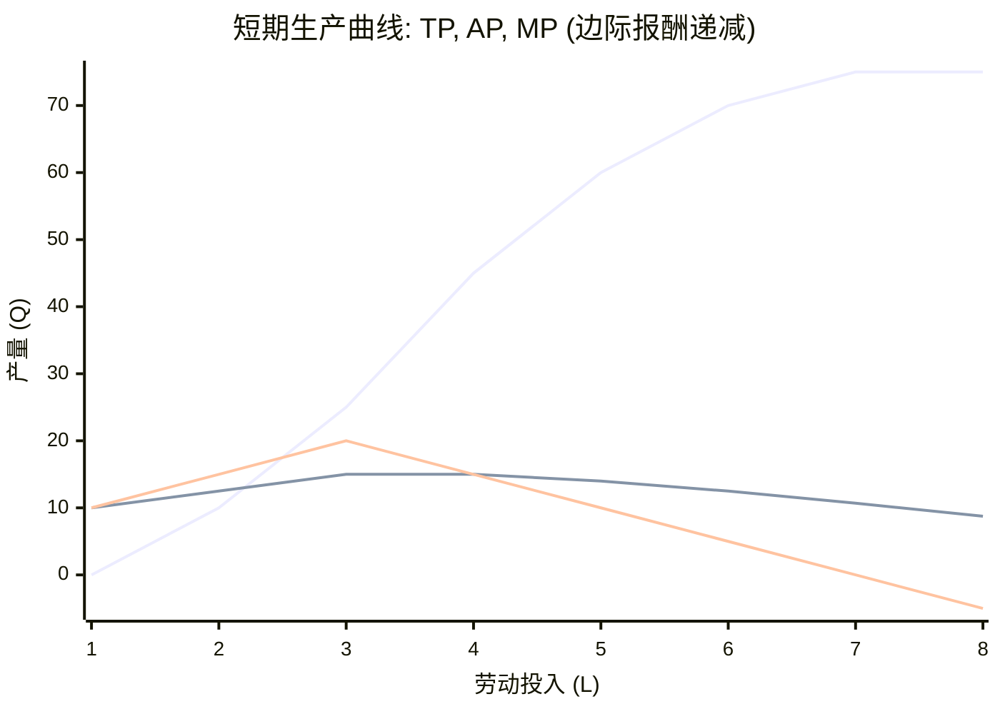

Okay, here is the content of Chapter 4 in Markdown format.

# 第四章：生产者的决策空间：技术、成本与利润最大化 (The Producer's Decision Space: Technology, Costs, and Profit Maximization)

> "生产的目的就是消费。" —— 亚当·斯密 (Adam Smith)

前两章我们聚焦于市场上的需求方——消费者，以及供求双方如何共同决定市场价格。现在，我们将目光转向供给方——**生产者 (Producer)**，通常以**企业 (Firm)** 的形式存在。企业是市场经济的核心参与者，它们利用各种生产要素（劳动、资本、土地、原材料等），通过特定的技术和组织方式，生产出商品或服务以满足消费者需求。本章将深入探讨生产者的决策空间，分析其面临的技术约束、成本结构，以及在这些约束下如何做出最优决策以实现其目标——通常假设为**利润最大化 (Profit Maximization)**。理解生产者的行为逻辑，是把握行业供给、分析企业竞争力和评估投资价值的基础。

## 4.1 企业的目标函数：利润最大化假设及其替代 (规模、市场份额)

在经济学分析中，通常假设企业的主要目标是**利润最大化**。利润是企业**总收益 (Total Revenue, TR)** 与**总成本 (Total Cost, TC)** 之间的差额。

*   **总收益 (TR)：** 企业出售其产品或服务所获得的总收入，通常等于价格 (P) 乘以销售数量 (Q)，即 $TR = P \times Q$。
*   **总成本 (TC)：** 企业在生产过程中使用所有生产要素所付出的**全部成本**。这里强调的是**经济成本 (Economic Cost)**，它不仅包括企业实际支付的**显性成本 (Explicit Costs)**，还包括未支付但确实存在的**隐性成本 (Implicit Costs)**。
    *   **显性成本：** 企业为购买或租用生产要素而发生的**实际货币支出**，例如支付给工人的工资、购买原材料的费用、租用厂房的租金、支付的利息等。这些成本通常记录在会计账簿上。
    *   **隐性成本：** 企业使用**自有**生产要素的机会成本，这些成本**没有**伴随直接的货币支出，但代表了放弃的其他最佳用途的价值。最典型的隐性成本是：
        *   **自有资本的机会成本：** 企业主投入自有资金用于经营，放弃了将这笔资金用于其他投资（如存银行、购买债券）所能获得的利息或回报。
        *   **自有土地/房产的机会成本：** 企业使用自有土地或房产，放弃了将其出租所能获得的租金收入。
        *   **企业主自身才能的机会成本：** 企业主投入时间和精力经营企业，放弃了在其他地方工作所能获得的最高工资或收入。
*   **经济利润 (Economic Profit) = 总收益 (TR) - 总成本 (TC) (显性成本 + 隐性成本)**
*   **会计利润 (Accounting Profit) = 总收益 (TR) - 显性成本 (Explicit Costs)**

**关键区别：** 经济利润考虑了所有机会成本，而会计利润只考虑显性成本。因此，**经济利润通常小于会计利润**。

*   **经济利润 > 0：** 表示企业的收益超过了使用所有资源（包括自有资源）的全部机会成本，企业获得了超额回报，是值得继续经营的。
*   **经济利润 = 0：** 表示企业的收益恰好弥补了所有机会成本，企业获得了**正常利润 (Normal Profit)**。正常利润是企业家才能这种生产要素应得的回报，是维持企业继续经营的最低要求。此时会计利润通常为正。
*   **经济利润 < 0：** 表示企业的收益不足以弥补所有机会成本，企业处于亏损状态，从经济学角度看，将资源用于其他途径会更好。

**为何假设利润最大化？**

1.  **生存压力：** 在竞争性市场中，不能有效控制成本、实现盈利的企业最终会被淘汰。
2.  **所有者利益：** 企业的所有者（股东）通常期望获得尽可能高的投资回报。
3.  **分析简洁性：** 利润最大化提供了一个清晰、可量化的目标，便于建立模型和进行理论推导。

**替代目标：**

尽管利润最大化是标准假设，但现实中，尤其是在大型现代企业中，所有权和经营权分离（股东 vs. 管理层），企业的目标可能更加复杂：

*   **销售收入最大化 (Sales Revenue Maximization)：** 管理层可能更关注扩大销售额，因为这通常与管理层的薪酬、声望和权力挂钩（威廉·鲍莫尔模型）。但这通常是在保证最低利润水平的前提下进行的。
*   **市场份额最大化 (Market Share Maximization)：** 在某些发展阶段或竞争激烈的行业，企业可能优先追求市场份额，以建立规模优势、品牌认知度或网络效应，即使短期内牺牲部分利润。
*   **企业规模最大化 (Firm Size Maximization)：** 管理层可能有扩大企业规模本身的动机。
*   **社会责任目标 (Social Responsibility Goals)：** 越来越多的企业开始关注环境、社会和治理 (ESG) 方面的目标，可能在一定程度上平衡利润与其他社会价值。
*   **生存目标 (Survival)：** 在极端困难时期，企业的主要目标可能仅仅是维持生存。

然而，从长期来看，利润仍然是企业生存和发展的基础。即使存在其他短期目标，追求利润最大化的基本逻辑在大多数情况下仍然是理解企业行为的关键。因此，在后续分析中，我们主要基于**经济利润最大化**这一核心假设。

## 4.2 生产的奥秘：技术约束与效率边界

企业如何将投入转化为产出？这取决于其掌握的**生产技术 (Production Technology)**。技术代表了在特定知识水平下，将生产要素组合起来生产商品或服务的各种可行方式。

**生产函数 (Production Function)：** 描述在**既定技术水平**下，企业所使用的**生产要素数量**与其所能生产的**最大产出量**之间的**函数关系**。

通常表示为： $Q = f(L, K, N, ...)$

其中：
*   $Q$ 是产出量。
*   $L$ 是劳动投入量。
*   $K$ 是资本投入量。
*   $N$ 是土地或其他自然资源投入量。
*   $...$ 代表其他可能的投入（如原材料、能源、企业家才能等）。
*   $f$ 代表了由当前技术水平决定的投入与产出之间的关系。

**关键点：**
*   **技术约束：** 生产函数体现了技术对生产能力的限制。企业无法用给定投入生产出超过 $f$ 所决定的最大产出量。
*   **效率边界：** 生产函数代表的是**技术上有效率 (technically efficient)** 的生产方式，即用给定投入实现了最大产出，或者用最少投入实现了给定产出。
*   **技术进步：** 技术进步意味着可以用**同样数量**的投入生产出**更多**的产出，或者用**更少**的投入生产出**同样数量**的产出。这会导致生产函数本身发生变化（通常是向上移动）。

为了简化分析，我们通常假设只使用两种主要投入：**劳动 (L)** 和**资本 (K)**。生产函数简化为：$Q = f(L, K)$。

经济学家区分**短期 (Short Run)** 和**长期 (Long Run)** 的生产决策：

*   **短期：** 指生产者**至少有一种**生产要素的投入量是**固定不变**，无法调整的时期。通常假设**资本 (K) 是固定**的（如厂房、大型设备），而**劳动 (L) 是可变**的。短期不是指一个具体的日历时间长度，而是指要素可调整性的时间框架。
*   **长期：** 指生产者**所有**生产要素的投入量都**可以调整**的时期。企业可以改变厂房规模、增加或减少机器设备等。长期中没有固定要素和可变要素之分。

### 4.2.1 短期生产：边际报酬递减规律的普遍性

在短期内，由于资本 K 固定，产出 Q 的变化仅取决于可变要素劳动 L 的投入量。短期生产函数为 $Q = f(L, \bar{K})$，其中 $\bar{K}$ 表示固定的资本量。

与短期生产相关的三个重要概念：

1.  **总产量 (Total Product, TP)：** 在给定固定投入下，使用一定数量可变投入所能生产出来的全部产量。即 $TP_L = Q = f(L, \bar{K})$。
2.  **平均产量 (Average Product, AP)：** 平均每单位可变投入所生产的产量。$AP_L = \frac{TP_L}{L} = \frac{Q}{L}$。
3.  **边际产量 (Marginal Product, MP)：** 每**额外增加一单位**可变投入所带来的**总产量的增量**。$MP_L = \frac{\Delta TP_L}{\Delta L} = \frac{\Delta Q}{\Delta L}$。

**边际报酬递减规律 (Law of Diminishing Marginal Returns) / 边际产量递减规律：**

**定律内容：** 在技术水平和其他要素投入保持不变（特别是至少一种要素固定）的情况下，当把一种可变要素（如劳动）的投入连续增加到某个固定要素（如资本）上时，在超过**某一个点**之后，**额外增加的每一单位**可变要素所带来的**边际产量 (MP)** 最终会**递减**。

**直观解释：** 假设一个固定大小的厨房（资本 K 固定），不断增加厨师（劳动 L）。最初增加厨师可以大幅提高出餐效率（MP 递增）。但随着厨师越来越多，厨房变得拥挤，厨师之间可能互相干扰，设备需要排队使用，每个新增厨师对总产量的贡献（边际产量）就会越来越小，甚至可能变为负数（人太多帮倒忙）。

**TP, AP, MP 曲线的关系：**

| 劳动投入 (L) | 总产量 (TP) | 平均产量 (AP=TP/L) | 边际产量 (MP=ΔTP/ΔL) |
| :----------- | :---------- | :----------------- | :------------------- |
| 0            | 0           | -                  | -                    |
| 1            | 10          | 10                 | 10                   |
| 2            | 25          | 12.5               | 15                   |
| 3            | 45          | 15                 | 20                   |
| 4            | 60          | 15                 | 15                   |
| 5            | 70          | 14                 | 10                   |
| 6            | 75          | 12.5               | 5                    |
| 7            | 75          | 10.7               | 0                    |
| 8            | 70          | 8.75               | -5                   |



**关键关系：**
*   MP 曲线先上升后下降，最终变为负数，体现了边际报酬先递增（由于分工协作效率提高）后递减（由于固定要素的限制）的规律。
*   当 MP > AP 时，AP 上升。
*   当 MP < AP 时，AP 下降。
*   MP 曲线与 AP 曲线相交于 AP 曲线的最高点。（边际值大于平均值，拉高平均值；边际值小于平均值，拉低平均值）。
*   当 MP = 0 时，TP 达到最大值。之后若继续增加投入，MP < 0，TP 开始下降。

**理性生产阶段：** 理性的生产者通常会在**第二阶段**进行生产，即从 AP 最高点到 TP 最高点（MP=0）的区域。在此阶段，AP 和 MP 都大于零且递减。第一阶段（MP>AP）继续增加投入更有效率，第三阶段（MP<0）增加投入反而导致减产，是不理性的。

**边际报酬递减是普遍规律：** 只要存在至少一种固定投入，边际报酬递减规律就必然发生。它是短期成本曲线形状的重要决定因素。

### 4.2.2 长期生产：等产量线、等成本线与最优要素组合

在长期中，所有生产要素（假设为 L 和 K）都是可变的。企业需要决定使用多少劳动和多少资本的组合来实现目标产量，并尽可能降低成本。

**等产量线 (Isoquant Curve)：**
*   **定义：** 表示能够生产**相同产出量 (Q)** 的所有不同的**劳动 (L) 和资本 (K)** 投入组合的轨迹。
*   **类比：** 等产量线在生产者理论中的地位类似于无差异曲线在消费者理论中的地位。

```mermaid
xychart-beta
    title "等产量线 (Isoquant Curve)"
    x-axis "劳动 (L)"
    y-axis "资本 (K)"
    line "Q1" data {
        options: { interpolation: "monotone" }
        x: [2, 3, 5, 8],
        y: [10, 6, 3, 2]
    }
    line "Q2 (更高产量)" data {
        options: { interpolation: "monotone" }
        x: [3, 4, 6, 9],
        y: [12, 8, 5, 4]
    }
    annotation "A" { x: 3, y: 6, text: "A" }
    annotation "B" { x: 5, y: 3, text: "B" }
    annotation "C (更高产量)" { x: 6, y: 5, text: "C" }
```

*   **性质：**
    *   离原点越远的等产量线代表的产量水平越高 (Q2 > Q1)。
    *   向右下方倾斜：为了保持产量不变，增加一种要素投入，必须减少另一种要素投入。
    *   任意两条等产量线不能相交。
    *   通常凸向原点：这反映了边际技术替代率递减。

**边际技术替代率 (Marginal Rate of Technical Substitution, MRTS)：**
*   **定义：** 在保持**产量水平不变**的前提下，企业愿意用**一种要素（如资本 K）去替代额外一单位另一种要素（如劳动 L）** 的**比率**。
*   **几何意义：** MRTS 是等产量线上某一点**切线的斜率的绝对值**。
    $MRTS_{LK} = -\frac{\Delta K}{\Delta L} |_{Q=\text{constant}}$
*   **MRTS 递减规律：** 随着劳动 L 投入增加、资本 K 投入减少，每增加一单位劳动所能替代的资本数量会越来越少。原因在于要素的边际产量会变化。
*   **与边际产量的关系：** MRTS 等于两种要素的边际产量之比：$MRTS_{LK} = \frac{MP_L}{MP_K}$。

**等成本线 (Isocost Line)：**
*   **定义：** 表示在**生产要素价格 (劳动工资 w, 资本租金 r)** 既定的条件下，生产者可以用**相同的总成本 (TC)** 购买到的所有不同的**劳动 (L) 和资本 (K)** 投入组合的轨迹。
*   **类比：** 等成本线类似于消费者理论中的预算线。
*   **方程：** $TC = wL + rK$
*   **改写为：** $K = \frac{TC}{r} - \frac{w}{r} L$
*   **斜率：** 等成本线的斜率为 $-w/r$，表示两种要素价格的比率，即市场对两种要素的客观替代比率。
*   **截距：** 纵轴截距 $TC/r$，横轴截距 $TC/w$。

**最优要素组合 (Optimal Input Combination)：**

生产者追求的目标通常是：
1.  **成本最小化 (Cost Minimization)：** 在**给定产出水平** (即某条等产量线) 下，选择成本最低的要素组合。
2.  **产量最大化 (Output Maximization)：** 在**给定总成本** (即某条等成本线) 下，选择能实现最大产出的要素组合。

这两种目标的决策结果是相同的，都发生在**等产量线与等成本线相切**的点。

```mermaid
xychart-beta
    title "生产者最优要素组合 (成本最小化/产量最大化)"
    x-axis "劳动 (L)"
    y-axis "资本 (K)"
    line "Isoquant (Q0)" data { options: { interpolation: "monotone" } x: [2, 4, 7], y: [7, 3, 1.5] } stroke "blue"
    line "Isocost1 (TC1)" data { x: [0, 8], y: [4, 0] } stroke "gray" linestyle "dashed"
    line "Isocost2 (TC2, 最优)" data { x: [0, 10], y: [5, 0] } stroke "red"
    line "Isocost3 (TC3)" data { x: [0, 12], y: [6, 0] } stroke "gray" linestyle "dashed"
    annotation "最优组合点 E" { x: 4, y: 3, text: "E (最优)" }
    annotation "等产量线 Q0" { x: 7, y: 1.5, text: "Q0" dx: 10 }
    annotation "等成本线 TC2" { x: 8, y: 1, text: "TC2 (最低成本)" dy: -10 }
```

*   **切点 E 的条件：** 等产量线斜率 (绝对值 MRTS) = 等成本线斜率 (绝对值 w/r)。
    $MRTS_{LK} = \frac{w}{r}$
*   **代入 $MRTS = MP_L / MP_K$：**
    $\frac{MP_L}{MP_K} = \frac{w}{r}$ $\implies$ $\frac{MP_L}{w} = \frac{MP_K}{r}$
*   **经济含义：** 在最优要素组合下，企业花费在**每一种生产要素上的最后一元钱**所带来的**边际产量是相等的**。这意味着企业以最低的成本实现了给定的产出，或者用给定的成本实现了最大的产出。

**扩展路径 (Expansion Path)：** 将不同成本水平下的最优要素组合点连接起来，形成的曲线称为扩展路径。它显示了当企业扩大生产规模时，要素投入组合如何变化。

### 4.2.3 规模报酬：递增、不变与递减及其成因

**规模报酬 (Returns to Scale)** 描述的是在**所有生产要素按相同比例变化**时，**产出变化**的情况。这是**长期**概念，因为所有要素都可变。

假设所有投入要素都增加 $\lambda$ 倍 ($\lambda > 1$)，即 $L' = \lambda L, K' = \lambda K$，比较新的产出 $Q' = f(L', K') = f(\lambda L, \lambda K)$ 与原产出 $Q$ 的 $\lambda$ 倍 (即 $\lambda Q$) 之间的关系：

1.  **规模报酬递增 (Increasing Returns to Scale, IRS)：** 产出的增加**比例大于**所有投入要素增加的比例。即 $Q' > \lambda Q$。例如，投入增加 1 倍，产出增加超过 1 倍。
    *   **成因：**
        *   **专业化与分工 (Specialization and Division of Labor)：** 规模扩大使得更精细的分工成为可能，提高效率。
        *   **技术因素 (Technological Factors)：** 某些大型设备只有在达到一定生产规模时才能有效使用。
        *   **管理效率提升 (Managerial Efficiency)：** 规模化可能带来更专业的管理。
        *   **不可分割性 (Indivisibilities)：** 某些投入（如研发、广告）具有初始固定成本，规模扩大可以摊薄这些成本。
        *   **几何因素 (Geometric Factors)：** 如容器的容积增长速度快于表面积增长速度。
2.  **规模报酬不变 (Constant Returns to Scale, CRS)：** 产出的增加**比例等于**所有投入要素增加的比例。即 $Q' = \lambda Q$。例如，投入增加 1 倍，产出也正好增加 1 倍。
    *   **成因：** 当递增因素消失，且未出现递减因素时，可能出现规模报酬不变。这通常被视为一个理想化的基准情况。
3.  **规模报酬递减 (Decreasing Returns to Scale, DRS)：** 产出的增加**比例小于**所有投入要素增加的比例。即 $Q' < \lambda Q$。例如，投入增加 1 倍，产出增加不足 1 倍。
    *   **成因：** 通常与**管理效率下降 (Managerial Inefficiency)** 有关。当企业规模过于庞大时：
        *   **协调与沟通困难 (Coordination and Communication Problems)：** 部门层级增多，信息传递失真，决策效率降低。
        *   **官僚主义与激励问题 (Bureaucracy and Incentive Issues)：** 管理层级复杂，可能导致责任不清、激励不足。
        *   **监督成本增加 (Monitoring Costs)：** 监督大量员工的成本上升。

**与边际报酬递减的区别：**
*   **边际报酬递减**是**短期**概念，至少一种要素固定，描述增加**一种**可变要素对边际产量的影响。
*   **规模报酬**是**长期**概念，所有要素**同比例**变化，描述**所有**要素变化对总产出的影响。
两者描述的是不同维度的问题，可能同时存在（例如，短期内存在边际报酬递减，但长期内可能存在规模报酬递增）。

规模报酬是决定长期成本曲线形状的关键因素。

### 4.2.4 技术进步对生产函数的影响

**技术进步 (Technological Progress)** 指的是生产方法的改进，使得可以用**更少**的投入生产**相同**的产出，或者用**相同**的投入生产**更多**的产出。

*   **对生产函数的影响：** 技术进步会改变生产函数 $f$，使其效率更高。对于给定的要素投入组合 $(L, K)$，新的生产函数 $f_{new}(L, K)$ 会大于旧的生产函数 $f_{old}(L, K)$。
*   **对等产量线的影响：** 对于**任意给定**的产量水平 Q，实现该产量所需的要素投入组合会减少。这意味着**等产量线会向原点移动**。
*   **类型：**
    *   **中性技术进步 (Neutral)：** MRTS 保持不变，要素比例不变。
    *   **劳动节约型技术进步 (Labor-Saving)：** 提高资本的边际产量相对于劳动的边际产量 ($MP_K/MP_L$ 增大)，导致 MRTS 增大，企业倾向于用更多资本替代劳动。
    *   **资本节约型技术进步 (Capital-Saving)：** 提高劳动的边际产量相对于资本的边际产量 ($MP_L/MP_K$ 增大)，导致 MRTS 减小，企业倾向于用更多劳动替代资本。

技术进步是提高生产率、降低成本、推动经济长期增长的核心驱动力。

## 4.3 成本结构全景图：显性、隐性与经济利润

生产必然伴随着成本。理解企业的成本结构是分析其盈利能力、定价决策和市场行为的基础。

*   **回顾：**
    *   **显性成本 (Explicit Costs)：** 实际货币支出。
    *   **隐性成本 (Implicit Costs)：** 自有要素的机会成本。
    *   **总成本 (TC, 经济成本) = 显性成本 + 隐性成本**
    *   **经济利润 = TR - TC**

与生产的短期和长期划分相对应，成本也分为短期成本和长期成本。

### 4.3.1 短期成本曲线族：TC, VC, FC, ATC, AVC, AFC, MC 及其关系

在短期内，至少有一种投入是固定的（通常是资本），导致成本也分为固定成本和可变成本。

1.  **总固定成本 (Total Fixed Cost, TFC 或 FC)：** 不随产量 Q 变化而变化的成本。即使产量为零，也必须支付。例如，厂房租金、固定设备的折旧、管理人员固定工资等。
2.  **总可变成本 (Total Variable Cost, TVC 或 VC)：** 随产量 Q 变化而变化的成本。产量为零时，可变成本也为零。例如，原材料费用、生产工人工资、水电燃料费等。TVC 的形状通常是先以递减的速率增加（对应 MP 递增阶段），然后以递增的速率增加（对应 MP 递减阶段）。
3.  **总成本 (Total Cost, TC)：** 短期总成本等于总固定成本与总可变成本之和。 $TC = TFC + TVC$

4.  **平均固定成本 (Average Fixed Cost, AFC)：** 平均每单位产量的固定成本。 $AFC = \frac{TFC}{Q}$。AFC 随产量增加而持续下降，曲线形状类似反比例函数。
5.  **平均可变成本 (Average Variable Cost, AVC)：** 平均每单位产量的可变成本。 $AVC = \frac{TVC}{Q}$。AVC 曲线通常呈 U 形。初始下降是因为生产效率提高，之后上升是因为边际报酬递减导致可变投入效率下降。
6.  **平均总成本 (Average Total Cost, ATC 或 AC)：** 平均每单位产量的总成本。 $ATC = \frac{TC}{Q} = AFC + AVC$。ATC 曲线也呈 U 形，形状由 AFC 和 AVC 叠加而成。ATC 曲线的最低点出现在 AVC 曲线最低点的右侧（因为初始阶段 AFC 的快速下降会拉低 ATC，即使 AVC 已开始上升）。
7.  **边际成本 (Marginal Cost, MC)：** 每**额外增加一单位产量**所带来的**总成本的增量**（或总可变成本的增量，因为固定成本不随产量变化）。 $MC = \frac{\Delta TC}{\Delta Q} = \frac{\Delta TVC}{\Delta Q}$。MC 曲线通常也呈 U 形（或先下降后上升）。初始下降可能源于边际报酬递增，之后上升是边际报酬递减的直接结果。边际报酬递减越显著，MC 上升越快。

**短期成本曲线之间的关系：**

```mermaid
xychart-beta
    title "短期成本曲线族: TC, VC, FC"
    x-axis "产量 (Q)"
    y-axis "成本"
    line "FC" data { x: [0, 10], y: [50, 50] } stroke "gray"
    line "VC" data { options: { interpolation: "monotone" } x: [0, 2, 4, 6, 8, 10], y: [0, 40, 70, 110, 170, 250] } stroke "orange"
    line "TC" data { options: { interpolation: "monotone" } x: [0, 2, 4, 6, 8, 10], y: [50, 90, 120, 160, 220, 300] } stroke "blue"
    annotation "FC" { x: 1, y: 50, text: "TFC (水平)" dy: -10 }
    annotation "VC" { x: 8, y: 170, text: "TVC" dy: 10 }
    annotation "TC" { x: 8, y: 220, text: "TC = TFC+TVC" dy: -10 }
```

```mermaid
xychart-beta
    title "短期成本曲线族: ATC, AVC, AFC, MC"
    x-axis "产量 (Q)" 0 --> 10
    y-axis "平均/边际成本"
    line "AFC" data { options: { interpolation: "monotone" } x: [1, 2, 4, 6, 8, 10], y: [50, 25, 12.5, 8.3, 6.25, 5] } stroke "gray" linestyle "dashed"
    line "AVC" data { options: { interpolation: "monotone" } x: [1, 2, 3, 4, 5, 6, 7, 8, 9, 10], y: [25, 20, 18, 17.5, 18, 18.3, 19.3, 21.25, 23.9, 27] } stroke "orange" %% Estimated AVC curve
    line "ATC" data { options: { interpolation: "monotone" } x: [1, 2, 3, 4, 5, 6, 7, 8, 9, 10], y: [75, 45, 34.7, 30, 29.6, 29.9, 31.4, 33.75, 37.1, 40] } stroke "blue" %% Estimated ATC = AFC + AVC
    line "MC" data { options: { interpolation: "monotone" } x: [1, 2, 3, 4, 5, 6, 7, 8, 9, 10], y: [25, 15, 10, 15, 20, 25, 35, 50, 70, 90] } stroke "red" %% Estimated MC curve
    annotation "AFC" { x: 8, y: 6.25, text: "AFC (持续下降)" dx: 10 }
    annotation "AVC min (MC=AVC)" { x: 4, y: 17.5, text: "MC=AVC, AVC 最低" dy: 20 }
    annotation "ATC min (MC=ATC)" { x: 5.5, y: 29.5, text: "MC=ATC, ATC 最低" dy: -10 dx: -10 } %% Approximate minima
```

*   **AFC 曲线** 随 Q 增加而持续下降。
*   **MC, AVC, ATC 曲线** 通常都呈 U 形。
*   **MC 曲线** 与 **AVC 曲线** 相交于 AVC 曲线的**最低点**。
*   **MC 曲线** 与 **ATC 曲线** 相交于 ATC 曲线的**最低点**。
*   当 MC < AVC 时，AVC 下降；当 MC > AVC 时，AVC 上升。
*   当 MC < ATC 时，ATC 下降；当 MC > ATC 时，ATC 上升。
*   **边际成本与边际产量的关系：** MC 与 MP 反相关。当 MP 上升时，MC 下降；当 MP 下降时，MC 上升。$MC = \frac{w}{MP_L}$ (假设只有劳动是可变要素，工资为 w)。边际报酬递减是 MC 曲线上升的主要原因。

### 4.3.2 长期成本曲线 (LAC)：短期成本曲线的包络线

在长期中，所有投入要素都是可变的，企业可以选择最适合其目标产量的生产规模（如厂房大小、设备数量）。对于**每一个可能**的产量水平，企业都会选择能以**最低成本**生产该产量的要素组合（即等产量线与等成本线的切点）。

**长期总成本 (Long-Run Total Cost, LTC)：** 在技术水平和要素价格不变时，生产特定产量水平 Q 所需的**最低**总成本。
**长期平均成本 (Long-Run Average Cost, LAC)：** 长期中平均每单位产量的最低成本。 $LAC = \frac{LTC}{Q}$。
**长期边际成本 (Long-Run Marginal Cost, LMC)：** 在长期中，额外增加一单位产量所带来的最低总成本的增量。 $LMC = \frac{\Delta LTC}{\Delta Q}$。

**LAC 曲线的推导：包络定理 (Envelope Theorem)**

*   对于每一个产量水平，都存在一个最优的工厂规模（对应一条短期平均总成本曲线 SATC）。
*   长期平均成本曲线 (LAC) 是**无数条**短期平均总成本曲线 (SATC) 的**下包络线 (lower envelope)**。它表示在长期中，生产任何给定产量水平的最低平均成本。
*   LAC 曲线通常也呈 U 形，反映了规模报酬的变化：
    *   **下降阶段：** 对应**规模报酬递增 (IRS)**。随着产量增加，企业可以通过扩大规模获得专业化、技术等优势，导致长期平均成本下降。此时 LMC < LAC。
    *   **最低点：** LAC 达到最低点，称为**最低效率规模 (Minimum Efficient Scale, MES)**。此时通常对应**规模报酬不变 (CRS)** 的某个区间。LMC = LAC。
    *   **上升阶段：** 对应**规模报酬递减 (DRS)**。当企业规模过大时，管理效率下降等因素导致长期平均成本上升。此时 LMC > LAC。

```mermaid
xychart-beta
    title "长期平均成本 (LAC) 作为短期平均成本 (SATC) 的包络线"
    x-axis "产量 (Q)"
    y-axis "平均成本"
    line "SATC1" data { options: { interpolation: "basis" } x: [1, 2, 3, 4, 5], y: [40, 30, 25, 28, 35] } stroke "gray" linestyle "dashed"
    line "SATC2" data { options: { interpolation: "basis" } x: [3, 4, 5, 6, 7], y: [35, 26, 22, 24, 30] } stroke "gray" linestyle "dashed"
    line "SATC3" data { options: { interpolation: "basis" } x: [5, 6, 7, 8, 9], y: [30, 24, 21, 23, 28] } stroke "gray" linestyle "dashed"
    line "SATC4" data { options: { interpolation: "basis" } x: [7, 8, 9, 10, 11], y: [28, 23, 22, 24, 29] } stroke "gray" linestyle "dashed"
    line "LAC (包络线)" data { options: { interpolation: "monotone" } x: [2, 5, 8, 10], y: [30, 22, 22, 25] } stroke "blue" stroke-width 2px
    line "LMC" data { options: { interpolation: "monotone" } x: [1, 3, 6, 8, 10], y: [15, 10, 15, 22, 35] } stroke "red" %% Conceptual LMC
    annotation "SATC1" { x: 3, y: 25, text: "SATC1" dy: -10 dx: -5}
    annotation "SATC2" { x: 5, y: 22, text: "SATC2" dy: -10 dx: -5}
    annotation "SATC3" { x: 7, y: 21, text: "SATC3" dy: -10 dx: -5}
    annotation "SATC4" { x: 9, y: 22, text: "SATC4" dy: -10 dx: -5}
    annotation "LAC" { x: 9, y: 25, text: "LAC" dx: 10 }
    annotation "LMC" { x: 9, y: 35, text: "LMC" dx: 10 }
    annotation "MES" { x: 8, y: 22, text: "MES (最低效率规模)" dy: 15 }
```

*   **注意：** LAC 曲线并非由 SATC 曲线的最低点连接而成（除非在 LAC 的最低点处）。在 LAC 下降或上升阶段，它与 SATC 相切于 SATC 最低点的左侧或右侧。
*   **LMC 曲线** 与 LAC 曲线相交于 LAC 曲线的最低点。当 LMC < LAC 时，LAC 下降；当 LMC > LAC 时，LAC 上升。

### 4.3.3 规模经济、范围经济与学习曲线效应

与长期成本相关的几个重要概念：

1.  **规模经济 (Economies of Scale)：** 指随着**产量增加**，**长期平均成本 (LAC) 下降** 的现象。这对应于 LAC 曲线的下降阶段，通常由规模报酬递增引起。
2.  **规模不经济 (Diseconomies of Scale)：** 指随着**产量增加**，**长期平均成本 (LAC) 上升** 的现象。这对应于 LAC 曲线的上升阶段，通常由规模报酬递减（主要是管理效率下降）引起。
3.  **范围经济 (Economies of Scope)：** 指**同时生产多种相关产品**的成本低于**分别生产这些产品**的成本总和。即 $TC(Q_1, Q_2) < TC(Q_1, 0) + TC(0, Q_2)$。
    *   **成因：**
        *   **共享投入 (Shared Inputs)：** 多种产品可以共享生产设备、研发、营销渠道、品牌声誉等。
        *   **联产品 (Joint Products)：** 生产一种产品时会自然产生副产品。
    *   **例子：** 银行同时提供存贷款、理财、信用卡等多种金融服务；航空公司利用客机腹舱运输货物。
4.  **学习曲线效应 (Learning Curve Effect) / 经验曲线效应：** 指随着**累积产量 (cumulative output)** 的增加（而非当前产量），生产单位产品的**平均成本下降**的现象。这源于工人在实践中"干中学"(learning by doing)，不断积累经验，改进生产流程，提高效率。
    *   **与规模经济的区别：** 规模经济是沿着 LAC 曲线的移动（产量变化），而学习效应是导致**整个 LAC 曲线向下移动**（效率提升）。即使当前产量不变，只要累积产量增加，成本也可能下降。

这些概念对于理解企业规模扩张、多元化经营、以及经验积累带来的竞争优势至关重要。

## 4.4 利润最大化决策：边际收益等于边际成本 (MR=MC) 法则

假设企业的目标是利润最大化（经济利润）。企业需要决定生产多少产量 Q 才能实现这一目标。

**核心决策法则：边际收益 (Marginal Revenue, MR) 等于边际成本 (Marginal Cost, MC)**。

*   **边际收益 (MR)：** 每**额外增加销售一单位产品**所带来的**总收益的增量**。 $MR = \frac{\Delta TR}{\Delta Q}$。
*   **边际成本 (MC)：** 每**额外增加生产一单位产品**所带来的**总成本的增量**。 $MC = \frac{\Delta TC}{\Delta Q}$。

**利润最大化逻辑：**

1.  如果 **MR > MC**：增加一单位产量带来的额外收益大于额外成本，增加产量会**增加总利润**。企业应该继续增产。
2.  如果 **MR < MC**：增加一单位产量带来的额外收益小于额外成本，增加产量会**减少总利润**。企业应该减少产量。
3.  当 **MR = MC** 时：增加或减少产量都无法再增加总利润。此时达到了**利润最大化的产量水平 (Q*)**。

**图形表示：** 利润最大化的产量 $Q^*$ 出现在 MR 曲线和 MC 曲线的交点。

```mermaid
graph TD
    subgraph "利润最大化产量决策"
        A[比较 MR 与 MC] --> B{MR > MC ?};
        B -- Yes --> C[增加产量 Q];
        B -- No --> D{MR < MC ?};
        C --> A;
        D -- Yes --> E[减少产量 Q];
        D -- No --> F[."MR = MC <br/> 达到利润最大化产量 Q*\".];
        E --> A;
    end
```

**重要前提：**

*   该法则确定的是**利润最大化**或**亏损最小化**的产量。企业是否真正盈利，还需要看该产量下的价格 P 与平均总成本 ATC 的关系。
    *   如果 $P > ATC(Q^*)$，企业获得正的经济利润。
    *   如果 $P = ATC(Q^*)$，企业获得零经济利润（正常利润）。
    *   如果 $P < ATC(Q^*)$，企业处于亏损状态。
*   **停业决策 (Shutdown Decision) (短期)：** 如果企业处于亏损状态 ($P < ATC$)，短期内是否应该停业？决策依据是比较价格 P 与**平均可变成本 (AVC)**。
    *   如果 $P > AVC(Q^*)$：虽然亏损，但销售收入足以覆盖可变成本，并能弥补一部分固定成本。继续生产比立即停业（损失全部固定成本）要好。此时亏损额小于 TFC。
    *   如果 $P = AVC(Q^*)$：达到**停止营业点 (Shutdown Point)**。生产与否亏损额都等于 TFC。
    *   如果 $P < AVC(Q^*)$：销售收入连可变成本都无法覆盖。继续生产亏损更大。企业应该立即停止营业，只承担固定成本损失。
    **短期停业法则：当价格低于平均可变成本最低点时，企业应该停止营业。**
*   **退出决策 (Exit Decision) (长期)：** 在长期中，所有成本都是可变的。如果企业预期价格将持续低于其长期平均成本 (LAC)，无法获得至少正常利润，就应该退出该市场。

**MR 曲线的形状取决于市场结构：**
*   **完全竞争市场：** 企业是价格接受者，面对水平的需求曲线，此时 $MR = P$。利润最大化条件简化为 $P = MC$。
*   **不完全竞争市场 (垄断、垄断竞争、寡头)：** 企业面对向下倾斜的需求曲线，为了多卖一单位产品，必须降低所有产品的价格。因此，边际收益 MR **低于**价格 P，MR 曲线在需求曲线下方。利润最大化条件仍然是 $MR = MC$。
(我们将在下一章详细讨论不同市场结构下的 MR 和决策)

MR=MC 法则是微观经济学中关于企业决策的最核心、最普遍的法则之一。

---

***投资启示：分析企业成本控制能力、运营效率、扩张潜力 (规模效应)，理解技术创新对成本和竞争力的影响。***

本章关于生产者理论和成本结构的分析，为投资者评估企业基本面提供了关键视角：

1.  **分析企业成本控制能力与运营效率 (成本曲线)：**
    *   **成本结构分析：** 理解企业的成本构成（固定成本 vs. 可变成本，原材料、人工、折旧等占比），判断其成本对产量、要素价格变化的敏感度。
    *   **效率评估：** 比较同行业企业的平均成本 (ATC, LAC) 和边际成本 (MC)，评估其运营效率。成本领先是重要的竞争优势来源。
    *   **边际成本趋势：** 关注企业边际成本的变化趋势。持续下降的 MC 可能意味着效率提升或学习效应，上升的 MC 则可能预示着产能瓶颈或效率下降。
    *   **盈亏平衡点与经营杠杆：** 分析企业的盈亏平衡点 ($TR=TC$)，以及固定成本占比（经营杠杆）。高固定成本的企业在销量上升时利润弹性更大，但在销量下滑时风险也更高。
2.  **评估企业扩张潜力与规模效应 (规模报酬, LAC)：**
    *   **规模经济判断：** 分析企业所处行业及自身是否具有显著的规模经济效应 (LAC 是否处于下降阶段)。拥有规模经济的企业在扩张时能有效降低单位成本，提升竞争力。关注其是否接近或超过最低效率规模 (MES)。
    *   **范围经济潜力：** 对于多元化经营的企业，评估其不同业务之间是否存在范围经济，能否通过协同效应降低总成本。
    *   **扩张风险：** 警惕规模不经济的可能性。过度扩张可能导致管理失控、效率下降，反而损害盈利能力。
3.  **理解技术创新对成本和竞争力的影响 (生产函数, 技术进步)：**
    *   **技术领先优势：** 掌握先进生产技术的企业通常拥有更优的生产函数，能以更低成本生产，或提供更高质量/性能的产品，从而获得竞争优势。
    *   **研发投入与效率提升：** 关注企业的研发投入及其转化为生产效率提升的能力。技术创新是驱动成本曲线下移、提升长期竞争力的关键。
    *   **学习曲线效应：** 对于经验积累很重要的行业（如半导体、航空制造），关注企业的累积产量和学习曲线效应带来的成本优势。
4.  **利润最大化逻辑的应用 (MR=MC)：** 虽然投资者无法精确知道企业的 MR 和 MC 曲线，但利润最大化的基本逻辑有助于理解企业的生产和定价行为。例如，分析企业产品提价或降价对其销量和利润的可能影响（结合需求弹性），判断其产能利用率是否处于合理区间等。

通过深入分析企业的技术、成本结构和效率，投资者可以更准确地评估其内在价值、竞争优势的可持续性以及未来的增长潜力。
