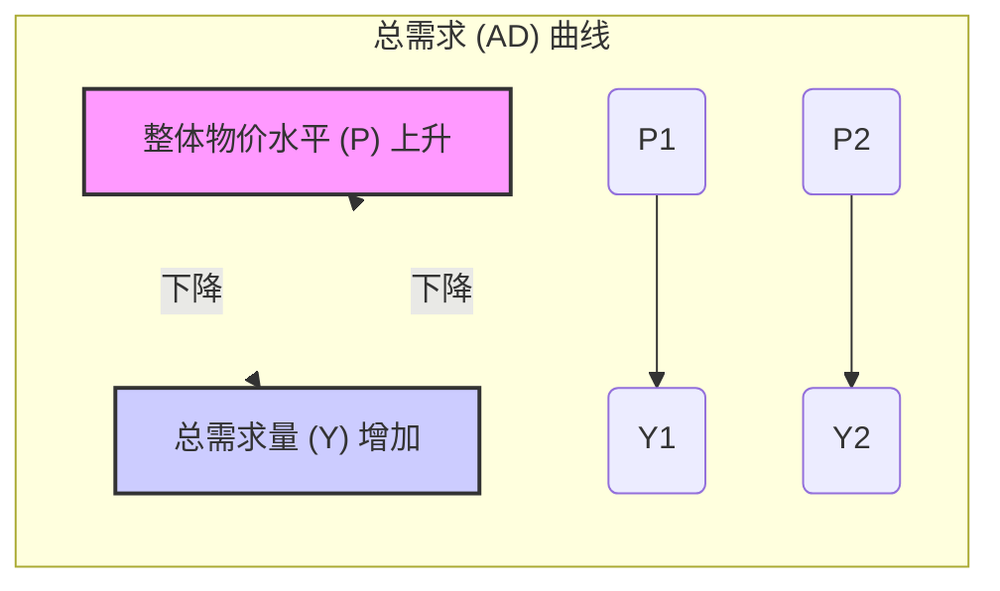

# 第八章：总需求-总供给模型：宏观经济分析的核心引擎 (The AD-AS Model: Core Engine of Macroeconomic Analysis)

> "经济学不会告诉你如何发财，但它至少会告诉你可能会如何变穷。" —— 约翰·梅纳德·凯恩斯 (John Maynard Keynes) (转述)

上一章我们熟悉了衡量宏观经济表现的关键指标：GDP、物价水平和失业率。这些指标为我们描绘了经济的"快照"。但经济是动态变化的，会经历繁荣与衰退的交替，即**经济周期 (Business Cycle)**。为了理解这些短期经济波动的原因，解释产出、通胀和失业为何会偏离其长期趋势，并分析宏观经济政策如何影响经济运行，我们需要一个核心的分析框架——**总需求-总供给 (Aggregate Demand-Aggregate Supply, AD-AS) 模型**。

AD-AS 模型是现代宏观经济学的基石。它将我们在微观经济学中学到的供求分析扩展到整个经济层面，考察**整体物价水平**和**总产出（实际 GDP）** 之间的关系。总需求 (AD) 曲线展示了在不同物价水平下，经济中所有部门（居民、企业、政府、国外）愿意购买的产品和服务总量。总供给 (AS) 曲线则展示了在不同物价水平下，经济中所有企业愿意生产和销售的产品和服务总量。

通过分析 AD 和 AS 曲线的相互作用及其移动，我们可以：

*   解释经济衰退和复苏的原因。
*   理解通货膨胀和通货紧缩的驱动因素。
*   分析不同类型的经济冲击（如石油价格冲击、技术进步、消费者信心变化）如何影响宏观经济。
*   评估财政政策和货币政策对产出、物价和就业的短期与长期影响。

本章将详细构建 AD-AS 模型，深入探讨 AD 曲线和 AS 曲线（包括短期和长期）的形状、决定因素及其移动，并运用该模型分析宏观经济均衡的动态调整过程。

## 8.1 总需求 (AD) 曲线：为何向右下方倾斜？

**总需求 (Aggregate Demand, AD)** 指的是在给定的整体物价水平下，经济中所有主体（居民、企业、政府和国外部门）计划购买的最终产品和服务的总量，即计划的总支出。AD 曲线描述了**整体物价水平 (P)** 与**总需求量（实际 GDP, Y）** 之间的**负相关**关系，即曲线向右下方倾斜。



**关键问题：** 为何当整体物价水平 (P) 下降时，总需求量 (Y) 会增加？（反之，为何 P 上升时，Y 会减少？）

这与我们在微观经济学中分析单个商品需求曲线的原因不同。对于单个商品，价格下降时需求量增加，主要是因为替代效应（相对于其他商品变得更便宜）和收入效应（购买力提高）。但在宏观层面，我们考察的是**所有**商品和服务的整体价格水平，替代效应不再适用（除非是替代未来的消费）。总需求曲线向下倾斜主要是通过以下三个渠道（效应）来解释的，这些渠道都与支出法 GDP 的构成部分 ($Y = C + I + G + NX$) 相关，特别是影响消费 (C)、投资 (I) 和净出口 (NX)：

### 8.1.1 财富效应、利率效应、实际余额效应、汇率效应

1.  **财富效应 (Wealth Effect) / 实际余额效应 (Real Balance Effect, 由庇古提出，也称庇古效应 Pigou Effect) - 主要影响消费 (C):**
    *   **机制：** 当整体物价水平 (P) **下降**时，居民持有的**名义货币财富**（如现金、银行存款）的**实际购买力**会**上升**。人们感觉自己变得更富有了，因此倾向于**增加消费支出 (C)**。
    *   反之，当物价水平 (P) **上升**时，货币的实际购买力下降，人们感觉变穷了，会**减少消费支出 (C)**。
    *   **结论：** P 下降 -> 实际财富增加 -> C 增加 -> Y 增加。

2.  **利率效应 (Interest Rate Effect, 由凯恩斯提出，也称凯恩斯效应 Keynes Effect) - 主要影响投资 (I)，也可能影响消费 (C):**
    *   **机制：** 当整体物价水平 (P) **下降**时，居民和企业进行日常交易所需的**名义货币量**会**减少**。人们会将一部分多余的货币储蓄起来，例如存入银行或购买债券，这增加了**可贷资金 (Loanable Funds)** 的**供给**。
    *   在货币供给量不变的情况下，可贷资金供给增加会导致**名义利率 (i) 下降**（或者，人们购买债券导致债券价格上升，收益率下降）。
    *   利率下降会**降低**企业的**借贷成本**，从而**刺激投资支出 (I)**（购买新设备、厂房等）。同时，较低的利率也可能**鼓励**居民进行**耐用品消费**（如汽车、住房 - 住房计入投资）。
    *   反之，当物价水平 (P) **上升**时，交易所需的货币量增加，可贷资金供给减少（或货币需求增加），导致利率上升，抑制投资 (I) 和部分消费 (C)。
    *   **结论：** P 下降 -> 交易货币需求减少 -> 储蓄/可贷资金供给增加 -> 利率 (i) 下降 -> I 增加 (C 也可能增加) -> Y 增加。

3.  **汇率效应 (Exchange Rate Effect, 也称蒙代尔-弗莱明效应 Mundell-Fleming Effect 或国际替代效应) - 主要影响净出口 (NX):**
    *   **机制：** 当国内整体物价水平 (P) **下降**时，根据利率效应，国内**利率 (i) **也倾向于**下降**。
    *   较低的国内利率使得本国金融资产（如债券）对**外国投资者**的吸引力**下降**。外国投资者需要购买本币来投资本国资产，吸引力下降导致对本币的**需求减少**。
    *   同时，较低的国内利率也**鼓励**本国投资者将资金投向**国外**收益率更高的资产，他们需要**卖出本币**换取外币，增加了本币的**供给**。
    *   本币需求减少和供给增加共同导致**本币**在**外汇市场**上**贬值 (Depreciate)**，即**实际汇率 (Real Exchange Rate)** 下降。（实际汇率 = 名义汇率 * 国内物价/国外物价。在国外物价和名义汇率短期影响较小的情况下，国内 P 下降会带动实际汇率下降）。
    *   本币贬值使得**本国产品**相对于外国产品**更便宜**，从而**刺激出口 (X)**；同时使得**外国产品**相对于本国产品**更昂贵**，从而**抑制进口 (M)**。
    *   **净出口 (NX = X - M)** 因此**增加**。
    *   反之，当国内物价水平 (P) **上升**时，利率上升，吸引外国投资，本币升值，导致净出口 (NX) 减少。
    *   **结论：** P 下降 -> 利率 (i) 下降 -> 资本流出/流入减少 -> 本币贬值 (实际汇率下降) -> 出口 (X) 增加，进口 (M) 减少 -> 净出口 (NX) 增加 -> Y 增加。

**总结：** 正是由于财富效应、利率效应和汇率效应的存在，整体物价水平 (P) 与总需求量 (Y) 之间呈现反向关系，使得 AD 曲线向右下方倾斜。

### 8.1.2 AD 曲线的移动：消费、投资、政府购买、净出口的变化

AD 曲线向下倾斜描述的是在**给定其他条件不变**的情况下，物价水平变化对总需求量的影响（沿着曲线的移动）。然而，当**除了物价水平之外**的其他因素发生变化，导致在**任何给定的物价水平 (P)** 下，总需求量 (Y) 都发生改变时，AD 曲线就会发生**平行移动 (Shift)**。

能够引起 AD 曲线移动的因素，最终都归结为影响 $Y = C + I + G + NX$ 中任何一个组成部分的**外生**变化（即非 P 变化引起的内生变化）。

1.  **引起消费 (C) 变化的因素（导致 AD 移动）：**
    *   **消费者预期 (Expectations)：** 对未来收入或经济前景的乐观预期会增加当前消费，AD 右移；悲观预期则减少消费，AD 左移。
    *   **财富 (Wealth)：** 资产价格（如股市、房市）上涨增加了居民财富（独立于物价水平变化引起的实际余额效应），刺激消费，AD 右移；反之则 AD 左移。
    *   **税收 (Taxes)：** 政府减税（特别是所得税）增加了居民可支配收入，刺激消费，AD 右移；增税则 AD 左移。
    *   **人口结构、消费习惯等长期因素变化。**

2.  **引起投资 (I) 变化的因素（导致 AD 移动）：**
    *   **企业预期/信心 (Expectations/Confidence，即凯恩斯的"动物精神" Animal Spirits)：** 对未来盈利前景、经济增长的乐观预期会刺激企业增加投资，AD 右移；悲观预期则抑制投资，AD 左移。
    *   **利率 (Interest Rates，非 P 变化引起的)：** 如果**货币政策**（如央行降息）导致利率下降（而非物价下降通过利率效应引起），会刺激投资，AD 右移；央行加息则 AD 左移。
    *   **技术进步 (Technological Progress)：** 新技术的出现可能带来新的投资机会，刺激投资，AD 右移。
    *   **税收政策 (Tax Policy)：** 投资税收抵免 (Investment Tax Credits) 或加速折旧等优惠政策会鼓励投资，AD 右移；反之则 AD 左移。
    *   **资本存量状况：** 现有资本存量过剩会抑制新投资，反之则可能刺激投资。

3.  **引起政府购买 (G) 变化的因素（导致 AD 移动）：**
    *   **财政政策 (Fiscal Policy)：** 政府决定增加公共工程支出、国防开支等政府购买，会直接增加总需求，AD 右移；削减政府购买则 AD 左移。
    *   **注意：** 政府购买是直接影响 AD 的外生政策变量。

4.  **引起净出口 (NX) 变化的因素（导致 AD 移动）：**
    *   **国外经济状况 (Foreign Income)：** 主要贸易伙伴国经济繁荣，会增加对本国产品的需求（出口增加），NX 增加，AD 右移；国外经济衰退则 AD 左移。
    *   **汇率 (Exchange Rates，非 P 变化引起的)：** 如果由于资本流动、投机、贸易政策等因素导致本币**外生贬值**（而非物价下降通过汇率效应引起），会刺激净出口，AD 右移；本币外生升值则 AD 左移。
    *   **贸易政策 (Trade Policy)：** 其他国家降低对本国产品的关税或贸易壁垒，会增加出口，AD 右移；反之则 AD 左移。本国设置贸易壁垒可能短期减少进口，但也可能引发报复导致出口减少，最终效果不确定。
    *   **消费者偏好变化：** 国内外消费者对本国或外国产品的偏好发生改变。

**总结 AD 曲线移动：** 任何使得 C、I、G 或 NX 在给定 P 水平下增加的因素，都会使 AD 曲线向右移动；反之，则向左移动。

```mermaid
graph TD
    subgraph "AD 曲线移动"
        direction LR
        X[AD 右移 (需求增加)] --由以下因素引起--> Y{C↑, I↑, G↑, NX↑}
        Z[AD 左移 (需求减少)] --由以下因素引起--> W{C↓, I↓, G↓, NX↓}
        Y -- 影响因素示例 --> C1("预期乐观/财富增加/减税")
        Y -- 影响因素示例 --> I1("预期乐观/利率(政策)下降/技术进步/投资减税")
        Y -- 影响因素示例 --> G1("政府增加购买")
        Y -- 影响因素示例 --> NX1("国外收入增加/本币(外生)贬值")
        W -- 影响因素示例 --> C2("预期悲观/财富减少/增税")
        W -- 影响因素示例 --> I2("预期悲观/利率(政策)上升/投资增税")
        W -- 影响因素示例 --> G2("政府削减购买")
        W -- 影响因素示例 --> NX2("国外收入减少/本币(外生)升值")
    end
```

## 8.2 总供给 (AS) 曲线：短期弹性与长期垂直

**总供给 (Aggregate Supply, AS)** 指的是在给定的整体物价水平下，经济中所有企业计划生产和销售的最终产品和服务的总量。AS 曲线描述了**整体物价水平 (P)** 与**总供给量（实际 GDP, Y）** 之间的关系。

与需求曲线不同，总供给曲线的形状在**短期 (Short Run)** 和**长期 (Long Run)** 是不同的。

### 8.2.1 短期 AS (SRAS) 向上倾斜的微观基础：粘性工资、粘性价格、工人错觉理论

在**短期**内，通常认为总供给曲线 (Short-Run Aggregate Supply, SRAS) 是**向右上方倾斜**的。这意味着，当整体物价水平 (P) **上升**时，企业倾向于**增加**产品和服务的供给量 (Y)；反之，当 P 下降时，企业倾向于减少供给量。

```mermaid
graph TD
    subgraph "短期总供给 (SRAS) 曲线"
        direction TB
        P[整体物价水平 (P)] --上升--> Y[总供给量 (Y) 增加]
        Y --下降--> P[整体物价水平 (P) 下降]
        A(P1) --> B(Y1);
        C(P2) --> D(Y2);
        linkStyle 0 stroke-width:0px;
        linkStyle 1 stroke-width:0px;
    end
    style P fill:#f9f,stroke:#333,stroke-width:2px
    style Y fill:#ccf,stroke:#333,stroke-width:2px
```

为何 SRAS 曲线向上倾斜？宏观经济学提出了几种主要的微观基础理论来解释这种短期内的正相关关系。这些理论的核心在于短期内**名义变量（如工资、价格）** 的调整**滞后**于整体物价水平的变化，或者存在**信息不完全**。

1.  **粘性工资理论 (Sticky-Wage Theory)：**
    *   **核心假设：** **名义工资 (Nominal Wages)** 在短期内是**粘性 (Sticky)** 的，调整缓慢。这通常是因为劳动合同是长期签订的，或者存在社会规范、最低工资法等因素。
    *   **机制：** 当整体物价水平 (P) **意外上升**时（即实际 P 高于预期 $P^e$），企业的**产品售价**提高了，但支付给工人的**名义工资 (W)** 短期内保持不变。这意味着企业的**实际工资成本 (W/P)** 下降了。
    *   实际工资下降使得雇佣工人变得更有利可图，企业会**增加雇佣**，从而**增加产出 (Y)**。
    *   反之，当物价水平 (P) 意外下降时，实际工资 (W/P) 上升，企业减少雇佣，减少产出。
    *   **结论：** P 上升 (高于预期) -> 实际工资 (W/P) 下降 -> 雇佣增加 -> Y 增加。

2.  **粘性价格理论 (Sticky-Price Theory)：**
    *   **核心假设：** 并非所有企业的**产品价格 (Prices)** 都能对宏观经济变化做出**即时调整**。调整价格本身存在成本，即**菜单成本 (Menu Costs)**（如重新印刷价目表、目录、广告等）。
    *   **机制：** 当整体物价水平 (P) **意外上升**时，那些**价格具有粘性**的企业会发现其产品的**相对价格**（相对于其他已调价的企业）下降了，这会**刺激**对其产品的**需求**。
    *   为了满足增加的需求，这些价格粘性企业会**增加生产 (Y)**。
    *   反之，当整体物价水平 (P) 意外下降时，价格粘性企业的相对价格上升，需求减少，它们会削减生产。
    *   **结论：** P 上升 (高于预期) -> 部分企业价格粘性 -> 其相对价格下降 -> 需求增加 -> Y 增加。

3.  **工人错觉理论 (Misperceptions Theory) / 卢卡斯供给曲线：**
    *   **核心假设：** 企业通常比工人能更及时、准确地了解**整体物价水平 (P)** 的变化。工人可能**混淆**名义工资变化和实际工资变化，或者混淆相对价格变化和整体物价变化。
    *   **机制：** 当整体物价水平 (P) **意外上升**时，企业提高了产品的售价，也可能相应提高支付给工人的**名义工资 (W)**。企业知道整体 P 上升了，所以它们明白工人的**实际工资 (W/P)** 可能并没有上升甚至下降了。但工人可能**错误地**认为只是自己的名义工资上升了（或者他们只观察到自己产品的价格上升，误以为是相对价格上升），感觉自己的劳动回报提高了，因而愿意**增加劳动供给**。
    *   劳动供给增加使得企业可以**增加产出 (Y)**。
    *   反之，当物价水平 (P) 意外下降时，工人可能误认为自己的实际工资下降（即使名义工资不变），减少劳动供给，导致产出减少。
    *   **结论：** P 上升 (高于预期) -> 工人可能误判实际工资/相对价格变化 -> 增加劳动供给 -> Y 增加。

**总结 SRAS 向上倾斜：** 这些理论都指向同一个结论：在短期内，当实际物价水平 (P) **高于**人们预期的物价水平 ($P^e$) 时，产出 (Y) 会**高于**其自然水平 ($Y^*$)；当实际物价水平 (P) **低于**预期物价水平 ($P^e$) 时，产出 (Y) 会**低于**其自然水平 ($Y^*$）。可以用一个简化的**卢卡斯供给函数**来表示：
\[ Y = Y^* + \alpha (P - P^e) \]
其中，$Y^*$ 是自然产出水平（长期潜在产出），$lpha$ 是一个大于零的系数，表示产出对未预期到的物价变动的反应程度。这个公式明确显示了 Y 与 P 在短期内的正相关关系（给定 $Y^*$ 和 $P^e$）。

### 8.2.2 SRAS 曲线的移动：预期物价水平、要素成本、技术等

SRAS 曲线向上倾斜描述的是在**给定预期物价水平和其他条件不变**的情况下，实际物价水平变化对总供给量的影响（沿着曲线的移动）。当**除了实际物价水平之外**的其他因素发生变化，导致在**任何给定的实际物价水平 (P)** 下，企业愿意供给的总量 (Y) 都发生改变时，SRAS 曲线就会发生**平行移动 (Shift)**。

影响 SRAS 曲线移动的关键因素包括：

1.  **预期物价水平 ($P^e$) 的变化：** 这是影响 SRAS 位置的**最重要**因素。
    *   **机制：** 如果人们预期未来的物价水平 ($P^e$) 会**上升**，工会和工人会要求更高的**名义工资**，企业也会预期更高的**投入成本**。这会提高企业的生产成本。
    *   在任何给定的实际物价水平 (P) 下，更高的生产成本意味着企业愿意供给的量会**减少**。
    *   **结论：** $P^e$ 上升 -> 名义工资/成本上升 -> SRAS **向左上方移动**。
    *   反之，$P^e$ 下降 -> 名义工资/成本下降 -> SRAS **向右下方移动**。
    *   **注意：** 预期物价水平的变化是 SRAS 曲线移动的核心驱动力，也是连接短期和长期分析的关键。

2.  **投入要素（成本）价格的变化 (Input Prices / Costs of Production)：** （独立于 $P^e$ 变化引起的）
    *   **劳动成本：** 名义工资的突然上涨（如强力工会谈判成功、最低工资大幅提高，且未被预期到）。
    *   **原材料/能源价格：** 如国际石油价格飙升（供给冲击 Supply Shock），会大幅提高许多行业的生产成本。
    *   **进口投入品价格：** 本币贬值导致进口原材料价格上涨。
    *   **结论：** 生产成本（非预期性）上升 -> SRAS **向左上方移动**；成本下降 -> SRAS **向右下方移动**。

3.  **劳动 (Labor)、资本 (Capital)、自然资源 (Natural Resources) 存量的变化：** 这些是决定经济**生产能力**的长期因素，它们的变化会同时影响 SRAS 和 LRAS。
    *   **劳动：** 移民增加、劳动力参与率提高会增加劳动供给，SRAS（和 LRAS）右移。
    *   **资本：** 物质资本（机器设备、厂房）或人力资本（教育、技能）的积累会提高生产率，SRAS（和 LRAS）右移。
    *   **自然资源：** 新发现矿产资源、气候变化影响农业收成等。
    *   **结论：** 生产要素存量增加 -> 生产能力提高 -> SRAS **向右下方移动**；存量减少 -> SRAS **向左上方移动**。

4.  **技术进步 (Technological Progress)：** 技术进步能让企业用同样的投入生产更多的产出，或者用更少的投入生产同样的产出，即提高**生产率 (Productivity)**。
    *   **结论：** 技术进步 -> 生产率提高 -> SRAS **向右下方移动**。

5.  **制度与政策因素 (Institutional and Policy Factors)：**
    *   **政府管制：** 更严格的环境管制、安全标准等可能增加企业生产成本，SRAS 左移；放松管制则可能 SRAS 右移。
    *   **税收与补贴：** 对企业的税收增加相当于成本上升，SRAS 左移；提供生产补贴则 SRAS 右移。

**总结 SRAS 曲线移动：** 任何使得在给定 P 水平下生产成本上升或生产能力下降的因素，都会使 SRAS 曲线向左上方移动；反之，则向右下方移动。其中，预期物价水平 ($P^e$) 的变化是核心驱动因素。

### 8.2.3 长期 AS (LRAS) 垂直于潜在产出 (Y*)：古典二分法与货币中性

在**长期**内，经济的总产出水平最终取决于其拥有的**生产要素**（劳动、资本、自然资源）的数量和将这些要素转化为产出的**技术水平**，而**与整体物价水平无关**。因此，**长期总供给曲线 (Long-Run Aggregate Supply, LRAS)** 是一条**垂直**的线，位于**潜在产出 (Potential Output)** 或**自然产出率 (Natural Rate of Output)** $Y^*$ 的水平上。

$Y^*$ 是指当经济中所有资源（特别是劳动力）得到充分利用（即失业率处于自然失业率水平）时，所能生产的实际 GDP 水平。

```mermaid
graph TD
    subgraph "长期总供给 (LRAS) 曲线"
        direction TB
        P[整体物价水平 (P)] --变化--> Y[总供给量 (Y) 不变]
        Y --固定于--> Y_star[潜在产出 (Y*)]
        LRAS[LRAS] --- Y_star
        linkStyle 0 stroke-width:0px;
        linkStyle 2 stroke-width:2px,stroke:#f00,stroke-dasharray: 5 5
    end
    style P fill:#f9f,stroke:#333,stroke-width:2px
    style Y fill:#ccf,stroke:#333,stroke-width:2px
    style Y_star fill:#cfc,stroke:#333,stroke-width:2px
```

**为何 LRAS 垂直？**

这基于**古典二分法 (Classical Dichotomy)** 和**货币中性 (Monetary Neutrality)** 的思想：

*   **古典二分法：** 将经济变量分为**实际变量 (Real Variables)**（用实物单位衡量，如实际 GDP、实际工资 W/P、实际利率、就业量）和**名义变量 (Nominal Variables)**（用货币单位衡量，如名义 GDP、名义工资 W、名义利率、物价水平 P）。古典理论认为，长期内，实际变量是由实际因素（如要素供给、技术、偏好）决定的，而名义变量是由货币因素（如货币供给量）决定的，两者可以分开分析。
*   **货币中性：** 指货币供给量的变动**只影响**名义变量，而**不影响**实际变量。例如，如果央行将货币供给量增加一倍，长期内只会导致所有名义价格（包括物价水平 P 和名义工资 W）也同比例上涨一倍，而实际 GDP (Y)、实际工资 (W/P)、实际利率、就业量等实际变量保持不变。

**长期调整机制：** 短期内，由于工资粘性、价格粘性或错觉，物价水平 (P) 的变化可以暂时影响产出 (Y)。但长期来看：
*   **预期会调整：** 人们最终会认识到物价水平的变化，预期物价水平 ($P^e$) 会追赶上实际物价水平 (P)。
*   **名义工资和价格会充分调整：** 劳动合同会重新谈判，名义工资会根据新的物价水平进行调整，以恢复到原来的实际工资水平。企业也会调整产品价格。
*   当 $P = P^e$ 时，根据卢卡斯供给函数 $Y = Y^* + lpha (P - P^e)$，产出 $Y$ 将回到其自然水平 $Y^*$。

因此，无论整体物价水平 P 如何变化，长期内经济的产出 Y 都会回到由要素供给和技术决定的潜在产出 $Y^*$ 水平。这就是 LRAS 垂直的原因。

### 8.2.4 LRAS 曲线的移动：决定经济长期增长的因素

既然 LRAS 垂直于 $Y^*$，那么能够引起 LRAS 曲线移动的因素，就是那些能够**改变经济潜在产出 $Y^*$** 的因素。这些因素与我们在上一节讨论的影响 SRAS 曲线移动的第 3、4、5 点是相同的，它们决定了经济的**长期增长**潜力。

1.  **劳动 (L) 存量的变化：**
    *   人口增长、移民增加、劳动力参与率提高（如更多女性进入劳动力市场）会增加劳动供给，提高 $Y^*$，LRAS 右移。
2.  **资本 (K) 存量的变化：**
    *   **物质资本：** 投资增加使得机器、设备、厂房等物质资本积累加快，提高 $Y^*$，LRAS 右移。
    *   **人力资本：** 教育水平提高、职业技能培训加强，使得劳动者更具生产力，提高 $Y^*$，LRAS 右移。
3.  **自然资源 (N) 的变化：**
    *   新发现或更好地利用自然资源（土地、矿产、能源）可以提高 $Y^*$，LRAS 右移。
    *   自然资源的枯竭或环境恶化可能降低 $Y^*$，LRAS 左移。
4.  **技术知识 (A) 的进步：** 这是经济长期增长的**最重要**驱动力。
    *   发明新技术、改进生产方法、提高管理效率等都可以让同样的要素投入生产更多产出，提高 $Y^*$，LRAS 右移。
5.  **制度与政策因素：**
    *   产权保护、法治完善、政治稳定、鼓励竞争、开放贸易、促进教育和研发的政策等，都有助于提高要素积累速度和生产率，从而提高 $Y^*$，LRAS 右移。

**总结 LRAS 曲线移动：** 任何能够提高经济长期生产能力的因素，都会使 LRAS 曲线向右移动，代表经济的潜在产出增加和长期增长。这些因素正是第九章将要深入探讨的经济增长的源泉。

## 8.3 宏观均衡的动态调整：冲击、波动与政策应对

将 AD 曲线、SRAS 曲线和 LRAS 曲线放在同一个图中，我们就可以分析宏观经济的短期和长期均衡，以及经济如何应对各种冲击。

*   **长期均衡 (Long-Run Equilibrium)：** 发生在 AD 曲线、SRAS 曲线和 LRAS 曲线**三者相交**于一点。此时：
    *   实际产出 (Y) 等于潜在产出 ($Y^*$): $Y = Y^*$
    *   实际物价水平 (P) 等于预期物价水平 ($P^e$): $P = P^e$
    *   失业率等于自然失业率。
    *   经济处于稳定状态。

*   **短期均衡 (Short-Run Equilibrium)：** 发生在 AD 曲线和 SRAS 曲线相交之处。此时的产出水平 (Y) 可能高于、低于或等于潜在产出 ($Y^*$）。
    *   如果交点在 LRAS 右侧 ($Y > Y^*$)，经济处于**通胀缺口 (Inflationary Gap)** 或**过热 (Overheating)** 状态，失业率低于自然失业率。物价水平 P 高于之前的预期 $P^e$。
    *   如果交点在 LRAS 左侧 ($Y < Y^*$)，经济处于**衰退缺口 (Recessionary Gap)** 或**萧条 (Slump)** 状态，失业率高于自然失业率。物价水平 P 低于之前的预期 $P^e$。
    *   如果交点正好在 LRAS 上，则短期均衡也是长期均衡。

**经济波动的来源：AD 或 AS 冲击**

经济之所以会发生短期波动，是因为 AD 曲线或 SRAS 曲线受到各种**冲击 (Shocks)** 而发生移动，导致经济偏离长期均衡。

### 8.3.1 用 AS-AD 分析经济衰退、通货膨胀、滞胀

1.  **需求不足型衰退 (Recession Caused by AD Shift Left)：**
    *   **冲击：** 可能是由于消费者信心下降 (C↓)、企业悲观预期 (I↓)、政府削减开支 (G↓)、国外经济衰退 (NX↓) 或货币政策紧缩等因素，导致 AD 曲线向**左**移动。
    *   **短期后果：** AD 左移，与 SRAS 相交于新的短期均衡点。结果是**产出 (Y) 下降**（低于 $Y^*$），**物价水平 (P) 下降**（或通胀率下降）。经济陷入衰退，失业率上升。

```mermaid
xychart-beta
    title "需求冲击导致的衰退 (AD 左移)"
    x-axis "产出 (Y)"
    y-axis "物价水平 (P)"
    line "LRAS" data { x: [8, 8], y: [2, 12] } stroke "red" linestyle "dashed"
    line "SRAS_0" data { x: [4, 12], y: [4, 12] } stroke "green"
    line "AD_0" data { x: [4, 12], y: [12, 4] } stroke "blue"
    line "AD_1" data { x: [2, 10], y: [10, 2] } stroke "blue" linestyle "dashed"
    
    annotation "长期均衡点 A" { x: 8, y: 8, text: "A (Y*, P0)" dx:10 }
    annotation "新短期均衡点 B" { x: 6.67, y: 6.67, text: "B (Y1 < Y*, P1 < P0)" dx:-10, dy:10 }
    annotation "Y*" { x: 8, y: 1.5, text: "Y*" }

    path "Arrow" data [{x:7, y:10}, {x:5, y:8}] marker-end "arrow"
    path "Y1" data [{x:6.67, y:0}, {x:6.67, y:6.67}] linestyle "dotted"
    path "P1" data [{x:0, y:6.67}, {x:6.67, y:6.67}] linestyle "dotted"
```

2.  **需求拉动型通胀 (Inflation Caused by AD Shift Right)：**
    *   **冲击：** 可能是由于消费者乐观 (C↑)、投资增加 (I↑)、政府增加开支 (G↑)、出口增加 (NX↑) 或货币政策宽松等因素，导致 AD 曲线向**右**移动。
    *   **短期后果：** AD 右移，与 SRAS 相交于新的短期均衡点。结果是**产出 (Y) 上升**（高于 $Y^*$），**物价水平 (P) 上升**。经济处于过热状态，失业率低于自然失业率，出现通货膨胀。

```mermaid
xychart-beta
    title "需求冲击导致的通胀 (AD 右移)"
    x-axis "产出 (Y)"
    y-axis "物价水平 (P)"
    line "LRAS" data { x: [8, 8], y: [2, 12] } stroke "red" linestyle "dashed"
    line "SRAS_0" data { x: [4, 12], y: [4, 12] } stroke "green"
    line "AD_0" data { x: [4, 12], y: [12, 4] } stroke "blue"
    line "AD_1" data { x: [6, 14], y: [14, 6] } stroke "blue" linestyle "dashed"
    
    annotation "长期均衡点 A" { x: 8, y: 8, text: "A (Y*, P0)" dx:-10, dy:10 }
    annotation "新短期均衡点 B" { x: 9.33, y: 9.33, text: "B (Y1 > Y*, P1 > P0)" dx:10 }
    annotation "Y*" { x: 8, y: 1.5, text: "Y*" }

    path "Arrow" data [{x:9, y:6}, {x:11, y:8}] marker-end "arrow"
    path "Y1" data [{x:9.33, y:0}, {x:9.33, y:9.33}] linestyle "dotted"
    path "P1" data [{x:0, y:9.33}, {x:9.33, y:9.33}] linestyle "dotted"
```

3.  **成本推动型衰退 / 滞胀 (Stagflation Caused by SRAS Shift Left)：**
    *   **冲击：** 通常是由**不利的供给冲击 (Adverse Supply Shock)** 引起的，如石油价格飙升、原材料成本大幅上涨、自然灾害导致生产中断，或者预期通胀 ($P^e$) 大幅上升，导致 SRAS 曲线向**左上方**移动。
    *   **短期后果：** SRAS 左移，与 AD 相交于新的短期均衡点。结果是**产出 (Y) 下降**（低于 $Y^*$），同时**物价水平 (P) 上升**。经济陷入**滞胀 (Stagflation)** 状态，即经济停滞 (Stagnation) 与通货膨胀 (Inflation) 并存，失业率上升。
    *   **政策困境：** 滞胀是最令政策制定者头疼的局面。如果用刺激总需求的政策来应对产出下降，会进一步加剧通胀；如果用紧缩总需求的政策来抑制通胀，会进一步加剧衰退和失业。

```mermaid
xychart-beta
    title "供给冲击导致的滞胀 (SRAS 左移)"
    x-axis "产出 (Y)"
    y-axis "物价水平 (P)"
    line "LRAS" data { x: [8, 8], y: [2, 12] } stroke "red" linestyle "dashed"
    line "SRAS_0" data { x: [4, 12], y: [4, 12] } stroke "green"
    line "SRAS_1" data { x: [2, 10], y: [6, 14] } stroke "green" linestyle "dashed"
    line "AD_0" data { x: [4, 12], y: [12, 4] } stroke "blue"
    
    annotation "长期均衡点 A" { x: 8, y: 8, text: "A (Y*, P0)" dx:10, dy:10 }
    annotation "新短期均衡点 B" { x: 6, y: 10, text: "B (Y1 < Y*, P1 > P0)" dx:-10 }
    annotation "Y*" { x: 8, y: 1.5, text: "Y*" }

    path "Arrow" data [{x:6, y:6}, {x:4, y:8}] marker-end "arrow"
    path "Y1" data [{x:6, y:0}, {x:6, y:10}] linestyle "dotted"
    path "P1" data [{x:0, y:10}, {x:6, y:10}] linestyle "dotted"
```

### 8.3.2 自我修正机制 vs. 政策干预的必要性

当经济受到冲击偏离长期均衡后，是否存在使其自动回归的机制？理论上存在，但这需要时间，并且过程可能很痛苦。

**自我修正机制 (Self-Correcting Mechanism)：** 主要通过**预期物价水平 ($P^e$) 的调整**和**名义工资/价格的灵活性**来实现，进而**移动 SRAS 曲线**。

*   **情况一：经济处于衰退缺口 ($Y < Y^*$)** (如 AD 左移后)
    *   高失业率意味着劳动力市场供过于求，工人议价能力下降。
    *   随着时间推移，工人会降低对未来物价的预期 ($P^e$ 下降)，并接受较低的名义工资。
    *   生产成本下降导致 SRAS 曲线**向右下方移动**。
    *   最终，SRAS 曲线会移动到与新的 AD 曲线相交于 LRAS 上的位置，产出 Y 回到 $Y^*$，物价水平 P 进一步下降。
*   **情况二：经济处于通胀缺口 ($Y > Y^*$)** (如 AD 右移后)
    *   低失业率意味着劳动力市场供不应求，工人议价能力增强。
    *   工人会提高对未来物价的预期 ($P^e$ 上升)，并要求更高的名义工资。
    *   生产成本上升导致 SRAS 曲线**向左上方移动**。
    *   最终，SRAS 曲线会移动到与新的 AD 曲线相交于 LRAS 上的位置，产出 Y 回到 $Y^*$，物价水平 P 进一步上升。
*   **情况三：经济处于滞胀 ($Y < Y^*$, $P > P_0$)** (如 SRAS 左移后)
    *   一方面，高物价可能维持较高的通胀预期 $P^e$；另一方面，高失业率又会给工资带来下行压力。
    *   最终调整路径取决于工资、价格和预期的相对调整速度。如果高失业率最终迫使名义工资下降（或涨幅低于通胀），$P^e$ 下降，SRAS 曲线会**向右下方移动**，使经济逐渐回到 $Y^*$，物价 P 可能回落（但不一定回到最初水平）。

**政策干预的理由：**

虽然理论上存在自我修正机制，但：

1.  **调整过程可能非常缓慢且痛苦：** 工资和价格在现实中往往具有显著的粘性（尤其是向下粘性），失业和产出损失可能持续很长时间（凯恩斯名言："长期来看，我们都死了"）。
2.  **预期可能难以协调：** 如果预期持续悲观或不稳定，可能阻碍自我修正过程。

因此，许多经济学家（特别是凯恩斯主义者）认为，当经济遭受严重冲击（尤其是需求冲击导致的衰退）时，政府应积极运用**财政政策 (Fiscal Policy)**（调整 G 或 T）和**货币政策 (Monetary Policy)**（调整货币供给或利率）来**主动移动 AD 曲线**，以更快地将经济拉回潜在产出水平，缩短衰退期，减轻失业痛苦。

*   **应对衰退 (AD 左移)：** 采取扩张性财政政策（增 G / 减 T）或扩张性货币政策（降息/增 M），使 AD 曲线右移，尽快回到 $Y^*$。
*   **应对过热 (AD 右移)：** 采取紧缩性财政政策（减 G / 增 T）或紧缩性货币政策（加息/减 M），使 AD 曲线左移，抑制通胀，防止经济硬着陆。
*   **应对滞胀 (SRAS 左移)：** 政策选择更为棘手。主要依赖于改善供给端的政策（如促进技术进步、降低生产成本的结构性改革），或者在抑制通胀和稳定产出之间进行权衡。

后续章节将更详细地探讨货币政策和财政政策的具体工具、传导机制及其效果与挑战。

---

***投资启示：判断宏观经济所处象限 (复苏/过热/滞胀/衰退)，预测主要矛盾 (增长 vs. 通胀)，推演政策可能的方向。***

AD-AS 模型为投资者提供了一个理解宏观经济格局、判断市场走向和预测政策应对的强大框架：

1.  **判断宏观经济所处象限：** 通过分析 GDP 增长 (Y 相对于 $Y^*$) 和通货膨胀 (P 的变化) 数据，结合 AD-AS 模型，可以判断经济当前最可能处于哪个阶段：
    *   **复苏期 (Recovery)：** Y < $Y^*$ 但正在增长，P 稳定或温和上升（通常由 AD 右移或 SRAS 右移驱动）。-> 利好风险资产，尤其是早期周期性股票。
    *   **过热期/扩张后期 (Overheating/Late Expansion)：** Y > $Y^*$，P 加速上升（通常由 AD 持续右移驱动，SRAS 开始左移）。-> 增长见顶风险增加，通胀成为主要矛盾，可能利好大宗商品，股市波动加大，价值股可能优于成长股。
    *   **滞胀期 (Stagflation)：** Y < $Y^*$，P 持续上升（通常由 SRAS 左移驱动）。-> 对大部分资产类别都不利，现金或黄金等避险资产可能受青睐。
    *   **衰退期 (Recession)：** Y < $Y^*$ 且正在下降，P 下降或稳定在低位（通常由 AD 左移驱动）。-> 避险情绪升温，利好高信用等级债券、防御性股票，风险资产承压。
2.  **预测主要矛盾 (增长 vs. 通胀)：** AD-AS 模型清晰地展示了增长和通胀之间的短期权衡关系（尤其是在需求冲击下）。投资者需要判断当前及未来一段时间，宏观经济的主要矛盾是**增长动能不足**还是**通胀压力过大**。
    *   增长是主要矛盾时，政策重心可能偏向刺激，市场预期更宽松的流动性。
    *   通胀是主要矛盾时，政策重心可能偏向紧缩，市场预期流动性收紧。
3.  **推演政策可能的方向：** 根据对经济象限和主要矛盾的判断，可以推测宏观政策（货币政策和财政政策）可能的调整方向。
    *   经济衰退/增长乏力 -> 倾向于**宽松**政策 (降息、QE、减税、增支) -> 预期流动性增加，利率下降。
    *   经济过热/通胀高企 -> 倾向于**紧缩**政策 (加息、缩表、增税、减支) -> 预期流动性收紧，利率上升。
    *   滞胀局面 -> 政策选择两难，可能更侧重于控制通胀（即使牺牲部分增长），或者依赖供给侧改革。
    *   投资者需要密切关注央行和政府的政策信号（会议声明、官员讲话），并结合 AD-AS 模型理解其背后的经济逻辑和可能影响。

运用 AD-AS 模型进行宏观分析，有助于投资者形成对经济大环境的系统性认知，把握不同阶段的市场特征和资产轮动规律，并对潜在的政策变化做出预判，从而在投资决策中占据更有利的位置。 