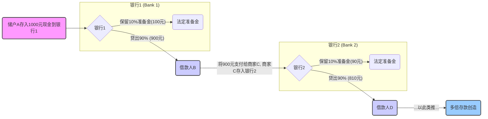

# 第十章：货币、银行与金融体系：经济的血脉与神经 (Money, Banking, and the Financial System: Lifeblood and Nerves of the Economy)

货币、银行和金融体系构成了现代经济运行的血脉和神经系统。它们不仅促进了商品和服务的交换，更在资源配置、风险管理和经济增长中扮演着核心角色。理解这一体系的运作机制，是把握宏观经济脉络、制定明智投资决策的基础。本章将深入探讨货币的本质与演变，商业银行的货币创造功能，中央银行的调控角色，以及金融市场的基本构成与运作。

## 10.1 货币的演变与职能：从贝壳到数字货币 (Money's Evolution and Functions: From Shells to Digital Currency)

货币并非天然存在，而是人类社会经济活动发展到一定阶段的产物。它的形态随着技术进步和交易需求的变化而不断演进，从最初的实物货币（如贝壳、贵金属）到后来的代用货币（如银行券），再到现代的信用货币（法定货币）以及方兴未艾的数字货币。无论形态如何变化，货币的核心职能始终如一。

### 10.1.1 价值尺度、交易媒介、贮藏手段 (Unit of Account, Medium of Exchange, Store of Value)

经济学家通常将货币的核心职能归纳为三个方面：

1.  **价值尺度 (Unit of Account):** 货币提供了一种衡量和比较不同商品、服务和资产价值的共同标准。没有货币，我们将陷入物物交换的复杂计算中（例如，多少苹果等于一只羊？多少羊等于一栋房子？）。货币简化了交易，降低了信息成本。想象一下，如果没有共同的价格单位，超市里的商品该如何标价？公司的财务报表又该如何编制？价值尺度的存在使得经济核算成为可能。

2.  **交易媒介 (Medium of Exchange):** 货币是买卖双方普遍接受的支付手段，克服了物物交换所需的"双重欲望巧合"(double coincidence of wants) 的难题。在物物交换中，你需要找到一个不仅拥有你想要的商品，并且恰好需要你所拥有商品的人。货币的出现极大地提高了交易效率，促进了市场分工和专业化。当你用货币购买咖啡时，咖啡店老板接受货币，因为他相信可以用这些货币去购买他需要的其他东西。

3.  **贮藏手段 (Store of Value):** 货币允许人们将当前的购买力储存起来，用于未来的消费或投资。当然，货币并非唯一的价值贮藏手段（房地产、股票、黄金等也可以），甚至在通货膨胀时期可能不是最好的手段。但货币具有高度的流动性(Liquidity)，即能够以最小的价值损失迅速转换为其他资产或用于支付的能力，这是其他许多资产难以比拟的。人们持有货币，是为了应对未来的不确定性或抓住未来的交易机会。

除了这三大核心职能，有时还会提及 **延期支付标准 (Standard of Deferred Payment)**，即货币可用于记录和清偿未来的债务。这实际上是价值尺度和交易媒介职能在时间维度上的延伸。

### 10.1.2 货币层次划分：M0, M1, M2 的构成与流动性差异 (Money Supply Measures: Composition and Liquidity Differences of M0, M1, M2)

中央银行通常会根据资产的流动性对货币供应量进行不同层次的统计和监测。流动性越高的资产，越容易、越快地充当交易媒介。不同国家或地区的具体划分可能略有差异，但基本逻辑相似。以中国人民银行和美联储的划分为例：

*   **M0 (流通中现金):** 指银行体系以外流通的现金（纸币和硬币）。这是流动性最强的货币形式。在中国，M0 = 流通中现金。在美国，类似的概念通常包含在M1中，但有时也会单独提及。

*   **M1 (狭义货币供应量):** 通常包括 M0 以及流动性非常高的存款。
    *   在中国：M1 = M0 + 企业活期存款。 M1反映了经济中现实的购买力。
    *   在美国：M1 = 流通中现金 + 需求存款 (Demand Deposits) + 其他支票存款 (Other Checkable Deposits)。

*   **M2 (广义货币供应量):** 在 M1 的基础上，加入了流动性稍次但仍能较容易转换为现实购买力的资产。
    *   在中国：M2 = M1 + 准货币 (企业定期存款 + 居民储蓄存款 + 其他存款)。 M2不仅反映现实购买力，也反映潜在购买力。
    *   在美国：M2 = M1 + 储蓄存款 (Savings Deposits) + 小额定期存款 (Small-denomination Time Deposits) + 零售货币市场基金份额 (Retail Money Market Fund Shares)。

**流动性排序:** M0 > M1 > M2

**关系:** M0 是 M1 的基础，M1 是 M2 的基础。

**经济意义:**
*   **M0:** 反映了社会公众持有的现金量。
*   **M1:** 常被称为"狭义货币"，主要反映企业和居民的直接支付能力，其增速变化通常被视为经济活动活跃度的重要指标。若 M1 增速显著快于 M2，可能意味着企业和居民更倾向于持有活期存款以备交易，经济趋于活跃或面临通胀压力（所谓的"货币活化"）。
*   **M2:** 常被称为"广义货币"，不仅包括直接支付工具，还包括了潜在的购买力，是衡量社会总信用的重要指标，与通货膨胀和经济增长的关系更为密切。央行的货币政策通常更关注 M2 的变化。

理解不同层次货币供应量的构成和流动性差异，有助于我们把握经济的脉搏，判断资金的松紧程度和流向，以及潜在的通胀或通缩压力。

## 10.2 商业银行的角色：信用中介与货币创造机器 (The Role of Commercial Banks: Credit Intermediaries and Money Creation Machines)

商业银行是金融体系的核心组成部分，它们不仅仅是吸收存款和发放贷款的简单中介，更在现代信用货币体系下扮演着至关重要的"货币创造"角色。

### 10.2.1 部分准备金制度：银行体系如何"创造"货币 (Fractional Reserve System: How the Banking System "Creates" Money)

现代银行体系运行的基础是 **部分准备金制度 (Fractional Reserve Banking System)**。这意味着银行吸收存款后，只需要将其中的一部分作为 **存款准备金 (Reserves)** 保留起来（以应付储户提款和清算需求），其余部分可以用于发放贷款或进行投资。存款准备金通常包括两部分：

1.  **法定存款准备金 (Required Reserves):** 中央银行规定商业银行必须按其存款的一定比例上缴或存放在央行的部分，这个比例就是 **法定存款准备金率 (Required Reserve Ratio, RRR)**。
2.  **超额存款准备金 (Excess Reserves):** 商业银行实际持有的准备金超过法定要求的部分，通常是为了应对非预期的提款或作为清算的备付金。

正是这个制度，使得银行体系能够通过发放贷款来"凭空"创造出比基础货币（通常指M0 + 银行体系的总准备金）更多的广义货币（如M2）。这个过程可以通过一个简化的例子来说明：

**货币创造过程示意图 (Mermaid Flowchart):**

**解释:**
1.  初始存款：储户 A 将 1000 元现金存入银行 1。这 1000 元是基础货币。
2.  银行 1 放贷：假设法定存款准备金率 (RRR) 为 10%，银行 1 需保留 100 元作为法定准备金，可以将剩余的 900 元贷给借款人 B。
3.  派生存款：借款人 B 将这 900 元用于支付（例如购买商品），收款人 C 将这 900 元存入银行 2。这时，银行体系的总存款变成了 1000 + 900 = 1900 元。
4.  银行 2 放贷：银行 2 对这 900 元存款，保留 10% (90 元) 作为准备金，可将剩余的 810 元贷给借款人 D。
5.  以此类推：这个过程会持续下去，每一轮新的贷款都会创造出新的存款。最终，整个银行体系通过最初的 1000 元基础货币，创造出远超 1000 元的广义货币（存款）。

这个过程被称为 **存款多倍扩张 (Multiple Deposit Expansion)**。

### 10.2.2 货币乘数：理论值与现实制约 (Money Multiplier: Theoretical Value and Real-World Constraints)

理论上，在最简化的情况下（假设银行将所有超额准备金都贷出，且所有贷款都以存款形式回到银行体系），由一单位基础货币（通常指银行准备金）能创造出的最大广义货币（通常指存款）的倍数，称为 **简单货币乘数 (Simple Money Multiplier)**。

其计算公式为：
\[
\text{简单货币乘数} = \frac{1}{\text{法定存款准备金率 (RRR)}}
\]
在上面的例子中，RRR = 10% = 0.1，则简单货币乘数 = 1 / 0.1 = 10。这意味着最初的 1000 元基础货币（如果全部作为准备金进入银行体系），理论上最多可以创造出 1000 * 10 = 10000 元的存款货币。

然而，现实中的货币乘数通常远小于理论值，因为受到以下因素的制约：

1.  **现金漏损率 (Currency Drain Ratio / Cash Leakage Ratio):** 公众并非将所有收入都存入银行，而是会持有一定比例的现金。当贷款以现金形式流出银行体系，并未完全回流时，就会减少后续存款创造的基础。现金漏损率越高，实际货币乘数越小。
2.  **超额准备金率 (Excess Reserve Ratio):** 银行出于流动性管理、风险规避或对未来信贷需求预期的考虑，可能持有超过法定要求的超额准备金，而不是将所有可贷资金都贷放出去。尤其在经济不确定性增加或信贷风险上升时，银行可能变得更加谨慎，持有更多超额准备金，导致实际货币乘数下降。
3.  **其他因素:** 如定期存款和非银行金融机构存款转化为 M2 组成部分的复杂性等。

因此，**实际货币乘数 (Actual Money Multiplier)** 的计算更为复杂，需要考虑这些因素。例如，一个更接近现实的 M2 乘数模型可能考虑现金漏损率 (c) 和总准备金率 (法定准备金率 r + 超额准备金率 e)：
\[
\text{实际货币乘数 (近似)} \approx \frac{1 + c}{c + r + e}
\]
其中 c = 流通中现金 / 存款，r = 法定准备金 / 存款，e = 超额准备金 / 存款。

理解货币乘数的理论与现实差异至关重要。中央银行虽然可以通过调整法定存款准备金率来影响理论乘数，但实际的货币创造效果还会受到银行放贷意愿（影响e）和公众持现行为（影响c）的显著影响。

### 10.2.3 银行资产负债表与风险管理 (Bank Balance Sheet and Risk Management)

商业银行的经营活动可以通过其资产负债表来反映。理解银行的资产负债结构是分析其盈利能力和风险状况的基础。

**简化银行资产负债表:**

| 资产 (Assets) - 资金运用         | 负债与所有者权益 (Liabilities & Equity) - 资金来源 |
| :--------------------------------- | :--------------------------------------------------- |
| 准备金 (Reserves)                  | 存款 (Deposits) - 主要负债                           |
|   - 法定存款准备金                 |   - 活期存款                                         |
|   - 超额存款准备金                 |   - 定期存款                                         |
|   - 存放同业款项                   |   - 其他存款                                         |
| 贷款 (Loans) - 主要盈利资产        | 同业及其他金融机构存放款项                         |
|   - 企业贷款                       | 向中央银行借款 (Borrowing from Central Bank)         |
|   - 个人贷款 (房贷、消费贷等)    | 发行债券 (Bonds Issued)                              |
| 证券投资 (Securities)              | 其他负债                                             |
|   - 政府债券                       | **所有者权益 (Owner's Equity) / 银行资本 (Bank Capital)** |
|   - 金融债券、企业债券             |   - 股本                                             |
|   - 股票 (较少，受监管限制)      |   - 资本公积                                         |
| 其他资产 (如固定资产)            |   - 留存收益                                         |
| **总资产**                         | **总负债 + 总所有者权益**                            |

**银行面临的主要风险:**

1.  **信用风险 (Credit Risk):** 贷款无法收回或债券发行人违约的风险。这是银行最核心的风险。不良贷款率 (Non-Performing Loan Ratio, NPL Ratio) 是衡量信用风险的关键指标。
2.  **流动性风险 (Liquidity Risk):** 银行无法及时满足储户提款需求或履行其他支付义务的风险。这可能源于资产负债期限错配（例如，用短期存款支持长期贷款）或突发的大量提款（银行挤兑）。
3.  **利率风险 (Interest Rate Risk):** 市场利率变动对银行盈利能力和资产价值产生不利影响的风险。例如，利率上升可能导致银行固息贷款的价值下降，或增加其浮息负债的成本。
4.  **市场风险 (Market Risk):** 银行持有的交易性金融资产（如股票、债券、衍生品）因市场价格波动而遭受损失的风险。
5.  **操作风险 (Operational Risk):** 由于内部流程、人员、系统失误或外部事件导致损失的风险（如欺诈、IT系统故障、自然灾害）。

有效的风险管理是银行稳健经营的关键。监管机构（如巴塞尔委员会）制定了一系列监管标准（如资本充足率、流动性覆盖率等），旨在增强银行抵御风险的能力，维护金融体系稳定。

## 10.3 中央银行：货币体系的最终守护者 (The Central Bank: Ultimate Guardian of the Monetary System)

中央银行（Central Bank）是一个国家或地区金融体系的核心机构，通常由政府设立并被赋予特殊权力，以管理货币供应、监管银行体系和维护金融稳定。

### 10.3.1 核心职能：发行货币、银行的银行、政府的银行、制定和执行货币政策、维护金融稳定 (Core Functions: Issuing Currency, Banker's Bank, Government's Bank, Formulating and Implementing Monetary Policy, Maintaining Financial Stability)

中央银行的核心职能通常包括：

1.  **发行货币 (Issuing Currency):** 拥有法定的货币发行权，是唯一的"发行的银行"。流通中的现金（M0）由中央银行发行。
2.  **银行的银行 (Banker's Bank):**
    *   **集中保管存款准备金:** 商业银行需将法定存款准备金存放在中央银行。
    *   **最终贷款人 (Lender of Last Resort):** 当商业银行面临暂时性流动性危机时，中央银行可向其提供紧急贷款支持，以防止恐慌蔓延和系统性风险爆发。这是维护金融稳定的关键职能。
    *   **组织全国清算:** 中央银行通常运营着全国性的支付清算系统，处理银行间的资金划拨和票据交换。
3.  **政府的银行 (Government's Bank):**
    *   **代理国库:** 管理政府的财政收支账户，代政府发行和偿还国债。
    *   **提供政策建议:** 向政府提供关于宏观经济和金融问题的咨询和建议。
    *   **管理外汇储备:** 持有和管理国家的外汇储备，干预外汇市场以稳定汇率。
4.  **制定和执行货币政策 (Formulating and Implementing Monetary Policy):** 这是中央银行最核心、最受关注的职能。通过运用各种政策工具（如公开市场操作、调整准备金率、设定基准利率等），调控货币供应量和信贷条件，以实现宏观经济目标（通常是稳定物价、促进充分就业、支持经济增长和维护国际收支平衡）。详见第十一章。
5.  **维护金融稳定 (Maintaining Financial Stability):** 监督和管理金融体系，识别和防范系统性风险，确保银行和金融机构的稳健运行，应对金融危机。近年来，宏观审慎政策 (Macroprudential Policy) 作为维护金融稳定的重要工具受到日益重视。

### 10.3.2 央行独立性：重要性与衡量 (Central Bank Independence: Importance and Measurement)

**中央银行独立性 (Central Bank Independence, CBI)** 指的是中央银行在制定和执行货币政策时，能够不受政府或其他政治力量直接干预的程度。

**重要性:**
*   **克服政策的"时间不一致性" (Time Inconsistency) 问题:** 政府往往有短期刺激经济（尤其在选举前）的动机，可能倾向于实施过度宽松的货币政策，即使这会带来长期通胀的代价。独立的中央银行更能着眼于长期物价稳定目标，避免为短期政治目标牺牲长期经济稳定。
*   **提高货币政策的信誉和有效性:** 当市场相信中央银行能够坚定地追求其政策目标（如通胀目标）时，政策的效果会更好。独立的央行更容易建立起这种信誉。
*   **减少财政赤字货币化的风险:** 独立的央行能更好地抵制政府要求其直接为财政赤字融资（即印钞票填补财政窟窿）的压力，这种行为往往是恶性通货膨胀的根源。

**衡量:**
衡量央行独立性通常从以下几个维度考察：
*   **目标独立性 (Goal Independence):** 央行自主设定货币政策最终目标（如通胀率）的权力。
*   **工具独立性 (Instrument Independence):** 央行自主选择和运用货币政策工具以实现既定目标的权力。这是更常见的独立性形式。
*   **人事独立性 (Personnel Independence):** 央行行长和决策层官员的任命、任期和解职程序是否能避免政治干预。较长的任期、严格的解职条件有助于提高独立性。
*   **财务独立性 (Financial Independence):** 央行预算和财务收支是否独立于政府财政，能否自主支配其利润。

大量的实证研究表明，较高的中央银行独立性通常与较低且更稳定的通货膨胀水平相关。然而，独立性并非绝对，中央银行仍需对其政策目标和行为向公众和立法机构负责（透明度和问责制）。

## 10.4 金融市场概览：储蓄转化为投资的舞台 (Overview of Financial Markets: The Stage for Transforming Savings into Investment)

金融市场是资金盈余方（储蓄者）和资金短缺方（投资者、借款人）进行资金融通的场所。它通过各种金融工具和中介机构，将分散的储蓄有效地引导到生产性投资和其他融资需求中，是现代经济资源配置的核心平台。

### 10.4.1 直接融资 (债券/股票市场) vs. 间接融资 (银行) (Direct Finance (Bond/Stock Markets) vs. Indirect Finance (Banks))

资金融通主要有两种方式：

1.  **直接融资 (Direct Finance):** 资金需求方（如企业、政府）直接通过发行金融证券（如股票、债券）从资金供应方（如个人投资者、机构投资者）筹集资金。金融市场（如证券交易所）在其中扮演了撮合交易的角色。
    *   **优点:** 资金供需双方直接对接，可能降低融资成本（对优质发行人而言）；投资者可以根据自身风险偏好直接选择投资对象；促进价格发现。
    *   **缺点:** 对投资者而言信息要求较高，风险需要自担；对融资方而言，发行门槛较高，需要满足信息披露等要求。
    *   **主要市场:**
        *   **股票市场 (Stock Market):** 发行和交易代表公司所有权的股票。
        *   **债券市场 (Bond Market):** 发行和交易代表债权债务关系的债券。

2.  **间接融资 (Indirect Finance):** 资金通过金融中介机构（主要是商业银行）进行融通。银行吸收公众存款（对储户负债），然后将这些资金以贷款形式发放给资金需求方（对银行是资产）。
    *   **优点:** 银行利用其专业能力进行信息收集、风险评估和风险管理，降低了信息不对称问题；银行为存款提供了流动性和安全性（在存款保险制度下）；银行可以对借款人进行贷后管理。
    *   **缺点:** 存在中介成本；可能产生道德风险和逆向选择问题；银行体系的风险可能传导至整个经济。
    *   **主要机构:** 商业银行、信用合作社、储蓄贷款协会等。

在多数国家，直接融资和间接融资并存，共同构成了金融体系。两者结构比例的变化反映了金融市场的发展程度和特点。一般来说，发达经济体的直接融资占比较高。

### 10.4.2 主要金融工具简介：债券 (利率、期限、信用)、股票 (所有权、股息、风险)、衍生品 (期货、期权、互换) (Introduction to Major Financial Instruments: Bonds (Interest Rate, Maturity, Credit), Stocks (Ownership, Dividends, Risk), Derivatives (Futures, Options, Swaps))

金融市场交易的是各种各样的 **金融工具 (Financial Instruments)** 或称 **金融资产 (Financial Assets)**。以下是几类主要的金融工具：

1.  **债券 (Bonds / Fixed Income Securities):**
    *   **定义:** 发行人（政府、金融机构、企业）向投资者借款时出具的债务凭证，承诺在特定日期（到期日）偿还本金，并按约定利率（票面利率）定期支付利息。
    *   **核心要素:**
        *   **面值 (Face Value / Par Value):** 到期时偿还的本金金额。
        *   **票面利率 (Coupon Rate):** 按面值计算的年利率。
        *   **到期日 (Maturity Date):** 偿还本金的日期。**期限 (Term / Tenor)** 指从发行到到期的时长。
        *   **发行人 (Issuer):** 借款方。
    *   **风险:**
        *   **利率风险:** 市场利率上升会导致现有债券价格下跌（反之亦然）。长期债券对利率变动更敏感。
        *   **信用风险 (违约风险):** 发行人无法按时支付利息或偿还本金的风险。信用评级机构（如标普、穆迪、惠誉）会对债券进行评级以反映其信用风险。国债通常被视为无信用风险（或风险极低）。
        *   **通胀风险:** 通胀侵蚀债券固定利息和本金的实际购买力。
        *   **流动性风险:** 难以在不显著折价的情况下快速卖出债券的风险。
    *   **分类:** 按发行人可分为国债、地方政府债、金融债、公司债等；按利率是否固定可分为固定利率债券、浮动利率债券；按期限可分为短期、中期、长期债券。

2.  **股票 (Stocks / Equities):**
    *   **定义:** 代表对股份有限公司所有权份额的凭证。持有股票的投资者（股东）是公司的所有者之一。
    *   **股东权利:**
        *   参与公司决策（通过股东大会投票）。
        *   分享公司利润（以股息/红利 (Dividends) 的形式）。
        *   在公司清算时，在偿还所有债务后，按持股比例分配剩余资产。
    *   **收益来源:**
        *   **股息收入:** 公司发放的利润。
        *   **资本利得 (Capital Gains):** 股票市场价格上涨带来的收益。
    *   **风险:**
        *   **市场风险:** 股价受整体市场情绪、宏观经济、行业前景等多种因素影响而波动。
        *   **经营风险:** 公司自身经营不善、决策失误、竞争加剧等导致盈利下降甚至亏损的风险。
        *   **流动性风险:** 对于交易不活跃的股票，可能难以按期望价格快速买卖。
        *   **无固定收益和本金保障:** 与债券不同，股票没有固定的利息支付承诺，也没有到期偿还本金的保证。如果公司破产，股东可能血本无归。
    *   **分类:** 按股东权利可分为普通股 (Common Stock) 和优先股 (Preferred Stock)。优先股通常有固定的股息率，在利润分配和清偿顺序上优先于普通股，但一般没有投票权。

3.  **金融衍生品 (Financial Derivatives):**
    *   **定义:** 其价值依赖于（或"衍生"于）一种或多种 **基础资产 (Underlying Assets)** 的金融合约。基础资产可以是股票、债券、商品（如原油、黄金）、货币、利率，甚至其他衍生品。
    *   **主要类型:**
        *   **期货 (Futures):** 合约双方同意在未来特定日期（交割日）按预定价格（期货价格）买入或卖出特定数量的基础资产。期货合约通常在交易所进行标准化交易。
        *   **期权 (Options):** 赋予持有者在未来特定日期或之前，以预定价格（执行价格）买入（看涨期权 Call Option）或卖出（看跌期权 Put Option）特定数量基础资产的 **权利**，而非义务。购买期权需要支付权利金 (Premium)。
        *   **互换 (Swaps):** 合约双方同意在未来特定时期内交换一系列现金流。常见的有利率互换（如固定利率与浮动利率交换）、货币互换。
    *   **主要功能:**
        *   **风险管理 (对冲 Hedging):** 利用衍生品来抵消基础资产价格不利变动带来的风险。例如，出口商可以卖出远期外汇合约来锁定未来的汇率。
        *   **价格发现:** 期货市场的价格反映了市场对未来基础资产价格的预期。
        *   **投机 (Speculation):** 预期基础资产价格变动，利用衍生品的杠杆效应来获取高额收益（也伴随高风险）。
    *   **风险:** 衍生品交易通常具有高杠杆性，可能带来巨大收益，也可能导致巨大损失。其复杂性也带来了操作风险和模型风险。2008年金融危机部分源于对复杂衍生品（如MBS, CDO）风险的低估和滥用。

### 10.4.3 金融中介机构：类型与功能 (Financial Intermediaries: Types and Functions)

金融中介机构 (Financial Intermediaries) 在金融体系中扮演着桥梁角色，连接资金供需双方，并通过其专业服务提高资金融通的效率和安全性。

**主要类型:**

1.  **存款性机构 (Depository Institutions):** 主要通过吸收存款获得资金来源。
    *   **商业银行 (Commercial Banks):** 最主要的金融中介，提供广泛的金融服务，包括吸收各类存款、发放各类贷款、支付结算、外汇交易、托管等。
    *   **储蓄机构 (Thrifts / Savings Institutions):** 如储蓄贷款协会、互助储蓄银行，历史上主要专注于吸收储蓄存款并发放住房抵押贷款。
    *   **信用合作社 (Credit Unions):** 由具有共同联系（如同一雇主、社区）的成员组成的非营利性合作金融组织，向成员提供存贷款服务。

2.  **契约性储蓄机构 (Contractual Savings Institutions):** 通过与客户签订契约，定期获得资金来源，并进行长期投资。
    *   **保险公司 (Insurance Companies):** 通过收取保费，为投保人提供风险保障。它们将收取的保费投资于债券、股票、房地产等长期资产。分为人寿保险公司和财产与意外险公司。
    *   **养老基金 (Pension Funds):** 为雇员提供退休收入保障而设立的基金，定期从雇主和/或雇员处获得缴款，进行长期投资以实现资产增值。

3.  **投资性中介机构 (Investment Intermediaries):** 帮助个人和机构进行投资。
    *   **投资银行 (Investment Banks):** 主要从事证券承销（帮助企业发行股票和债券）、并购咨询、资产管理、证券交易和经纪等业务。它们是直接融资市场的重要参与者。
    *   **共同基金 (Mutual Funds):** 汇集众多投资者的资金，由专业基金管理人投资于股票、债券或其他证券的组合。投资者按持有份额分享投资收益、承担风险。提供了投资组合多样化和专业管理的便利。
    *   **对冲基金 (Hedge Funds):** 通常面向高净值个人或机构投资者募集资金，采用更广泛、更复杂的投资策略（如杠杆、卖空、衍生品交易）以追求绝对回报。监管相对宽松，透明度较低。
    *   **证券公司/经纪商 (Securities Firms / Broker-Dealers):** 主要从事证券经纪（代理客户买卖证券）、自营交易、投资咨询等业务。

**核心功能:**

*   **降低交易成本:** 通过规模经济和专业化，降低了搜寻、信息处理、合同执行等方面的成本。
*   **风险分担与管理:** 通过资产多样化（如共同基金投资组合）、风险评估（如银行贷款审批）、风险转移（如保险）等方式管理和分担风险。
*   **克服信息不对称:** 金融中介机构（尤其是银行）在识别借款人信用状况、监督贷款使用方面具有信息优势，有助于缓解逆向选择和道德风险问题。
*   **提供流动性:** 将非流动性资产（如长期贷款）转化为流动性负债（如活期存款），满足了储蓄者对流动性的需求。

金融中介机构的多样化和专业化是现代金融体系高效运行的重要保障。

---

**投资启示：**

*   **理解货币供应量 (M2) 变化对市场流动性的指示意义：** M2 增速的加快通常意味着市场流动性充裕，可能推高资产价格（股市、房市）；反之，M2 增速放缓或下降可能预示着流动性收紧，对资产价格构成压力。关注 M1 与 M2 增速的差值（"剪刀差"）有助于判断资金活化程度和经济热度。
*   **关注银行体系健康状况 (不良贷款率、资本充足率)：** 银行是信贷扩张的主体，其健康状况直接关系到金融体系的稳定和信贷供给能力。高企的不良贷款率或不足的资本充足率可能抑制银行放贷意愿，甚至引发系统性风险，对股市（尤其是银行股）和整体经济构成负面影响。
*   **认识不同金融工具的风险收益特征：** 根据自身的风险承受能力、投资目标和市场判断，合理配置不同类型的金融资产。例如，债券通常风险低于股票，但在利率上升周期可能表现不佳；股票长期回报潜力较大，但也伴随较高波动性；衍生品可用于风险对冲，但投机性使用风险极高。理解各种工具的特性是构建有效投资组合的基础。
*   **区分直接融资与间接融资的重要性：** 一个国家金融结构中直接融资与间接融资的比例，反映了其金融市场的发展阶段和效率。直接融资的发展（如股票注册制改革、债券市场开放）有助于提高资源配置效率，为投资者提供更多选择，但也对监管和投资者风险识别能力提出了更高要求。
*   **关注金融创新与监管动态：** 金融体系在不断演变，新的金融工具（如数字货币）、新的中介形式（如金融科技平台）和新的风险（如网络安全风险）层出不穷。同时，金融监管政策也在不断调整以适应变化、防范风险。投资者需要持续学习，理解金融创新带来的机遇与挑战，并关注监管动态及其对相关行业和市场可能产生的影响。

--- 