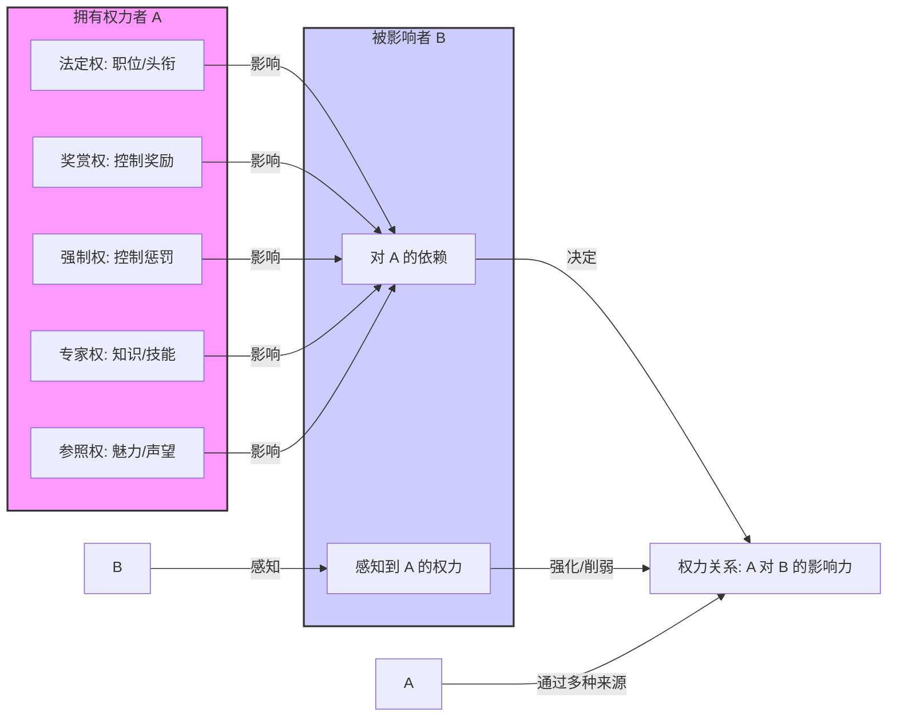
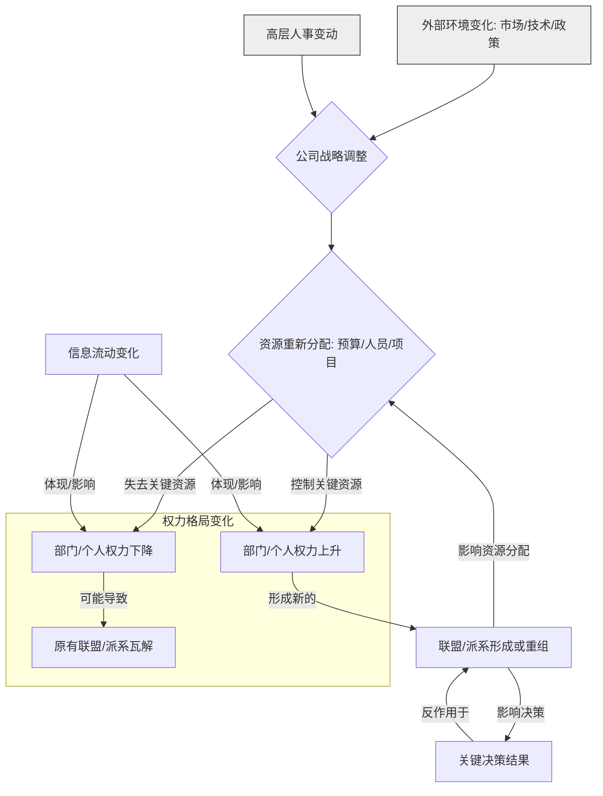

# 第二章：权力游戏——理解组织的运作法则

如果说第一章是解剖驱动个体行为的"微观"密码，那么第二章将聚焦于组织这个"中观"层面，探讨权力的来源、分布、流动以及由此产生的办公室政治。职场不仅仅是完成任务的地方，更是一个复杂的权力场。在这里，资源如何分配、决策如何做出、谁能获得晋升，往往不仅仅取决于能力和业绩，更取决于对组织权力运作法则的理解和运用。

看不懂权力游戏，你可能勤勤恳恳却始终原地踏步，甚至不明不白地成为牺牲品。而理解了权力的本质和运作方式，你才能更有效地航行于这片复杂的"水域"，保护自身利益，实现职业目标。本章将为你揭示组织内部权力游戏的底层逻辑。

---

## 2.1 权力的来源与本质

权力，这个词似乎自带光环，又常常令人讳莫如深。但在职场中，权力是客观存在的，理解其来源和本质是参与游戏的第一步。社会学家弗伦奇（John French）和雷文（Bertram Raven）提出的"权力的五个来源"理论，为我们提供了一个经典的分析框架：

### 权力的五种来源

1.  **法定权 (Legitimate Power)**：也称为职位权力。来源于个人在组织层级结构中所处的正式职位。例如，CEO 有权做出公司战略决策，部门经理有权给下属分配任务。这种权力是组织赋予的，具有强制性和公认性。其有效性依赖于下属对组织权威的认可。
2.  **奖赏权 (Reward Power)**：来源于控制他人所需资源或奖励的能力。例如，能够决定奖金分配、提供晋升机会、给予公开表扬、分配理想任务等。拥有奖赏权的人，可以通过给予好处来影响他人行为。
3.  **强制权 (Coercive Power)**：来源于威胁或实施惩罚的能力。例如，能够批评、降职、扣罚奖金、解雇等。强制权是权力的"负面"，通过制造恐惧来影响他人。过度使用强制权容易引起抵触和不满，损害长期关系。
4.  **专家权 (Expert Power)**：来源于个人拥有的特殊知识、技能或专业能力。当别人认为你在某个领域是专家，需要依赖你的知识和判断时，你就拥有了专家权。例如，资深工程师的技术权威、财务总监的专业判断力。专家权与职位无关，需要持续学习和保持专业性来维持。
5.  **参照权 (Referent Power)**：也称为个人魅力权或榜样权。来源于个人的品质、魅力、声望，使他人认同、尊敬并愿意追随。这种权力基于情感连接和信任。拥有参照权的领导者，能够激发团队的忠诚度和凝聚力。这是最难建立但也最稳固的权力来源之一。

这五种权力来源并非相互独立，一个人可能同时拥有多种权力。例如，一位受人尊敬的技术总监，既有法定权（职位），又有专家权（技术能力），还可能有参照权（个人魅力）。理解这些来源，有助于我们分析自己和他人权力的基础，并思考如何提升自己的影响力。

### 权力是关系，而非个人属性

一个常见的误解是认为权力是个人固有的属性，像身高、体重一样。但实际上，**权力本质上是一种关系**。它存在于人与人之间，体现为一方影响另一方的能力。

*   **依赖性是权力的基础**：你对某人拥有多大权力，取决于对方在多大程度上依赖你所控制的资源（包括信息、知识、机会、认可等）。如果对方不依赖你，即使你拥有再高的职位或再多的资源，你的权力也难以施展。反之，即使你职位不高，但掌握了某种关键的、稀缺的、不可替代的资源（例如核心技术、关键客户关系、特殊信息渠道），他人就可能依赖你，从而赋予你权力。
*   **权力是动态变化的**：组织结构调整、市场环境变化、人员流动等因素，都会导致依赖关系的变化，进而影响权力格局。曾经的核心部门可能被边缘化，掌握过时技能的专家可能失去影响力。因此，维持权力需要持续审视和调整自己所控制的资源与他人的依赖关系。
*   **权力需要被感知**：仅仅拥有潜在的权力来源是不够的，还需要让相关方感知到你的权力。例如，专家需要通过分享知识、解决难题来展现其专业性；拥有奖赏权的人需要适时兑现奖励，才能强化其影响力。

理解权力是一种关系，提醒我们不能仅仅关注自身的职位或拥有的资源，更要关注我们与他人的互动和相互依赖。

### Mermaid 图：权力来源结构图

我们可以用 Mermaid 图来更直观地展示权力的来源及其关系本质：

**图解**：权力者 A 通过其拥有的五种权力来源（法定权、奖赏权、强制权、专家权、参照权），影响被影响者 B 对 A 的依赖程度。B 对 A 的依赖程度，以及 B 是否感知到 A 的权力，共同决定了 A 对 B 的实际影响力，即两者之间的权力关系。这强调了权力是基于依赖和感知的互动关系。

---

## 2.2 识别权力中心与边缘

任何组织，无论其宣称多么扁平化，都存在实际的权力分布差异。就像一张地图上有重要的交通枢纽和偏远地区一样，组织内部也存在着**权力中心 (Power Centers)** 和**权力边缘 (Power Peripheries)**。识别出这些区域，理解谁掌握着关键资源和决策权，谁处于信息流和影响力网络的中心或边缘，对于制定有效的职场策略至关重要。

### 正式结构 vs. 非正式网络

理解权力分布，不能只看组织架构图 (Organization Chart)。组织架构图展示的是**正式结构 (Formal Structure)**，它规定了汇报关系、部门划分和法定权力。这很重要，但往往不能完全反映真实的权力运作。

更关键的是隐藏在正式结构之下的**非正式网络 (Informal Network)**。这是由员工之间基于信任、友谊、共同兴趣、过往经历、信息交换等自发形成的连接构成的。这些网络常常跨越部门和层级，影响着信息的流动速度、资源的获取途径以及决策的实际形成过程。

*   **权力中心可能不在最高层**：有时，某个职位不高但掌握关键技术、拥有广泛人脉或深受高层信任的人（如 CEO 的资深助理、掌握核心算法的工程师、销售冠军），可能比某些高层管理者拥有更大的实际影响力。
*   **非正式网络中的关键人物**：在非正式网络中，有些人扮演着"连接者"（连接不同群体）、"信息中枢"（掌握并传播关键信息）或"意见领袖"（其观点容易被他人接受）的角色。这些人往往是权力运作的关键节点。

因此，识别权力中心与边缘，需要同时考察正式结构和非正式网络。

### 关键人物与信息节点

在组织中，并非所有人都具有同等的影响力。我们需要识别出那些对决策、资源分配和信息流动起着关键作用的人物：

*   **正式决策者**：拥有法定权力做出最终决定的人，通常是各层级的管理者。
*   **关键影响者**：虽然没有最终决策权，但其意见、建议或专业判断能够显著影响正式决策者的人。例如，高层的信任顾问、掌握核心数据的分析师、能够影响舆论的关键员工。
*   **资源控制者**：掌握关键预算、人力、设备、客户等资源分配权的人。他们可能不是最高领导，但"卡脖子"的能力让他们拥有实权。
*   **信息守门人 (Gatekeepers)**：控制信息流动的人，能够决定什么信息向上汇报、向下传达或在部门间流转。例如，领导的秘书、掌握核心系统权限的 IT 人员、负责信息汇总的助理。
*   **非正式网络核心人物**：在非正式关系网中处于中心地位，人脉广、消息灵通、能影响他人态度的人。

识别这些人需要敏锐的观察力：谁在高层会议上发言更有分量？谁的意见总能得到认真考虑？谁能轻松调动跨部门资源？大家遇到难题时倾向于向谁求助？信息总是通过谁传播出来？

### 案例分析：如何找到真正的决策者

*   **场景**：公司计划推行一个新的 CRM 系统，需要各销售大区总监的支持。表面上看，最终决策由销售 VP 做出，各大区总监是关键执行者（正式结构）。
*   **深入分析**：
    1.  **识别影响者**：通过观察和打听，发现销售 VP 非常信任一位资深的销售运营经理 F，常常就系统选择和实施方案征求 F 的意见。同时，IT 部门负责系统评估的技术负责人 G 对系统选型有重要发言权。
    2.  **识别非正式网络**：发现华东大区总监 H 与销售运营经理 F 私交甚好，经常一起午餐；而华北大区总监 I 曾与 IT 技术负责人 G 在之前的项目中有过不愉快的合作经历。
    3.  **找到真正的"决策链"**：在这个场景下，仅仅搞定销售 VP 可能不够。真正的决策链可能是：技术负责人 G 提供技术评估意见 -> 销售运营经理 F 基于业务需求和人际关系进行权衡，并向 VP 提出建议 -> 销售 VP 结合各方意见做出最终决策。同时，华东总监 H 可能因为与 F 的关系而较早获得信息并表示支持，而华北总监 I 可能因为与 G 的过节而持保留意见。
*   **策略**：要想顺利推行 CRM 系统，不仅需要向 VP 汇报方案价值，还需要：
    *   争取销售运营经理 F 的认同，让他成为内部的"推销员"。
    *   与 IT 技术负责人 G 进行充分沟通，解答其技术疑虑，确保技术评估过关。
    *   利用与华东总监 H 的良好关系，争取他的早期支持，形成示范效应。
    *   针对华北总监 I 的顾虑，提前做好沟通预案，或者通过 VP 或 F 施加影响。

这个案例说明，权力中心并非单一节点，而是一个由正式决策者、关键影响者、信息节点等构成的复杂网络。识别这个网络的结构和关键人物，是理解和影响组织决策的关键。处于权力边缘的人，往往信息滞后，难以影响决策，也容易在组织变革中处于被动地位。

---

## 2.3 权力流动的动态平衡

组织内的权力并非静止不变，而是在不断流动和重新平衡中。如同水流，权力会汇聚，会分流，会受到各种力量的影响而改变方向。理解权力流动的规律，观察其动态变化，对于把握时机、趋利避害至关重要。联盟与派系的形成、资源分配的变化以及外部环境的冲击，都是驱动权力流动的重要因素。

### 联盟与派系：形成、运作与瓦解

在正式结构之外，非正式的**联盟 (Alliances)** 和**派系 (Factions)** 是权力运作的重要载体。它们基于共同的利益、相似的背景、共同的敌人或相互的依赖而形成。

*   **形成**：
    *   **利益驱动**：为了争夺有限的资源（预算、项目、晋升名额），拥有共同诉求的人会联合起来，形成临时的或长期的联盟。
    *   **人际关系**：基于同学、同乡、师徒、共同经历等情感纽带形成的派系，凝聚力往往更强。
    *   **权力依附**：围绕某个权力核心人物（如强势领导）形成的派系，成员通过依附核心人物来获取保护和资源。
    *   **共同防御**：面对共同的威胁或排挤时，弱势方可能会抱团取暖，形成防御性联盟。
*   **运作**：
    *   **信息共享**：联盟或派系内部往往有更快速、更私密的信息交流渠道。
    *   **资源互换**：成员之间会互相提供支持，共享资源、机会和人脉。
    *   **一致行动**：在关键决策或人事任免上，成员可能会采取一致立场，共同发声，以扩大影响力。
    *   **排斥异己**：对非成员或竞争对手可能采取排斥、打压的态度。
*   **瓦解**：
    *   **利益变化**：当共同的利益基础消失或出现内部分歧时，联盟可能瓦解。例如，共同的敌人消失后，曾经的盟友可能因为新的利益冲突而反目。
    *   **核心人物失势**：依附于权力核心人物的派系，会随着核心人物的失势而瓦解或重组。
    *   **内部矛盾**：成员间的信任破裂、权力争夺或资源分配不公，都可能导致联盟或派系的内爆。
    *   **外部干预**：更高层级的管理者可能会采取措施（如调岗、拆分部门）来打破过于强大的派系，以维持权力平衡。

识别组织中的联盟与派系，理解它们的形成逻辑和运作方式，判断其稳定性，是进行政治博弈的基础。选择加入哪个阵营、何时保持中立、如何建立自己的联盟，都需要审慎的考量。

### 资源分配与权力转移

**资源是权力的血液**。控制关键资源的部门或个人，通常拥有更大的权力。因此，观察组织内资源的分配流向，是判断权力转移的重要指标。

*   **预算倾斜**：年度预算分配向哪些部门、哪些项目倾斜，往往预示着这些领域或负责人的权力正在上升。
*   **人员调配**：核心人才、高潜力员工被调往哪个部门？哪个部门的编制在扩大或缩减？这反映了组织对不同业务单元战略重要性的判断。
*   **项目主导权**：关键性、战略性项目由谁主导？这不仅意味着资源的集中，也意味着负责人有更多机会展示能力、建立功绩，从而进一步巩固或提升权力。
*   **信息权限**：谁能接触到更核心、更全面的信息？信息系统的权限如何设置？信息流向的变化也反映了权力格局的调整。

当公司战略调整、市场环境变化或高层人事变动时，资源的分配逻辑往往会随之改变，进而引发权力的重新洗牌。例如，当公司决定大力发展线上业务时，电商部门的预算、人员和话语权通常会显著增加，其负责人的权力也随之上升。敏锐地捕捉这些资源分配的变化信号，有助于提前布局，顺势而为。

### Mermaid 图：组织内权力流动示意图

我们可以用流程图来示意性地展示组织内权力流动的几种典型路径：

**图解**：此图展示了组织权力流动的动态过程。外部环境变化和高层人事变动可能引发公司战略调整，进而导致资源的重新分配。控制关键资源者权力上升，反之则下降。联盟与派系的形成和重组会影响资源分配和决策结果，而权力格局的变化又会反过来影响联盟派系的动态。信息流动也是权力变化的重要体现和影响因素。整个过程是一个相互影响、动态平衡的循环。

---

## 2.4 办公室政治：不可避免的现实

谈论"办公室政治"(Office Politics)，许多人会联想到勾心斗角、拉帮结派、互相倾轧等负面场景。确实，办公室政治有其"黑暗"的一面，但将其完全污名化，并试图置身事外，往往是不现实且不明智的。

**办公室政治的本质，是在资源有限、权力分布不均的环境下，个体或群体为了获取和维持自身利益、实现目标而采取的各种影响策略和行为。** 只要存在组织、存在不同的利益诉求，办公室政治就不可避免。它就像空气，弥漫在组织的各个角落，无论你是否愿意承认或参与。

理解办公室政治，不是为了让你成为一个热衷权斗的"政客"，而是为了：
1.  **看清现实**：理解组织决策背后的真实逻辑，避免因天真而受挫。
2.  **保护自己**：识别潜在的风险和陷阱，避免成为政治斗争的牺牲品。
3.  **有效达成目标**：在复杂的环境中，利用适当的策略，争取资源、获得支持，推动工作进展。

### 识别常见的政治手段

了解一些常见的办公室政治手段，有助于我们识别正在发生的事情，并采取适当的应对：

*   **建立联盟 (Alliance Building)**：与拥有共同利益或互补资源的个体/群体建立合作关系，共同进退。（这是中性甚至积极的策略）
*   **印象管理 (Impression Management)**：通过言行举止、工作汇报、社交互动等方式，塑造自己在他人（尤其是上级）心目中的积极形象。（见第四章 4.5 节）
*   **信息控制 (Information Control)**：选择性地分享、过滤甚至扭曲信息，以引导他人判断或服务自身利益。（见第四章 4.1 节）
    *   *向上过滤*：只向上级汇报好消息或经过修饰的信息。
    *   *横向封锁*：阻止信息在不同部门或团队间流通。
    *   *向下隐瞒*：不告知下属完整的背景信息或决策考量。
*   **甩锅/诿过 (Scapegoating/Blame Game)**：将错误或失败的责任推卸给他人，以保全自己。
*   **邀功/抢功 (Credit Taking/Claiming)**：将他人的贡献或集体成果归功于自己。
*   **拉拢与分化 (Co-optation & Divide and Conquer)**：将潜在的反对者或中立者拉拢到自己阵营；或者在对手阵营内部制造矛盾，使其分裂。
*   **散布谣言/背后中伤 (Spreading Rumors/Backstabbing)**：通过非正式渠道散播负面信息，损害他人声誉或可信度。
*   **设置议程 (Agenda Setting)**：通过控制会议议题、讨论顺序或时间分配，来影响决策方向。
*   **讨好上级 (Ingratiation)**：通过奉承、迎合等方式获取上级的青睐和特殊照顾。
*   **利用规则 (Exploiting Rules)**：精通组织的规章制度，并利用其中的模糊地带或漏洞来为自己谋利或打击对手。

需要注意的是，这些手段中有些是中性的（如建立联盟、印象管理），有些则明显是负面和破坏性的（如甩锅、背后中伤）。厚黑学强调的是识别这些手段，理解其运作逻辑，并在必要时运用"阳谋"（符合规则和基本道德底线的策略），同时防范和反击"阴谋"。

### 中立、结盟还是对抗？

面对办公室政治，个体往往需要在不同的立场中做出选择：

*   **保持中立 (Neutrality)**：
    *   *优点*：不卷入纷争，避免站错队的风险，可以与各方都保持一定关系。
    *   *缺点*：可能被视为"墙头草"，在关键时刻两边都不讨好，难以获得核心资源和信任。在权力斗争激烈时，中立往往难以维持，甚至可能被双方视为潜在威胁而首先清除。
    *   *适用场景*：权力格局不明朗、自身实力不足、斗争与自身核心利益关系不大时。
*   **选择结盟 (Alignment)**：
    *   *优点*：获得盟友的支持，共享资源和信息，共同抵御风险，增加影响力。选择强大的阵营可能带来快速发展。
    *   *缺点*：需要承担阵营失败的风险（一荣俱荣，一损俱损），可能需要为盟友付出代价或做出妥协，失去一定的独立性。
    *   *适用场景*：自身利益与某一方高度绑定、看好某一方的前景、需要借助外力达成目标时。结盟需要谨慎选择对象，评估风险与收益。
*   **有限对抗 (Limited Confrontation)**：
    *   *优点*：在核心利益受到侵犯时，表明立场，捍卫自身权益，赢得尊重。
    *   *缺点*：可能激化矛盾，树立敌人，甚至引火烧身。需要精确评估自身实力和对方底线。
    *   *适用场景*：自身核心利益、原则底线受到直接挑战，且有一定实力和把握时。对抗应有策略，对事不对人，寻求最优解决方案而非两败俱伤。

选择哪种立场并非一成不变，需要根据具体情况、权力格局的变化以及自身的目标和实力进行动态调整。关键在于**保持清醒的头脑，进行理性的利弊分析**。

### 案例分析：办公室政治中的生存策略

*   **场景**：某部门经理 K 的上级 L 即将退休，部门内部两位资深主管 M 和 N 都有意竞争经理职位。M 能力强但性格强势，与 L 关系一般；N 资历稍浅但善于人际，深得 L 的信任，且与公司某位副总裁有远亲关系。K 作为部门骨干，其支持对 M 和 N 都有一定分量。
*   **K 的策略选择**：
    1.  **中立**：K 可以选择不明确表态支持谁，与 M 和 N 都保持工作关系。风险在于，无论谁最终上任，都可能因为 K 没有"投诚"而对其有所保留。如果 M 和 N 斗争激烈，K 可能被夹在中间左右为难。
    2.  **结盟 M**：如果 K 更看重能力，且认为 M 上位后能给部门带来更好发展，可以私下或公开支持 M。风险在于，如果 N 凭借人脉优势胜出，K 的日子可能不好过。
    3.  **结盟 N**：如果 K 认为 N 的人脉和高层关系更有优势，且 N 对自己示好，可以选择支持 N。风险在于，如果 M 意外胜出，或者 N 上位后能力不足导致部门业绩下滑，K 也可能受影响。
    4.  **更"厚黑"的策略**：K 可以表面保持中立，但私下分别向 M 和 N 传递一些"有用"的信息或"善意"的姿态，左右逢源，待局势明朗后再做选择。或者，K 可以专注于自身工作，做出亮眼业绩，提升自己的不可替代性，无论谁上台都需要倚重自己，从而在政治漩涡中获得相对安全的地位。

这个案例说明，办公室政治中的选择往往是复杂的，没有绝对正确答案。最佳策略取决于对局势的判断、对风险的承受能力以及自身的长期目标。**提升自身价值，让自己变得"有用"且"难以替代"，往往是在政治博弈中立于不败之地的根本**。

至此，第二章"权力游戏——理解组织的运作法则"的主要内容已经完成。本章从权力的来源与本质出发，探讨了如何识别权力中心与边缘、理解权力流动的动态平衡，并最终点明了办公室政治的现实与应对策略。掌握这些法则，是进入下一部分"厚黑心法"修炼的基础。 