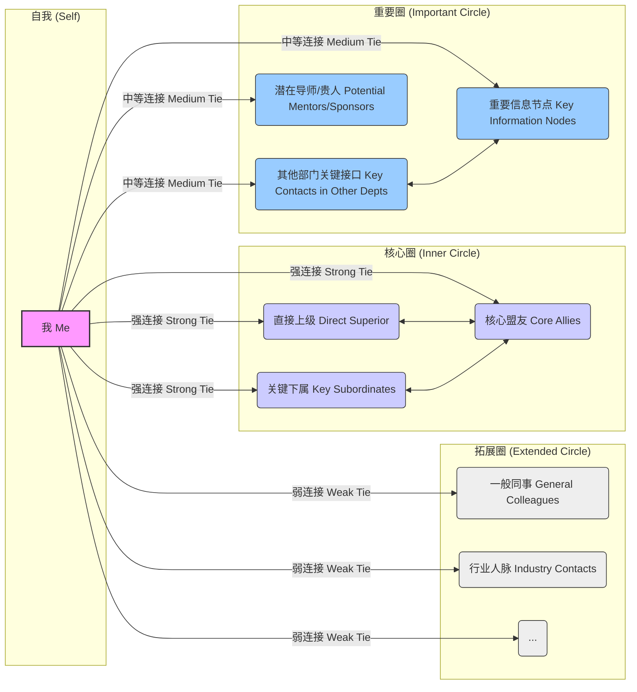

# 第四章：“黑”字诀——驾驭博弈的策略 (Chapter 4: The "Black" Principle - Strategies for Navigating the Game)

**引言**

如果说第三章的“厚”字诀侧重于锻造坚韧内心、增强防御力和承受力，那么本章的“黑”字诀则聚焦于**主动出击、影响环境、驾驭博弈**的策略与技巧。这里的“黑”，并非指阴险毒辣、不择手段，而是强调在认清现实复杂性的基础上，运用智慧和策略，**主动塑造有利态势，有效影响他人决策，从而在竞争与合作中占据主动，达成目标**。

“厚”是内守，“黑”是外攻。“厚”是根基，“黑”是用法。缺乏“厚”的根基，“黑”的策略容易走偏，变得脆弱易折；而没有“黑”的策略，空有“厚”的内心，则可能陷入被动，难以在激烈的职场竞争中有效作为。

本章将深入探讨“黑”字诀的五大核心策略：如何通过**信息控制**构建不对称优势；如何运用**向上管理**影响关键决策者；如何通过**横向联合**构建可靠同盟；如何实施**向下领导**建立稳固团队；以及如何进行**印象管理**塑造有利形象。掌握这些策略，将使你在职场博弈中更加游刃有余，变被动为主动，有效驾驭复杂的竞争环境。

---

## 4.1 信息控制：不对称优势的构建 (Information Control: Building Asymmetric Advantage)

在现代职场，**信息就是权力 (Information is Power)**。谁掌握了更准确、更及时、更关键的信息，谁就拥有了决策的主动权和博弈的优势。信息控制的核心在于**构建信息不对称 (Information Asymmetry)**，即让自己比对手或合作方掌握更多、更关键的信息，从而在判断、谈判和行动中占据有利地位。“黑”字诀中的信息控制并非鼓励欺骗，而是强调信息管理的战略价值。

### 信息的收集、筛选与利用 (Collection, Filtering, and Utilization of Information)
*   **多元化收集渠道**：建立广泛的信息来源网络。包括：
    *   *正式渠道*：公司公告、邮件、报告、会议纪要、公开数据等。
    *   *非正式渠道*：茶水间的闲聊、同事间的私下交流、行业内的社交活动、值得信赖的线人、观察关键人物的言行举止等。
    *   *主动探寻*：针对特定目标，有意识地通过提问、调研、查阅资料等方式获取信息。
*   **关键信息筛选**：信息爆炸时代，需要具备筛选能力。关注那些与你的目标、利益、风险相关的**关键信息 (Critical Information)**。例如：影响决策的关键数据、竞争对手的动向、上级的真实意图、组织架构或人事变动的传闻、潜在的机会或威胁等。学会过滤噪音和冗余信息。
*   **深度分析与利用**：收集到的信息需要经过分析、解读才能转化为价值。
    *   *关联分析*：将不同来源的信息进行关联，发现其内在联系和潜在含义。
    *   *趋势判断*：从零散信息中识别趋势和模式。
    *   *价值评估*：判断信息的时效性、可靠性和对决策的影响程度。
    *   *策略指导*：利用分析后的信息指导你的行动策略，例如调整谈判方案、选择合适的沟通时机、预判风险并提前应对。

### 制造信息差，掌握主动权 (Creating Information Gaps to Seize Initiative)
*   **比对手知道更多**：通过比竞争对手更广泛、更深入的信息收集和分析，了解他们所不了解的情况。例如，在项目竞争中，了解对手方案的潜在缺陷或资源限制。
*   **比合作方理解更深**：在合作谈判中，了解合作方的真实需求、底线、内部制约因素等，能够让你在谈判中占据更有利的位置。
*   **预见性**：基于对信息的深刻理解，比他人更早地预见到未来的趋势、机会或风险，从而提前布局，掌握先机。

### 保密与选择性披露 (Confidentiality and Selective Disclosure)
*   **核心信息保密**：对于关乎自身核心利益、战略意图或可能被对手利用的关键信息，要严格保密。管住自己的嘴，谨慎选择沟通对象和场合。
*   **策略性信息传递**：并非所有信息都要保密。有时，**选择性地、在合适的时机向特定对象披露某些信息**，可以达到特定目的：
    *   *建立信任*：分享一些非核心但有价值的信息给盟友，以示诚意。
    *   *引导舆论*：将某些信息（可能是经过包装的）透露给关键传播节点，以影响群体认知。
    *   *试探反应*：透露部分计划，观察相关方的反应，以调整后续策略。
    *   *施加压力*：暗示你掌握某些对方不利的信息，以促使其让步或合作（需极为谨慎，避免变成要挟）。
*   **控制信息流速与范围**：不仅要控制披露什么，还要控制何时披露、向谁披露、披露到什么程度。

信息控制是"黑"字诀的基础功夫。它要求你像一个情报分析师一样，时刻保持对信息的敏感度，建立高效的信息网络，进行深入的分析判断，并策略性地管理信息的流动。掌握信息优势，你就掌握了博弈的主动权。

---

## 4.2 向上管理：影响你的上级 (Upward Management: Influencing Your Superiors)

“向上管理”并非阿谀奉承或溜须拍马，而是一种**主动管理与上级之间关系，积极影响上级决策，从而获得更多资源、支持和发展机会**的高阶职场策略。在组织中，上级掌握着资源分配、绩效评估和晋升推荐的关键权力。不懂得向上管理，即使能力再强，也可能因为与上级关系不畅、目标不一致或价值不被认可而发展受限。“黑”字诀的向上管理，强调理解、适应、影响和成就上级，最终实现双赢。

### 理解上司的真实需求与压力 (Understanding Your Boss's Real Needs and Pressures)
*   **目标与 KPI**：你的上级有哪些必须完成的工作目标和考核指标？你的工作如何能帮助他/她达成这些目标？
*   **面临的压力**：他/她可能面临来自更高层、同级、下属或外部环境的哪些压力？理解其压力有助于你提供更有针对性的支持。
*   **工作风格与偏好**：他/她是结果导向还是过程导向？喜欢口头汇报还是书面报告？是细节控还是抓大放小？喜欢主动汇报还是被动询问？了解并适应其风格，能让沟通更顺畅。
*   **权力基础与顾虑**：他/她在组织中的权力基础如何？有哪些潜在的担忧或禁忌？避免触及其"雷区"。
*   **期望与愿景**：他/她对团队和你的期望是什么？长远目标是什么？

理解是影响的前提。只有真正理解你的上级，才能做到精准沟通和有效支持。

### 提供解决方案，而非问题 (Providing Solutions, Not Just Problems)
*   **主动思考**：向上级汇报问题时，不要仅仅陈述困难，更要展现你已经对此进行了思考，并提出至少一到两个经过初步评估的解决方案，供上级选择或参考。
*   **展现担当**：表明你愿意为解决问题承担责任，并有能力推动方案落地。
*   **节省上级时间**：上级的时间通常比你更宝贵。提供解决方案能极大节省他/她思考和决策的时间，体现你的专业和高效。

成为一个能解决问题的人，而不是制造问题或传递问题的人，是赢得信任的关键。

### 建立信任与依赖关系 (Building Trust and Dependency)
*   **可靠性 (Reliability)**：言出必行，说到做到。按时、高质量地完成承诺的任务。成为上级眼中靠谱、值得信赖的人。
*   **主动汇报与透明 (Proactive Reporting and Transparency)**：让上级及时了解你的工作进展、潜在风险和取得的成果。避免让他/她对你的工作状态产生不确定感或"惊吓"。
*   **超越期望 (Exceeding Expectations)**：在关键任务上，争取做出超出上级预期的成果，给他/她带来惊喜。
*   **忠诚与支持 (Loyalty and Support)**：在组织规则和个人原则范围内，支持上级的决策，维护他/她的权威。在困难时期表现出忠诚尤为重要。
*   **成为"自己人"**：通过持续的可靠表现、有效沟通和价值贡献，努力成为上级在业务上可以依赖、在情感上可以信任的"自己人"。这种依赖关系是获取更多授权和支持的基础。

### 案例分析：如何"管理"你的老板

**情境：** 经理 D 发现他的老板 E 总是在最后一刻才分配紧急任务，导致团队经常加班，怨声载道。直接抱怨老板显然不明智。

**D 的向上管理策略：**
1.  **理解老板 (Understanding the Boss)：** D 通过观察和侧面了解，发现老板 E 并非故意刁难，而是因为他自己也承受着来自更高层的巨大压力，且不善于提前规划和授权。
2.  **主动沟通与预判 (Proactive Communication & Anticipation)：** D 开始定期（如每周一）主动与 E 沟通，了解本周可能的重点任务和潜在的紧急事项。"老板，为了更好地支持您，我想提前了解一下本周我们部门可能需要优先处理的关键任务有哪些？这样我们团队可以提前做些准备。"
3.  **提供"选择题"而非"问答题" (Offering Choices, Not Open Questions)：** 在沟通中，D 会基于对业务的理解，主动提出一些可能的工作安排和优先级建议，让 E 更容易做决策。"根据我对 XX 项目的判断，本周可能需要完成 A 和 B 两项关键工作，您看我们是优先确保 A 的交付，还是..."
4.  **建立预警机制 (Establishing Early Warning)：** D 主动承担起部分项目进度的监控工作，一旦发现潜在风险或可能导致紧急情况的苗头，会第一时间向 E 汇报，并提出应对建议。"老板，我注意到 XX 环节的数据有点异常，如果不及时处理，下周可能会影响到交付。我初步的建议是..."
5.  **展现价值与可靠性 (Showcasing Value & Reliability)：** 通过上述 proactive 的行为，D 逐渐让 E 意识到他的价值，不仅能完成任务，还能帮助 E 更好地管理工作流，减轻压力。E 越来越依赖 D，也愿意给予 D 更多的信任和授权。

**结果：** 紧急任务虽然没有完全消失，但频率和突然性大大降低。D 通过有效的向上管理，改善了团队的工作状况，也巩固了自己在老板心中的地位。

向上管理是一门艺术，需要高情商、敏锐的洞察力和策略性的沟通。其"黑"在于洞悉上级心理，巧妙引导，建立依赖；其"厚"在于真诚沟通，可靠执行，最终达成双赢。

---

## 4.3 横向联合：构建可靠的同盟 (Horizontal Alliances: Building Reliable Coalitions)

在现代组织中，单打独斗越来越难成功。跨部门协作、资源共享、信息互通是常态。**横向联合 (Horizontal Alliances)**，即与平级同事、其他部门的关键人物建立稳固的合作关系或同盟，是拓展影响力、获取资源、推动复杂项目、应对共同挑战的重要策略。"黑"字诀的横向联合，强调基于价值交换，识别关键节点，并运用智慧维护关系，构建可靠的"统一战线"。

### 价值交换原则：你能提供什么？(Principle of Value Exchange: What Can You Offer?)
*   **互利是基础**：横向关系本质上是一种合作关系，其基础是**互惠互利 (Mutual Benefit)**。在寻求他人帮助或建立联盟之前，首先要思考：你能为对方提供什么价值？
*   **识别你的价值点**：你的价值可能在于：
    *   *专业知识或技能*：你能提供的独特专业建议或技术支持。
    *   *信息资源*：你掌握的对方需要的信息或渠道。
    *   *人脉资源*：你能帮助对方连接的关键人物。
    *   *协作支持*：在对方需要跨部门协作时提供便利或支持。
    *   *政治支持*：在某些决策或博弈中提供支持性意见或力量。
    *   *情感价值*：成为一个值得信赖、能提供情绪支持的伙伴。
*   **主动付出，建立信用**：不要等到需要帮助时才去联系。平时主动向潜在盟友提供力所能及的帮助，分享有价值的信息，建立"人情账户"和信任基础。

### 识别潜在盟友与敌人 (Identifying Potential Allies and Adversaries)
*   **利益相关者分析**：对于你的目标或项目，分析哪些部门或个人是关键的利益相关者？他们的立场是支持、反对还是中立？
*   **寻找共同利益**：识别那些与你有共同目标、共同挑战或共同"敌人"的人。共同的利益是建立联盟最稳固的基础。
*   **观察过往行为**：注意观察他人在类似情境下的行为模式。谁是可靠的合作者？谁习惯背后捅刀？谁是墙头草？
*   **识别关键节点**：找到那些在信息流、资源流或决策流程中占据关键位置的人物（可能职位不高，但影响力大），与他们建立良好关系往往事半功倍。
*   **动态评估**：盟友和敌人的关系并非一成不变，会随着环境和利益的变化而转化。需要持续观察和评估。

### 维护关系的艺术：距离与分寸 (The Art of Maintaining Relationships: Distance and Propriety)
*   **保持专业距离**：职场关系首先是工作关系。即使与盟友私交不错，也要保持适当的专业距离，避免过度卷入私人生活或形成可能引人非议的"小团体"。
*   **沟通的艺术**：
    *   *尊重与倾听*：尊重对方的专业意见和立场，耐心倾听。
    *   *清晰与坦诚*：在合作中，就目标、责任、利益分配等进行清晰沟通，必要时坦诚表达自己的顾虑或底线。
    *   *求同存异*：聚焦共同目标，允许在非原则问题上存在分歧。
*   **信守承诺**：答应盟友的事情一定要做到，维护自己的信誉。
*   **利益平衡**：在合作中，要关注利益分配的相对公平，避免长期单方面受益，导致关系失衡。
*   **避免过度依赖**：不要将所有希望寄托在某个盟友身上。保持独立性，构建多元化的关系网络。
*   **处理冲突**：当与盟友产生分歧或冲突时，优先选择私下、坦诚沟通解决。避免公开化、扩大化。

### Mermaid 图：职场人脉网络构建模型 (Mermaid Diagram: Workplace Network Building Model)

*   *说明*：此图仅为示意。你需要识别自己网络中的具体人物，并评估关系的强弱（强连接/中等连接/弱连接）和性质（支持/中立/潜在对抗）。关键在于有意识地构建和维护一个多元化、有价值的人脉网络，特别是核心圈和重要圈的关系。

横向联合是扩大个体影响力的杠杆。其"厚"在于真诚合作、信守承诺；其"黑"在于洞察利益、精准识别、策略维护。一个强大的横向联盟网络，能让你在组织中获得更广阔的行动空间和更强的抗风险能力。

---

## 4.4 向下领导：恩威并施的艺术 (Downward Leadership: The Art of Balancing Kindness and Authority)

对于管理者而言，**向下领导 (Downward Leadership)**，即有效管理和激励下属，是实现团队目标、巩固自身权力的关键。仅仅依靠职位赋予的法定权力发号施令，往往效果不佳，甚至可能导致离心离德。"黑"字诀的向下领导，并非指严苛压榨，而是强调**恩威并施、刚柔相济**的艺术，既要建立规则、明确要求（"威"），也要关怀激励、凝聚人心（"恩"），从而打造一支有战斗力、有凝聚力、且忠于领导的核心团队。

### 授权与控制的平衡 (Balancing Delegation and Control)
*   **有效授权 (Effective Delegation)**：
    *   *明确任务与目标*：清晰地向下属传达任务内容、期望结果、时间节点和可用资源。
    *   *匹配能力与意愿*：将任务分配给具备相应能力和积极性的下属。
    *   *给予自主空间*：在明确目标和底线的前提下，给予下属一定的自主决策权和执行空间，激发其主动性和创造力。
    *   *授权不是甩锅*：领导者对授权出去的任务结果仍负最终责任。
*   **必要控制 (Necessary Control)**：
    *   *设定检查节点*：对于重要或复杂任务，设定关键的检查节点，及时了解进展，发现问题并提供指导。
    *   *建立反馈机制*：鼓励下属在遇到困难时及时反馈，提供必要的支持和资源。
    *   *风险管理*：对于风险较高的任务，需要更密切的监控和指导。
    *   *结果导向*：控制的重点应放在最终结果和关键过程节点上，避免过度干预执行细节。
*   **平衡的艺术**：过度控制会扼杀下属积极性，导致领导者自己不堪重负；过度放任则可能导致失控和目标偏离。需要根据任务性质、下属能力和成熟度，动态调整授权与控制的平衡点。

### 建立规则，明确奖惩 (Establishing Rules and Clarifying Rewards/Punishments)
*   **清晰的游戏规则**：建立明确、公平、透明的团队工作规则、绩效标准和行为规范。让每个人都知道什么是被鼓励的，什么是被禁止的，以及违反规则的后果。
*   **奖惩分明且及时 ("威")**：
    *   *奖励先进*：对于表现出色、贡献突出的下属，要及时给予公开表扬、物质奖励、晋升机会或其他形式的认可。奖励要与其贡献相匹配。
    *   *惩戒违规*：对于违反规则、绩效不达标或行为不当的下属，要依据规则进行批评、警告、处罚甚至淘汰。惩罚要公正、有据，对事不对人。拖延或姑息只会破坏规则的严肃性。
*   **过程公平**：确保奖惩的依据（如绩效评估）和程序是公平、公正、公开的，能够得到大多数团队成员的认可。

### 培养心腹与嫡系团队 (Cultivating Confidants and a Loyal Core Team)
*   **识别潜力与忠诚 ("恩"与"黑")**：在团队中，有意识地识别那些能力强、潜力大、价值观契合且对你表现出忠诚度的核心成员。
*   **重点培养与倾斜资源 ("恩")**：对于这些核心成员，投入更多的时间和精力进行指导和培养，给予他们更多的锻炼机会和重要的任务，在资源分配上适度倾斜，帮助他们快速成长。
*   **建立信任与私交 ("恩")**：在工作之外，可以与核心成员建立更深层次的信任关系和适度的私人交情，增强情感连接和凝聚力。但要注意保持分寸，避免形成排他的小团体。
*   **委以重任与分享权力 ("恩")**：逐步将一些重要职责或决策权授予值得信赖的核心成员，让他们感受到被重视和信任，成为你真正的左膀右臂。
*   **传递期望与价值观**：向核心团队清晰地传递你的期望、目标和价值观，使他们与你同心同德。
*   **动态调整 ("黑")**：核心团队也需要动态管理。对于那些成长停滞、不再符合要求或忠诚度出现问题的核心成员，要果断进行调整。

向下领导是一门复杂的艺术，需要在任务导向与人本关怀、严格要求与激励赋能之间找到平衡点。"威"在于立规矩、明奖惩、保底线；"恩"在于育人才、给机会、聚人心。"恩威并施"才能打造一支既有纪律性又有战斗力的高绩效团队，从而巩固你的领导地位和影响力。

---

## 4.5 印象管理：塑造有利的公众形象 (Impression Management: Shaping a Favorable Public Image)

在职场中，你给他人留下的**印象 (Impression)**，往往与你的实际能力同等重要，甚至更重要。**印象管理 (Impression Management)** 指的是有意识地、策略性地管理和影响他人对你的看法和评价，塑造一个积极、专业、可信赖且符合你目标的公众形象。"黑"字诀的印象管理，并非鼓励虚伪或欺骗，而是强调通过有效的沟通、行为和符号，**主动引导他人对你的认知，从而获得更多的信任、支持和机会**。

### 专业形象与个人品牌的打造 (Building a Professional Image and Personal Brand)
*   **明确品牌定位**：你希望别人如何定义你？是技术专家？是高效执行者？是创新引领者？是值得信赖的伙伴？还是富有潜力的领导者？首先要明确你想要打造的核心个人品牌。
*   **言行一致性**：你的言语、行为、着装、办公环境等，都应与你想要塑造的品牌形象保持一致。例如，想要打造专业严谨的形象，就要避免言辞轻浮、着装随意。
*   **展现专业能力**：通过高质量的工作成果、专业的发言、深入的见解等，持续展现你的核心专业能力。这是形象的基石。
*   **沟通风格**：注意你的沟通方式。是自信清晰，还是犹豫含糊？是积极倾听，还是自我中心？选择与你品牌定位相符的沟通风格。
*   **在线形象管理**：在社交媒体、公司内网等平台的发言和互动，也要符合你的专业形象。

### 讲故事的能力：包装你的成就 (Storytelling Ability: Packaging Your Achievements)
*   **将事实转化为故事**：单纯罗列数据和事实可能枯燥乏味。学会将你的关键经历和成就，用引人入胜的故事形式讲述出来。一个好的故事更容易被记住和传播。
*   **突出挑战与解决方案**：在故事中，强调你面临的挑战、思考的过程、采取的关键行动以及最终取得的成果和价值。这能更好地展现你的能力和韧性。
*   **融入情感与价值观**：在故事中适度融入积极的情感（如热情、决心）和符合主流的价值观（如责任、合作），更能引起共鸣。
*   **适应听众与场合**：根据不同的听众（上级、同事、客户）和场合（汇报、分享、面试），调整故事的侧重点和讲述方式。
*   **"STAR"原则**：可以运用 STAR 原则（Situation-情境, Task-任务, Action-行动, Result-结果）来构建你的故事框架。

### 危机公关：应对负面信息 (Crisis Communication: Handling Negative Information)
*   **快速反应，但不冲动**：当出现关于你的负面信息或误解时，要及时了解情况，但避免在情绪激动时立即做出激烈反应。先冷静分析。
*   **判断信息性质与来源**：判断负面信息是事实、误解还是恶意中伤？来源是哪里？影响范围有多大？
*   **选择合适的应对策略**：
    *   *澄清误解*：如果是误解，选择合适的渠道（私下沟通或公开声明）进行澄清，提供事实依据。
    *   *承认错误（如果是事实且有必要）*：如果确实存在失误，在适当范围内勇于承认错误，表达歉意，并提出改进措施，展现担当。
    *   *控制信息传播*：对于恶意中伤或不实谣言，在必要时寻求上级或 HR 支持，通过官方渠道进行澄清或制止。避免陷入与造谣者的公开缠斗。
    *   *保持沉默（有时也是策略）*：对于一些无足轻重或无法证实的流言蜚语，有时保持沉默、让时间冲淡一切，也是一种选择。
*   **寻求支持**：在处理危机时，可以向信任的上级、导师或 HR 寻求建议和支持。
*   **化危为机**：处理得当的危机公关，有时反而能展现你的成熟、担当和应变能力，将危机转化为提升形象的机会。

印象管理是一项持续性的工作，贯穿于你职场生涯的方方面面。其"厚"在于真诚沟通、言行一致、勇于担当；其"黑"在于洞察人心、策略呈现、有效引导。通过精心的印象管理，你可以为自己营造一个更有利的外部环境，减少阻力，增加助力。

---

**第四章总结："黑"字诀的运用之道 (Chapter 4 Summary: The Way of Applying the "Black" Principle)**

本章深入探讨了"厚黑学"中"黑"字诀的内涵与实践，聚焦于在职场博弈中主动出击、影响环境、驾驭局面的五大核心策略。这里的"黑"并非阴险，而是指洞悉规则、运用策略、达成目标的智慧与能力。

1.  **信息控制 (Information Control)**：强调信息即权力，通过多元收集、精准筛选、深度利用信息，构建信息不对称优势，并运用保密与选择性披露的策略，掌握博弈的主动权。
2.  **向上管理 (Upward Management)**：阐述了主动影响上级的重要性，通过深刻理解上司需求与压力、提供解决方案、建立信任与依赖关系，获得更多支持与资源，实现与上级的共赢。
3.  **横向联合 (Horizontal Alliances)**：论述了构建可靠同盟的必要性，强调基于价值交换原则，精准识别潜在盟友与敌人，并运用距离和分寸的艺术维护关系，拓展组织内的影响力网络。
4.  **向下领导 (Downward Leadership)**：聚焦于管理者的核心职责，提倡恩威并施的艺术，通过平衡授权与控制、建立明确规则与奖惩机制、培养心腹与嫡系团队，打造高绩效、高凝聚力的团队。
5.  **印象管理 (Impression Management)**：揭示了公众形象的战略价值，指导如何通过打造专业形象与个人品牌、运用讲故事的能力包装成就、以及进行有效的危机公关，塑造有利的外部认知。

"黑"字诀的运用，是对个体策略思维、情商智慧和行动能力的综合考验。它要求实践者既要有洞察本质的眼力，也要有主动出击的勇气；既要懂得借力打力，也要善于团结协作；既要能精准影响他人，也要会巧妙塑造自我。

需要再次强调的是，"黑"字诀的运用必须以"厚"字诀（第三章）的内心修为为基础，并受到"内圣"（第九章）原则的约束。缺乏内心定力和原则底线的"黑"，极易滑向损人利己的权谋，最终难以持久。唯有将"厚"之内守与"黑"之外攻相结合，以原则为指引，以智慧为手段，才能真正驾驭职场博弈，实现可持续的成功。

---
（第四章完）