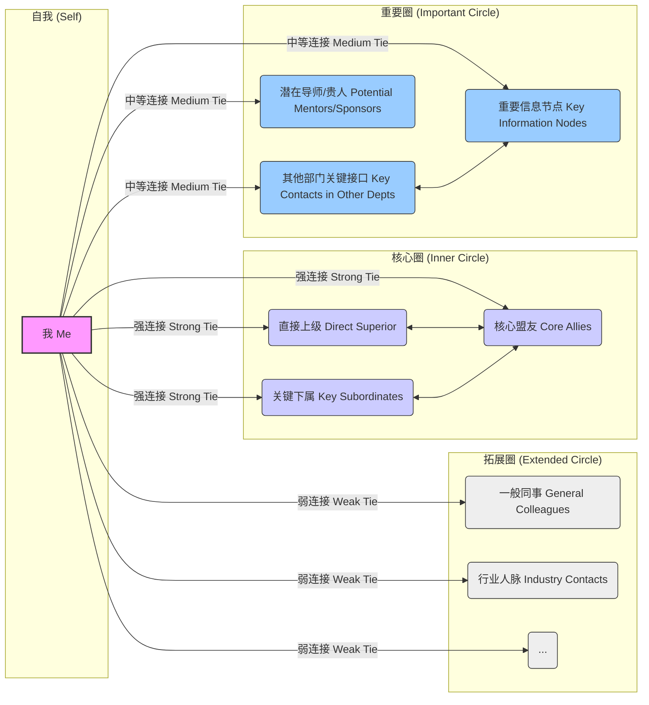

# 第四章："黑"字诀——驾驭博弈的策略 (Chapter 4: The "Black" Principle - Strategies for Navigating the Game)

**引言**

如果说第三章的"厚"字诀侧重于锻造坚韧内心、增强防御力和承受力，那么本章的"黑"字诀则聚焦于**主动出击、影响环境、驾驭博弈**的策略与技巧。这里的"黑"，并非指阴险毒辣、不择手段，而是强调在认清现实复杂性的基础上，运用智慧和策略，**主动塑造有利态势，有效影响他人决策，从而在竞争与合作中占据主动，达成目标**。

"厚"是内守，"黑"是外攻。"厚"是根基，"黑"是用法。缺乏"厚"的根基，"黑"的策略容易走偏，变得脆弱易折；而没有"黑"的策略，空有"厚"的内心，则可能陷入被动，难以在激烈的职场竞争中有效作为。

本章将深入探讨"黑"字诀的五大核心策略：如何通过**信息控制**构建不对称优势；如何运用**向上管理**影响关键决策者；如何通过**横向联合**构建可靠同盟；如何实施**向下领导**建立稳固团队；以及如何进行**印象管理**塑造有利形象。掌握这些策略，将使你在职场博弈中更加游刃有余，变被动为主动，有效驾驭复杂的竞争环境。

---

## 4.1 信息控制：不对称优势的构建 (Information Control: Building Asymmetric Advantage)

在现代职场，**信息就是权力 (Information is Power)**。谁掌握了更准确、更及时、更关键的信息，谁就拥有了决策的主动权和博弈的优势。信息控制的核心在于**构建信息不对称 (Information Asymmetry)**，即让自己比对手或合作方掌握更多、更关键的信息，从而在判断、谈判和行动中占据有利地位。"黑"字诀中的信息控制并非鼓励欺骗，而是强调信息管理的战略价值。

### 信息的收集、筛选与利用 (Collection, Filtering, and Utilization of Information)
*   **多元化收集渠道**：建立广泛的信息来源网络。包括：
    *   *正式渠道*：公司公告、邮件、报告、会议纪要、公开数据等。
    *   *非正式渠道*：茶水间的闲聊、同事间的私下交流、行业内的社交活动、值得信赖的线人、观察关键人物的言行举止等。
    *   *主动探寻*：针对特定目标，有意识地通过提问、调研、查阅资料等方式获取信息。
*   **关键信息筛选**：信息爆炸时代，需要具备筛选能力。关注那些与你的目标、利益、风险相关的**关键信息 (Critical Information)**。例如：影响决策的关键数据、竞争对手的动向、上级的真实意图、组织架构或人事变动的传闻、潜在的机会或威胁等。学会过滤噪音和冗余信息。
*   **深度分析与利用**：收集到的信息需要经过分析、解读才能转化为价值。
    *   *关联分析*：将不同来源的信息进行关联，发现其内在联系和潜在含义。
    *   *趋势判断*：从零散信息中识别趋势和模式。
    *   *价值评估*：判断信息的时效性、可靠性和对决策的影响程度。
    *   **信息验证与交叉核对 (Verification and Cross-Checking)**：尤其对于来自非正式渠道或带有明显立场来源的信息，必须进行多方验证和交叉核对，警惕被虚假信息、片面之词或他人刻意释放的"烟幕弹"所误导。缺乏验证的信息不仅无用，甚至可能带来灾难性后果。
    *   *策略指导*：利用分析后的信息指导你的行动策略，例如调整谈判方案、选择合适的沟通时机、预判风险并提前应对。

### 制造信息差，掌握主动权 (Creating Information Gaps to Seize Initiative)
*   **比对手知道更多**：通过比竞争对手更广泛、更深入的信息收集和分析，了解他们所不了解的情况。例如，在项目竞争中，了解对手方案的潜在缺陷或资源限制。
*   **比合作方理解更深**：在合作谈判中，了解合作方的真实需求、底线、内部制约因素等，能够让你在谈判中占据更有利的位置。
*   **预见性**：基于对信息的深刻理解，比他人更早地预见到未来的趋势、机会或风险，从而提前布局，掌握先机。

### 保密与选择性披露 (Confidentiality and Selective Disclosure)
*   **核心信息保密**：对于关乎自身核心利益、战略意图或可能被对手利用的关键信息，要严格保密。管住自己的嘴，谨慎选择沟通对象和场合。
*   **策略性信息传递**：并非所有信息都要保密。有时，**选择性地、在合适的时机向特定对象披露某些信息**，可以达到特定目的：
    *   *建立信任*：分享一些非核心但有价值的信息给盟友，以示诚意。
    *   *引导舆论*：将某些信息（可能是经过包装的）透露给关键传播节点，以影响群体认知。
    *   *试探反应*：透露部分计划，观察相关方的反应，以调整后续策略。
    *   *施加压力*：暗示你掌握某些对方不利的信息，以促使其让步或合作（需极为谨慎，避免变成要挟）。
*   **控制信息流速与范围**：不仅要控制披露什么，还要控制何时披露、向谁披露、披露到什么程度。

信息控制是"黑"字诀的基础功夫。它要求你像一个情报分析师一样，时刻保持对信息的敏感度，建立高效的信息网络，进行深入的分析判断，并策略性地管理信息的流动。掌握信息优势，你就掌握了博弈的主动权。

---

## 4.2 向上管理：构建与上级的战略伙伴关系 (Upward Management: Building a Strategic Partnership with Your Superiors)

**重塑认知：从"管理"到"伙伴" (Reshaping Perception: From "Managing" to "Partnering")**

传统的"向上管理"概念，容易让人联想到单向影响甚至操控。然而，更高阶的"黑"字诀视角，应将其视为一种**主动构建、积极维护与上级之间高效、互信、共赢的战略性合作伙伴关系**的艺术。这并非阿谀奉承，也不是单纯地"搞定"老板，而是基于对组织动力学和人性需求的深刻理解，通过专业贡献、有效沟通和精准协作，**赋能上级成功，进而实现自身价值最大化和职业发展加速**。

在层级结构中，上级掌握着关键资源（信息、预算、机会、评价权、晋升推荐等）的分配。与其被动接受管理，不如主动塑造关系。成功的向上管理，能够让你获得必要的支持，规避潜在的风险，使你的才华和贡献得到应有的认可，最终形成**"你成就上级，上级成就你"**的良性循环。其"黑"在于洞察本质、策略布局；其"厚"在于价值贡献、赢得信任。

### 4.2.1 深度洞察：全面理解你的上级 (Deep Insight: Comprehensively Understanding Your Superior)

有效合作的前提是深刻理解。这不仅包括其工作层面，更涉及其个人层面和在组织中的生态位。

*   **目标与压力 (Goals and Pressures)**：
    *   *显性目标*：他/她的 KPI、负责的关键项目、部门的核心任务是什么？
    *   *隐性目标*：他/她个人的职业抱负、希望在组织中达成的声望或影响力是什么？
    *   *压力来源*：来自更高层、同级竞争、下属挑战、市场变化、家庭因素等的压力有哪些？理解压力才能提供有效支持。
*   **权力与处境 (Power and Situation)**：
    *   *权力来源*：职位权力、专业权力、人格魅力、信息优势、人脉网络？了解其权力基础，才能判断其影响力的边界。
    *   *政治生态*：他/她在组织权力结构中的位置？与关键人物的关系（盟友、对手）？面临的政治风险或机遇？这决定了你的建议和行动需要考虑的边界。
    *   *决策风格*：数据驱动？直觉导向？民主协商？独断专行？快速决策还是深思熟虑？
*   **工作风格与偏好 (Work Style and Preferences)**：
    *   *沟通偏好*：喜欢口头还是书面？正式汇报还是非正式沟通？喜欢细节还是宏观？主动汇报还是被动询问？信息密度偏好？
    *   *管理风格*：微观管理？充分授权？结果导向？过程导向？
    *   *信任模式*：倾向于信任数据、逻辑，还是信任人本身？建立信任的触发点是什么？
    *   *"雷区"与禁忌*：有哪些话题、行为或失误是他/她特别反感或忌讳的？
*   **期望与需求 (Expectations and Needs)**：
    *   *对你的角色期望*：希望你是纯粹的执行者、问题解决者，还是战略参谋？
    *   *未满足的需求*：他/她在工作上可能有哪些尚未被满足的需求（如需要更可靠的数据支持、更主动的问题预警、更能独当一面的下属）？

**获取信息的途径**：公开信息（报告、会议）、直接沟通（提问、汇报）、侧面了解（可信赖的同事、前任下属）、细致观察（言行、决策模式、对不同人的态度）。

### 4.2.2 战略沟通：精准传递价值与影响 (Strategic Communication: Precisely Conveying Value and Influence)

沟通是向上管理的核心载体。有效的沟通需要精心设计。

*   **选择合适的时机 (Choosing the Right Timing)**：
    *   *汇报成果*：选择上级心情较好、时间相对充裕的时候。
    *   *提出建议/资源请求*：最好在上级关注相关问题，或在你刚取得某项成绩，信任度较高时提出。避免在其压力巨大或处理紧急事务时增加负担。
    *   *预警风险*：第一时间汇报，但要准备好初步的应对方案。
*   **结构化内容与向上汇报框架 (Structured Content and Upward Reporting Frameworks)**：
    *   *金字塔原理*：先说结论/核心观点，再展开论据和细节。
    *   *PREP 模式*：观点 (Point) - 理由 (Reason) - 案例 (Example) - 重申观点 (Point)。
    *   *电梯演讲 (Elevator Pitch)*：能在短时间内（如 30 秒）清晰、简洁、有说服力地阐述你的想法或请求。
    *   *向上汇报框架*：例如，"老板，关于 XX 问题/机会，我的观察/分析是 A，建议采取行动 B，因为 C，预期效果 D，潜在风险 E，需要您的支持 F。"
*   **"翻译"你的语言：用上级的视角和语言沟通 (Translating Your Language: Communicating from the Superior's Perspective)**：
    *   *关注其关注点*：将你的工作成果、建议与其目标、KPI、压力点挂钩。说明你的工作如何帮助他/她成功。例如，不说"我优化了代码效率"，而说"通过优化代码，项目交付时间预计缩短 X%，有助于您达成季度目标，并降低了服务器成本 Y%。"
    *   *使用其熟悉的术语和思维框架*。
    *   *量化价值*：尽可能用数据来展现你的贡献和建议的价值。
*   **管理期望：主动设定与调整预期 (Managing Expectations: Proactively Setting and Adjusting)**：
    *   *事前沟通*：在接受任务时，确认目标、标准、资源和时间表。如有异议或潜在困难，提前提出。
    *   *过程中同步*：对于长期或复杂任务，主动、定期地同步进展、阶段性成果和遇到的问题，避免最后出现"意外"。
    *   *预期调整*：当情况发生变化，可能无法达成原定目标时，及时沟通，解释原因，提出调整方案，重新设定合理的预期。
*   **选择合适的沟通渠道 (Choosing the Right Channel)**：
    *   *正式汇报/决策*：会议、正式邮件。
    *   *进展同步/信息分享*：即时通讯工具、非正式邮件、简短口头沟通。
    *   *敏感问题/寻求建议*：最好选择一对一的私下沟通。
*   **向上反馈的艺术 (The Art of Upward Feedback)**：
    *   *聚焦行为和事实，而非个人评价*。
    *   *提供具体、可行的建议*。
    *   *选择合适的时机和私密场合*。
    *   *表达建设性意图*：强调是为了帮助团队/他/她更好地达成目标。
    *   *注意频率和方式*：过于频繁或方式不当的反馈可能适得其反。

### 4.2.3 主动支持：成为上级不可或缺的臂膀 (Proactive Support: Becoming an Indispensable Arm for Your Superior)

超越被动执行，主动为上级分忧解难，是建立深度信任的关键。

*   **提供解决方案，而非问题 (Providing Solutions, Not Just Problems)**：
    *   *带着方案敲门*：遇到问题，先思考 1-3 个解决方案，分析利弊，给出你的倾向性建议。
    *   *展现担当与能力*：表明你愿意负责解决，并有能力推动。
    *   *节省上级时间精力*：体现你的价值。
*   **预期管理与风险预警 (Anticipation and Risk Warning)**：
    *   *想在上级前面*：基于对业务和环境的理解，预判上级可能关心的问题、潜在的风险或机会，并提前准备。
    *   *主动预警*：发现问题苗头或潜在风险，及时汇报，并附带应对预案。
    *   *信息过滤与提炼*：帮助上级从繁杂信息中筛选、提炼关键要点。
*   **补齐短板，放大优势 (Complementing Weaknesses, Amplifying Strengths)**：
    *   *识别上级短板*：观察上级在哪些方面（如细节管理、数据分析、公众演讲）相对不擅长或精力不足，在这些方面主动提供支持，补其不足。
    *   *放大其优势*：了解上级的核心优势和亮点，在工作中配合他/她，使其优势得到更好发挥，成就其业绩。
*   *让上级"看起来更好" (Making Your Superior Look Good)*：
    *   *向上归功*：在合适的场合，将团队或个人的部分功劳向上归因于上级的指导和支持（注意真诚和适度）。
    *   *提供"弹药"*：为上级向上汇报或在重要场合发言提供高质量的数据、材料和观点支撑。
    *   *维护其权威*：在公开场合支持上级的决策，维护其形象。私下有异议可通过合适渠道沟通。

### 4.2.4 建立信任与可持续伙伴关系 (Building Trust and a Sustainable Partnership)

信任是向上管理的核心资产，需要长期、持续地投入和维护。

*   **可靠性与一致性 (Reliability and Consistency)**：
    *   *言出必行，使命必达*：稳定、高质量地完成承诺的任务，成为最靠谱的人。
    *   *保持专业水准*：持续学习，提升能力，确保你的专业判断值得信赖。
*   **透明与真诚 (Transparency and Authenticity)**：
    *   *主动汇报进展与风险*：让上级掌控信息，避免"意外"。
    *   *真诚沟通*：即使带来坏消息或表达不同意见，也要基于事实，态度真诚。过度包装或隐藏关键信息会侵蚀信任。
*   **超越期望的关键时刻 (Exceeding Expectations at Critical Moments)**：
    *   在关键项目、危机处理或上级急需支持时，挺身而出，做出超预期的贡献，能极大提升信任度。
*   **忠诚与支持 (Loyalty and Support)**：
    *   *职业忠诚*：在组织规则和职业道德框架内，忠于职守，支持上级和团队的目标。
    *   *困难时期的支持*：在上级面临压力或挑战时，展现支持和担当。
*   **界限与独立性 (Boundaries and Independence)**：
    *   *保持专业距离*：即使关系融洽，也要保持适当的职业界限，避免过度卷入私人事务或形成不健康的依附关系。
    *   *坚持原则*：在涉及底线、法规或核心职业道德问题时，要敢于坚持原则，即使可能面临压力。长远看，有原则的人更值得信赖。
    *   *培养"被依赖"，而非"依赖"*：目标是成为上级在专业上可以依赖的伙伴，而不是在情感或生存上完全依赖上级。

### 4.2.5 适应性策略：管理不同类型的上级 (Adaptive Strategies: Managing Different Types of Superiors)

没有放之四海而皆准的向上管理方法。需要根据上级的具体类型调整策略。

*   **微观管理型 (Micromanager)**：
    *   *策略*：频繁、主动、详细地汇报进展；提前沟通工作计划并寻求确认；在细节上做到无可挑剔；争取在非核心领域获得授权空间。
*   **授权放任型 (Delegator/Laissez-faire)**：
    *   *策略*：主动承担责任，展现领导力；定期汇报关键成果和潜在风险，确保其了解大局；主动寻求反馈和指导，避免方向偏离。
*   **结果导向型 (Results-Driven)**：
    *   *策略*：聚焦目标达成，用数据和成果说话；沟通简洁高效，直奔主题；主动汇报进展和可能影响结果的因素。
*   **关系导向型 (Relationship-Oriented)**：
    *   *策略*：注重建立良好的人际关系和信任；加强非正式沟通；表达对团队和个人的关怀；在贡献价值的同时展现合作态度。
*   **政治导向型 (Politically Astute)**：
    *   *策略*：理解其政治目标和顾虑；沟通时注意措辞和潜在影响；在提供支持时考虑政治含义；保持信息灵通，避免卷入不利的派系斗争。

### 4.2.6 拓展视野：管理与 N+2 的关系 (Expanding Horizons: Managing the Relationship with N+2)

向上管理不仅限于你的直接上级 (N+1)。在现代复杂的组织结构中，**策略性地管理与上级的上级 (N+2) 甚至更高层领导的关系，是突破职业瓶颈、获得更广阔视野和潜在赞助 (Sponsorship) 的关键一步**。这并非鼓励越级汇报或破坏层级结构，而是在尊重规则的前提下，运用智慧建立积极联系，提升自身在高层视野中的可见度和价值认知。

*   **为何重要？(Why Does It Matter?)**
    *   *获取更高视角*：N+2 通常掌握更宏观的战略方向、组织动态和未来规划信息。
    *   *影响 N+1 的评价*：N+2 的看法往往会影响对 N+1 的评价，进而间接影响对你的评价和资源分配。
    *   *潜在的赞助人*：N+2 可能成为你职业发展中的关键赞助人 (Sponsor)，在你争取晋升或关键机会时提供决定性支持。
    *   *未来直接上级*：组织架构调整频繁，N+2 有可能在未来成为你的直接上级。
    *   *风险对冲*：与 N+2 建立良好关系，可以在 N+1 关系出现问题时，提供一定的缓冲或备选路径（需极为谨慎）。
*   **核心原则：尊重层级，借力 N+1 (Core Principle: Respect Hierarchy, Leverage N+1)**
    *   *主要通过 N+1*：管理与 N+2 关系的最佳途径通常是**通过你的 N+1**。确保你的工作能支持 N+1 的目标，并鼓励 N+1 将你的优秀成果向上汇报。
    *   *让 N+1 知情*：当你因工作需要（如项目汇报、跨级会议）直接与 N+2 互动时，务必**提前或及时告知 N+1**，并与其对齐沟通口径。避免让 N+1 感到被绕过或意外。
    *   *展现协同价值*：在与 N+2 互动时，强调你与 N+1 的良好合作，以及你们团队对 N+2 目标的共同贡献。
*   **抓住直接互动的契机 (Seizing Opportunities for Direct Interaction)**
    *   *正式场合*：如项目汇报会、跨部门会议、公司活动等。这是展示专业能力和战略思维的良机。
    *   *非正式场合*：如茶水间偶遇、公司聚餐、走廊交流等。简短、积极、专业的互动也能留下良好印象。
    *   *向上汇报的准备*：若有机会向 N+2 汇报，准备需更加充分：
        *   **高度凝练**：聚焦核心成果、关键数据和战略意义，避免陷入执行细节。
        *   **对齐 N+2 视角**：思考 N+2 最关心什么？你的工作如何契合他/她的战略重点？
        *   **展现大局观**：不仅仅谈论你的工作，还要展现你对部门、公司整体目标的理解。
*   **提升高层可见度 (Increasing Visibility at Higher Levels)**
    *   *交付卓越成果*：在对 N+2 具有战略意义或高可见度的项目上做出突出贡献。
    *   *间接展示*：通过 N+1 的汇报、内部通讯、项目成果展示等方式，让你的名字和贡献被 N+2 了解。
    *   *建设性参与*：在公司范围内的讨论、倡议或跨部门项目中，发出专业、有建设性的声音。
*   **沟通注意事项 (Communication Considerations)**
    *   *尊重与谦逊*：保持对 N+2 的尊重，即使在非正式场合也要注意分寸。
    *   *积极倾听*：利用互动机会，理解 N+2 的思路、关注点和期望。
    *   *简洁有力*：珍惜 N+2 的时间，沟通要点明确，表达清晰。
    *   **绝对避免**：
        *   *越级抱怨 N+1*：这是职场大忌，会让你在 N+1 和 N+2 两边都失去信任。
        *   *传递不实信息或搬弄是非*。
        *   *过度表现，抢 N+1 的风头*。
*   **长期视角：建立信任而非功利 (Long-Term Perspective: Building Trust, Not Just Utility)**
    *   与 N+2 的关系管理是一个长期过程，目标是建立基于专业能力和可靠性的信任，而非短暂的功利性利用。
    *   持续贡献价值，保持积极专业的形象，是赢得高层认可的根本。

管理与 N+2 的关系是一项精细的艺术，其"黑"在于洞察高层需求、策略性地选择时机和方式展现价值；其"厚"在于尊重规则、协同 N+1、并以持续的专业贡献和可靠性赢得长远信任。

### 4.2.7 处理困难局面：冲突、批评与不公 (Handling Difficult Situations: Conflicts, Criticism, and Unfairness)

向上管理并非总是一帆风顺。

*   **处理与上级的冲突**：
    *   *冷静分析*：区分是基于事实的分歧，还是情绪或误解。
    *   *选择私下沟通*：避免公开对抗。
    *   *聚焦问题本身，而非人*。
    *   *倾听对方观点，表达理解*。
    *   *寻找共同目标和双赢方案*。
    *   *必要时寻求第三方（如 HR 或更高层）介入（需谨慎评估风险）。*
*   **应对批评**：
    *   *控制情绪，保持开放心态*。
    *   *区分建设性批评与非理性指责*。
    *   *对于建设性批评，表示感谢，确认理解，如有必要澄清事实，并说明改进计划*。
    *   *对于非理性指责，冷静应对，避免争执升级，必要时记录事实*。
*   **面对不公待遇**：
    *   *收集证据，理性分析*。
    *   *评估风险与收益，决定是否申诉*。
    *   *选择合适的渠道和方式进行沟通*。
    *   *考虑最坏情况，准备备选方案*。

**结论：** 向上管理是一项需要持续修炼的综合能力。它融合了敏锐的洞察力、结构化的思维、精准的沟通技巧、强大的执行力和高度的情商。掌握这门艺术，将极大提升你在组织中的生存能力和发展潜力，让你在复杂的职场博弈中，不仅能"活下来"，更能"活得好"，最终实现与上级的共赢。

---

## 4.3 横向联合：构建可靠的同盟 (Horizontal Alliances: Building Reliable Coalitions)

在现代组织中，单打独斗越来越难成功。跨部门协作、资源共享、信息互通是常态。**横向联合 (Horizontal Alliances)**，即与平级同事、其他部门的关键人物建立稳固的合作关系或同盟，是拓展影响力、获取资源、推动复杂项目、应对共同挑战的重要策略。"黑"字诀的横向联合，强调基于价值交换，识别关键节点，并运用智慧维护关系，构建可靠的"统一战线"。

### 价值交换原则：你能提供什么？(Principle of Value Exchange: What Can You Offer?)
*   **互利是基础**：横向关系本质上是一种合作关系，其基础是**互惠互利 (Mutual Benefit)**。在寻求他人帮助或建立联盟之前，首先要思考：你能为对方提供什么价值？
*   **识别你的价值点**：你的价值可能在于：
    *   *专业知识或技能*：你能提供的独特专业建议或技术支持。
    *   *信息资源*：你掌握的对方需要的信息或渠道。
    *   *人脉资源*：你能帮助对方连接的关键人物。
    *   *协作支持*：在对方需要跨部门协作时提供便利或支持。
    *   *政治支持*：在某些决策或博弈中提供支持性意见或力量。
    *   *情感价值*：成为一个值得信赖、能提供情绪支持的伙伴。
*   **主动付出，建立信用**：不要等到需要帮助时才去联系。平时主动向潜在盟友提供力所能及的帮助，分享有价值的信息，建立"人情账户"和信任基础。

### 识别潜在盟友与敌人 (Identifying Potential Allies and Adversaries)
*   **利益相关者分析**：对于你的目标或项目，分析哪些部门或个人是关键的利益相关者？他们的立场是支持、反对还是中立？
*   **寻找共同利益**：识别那些与你有共同目标、共同挑战或共同"敌人"的人。共同的利益是建立联盟最稳固的基础。
*   **观察过往行为**：注意观察他人在类似情境下的行为模式。谁是可靠的合作者？谁习惯背后捅刀？谁是墙头草？
*   **识别关键节点**：找到那些在信息流、资源流或决策流程中占据关键位置的人物（可能职位不高，但影响力大），与他们建立良好关系往往事半功倍。
*   **动态评估**：盟友和敌人的关系并非一成不变，会随着环境和利益的变化而转化。需要持续观察和评估。

### 维护关系的艺术：距离与分寸 (The Art of Maintaining Relationships: Distance and Propriety)
*   **保持专业距离**：职场关系首先是工作关系。即使与盟友私交不错，也要保持适当的专业距离，避免过度卷入私人生活或形成可能引人非议的"小团体"。
*   **沟通的艺术**：
    *   *尊重与倾听*：尊重对方的专业意见和立场，耐心倾听。
    *   *清晰与坦诚*：在合作中，就目标、责任、利益分配等进行清晰沟通，必要时坦诚表达自己的顾虑或底线。
    *   *求同存异*：聚焦共同目标，允许在非原则问题上存在分歧。
*   **信守承诺**：答应盟友的事情一定要做到，维护自己的信誉。
*   **利益平衡**：在合作中，要关注利益分配的相对公平，避免长期单方面受益，导致关系失衡。
*   **避免过度依赖**：不要将所有希望寄托在某个盟友身上。保持独立性，构建多元化的关系网络。
*   **处理冲突**：当与盟友产生分歧或冲突时，优先选择私下、坦诚沟通解决。避免公开化、扩大化。
*   **管理期望与边界 (Managing Expectations and Boundaries)**：在建立联盟时，就要对合作范围、各自的责任、利益分配以及关系的界限有相对清晰的沟通和共识，避免日后因期望不匹配或边界模糊而产生矛盾。
*   **优雅地退出 (Graceful Exit)**：当联盟的目标达成、环境变化或内部出现不可调和的矛盾时，需要思考如何优雅地退出或调整关系，尽量减少负面影响，避免将盟友变成敌人。

### Mermaid 图：职场人脉网络构建模型 (Mermaid Diagram: Workplace Network Building Model)

*   *说明*：此图仅为示意。你需要识别自己网络中的具体人物，并评估关系的强弱（强连接/中等连接/弱连接）和性质（支持/中立/潜在对抗）。关键在于有意识地构建和维护一个多元化、有价值的人脉网络，特别是核心圈和重要圈的关系。

横向联合是扩大个体影响力的杠杆。其"厚"在于真诚合作、信守承诺；其"黑"在于洞察利益、精准识别、策略维护。一个强大的横向联盟网络，能让你在组织中获得更广阔的行动空间和更强的抗风险能力。

---

## 4.4 向下领导：恩威并施的艺术 (Downward Leadership: The Art of Balancing Kindness and Authority)

对于管理者而言，**向下领导 (Downward Leadership)**，即有效管理和激励下属，是实现团队目标、巩固自身权力的关键。仅仅依靠职位赋予的法定权力发号施令，往往效果不佳，甚至可能导致离心离德。"黑"字诀的向下领导，并非指严苛压榨，而是强调**恩威并施、刚柔相济**的艺术，既要建立规则、明确要求（"威"），也要关怀激励、凝聚人心（"恩"），从而打造一支有战斗力、有凝聚力、且忠于领导的核心团队。

### 授权与控制的平衡 (Balancing Delegation and Control)
*   **有效授权 (Effective Delegation)**：
    *   *明确任务与目标*：清晰地向下属传达任务内容、期望结果、时间节点和可用资源。
    *   *匹配能力与意愿*：将任务分配给具备相应能力和积极性的下属。
    *   *给予自主空间*：在明确目标和底线的前提下，给予下属一定的自主决策权和执行空间，激发其主动性和创造力。
    *   *授权不是甩锅*：领导者对授权出去的任务结果仍负最终责任。
*   **必要控制 (Necessary Control)**：
    *   *设定检查节点*：对于重要或复杂任务，设定关键的检查节点，及时了解进展，发现问题并提供指导。
    *   *建立反馈机制*：鼓励下属在遇到困难时及时反馈，提供必要的支持和资源。
    *   *风险管理*：对于风险较高的任务，需要更密切的监控和指导。
    *   *结果导向*：控制的重点应放在最终结果和关键过程节点上，避免过度干预执行细节。
*   **平衡的艺术**：过度控制会扼杀下属积极性，导致领导者自己不堪重负；过度放任则可能导致失控和目标偏离。需要根据任务性质、下属能力和成熟度，动态调整授权与控制的平衡点。
*   **差异化管理 (Differentiated Management)**：认识到不同下属的能力、性格、动机和发展阶段各不相同，需要采取差异化的管理方式。对高潜力、高意愿的下属多授权、多赋能；对能力不足或意愿不强的下属则需要更多指导、监督和规则约束。避免"一刀切"。

### 建立规则，明确奖惩 (Establishing Rules and Clarifying Rewards/Punishments)
*   **清晰的游戏规则**：建立明确、公平、透明的团队工作规则、绩效标准和行为规范。让每个人都知道什么是被鼓励的，什么是被禁止的，以及违反规则的后果。
*   **奖惩分明且及时 ("威")**：
    *   *奖励先进*：对于表现出色、贡献突出的下属，要及时给予公开表扬、物质奖励、晋升机会或其他形式的认可。奖励要与其贡献相匹配。
    *   *惩戒违规*：对于违反规则、绩效不达标或行为不当的下属，要依据规则进行批评、警告、处罚甚至淘汰。惩罚要公正、有据，对事不对人。拖延或姑息只会破坏规则的严肃性。
*   **过程公平**：确保奖惩的依据（如绩效评估）和程序是公平、公正、公开的，能够得到大多数团队成员的认可。
*   **动态调整 (\"黑\")**：核心团队也需要动态管理。对于那些成长停滞、不再符合要求或忠诚度出现问题的核心成员，要果断进行调整。
*   **内部感知管理 (Managing Internal Perception)**：作为领导者，你在团队内部的形象和下属对你的看法同样重要。需要注意言行一致，公平公正（或至少让多数人感知到公平），并适度展现关怀，以建立威信和凝聚力。避免在团队内部制造不必要的猜忌或对立。

### 培养心腹与嫡系团队 (Cultivating Confidants and a Loyal Core Team)
*   **识别潜力与忠诚 ("恩"与"黑")**：在团队中，有意识地识别那些能力强、潜力大、价值观契合且对你表现出忠诚度的核心成员。
*   **重点培养与倾斜资源 ("恩")**：对于这些核心成员，投入更多的时间和精力进行指导和培养，给予他们更多的锻炼机会和重要的任务，在资源分配上适度倾斜，帮助他们快速成长。
*   **建立信任与私交 ("恩")**：在工作之外，可以与核心成员建立更深层次的信任关系和适度的私人交情，增强情感连接和凝聚力。但要注意保持分寸，避免形成排他的小团体。
*   **委以重任与分享权力 ("恩")**：逐步将一些重要职责或决策权授予值得信赖的核心成员，让他们感受到被重视和信任，成为你真正的左膀右臂。
*   **传递期望与价值观**：向核心团队清晰地传递你的期望、目标和价值观，使他们与你同心同德。
*   **动态调整 ("黑")**：核心团队也需要动态管理。对于那些成长停滞、不再符合要求或忠诚度出现问题的核心成员，要果断进行调整。

向下领导是一门复杂的艺术，需要在任务导向与人本关怀、严格要求与激励赋能之间找到平衡点。"威"在于立规矩、明奖惩、保底线；"恩"在于育人才、给机会、聚人心。"恩威并施"才能打造一支既有纪律性又有战斗力的高绩效团队，从而巩固你的领导地位和影响力。

---

## 4.5 印象管理：塑造有利的公众形象 (Impression Management: Shaping a Favorable Public Image)

在职场中，你给他人留下的**印象 (Impression)**，往往与你的实际能力同等重要，甚至更重要。**印象管理 (Impression Management)** 指的是有意识地、策略性地管理和影响他人对你的看法和评价，塑造一个积极、专业、可信赖且符合你目标的公众形象。"黑"字诀的印象管理，并非鼓励虚伪或欺骗，而是强调通过有效的沟通、行为和符号，**主动引导他人对你的认知，从而获得更多的信任、支持和机会**。

### 专业形象与个人品牌的打造 (Building a Professional Image and Personal Brand)
*   **明确品牌定位**：你希望别人如何定义你？是技术专家？是高效执行者？是创新引领者？是值得信赖的伙伴？还是富有潜力的领导者？首先要明确你想要打造的核心个人品牌。
*   **言行一致性**：你的言语、行为、着装、办公环境等，都应与你想要塑造的品牌形象保持一致。例如，想要打造专业严谨的形象，就要避免言辞轻浮、着装随意。
*   **展现专业能力**：通过高质量的工作成果、专业的发言、深入的见解等，持续展现你的核心专业能力。这是形象的基石。
*   **沟通风格**：注意你的沟通方式。是自信清晰，还是犹豫含糊？是积极倾听，还是自我中心？选择与你品牌定位相符的沟通风格。
*   **在线形象管理**：在社交媒体、公司内网等平台的发言和互动，也要符合你的专业形象。

### 讲故事的能力：包装你的成就 (Storytelling Ability: Packaging Your Achievements)
*   **将事实转化为故事**：单纯罗列数据和事实可能枯燥乏味。学会将你的关键经历和成就，用引人入胜的故事形式讲述出来。一个好的故事更容易被记住和传播。
*   **突出挑战与解决方案**：在故事中，强调你面临的挑战、思考的过程、采取的关键行动以及最终取得的成果和价值。这能更好地展现你的能力和韧性。
*   **融入情感与价值观**：在故事中适度融入积极的情感（如热情、决心）和符合主流的价值观（如责任、合作），更能引起共鸣。
*   **适应听众与场合**：根据不同的听众（上级、同事、客户）和场合（汇报、分享、面试），调整故事的侧重点和讲述方式。
*   **"STAR"原则**：可以运用 STAR 原则（Situation-情境, Task-任务, Action-行动, Result-结果）来构建你的故事框架。
*   **真诚与可信度 (Authenticity and Credibility)**：虽然印象管理是策略性的，但完全脱离真实的伪装是不可持续的，也容易被识破。最高明的印象管理是在真实的基础上，有选择地、有策略地突出你的优点和价值，并以真诚的态度进行沟通。长期的信任建立在可信度的基础上。

### 危机公关：应对负面信息 (Crisis Communication: Handling Negative Information)
*   **快速反应，但不冲动**：当出现关于你的负面信息或误解时，要及时了解情况，但避免在情绪激动时立即做出激烈反应。先冷静分析。
*   **判断信息性质与来源**：判断负面信息是事实、误解还是恶意中伤？来源是哪里？影响范围有多大？
*   **选择合适的应对策略**：
    *   *澄清误解*：如果是误解，选择合适的渠道（私下沟通或公开声明）进行澄清，提供事实依据。
    *   *承认错误（如果是事实且有必要）*：如果确实存在失误，在适当范围内勇于承认错误，表达歉意，并提出改进措施，展现担当。
    *   *控制信息传播*：对于恶意中伤或不实谣言，在必要时寻求上级或 HR 支持，通过官方渠道进行澄清或制止。避免陷入与造谣者的公开缠斗。
    *   *保持沉默（有时也是策略）*：对于一些无足轻重或无法证实的流言蜚语，有时保持沉默、让时间冲淡一切，也是一种选择。
*   **寻求支持**：在处理危机时，可以向信任的上级、导师或 HR 寻求建议和支持。
*   **化危为机**：处理得当的危机公关，有时反而能展现你的成熟、担当和应变能力，将危机转化为提升形象的机会。

印象管理是一项持续性的工作，贯穿于你职场生涯的方方面面。其"厚"在于真诚沟通、言行一致、勇于担当；其"黑"在于洞察人心、策略呈现、有效引导。通过精心的印象管理，你可以为自己营造一个更有利的外部环境，减少阻力，增加助力。

---

**第四章总结："黑"字诀的运用之道 (Chapter 4 Summary: The Way of Applying the "Black" Principle)**

本章深入探讨了"厚黑学"中"黑"字诀的内涵与实践，聚焦于在职场博弈中主动出击、影响环境、驾驭局面的五大核心策略。这里的"黑"并非阴险，而是指洞悉规则、运用策略、达成目标的智慧与能力。

1.  **信息控制 (Information Control)**：强调信息即权力，通过多元收集、精准筛选、深度利用信息，构建信息不对称优势，并运用保密与选择性披露的策略，掌握博弈的主动权。
2.  **向上管理 (Upward Management)**：阐述了主动影响上级的重要性，通过深刻理解上司需求与压力、提供解决方案、建立信任与依赖关系，获得更多支持与资源，实现与上级的共赢。
3.  **横向联合 (Horizontal Alliances)**：论述了构建可靠同盟的必要性，强调基于价值交换原则，精准识别潜在盟友与敌人，并运用距离和分寸的艺术维护关系，拓展组织内的影响力网络。
4.  **向下领导 (Downward Leadership)**：聚焦于管理者的核心职责，提倡恩威并施的艺术，通过平衡授权与控制、建立明确规则与奖惩机制、培养心腹与嫡系团队，打造高绩效、高凝聚力的团队。
5.  **印象管理 (Impression Management)**：揭示了公众形象的战略价值，指导如何通过打造专业形象与个人品牌、运用讲故事的能力包装成就、以及进行有效的危机公关，塑造有利的外部认知。

"黑"字诀的运用，是对个体策略思维、情商智慧和行动能力的综合考验。它要求实践者既要有洞察本质的眼力，也要有主动出击的勇气；既要懂得借力打力，也要善于团结协作；既要能精准影响他人，也要会巧妙塑造自我。

需要再次强调的是，"黑"字诀的运用必须以"厚"字诀（第三章）的内心修为为基础，并受到"内圣"（第九章）原则的约束。缺乏内心定力和原则底线的"黑"，极易滑向损人利己的权谋，最终难以持久。唯有将"厚"之内守与"黑"之外攻相结合，以原则为指引，以智慧为手段，才能真正驾驭职场博弈，实现可持续的成功。

---
（第四章完）