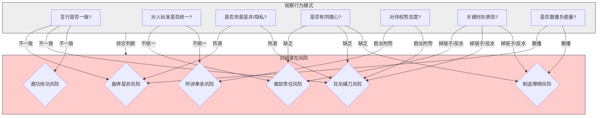

# 第五章：识别与应对"小人"

在探讨了人性的底层逻辑、组织的权力游戏以及"厚黑"心法之后，我们进入更具实战性的篇章。职场并非总是阳光普照，有时会遇到一些为了个人利益而不惜损害他人、搬弄是非、制造障碍的"小人"。他们是组织中的"负能量"，破坏团队信任，增加沟通成本，甚至可能对你的职业发展造成实质性伤害。

识别"小人"并非易事，他们往往善于伪装。而应对"小人"更需要智慧和策略，既要有效保护自己，避免被其所伤，又要尽可能避免将自己拖入无谓的争斗和内耗中。"明枪易躲，暗箭难防"，学会识别和应对"小人"，是职场生存的必备技能。本章将为你提供一套识别和应对"小人"的实用指南。

---

## 5.1 "小人"的类型与特征

"小人"并非一个严格的学术定义，而是对职场中一类行为模式的概括。了解其常见的类型和行为特征，有助于我们提高警惕，及早识别。

### 常见类型

1.  **搬弄是非型 (Gossip Monger/Troublemaker)**：
    *特征*：热衷于打探、传播小道消息、他人隐私或负面评价；喜欢在人前一套背后一套，挑拨离间，制造矛盾和误会。
    *动机*：通常源于嫉妒、缺乏安全感、渴望被关注或掌控信息带来的权力感。
2.  **推卸责任型 (Blame Shifter)**：
    *特征*：工作出现问题时，从不反思自身原因，总是第一时间寻找替罪羊，将责任推给他人；善于为自己辩解，大事化小，小事化了（针对自己的问题）。
    *动机*：害怕承担责任，维护自身完美形象，逃避惩罚。
3.  **背后捅刀型 (Backstabber)**：
    *特征*：表面和你关系不错，甚至称兄道弟，但在关键时刻（如晋升、资源分配）或在你背后，通过散布谣言、告密、窃取功劳等方式损害你的利益。
    *动机*：强烈的嫉妒心，渴望通过打压他人来抬高自己，获取不当利益。
4.  **邀功抢功型 (Credit Thief)**：
    *特征*：将团队或他人的功劳据为己有，在汇报工作或公开场合，刻意淡化或忽略他人的贡献，突出自己的作用。
    *动机*：强烈的表现欲，渴望获得认可和奖励，走捷径向上爬。
5.  **阿谀奉承型 (Sycophant/Flatterer)**：
    *特征*：过分地奉承、讨好上级或有权力的人，不顾客观事实；对上唯唯诺诺，对下颐指气使。
    *动机*：通过取悦上级来获取特殊照顾、资源倾斜或晋升机会。
6.  **制造障碍型 (Obstructionist)**：
    *特征*：对于他人的工作或项目，不主动配合，甚至暗中设置障碍、拖延进度；喜欢挑刺、否定，但提不出建设性意见。
    *动机*：嫉妒他人成功，或源于部门/个人利益冲突，通过阻碍他人来维护自身地位或利益。

这些类型并非完全独立，一个人可能同时具备多种"小人"特征。

### 行为特征识别

识别"小人"需要观察其一贯的行为模式，而非孤立事件：

*   **言行不一**：说一套做一套，承诺的事情不兑现。
*   **双重标准**：对自己和他人采用不同的标准。
*   **过度关注他人隐私/短处**：喜欢打听和议论别人的私事或不足。
*   **缺乏同理心**：对他人的困难或感受漠不关心，甚至幸灾乐祸。
*   **趋炎附势**：对有权有势的人格外热情，对失势或普通同事则态度冷淡。
*   **关键时刻掉链子/反水**：在需要支持或合作的关键时刻，突然改变立场或消失不见。
*   **散播负能量**：经常抱怨、指责，制造紧张或不信任的氛围。

### Mermaid 图："小人"行为模式识别图

**图解**：通过观察个体在多个维度（O1-O7）的行为模式，可以综合判断其潜在的"小人"风险类型（I1-I6）。例如，言行不一可能预示着搬弄是非、背后捅刀或邀功抢功的风险；缺乏同理心则可能与推卸责任、背后捅刀、制造障碍等行为相关联。需要注意的是，这只是辅助识别工具，不能仅凭一两次行为就给人贴标签，要结合长期观察和多方面信息进行判断。

---

## 5.2 防范策略：保持距离，减少交集

在识别出潜在的"小人"之后，最重要也是最有效的策略，往往不是直接对抗，而是**主动防范 (Prevention)**。如同对待病毒，最好的方式是增强自身免疫力，并尽量避免接触感染源。与"小人"打交道，核心的防范策略就是：**保持距离，减少交集，不给对方伤害你的机会**。

### 保持距离，减少交集

这并非要求你完全不与"小人"打交道（在职场中往往难以做到），而是要有意识地管理你们之间的互动频率、深度和方式。

*   **物理距离**：如果可能，尽量避免与"小人"在同一个项目组、办公室或有过多工作交集。但这往往不由自己决定。
*   **心理距离**：即使物理距离无法拉开，也要保持心理上的距离。
    *   **减少非必要互动**：将与"小人"的接触限制在纯粹的工作层面，避免私下闲聊、抱怨或分享个人信息。
    *   **保持警惕**：与其交往时，保持警惕心，留意对方的言行，不要轻易相信其表面的友善或承诺。
    *   **不主动分享过多信息**：特别是关于你的个人计划、想法、弱点、对其他人的评价等敏感信息，避免成为对方搬弄是非或背后捅刀的素材。
    *   **避免情感投入**：不要试图去改变"小人"，也不要对其抱有不切实际的期望，更不要投入过多的个人情感，否则容易受伤。将其视为需要 professionally 处理的"工作障碍"。
*   **公开场合互动为主**：尽量将与"小人"的必要沟通放在公开场合、有他人在场或有记录的情况下进行（如邮件沟通），减少私下密谈，避免被断章取义或歪曲事实。

保持距离的核心在于，减少对方了解你、影响你、抓住你把柄的机会。

### 不授人以柄，保护好个人信息

"小人"之所以能伤人，往往是因为抓住了你的某些"把柄"或利用了你的信息。因此，保护好自己，不轻易授人以柄，是防范的关键。

*   **言行谨慎**：
    *   **不在背后议论他人**：你说的话很可能被添油加醋地传到当事人耳中，成为别人攻击你的武器。管住嘴，不参与是非。
    *   **避免抱怨和负面情绪**：尤其不要向"小人"抱怨公司、上级或同事，这些都可能成为他日后告密的材料。
    *   **公开场合谨言慎行**：在会议、邮件等公开场合，发言要基于事实和逻辑，避免情绪化、攻击性或未经证实的言论。
    *   **信守承诺，遵守规则**：自己行得正，坐得端，不违反公司规定，不留下明显的错误或漏洞，让"小人"无机可乘。
*   **保护个人信息**：
    *   **隐私信息不外泄**：不要轻易透露自己的家庭情况、财务状况、健康问题、个人关系等隐私信息。
    *   **工作信息分级管理**：对于重要的工作计划、数据、客户信息等，要有保密意识，不轻易与不相关的人分享。
    *   **社交媒体谨慎使用**：避免在朋友圈、微博等社交媒体上发布过多关于工作、个人生活或情绪化抱怨的内容，这些都可能被别有用心的人利用。
    *   **电脑和文件安全**：注意保护好自己的电脑密码、文件资料，避免被他人窃取或窥视。

"害人之心不可有，防人之心不可无"。保护好自己，不给"小人"留下可乘之机，是最高明也最省力的防范之道。

### 重要沟通留痕存档

与"小人"打交道，或者在处理涉及潜在风险、责任界定不清的事情时，养成**重要沟通留痕存档 (Document Important Communications)** 的习惯至关重要。这可以在未来发生纠纷或被"甩锅"时，提供有力的证据保护自己。

*   **优先使用书面沟通**：对于重要的工作安排、任务分配、责任界定、承诺等，尽量使用邮件、内部通讯工具（如钉钉、企业微信）等可以留下记录的方式进行沟通。
*   **口头沟通后及时确认**：如果进行了重要的口头沟通或会议讨论，事后可以通过邮件或书面纪要的形式，将关键内容、达成的共识、分配的任务等进行总结和确认，并发送给相关方。例如："根据我们今天上午的讨论，现将主要结论和分工确认如下……"
*   **保存关键证据**：对于重要的邮件、聊天记录、会议纪要、工作文件等，要有意识地进行分类、存档和备份。
*   **记录关键节点和事件**：对于一些敏感项目或潜在冲突，可以简单记录关键时间节点、发生的事件、参与人员和主要结论，以备后续查证。

留痕存档的目的不是为了"算计"别人，而是为了在必要时能够清晰地还原事实，明确责任，保护自己的正当权益。尤其是在与有"前科"的"小人"打交道时，更要加强这方面的意识。

总而言之，防范"小人"的最佳策略是"敬而远之"，减少交集，不给其伤害你的机会。同时，管好自己的言行，保护好个人信息，重要沟通留痕存档，筑牢自身的"防火墙"。

---

## 5.3 反击策略：精准打击，一击制胜

虽然防范是上策，但有时"小人"的攻击已经突破了你的防线，对你的利益、声誉或职业发展造成了实质性损害。在这种情况下，一味退让可能被视为软弱可欺，反而会招致更进一步的侵害。此时，有策略、有节制的**反击 (Counterattack)** 就成为必要的选项。

反击的目的不是为了报复或泄愤，而是为了**制止侵害、挽回损失、维护自身权益，并对潜在的攻击者形成震慑**。反击要讲究策略，追求"精准打击，一击制胜"，避免陷入旷日持久、两败俱伤的缠斗。

### 借力打力，利用规则

直接与"小人"进行硬碰硬的冲突，往往不是明智之举，容易将自己拉低到与对方相同的水平，并可能违反职场规范。更高级的反击是**借力打力 (Leveraging External Forces)** 和**利用规则 (Using the Rules)**。

*   **借上级之力**：
    *   如果"小人"的行为损害了团队或部门利益，或者明显违反了上级的指示，可以将情况（附带证据）巧妙地汇报给上级，让上级出面处理。注意汇报方式，要客观陈述事实，分析影响，提出建议，而非简单告状。
    *   如果"小人"试图甩锅给你，可以将包含事实证据（如邮件记录、会议纪要）的说明呈现给上级，澄清事实，将责任归位。
*   **借规则/制度之力**：
    *   如果"小人"的行为明确违反了公司的规章制度（如泄露机密、严重失职、骚扰等），可以依据制度向人力资源部门或相关合规部门举报。
    *   利用正式的绩效评估、项目复盘等机制，客观地呈现"小人"的不当行为或绩效不佳之处（需要有事实依据）。
*   **借舆论/同盟之力**：
    *   在适当的时候，向信任的、有影响力的同事或盟友透露部分事实（注意方式和范围），争取他们的理解和支持，形成一定的舆论压力。
    *   与受到该"小人"侵害的其他受害者联合起来，共同向管理层或相关部门反映情况，增加说服力。

借力打力的核心在于，将矛盾从你与"小人"的个人冲突，转化为"小人"与组织规则、上级意图或集体利益的冲突，由更强的力量来制约他。

### 公开揭露 vs. 暗中处理

选择何种方式进行反击，需要根据具体情况、掌握的证据、对方的背景以及可能带来的后果进行权衡。

*   **公开揭露 (Public Exposure)**：
    *   *适用场景*：对方行为恶劣，证据确凿，且已对你或组织造成较大损害；需要警示他人；你有足够的实力或支持来承受公开对抗的后果。
    *   *方式*：在适当的会议上（如有议程支持）、通过正式的邮件或报告、向管理层或 HR 部门实名举报等。
    *   *优点*：震慑力强，能最大限度地澄清事实，争取广泛支持。
    *   *缺点*：撕破脸皮，关系彻底破裂，可能引发对方疯狂反扑，处理不当可能影响自身形象（被视为"好斗"）。风险较高。
*   **暗中处理 (Covert Handling)**：
    *   *适用场景*：证据不够充分或不宜公开；希望避免公开冲突，保留回旋余地；对方背景较强，公开对抗风险过大；只需制止其行为或挽回部分损失即可。
    *   *方式*：
        *   私下警告：掌握一定证据后，私下与对方沟通，点到为止，表明你已了解情况，要求其停止侵害，否则将采取进一步行动。
        *   信息制衡：掌握对方的一些把柄或不当行为的证据，但不立即使用，作为一种威慑，让其投鼠忌器。
        *   向上级侧面反映：不直接点名道姓，但通过汇报工作、分析问题等方式，巧妙地将对方的问题或负面影响传递给上级，引导上级注意。
        *   釜底抽薪：针对对方的核心利益或依赖的资源进行打击（需谨慎，确保合规合法），削弱其影响力。
    *   *优点*：风险相对较低，不易激化矛盾，给自己留有余地。
    *   *缺点*：效果可能不如公开揭露直接，耗费心力，如果对方不知收敛，可能需要采取更进一步措施。

选择公开还是暗中处理，没有绝对的优劣，关键在于**审时度势，选择最有利于达成目标且风险可控的方式**。

### 案例分析：与"小人"斗争的经典战役

*   **案例分析：与"小人"斗争的经典战役**

    *   **场景改编自《纸牌屋》**：下属 A 发现同事 B（邀功抢功型+背后捅刀型）经常将 A 团队的创意和成果包装成自己的功劳向上级汇报，并在背后散布关于 A 能力不足的谣言，试图取而代之。
    *   **A 的反击策略（多阶段）**：
        1.  **收集证据，保持冷静 (防范+准备)**：A 没有立即发作，而是开始有意识地收集证据，包括保留项目策划的原始邮件、会议记录、团队成员的证词、B 汇报材料与原始材料的对比等。同时，A 在与 B 的日常工作中保持职业态度，不露声色。
        2.  **向上管理，侧面提醒 (暗中处理)**：A 在一次与上级 C 的单独汇报中，展示了团队近期的详细工作进展和成果（包含原始创意记录），并"不经意"地提到："我们团队最近在 XX 方面有一些不错的想法，B 同事也很感兴趣，后续可能会借鉴到他的项目中去。" 这既展示了自身团队的贡献，也巧妙地提醒了上级 C 成果的真正来源，同时观察上级 C 的反应。
        3.  **横向联合，争取支持 (借力)**：A 与团队核心成员沟通，说明情况，稳定军心，并争取他们的支持。同时，A 向另一位与 B 有竞争关系、相对正直的同事 D 透露了部分情况，争取潜在的同盟。
        4.  **抓住时机，精准打击 (公开/半公开)**：当 B 再次试图剽窃一个重要项目的成果时，A 准备充分。在向上级 C 和相关高层汇报项目成果时，A 详细展示了项目的完整过程、团队成员的具体贡献（用数据和实例），并附上了清晰的原始记录和时间线。在 Q&A 环节，如果 B 试图邀功，A 可以用专业的、基于事实的方式进行回应， subtly 指出其理解的偏差或信息的滞后。或者，在更关键的时刻（如绩效评估、晋升评审），将整理好的证据链通过正式渠道提交给上级或 HR。
        5.  **控制影响，巩固成果**：反击成功后，A 并没有穷追猛打，而是将精力放回工作，用持续的业绩巩固自己的地位。同时，注意安抚团队，修复因 B 的行为造成的内部裂痕。

    这个案例展示了与"小人"斗争需要耐心、证据、策略和多方力量的结合。反击不是目的，维护自身正当权益、保障职业发展才是关键。精准打击，避免恋战，是厚黑学在应对"小人"时的重要原则。 