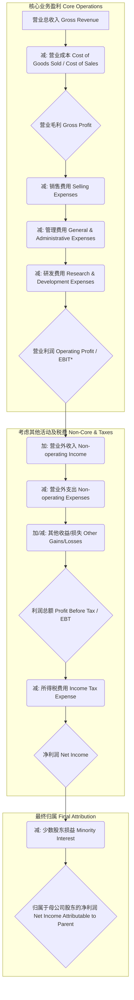

# 第三章：利润表深度解析：盈利能力与利润质量的"成绩单"

利润表（Income Statement 或 Profit and Loss Statement, P&L）是企业在特定会计期间（通常是一个季度或一年）经营成果的财务报告。它像一张"成绩单"，清晰地展示了企业通过其主营业务及其他活动赚了多少钱（收入）、花了多少钱（成本与费用），最终是盈利还是亏损。与资产负债表提供的静态"快照"不同，利润表是一个动态的"录像"，记录了企业价值创造（或毁灭）的过程。

作为 CFO，利润表不仅是向投资者、债权人展示业绩的窗口，更是我们审视自身经营效率、盈利能力、成本控制以及利润质量的核心工具。仅仅看最终的净利润数字是远远不够的，我们需要层层深入，解构利润的来源，识别潜在的风险，评估盈利的可持续性，最终为企业的战略决策提供依据。本章将带你深入利润表的每一个角落，掌握从顶层到底层的分析方法，看透数字背后的商业逻辑与风险信号。

## 3.1 利润表结构与核心项目解读

理解利润表的结构是进行深度分析的基础。它遵循一个基本的逻辑：收入减去成本和费用，最终得到利润。但这个过程并非一步到位，而是通过一系列关键利润指标，层层递进地揭示企业的盈利状况。

### 3.1.1 从营业收入到净利润：盈利能力的"漏斗"分析

我们可以将利润表想象成一个"漏斗"，顶层是最大的收入来源——营业收入，随着各项成本、费用、税金的扣除，最终流到底部的是归属于股东的净利润。这个"漏斗"的形状和每一层的"渗漏"情况，直接反映了企业的盈利能力和效率。

**这个"漏斗"分析框架的核心价值在于：**

1.  **分层诊断 (Layered Diagnosis):** 我们可以清晰地看到利润在哪个环节被"侵蚀"得最多。是毛利率太低（成本控制问题）？还是期间费用过高（运营效率问题）？或是税负过重？这有助于我们定位问题的根源。
2.  **核心盈利识别 (Core Profit Identification):** 营业利润（Operating Profit 或 EBIT - Earnings Before Interest and Taxes）通常被认为是衡量企业核心业务盈利能力的关键指标，因为它剔除了非经营性活动、融资成本和税收的影响。一个健康的企业的利润应主要来源于营业利润。
3.  **质量评估 (Quality Assessment):** 如果净利润主要依赖于营业外收入（如政府补助、资产处置收益）或投资收益，而非营业利润，那么这种盈利的稳定性和可持续性就需要打上问号。我们需要警惕那些"一次性"的收益对整体利润的粉饰作用。

作为 CFO，我们会密切关注这个"漏斗"的每一层：

*   **营业收入 (Revenue):** 这是起点，是企业价值创造的源泉。增长是好事，但我们需要关注增长的质量和可持续性（详见 3.2）。
*   **营业成本 (Cost of Sales / COGS):** 直接与产品或服务相关的成本。有效控制 COGS 是提升毛利率的关键（详见 3.3.1）。
*   **毛利 (Gross Profit):** $毛利 = 营业收入 - 营业成本$。它反映了企业产品或服务的初始盈利空间。
*   **期间费用 (Operating Expenses):** 包括销售费用、管理费用、研发费用。这些是维持企业运营所必需的支出，但需要严格管控其效率（详见 3.3.2）。
*   **营业利润 (Operating Profit / EBIT):** $营业利润 = 毛利 - 期间费用$ (简化)。衡量核心业务的盈利能力。这是分析师和投资者高度关注的指标。
*   **利润总额 (Profit Before Tax / EBT):** $利润总额 = 营业利润 + 营业外收支净额 + 其他收益等$。考虑了非核心经营活动的影响。
*   **净利润 (Net Income):** $净利润 = 利润总额 - 所得税费用$。这是企业最终的税后经营成果。
*   **归属于母公司股东的净利润:** 在合并报表中，需要扣除子公司中非母公司持有的那部分权益（少数股东权益）对应的损益。

通过对这个"漏斗"进行趋势分析（与历史比）和横向比较（与同行比），我们可以快速把握企业盈利能力的相对位置和变化方向。

### 3.1.2 毛利率：产品竞争力与成本控制的直观体现

**毛利率 (Gross Profit Margin)** 是衡量企业盈利能力最基础也是最重要的指标之一。

$$
\text{毛利率} = \frac{\text{营业毛利}}{\text{营业收入}} = \frac{\text{营业收入} - \text{营业成本}}{\text{营业收入}} \times 100\%
$$

毛利率直接反映了以下几个关键方面：

1.  **产品或服务的竞争力:** 较高的毛利率通常意味着企业的产品或服务具有较强的定价能力（品牌优势、技术壁垒、差异化竞争等），能够以高于成本较多的价格销售出去。
2.  **成本控制能力:** 在收入一定的情况下，更低的营业成本意味着更高的毛利率。这反映了企业在采购、生产、供应链管理等方面的效率。
3.  **行业特性:** 不同行业的毛利率水平差异巨大。例如，软件、医药等高科技或高附加值行业的毛利率通常远高于贸易、建筑等传统行业。因此，比较毛利率必须在可比的行业背景下进行。

**CFO 如何分析毛利率？**

*   **趋势分析:** 毛利率是上升还是下降？为什么？是售价提高了，还是成本下降了（原材料价格波动、规模效应、技术改进）？或是产品结构发生了变化（高毛利产品占比提升/下降）？持续下降的毛利率是危险信号。
*   **同行比较:** 与主要竞争对手相比，公司的毛利率处于什么水平？显著低于同行可能意味着成本控制不力或定价权较弱；显著高于同行则需要探究其可持续性，是否存在难以复制的优势，或者是否存在收入确认或成本归集方面的问题。
*   **分产品/分业务线分析:** 对于多元化经营的企业，分析不同产品线或业务分部的毛利率至关重要。这有助于识别哪些是"明星"业务（高增长、高毛利），哪些是"现金牛"（低增长、高毛利），哪些是"问题"业务（低毛利甚至负毛利），为资源配置和战略调整提供依据。
*   **量价分析:** 将收入增长分解为销量增长和价格变动。如果毛利率提升伴随着销量萎缩，可能只是提价效应，未必健康。理想状态是量价齐升，或者在价格稳定/略有下降的情况下通过成本优化提升毛利率。
*   **警惕信号:**
    *   **毛利率异常波动:** 缺乏合理解释的大幅波动可能隐藏着收入确认或成本核算的问题。
    *   **远超同行的"超能力":** 如果一家公司的毛利率长期、显著地高于所有竞争对手，且缺乏清晰的护城河解释，需要警惕是否存在财务粉饰。
    *   **与现金流背离:** 高毛利但经营现金流不佳，可能意味着大量的赊销或存货积压。

毛利率是利润表的"第一道关卡"，守住了毛利率，才能为后续的费用支出和最终盈利奠定基础。

### 3.1.3 营业利润率：核心业务盈利能力评估

**营业利润率 (Operating Profit Margin)** 是衡量企业核心主营业务盈利能力的关键指标。

$$
\text{营业利润率} = \frac{\text{营业利润}}{\text{营业收入}} \times 100\%
$$

*注：这里的营业利润（Operating Profit）通常指 EBIT（息税前利润），但在中国会计准则（CAS）下，营业利润的计算已扣除部分财务费用（如利息费用），与国际财务报告准则（IFRS）和美国公认会计原则（US GAAP）下的 EBIT 定义不完全一致，分析时需注意口径统一。为简化讨论，本处及后续常以营业利润代指核心业务的税前利润。*

营业利润率相比毛利率，更进了一步，因为它不仅考虑了直接的营业成本，还扣除了维持企业正常运营所需的期间费用（销售费用、管理费用、研发费用）。

**为什么营业利润率如此重要？**

1.  **聚焦主业:** 它剔除了非经常性损益、投资收益、营业外收支以及融资成本（部分）和税收的影响，更纯粹地反映了企业依靠主营业务"造血"的能力。投资者和分析师高度关注此指标，因为它代表了可持续盈利的基础。
2.  **反映运营效率:** 营业利润率的高低，不仅取决于毛利率水平，还取决于期间费用的管控效率。即使毛利率很高，如果销售、管理、研发等费用失控，营业利润率也可能很低。
3.  **比较基础:** 相较于受税收政策、融资结构、非经常性事件影响较大的净利率，营业利润率在不同公司、不同时期之间的可比性通常更强（尤其是在调整会计准则差异后）。

**CFO 如何分析营业利润率？**

*   **与毛利率联动分析:** 营业利润率的变化是源于毛利率的变动，还是期间费用率的变动？
    *   $期间费用率 = (销售费用 + 管理费用 + 研发费用) / 营业收入$
    *   $营业利润率 \approx 毛利率 - 期间费用率$ (简化理解)
    *   如果毛利率稳定或上升，但营业利润率下降，说明期间费用管控恶化。反之亦然。
*   **费用结构分析:** 深入分析销售费用率、管理费用率、研发费用率的变动趋势和行业对比。是哪个环节的费用增长过快？研发投入增加是否带来了相应的收入增长或效率提升预期？销售费用的投入带来了多少边际收入？（详见 3.3.2）
*   **趋势与同行比较:** 与历史水平和竞争对手比较，分析营业利润率的相对位置和变动原因。是行业整体趋势，还是公司自身原因？
*   **盈利质量:** 稳定的、主要由核心业务驱动的营业利润率通常被认为是高质量的。警惕那些依靠压缩必要费用（如研发、维护）来短期提升营业利润率的做法，这可能损害长期竞争力。
*   **与战略匹配:** 企业的战略选择会影响营业利润率。例如，采取低成本战略的企业可能毛利率较低，但通过严格的费用控制维持合理的营业利润率；而采取差异化战略的企业可能毛利率较高，但需要投入大量研发和营销费用，营业利润率需要达到一定水平才能支撑其战略。

营业利润率是连接产品盈利能力（毛利率）和整体运营效率（费用控制）的桥梁，是评估企业核心竞争力不可或缺的指标。

## 3.2 营业收入分析：增长驱动力与收入"含金量"

营业收入是利润表的起点，是企业经营活动的"血液来源"。没有健康、可持续的收入增长，利润就成了无源之水。但仅仅看到收入数字的增长是不够的，作为 CFO，我们需要深入分析收入的质量、驱动因素和潜在风险。

### 3.2.1 收入确认原则：警惕提前确认与虚增风险

收入确认是会计核算的核心和难点之一，也是财务舞弊的高发区。何时确认收入、确认多少收入，直接影响利润表的顶层数据，进而影响各层利润指标。理解收入确认的基本原则是识别风险的前提。

**核心原则（基于 IFRS 15 / ASC 606 的五步法精髓）：**

企业只有在履行了合同中的履约义务，即客户取得了相关商品或服务的**控制权**时，才能确认收入。金额应是预期有权收取的对价。

关键在于"控制权"的转移。这通常发生在以下时点（根据合同具体条款判断）：

*   **商品销售:** 客户拥有法定所有权、实际占有商品、承担了主要风险和报酬、已接受商品等。
*   **服务提供:** 按照履约进度（如工时、完成百分比）或在完成履约义务时确认。

**常见的收入操纵手法与风险点：**

1.  **提前确认收入 (Premature Revenue Recognition):**
    *   **发货即确认:** 不顾客户是否验收、是否有退货权，在商品发出时即确认收入。尤其关注年底或季末的突击发货。
    *   **未完成服务即确认:** 对需要分期确认收入的服务（如长期软件维护、咨询项目），一次性确认全部收入。
    *   **"Bill-and-Hold"安排滥用:** 商品已销售但应客户要求暂缓发货，却提前确认收入。需严格判断控制权是否确实转移。
2.  **虚构交易 (Fictitious Revenue):**
    *   **无实质交易:** 凭空捏造销售合同和发票。
    *   **伪造客户:** 与虚假客户签订合同。
    *   **循环交易 (Round-tripping):** 与关联方或其他公司进行对倒交易，互相买卖，虚增收入，但无实质经济利益流入。
3.  **填充渠道 (Channel Stuffing):**
    *   在期末向分销商或下游客户压货，给予异常宽松的信用条件或退货权，以达到短期内冲高收入的目的。这寅吃卯粮，透支了未来的销售，风险极高。
4.  **关联交易非关联化:**
    *   通过复杂的股权设计或隐蔽协议，将本应披露的关联交易包装成非关联交易，以虚增收入或转移利润。
5.  **处理附带销售激励的合同:**
    *   如买一赠一、积分奖励、重大客户折扣等，需要将交易价格在各个履约义务（包括未来的赠品或折扣权）之间进行分摊，容易被操纵以增加当期收入。
6.  **不恰当的收入分摊（多要素合同）:**
    *   例如，销售设备并提供后续安装、维护服务。需要将总合同价款在设备、安装、维护等不同履约义务之间进行合理分摊。如果将过多收入分摊到前期交付的设备上，会虚增早期利润。

**CFO 的侦测技巧与关注点：**

*   **收入与现金流匹配度:** "销售商品、提供劳务收到的现金" / 营业收入。持续低于 1（或行业水平）可能意味着回款不佳，或者存在大量赊销甚至虚假收入。
*   **应收账款异常增长:** 应收账款的增长速度远超营业收入增长速度，是重要警示信号。分析账龄结构，关注长期未收回款项。（详见第二章 2.2.2）
*   **合同评审:** 抽查大额或非标准销售合同，关注收入确认时点、付款条件、退货条款、是否存在多重履约义务等。
*   **期末收入波动:** 关注季度末或年度末收入是否异常冲高，是否存在"填充渠道"迹象。
*   **关联交易审查:** 严格审查关联交易的必要性、定价公允性，警惕异常交易。（详见第八章 8.1）
*   **毛利率稳定性:** 虚增的收入往往没有对应的真实成本（或成本被隐藏），可能导致毛利率异常升高或波动。
*   **审计报告:** 关注审计师对收入确认的审计意见、关键审计事项的描述。

收入是利润的源头，源头如果被污染（确认不当或造假），整个利润表的可信度将大打折扣。CFO 必须对收入确认保持高度警惕。

### 3.2.2 收入结构分析：产品、区域、客户集中度风险

总收入增长固然重要，但其内部结构更能揭示增长的健康度和潜在风险。作为 CFO，我们需要从多个维度剖析收入构成：

1.  **按产品/服务线划分:**
    *   **识别增长引擎与风险点:** 哪些产品是主要收入来源？哪些是增长最快的新星？哪些是正在萎缩的夕阳产品？是否存在过度依赖单一产品的风险？
    *   **盈利能力差异:** 不同产品线的毛利率可能差异巨大。高毛利产品占比提升会改善整体盈利能力，反之亦然。这对于理解整体毛利率变动至关重要。
    *   **资源配置依据:** 了解各产品线的收入贡献和盈利能力，为研发投入、市场推广、产能分配等资源配置决策提供依据。

2.  **按地理区域划分:**
    *   **市场依赖性与风险:** 企业收入是否过度集中于某一特定国家或地区？这会使企业暴露于该地区的宏观经济波动、政策变化、汇率风险等。多元化的区域布局有助于分散风险。
    *   **区域增长潜力:** 哪些区域是主要增长来源？哪些区域增长停滞甚至下滑？有助于判断全球化战略的成效和未来市场拓展方向。
    *   **区域盈利差异:** 不同区域的竞争格局、成本水平、税收政策不同，可能导致区域盈利能力差异。

3.  **按客户类型/集中度划分:**
    *   **大客户依赖风险:** 是否存在对单一或少数几个大客户的过度依赖（例如，某个客户贡献收入超过 10% 或更高）？一旦失去这些大客户，将对收入和利润产生灾难性影响。需要评估客户关系的稳定性、议价能力。
    *   **客户行业分布:** 客户是否集中于某个特定行业？该行业的周期性波动或衰退将直接冲击企业收入。多元化的客户行业分布更具韧性。
    *   **客户质量:** 分析主要客户的信用状况、付款及时性。向高风险客户的销售可能带来坏账风险。

**CFO 的分析视角：**

*   **结构变化趋势:** 关注各类收入占比的变化趋势。是产品结构优化/恶化？区域布局更均衡/更集中？客户依赖度增加/降低？
*   **与战略匹配度:** 当前的收入结构是否符合公司的战略规划？例如，如果公司战略是拓展海外市场，但海外收入占比迟迟没有提升，可能意味着战略执行不力。
*   **风险预警:** 识别并量化集中度风险（产品、区域、客户）。制定应对预案，如拓展新产品、开发新市场、争取新客户、加强风险管理。
*   **信息披露:** 上市公司通常会在财报附注中披露分部信息（按业务、按区域）。仔细阅读这些信息，是进行结构分析的基础。

健康的收入结构应该具有一定的多元化和均衡性，能够抵御单一产品失败、区域动荡或大客户流失带来的冲击。过于集中的收入结构是 CFO 需要重点关注和管理的风险点。

### 3.2.3 收入增长的可持续性：驱动因素（量/价）与天花板

收入增长是评估企业发展前景的重要指标，但增长本身也有"好"与"坏"之分。我们需要深入探究增长背后的驱动因素，判断其可持续性。

**量价分析 (Volume-Price Analysis):**

将收入增长分解为销量增长和价格变动两个因素，是判断增长质量的基础方法。

$$
\text{收入增长} \approx \text{销量增长} + \text{价格增长} + (\text{销量增长} \times \text{价格增长})
$$

*   **销量驱动的增长 (Volume-driven Growth):** 通常被认为是更健康的增长模式，意味着市场份额扩大、客户基础增加或市场需求提升。这种增长往往更具可持续性。
*   **价格驱动的增长 (Price-driven Growth):** 可能源于产品提价、产品结构升级（销售更多高价产品）或通货膨胀。需要分析提价是否可持续，是否会导致销量下滑？如果是依靠通胀，那么实际增长可能有限。
*   **量价齐升:** 最理想的状态，表明产品竞争力和市场需求同步提升。
*   **量增价跌:** 可能是在通过降价换取市场份额，需要关注对毛利率的影响。
*   **量跌价增:** 可能是产品结构调整（放弃低价产品）或单纯提价覆盖销量下滑，需要警惕市场萎缩或竞争力下降的风险。

**评估增长的可持续性:**

1.  **行业天花板 (Industry Ceiling):** 企业所处的行业是朝阳行业还是夕阳行业？市场空间有多大？行业整体增速如何？如果行业本身增长缓慢或趋于饱和，企业要维持高速增长将非常困难，可能需要通过并购或拓展新业务来实现。
2.  **竞争格局 (Competitive Landscape):** 市场是蓝海还是红海？竞争对手实力如何？企业的核心竞争力（护城河）是什么？能否支撑其持续获取市场份额或维持定价能力？
3.  **内生增长 vs. 外延增长 (Organic vs. Inorganic Growth):**
    *   **内生增长:** 依靠现有业务的自然扩张（提高销量、改进产品、拓展渠道等）。通常被认为是更扎实、更能反映核心能力的增长。
    *   **外延增长:** 通过并购实现的增长。并购可以在短期内快速扩大规模、进入新市场，但也伴随着整合风险、商誉减值风险。（详见第八章 8.2）
    *   分析收入增长中有多少来自内生，多少来自并购，有助于判断增长的真实质量。警惕那些主要依靠不断并购来维持增长故事的企业。
4.  **客户粘性与重复购买 (Customer Stickiness & Repeat Purchase):** 收入增长是来自新客户获取，还是老客户的持续购买/增购？高客户粘性和重复购买率是收入可持续性的重要保障。订阅模式（SaaS 等）通常具有较高的收入可预测性和可持续性。
5.  **创新能力 (Innovation Capability):** 对于科技、消费品等行业，持续推出新产品、新服务以满足不断变化的市场需求，是维持增长的关键。关注研发投入及其转化效率。

**CFO 的关注点：**

*   **增长质量而非速度:** 不要被单纯的高增长数字迷惑，要深入分析驱动因素和可持续性。有时，稳定、中速但高质量的增长比高速但不稳定的增长更有价值。
*   **预测与预算:** 基于对增长驱动因素和可持续性的判断，制定更可靠的收入预测和预算。
*   **风险识别:** 识别增长放缓或停滞的风险信号（行业拐点、竞争加剧、核心产品老化、大客户流失等），提前制定应对策略。
*   **投资者沟通:** 清晰地向投资者阐述收入增长的逻辑、驱动因素和未来展望，管理市场预期。

对收入进行量价分析、结构分析和可持续性评估，才能真正理解企业增长的"含金量"，避免陷入"增长陷阱"。

## 3.3 成本与费用分析：效率、管控与潜在操纵空间

如果说收入是开源，那么成本与费用控制就是节流。有效的成本费用管理是提升利润率、增强企业竞争力的关键环节。同时，成本费用也是盈余管理甚至财务舞弊的潜在领域，需要 CFO 保持警惕。

### 3.3.1 营业成本：构成、变动趋势与成本转嫁能力

**营业成本 (Cost of Sales / Cost of Goods Sold, COGS)** 是指与企业销售商品或提供劳务直接相关的成本。对于制造企业，它通常包括：

*   **直接材料 (Direct Materials):** 构成产品的原材料。
*   **直接人工 (Direct Labor):** 生产线上工人的工资福利。
*   **制造费用 (Manufacturing Overhead):** 生产相关的间接成本，如厂房折旧、设备维护、水电费、间接管理人员工资等。

对于零售或贸易企业，营业成本主要是采购商品的成本。对于服务型企业，则主要是提供服务的人员成本等。

**分析营业成本的关键点：**

1.  **成本构成分析 (Cost Structure Analysis):**
    *   了解营业成本中材料、人工、制造费用的占比及其变动趋势。例如，原材料价格大幅上涨是否是导致成本上升的主要原因？自动化投入是否降低了人工成本占比？
    *   **固定成本 vs. 变动成本:** 区分成本中哪些是随产量/销量变动的（如原材料），哪些是相对固定的（如厂房折旧）。这对于理解盈亏平衡点、经营杠杆和预测未来成本至关重要。高固定成本占比意味着产量波动对单位成本影响更大。

2.  **成本变动趋势分析:**
    *   **单位成本变动:** 分析单位产品的成本是上升还是下降？原因是什么？是规模效应带来的下降，还是效率低下/原材料涨价导致的上升？
    *   **成本/收入比:** 即 $营业成本 / 营业收入 = 1 - 毛利率$。分析此比率的变动，与毛利率分析相辅相成。

3.  **成本转嫁能力 (Cost Pass-through Ability):**
    *   当原材料价格、人工成本等上升时，企业能否通过提高产品售价将增加的成本转嫁给下游客户？
    *   成本转嫁能力强的企业（通常拥有品牌优势、技术壁垒或处于有利的市场地位），即使在上游成本上涨时也能维持相对稳定的毛利率。
    *   成本转嫁能力弱的企业，在成本上升时毛利率将受到挤压。分析毛利率对主要成本因素（如某种大宗商品价格）的敏感性。

4.  **成本核算方法与潜在操纵:**
    *   **存货计价方法 (Inventory Valuation Methods):** 如先进先出法（FIFO）、后进先出法（LIFO，部分准则允许）、加权平均法。在物价变动时，不同的计价方法会影响当期确认的营业成本和期末存货价值，进而影响利润。虽然会计政策选择应保持一贯性，但变更计价方法可能被用来调节利润。
    *   **成本分摊 (Cost Allocation):** 制造费用的分摊基础（如工时、机器小时、产量）的选择，可能影响不同产品或批次的成本，存在操纵空间。
    *   **跨期确认 (Timing Recognition):** 将本应计入当期的成本推迟到下期确认，或提前确认下期成本，以平滑利润。
    *   **资本化 vs. 费用化:** 将本应费用化的支出（如某些研发、维修费）资本化计入资产（如在建工程、无形资产），从而减少当期费用，虚增利润。（详见 3.3.2）

**CFO 的管控与视角：**

*   **精细化核算:** 建立准确、精细的成本核算体系，追踪到产品、批次、部门。
*   **预算与实际对比:** 将实际发生的营业成本与预算进行比较，分析差异原因，及时纠偏。
*   **供应链管理:** 通过优化采购策略、加强供应商管理、改进生产流程、运用技术手段（如 ERP）来降低成本、提升效率。
*   **风险预警:** 监控主要原材料价格波动风险，利用期货等衍生品工具进行套期保值（若适用）。关注存货周转率，避免存货积压带来的跌价和成本固化风险。（详见第二章 2.2.3）
*   **内部审计:** 加强对成本确认、存货计价、成本分摊等环节的内部审计，防范舞弊风险。

营业成本是影响毛利的核心因素，对其进行深入分析和有效管控，是 CFO 提升企业盈利能力的基础工作。

### 3.3.2 期间费用（销售/管理/研发）：费用效率、投入产出与资本化风险

**期间费用 (Operating Expenses, OPEX)** 是指企业为组织和管理生产经营活动以及销售产品、提供劳务等而发生的，不能直接归属于某个特定产品成本，而应在发生当期直接计入损益的各项费用。主要包括：

1.  **销售费用 (Selling Expenses):** 为销售产品或提供劳务而发生的费用，如广告宣传费、销售人员薪酬与佣金、运输费、仓储费、售后服务费等。
2.  **管理费用 (General & Administrative Expenses, G&A):** 企业行政管理部门为组织和管理生产经营活动而发生的各项费用，如公司高管薪酬、行政人员工资、办公费、差旅费、折旧费（非生产用）、无形资产摊销（非生产相关）、业务招待费、咨询费、诉讼费等。
3.  **研发费用 (Research & Development Expenses, R&D):** 企业进行研究与开发活动所发生的费用，如研发人员薪酬、研发材料费、设备折旧与摊销、委外研发费等。

**分析期间费用的关键点：**

1.  **费用率分析 (Expense Ratio Analysis):**
    *   $销售费用率 = 销售费用 / 营业收入$
    *   $管理费用率 = 管理费用 / 营业收入$
    *   $研发费用率 = 研发费用 / 营业收入$
    *   $期间费用率 = (销售费用 + 管理费用 + 研发费用) / 营业收入$
    *   分析各项费用率的变动趋势：是随着收入规模扩大而下降（规模效应），还是失控增长？
    *   与同行比较：费用率是高于还是低于行业平均水平？为什么？是效率问题，还是战略选择不同（如高研发投入）？

2.  **投入产出效率分析 (Input-Output Efficiency):**
    *   **销售费用效率:** 销售费用的增长是否带来了相应的收入增长？边际销售费用投入产生的边际收入是多少？警惕无效的市场推广投入。
    *   **研发投入效率:** 研发投入是否转化为新技术、新产品？是否带来了市场份额提升或更高的毛利率？研发投入的产出往往有滞后性，需要长期跟踪。分析研发投入的构成（基础研究 vs. 应用开发）。
    *   **管理效率:** 管理费用率是衡量企业管理效率的重要指标。过高的管理费用率可能意味着机构臃肿、流程繁琐或内部管控不严。但过低的管理费用率也可能意味着对必要的管理支持投入不足。

3.  **费用结构分析:**
    *   分析各项费用内部的具体构成。例如，销售费用中广告费占比高还是人工成本占比高？管理费用中主要是薪酬还是办公租赁费？研发费用是内部投入多还是委外多？这有助于更精确定位费用管控的重点。

4.  **费用粘性 (Cost Stickiness):**
    *   有些费用在收入下降时并不会同比例下降，甚至难以削减（如长期租赁合同、核心管理人员薪酬），这就是所谓的"费用粘性"。高费用粘性意味着在经济下行周期，利润会受到更大冲击。

5.  **资本化风险 (Capitalization Risk):**
    *   **研发费用资本化:** 会计准则允许将符合条件的开发阶段支出资本化，计入无形资产，然后在未来分期摊销，而不是一次性计入当期研发费用。这可以平滑利润，但也可能被滥用。
        *   **风险点:** 将不符合条件的研发支出（如研究阶段支出、不确定性高的开发项目）资本化，虚增当期利润和资产。资本化比例远超同行且缺乏合理解释。资本化形成的无形资产后续无法带来预期效益，面临大额减值风险。
        *   **CFO 视角:** 严格掌握资本化条件，评估开发项目的技术可行性和未来经济利益流入的可能性。关注资本化研发支出占总研发投入的比例及其变动，对比同行。跟踪资本化项目后续的摊销和减值情况。
    *   **其他费用资本化:** 将某些本应费用化的利息支出、维修费、市场开拓费等计入在建工程、固定资产或长期待摊费用，也是常见的利润操纵手段。

**CFO 的管控与视角：**

*   **预算管理:** 建立严格的费用预算制度，事前审批与事后分析相结合。
*   **绩效考核:** 将费用控制和效率提升纳入相关部门和人员的绩效考核。
*   **流程优化:** 通过流程再造、技术应用（如自动化、共享服务中心）来提高效率、降低费用。
*   **合理投入:** 区分必要的战略性投入（如关键研发、品牌建设）和可压缩的运营性支出。不能为了短期利润而过度削减关乎未来的投入。
*   **内部控制与审计:** 加强对费用报销、采购、研发资本化等关键环节的内部控制和审计，防范舞弊和滥用。

期间费用是影响营业利润的关键因素，对其进行有效的分析、管控和投入产出评估，是 CFO 平衡短期业绩和长期发展的重要职责。

### 3.3.3 财务费用：融资成本、汇兑损益与利率风险

**财务费用 (Financial Expenses)** 是指企业为筹集生产经营所需资金等而发生的费用，主要包括：

*   **利息支出 (Interest Expense):** 借款（短期借款、长期借款、应付债券等）需要支付的利息（减去符合资本化条件的利息）。这是财务费用的核心组成部分。
*   **汇兑损益 (Exchange Gains and Losses):** 企业因外币业务（如进出口、外币借款、外币存款）而产生的，由于汇率变动导致的损益。
*   **金融机构手续费 (Bank Charges):** 如开户费、转账手续费等。
*   **其他财务费用:** 如现金折扣（销售方承担）等。

*注：在中国会计准则下，利息费用、汇兑损益等计入财务费用，是营业利润计算的一部分扣减项。而在 IFRS/US GAAP 下，利息费用通常在营业利润（Operating Profit / EBIT）之后扣除。分析时需注意口径。*

**分析财务费用的关键点：**

1.  **融资成本分析:**
    *   **利息支出规模:** 利息支出占利润总额或营业收入的比重有多大？过高的利息负担会严重侵蚀企业利润。
    *   **平均融资成本率:** $（利息支出 / 平均带息负债规模） \times 100\%$。分析融资成本率的变动趋势，与市场利率水平和同行的比较。高融资成本可能意味着企业信用风险较高或融资渠道不畅。
    *   **债务结构影响:** 不同融资方式（银行贷款、债券、非标融资）的成本不同。债务结构的调整会影响整体融资成本。
    *   **利息资本化:** 对于为构建固定资产、无形资产等发生的专门借款利息，在资产达到预定可使用状态前，符合资本化条件的部分应计入资产成本，而不是计入当期财务费用。关注利息资本化的金额和合理性，是否存在将本应费用化的利息过度资本化以调节利润的风险。

2.  **汇兑损益分析:**
    *   **规模与波动性:** 汇兑损益的绝对额有多大？对利润的影响程度如何？其波动性是否很大？
    *   **风险暴露:** 企业的外币资产、负债、收入、成本的规模和币种构成决定了其汇率风险敞口。
    *   **管理策略:** 企业是否采取了汇率风险管理措施（如远期结售汇、货币互换等衍生工具）？效果如何？
    *   **对利润的影响:** 汇兑损益具有较大的不确定性，可能导致利润大幅波动。分析时需要理解其产生的原因，并考虑剔除其影响来看核心盈利能力。

3.  **利率风险分析:**
    *   **浮动利率负债占比:** 企业有多少负债是采用浮动利率？在利率上升周期，这部分负债的利息支出会增加，侵蚀利润。
    *   **利率敏感性:** 测算利率变动对企业利息支出和利润的影响程度。
    *   **风险管理:** 是否利用利率互换等工具来管理利率风险？

**CFO 的管控与视角：**

*   **债务管理:** 优化债务结构，合理安排长短期负债比例，拓展低成本融资渠道。监控关键偿债指标（如利息保障倍数，详见第五章 5.2.2）。
*   **现金流管理:** 确保有足够的经营现金流来覆盖利息支出和本金偿还。
*   **汇率风险管理:** 建立汇率风险监控和预警机制，根据风险敞口和市场判断，运用合适的金融工具进行对冲。
*   **利率风险管理:** 评估利率变动对公司的影响，采取固定利率与浮动利率相结合的策略，或运用衍生工具管理风险。
*   **信息披露:** 在财报附注中清晰披露借款明细、利率水平、利息资本化情况、外币风险敞口、使用的金融工具等信息。

财务费用直接反映了企业的融资能力、融资成本和财务风险管理水平。对于高杠杆经营的企业，财务费用的分析尤为重要。

## 3.4 利润质量分析：识别"虚胖"盈利与非经常性损益

净利润数字本身并不能完全反映企业的真实盈利能力和价值创造能力。一个高利润可能伴随着低质量，一个看似平庸的利润数字背后可能隐藏着扎实的核心业务。作为 CFO，我们需要具备"火眼金睛"，穿透利润表表面，识别那些"虚胖"的盈利，关注利润的质量和可持续性。

### 3.4.1 营业利润 vs. 利润总额 vs. 净利润：非主营业务影响

比较利润表上不同层次的利润指标，是判断利润来源和质量的关键一步。

*   **营业利润 (Operating Profit / EBIT):** 代表核心主营业务的盈利能力。
*   **利润总额 (Profit Before Tax / EBT):** $利润总额 = 营业利润 + 营业外收入 - 营业外支出 +/- 其他收益/损失等$。它在营业利润的基础上，加入了非主营、非经常性活动的影响。
*   **净利润 (Net Income):** $净利润 = 利润总额 - 所得税费用$。最终的税后利润。

**分析要点：**

1.  **非主营业务贡献度:**
    *   $（利润总额 - 营业利润） / 利润总额$ 的比例有多大？如果这个比例很高，说明利润总额中有相当一部分来自非主营业务活动。
    *   常见的非主营项目包括：政府补助、非流动资产处置损益（卖大楼、卖设备）、捐赠、罚款、债务重组利得/损失等。
    *   **质量判断:** 这些非主营项目通常具有偶然性、不可持续性。过度依赖这些项目来"美化"利润是低质量的表现。需要仔细审视其性质和金额。例如，经常性的政府补助（如某些行业的退税）可能相对稳定，但一次性的资产处置收益则不可持续。

2.  **利润来源结构:**
    *   一个健康的、高质量的盈利模式，其利润应主要来源于营业利润。营业利润占利润总额的比重越高，通常意味着主营业务越扎实，盈利基础越稳固。
    *   如果营业利润很低甚至为负，但依靠大量的营业外收入或投资收益（见 3.4.3）使得利润总额和净利润看起来不错，需要高度警惕。这可能是主业衰退、依靠变卖资产或短期投资收益维持"虚假繁荣"的信号。

3.  **税收影响:**
    *   $所得税费用 / 利润总额$ 即实际税率。分析实际税率与法定税率的差异及其原因（如税收优惠、递延所得税影响等）。
    *   关注税收优惠政策的可持续性。依赖税收优惠带来的低税率优势可能难以持久。

**CFO 的视角：**

*   **关注核心:** 始终将分析重心放在营业利润上，评估其增长趋势、盈利能力和可持续性。
*   **剥离非经常:** 在进行趋势分析和同行比较时，可以考虑剔除非经常性、非主营业务损益的影响，计算"核心营业利润"或"调整后净利润"，以更清晰地看到主业的真实表现。
*   **理解驱动因素:** 对于重大的非主营项目，要深入了解其产生的背景和具体内容，判断其是一次性的，还是可能重复发生的。
*   **风险提示:** 如果发现利润严重依赖非主营业务，应向管理层和董事会提示风险，推动聚焦主业、提升核心竞争力。

通过对比不同利润层级的差异，我们可以初步判断利润的主要来源，识别非主营业务对整体盈利的"干扰"或"贡献"，为后续更深入的质量分析奠定基础。

### 3.4.2 资产减值损失：潜在的利润"调节器"

**资产减值损失 (Impairment Losses)** 是指企业在资产负债表日，判断资产（如固定资产、无形资产、商誉、存货、应收账款、长期股权投资等）的可收回金额低于其账面价值时，需要将账面价值减记至可收回金额，所确认的损失。

资产减值损失通常计入利润表的"资产减值损失"或"信用减值损失"（针对金融工具）项目，直接减少当期利润。

**为什么说它是潜在的利润"调节器"？**

1.  **计提时点与金额的主观性:**
    *   判断资产是否减值、计算可收回金额（未来现金流量现值或公允价值减处置费用），涉及大量的管理层估计和判断。这为盈余管理提供了空间。
    *   **"洗大澡" (Big Bath):** 在业绩较差的年份，管理层可能倾向于一次性计提大额减值损失，将各种潜在问题暴露并处理掉（把"澡"洗干净），从而为未来年份的利润增长"减负"，或者将责任归咎于外部环境。
    *   **平滑利润:** 在业绩较好的年份，可能选择少计提减值，以维持利润的稳定增长；在业绩稍差的年份，适当增加计提，避免利润大幅下滑。也可以通过前期过度计提减值，在后续年度转回（部分减值允许转回，如存货跌价准备，但固定资产、无形资产、商誉减值通常不允许转回）来调节利润。

2.  **影响重大:**
    *   特别是商誉减值、大额固定资产或无形资产减值，往往金额巨大，可能导致企业当年利润大幅下滑甚至亏损。
    *   应收账款坏账准备、存货跌价准备的计提虽然单项金额可能不大，但其计提政策的微小调整（如坏账计提比例、存货可变现净值的估计）也可能对利润产生显著影响。

**CFO 的分析与关注点：**

*   **减值规模与频率:** 当期发生的资产减值损失规模有多大？占利润总额或净利润的比重如何？历史上是否频繁发生大额减值？
*   **减值对象:** 主要是哪些资产发生了减值？是存货、应收账款这些运营性资产，还是固定资产、无形资产、商誉这些长期资产？不同资产减值的背后可能反映不同的问题（如运营效率低下 vs. 投资决策失误）。
*   **计提原因:** 仔细阅读财报附注中关于资产减值测试的方法、关键假设（如增长率、折现率）以及导致减值的具体原因。判断其合理性。
*   **同行比较:** 与同行业公司相比，公司的减值政策（如坏账计提比例）是否谨慎？减值计提的规模是否异常？
*   **"洗大澡"信号:** 是否在更换管理层、进行重大重组或行业低谷时发生异常巨大的减值损失？
*   **减值转回:** 关注是否有大额的减值准备转回，分析其原因，判断是否存在利用前期过度计提进行利润操纵的可能。
*   **与资产质量关联:** 将减值分析与资产负债表中的资产质量分析相结合（如应收账款账龄、存货周转率、商誉占总资产比重等）。

资产减值损失本身是风险的体现，但也可能被用作盈余管理的工具。CFO 需要密切关注减值计提的充分性、合理性和一贯性，警惕利用减值进行利润操纵的行为，确保财务报告真实反映资产价值和经营风险。

### 3.4.3 投资收益与公允价值变动：收益的稳定性与风险暴露

除了主营业务产生的营业利润和非经常性的营业外收支，企业的利润还会受到投资活动的影响，主要体现在以下两个项目：

1.  **投资收益 (Investment Income / Loss):**
    *   **来源:** 主要包括持有交易性金融资产、债权投资、其他债权投资期间取得的利息或现金股利；处置这些金融资产时产生的损益；采用权益法核算的长期股权投资确认的投资损益；处置长期股权投资产生的损益等。
    *   **特点:** 部分投资收益（如稳定分红的股权投资、债券利息）可能相对稳定，但处置投资产生的损益、权益法核算的联营/合营企业利润波动等，可能带来较大的不确定性。

2.  **公允价值变动损益 (Gains / Losses from Changes in Fair Value):**
    *   **来源:** 主要来自交易性金融资产、交易性金融负债，以及采用公允价值模式计量的投资性房地产等，在持有期间因公允价值（市场价格）波动而产生的未实现损益。
    *   **特点:** 这部分损益直接受市场价格波动影响，可能非常不稳定，甚至在不同期间正负反转。它反映的是账面价值的变动，并不一定伴随现金流入。

**分析要点：**

1.  **对利润的贡献度与波动性:**
    *   投资收益和公允价值变动损益合计占利润总额的比重有多大？如果占比很高，意味着企业利润对投资活动和市场波动的依赖性强。
    *   分析这两个项目的历史波动情况。大幅波动会降低整体利润的可预测性和稳定性。

2.  **收益质量判断:**
    *   **区分经常性与非经常性:** 持有期间的股利、利息收入通常被认为是相对经常性的；而处置投资产生的损益、公允价值大幅波动则具有非经常性特征。
    *   **区分已实现与未实现:** 投资收益中包含了已实现的处置损益和部分持有期收益；而公允价值变动损益主要是未实现的账面浮盈浮亏。未实现的收益未来可能因市场反转而消失甚至变成损失。
    *   **关注核心业务:** 过度依赖投资收益（尤其是一次性处置收益或不稳定的公允价值变动）来弥补主营业务的亏损或增长乏力，是低质量盈利的典型特征。

3.  **风险暴露:**
    *   大规模持有交易性金融资产意味着企业承受着相应的市场风险（股价波动、利率风险等）。公允价值变动损益直接反映了这种风险暴露。
    *   长期股权投资的质量取决于被投资企业的经营状况和盈利能力。联营/合营企业的亏损会直接减少投资方的投资收益。

**CFO 的视角：**

*   **理解投资策略:** 了解公司的投资策略是什么？是战略性长期持股，还是短期交易获利？投资组合的构成和风险如何？
*   **剥离波动:** 在评估核心盈利能力时，可以考虑剔除公允价值变动损益和非经常性的投资处置损益，计算"调整后利润"。
*   **风险管理:** 对于大规模的交易性金融资产投资，需要建立相应的风险管理机制，监控市场风险敞口。
*   **信息披露:** 关注财报附注中关于金融资产分类、公允价值层级（Level 1, 2, 3 表明估值可靠性）、长期股权投资详情、投资收益和公允价值变动明细等信息。
*   **警惕信号:**
    *   主业不振，但投资收益或公允价值变动收益持续贡献大部分利润。
    *   频繁处置长期资产或股权以获取投资收益。
    *   大量使用公允价值难以确定的金融工具（Level 3 资产占比高）。

投资活动可以为企业带来额外收益，但也可能引入新的风险和利润波动。CFO 需要清晰地评估投资收益的质量、稳定性及其对整体利润的影响，确保投资活动服务于公司整体战略，而不是成为掩盖主业问题的"遮羞布"。

## 3.5 每股收益（EPS）与综合收益（OCI）：全面理解股东回报

利润表的最终成果——净利润，是计算每股收益（EPS）的基础，也是股东回报的重要来源。但仅看净利润和基本 EPS 可能还不够全面，我们需要理解稀释效应以及其他综合收益的影响。

### 3.5.1 基本EPS vs. 稀释EPS：潜在股权稀释风险

**每股收益 (Earnings Per Share, EPS)** 是衡量公司盈利能力对普通股股东价值影响的关键指标，也是投资者进行估值和比较时最常用的指标之一。

1.  **基本每股收益 (Basic EPS):**
    $$
    \text{基本EPS} = \frac{\text{归属于普通股股东的当期净利润}}{\text{当期发行在外普通股的加权平均数}}
    $$
    *   **分子:** 需要从净利润中扣除优先股股利（如有）。
    *   **分母:** 需要考虑报告期内增发、回购等导致的股数变动，计算加权平均股数。
    *   基本 EPS 反映了当前股本结构下，每股普通股享有的净利润。

2.  **稀释每股收益 (Diluted EPS):**
    $$
    \text{稀释EPS} = \frac{\text{归属于普通股股东的当期净利润 + 稀释性潜在普通股调整}}{\text{当期发行在外普通股的加权平均数 + 稀释性潜在普通股转换的加权平均数}}
    $$
    *   **考虑潜在稀释:** 稀释 EPS 是在基本 EPS 的基础上，假设所有具有稀释性的潜在普通股（如可转换债券、股票期权、认股权证等）都已转换为普通股，对分子（净利润）和分母（股数）进行调整后计算得出的。
    *   **目的:** 反映在最不利情况下（所有潜在股份都被行权/转换），每股普通股能够获得的最低收益。它提供了更保守、更全面的盈利能力视角。
    *   **稀释效应:** 如果稀释 EPS 低于基本 EPS，说明存在潜在的股权稀释风险。两者差异越大，潜在稀释效应越显著。如果潜在普通股是反稀释的（即转换后反而会提高 EPS），则在计算稀释 EPS 时不予考虑。

**CFO 的分析与关注点:**

*   **差异分析:** 比较基本 EPS 和稀释 EPS 的差异程度及其变动趋势。差异扩大可能预示着未来股东权益被稀释的风险增加。
*   **潜在普通股来源:** 分析导致稀释效应的主要潜在普通股是哪些？是大量的股票期权激励，还是发行的可转换债券？了解其规模、行权价格/转换价格、到期时间等。
*   **对股东价值的影响:** 潜在的股权稀释会摊薄现有股东的持股比例和未来收益，可能对股价产生压力。
*   **资本结构决策:** 在进行融资决策（如发行可转债）或实施股权激励计划时，需要充分评估其对稀释 EPS 的潜在影响。
*   **投资者沟通:** 清晰地向市场解释稀释 EPS 的计算基础和潜在影响。

稀释 EPS 是一个重要的风险提示指标，提醒投资者关注未来可能发生的股权结构变化及其对每股收益的影响。

### 3.5.2 扣非净利润：剔除"偶然"看"必然"

**扣除非经常性损益后的净利润 (Net Income Excluding Non-recurring Items)**，简称**扣非净利润**，是中国 A 股上市公司常用的一个盈利指标，旨在剔除那些与主营业务无关、不具可持续性的偶然性因素对净利润的影响，更清晰地反映企业核心业务的盈利能力。

**非经常性损益通常包括（根据中国证监会规定）：**

*   非流动资产处置损益（包括已计提资产减值准备的冲销部分）
*   越权审批或无正式批准文件的税收返还、减免
*   计入当期损益的政府补助（与企业正常经营密切相关，符合国家政策规定、按照一定标准定额或定量持续享受的政府补助除外）
*   计入当期损益的对非金融企业收取的资金占用费
*   企业取得子公司、联营企业及合营企业的投资成本小于取得投资时应享有被投资单位可辨认净资产公允价值产生的收益
*   非货币性资产交换损益
*   委托他人投资或管理资产的损益
*   因不可抗力因素，如遭受自然灾害而计提的各项资产减值准备
*   债务重组损益
*   企业重组费用，如安置职工的支出、整合费用等
*   交易价格显失公允的交易产生的超过公允价值部分的损益
*   同一控制下企业合并产生的子公司期初至合并日的当期净损益
*   与公司正常经营业务无关的或有事项产生的损益
*   除同公司正常经营业务相关的有效套期保值业务外，持有交易性金融资产、持有至到期投资、可供出售金融资产、其他非流动金融资产等产生的公允价值变动损益，以及处置这些金融资产取得的投资收益
*   单独进行减值测试的应收款项、合同资产减值准备转回
*   对外委托贷款取得的损益
*   采用公允价值模式进行后续计量的投资性房地产公允价值变动产生的损益
*   根据税收、会计等法律、法规的要求对当期损益进行一次性调整对当期损益的影响
*   受托经营取得的托管费收入
*   除上述各项之外的其他营业外收入和支出
*   其他符合非经常性损益定义的损益项目
*   （所得税影响额）
*   （少数股东权益影响额）

**为什么关注扣非净利润？**

1.  **反映主业真实盈利:** 剔除了偶然性、一次性因素后，扣非净利润更能代表企业依靠核心业务持续创造利润的能力。
2.  **提高可比性:** 使不同企业之间、同一企业不同时期的盈利能力更具可比性，减少了非经常性事件的干扰。
3.  **评估盈利质量:** 如果净利润远高于扣非净利润，说明当期利润中有很大一部分来自非经常性损益，盈利质量可能不高，可持续性存疑。反之，如果两者接近，则说明利润主要来自主营业务。
4.  **监管与估值:** 在中国 A 股市场，扣非净利润是监管机构（如判断是否满足上市/退市条件）和投资者（进行估值）高度关注的指标。

**CFO 的视角：**

*   **与净利润对比分析:** 重点分析净利润与扣非净利润之间的差异构成，理解非经常性损益的具体项目和金额。
*   **趋势分析:** 关注扣非净利润的增长趋势，判断主营业务的真实发展状况。
*   **盈利预测:** 基于扣非净利润进行盈利预测，通常比基于净利润更可靠。
*   **警惕信号:** 扣非净利润长期为负，仅依靠非经常性损益维持账面盈利的企业，风险极高。

扣非净利润提供了一个更纯粹、更聚焦主业的盈利视角，是评估企业核心盈利能力和可持续性的重要补充指标。

### 3.5.3 其他综合收益（OCI）：未计入当期损益的利得和损失

**其他综合收益 (Other Comprehensive Income, OCI)** 是指企业根据其他会计准则规定未在当期损益（即净利润）中确认的各项利得和损失。它与净利润共同构成了**综合收益总额 (Total Comprehensive Income)**。

$$
\text{综合收益总额} = \text{净利润} + \text{其他综合收益}
$$

**常见的 OCI 项目包括：**

1.  **可供出售金融资产公允价值变动 (Available-for-Sale Financial Assets - under older standards, now often relates to Debt Instruments at FVOCI):** 特定类型的债权或权益工具投资，其公允价值变动计入 OCI，直到处置时才转入当期损益。(*注：IFRS 9 和类似准则已更新金融工具分类，但 OCI 概念仍适用*)
2.  **权益法下不能转损益的其他综合收益:** 投资方按持股比例应享有的被投资单位其他综合收益的份额。
3.  **其他债权投资公允价值变动:** 以公允价值计量且其变动计入其他综合收益的债权投资（FVOCI）。其累计公允价值变动在终止确认时转入当期损益。
4.  **其他权益工具投资公允价值变动:** 指定为以公允价值计量且其变动计入其他综合收益的非交易性权益工具投资（FVOCI）。其累计公允价值变动在终止确认时**不能**转入损益，而是转入留存收益。
5.  **重新计量设定受益计划净负债或净资产的变动:** 主要与养老金计划的精算利得或损失相关。这部分**不能**转回至损益。
6.  **现金流量套期储备 (Cash Flow Hedge Reserve):** 现金流量套期工具利得或损失中属于有效套期的部分。在被套期项目影响损益时转出计入当期损益。
7.  **外币财务报表折算差额:** 合并境外经营实体财务报表时，因汇率变动产生的折算差额。在处置境外经营实体时转入当期损益。

**为什么需要关注 OCI？**

1.  **全面反映价值变动:** 净利润只反映了已实现的和部分未实现的损益，而 OCI 包含了那些虽然未计入当期净利润、但确实影响了企业净资产价值变动的项目。综合收益总额提供了更全面的企业价值变动图景。
2.  **潜在的未来损益:** OCI 中的某些项目（如其他债权投资FVOCI变动、现金流量套期储备、外币折算差额）在未来满足特定条件（如资产处置、套期结束、实体处置）时，是**可以**转回至当期损益的，从而影响未来的净利润。因此，OCI 可以看作是未来利润或损失的"蓄水池"或"定时炸弹"。
3.  **不可转回的价值变动:** 某些 OCI 项目（如指定为 FVOCI 的权益工具投资公允价值变动、设定受益计划重新计量）未来**不能**转回至损益，它们直接影响所有者权益（通常转入留存收益或单独的权益项目），反映了更永久性的价值变动或精算结果。
4.  **风险暴露:** OCI 中的项目，特别是与金融工具公允价值变动和外币折算相关的，直接反映了企业面临的市场风险（利率、汇率、股价）和相应的价值波动，即使这些波动尚未计入净利润。

**CFO 的视角：**

*   **分析 OCI 构成:** 了解当期 OCI 的主要来源是什么？是金融资产价值波动，汇率变动，还是养老金精算变动？金额大小和波动性如何？
*   **评估对净资产的影响:** OCI 直接影响资产负债表中的"其他综合收益"科目（作为权益的一部分），进而影响所有者权益总额。分析 OCI 对净资产的累计影响及其稳定性。
*   **关注可转回项目:** 对于未来可能转入损益的 OCI 项目，评估其潜在规模和对未来利润波动的可能影响。这对于盈利预测和风险管理至关重要。
*   **风险管理:** 将 OCI 的波动纳入整体风险管理框架，特别是市场风险和汇率风险。OCI 的大幅波动可能是风险管理不到位的信号。
*   **投资者沟通:** 向投资者解释 OCI 的构成、性质（是否可转回）、对公司价值的真实影响以及未来盈利的潜在波动性，避免市场仅关注净利润而忽略了 OCI 中包含的重要价值和风险信息。

虽然 OCI 不计入当期净利润，但它绝非无关紧要。它提供了超越传统利润表的重要信息，有助于更全面地理解企业的价值变动、风险暴露以及未来盈利的潜力或风险。CFO 需要将 OCI 纳入财务分析框架，才能真正做到"综合"评价企业的经营成果，并有效管理相关风险。

---

通过对利润表从收入到各项成本费用，再到不同层次利润指标以及最终股东回报指标（EPS、OCI）的层层剖析，我们可以更深入地理解企业的盈利能力、运营效率、成本控制水平、利润质量以及潜在风险。这不仅是向外部报告业绩的基础，更是 CFO 进行内部管理、战略决策和风险控制的核心依据。下一章，我们将聚焦企业的"命脉"——现金流量表。 