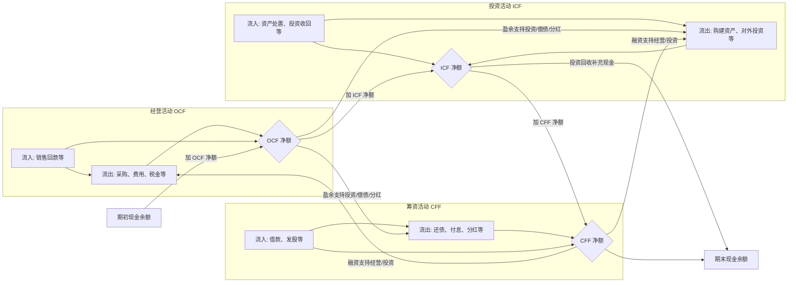
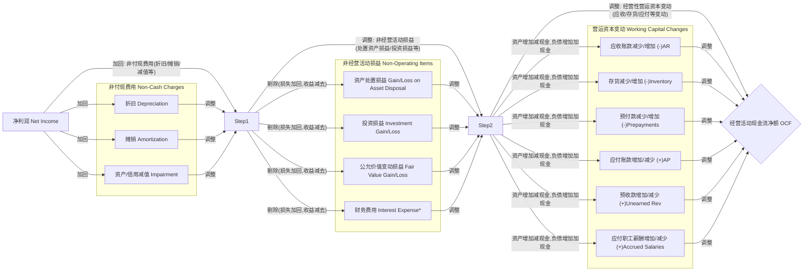
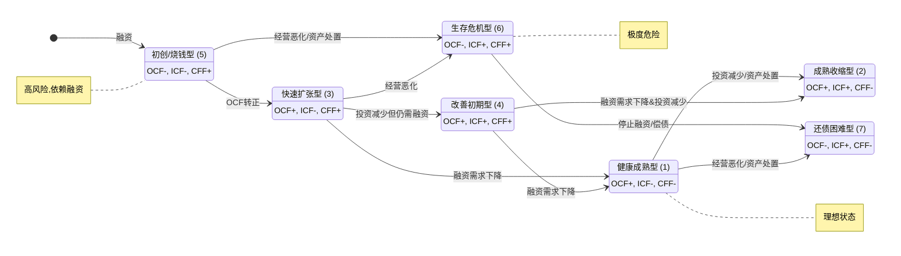

# 第四章：现金流量表深度解析：企业生存与发展的"命脉"

如果说资产负债表是企业的"底子"，利润表是企业的"面子"，那么现金流量表（Statement of Cash Flows）就是企业的"血液"，是维系其生存与发展的真正"命脉"。利润表上的盈利可能只是纸面富贵（尤其是在权责发生制下），而现金流量表则揭示了真金白银的流入和流出，直接关系到企业的支付能力、偿债能力、扩张能力乃至生存能力。

"Cash is King"——现金为王，这句商业世界的古老谚语在财务分析中体现得淋漓尽致。再高的利润，如果无法转化为实实在在的现金流入，企业也可能陷入流动性危机，甚至破产倒闭。作为 CFO，我们对现金流量表的关注程度绝不亚于利润表和资产负债表，甚至在特定时期（如经济下行、信贷收紧或企业快速扩张期）会将其置于首位。理解现金的来龙去脉，预测未来的现金缺口或盈余，是进行有效财务管理和战略决策的基础。本章将深入探讨现金流量表的结构、三大活动现金流的分析要点、利润与现金流的差异以及如何通过现金流判断企业的健康度和风险。

## 4.1 现金流量表结构与核心逻辑

现金流量表旨在反映企业在一定会计期间内现金及现金等价物（Cash and Cash Equivalents）的流入和流出情况。这里的现金不仅指库存现金，还包括银行存款、其他货币资金等可随时用于支付的款项。现金等价物则是指企业持有的期限短（通常指从购买日起三个月内到期）、流动性强、易于转换为已知金额现金、价值变动风险很小的投资。

### 4.1.1 三大活动现金流：经营、投资、筹资的内在联系

现金流量表的核心结构是将企业的全部现金流活动划分为三大类：

1.  **经营活动现金流 (Cash Flows from Operating Activities, OCF):** 指企业投资活动和筹资活动以外的所有交易和事项产生的现金流量。它主要反映了企业通过销售商品、提供劳务等主营业务活动获取现金的能力。这是企业最核心、最基本、最可持续的现金来源。
    *   **主要流入:** 销售商品、提供劳务收到的现金；收到的税费返还；收到其他与经营活动有关的现金。
    *   **主要流出:** 购买商品、接受劳务支付的现金；支付给职工以及为职工支付的现金；支付的各项税费；支付其他与经营活动有关的现金。

2.  **投资活动现金流 (Cash Flows from Investing Activities, ICF):** 指企业长期资产（如固定资产、无形资产、长期股权投资）的购建和不包括在现金等价物范围内的投资及其处置活动产生的现金流量。它反映了企业为维持和扩大经营规模、进行资本运作所进行的现金投入和回收情况。
    *   **主要流入:** 收回投资收到的现金；取得投资收益收到的现金；处置固定资产、无形资产和其他长期资产收回的现金净额；处置子公司及其他营业单位收到的现金净额。
    *   **主要流出:** 购建固定资产、无形资产和其他长期资产支付的现金；投资支付的现金；取得子公司及其他营业单位支付的现金净额。

3.  **筹资活动现金流 (Cash Flows from Financing Activities, CFF):** 指导致企业资本及债务规模和构成发生变化的活动所产生的现金流量。它反映了企业通过股权或债权方式筹集资金以及偿还债务、分配利润等与股东和债权人之间的现金往来。
    *   **主要流入:** 吸收投资（发行股票）收到的现金；取得借款收到的现金；发行债券收到的现金。
    *   **主要流出:** 偿还债务支付的现金；分配股利、利润或偿付利息支付的现金；支付其他与筹资活动有关的现金（如股票回购）。

**三大活动的内在联系:**

这三大活动并非孤立存在，而是相互关联、相互影响，共同构成了企业现金循环的完整图景：



*   健康的模式下，企业通过**经营活动**产生持续稳定的正向现金流 (OCF > 0)，这是生存和发展的基础。
*   这部分现金流首先用于维持现有运营，然后可以用于**投资活动**（如购买设备、技术研发，即 ICF < 0）以支持未来增长，或者用于**筹资活动**（如偿还债务、支付股利、回购股票，即 CFF < 0）。
*   如果经营活动产生的现金不足以支持投资和必要的筹资流出，企业就需要通过**筹资活动**（如借款、发行股票，即 CFF > 0）来获取外部资金"输血"，或者通过**投资活动**（变卖资产，即 ICF > 0）来补充现金。
*   最终，三大活动产生的净现金流量总和，加上汇率变动对现金的影响，就等于当期现金及现金等价物的净增加额，也即期末现金余额与期初现金余额之差。

理解这三大活动的划分和它们之间的逻辑关系，是解读现金流量表、判断企业财务状况的第一步。

### 4.1.2 现金为王：为什么现金流比利润更重要？

利润表基于权责发生制（Accrual Basis）编制，收入在其赚取时确认（不论现金是否收到），费用在其发生时确认（不论现金是否支付）。这使得利润表能更好地匹配收入与费用，反映特定期间的经营业绩。然而，这也导致利润与实际的现金流动可能存在显著差异，甚至背离。

**利润高≠现金流好，为什么？**

1.  **赊销 (Credit Sales):** 大量的销售可能是赊销，记为收入和应收账款，增加了利润，但现金并未流入。如果客户迟迟不付款甚至最终成为坏账，高利润就成了"水中月"。
2.  **存货积压 (Inventory Build-up):** 企业可能生产了大量产品但未能售出，这些产品的成本（材料、人工、制造费用）并未计入当期利润表的营业成本（因为尚未销售），但相关的现金（采购材料、支付工资等）可能已经流出，或者虽然未流出但也占用了营运资金（表现为应付账款增加，但存货也大幅增加）。
3.  **资本性支出 (Capital Expenditures, CapEx):** 购买固定资产、无形资产等大额投资，现金在购买时点大量流出，但其成本是通过折旧或摊销在未来若干年内分期计入利润表的，对当期利润的影响相对较小。
4.  **折旧与摊销 (Depreciation & Amortization):** 这些是非付现成本（Non-cash Charges），它们在利润表中扣除，减少了利润，但并不涉及当期的现金流出。
5.  **债务偿还 (Debt Repayment):** 偿还借款本金是重大的现金流出（体现在筹资活动），但它并不影响利润表（只有利息费用影响利润）。
6.  **营运资本变动 (Changes in Working Capital):** 应收账款、存货、预付款项的增加，以及应付账款、预收款项、应付职工薪酬等的减少，都会导致经营活动现金流出（或流入减少），即使利润表上的收入和成本没有相应变动。

**现金流的重要性体现在：**

*   **支付能力 (Solvency):** 企业需要现金来支付员工工资、供应商货款、偿还到期债务、缴纳税款。没有足够的现金，即使账面盈利，也可能无法履行支付义务，导致信用受损甚至破产。
*   **生存底线 (Survival):** 现金是企业维持运营的"燃料"。持续的现金净流出是不可持续的，最终会耗尽企业的资源。
*   **抗风险能力 (Risk Resilience):** 充裕的现金储备能帮助企业抵御经济下行、行业波动或突发事件带来的冲击，抓住危机中的机遇。
*   **价值创造基础 (Value Creation Basis):** 企业最终的价值在于其未来能产生的自由现金流。现金流是进行投资决策、估值分析的基础。

因此，分析师和 CFO 们常常说："利润只是观点，现金才是事实 (Profit is an opinion, cash is a fact)"。虽然利润表反映了经营成果，但现金流量表揭示了企业的生存状态和真实价值创造能力。两者结合分析，才能全面把握企业的财务健康状况。

### 4.1.3 现金流量表编制方法（直接法/间接法）及其解读侧重

现金流量表的编制主要有两种方法：直接法和间接法。这两种方法主要影响**经营活动现金流 (OCF)** 的列报方式，而投资活动和筹资活动现金流通常采用类似直接法的方式列报。

1.  **直接法 (Direct Method):**
    *   **逻辑:** 直接按照现金收入和现金支出的主要类别（如销售收现、采购付现、工资付现、税费付现等）来报告经营活动的现金流量。
    *   **优点:** 直观地展示了企业经营活动中现金的来源和去向，易于理解各项经营活动对现金流的具体贡献。
    *   **缺点:** 编制所需的数据量较大，需要对企业的现金收支进行详细分类追踪，实务中可能较为复杂。
    *   **报表样式 (示例):**
        ```
        经营活动产生的现金流量：
          销售商品、提供劳务收到的现金
          收到的税费返还
          收到其他与经营活动有关的现金
          经营活动现金流入小计
          购买商品、接受劳务支付的现金
          支付给职工以及为职工支付的现金
          支付的各项税费
          支付其他与经营活动有关的现金
          经营活动现金流出小计
        经营活动产生的现金流量净额 (OCF)
        ```

2.  **间接法 (Indirect Method):**
    *   **逻辑:** 以利润表中的净利润为起点，通过调整非现金项目（如折旧、摊销、资产减值）、非经营活动损益项目（如处置长期资产损益、财务费用、投资收益）以及经营性应收应付项目（营运资本）的变动，来推算出经营活动产生的现金流量净额。
    *   **优点:** 清晰地揭示了净利润与经营活动现金流之间的差异及其原因，有助于分析利润的质量。编制所需数据更容易从现有的利润表和资产负债表中获取。
    *   **缺点:** 不够直观，无法直接看出经营活动现金流入和流出的具体构成。
    *   **报表样式 (示例):**
        ```
        将净利润调节为经营活动现金流量：
          净利润
          加：资产减值准备
              信用减值损失
              固定资产折旧、油气资产折耗、生产性生物资产折旧
              无形资产摊销
              长期待摊费用摊销
              处置固定资产、无形资产和其他长期资产的损失（减：收益）
              固定资产报废损失（减：收益）
              公允价值变动损失（减：收益）
              财务费用（减：收益）
              投资损失（减：收益）
              递延所得税资产减少（加：增加）
              递延所得税负债增加（减：减少）
              存货的减少（加：增加）
              经营性应收项目的减少（加：增加）
              经营性应付项目的增加（减：减少）
              其他
        经营活动产生的现金流量净额 (OCF)
        ```

**解读侧重：**

*   **国际准则与实务:** IFRS 和 US GAAP 都鼓励使用直接法，但允许使用间接法。在实务中，绝大多数公司（尤其是在美国）采用间接法列报 OCF，但同时要求在附注中披露直接法下的一些关键信息（如销售收现、利息支付、所得税支付等）。中国 CAS 要求企业必须在主表中以直接法列示 OCF，并在附注中提供间接法的调节过程。
*   **分析视角:** 无论采用哪种方法列报，两种方法提供的信息对于分析都是有价值的。
    *   **直接法数据 (或附注披露):** 重点关注"销售商品、提供劳务收到的现金"与利润表营业收入的对比，评估收入的"含金量"和回款能力。
    *   **间接法调节过程:** 重点关注净利润与 OCF 的差异。差异的主要来源是什么？是大量的非付现费用（如折旧摊销，通常是好事），还是营运资本的大幅变动（如应收账款、存货激增导致现金流恶化，通常是坏事）？这有助于深入判断盈利质量。

作为 CFO，我们需要同时理解这两种方法的逻辑和信息含量，以便更全面地解读经营活动现金流的真实状况。

## 4.2 经营活动现金流（OCF）：利润的"试金石"

经营活动现金流 (OCF) 是现金流量表中最重要的组成部分，被誉为利润的"试金石"。它直接反映了企业依靠其核心业务自我造血、产生现金的能力。一个健康的企业，其 OCF 应该是持续稳定为正，并且能够支撑其必要的投资和偿债需求。

### 4.2.1 净利润与 OCF 的差异分析：寻找盈利质量线索

间接法下的 OCF 计算过程，本身就是一部精彩的"侦探小说"，它揭示了从账面利润（净利润）到实际经营现金流（OCF）之间的层层迷雾。分析两者之间的差异，是判断盈利质量的关键手段。

**核心调节逻辑 (间接法):**



**关键差异分析点：**

1.  **OCF / 净利润 比率:**
    *   理想状态下，这个比率应该接近或大于 1。意味着每 1 元的净利润，对应着 1 元或更多的经营现金流入。
    *   如果长期 < 1，需要警惕：
        *   **盈利质量差:** 可能存在大量无法转化为现金的收入（如应收账款激增）、或者成本费用确认不足（如存货跌价准备计提不足）。
        *   **营运资本管理不善:** 存货积压、应收账款回收缓慢、过度依赖供应商信用等，都可能导致 OCF 滞后于利润增长。
    *   如果 > 1，通常是积极信号，可能原因：
        *   **高额非付现费用:** 大量的折旧、摊销（意味着前期有较大投资）。
        *   **有效的营运资本管理:** 如加速回款、优化库存、延长付款周期（占用供应商资金）。
        *   **预收账款模式:** 如软件、服务行业，先收款后提供服务，导致 OCF 领先于利润。

2.  **主要调节项分析:**
    *   **非付现费用 (折旧、摊销、减值):** 这些是 OCF 的稳定贡献者。金额大通常表明企业是重资产型或前期有大量无形资产投入/并购商誉。关注减值损失的合理性（见 3.4.2）。
    *   **营运资本变动:** 这是 OCF 波动的主要来源之一，也是管理层可以施加较大影响的领域。
        *   **应收账款增加:** OCF 的减项。增速远超收入增速是危险信号，提示回款风险或虚增收入可能。
        *   **存货增加:** OCF 的减项。需要结合存货周转率分析，判断是为未来销售备货（合理）还是产品滞销（风险）。
        *   **经营性应付项目增加（应付账款、应付票据等）:** OCF 的加项。适度增加表明公司议价能力强，能占用供应商资金。但过度增加或长期居高不下，可能预示支付困难或隐藏债务。
    *   **非经营活动损益调整:** 剔除投资、筹资活动对净利润的影响，还原经营活动的"纯粹"现金流。例如，处置固定资产的收益在净利润中，但其现金流入属于投资活动，故需在 OCF 调节中减去。

**CFO 的视角：**

*   **持续监控 OCF/NI 比率:** 将其作为核心的盈利质量监控指标。
*   **深入分析调节项:** 不能只看 OCF 总额，要深入分析各项调节的绝对额和变动趋势，找出影响 OCF 的关键驱动因素。
*   **结合业务理解:** 将财务数据与业务实际相结合。应收账款增加是因为拓展了新客户，还是放松了信用政策？存货增加是为了应对旺季，还是产品过时？
*   **预测与管理:** 基于对差异原因的理解，预测未来 OCF 趋势，并采取措施改善营运资本效率，提升 OCF 水平。

净利润与 OCF 的差异分析是财务分析的"重头戏"，能够帮助我们识别利润表可能存在的"水分"，评估企业真实的造血能力和运营风险。

### 4.2.2 "销售商品、提供劳务收到的现金" vs. 营业收入：回款能力透视

直接法下的第一项（或间接法附注中通常会披露）——"销售商品、提供劳务收到的现金"（简称"销售收现"），是检验利润表营业收入"含金量"的直接指标。

**核心比率：销售收现比率 (Cash Conversion Ratio of Sales)**

$$
\text{销售收现比率} = \frac{\text{销售商品、提供劳务收到的现金}}{\text{营业收入}} \times 100\%
$$

*注：更精确的计算应考虑增值税的影响。对于含税收入，分母应使用含税营业收入；对于不含税收入，分子"销售收现"应剔除收到的销项税额部分。简单分析时可用营业收入近似。*

**分析要点：**

1.  **比率水平与趋势:**
    *   理想情况下，该比率应接近 100% 或更高（可能包含预收账款）。这意味着大部分甚至全部的营业收入都转化为了实实在在的现金流入。
    *   **持续低于 100%（或显著低于行业水平）:** 是重要的警示信号，表明：
        *   **回款能力弱:** 大量销售是赊销，应收账款高企，资金被客户占用。
        *   **坏账风险高:** 长期的低收现比可能预示着应收账款质量差，未来可能发生大额坏账损失。
        *   **收入确认可能存在问题:** 极端情况下，可能是虚增收入的迹象（没有真实交易，自然没有现金流入）。
    *   **比率波动:** 分析比率的波动原因。是季节性因素？信用政策调整？还是客户结构变化？

2.  **与应收账款周转率结合分析:**
    *   低销售收现比率通常伴随着低应收账款周转率（或高周转天数）。两者相互印证，都指向回款慢、资金占用严重的问题。

3.  **与预收账款变动结合分析:**
    *   如果销售收现比率 > 100%，可能是因为当期收到了较多的预收账款（客户预付款）。需要关注预收账款的变动情况，判断这种高收现比的可持续性。

**CFO 的视角：**

*   **核心监控指标:** 将销售收现比率作为销售部门和信用管理部门的关键绩效指标 (KPI) 之一。
*   **信用政策评估:** 定期审视公司的信用政策，平衡销售增长与回款风险。
*   **客户信用管理:** 加强客户信用评估和账款催收管理。
*   **风险预警:** 对销售收现比率持续恶化的客户或业务线进行重点关注和风险排查。
*   **与利润表交叉验证:** 该比率是验证营业收入真实性和质量的有力工具。

"销售收现"是经营活动现金流的源头活水。守住这个源头，确保收入能及时、足额地转化为现金，是企业稳健经营的基石。

### 4.2.3 OCF 的可持续性与自由现金流（FCF）初探

分析 OCF 不仅要看当期金额，更要关注其**可持续性 (Sustainability)**。一次性的因素（如某期收到大额税收返还、或临时大力压缩营运资本）可能导致单期 OCF 虚高，但无法持久。

**评估 OCF 可持续性的方法：**

*   **长期趋势分析:** 观察过去几年 OCF 的变化趋势。是稳定增长，还是波动剧烈，或是持续下滑？
*   **剔除异常项目:** 识别并剔除偶然性、一次性因素（如附注中披露的重大政府补助收现、重大诉讼赔款收现/付现等）对 OCF 的影响，观察"核心 OCF"的趋势。
*   **与主营业务匹配度:** OCF 的增长是否与主营业务（如收入、核心利润）的增长趋势相匹配？如果主业增长，OCF 却停滞或下滑，通常是危险信号。
*   **营运资本管理效率:** 分析营运资本项目（应收、存货、应付）的周转率和占比趋势。持续优化的营运资本管理有助于 OCF 的可持续性，而过度依赖延长付款周期等方式提升 OCF 则难以持久。

**自由现金流 (Free Cash Flow, FCF) 初探:**

OCF 虽然重要，但它并非企业可以完全自由支配的现金。企业需要从中拿出一部分用于维持现有生产能力、进行必要的资本投入（即维持性资本支出），剩下的才是真正可以"自由"地用于回报股东（分红、回购）、偿还债务、或进行扩张性投资的现金。

**自由现金流 (FCF) 的基本概念:**

FCF 是衡量企业在维持运营和现有资产基础后，能够产生的可供所有投资者（包括债权人和股东）支配的现金流量。

一个简化的理解（更精确定义见 4.5.2）：

$$
\text{FCF} \approx \text{经营活动现金流净额 (OCF)} - \text{资本性支出 (CapEx)}
$$

*   **资本性支出 (CapEx):** 通常指投资活动中"购建固定资产、无形资产和其他长期资产支付的现金"。需要注意的是，这部分现金流可能包含维持性 CapEx (用于替换旧设备、维持现有产能) 和增长性 CapEx (用于扩大产能、开发新项目)。理论上计算 FCF 应只减去维持性 CapEx，但实务中区分困难，常直接使用总 CapEx 或进行估算。

**为什么 FCF 重要？**

*   **价值核心:** FCF 是企业价值评估（尤其是 DCF 估值法）的核心输入变量。企业价值最终取决于其未来产生自由现金流的能力。
*   **真实回报能力:** FCF 反映了企业真正能用来回报投资者的现金，比净利润或 OCF 更能体现股东价值。
*   **财务弹性:** 持续为正且不断增长的 FCF 意味着企业财务状况健康，有能力进行扩张、偿债、分红，具有较强的财务弹性。

**CFO 的视角：**

*   **关注 OCF 质量与持续性:** 确保 OCF 来源健康、可持续，是产生 FCF 的基础。
*   **管理资本支出:** 平衡维持性投入和增长性投入，优化资本支出效率，避免无效投资侵蚀 FCF。
*   **将 FCF 作为关键目标:** 将最大化可持续的自由现金流作为重要的财务管理目标之一。

OCF 是基础，而 FCF 是更进一步的价值体现。评估 OCF 的可持续性，并初步理解 FCF 的概念，有助于我们更深入地把握企业的真实造血能力和长期价值创造潜力。

## 4.3 投资活动现金流（ICF）：扩张、收缩与战略意图

投资活动现金流 (ICF) 反映了企业在长期资产（固定资产、无形资产、长期股权投资等）和金融资产（不含现金等价物）方面的投入与回收情况。ICF 的净额通常为负，表明企业在进行投资以维持或扩大经营。其构成和变动趋势，是解读企业战略意图、判断未来发展潜力的重要窗口。

### 4.3.1 构建固定资产、无形资产支付的现金：资本开支强度与方向

**"购建固定资产、无形资产和其他长期资产支付的现金"** 是 ICF 中最核心、最常见的流出项目，通常被称为**资本性支出 (Capital Expenditures, CapEx)**。

**分析要点：**

1.  **CapEx 规模与强度:**
    *   **绝对金额:** CapEx 的绝对规模有多大？与历史水平、竞争对手相比如何？
    *   **CapEx / 营业收入 比率:** 衡量资本开支相对于经营规模的强度。高比率通常见于重资产行业（制造、能源、交通等）或快速扩张期。
    *   **CapEx / 折旧摊销 比率:**
        *   如果 ≈ 1，可能表明 CapEx 主要用于维持现有产能（替换旧设备）。
        *   如果 > 1，表明有增长性投资，企业在扩大规模或升级技术。
        *   如果 < 1，可能意味着投资不足，现有产能在老化，或者企业处于收缩期/轻资产模式。

2.  **CapEx 方向与结构:**
    *   **投向:** 资金主要投向了哪些领域？是厂房设备（扩大产能）？研发相关的无形资产（技术创新）？信息系统建设（提升效率）？土地使用权？
    *   **维持性 vs. 增长性:** 尝试区分 CapEx 中有多少是维持现有运营所必需的，有多少是为了未来增长。虽然财报不直接披露，但可以通过对比折旧、分析项目性质、参考管理层讨论等方式进行估算。增长性 CapEx 占比高通常预示着更好的发展前景（但也伴随更高风险）。

3.  **投资效率:**
    *   CapEx 投入后，是否带来了预期的效益？如收入增长、利润提升、效率改善？这需要结合利润表、资产负债表（如固定资产周转率）进行长期跟踪分析。
    *   警惕过度投资、低效投资。持续的大额 CapEx 但未能带来相应回报，是价值毁灭的信号。

**CFO 的视角：**

*   **资本预算管理:** 建立严格的资本预算流程，对投资项目的可行性、回报率、风险进行充分评估和审批。
*   **投后管理:** 跟踪投资项目的进展和效益，及时发现问题并调整。
*   **优化投资结构:** 平衡维持性与增长性投入，将有限的资源投向回报最高、最符合战略方向的领域。
*   **沟通战略意图:** 通过分析师会议、财报披露等方式，向市场清晰解释资本开支的计划、目的和预期回报，管理投资者预期。

CapEx 是企业塑造未来的关键投入。对其强度、方向和效率的分析，有助于我们理解企业的增长战略和长期竞争力。

### 4.3.2 收购与出售子公司/资产：并购整合与资产处置策略

除了常规的 CapEx，投资活动现金流还反映了企业通过并购（M&A）进行扩张，或通过出售资产/业务进行收缩或战略调整的活动。

**分析要点：**

1.  **并购活动 (Acquisitions):**
    *   **"取得子公司及其他营业单位支付的现金净额":** 这是并购活动的主要现金流出项。
    *   **频率与规模:** 企业是否频繁进行并购？并购规模有多大？是小额补充性收购，还是改变格局的大型并购？
    *   **战略逻辑:** 并购的目的是什么？是获取技术、进入新市场、扩大规模、消灭竞争对手？
    *   **整合风险:** 并购后的整合是关键。关注并购是否带来了预期的协同效应？是否存在整合不力、商誉减值（见 3.4.2, 8.2）的风险？
    *   **支付方式:** 并购通常涉及现金、股票或两者结合。现金流量表主要反映现金支付部分。大规模现金并购会消耗大量现金，增加财务压力。

2.  **资产/业务处置 (Divestitures):**
    *   **"处置固定资产、无形资产和其他长期资产收回的现金净额":** 反映出售长期经营性资产的现金流入。
    *   **"处置子公司及其他营业单位收到的现金净额":** 反映出售整个业务单元或子公司的现金流入。
    *   **原因分析:** 出售的原因是什么？是剥离非核心业务、聚焦主业？是为了偿还债务、补充现金流（可能是不良信号）？还是仅仅是资产更新换代？
    *   **对业务的影响:** 出售的是盈利能力强还是弱的资产/业务？对公司未来的收入和利润有何影响？

**CFO 的视角：**

*   **并购尽职调查:** 在并购前进行充分的财务、法律、业务尽职调查，评估标的价值和风险。
*   **整合计划:** 制定清晰的并购后整合计划，监控整合进度和效果。
*   **资产剥离决策:** 定期审视资产组合，识别并处置不符合战略方向、回报低下或风险过高的资产/业务。
*   **现金流影响评估:** 评估并购或资产处置对公司短期和长期现金流的影响，确保交易的可行性。
*   **信息披露与沟通:** 对重大的并购或处置交易，向市场充分披露交易细节、战略意义和财务影响。

并购和资产处置是企业调整战略、优化结构的重要手段，其在投资活动现金流中的体现，为我们提供了洞察企业战略动向的宝贵线索。

### 4.3.3 投资支付/收回的现金：对外投资活动与风险

除了对经营性长期资产和并购的投入，企业还可能进行金融性质的投资活动，如购买股票、债券、基金、理财产品等（不属于现金等价物的部分）。

**分析要点：**

1.  **"投资支付的现金":** 反映购买各类金融资产的现金流出。
2.  **"收回投资收到的现金":** 反映出售金融资产或到期收回本金的现金流入。
3.  **"取得投资收益收到的现金":** 反映持有金融资产期间收到的利息、股利等现金流入（注意与利润表中的"投资收益"区分，后者可能包含未实现的公允价值变动）。

**分析视角：**

*   **投资规模与性质:** 企业对外金融投资的规模有多大？主要是短期交易性投资，还是长期战略性持股？投资标的的风险如何？
*   **投资目的:** 是为了提高闲置资金收益率？还是为了战略合作或产业链布局？
*   **与主业关系:** 投资活动是否偏离主业？是否存在"不务正业"、过度投机的风险？
*   **收益与风险:** 对外投资实际产生的现金回报（取得投资收益收到的现金 + 处置净收益）如何？是否承担了过高的风险？关注金融资产减值的风险。
*   **流动性影响:** 大规模的短期投资支付和收回可能导致 ICF 波动较大。需要评估这些投资的流动性，以及对整体现金管理的影响。

**CFO 的视角：**

*   **投资策略与风险控制:** 制定清晰的对外投资策略和风险管理制度，确保投资活动与公司整体战略和风险承受能力相匹配。
*   **流动性管理:** 平衡投资收益与流动性需求，避免过度配置低流动性资产影响日常运营。
*   **关注信息披露:** 仔细阅读财报附注中关于金融资产投资的详细信息（类别、公允价值、风险等）。

对外金融投资可以为企业带来额外收益，但也可能引入新的风险。分析相关现金流有助于评估企业的投资策略和风险偏好。

## 4.4 筹资活动现金流（CFF）：融资策略与财务风险

筹资活动现金流 (CFF) 反映了企业与资金提供者（股东和债权人）之间的现金往来，揭示了企业的融资策略、偿债压力和对股东的回报情况。CFF 的净额及其构成，是判断企业财务风险、资本结构变化和股东回报政策的重要依据。

### 4.4.1 吸收投资与发行债券收到的现金：股权与债权融资偏好

当企业需要外部资金支持经营或投资活动时，主要通过股权融资或债权融资来实现，这直接体现为筹资活动的现金流入。

**主要流入项目：**

1.  **"吸收投资收到的现金":**
    *   **来源:** 主要指发行新股（IPO、增发、配股）收到的现金。对于非上市公司，则包括股东投入的资本金。
    *   **分析:** 反映了企业的股权融资活动。大规模的股权融资可以快速补充资本金、降低负债率，但会稀释原有股东的权益（见 3.5.1）。频繁进行股权融资可能表明内生造血能力不足，或者处于高速扩张期。

2.  **"取得借款收到的现金":**
    *   **来源:** 主要指向银行或其他金融机构取得的短期或长期借款。
    *   **分析:** 反映了企业的间接债权融资活动。借款可以利用财务杠杆放大收益，但也会增加利息负担和偿债风险。

3.  **"发行债券收到的现金":**
    *   **来源:** 指企业在资本市场上公开发行或非公开发行债券募集到的资金。
    *   **分析:** 反映了企业的直接债权融资活动。通常只有信用评级较好的大型企业才能顺利发债。债券融资规模、利率、期限等反映了企业的市场认可度和融资成本。

**分析视角：**

*   **融资结构偏好:** 企业更倾向于股权融资还是债权融资？这反映了管理层对资本结构、财务风险和股东控制权的取舍。债权融资成本通常低于股权融资，但风险更高。
*   **融资能力:** 企业获取外部资金的能力如何？能否顺利获得银行贷款？发股或发债是否受市场欢迎？融资成本（利率）处于什么水平？
*   **融资时机与用途:** 融资发生在什么时期？（是经营困难时"救急"，还是发展良好时"扩张"？）募集的资金主要用于什么？（是补充流动资金、项目投资，还是偿还旧债？）

**CFO 的视角：**

*   **优化融资结构:** 根据公司战略、市场环境、融资成本和风险承受能力，动态调整股权与债权融资的比例，寻求最优资本结构。
*   **拓展融资渠道:** 维护与银行、投资机构的关系，拓展多元化的融资渠道。
*   **管理融资成本:** 抓住有利的市场窗口进行融资，努力降低融资成本。
*   **投资者关系管理:** 就融资计划和用途与投资者进行有效沟通。

分析筹资活动现金流入，有助于我们理解企业的融资策略、能力和对不同融资方式的依赖程度。

### 4.4.2 偿还债务与分配股利支付的现金：偿债压力与分红意愿

筹资活动现金流出主要反映了企业对资金提供者的回报和义务履行情况。

**主要流出项目：**

1.  **"偿还债务支付的现金":**
    *   **来源:** 指偿还各种借款本金（银行贷款、债券到期兑付等）所支付的现金。
    *   **分析:** 这是衡量企业偿债压力的直接指标。该项金额相对于"取得借款收到的现金"和 OCF 的规模，可以判断企业是处于净融资状态还是净偿债状态。持续高额的偿债支出意味着财务负担较重，需要关注其现金流能否覆盖。

2.  **"分配股利、利润或偿付利息支付的现金":**
    *   **来源:** 包括向普通股股东支付的现金股利、向优先股股东支付的股利，以及支付给债权人的利息。
        *   *注意：在中国会计准则下，支付的利息通常计入筹资活动现金流出。但在 IFRS/US GAAP 下，利息支付可以归类为经营活动或筹资活动，需查看企业具体采用的会计政策。股利支付通常归为筹资活动。*
    *   **分析:**
        *   **股利支付:** 反映了公司的分红政策和对股东的回报意愿。持续、稳定的股利支付通常被视为公司经营稳健、现金流充裕的积极信号。但也需要考虑公司的发展阶段，成长型公司可能倾向于将利润留存用于再投资而不是分红。
        *   **利息支付:** 反映了债务融资的成本。金额大小取决于债务规模和利率水平。

3.  **"支付其他与筹资活动有关的现金":**
    *   **来源:** 可能包括股票回购支付的现金、支付融资租赁款、减少注册资本支付的现金等。
    *   **分析:**
        *   **股票回购:** 通常被视为对股价有利的信号，表明管理层认为股价被低估，或者希望提升每股收益、回报股东。但也消耗大量现金。

**分析视角：**

*   **偿债能力:** 企业是否有足够的现金（主要来自 OCF）来偿还到期债务和支付利息？`(OCF + 取得借款收到的现金)` 是否能覆盖 `(偿还债务支付的现金 + 利息支付)`？
*   **分红政策:** 分红是否稳定、可持续？分红支付占净利润（股利支付率）或 OCF 的比例是否合理？过高的分红比例可能影响企业的再投资能力。
*   **股东回报方式:** 企业更倾向于通过分红还是股票回购来回报股东？

**CFO 的视角：**

*   **债务期限管理:** 合理安排债务期限结构，避免偿债高峰过于集中。
*   **现金流预测:** 准确预测未来现金流，确保有足够资金履行偿债和付息义务。
*   **股利政策制定:** 在考虑股东回报、再投资需求、现金流状况和法律法规限制的基础上，制定稳定、可持续的股利政策。
*   **资本运作:** 在现金流充裕且股价合理时，考虑运用股票回购等方式优化资本结构、提升股东价值。

筹资活动现金流出直接关系到企业的信用、股东关系和长期财务健康。

### 4.4.3 融资结构变化及其对未来现金流的影响

通过对筹资活动现金流入和流出的综合分析，我们可以洞察企业融资结构（资本结构）的变化趋势及其对未来现金流的潜在影响。

**分析要点：**

1.  **净融资额 (Net Financing):** `CFF 净额 = 筹资流入 - 筹资流出`。
    *   **CFF > 0:** 净融资状态。企业从外部获取了资金，可能是为了支持经营亏损、大规模投资，或者仅仅是优化资本结构。
    *   **CFF < 0:** 净偿还/回报状态。企业用经营或投资活动产生的现金偿还了债务、支付了股利或回购了股票。

2.  **资本结构变化:**
    *   **杠杆率变化:** 持续大规模的债权融资（取得借款/发债 > 偿还债务）会导致资产负债率上升，财务杠杆加大。\反之，则杠杆率下降。
    *   **股权结构变化:** 增发股票会扩大股本，可能引入新的战略投资者；股票回购则会减少流通股本，提高每股收益。

3.  **对未来现金流的影响:**
    *   **增加债务:** 会增加未来的利息支付（影响 OCF 或 CFF）和本金偿还（影响 CFF）压力。
    *   **增加股权:** 会增加未来潜在的股利支付（影响 CFF）压力，但没有固定的偿还本金义务。
    *   **融资成本变化:** 如果企业通过高成本融资（如高息借款）替换低成本融资，或整体融资环境恶化，将增加未来的利息支出。

**CFO 的视角：**

*   **动态优化资本结构:** 密切关注宏观经济、资本市场和公司自身状况的变化，动态调整融资策略，维持合理的资本结构，平衡收益、风险和成本。
*   **压力测试:** 对未来可能的利率上升、融资渠道收紧等情况进行压力测试，评估公司的偿债能力和现金流风险。
*   **预测未来融资需求:** 基于公司的战略规划和投资计划，预测未来的融资需求，提前做好融资安排。

融资结构并非一成不变，分析 CFF 可以帮助我们理解其演变路径，并预判其对企业未来财务表现和风险状况的深远影响。

## 4.5 现金流综合分析与风险预警

单独分析 OCF、ICF、CFF 各项活动还不够，需要将它们结合起来，从整体上把握企业的现金流模式、健康状况和潜在风险。自由现金流的计算与分析，以及对现金流枯竭信号的识别，是综合分析的关键环节。

### 4.5.1 OCF/ICF/CFF 组合模式解读：判断企业发展阶段与健康度

将三大活动现金流的净额（正/负号）进行组合，可以形成不同的模式，这些模式往往与企业所处的发展阶段和财务健康状况密切相关。

**常见的现金流组合模式：**

| 模式 | OCF | ICF | CFF | 可能的企业状态                                  | 解读与关注点                                                                                                                               |
| :--- | :-: | :-: | :-: | :---------------------------------------------- | :----------------------------------------------------------------------------------------------------------------------------------------- |
| 1    |  +  |  -  |  -  | **健康成熟型 (Mature & Healthy)**                 | **理想模式:** 主业造血强劲 (OCF+)，持续投资未来 (ICF-)，并有余力回报股东/债权人 (CFF-)。如：行业龙头、稳定增长企业。                        |
| 2    |  +  |  +  |  -  | **成熟收缩型 / 战略调整型 (Mature & Shrinking / Strategic Shift)** | OCF 仍为正，但投资活动收缩 (ICF+，如变卖资产)，同时偿债/分红 (CFF-)。可能在剥离非核心业务，或行业进入衰退期。需关注 OCF 是否能持续。             |
| 3    |  +  |  -  |  +  | **快速扩张型 (Rapid Expansion)**                   | OCF 尚可，但不足以支撑大规模投资 (ICF-)，需要外部融资 (CFF+)。常见于高速成长的企业。需关注 OCF 增长能否跟上投资步伐，以及融资依赖度。         |
| 4    |  +  |  +  |  +  | **改善初期型 / 待观察型 (Early Improvement / Wait & See)** | OCF 转正，同时变卖资产 (ICF+)，并继续融资 (CFF+)。可能刚走出困境，或在为重大转型储备资金。需观察 OCF 的稳定性和未来投资计划。                  |
| 5    |  -  |  -  |  +  | **初创/烧钱型 (Startup / Cash Burning)**           | **高风险模式:** 主业亏损现金 (OCF-)，仍需大量投资 (ICF-)，严重依赖外部输血 (CFF+)。如：未盈利的科技/生物公司。关键看 OCF 何时能转正，融资能否持续。 |
| 6    |  -  |  +  |  +  | **生存危机型 (Survival Crisis)**                 | **危险模式:** 主业亏损现金 (OCF-)，被迫变卖资产 (ICF+)，同时继续举债/融资 (CFF+)。可能濒临破产。需极度警惕。                                |
| 7    |  -  |  +  |  -  | **还债困难型 / 变卖家产还债 (Debt Difficulty / Selling Assets to Repay)** | 主业亏损现金 (OCF-)，变卖资产 (ICF+) 以偿还债务/分红 (CFF-)。财务状况非常紧张。                                                               |
| 8    |  -  |  -  |  -  | **极罕见/异常型 (Very Rare / Abnormal)**            | OCF/ICF/CFF 均为负。几乎不可能持续，除非有巨额期初现金。通常是数据错误或极端情况。                                                              |



**分析视角：**

*   **单一模式判断局限性:** 不能仅凭一期财报的模式下定论，需要结合历史趋势、行业特点、公司战略综合判断。
*   **关注模式转变:** 企业现金流模式的转变往往预示着经营状况或战略方向的重大变化。
*   **健康标志:** 长期稳定的 OCF 正流入是核心。ICF 持续为负表明投资未来，CFF 为负表明有能力回报投资者。模式 1 是最理想、最可持续的状态。

通过分析现金流组合模式，我们可以快速把握企业的整体财务状况、发展阶段和潜在风险点。

### 4.5.2 自由现金流（FCFE/FCFF）的计算与意义：真正可支配的现金

前面（4.2.3）我们初步接触了自由现金流 (FCF) 的概念。这里我们更深入地探讨两种常用的自由现金流：股权自由现金流 (FCFE) 和公司自由现金流 (FCFF)。它们是进行企业估值和评价价值创造能力的核心指标。

1.  **公司自由现金流 (Free Cash Flow to Firm, FCFF):**
    *   **定义:** 指企业在维持运营和资本投入后，可供**所有**投资者（包括债权人和股东）支配的现金流量。
    *   **计算方法 (基于 OCF):**
        $$
        \text{FCFF} = \text{经营活动现金流净额 (OCF)} - \text{资本性支出 (CapEx)} + \text{税后利息费用*}
        $$
        *   *更常用的计算方法 (基于 EBIT):*
        $$
        \text{FCFF} = \text{息税前利润 (EBIT)} \times (1 - \text{所得税税率}) + \text{折旧与摊销} - \text{资本性支出 (CapEx)} - \text{净营运资本增加额}
        $$
        *   *税后利息费用 = 利息费用 \times (1 - 所得税税率)*。在基于 OCF 计算 FCFF 时需要加回，因为 OCF (间接法起点是净利润) 中已经扣除了税后利息，而 FCFF 是给所有投资者的，需要包含给债权人的部分。
    *   **意义:** FCFF 是 DCF 估值法中常用的自由现金流口径，用于计算企业整体价值 (Enterprise Value)。它不受资本结构影响，反映了企业核心资产的现金生成能力。

2.  **股权自由现金流 (Free Cash Flow to Equity, FCFE):**
    *   **定义:** 指企业在满足了维持运营、资本投入以及对债权人支付（利息和本金偿还）后，可供**普通股股东**支配的现金流量。
    *   **计算方法 (基于 FCFF):**
        $$
        \text{FCFE} = \text{FCFF} - \text{税后利息费用} + \text{净债务增加额*}
        $$
        *   *净债务增加额 = 新增债务 - 偿还债务本金*。新增债务是股东可用的现金来源，偿还债务是现金流出。
    *   **计算方法 (基于净利润):**
        $$
        \text{FCFE} = \text{净利润} + \text{折旧与摊销} - \text{资本性支出 (CapEx)} - \text{净营运资本增加额} + \text{净债务增加额}
        $$
    *   **计算方法 (基于 OCF):**
        $$
        \text{FCFE} = \text{经营活动现金流净额 (OCF)} - \text{资本性支出 (CapEx)} + \text{净债务增加额}
        $$
    *   **意义:** FCFE 是 DDM（股利贴现模型）估值的一种替代或补充，直接用于计算股权价值 (Equity Value)。它反映了股东可以实际拿到手或公司可以用来分红、回购的现金。

**分析与应用：**

*   **价值评估:** FCFE 和 FCFF 是内在价值评估的基石。
*   **股东回报能力:** FCFE 直接衡量了公司回报股东（分红、回购）的潜力。
*   **财务健康度:** 持续为正且增长的自由现金流是企业财务健康的有力证明。
*   **与 OCF/净利润对比:** FCFE/FCFF 通常小于 OCF 和净利润，因为扣除了必要的资本支出。如果 FCF 持续为负，即使 OCF 和净利润为正，也表明企业可能存在过度投资或营运资本效率低下的问题，长期难以为继。

**CFO 的视角：**

*   **以 FCF 为导向:** 将提升可持续的自由现金流作为核心财务目标，驱动运营改善和投资决策。
*   **精细化管理:** 关注影响 FCF 的各个环节：提升 OCF、优化 CapEx 效率、有效管理营运资本和融资结构。
*   **价值沟通:** 在与投资者沟通时，强调公司的 FCF 表现和未来潜力。

自由现金流是衡量企业价值创造能力的"终极"指标，理解其计算和意义对于 CFO 和投资者都至关重要。

### 4.5.3 现金流枯竭的早期信号识别

现金流是企业的生命线，现金流枯竭往往是导致企业失败的直接原因。作为 CFO，必须具备高度的风险敏感性，及时识别现金流可能出现问题的早期信号，防患于未然。

**需要警惕的现金流风险信号：**

1.  **经营活动现金流 (OCF) 持续为负或大幅下滑:** 这是最危险的信号，表明主营业务自身无法产生足够的现金来维持运营，生存基础动摇。
2.  **OCF 远低于净利润，且差距持续扩大:** 提示盈利质量低下，利润无法转化为现金，可能隐藏着应收账款、存货或收入确认方面的问题。
3.  **销售收现比率持续低于行业水平或呈下降趋势:** 表明回款能力弱，坏账风险增加。
4.  **依赖变卖资产（ICF 为正）来补充经营所需现金:** 表明 OCF 不足，靠"卖家当"度日，难以持续。
5.  **过度依赖外部融资（CFF 持续为正且规模较大）来弥补 OCF 的不足:** 企业造血能力差，生存依赖外部"输血"，一旦融资环境收紧或成本上升，将面临巨大风险。
6.  **自由现金流 (FCF/FCFE/FCFF) 持续为负:** 表明企业产生的现金不足以覆盖维持运营和必要的投资，长期看是在毁灭价值。
7.  **现金余额持续下降，或维持在极低水平:** 缺乏安全垫，抗风险能力差，可能无法应对突发的支付需求。
8.  **债务规模快速增长，特别是短期债务:** 偿债压力加大，再融资风险提高。
9.  **融资成本显著上升:** 表明企业信用风险增加，或整体融资环境恶化。
10. **营运资本指标恶化:** 应收账款周转天数、存货周转天数持续增加，表明资金被大量占用，周转效率低下。
11. **频繁变更会计政策或会计估计（尤其涉及现金流相关项目）:** 可能是在掩盖问题。
12. **审计报告中出现与现金流相关的强调事项或保留意见:** 审计师提示的风险信号。

**CFO 的应对：**

*   **建立预警体系:** 将上述信号纳入财务风险监控体系，设定预警阈值。
*   **加强现金流预测:** 提高现金流预测的频率和准确性，及时发现潜在缺口。
*   **优化营运资本:** 采取措施加速回款、压缩库存、合理安排付款。
*   **控制成本费用:** 削减不必要的开支。
*   **审慎投资:** 暂停或削减非核心、低回报的投资项目。
*   **拓展融资渠道:** 保持与金融机构的良好沟通，准备备用信贷额度。
*   **及时沟通:** 向管理层、董事会和投资者及时、透明地沟通现金流风险和应对措施。

对现金流风险信号保持高度警惕，并采取果断措施，是 CFO 保护企业渡过难关、实现可持续发展的关键职责。

---

现金流量表提供了与利润表和资产负债表截然不同但又紧密相连的视角。通过深入分析三大活动现金流、利润与现金的差异、自由现金流以及各种风险信号，我们可以更真实地把握企业的经营状况、财务健康度和未来前景。掌握现金流量表的分析方法，是每一位希望像 CFO 一样思考的专业人士的必备技能。接下来，我们将学习如何运用财务比率这一强大的工具，对企业的各项能力进行量化评价与比较。
