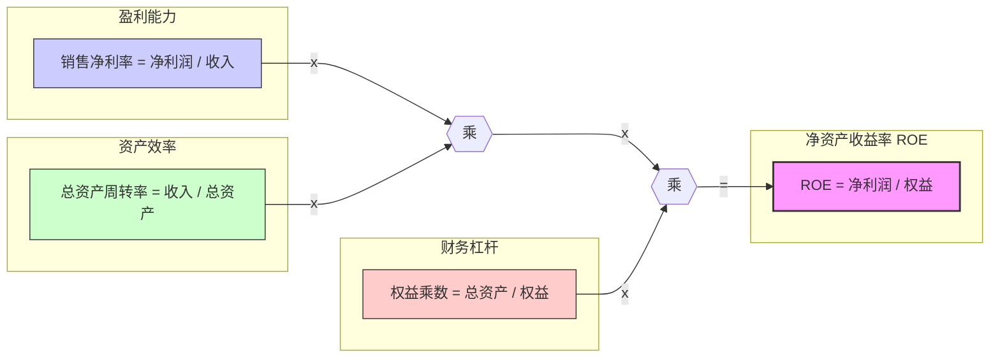
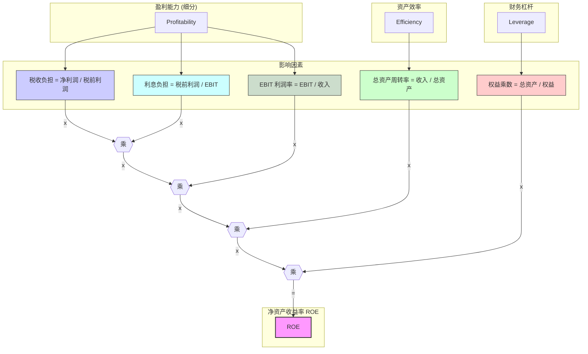

# 第六章：综合分析与体系应用：超越比率看全局

经过前面章节对三大报表的逐一解构和关键财务比率的学习，我们已经掌握了评估企业财务健康状况、经营效率、盈利能力和成长潜力的基本工具。然而，仅仅计算和罗列单个比率是不够的。真正的洞察力来自于将这些分散的信息点整合起来，形成一个连贯的、立体的企业画像。我们需要超越单个比率的局限，运用更系统化的分析框架，从全局视角理解企业的价值创造过程、潜在风险以及未来走向。

本章将聚焦于财务报表的综合分析与体系应用，旨在帮助读者建立起更为宏观和深入的分析思维。我们将重点介绍几种经典的综合分析工具，如杜邦分析体系（DuPont Analysis）和 Z-Score 财务预警模型，它们能够帮助我们解构关键绩效指标（如净资产收益率 ROE），识别企业价值驱动因素或预测潜在的财务困境。

此外，我们还将强调将财务数据与非财务信息相结合的重要性。企业的财务表现并非空中楼阁，它深深植根于所处的宏观经济环境、行业发展周期、竞争格局以及公司自身的战略选择。因此，本章会探讨如何将宏观、行业和公司战略层面的分析融入财务解读，使得分析结论更加全面和可靠。最后，对于多元化经营的企业，分部信息分析是不可或缺的一环，我们将学习如何利用分部报告深入了解企业的业务构成和风险分布。

通过本章的学习，读者将能够：
*   掌握杜邦分析体系，深入理解 ROE 的驱动因素及其对企业战略的启示。
*   了解 Z-Score 等财务预警模型的基本原理、应用与局限性。
*   学会在财报分析中融入宏观经济、行业周期和公司战略视角。
*   掌握分部信息分析的方法，更精准地评估多元化企业的价值与风险。

最终目标是培养一种超越数字、洞悉本质的全局分析能力，真正像一位经验丰富的 CFO 或投资分析师那样，从纷繁复杂的财务信息中提炼出有价值的商业洞见。

## 6.1 杜邦分析体系：解构 ROE，探寻价值驱动因子

净资产收益率 (Return on Equity, ROE) 是衡量股东回报的核心指标，但一个简单的 ROE 数字并不能告诉我们企业是如何实现这一回报水平的。是依靠高利润率？还是高效的资产运用？抑或是高财务杠杆？为了回答这些问题，杜邦公司 (DuPont Corporation) 在 20 世纪初开创性地提出了一种分析方法，将 ROE 分解为若干个关键财务比率的乘积，这就是著名的**杜邦分析体系 (DuPont Analysis)**。

杜邦分析的核心价值在于它**系统性地揭示了影响股东回报的三个主要方面：盈利能力、资产管理效率和财务杠杆**。通过解构 ROE，管理者和分析师可以更清晰地识别出公司经营中的优势和劣势所在，判断 ROE 提升或下降的根本原因，并据此制定或评估相应的经营策略。

### 6.1.1 经典三因子模型：净利率、总资产周转率、权益乘数

最经典、最常用的杜邦分析模型是将 ROE 分解为三个核心财务比率的乘积：

$$
\text{ROE} = \frac{\text{净利润}}{\text{所有者权益}} = \frac{\text{净利润}}{\text{营业收入}} \times \frac{\text{营业收入}}{\text{总资产}} \times \frac{\text{总资产}}{\text{所有者权益}}
$$

即：

$$
\text{净资产收益率 (ROE)} = \text{销售净利率 (Net Profit Margin)} \times \text{总资产周转率 (Total Asset Turnover)} \times \text{权益乘数 (Equity Multiplier)}
$$

*   **销售净利率 (Net Profit Margin) = 净利润 / 营业收入:**
    *   衡量企业的**盈利能力**。它反映了每一元销售收入最终能转化为多少净利润。影响因素包括产品定价能力、成本控制水平、期间费用管理效率、所得税率等。
    *   **提升途径:** 开发高附加值产品、提高售价、降低生产成本、控制销售/管理/研发费用、进行有效的税务筹划。
*   **总资产周转率 (Total Asset Turnover) = 营业收入 / 平均总资产:**
    *   衡量企业的**资产管理效率**。它反映了企业利用其全部资产（包括流动资产和非流动资产）创造销售收入的能力。影响因素包括应收账款回收速度、存货管理水平、固定资产利用率等。
    *   **提升途径:** 加速应收账款回收、优化库存管理、提高设备利用率、处置闲置或低效资产。
*   **权益乘数 (Equity Multiplier) = 平均总资产 / 平均所有者权益:**
    *   衡量企业的**财务杠杆**水平。它反映了企业总资产相对于股东权益的倍数。权益乘数越高，意味着企业更多地依赖负债融资，财务杠杆越大。
        *   *注：权益乘数 = 1 / (1 - 资产负债率)*。因此，它与资产负债率是同一概念的不同表达方式。
    *   **提升（或调整）途径:** 增加或减少债务融资。

**杜邦三因子模型的内在逻辑:**

这个模型清晰地表明，股东回报 (ROE) 是由这三个因素共同驱动的。一家公司可以通过以下途径提升 ROE：
1.  **提高盈利能力:** 增加每一元销售带来的利润。
2.  **提高资产周转效率:** 用更少的资产创造更多的销售收入。
3.  **提高财务杠杆:** 更多地使用负债融资（但这会增加财务风险）。

**解读与应用示例：**

假设有 A、B 两家公司，它们的 ROE 都是 20%，但驱动因素截然不同：

| 比率             | 公司 A (奢侈品) | 公司 B (超市) | 计算公式               |
| :--------------- | :--------------: | :------------: | :--------------------- |
| 销售净利率       |      25%       |      2%      | 净利润 / 收入          |
| 总资产周转率     |      0.4       |      5.0     | 收入 / 总资产          |
| 权益乘数         |      2.0       |      2.0     | 总资产 / 权益          |
| **净资产收益率 (ROE)** |    **20%**     |   **20%**    | **净利率 × 周转率 × 乘数** |

*   **公司 A (类似奢侈品公司):** 主要依靠**高利润率** (25%) 驱动 ROE。它的资产周转率较低 (0.4)，意味着资产利用效率不高（可能是因为需要大量库存或豪华门店），财务杠杆适中 (2.0)。其战略核心是品牌溢价和高毛利。
*   **公司 B (类似超市):** 主要依靠**高资产周转率** (5.0) 驱动 ROE。它的利润率很低 (2%)，是典型的薄利多销模式，财务杠杆与 A 公司相同 (2.0)。其战略核心是高效的供应链和库存管理，快速销售。

通过杜邦分析，我们可以看到，即使 ROE 相同，两家公司的商业模式和核心竞争力也完全不同。管理者可以通过分析是哪个（或哪些）因子拉低了 ROE，从而有针对性地制定改进措施。例如，公司 A 可能需要思考如何在维持品牌形象的同时提升资产效率，而公司 B 则需要在激烈的价格战中努力维持或提升微薄的利润率。

**CFO 的视角：**

*   **战略诊断:** 杜邦分析是进行战略诊断的有力工具，帮助理解公司当前的价值创造模式，并与期望的战略定位进行比较。
*   **绩效评估:** 将 ROE 分解到各因子，可以更清晰地评估不同部门或业务环节的绩效（如销售部门对利润率的贡献，运营部门对周转率的贡献）。
*   **资源配置:** 根据各因子对 ROE 的敏感性以及改进潜力，指导资源配置，将资源投向最能有效提升 ROE 的领域。
*   **同行比较:** 通过比较竞争对手的杜邦因子，可以更深入地了解对方的优势、劣势和战略侧重。

### 6.1.2 扩展五因子模型：更深入的盈利与效率剖析

为了更深入地探究盈利能力和财务杠杆的影响，经典的三因子模型可以进一步扩展。一种常见的扩展是将**销售净利率**分解为**营业利润率**和**利润保留因素**，并将**权益乘数**与**总资产报酬率 (ROA)** 联系起来。

更常见且实用的五因子模型是在三因子的基础上，进一步将**销售净利率**分解，同时将**权益乘数**与**利息负担**和**税收负担**联系起来，从而更细致地考察经营活动和融资活动对 ROE 的影响。

对**销售净利率**的分解：

$$
\text{销售净利率} = \frac{\text{净利润}}{\text{营业收入}} = \frac{\text{净利润}}{\text{利润总额}} \times \frac{\text{利润总额}}{\text{息税前利润 (EBIT)}} \times \frac{\text{息税前利润 (EBIT)}}{\text{营业收入}}
$$

这里引入了两个新的比率：
*   **税收负担比率 (Tax Burden Ratio) = 净利润 / 利润总额 = (1 - 有效所得税率):** 反映了税收对净利润的影响。比率越低，说明税负越重。
*   **利息负担比率 (Interest Burden Ratio) = 利润总额 / EBIT:** 反映了利息支出对税前利润的影响。如果公司没有利息支出，该比率为 1。有息负债越多、利率越高，该比率越低。
*   **息税前利润率 (EBIT Margin) = EBIT / 营业收入:** 反映了企业核心经营活动（不考虑利息和税收）的盈利能力。

将这些分解代入三因子模型，得到**杜邦五因子模型**：

$$
\text{ROE} = \left( \frac{\text{净利润}}{\text{利润总额}} \right) \times \left( \frac{\text{利润总额}}{\text{EBIT}} \right) \times \left( \frac{\text{EBIT}}{\text{营业收入}} \right) \times \left( \frac{\text{营业收入}}{\text{总资产}} \right) \times \left( \frac{\text{总资产}}{\text{所有者权益}} \right)
$$

即：

$$
\text{ROE} = \text{税收负担} \times \text{利息负担} \times \text{EBIT 利润率} \times \text{总资产周转率} \times \text{权益乘数}
$$

**杜邦五因子模型的内在逻辑:**

**五因子模型的优势：**
*   **更深入的盈利分析:** 将净利率分解，可以区分是核心经营盈利能力 (EBIT 利润率)、利息负担还是税收负担导致了 ROE 的变化。
*   **区分经营与财务影响:** EBIT 利润率和总资产周转率主要反映经营效率，而利息负担和权益乘数主要反映财务决策的影响，税收负担则受税法和税务筹划影响。这有助于更清晰地归因。

**解读与应用示例：**

假设公司 C 和公司 D 的 ROE 均为 15%，通过五因子分解：

| 比率           | 公司 C | 公司 D | 计算公式                     |
| :------------- | :----: | :----: | :--------------------------- |
| 税收负担       |  0.75  |  0.75  | 净利润 / 税前利润            |
| 利息负担       |  0.80  |  0.95  | 税前利润 / EBIT              |
| EBIT 利润率    |  12.5% |  10.5% | EBIT / 收入                  |
| 总资产周转率   |  1.0   |  1.2   | 收入 / 总资产                |
| 权益乘数       |  1.5   |  1.6   | 总资产 / 权益                |
| **ROE (计算值)** | **15%**| **15%**| **乘积**                     |

*   **公司 C:** EBIT 利润率 (12.5%) 较高，显示核心经营盈利能力不错。但利息负担较重 (0.80)，说明债务利息侵蚀了较多利润。总资产周转率 (1.0) 和权益乘数 (1.5) 相对适中。
*   **公司 D:** EBIT 利润率 (10.5%) 略低于 C 公司。但利息负担较轻 (0.95)，说明有息负债较少或利率较低。总资产周转率 (1.2) 和权益乘数 (1.6) 略高于 C 公司。

通过五因子模型，我们可以看到：
*   C 公司 ROE 的优势在于核心经营利润率，但被较高的利息负担所拖累。
*   D 公司 ROE 的优势在于较轻的利息负担和略高的资产周转效率及杠杆，核心经营利润率相对 C 公司是短板。

这种更细致的分解有助于公司识别具体的改进方向。例如，C 公司可能需要优化债务结构以降低利息负担，而 D 公司则需要专注于提升核心业务的盈利能力。

### 6.1.3 运用杜邦分析进行战略诊断与同行比较

杜邦分析不仅是财务分析工具，更是**战略分析工具**。不同行业的商业模式和公司采取的竞争战略，会直接反映在杜邦分析的各个因子上。

**1. 战略诊断:**

*   **识别价值创造模式:** 通过分析各因子的相对贡献，判断公司主要依靠什么来驱动股东回报？是高利润率（差异化战略、品牌溢价）？高周转率（成本领先、运营效率）？还是高杠杆（资本运作、高风险高收益）？
*   **评估战略一致性:** 杜邦分析的结果是否与公司宣称的战略相符？例如，一家宣称追求成本领先的公司，其总资产周转率是否显著高于同行？其利润率是否相对较低？
*   **发现战略漂移或失效:** 杜邦因子的长期变化趋势可以揭示公司战略是否正在发生偏离，或者原有的竞争优势是否正在减弱。例如，利润率持续下滑可能意味着差异化优势不再，周转率下降可能意味着运营效率恶化。
*   **寻找改进方向:** 识别杜邦体系中的短板，为战略调整和管理改进提供方向。例如，如果权益乘数过高导致财务风险加大，公司可能需要考虑去杠杆化；如果资产周转率低下，则需要优化资产管理。

**2. 同行比较:**

*   **理解竞争格局:** 比较同一行业内不同公司的杜邦因子，可以揭示它们各自的竞争优势和战略侧重点。谁是利润率领导者？谁是效率标杆？谁更依赖杠杆？
*   **寻找最佳实践:** 分析行业内 ROE 领先企业的杜邦因子构成，可以为本公司学习和改进提供标杆。
*   **评估相对优势/劣势:** 定量评估本公司在盈利能力、资产效率和财务杠杆方面相对于主要竞争对手的强弱项。
*   **识别潜在风险:** 如果一家公司的 ROE 显著高于同行，但主要是由过高的权益乘数驱动，则其高回报可能伴随着高风险，需要警惕。

**不同商业模式在杜邦分析中的体现:**

| 商业模式类型       | 典型行业             | 净利率 | 总资产周转率 | 权益乘数 | 主要驱动因素     |
| :----------------- | :------------------- | :----: | :--------: | :------: | :--------------- |
| **高利润率驱动**   | 奢侈品、高端品牌、医药 |  高    |     低     |   中/高  | 差异化、品牌溢价 |
| **高效率驱动**     | 超市、快时尚、部分零售 |  低    |     高     |   中/高  | 成本领先、高效运营 |
| **高杠杆驱动**     | 银行、券商、部分房地产 | 中/低  |     低     |    高    | 财务杠杆、资本运作 |
| **均衡型**         | 部分制造业、消费品     |  中    |     中     |    中    | 多因素均衡驱动   |

**使用杜邦分析的注意事项:**
*   **数据质量:** 分析结果的可靠性取决于财务数据的准确性和可比性。注意会计政策变更、非经常性损益等因素的影响。
*   **行业可比性:** 进行横向比较时，务必选择真正可比的公司和行业基准。不同行业的杜邦因子特征差异巨大。
*   **动态视角:** 不能只看静态时点，要结合历史趋势分析，理解各因子变化的动态过程。
*   **结合定性分析:** 杜邦分析提供的是量化框架，必须结合对公司业务、战略、管理层、行业环境等的定性理解，才能做出准确判断。

总之，杜邦分析体系是一个强大而灵活的框架，它将 ROE 这一综合性指标层层分解，帮助我们洞察企业价值创造的内在逻辑，诊断经营战略的有效性，并在与同行的比较中明晰自身的竞争地位。它是每一位财务分析师和管理者都应熟练掌握的核心工具。接下来的章节，我们将介绍另一种重要的综合分析工具——财务预警模型。

## 6.2 Z-Score 模型与其他财务预警模型

除了杜邦分析体系这种用于解构经营绩效和价值驱动因素的框架外，财务分析领域还发展出了一系列旨在**预测企业未来可能陷入财务困境（Financial Distress）甚至破产风险**的模型，这些模型被称为**财务预警模型 (Financial Early Warning Models)**。其中，最为经典和著名的是由纽约大学教授爱德华·阿特曼 (Edward Altman) 于 1968 年提出的 **Z-Score 模型**。

财务预警模型的核心思想是，通过组合一系列反映企业偿债能力、盈利能力、营运效率、现金流状况和资本结构等方面的财务比率，构建一个综合评分，用该评分来判断企业未来发生财务困境的可能性。这些模型通常基于对历史上已破产和未破产公司财务数据的统计分析而建立，试图找出能够有效区分这两类公司的关键财务特征。

对于 CFO、信贷分析师、投资者和监管机构而言，财务预警模型提供了一种量化的、相对客观的方法来：
*   **早期识别潜在风险:** 在问题变得严重之前发现财务状况恶化的迹象。
*   **辅助信贷决策:** 评估借款人的信用风险。
*   **筛选投资标的:** 规避可能陷入财务困境的公司。
*   **监控投资组合风险:** 对持仓公司的财务健康状况进行动态跟踪。

然而，需要强调的是，**任何财务预警模型都不是万能的水晶球**。它们是基于历史数据的统计工具，其预测准确性会受到多种因素的影响，包括模型的适用范围（行业、国家、公司类型）、数据质量、会计准则变化以及未来宏观经济和市场环境的突变等。因此，模型结果应被视为重要的参考信号，而非最终结论，必须结合其他定性和定量信息进行综合判断。

### 6.2.1 阿特曼 Z-Score 模型：预测企业破产风险

**1. 原始 Z-Score 模型 (适用于公开交易的制造型企业):**

阿特曼教授最初开发的 Z-Score 模型是针对**美国公开交易的制造型企业**的破产风险预测。该模型通过多元判别分析 (Multiple Discriminant Analysis, MDA) 方法，筛选出五个财务比率，并赋予不同的权重，最终计算出一个 Z-Score 值。

*   **计算公式:**
    $$
    Z = 1.2 X_1 + 1.4 X_2 + 3.3 X_3 + 0.6 X_4 + 1.0 X_5
    $$
    其中：
    *   \(X_1 = \frac{\text{营运资本 (Working Capital)}}{\text{总资产 (Total Assets)}}\) 
        *   衡量流动性。营运资本 = 流动资产 - 流动负债。比率越高，表明短期偿债能力和流动性越强。
    *   \(X_2 = \frac{\text{留存收益 (Retained Earnings)}}{\text{总资产 (Total Assets)}}\)
        *   衡量累积盈利能力和年龄。留存收益是公司多年盈利的积累，占总资产比重越高，通常意味着公司经营历史较长，财务基础较稳固。
    *   \(X_3 = \frac{\text{息税前利润 (EBIT)}}{\text{总资产 (Total Assets)}}\)
        *   衡量资产的盈利能力 (ROA 的一种形式)。反映了公司运用其全部资产产生经营利润的效率，剔除了税收和杠杆的影响。
    *   \(X_4 = \frac{\text{所有者权益市场价值 (Market Value of Equity)}}{\text{总负债账面价值 (Book Value of Total Liabilities)}}\)
        *   衡量市场认可度和财务杠杆（以市场价值衡量）。所有者权益市场价值 = 股票市值。这个比率从市场角度评估了公司价值对债务的覆盖程度。比率越高，财务风险越低。
    *   \(X_5 = \frac{\text{营业收入 (Sales Revenue)}}{\text{总资产 (Total Assets)}}\)
        *   衡量总资产周转率，反映资产运用效率。

*   **判别标准 (原始模型):**
    *   **Z > 2.99:** 公司处于**安全区 (Safe Zone)**，破产风险很低。
    *   **1.81 < Z < 2.99:** 公司处于**灰色区域 (Grey Zone)**，财务状况不明朗，需要进一步观察和分析。
    *   **Z < 1.81:** 公司处于**危险区 (Distress Zone)**，未来两年内破产的可能性较高。

*   **权重解读:** 从权重可以看出，**EBIT/总资产 (X3)** 对 Z-Score 的贡献最大 (权重 3.3)，表明资产的盈利能力是预测破产风险最重要的因素。其次是**留存收益/总资产 (X2)** (权重 1.4) 和**营运资本/总资产 (X1)** (权重 1.2)。市场价值相关的 **权益市值/总负债 (X4)** (权重 0.6) 和**总资产周转率 (X5)** (权重 1.0) 的贡献相对较小，但仍然重要。

**2. Z'-Score 模型 (适用于私营企业或非制造企业):**

原始 Z-Score 模型中的 \(X_4\) 使用了所有者权益的市场价值，这对于非上市公司是无法直接获取的。因此，阿特曼后来提出了适用于**私营企业**的 Z'-Score (Z Prime Score) 模型，用**所有者权益的账面价值 (Book Value of Equity)** 替代了市场价值，并对各因子权重进行了调整。

*   **计算公式 (常见版本):**
    $$
    Z' = 0.717 X_1 + 0.847 X_2 + 3.107 X_3 + 0.420 X'_4 + 0.998 X_5
    $$
    其中，\(X_1, X_2, X_3, X_5\) 与原始模型相同，但
    *   \(X'_4 = \frac{\text{所有者权益账面价值 (Book Value of Equity)}}{\text{总负债账面价值 (Book Value of Total Liabilities)}}\)

*   **判别标准 (Z' 模型):**
    *   **Z' > 2.60:** 安全区。
    *   **1.10 < Z' < 2.60:** 灰色区域。
    *   **Z' < 1.10:** 危险区。

**3. Z''-Score 模型 (适用于非制造企业和新兴市场公司):**

考虑到非制造企业的资产周转率 (X5) 特征与制造企业不同，阿特曼进一步提出了 Z''-Score (Z Double Prime Score) 模型，该模型**剔除了 X5 (总资产周转率)**，并重新调整了权重。这个版本被认为对**服务业等非制造企业**以及**新兴市场**的公司可能更适用。

*   **计算公式 (常见版本):**
    $$
    Z'' = 6.56 X_1 + 3.26 X_2 + 6.72 X_3 + 1.05 X'_4
    $$
    其中，\(X_1, X_2, X_3, X'_4\) 与 Z' 模型相同。

*   **判别标准 (Z'' 模型):** (注意：不同研究给出的临界值可能略有差异，以下为一种参考)
    *   **Z'' > 2.60:** 安全区。
    *   **1.10 < Z'' < 2.60:** 灰色区域。
    *   **Z'' < 1.10:** 危险区。

**应用 Z-Score 模型需要注意：**
*   **选择合适的模型版本:** 根据分析对象的类型（上市公司/私营、制造/非制造、发达市场/新兴市场）选择最适用的 Z-Score 版本。
*   **数据准确性:** 确保用于计算各比率的财务数据准确无误。
*   **会计准则差异:** 不同会计准则下的财务数据可能存在差异，影响跨国或跨准则比较。
*   **行业特性:** 模型的判别标准是基于大样本统计得出，对于特定行业可能有偏差。最好结合行业平均水平和趋势进行判断。
*   **时间滞后性:** 模型是基于历史数据建立的，对于商业模式快速变化或突发性危机，其预测能力可能下降。
*   **不能替代深入分析:** Z-Score 只是一个初步筛选和预警工具，低分值提示需要进行更深入的尽职调查，高分值也不能完全排除风险。

**CFO 的视角：**
*   **内部风险监控:** CFO 可以定期计算公司的 Z-Score，作为内部财务风险监控的一个量化指标，并追踪其变化趋势。
*   **与债权人/评级机构沟通:** 了解债权人或评级机构是否使用 Z-Score 或类似模型，有助于更好地管理预期和沟通财务状况。
*   **风险管理决策:** Z-Score 的变化可以为公司的风险管理决策（如调整资本结构、加强流动性管理）提供参考。

### 6.2.2 其他预警模型（如 F-Score）：局限性与适用场景

除了 Z-Score 模型外，学术界和实务界还开发了许多其他的财务预警或评估模型，各有侧重和适用场景。其中一个较为知名的是由约瑟夫·皮奥特洛斯基 (Joseph Piotroski) 提出的 **F-Score 模型**。

**皮奥特洛斯基 F-Score 模型:**

*   **目的:** F-Score 的主要目的并非预测破产，而是**识别具有良好财务状况的价值型股票 (Value Stocks)**，即那些市账率 (Price-to-Book Ratio) 较低，但基本面可能正在改善的公司。
*   **方法:** F-Score 通过考察公司在**盈利能力、财务杠杆/流动性、经营效率**三个方面的九个具体财务信号，对公司进行评分。每个信号满足标准得 1 分，不满足得 0 分，总分范围为 0-9 分。
    *   **盈利能力 (4 个信号):**
        1.  当期净利润是否为正 (ROA > 0)?
        2.  当期经营活动现金流是否为正 (OCF > 0)?
        3.  当期 ROA 是否高于上期 ROA?
        4.  经营活动现金流是否大于净利润 (应计利润 Accruals < 0，盈利质量信号)?
    *   **财务杠杆/流动性 (3 个信号):**
        5.  长期负债比率是否下降 (Leverage ratio decreased)?
        6.  流动比率是否上升 (Current ratio increased)?
        7.  当年是否没有增发新股 (No new shares issued, 避免股权稀释)?
    *   **经营效率 (2 个信号):**
        8.  毛利率是否上升 (Gross margin increased)?
        9.  资产周转率是否上升 (Asset turnover ratio increased)?
*   **判别标准:**
    *   **F-Score ≥ 8:** 财务状况非常健康，基本面强劲。
    *   **F-Score ≤ 2:** 财务状况较差，基本面疲弱。
*   **适用场景:** 主要用于**价值投资策略**中，帮助投资者在低估值股票中筛选出基本面扎实或正在改善的标的。
*   **与 Z-Score 区别:** Z-Score 侧重于**预测下行风险（破产）**，而 F-Score 侧重于**识别上行潜力（基本面改善）**。

**其他类型的模型:**

*   **基于现金流的模型:** 一些模型更侧重于使用现金流量表数据来预测财务困境，认为现金流比利润更能反映企业的真实支付能力和风险。
*   **基于市场数据的模型:** 例如，使用股价波动性、信用利差 (Credit Spreads) 等市场指标来评估违约风险。
*   **机器学习模型:** 近年来，利用机器学习算法（如逻辑回归、支持向量机、神经网络）构建财务预警模型也成为研究热点，这些模型可能能处理更复杂的非线性关系和更多维度的特征，但模型可能缺乏解释性（"黑箱"问题）。

**模型的局限性与适用性讨论:**

*   **普适性问题:** 大多数经典模型（如 Z-Score）是基于特定国家（通常是美国）、特定行业（通常是制造业）、特定时期的数据开发的。将其直接应用于其他国家、行业或时期，效果可能打折扣。需要进行本地化调整或验证。
*   **数据可得性与质量:** 模型的准确性依赖于高质量的财务数据。对于数据披露不规范、会计操纵风险高的市场或公司，模型效果会受影响。
*   **静态 vs. 动态:** 很多模型是基于特定时点的财务数据进行判断，可能无法很好地捕捉动态变化和突发事件。
*   **过度拟合风险:** 过于复杂的模型可能在样本内表现很好，但在样本外预测能力差（过度拟合）。
*   **忽略非财务因素:** 财务预警模型主要关注财务数据，可能忽略了管理层能力、公司治理、技术创新、行业颠覆等重要的非财务风险因素。

**结论:**
财务预警模型是财务分析工具箱中的有用工具，可以提供量化的风险评估信号。但使用者必须清醒地认识到它们的**局限性**，理解其**适用场景**，并将其**与其他分析方法（包括定性分析）相结合**，才能做出审慎的判断。切忌迷信任何单一模型或评分。

### 6.2.3 预警模型结果的解读与验证

当使用 Z-Score 或其他财务预警模型得到一个评分或分类结果（如"危险区"）时，关键在于如何正确解读和验证这个信号，而不是简单地接受它。

**解读模型结果的要点：**

1.  **理解分数构成:** 不要只看最终的 Z 值或 F 分数。要深入分析是哪些具体的比率或信号导致了该分数。是流动性指标差？盈利能力恶化？还是杠杆过高？了解驱动因素有助于判断问题的性质和严重程度。
    *   例如，一个 Z-Score 低的公司，如果主要是因为 X2 (留存收益/总资产) 低，可能仅仅是因为公司成立时间短，累积利润少，风险未必很大；但如果主要是因为 X1 (营运资本/总资产) 和 X3 (EBIT/总资产) 都很低，则可能面临严重的流动性和盈利能力危机。
2.  **关注变化趋势:** 单一时点的分数可能受到短期波动影响。更重要的是观察模型分数的**历史变化趋势**。持续下降的 Z-Score 或 F-Score 通常比单次的低分更值得警惕。
3.  **横向比较:** 将目标公司的模型分数与**同行业、同规模的可比公司**进行比较。如果整个行业普遍处于"灰色区域"，那么单个公司的灰色评分可能不那么令人担忧；反之，如果行业普遍健康，而目标公司得分很低，则风险信号更强。
4.  **结合财务报表附注:** 预警信号往往能在财务报表附注中找到佐证或解释。例如，Z-Score 下降可能伴随着附注中披露的重大诉讼、大额担保、关键客户流失等信息。
5.  **考虑非财务信息:** 模型结果必须结合对公司业务、管理层、行业竞争、宏观环境等**非财务因素**的判断。例如，一个 Z-Score 处于灰色区域但拥有强大护城河、优秀管理团队和良好行业前景的公司，其真实风险可能低于模型所示。

**验证模型结果的方法：**

*   **交叉验证 (Cross-Validation):** 使用其他财务指标和分析方法进行交叉验证。例如，Z-Score 显示危险，那么公司的短期偿债比率（流动比率、速动比率）、利息保障倍数、经营现金流状况是否也同样糟糕？杜邦分析是否揭示了盈利能力或效率的严重问题？
*   **敏感性分析 (Sensitivity Analysis):** 分析模型结果对关键输入变量（如某个财务比率）变化的敏感程度。如果微小的会计估计变动就能导致分数跨越临界区，则模型结果的稳健性可能不高。
*   **回溯测试 (Backtesting):** 如果条件允许（例如，对投资组合进行长期跟踪），可以对模型在历史上的预测准确性进行回溯测试，评估其在特定市场或时期的实际效果。
*   **寻找"非财务"证据:** 寻找能够印证或反驳模型信号的非财务证据，例如：
    *   管理层频繁变动或关键人员离职
    *   审计师变更或出具非标准审计意见
    *   负面新闻报道增多（产品质量问题、监管调查等）
    *   供应商收紧信用条款或要求现金支付
    *   大规模裁员或削减关键投资

**CFO 的应对策略:**

当内部监控显示公司的预警模型分数恶化时，CFO 应：
*   **深入调查原因:** 找出导致分数下降的具体财务驱动因素。
*   **评估真实风险:** 结合业务实际情况，判断风险的严重程度和紧迫性。
*   **制定应对预案:** 如果风险确实存在，应及早制定应对措施，如优化资本结构、改善营运资本、寻求再融资、剥离非核心资产等。
*   **加强沟通:** 与管理层、董事会、主要利益相关者（如银行、投资者）就风险状况和应对计划进行坦诚沟通。

**总结:**
财务预警模型是强大的风险筛查工具，但绝不能盲目依赖。解读模型结果需要深入理解其构成、关注趋势、进行横向比较，并最重要的，必须结合深入的财务报表分析、附注解读以及全面的非财务信息进行验证。只有这样，才能从预警信号中提炼出真正有价值的风险洞见。下一节，我们将探讨如何将更宏观的经济、行业和公司战略分析融入财务报表解读中。

## 6.3 结合宏观经济、行业周期与公司战略进行分析

财务报表和比率分析提供了关于企业过去和当前状况的宝贵信息，但这些信息并非存在于真空中。企业的经营活动和财务表现深刻地受到其所处的外部环境和自身战略选择的影响。孤立地分析财务数据，而不考虑宏观经济背景、行业发展阶段和公司的具体战略，可能会导致片面甚至错误的结论。一个真正全面的财务分析，必须将微观的企业数据置于宏观的背景下进行解读。

本节将探讨如何将宏观经济、行业周期和公司战略这三个层面的分析融入财务报表解读中，从而提升分析的深度和前瞻性。

*   **宏观经济 (Macroeconomy):** 国家的整体经济状况，如 GDP 增长率、通货膨胀水平、利率政策、汇率波动、财政政策等，都会直接或间接地影响企业的经营环境、成本、需求和融资条件。
*   **行业周期 (Industry Cycle) 与竞争格局 (Competitive Landscape):** 企业所在的行业是处于导入期、成长期、成熟期还是衰退期？行业的竞争激烈程度如何？技术变革的速度快慢？这些因素决定了行业的整体增长潜力、盈利水平和风险特征。
*   **公司战略 (Corporate Strategy):** 公司自身采取什么样的竞争战略（成本领先、差异化、聚焦）？是处于扩张期、收缩期还是转型期？其投资重点、融资策略和风险偏好如何？这些内部战略选择直接塑造了公司的财务特征。

只有将这三个层面与财务数据结合起来，我们才能更准确地理解：
*   **财务表现的驱动因素:** 业绩的增长是得益于宏观顺风、行业红利，还是公司自身竞争力的提升？
*   **财务风险的来源:** 风险是来自于宏观经济波动、行业性衰退，还是公司战略失误或执行不力？
*   **未来前景的判断:** 结合对外部环境和内部战略的预期，对公司未来的财务表现做出更合理的预测。

### 6.3.1 宏观环境（利率、汇率、政策）对财报的影响

宏观经济环境通过多种渠道影响企业的财务报表：

1.  **利率 (Interest Rates):**
    *   **影响:** 央行的基准利率水平直接影响企业的融资成本。利率上升会增加企业的利息支出（尤其是对浮动利率债务或需要再融资的公司），降低净利润和利息保障倍数，加重偿债负担，体现在利润表（财务费用增加）和现金流量表（偿付利息支付的现金增加）。同时，高利率可能抑制投资和消费需求，影响企业收入增长。利率下降则效果相反。
    *   **财报体现:**
        *   利润表：财务费用、净利润。
        *   现金流量表：偿付利息支付的现金、筹资活动现金流（影响融资意愿和能力）。
        *   资产负债表：负债结构（企业可能倾向于锁定固定利率长期债务）、金融资产公允价值（债券价格下跌）。
    *   **分析要点:** 关注企业的债务规模、结构（固定/浮动利率比例、期限）、利息保障倍数，评估其对利率波动的敏感性。

2.  **汇率 (Exchange Rates):**
    *   **影响:** 对于有进出口业务或海外经营活动的企业，汇率波动会产生显著影响。本币升值可能有利于进口（降低成本）但不利于出口（降低竞争力），反之亦然。汇率波动还会产生汇兑损益（计入财务费用或综合收益），并影响海外子公司报表折算后的合并结果。
    *   **财报体现:**
        *   利润表：营业收入（出口）、营业成本（进口）、财务费用（汇兑损益）、净利润。
        *   资产负债表：外币资产/负债的账面价值、所有者权益（外币报表折算差额计入其他综合收益）。
        *   现金流量表：汇率变动对现金及现金等价物的影响。
    *   **分析要点:** 关注企业的外销收入占比、进口成本占比、外币资产/负债敞口、汇率风险管理措施（如套期保值）。阅读附注中关于汇率风险的披露。

3.  **通货膨胀 (Inflation):**
    *   **影响:** 通胀会推高企业的原材料、人工等成本，如果企业无法有效将成本压力转嫁给下游客户（即提价能力弱），则会导致毛利率和营业利润率下降。高通胀时期，企业持有的现金会贬值，而存货和固定资产的名义价值可能上升。会计计量（如历史成本法）在通胀环境下可能扭曲资产的真实价值和盈利水平。
    *   **财报体现:**
        *   利润表：营业成本、毛利率、期间费用、净利润（名义值可能增长，但实际购买力下降）。
        *   资产负债表：存货（后进先出法下影响更大）、固定资产（历史成本计价可能严重低估）。
    *   **分析要点:** 关注企业的成本结构、毛利率变化趋势、提价能力（对比收入增长与成本增长）、存货计价方法。考虑使用剔除通胀影响的实际增长率进行分析。

4.  **财政政策与产业政策 (Fiscal & Industrial Policies):**
    *   **影响:** 政府的税收政策（如税率调整、税收优惠）、财政补贴、政府采购、特定行业的监管政策（如环保、准入限制）、贸易政策（关税）等，都会直接影响相关企业的收入、成本、税负和投资决策。
    *   **财报体现:**
        *   利润表：营业收入（政府采购）、营业外收入/其他收益（政府补助）、所得税费用、净利润。
        *   现金流量表：收到的税费返还、收到其他与经营活动有关的现金（补助）。
        *   资产负债表：递延所得税资产/负债。
    *   **分析要点:** 关注政府补助、税收优惠对利润的贡献程度及其可持续性（扣非净利润分析）。了解影响公司所在行业的重大政策变化。

5.  **GDP 增长与经济周期:**
    *   **影响:** 宏观经济的整体增长速度直接影响市场总需求。经济繁荣期，企业收入和利润通常增长较快；经济衰退期，则面临需求萎缩和盈利下滑的压力。不同行业对经济周期的敏感性不同（周期性 vs. 防御性）。
    *   **财报体现:** 整体收入、利润、现金流水平和增长率。营运资本管理（衰退期应收账款和存货风险上升）。
    *   **分析要点:** 判断企业所处行业的周期性特征。评估企业在不同经济周期阶段的财务表现和抗风险能力。

**分析建议:** 在解读财报时，应主动了解分析期内的主要宏观经济事件和政策变化，思考这些因素可能如何影响了目标公司的财务数据，从而更准确地解释财务表现背后的原因。

### 6.3.2 行业生命周期与竞争格局分析

企业并非孤立存在，它属于特定的行业，其发展深受行业自身规律和竞争态势的影响。将行业分析融入财报解读至关重要。

1.  **行业生命周期 (Industry Life Cycle):**
    *   **概念:** 行业通常经历导入期、成长期、成熟期和衰退期四个阶段。不同阶段的行业特征（增长速度、竞争格局、盈利水平、技术变革速度、资本需求）差异巨大。
    *   **财报特征映射:**
        *   **导入期:** 收入增长快（基数低），但通常亏损或微利（高研发、高营销投入），OCF 可能为负，高度依赖融资 (CFF+)。财务风险高，不确定性大。
        *   **成长期:** 收入和利润高速增长，市场快速扩张，竞争者涌入，毛利率可能保持较高水平，需要大量投资扩大产能 (ICF-)，OCF 开始转正但可能不足以覆盖投资，仍需融资 (CFF+)。成长性指标突出。
        *   **成熟期:** 市场增长放缓，竞争加剧，行业集中度提升，价格战可能出现，毛利率和净利率承压，企业更注重效率提升和成本控制，投资活动减少 (ICF 可能转正或负值减小)，OCF 强劲且稳定，开始有能力大量偿债或分红 (CFF-)。盈利能力和现金流是关注重点。
        *   **衰退期:** 市场萎缩，收入和利润下滑，企业面临产能过剩，可能需要剥离资产或转型 (ICF+)，OCF 可能下降甚至为负，偿债压力增大。生存和转型能力是关键。
    *   **分析要点:** 判断目标公司所处行业的发展阶段，理解该阶段的典型财务特征。将公司的财务表现与行业阶段特征进行比较，评估其是否符合预期，是领先还是落后于行业趋势。

2.  **行业竞争格局 (Competitive Landscape):**
    *   **波特五力模型 (Porter's Five Forces):** 可用于分析行业竞争结构和吸引力：
        *   **现有竞争者之间的竞争程度:** 竞争对手数量、实力、产品差异化程度、价格战激烈程度等。竞争激烈通常导致利润率下降，营销费用增加。
        *   **潜在进入者的威胁:** 行业进入壁垒（资本、技术、品牌、渠道、政策）高低。壁垒低则新进入者威胁大，可能加剧竞争。
        *   **替代品的威胁:** 是否存在功能类似、价格更优的替代产品或服务？替代品威胁大会限制行业的定价能力。
        *   **供应商的议价能力:** 供应商集中度、转换成本等。供应商强势则企业采购成本压力大。
        *   **购买者的议价能力:** 购买者集中度、产品标准化程度、转换成本等。购买者强势则企业销售价格和账期压力大。
    *   **财报特征映射:**
        *   激烈竞争可能导致：低毛利率、高销售费用率、低净利率、应收账款周转慢（信用政策放宽）。
        *   高进入壁垒可能维持：较高且稳定的利润率。
        *   强势供应商可能导致：高营业成本、低毛利率、应付账款周转快。
        *   强势购买者可能导致：低销售价格、低毛利率、应收账款周转慢、销售费用高。
    *   **分析要点:** 分析目标公司所在行业的竞争格局，判断其竞争优势（成本、差异化、技术、品牌等）在财报中的体现（如高于同行的利润率、周转率或市场份额增长）。比较公司与主要竞争对手的关键财务比率（盈利能力、效率、杠杆），评估其相对竞争力。

3.  **技术变革与商业模式创新:**
    *   **影响:** 新技术的出现或商业模式的创新可能颠覆现有行业格局，对传统企业的财务表现产生巨大冲击（收入下滑、资产减值、转型投入增加）。
    *   **财报体现:** 收入增长停滞或下滑、研发费用大幅增加、固定资产/无形资产减值、并购活动（获取新技术）、毛利率下降（新模式冲击）。
    *   **分析要点:** 关注行业的技术发展趋势和潜在的颠覆性创新。评估目标公司在研发投入、技术储备、商业模式适应性方面的表现及其在财报中的反映。

**分析建议:** 阅读行业研究报告，了解目标公司所处行业的生命周期阶段、主要参与者、竞争动态、技术趋势和监管环境。将这些行业洞察与财务数据相结合，判断公司的财务表现是行业水涨船高还是自身能力突出，识别行业性风险和机遇。

### 6.3.3 公司战略（扩张/收缩/转型）在财报中的体现

宏观和行业环境是外部因素，而公司自身的战略选择是决定其财务表现的内部核心驱动力。不同的公司战略会在财务报表上留下独特的印记。

1.  **扩张战略 (Expansion Strategy):**
    *   **目标:** 扩大市场份额、进入新市场、增加收入规模。
    *   **方式:** 内生增长（扩大产能、拓展渠道、增加营销）或外延并购。
    *   **财报体现:**
        *   **收入增长:** 营收增长率通常较高。
        *   **投资活动:** 投资活动现金流出 (ICF) 通常为较大的负值（购建固定资产、无形资产支付的现金增加；并购支付的现金增加）。
        *   **资产规模:** 总资产，尤其是固定资产、无形资产、商誉（并购产生）可能快速增长。
        *   **费用增加:** 销售费用、管理费用（扩张导致的管理层级增加）、研发费用（新产品驱动）可能随收入增长甚至更快增长，短期内可能拉低利润率。
        *   **融资需求:** 经营现金流 (OCF) 可能不足以支撑投资需求，需要外部融资，筹资活动现金流 (CFF) 可能为正（吸收投资、取得借款）。资产负债率可能上升。
        *   **营运资本:** 应收账款和存货可能随销售规模扩大而增加，占用更多营运资金。
    *   **分析要点:** 评估扩张战略的效率和风险。增长是高质量的（伴随利润率提升或稳定、现金流健康）还是低质量的（增收不增利、过度依赖融资）？并购整合是否顺利（关注商誉减值风险）？财务杠杆是否过高？

2.  **收缩战略 (Contraction Strategy):**
    *   **目标:** 剥离非核心业务、退出亏损市场、聚焦优势领域、改善现金流或偿还债务。
    *   **方式:** 出售资产、业务单元或子公司，削减成本，减少投资。
    *   **财报体现:**
        *   **收入可能下降:** 剥离业务导致收入规模缩小，但核心业务收入可能稳定或增长。
        *   **资产规模下降:** 总资产减少，出售资产产生处置收益或损失（影响利润表）。
        *   **投资活动:** 投资活动现金流 (ICF) 可能为正（处置资产/子公司收到的现金）。
        *   **成本费用结构变化:** 剥离亏损业务可能提升整体利润率。
        *   **融资活动:** 收回的现金可能用于偿还债务 (CFF 为负)。资产负债率可能下降。
    *   **分析要点:** 收缩的原因是什么（主动优化还是被动求生）？剥离的是优质资产还是不良资产？收缩后核心业务的盈利能力和竞争力是否提升？现金流是否改善？

3.  **转型战略 (Transformation Strategy):**
    *   **目标:** 从原有业务领域向新的、更有前景的领域转型。
    *   **方式:** 大规模研发投入、战略性并购、剥离旧业务、组织架构调整。
    *   **财报体现 (转型期通常较为复杂和动荡):**
        *   **旧业务收入可能下滑，新业务收入开始增长但占比可能较低。**
        *   **研发费用大幅增加:** 利润表可能承压。
        *   **重大资本支出或并购:** ICF 大额流出，可能伴随大额商誉。
        *   **资产剥离:** 出售与转型方向不符的旧资产/业务，ICF 可能有流入。
        *   **融资需求增加:** 支持转型投入，CFF 可能为正。
        *   **利润波动:** 可能出现亏损或利润大幅波动，非经常性损益（如重组费用、资产处置损益）较多。
    *   **分析要点:** 转型的战略逻辑是什么？新方向是否有前景？管理层是否有能力执行转型？关注研发投入的效率、新业务的增长速度和盈利潜力、并购整合效果。转型期的财务风险较高，需要密切跟踪。

4.  **成本领先 vs. 差异化战略:**
    *   **成本领先:** 追求最低的生产和运营成本。
        *   **财报体现:** 通常具有较低的毛利率和销售净利率，但通过高资产周转率（尤其是存货和固定资产周转率）实现可接受的 ROE。费用控制严格。
    *   **差异化:** 提供独特的产品、服务或品牌形象，以获取溢价。
        *   **财报体现:** 通常具有较高的毛利率和销售净利率，但资产周转率可能较低（如研发投入大、品牌维护费用高、需要维持较高库存或渠道形象）。研发费用或销售费用占比可能较高。
    *   **分析要点:** 通过杜邦分析等工具，判断公司的财务特征与宣称的竞争战略是否匹配。评估其战略执行的有效性。

**分析建议:** 在分析财报前，尽可能了解公司的发展战略、近期重大举措（如重大投资、并购、重组）。阅读管理层讨论与分析 (MD&A)、公司年报、投资者交流纪要等，理解管理层对公司战略的阐述。将这些战略信息与财务数据进行印证，判断战略执行的效果和潜在风险。

**总结:** 将宏观经济、行业周期和公司战略这三个层面的分析融入财务报表解读，能够极大地提升分析的深度、广度和前瞻性。它帮助我们理解财务数据背后的驱动因素，评估风险的来源，并对未来做出更明智的判断。这种"自上而下"与"自下而上"相结合的分析方法，是专业财务分析的核心能力之一。 

## 6.4 分部信息分析：深入了解多元化经营

对于业务多元化、跨地区经营的大型企业集团，仅仅分析合并财务报表数据可能无法全面了解其真实的经营状况和风险分布。合并报表将不同业务、不同地区的业绩"打包"在一起，可能会掩盖某些业务的强劲增长或另一些业务的潜在风险。为了提高财务信息的透明度，会计准则要求符合条件的企业披露**分部信息 (Segment Information)**。

分部信息分析允许报表使用者"拆开"合并报表，深入了解构成企业整体的不同业务单元（经营分部）或地理区域（地区分部）的经营成果、资产状况和发展趋势。这对于评估多元化企业的核心竞争力、增长来源、风险分散程度以及资源配置效率至关重要。

### 6.4.1 分部报告的解读：识别核心业务与风险分散度

**1. 什么是经营分部 (Operating Segment)?**

根据 IFRS 8 和 ASC 280 等主流会计准则，经营分部是指企业内满足以下所有特征组成部分：
*   该组成部分能够从经营活动中赚取收入并发生费用（包括与其他组成部分的交易）。
*   该组成部分的经营结果被企业的主要经营决策者 (Chief Operating Decision Maker, CODM) 定期审阅，以制定资源分配决策和评价业绩。
*   该组成部分具有独立的财务信息。

企业通常基于其内部管理和报告结构来确定经营分部，常见的划分依据包括：
*   **产品或服务类型:** 例如，一家科技公司可能划分为硬件、软件、云服务等分部。
*   **地理区域:** 例如，一家跨国公司可能按北美、欧洲、亚太等地区划分分部。
*   **客户类型:** 例如，一家银行可能划分为零售银行业务、公司银行业务、投资银行业务等分部。

**2. 分部报告披露的主要内容:**

会计准则通常要求企业至少披露每个可报告分部 (Reportable Segment) 的以下信息：
*   **分部收入:** 包括对外交易收入和分部间交易收入。
*   **分部利润或亏损:** 衡量指标通常是 CODM 用来评价业绩的指标，可能是税前利润、营业利润或其他指标，企业需说明该指标的计算基础，并提供其与合并报表利润总额或净利润的调节表。
*   **分部资产:** 通常是 CODM 用来审阅以分配资源的资产总额。同样需要提供与合并报表资产总额的调节表。
*   （可选或有条件要求披露）分部负债、利息收入/费用、折旧摊销费用、重大非现金项目、资本性支出等。

此外，企业还需要披露关于其产品和服务、地理区域以及主要客户的信息（即使这些不是划分经营分部的基础）。

**3. 解读分部报告：**

*   **识别核心业务:** 通过比较各分部的收入和利润贡献，识别出对企业整体业绩起决定性作用的核心业务板块。哪个分部是主要的收入来源？哪个分部贡献了大部分利润？
*   **评估风险分散度:**
    *   **业务集中度:** 企业是否过度依赖单一业务分部？如果核心业务遭遇行业 downturn 或激烈竞争，对整体业绩的冲击有多大？业务组合是否足够多元化以分散风险？
    *   **地区集中度:** 企业是否过度依赖单一地理区域？该地区的经济或政策风险是否会显著影响公司？全球化布局是否有助于分散地区性风险？
    *   **客户集中度:** 企业是否过度依赖少数大客户？（通常在附注中单独披露）失去主要客户的风险有多大？
*   **了解业务构成:** 分部信息有助于理解企业的业务版图和战略布局。例如，一家传统制造企业披露其新兴科技业务分部的收入快速增长，可能预示着成功的战略转型。

### 6.4.2 不同业务分部的盈利能力与成长性比较

分部报告最有价值的应用之一是能够对不同业务单元的**盈利能力 (Profitability)** 和**成长性 (Growth)** 进行独立评估和比较。

**1. 盈利能力比较:**
*   **计算分部利润率:** 使用分部利润（按企业披露口径）除以分部对外收入，计算各分部的利润率。
    *   $$\
    \text{分部利润率} = \frac{\text{分部利润/亏损}}{\text{分部对外交易收入}}
    $$
*   **分析:**
    *   哪些分部的利润率最高？哪些最低甚至亏损？
    *   比较各分部利润率的差异及其原因（行业特性、竞争地位、成本结构、定价能力等）。
    *   追踪各分部利润率的历史变化趋势，判断其盈利能力的稳定性或波动性。
    *   高利润分部是否是核心业务？低利润或亏损分部是否在拖累整体业绩？
**2. 成长性比较:**
*   **计算分部收入增长率:** 计算各分部对外交易收入的同比增长率。
    *   $$\
    \text{分部收入增长率} = \frac{\text{本期分部对外收入} - \text{上期分部对外收入}}{\text{上期分部对外收入}}
    $$
*   **分析:**
    *   哪些分部的增长最快？哪些在萎缩？
    *   比较各分部增长率的差异及其原因（市场需求、新产品推出、竞争格局变化、并购等）。
    *   高增长分部是否是未来的希望？其在整体收入中的占比是否在提升？
    *   核心业务是否仍在增长？增长放缓甚至负增长的核心业务是重大风险信号。
**3. 盈利能力与成长性矩阵分析 (BCG Matrix 思维):**
可以借鉴波士顿咨询集团 (BCG) 矩阵的思维，将各业务分部按盈利能力（或市场份额）和成长性（市场增长率）进行归类：
*   **明星业务 (Star):** 高增长、高盈利（或高份额）。需要持续投入以维持领先地位。
*   **现金牛业务 (Cash Cow):** 低增长、高盈利（或高份额）。能产生稳定现金流，支持其他业务发展。
*   **问题业务 (Question Mark / Problem Child):** 高增长、低盈利（或低份额）。有发展潜力但需要大量投入，未来不确定性高。
*   **瘦狗业务 (Dog):** 低增长、低盈利（或低份额）。可能需要剥离或收缩。

这种分类有助于理解各分部在公司整体战略中的定位和资源需求。

### 6.4.3 隐藏在分部数据中的关联交易与资源倾斜

分部报告并非完美无缺，有时也可能隐藏着一些需要关注的问题，特别是涉及内部交易和资源分配时。

1.  **分部间交易 (Intersegment Transactions):**
    *   **关注点:** 分部收入中包含了分部之间的内部销售收入。需要关注分部间交易的规模、定价政策及其对分部利润的影响。
    *   **潜在问题:**
        *   **转移定价 (Transfer Pricing):** 公司可能通过设定不公允的内部转移价格，人为地将利润从一个分部（如高税率地区）转移到另一个分部（如低税率地区或亏损分部），从而扭曲各分部的真实盈利能力。
        *   **依赖性:** 如果某个分部的收入或利润主要来自于与内部其他分部的交易，其独立面向市场的能力可能较弱。
    *   **分析方法:** 关注附注中关于分部间交易定价政策的说明。比较分部对外收入和总收入（含内销）的比例。如果内销比例很高且利润率异常，需要警惕转移定价的可能性。

2.  **资源配置与费用分摊:**
    *   **关注点:** 公司总部或其他共享服务部门的成本费用（如管理费用、研发费用、利息费用）如何在各分部之间进行分摊，会直接影响分部利润的计算。分部资产的划分也涉及资源配置问题。
    *   **潜在问题:**
        *   **费用分摊不合理:** 公司可能将更多费用分摊给盈利能力强的分部，或将费用隐藏在总部层面，以美化某些分部的业绩。
        *   **资源倾斜:** 公司是否将过多的资源（资产、资本支出）投入到增长缓慢或盈利能力差的分部，而忽视了更有潜力的业务？
    *   **分析方法:** 理解分部利润的计算口径（附注通常会说明哪些费用被分摊，哪些保留在总部）。分析各分部的资产规模、资本性支出与其收入、利润贡献是否匹配。关注分部利润与合并报表利润调节表中的重大差异项。

3.  **分部划分的主观性与变更:**
    *   **关注点:** 经营分部的划分基于内部管理结构，具有一定主观性。公司有时可能会变更分部划分方式或报告口径。
    *   **潜在问题:** 公司可能通过调整分部划分来掩盖某些表现不佳的业务，或者使分部业绩看起来更平滑。分部划分的变更会影响历史数据的可比性。
    *   **分析方法:** 关注分部划分的依据是否合理、稳定。如果发生变更，需仔细阅读变更说明，并尽可能获取重述后的可比历史数据。

**CFO 的视角:**
*   **内部业绩评估:** 分部报告是 CFO 评估各业务单元负责人绩效、进行资源分配决策的重要依据。
*   **战略监控:** 通过跟踪各分部的表现，监控公司整体战略（如多元化、区域扩张、业务聚焦）的执行效果。
*   **投资者沟通:** 向投资者清晰地展示各业务板块的价值贡献和风险状况，提升公司透明度，管理市场预期。
*   **关注内部交易与协同效应:** 确保内部交易定价公允，促进各业务单元之间的健康协同，避免资源配置不当或内部利益冲突。

**总结:**
对于多元化经营的企业，分部信息分析是必不可少的分析环节。通过解读分部报告，我们可以识别核心业务、评估风险分散度、比较不同业务单元的盈利能力与成长性。同时，也要警惕分部间交易、费用分摊和划分变更中可能隐藏的问题。将分部信息分析与整体财务分析、战略分析相结合，才能更全面、深入地理解复杂企业的真实面貌。

---

本章介绍了杜邦分析、财务预警模型、宏观行业战略分析以及分部信息分析等综合分析方法。这些工具和视角帮助我们超越简单的比率计算，从全局和系统的角度理解企业的财务状况、经营逻辑和潜在风险。掌握这些综合分析能力，是区分普通财务数据阅读者和专业财务分析师的关键。接下来的第三部分，我们将聚焦于风险识别，深入探讨财务报表粉饰与舞弊的常见手法及侦测技巧，进一步提升我们的"排雷"能力。