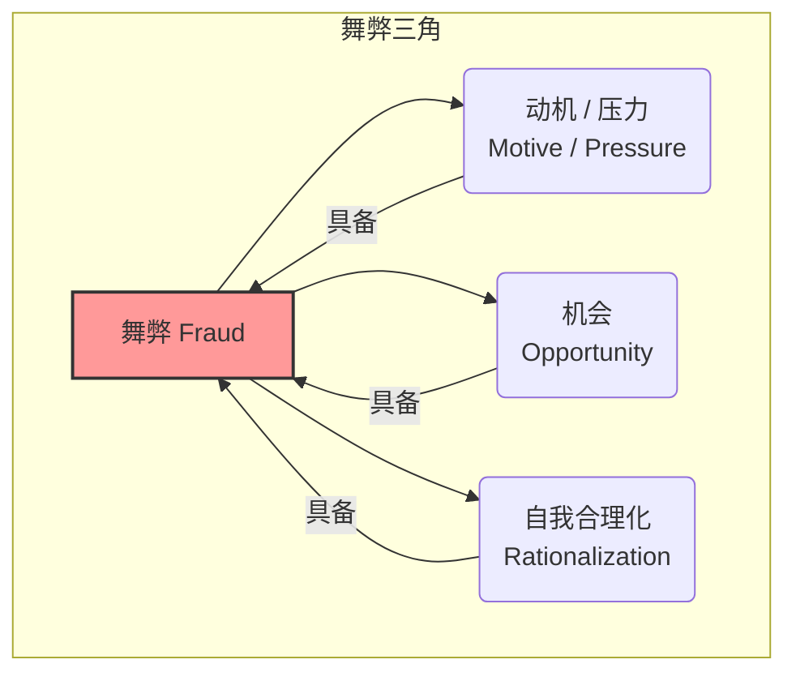

# 第三部分：风险识别与"排雷" —— CFO 的火眼金睛

在前两个部分，我们系统学习了如何阅读和理解三大财务报表，掌握了运用财务比率和综合分析框架（如杜邦分析）来评估企业经营绩效和财务健康状况的方法。然而，仅仅理解报表"说什么"是不够的，更重要的是要具备识别报表可能"没说实话"甚至"说谎"的能力。财务报表并非总是客观、公允地反映企业真实状况，它们可能受到管理层盈余管理（Earnings Management）甚至蓄意财务舞弊（Financial Fraud）的扭曲。

财务报表粉饰和舞弊是资本市场的"毒瘤"，不仅损害投资者利益，破坏市场信心，甚至可能引发系统性风险。从安然（Enron）、世通（WorldCom）到近年的瑞幸咖啡（Luckin Coffee）、康美药业等案例，财务造假事件层出不穷，手段也日益隐蔽和复杂。作为专业的财报使用者，无论是 CFO、审计师、分析师还是投资者，都必须具备一双"火眼金睛"，能够穿透数字迷雾，识别潜在的财务"雷区"。

本部分将聚焦于财务风险识别与"排雷"的核心技能，特别是针对财务报表粉饰与舞弊的侦测。我们将深入探讨：
*   财务舞弊产生的根源和动机。
*   虚增收入、虚减成本费用、虚增资产、隐藏负债以及现金流造假的常见手法。
*   识别这些舞弊行为的关键财务信号和分析技巧。
*   如何从财报附注和审计报告中寻找危险信号。
*   针对关联交易、并购重组、存货应收、债务风险等特定高风险领域的深入分析方法。

掌握这些知识，将有助于你：
*   **提升风险意识:** 对财报数据保持审慎和批判性思维。
*   **识别异常信号:** 从看似正常的报表中发现隐藏的"红旗"(Red Flags)。
*   **提高分析质量:** 做出更准确、更可靠的财务判断和决策。
*   **规避投资陷阱:** 远离那些通过财务造假制造繁荣假象的公司。

具备识别财务舞弊的能力，是专业财务人士核心竞争力的重要组成部分，也是保护自身和他人利益的关键屏障。让我们一起磨砺这双"火眼金睛"。

# 第七章：财务报表粉饰与舞弊识别：常见手法与侦测技巧

财务报表粉饰（Financial Statement Dressing）通常指利用会计准则允许的选择空间或模糊地带进行盈余管理，以美化报表、平滑利润或达到特定财务目标，其本身未必违法，但可能误导信息使用者。而财务舞弊（Financial Statement Fraud）则是指故意错报或漏报财务信息，以欺骗报表使用者，这是一种违法行为。

本章将系统梳理财务报表粉饰与舞弊的常见手法，并提供相应的识别信号和分析技巧。我们将从理解舞弊产生的根源入手，然后分别探讨收入、成本费用、资产负债以及现金流等方面的常见造假方式及其侦测方法。最后，强调财报附注和审计报告在识别风险中的重要作用。

## 7.1 财务舞弊的动机、压力与机会（舞弊三角理论）

为什么看似声誉良好、规模庞大的上市公司也会铤而走险进行财务舞弊？理解舞弊产生的根源和条件，有助于我们更好地识别高风险公司和预警信号。美国犯罪学家唐纳德·克雷西 (Donald Cressey) 在研究了大量侵占案例后，于 1953 年提出了著名的**舞弊三角理论 (Fraud Triangle Theory)**，该理论至今仍是理解各类舞弊行为（包括财务报表舞弊）产生原因的核心框架。

舞弊三角理论认为，舞弊行为的发生通常需要同时具备三个要素：**动机/压力 (Motive/Pressure)**、**机会 (Opportunity)** 和**自我合理化 (Rationalization)**。

**1. 动机 / 压力 (Motive / Pressure):**
这是驱动个人或管理层产生舞弊意图的初始原因。对于上市公司管理层而言，常见的动机和压力来源包括：
*   **满足盈利预期或维持股价:** 来自资本市场（分析师、投资者）的巨大压力，要求公司持续实现盈利增长，维持或提升股价。当实际业绩不达标时，管理层可能铤而走险。
*   **达到融资或债务契约要求:** 为了顺利获得银行贷款、发行债券，或者避免违反现有债务合同中关于财务比率（如资产负债率、利息保障倍数）的限制性条款，管理层可能粉饰财务数据。
*   **获取基于业绩的薪酬或奖金:** 管理层的薪酬（尤其是股权激励、奖金）往往与公司的财务表现（如利润、股价）挂钩，这成为他们操纵业绩以最大化个人利益的直接动机。
*   **掩盖经营不善或非法行为:** 利用财务造假来掩盖公司真实的糟糕业绩、流动性危机，甚至是管理层的贪污、挪用公款等其他非法行为。
*   **来自内部或外部的竞争压力:** 为了在激烈的市场竞争中保持领先地位或获得竞争优势。
*   **个人财务困难或贪婪:** 管理层个人可能面临财务困境，或仅仅出于贪婪而进行舞弊。

**识别动机/压力的信号:**
*   公司业绩持续低于分析师预期或行业平均水平。
*   股价持续下跌，面临摘牌或融资压力。
*   即将进行 IPO、增发或重大并购等资本运作。
*   存在严格的债务契约限制，且公司财务指标接近临界点。
*   管理层薪酬与短期财务指标高度挂钩，且近期有大额股票期权即将行权。
*   公司面临重大诉讼、监管调查或负面报道。

**2. 机会 (Opportunity):**
指存在可供舞弊者利用的内部控制漏洞或环境条件，使得舞弊行为能够实施并且不易被发现。常见的机会来源包括：
*   **薄弱的内部控制:** 公司缺乏有效的内部控制制度，或者制度执行不力。例如，职责分工不清、授权审批不严、缺乏独立审计或内部监督。
*   **复杂的组织结构或交易:** 公司结构过于复杂、子公司众多、关联交易频繁且不透明、涉及大量难以理解的金融衍生品或特殊目的实体 (SPE)，为隐藏舞弊提供了便利。
*   **重大的主观判断或会计估计:** 涉及大量需要管理层做出重大主观判断或估计的会计科目（如收入确认时点、资产减值准备、公允价值计量），为操纵利润提供了空间。
*   **无效的董事会或审计委员会监督:** 董事会缺乏独立性，审计委员会专业能力不足或不够勤勉，无法对管理层形成有效监督。
*   **审计师能力不足或独立性受损:** 外部审计师缺乏足够的专业能力、经验或行业知识，或者与客户关系过于密切，未能发现或揭示舞弊。
*   **管理层凌驾于内部控制之上:** 即使有完善的制度，如果高层管理者可以轻易绕过或无视内部控制，舞弊的机会依然存在。

**识别机会的信号:**
*   公司内部控制存在重大缺陷（关注审计报告中的内控评价）。
*   组织结构异常复杂，存在大量离岸子公司或 VIE 结构。
*   关联交易频繁、金额巨大且缺乏商业实质。
*   涉及大量主观性强的会计估计变更。
*   董事会独立董事占比低，关联董事多，审计委员会成员缺乏财务专业背景。
*   频繁更换审计师，特别是与审计师在会计处理上存在分歧。
*   管理层权力过于集中，"一言堂"现象严重。

**3. 自我合理化 (Rationalization):**
指舞弊者为其不当行为寻找借口或理由，使其在心理上接受自己的行为，克服道德障碍。常见的自我合理化心态包括：
*   **"只是暂时的，以后会补回来":** 认为只是短期调节利润，等公司经营好转后会进行冲回。
*   **"我这是为了公司好":** 认为造假是为了维持股价、保护员工就业、帮助公司渡过难关。
*   **"别人都这么干":** 认为盈余管理或某些"擦边球"行为是行业惯例。
*   **"我应得的":** 认为自己的付出没有得到应有回报，通过舞弊来弥补。
*   **"公司欠我的":** 对公司或上级不满，产生报复心理。
*   **"这不算什么大事":** 低估舞弊行为的严重性和后果。

**识别自我合理化的困难:** 自我合理化是舞弊者的内心活动，外部人员很难直接观察和识别。但可以通过观察管理层的态度、行为以及公司文化来间接判断：
*   管理层对道德规范和法律法规的态度轻描淡写。
*   公司内部弥漫着不切实际的业绩目标压力。
*   对提出质疑或不同意见的员工进行打压。
*   管理层生活方式奢侈，与其薪酬水平不符。

**舞弊三角理论的应用:**
*   **风险评估:** 评估一家公司是否同时具备了舞弊三角的三个要素，可以判断其财务舞弊的风险高低。风险最高的是那些同时面临巨大压力、内部控制存在明显机会、且管理层诚信存疑的公司。
*   **内部控制设计:** 公司在设计内部控制时，应着重于消除或减少舞弊的"机会"，例如加强职责分离、完善授权审批、强化内部审计和监督。
*   **审计重点:** 审计师在进行风险评估时，会分析舞弊三角的三个方面，并将审计资源重点投向高风险领域。
*   **分析师视角:** 分析师在研究公司时，应关注可能导致管理层产生舞弊"动机/压力"的因素，以及公司治理和内部控制中存在的"机会"，结合管理层的诚信记录，综合评估财报的可信度。

理解舞弊三角理论，有助于我们从更深层次理解财务舞弊的成因，并将注意力聚焦于那些最可能出现问题的公司和领域。接下来的几节，我们将具体探讨在收入、成本费用、资产负债和现金流方面常见的舞弊手法及其识别信号。

## 7.2 虚增收入的常见手段与识别信号

收入是利润表的起点，是衡量企业经营规模和市场认可度的核心指标，也是投资者和分析师最为关注的数据之一。因此，**虚增收入 (Revenue Inflation/Fraudulent Revenue Recognition)** 成为财务舞弊中最常见、也最具诱惑力的手段。管理层通过人为夸大收入，可以迅速提升公司账面业绩，满足市场预期，支撑股价，或者达到其他个人或公司目标。

虚增收入的手法多种多样，从利用会计准则的模糊地带打"擦边球"，到完全虚构交易，层出不穷。识别虚增收入需要深入理解收入确认原则，并对财务数据中的异常信号保持高度警惕。

**常见的虚增收入手段：**

1.  **提前确认收入 (Premature Revenue Recognition):**
    *   **手法:** 在满足收入确认条件（如货物所有权转移、服务已提供、收款很可能收回等）之前，就将收入计入当期报表。
    *   **常见形式:**
        *   **发货即确认收入:** 货物尚未到达客户指定地点或客户尚未验收，就确认收入（尤其违反 FOB 目的地条款）。
        *   **签订合同即确认收入:** 即使服务尚未提供或有重大未履行的义务，仅凭一纸合同就确认收入。
        *   **完工百分比法滥用:** 在长期合同（如工程建设、软件开发）中，故意高估完工进度，从而提前确认过多收入。
        *   **"比尔和持有"安排 (Bill-and-Hold Sales):** 向客户开具发票并确认收入，但货物并未实际发给客户，而是由公司代为保管。这需要满足非常严格的条件才能确认收入，很容易被滥用。
        *   **将或有收入确认为当期收入:** 对于未来是否能收到存在不确定性的收入（如依赖于未来事件的版税、成功费），提前确认。
    *   **动机:** 将未来期间的收入挪到当期，以满足短期业绩目标。

2.  **虚构交易 (Fictitious Revenue / Sham Sales):**
    *   **手法:** 凭空捏造销售交易，确认从未实际发生过的收入。这是性质最恶劣的舞弊手段之一。
    *   **常见形式:**
        *   伪造销售合同、发票、出库单等全套虚假单据。
        *   向虚构的客户销售。
        *   与真实客户串通，签订虚假合同（可能承诺未来会取消交易或提供大额回扣）。

3.  **利用关联方交易 (Related-Party Transactions):**
    *   **手法:** 通过与关联方（如母子公司、受同一方控制的公司、关键管理人员及其近亲属控制的公司等）进行非公允、缺乏商业实质的交易来虚增收入。
    *   **常见形式:**
        *   以远高于市场的价格向关联方销售商品或服务。
        *   向关联方提供无追索权的"销售"，或承诺回购。
        *   利用复杂的关联交易结构隐藏资金流向，制造收入假象。
        *   将本应合并的关联方作为外部客户确认收入 (关联交易非关联化)。
    *   **动机:** 关联方交易更容易控制和操纵，且不易被外部人员察觉。

4.  **渠道填塞 (Channel Stuffing):**
    *   **手法:** 在期末（如季度末或年末）向分销商或渠道商大量压货，超过其正常销售能力或需求，并常常伴有宽松的退货政策、延长付款期限或额外折扣等诱因，以促使渠道商接收货物，从而在当期确认更多收入。
    *   **动机:** 短期内冲高销售额，满足业绩指标。
    *   **后果:** 这种做法寅吃卯粮，会导致未来期间销售额下降（渠道商消化库存）和退货率上升。

5.  **不当处理销售折扣、退回与折让:**
    *   **手法:** 低估或延迟确认销售折扣、客户退货及折让准备，从而高估净收入。
    *   **常见形式:**
        *   对未来可能发生的大量退货计提准备不足。
        *   将应冲减收入的促销费用、返利等计入销售费用或其他科目。

6.  **将非营业收入计入营业收入:**
    *   **手法:** 将一次性的、非经营活动产生的收益（如出售资产利得、政府补助、投资收益）错误地计入主营业务收入，以粉饰核心业务的增长假象。

7.  **"循环"交易 (Round-Tripping):**
    *   **手法:** 公司将资金支付给另一家公司，然后该"客户"再用这笔资金（或部分资金）向公司购买商品或服务，制造虚假的收入和现金流。这通常涉及串通或利用关联方。

**识别虚增收入的信号 (红旗 - Red Flags):**

分析师和审计师可以通过关注以下财务和非财务信号来识别潜在的收入舞弊风险：

1.  **收入与关键指标的异常背离:**
    *   **收入增长率远超行业平均水平或主要竞争对手，缺乏合理解释。** 这是最需要警惕的信号之一。
    *   **收入增长与经营现金流（尤其是销售收现）严重脱节:** OCF/净利润比率持续低位，销售收现比率低，表明收入没有转化为真实的现金流入。
    *   **应收账款增长速度远超收入增长速度:** 导致应收账款周转率下降（周转天数 DSO 延长）。这提示回款困难或存在虚假销售。
    *   **毛利率异常高或持续上升，缺乏合理解释:** 特别是在行业竞争加剧、成本上升的背景下，逆势上升的毛利率值得怀疑。
    *   **预收账款异常减少或与收入增长不匹配:** 对于有预收款模式的企业，收入增长通常伴随预收款增加。

2.  **期末异常交易活动:**
    *   **第四季度（或报告期最后一个月）收入占比异常高:** 可能存在期末冲业绩或渠道填塞行为。
    *   **期末存在大量非正常、大额或复杂的销售交易。**

3.  **关联交易疑点:**
    *   **存在大量、复杂且商业理由不充分的关联交易。**
    *   **向关联方销售的收入占比过高，且毛利率显著高于第三方销售。**
    *   **关联方的应收账款余额大、账龄长、回收慢。**
    *   **对关联方的披露不清晰、不完整。**

4.  **客户与合同疑点:**
    *   **主要客户集中度过高，且客户资质可疑或信息不透明。**
    *   **存在非标准、复杂的销售合同条款，特别是涉及或有付款、回购承诺、超长信用期、无限制退货权等。**

5.  **存货与成本疑点:**
    *   **存货周转率异常下降（配合收入虚增）。**
    *   **营业成本增长率远低于营业收入增长率（导致毛利率异常上升）。**

6.  **会计政策与估计变更:**
    *   **频繁变更收入确认政策或关键会计估计（如完工百分比、坏账计提比例）。**
    *   **采用比同行更激进的收入确认方法。**

7.  **其他非财务信号:**
    *   **管理层面临巨大的业绩压力（如上文舞弊三角所述）。**
    *   **公司内部控制存在重大缺陷，特别是与销售和收款循环相关的控制。**
    *   **审计师频繁更换或与公司在收入确认上存在分歧。**
    *   **出现无法解释的大额销售退回或冲销（在后期财报中）。**
    *   **媒体负面报道或监管机构调查。**

**分析师与 CFO 的核查方法:**
*   **比率分析:** 计算并追踪上述提到的关键比率（收入增长率、OCF/NI、销售收现比、应收账款周转率、毛利率等）的变化趋势，并与同行进行比较。
*   **结构分析:** 分析收入的构成（产品、区域、客户），是否存在异常集中的情况。
*   **现金流分析:** 将利润表与现金流量表进行印证，关注收入的"含金量"。
*   **附注深挖:** 仔细阅读收入确认政策、关联交易、客户集中度、应收账款账龄、坏账准备、或有事项等相关附注信息。
*   **管理层讨论与分析 (MD&A):** 关注管理层对收入增长原因的解释是否合理、可信，是否与财务数据一致。
*   **外部信息验证:** 结合行业数据、竞争对手情况、新闻报道、工商信息（核查客户真实性）等外部信息进行交叉验证。
*   **对于 CFO:** 建立严格的收入确认流程和内部控制，加强对销售合同的审核，监控关键风险指标，确保收入的真实性和准确性。

虚增收入是财务舞弊的重灾区。分析师必须对收入数据的真实性保持高度警惕，运用多种工具和视角进行审慎分析，识别异常信号，才能有效规避"收入陷阱"。

## 7.3 虚减成本费用的常见手段与识别信号

除了虚增收入，另一种直接提升利润的舞弊手段是**虚减成本费用 (Understatement of Costs and Expenses)**。通过人为地降低账面成本或将本应计入当期费用的支出推迟确认或资本化，管理层可以制造出更高的毛利率、营业利润率和净利润。这种手法同样具有很强的隐蔽性，需要分析师具备扎实的会计知识和敏锐的洞察力。

**常见的虚减成本费用手段：**

1.  **成本费用跨期确认 (Improper Timing of Expense Recognition):**
    *   **手法:** 将本应属于当期的成本或费用，推迟到未来期间确认。
    *   **常见形式:**
        *   **延迟确认营业成本:** 例如，在期末故意不清点或少计已耗用的原材料、未结转已销售产品的全部成本。
        *   **延迟确认期间费用:** 例如，将本期已发生的广告费、维修费、咨询费等推迟到下期入账。
        *   **低估预提费用:** 例如，对应付未付的工资、奖金、水电费、保修费等计提不足。
    *   **动机:** 平滑利润，将当期成本压力转移到未来，以满足短期盈利目标。

2.  **费用资本化不当 (Improper Capitalization of Expenses):**
    *   **手法:** 将本应计入当期损益的费用支出，错误地资本化为资产（如固定资产、无形资产、长期待摊费用等），然后在未来期间通过折旧或摊销缓慢地计入成本费用。
    *   **常见形式:**
        *   **研发支出资本化过度:** 放宽研发支出资本化的条件，将不符合资本化条件的开发阶段支出甚至研究阶段支出计入无形资产。（参见 2.3.2）
        *   **借款费用资本化不当:** 将不符合资本化条件的借款费用（如用于日常运营周转的借款利息）计入在建工程或存货成本。
        *   **将常规维修、广告、营销等费用资本化:** 将明显属于期间费用的支出计入固定资产、无形资产或长期待摊费用。
        *   **软件开发成本资本化操纵:** 在内部开发软件时，模糊研究阶段和开发阶段的界限，将更多支出资本化。
    *   **动机:** 大幅减少当期费用，虚增当期利润和资产。这是世通（WorldCom）财务造假案中的核心手段之一（将线路成本错误资本化）。

3.  **隐藏或少计成本费用:**
    *   **手法:** 通过各种手段直接隐藏或人为降低账面成本费用。
    *   **常见形式:**
        *   **存货计价方法操纵:** 在通胀时期，从后进先出法 (LIFO) 改为先进先出法 (FIFO) 或加权平均法，可以降低报告的营业成本，提高利润（但可能不符合会计准则要求或缺乏合理解释）。
        *   **低估各项准备金:**
            *   **存货跌价准备计提不足:** 对滞销、残次、过时的存货，未能足额计提跌价准备，导致存货价值高估，营业成本低估。（参见 2.2.3, 8.3.1）
            *   **坏账准备计提不足:** 低估应收账款的回收风险，计提过低的坏账准备，从而低估信用减值损失。（参见 2.2.2, 5.3.1）
            *   **固定资产/无形资产减值准备计提不足:** 对出现减值迹象的长期资产未能及时、足额计提减值准备。（参见 2.3.1, 2.3.2, 3.4.2, 8.2.2）
            *   **低估预计负债:** 对未决诉讼、产品保修、环境修复等未来很可能发生的支出，未能合理估计并确认预计负债和相应费用。
        *   **利用关联方隐藏费用:** 将本应由上市公司承担的费用（如高管薪酬、部分运营成本）转移给未合并的关联方承担。

4.  **滥用重组准备金或其他准备金:**
    *   **手法:** 在业绩好的年份，过度计提重组准备金、资产弃置准备或其他未来费用准备（设立"秘密准备"或"饼干罐准备金" - Cookie Jar Reserves），人为压低当期利润；在未来业绩差的年份，再将这些准备金冲回，或将实际发生的费用计入准备金，从而平滑利润，掩盖业绩下滑。

**识别虚减成本费用的信号 (红旗 - Red Flags):**

1.  **利润率异常变化:**
    *   **毛利率异常高或持续上升，且与收入增长、行业趋势或成本环境变化不符。** （与虚增收入信号类似，需结合分析）
    *   **期间费用率（销售/管理/研发费用占收入比）异常低或持续下降，缺乏合理解释**（如规模效应不明显、或投入并未减少）。

2.  **成本费用结构异常:**
    *   **营业成本增长率显著低于营业收入增长率。**
    *   **特定费用项目（如研发费用、广告费用）的波动与公司战略或经营活动不匹配。** 例如，公司宣称加大研发，但研发费用率反而下降。
    *   **资本化支出占比异常高:** 对比同行业公司，研发支出、利息费用等的资本化比例显著偏高。

3.  **资产负债表疑点:**
    *   **存货周转率异常下降的同时，存货跌价准备计提比例反而降低或远低于同行。**
    *   **应收账款周转率下降的同时，坏账准备计提比例反而降低或远低于同行。**
    *   **固定资产/无形资产规模异常增长，但收入或利润增长未能跟上，且折旧/摊销政策比同行宽松，减值准备计提不足。**（提示可能存在不当资本化或减值计提不足）
    *   **长期待摊费用余额巨大或增长过快，缺乏合理解释。**
    *   **预付账款余额巨大且长期挂账，可能隐藏了已发生的费用。**

4.  **现金流疑点:**
    *   **经营活动现金流（OCF）与净利润持续背离，且差额主要由非现金费用的调整（如折旧摊销、减值准备）或营运资本变动解释。** 如果 OCF 远好于净利润，且主要是因为折旧摊销远超资本支出（提示投资不足），或者是因为应付账款大幅增加（可能延迟支付），也需要关注。
    *   **购建固定资产、无形资产支付的现金（资本性支出）远超当期利润表确认的折旧与摊销额，但收入和利润增长缓慢。** （过度或无效投资，也可能隐藏费用资本化）

5.  **会计政策与估计变更:**
    *   **频繁变更成本计量方法、折旧摊销政策、资产减值测试方法或关键参数。**
    *   **变更费用确认或资本化的会计政策，尤其是缺乏充分理由或选择更激进方法的变更。**
    *   **关键准备金（坏账、存货跌价、资产减值）的计提比例显著低于历史水平或同行。**

6.  **其他信号:**
    *   **审计报告中提及与费用确认、资本化或准备金计提相关的关键审计事项或保留意见。**
    *   **内部控制在成本费用确认、资产管理等方面存在重大缺陷。**
    *   **公司面临盈利压力，有强烈动机去粉饰利润。**

**分析师与 CFO 的核查方法:**
*   **趋势分析与比率分析:** 追踪毛利率、期间费用率、各项准备金计提比例、资产周转率等指标的长期趋势，与同行进行详细比较。
*   **结构分析:** 分析成本费用的构成，关注异常波动或占比变化。分析资本化支出占总支出的比例。
*   **附注深挖:** 仔细阅读会计政策（特别是费用资本化标准、折旧摊销、减值测试方法）、会计估计变更、各项准备金计提详情、关联交易（费用转移）等附注信息。
*   **资产质量分析:** 重点评估存货、应收账款、固定资产、无形资产（尤其是商誉和资本化的研发支出）的质量和减值风险。
*   **现金流验证:** 对比利润表费用与现金流量表相关支付项目。
*   **对于 CFO:** 建立健全的成本核算体系和费用审批流程，确保费用确认和资本化符合准则要求，定期复核各项准备金计提的充分性，防止利润操纵。

虚减成本费用相比虚增收入，手段可能更为隐蔽，因为它往往与复杂的会计政策和估计相关。分析师需要具备扎实的会计功底，并结合对公司业务和行业的理解，才能有效识别其中的风险信号。

## 7.4 虚增资产与隐藏负债的常见手段与识别信号

财务舞弊不仅限于操纵利润表项目（收入和费用），资产负债表同样是重要的"作案现场"。管理层可能通过**虚增资产 (Asset Overstatement)** 或**隐藏负债 (Liability Understatement / Omission)** 来美化公司的财务状况，制造实力雄厚、风险较低的假象。这些手法往往与虚增收入或虚减成本费用的行为相互配合，共同服务于整体的舞弊目标。

**常见的虚增资产手段：**

1.  **虚构资产 (Fictitious Assets):**
    *   **手法:** 在账面上凭空捏造不存在的资产。
    *   **常见形式:**
        *   **虚构货币资金:** 通过伪造银行对账单、存款证实书或与关联方进行无实质的资金"循环"来虚增银行存款余额。（康美药业案即为典型）
        *   **虚构应收账款:** 配合虚增收入，确认对虚假客户或根本不存在交易的应收款项。
        *   **虚构存货:** 伪造存货盘点记录，虚报存货数量或状态。
        *   **虚构固定资产或在建工程:** 伪造采购合同、发票、工程进度报告等，虚增固定资产或在建工程的价值，甚至虚构根本不存在的资产。
        *   **虚构无形资产:** 虚构或高估无形资产（如专利权、非专利技术）的价值。
    *   **识别难度:** 虚构资产的识别难度较大，尤其对于货币资金、存货、在建工程等需要实地盘点或函证的科目，外部报表使用者很难直接核实。但可以通过分析资产周转效率、关联交易、现金流等间接信号发现疑点。

2.  **资产价值高估 (Asset Overvaluation):**
    *   **手法:** 对真实存在的资产，采用不恰当的会计方法或估计，人为抬高其账面价值。
    *   **常见形式:**
        *   **存货价值高估:** 存货跌价准备计提不足（如上节所述）。
        *   **应收账款价值高估:** 坏账准备计提不足（如上节所述）。
        *   **固定资产/无形资产价值高估:**
            *   **减值准备计提不足:** 对出现减值迹象的长期资产（厂房设备陈旧、技术过时、并购商誉未达预期等）未能足额计提减值准备。这是非常常见的利润调节手段。
            *   **折旧/摊销方法不当:** 采用比同行业或合理预期更长的折旧/摊销年限，或过高的残值率，或更缓慢的折旧/摊销方法（如直线法代替加速折旧法），以降低当期折旧摊销费用，维持资产账面价值。
        *   **投资性房地产/金融资产公允价值高估:** 对于采用公允价值计量的资产，利用主观判断或不透明的估值模型，高估其公允价值，产生虚假的公允价值变动收益并虚增资产。
        *   **不当的费用资本化:** （如上节所述）将费用错误资本化，直接导致资产虚增。

3.  **不当的资产分类 (Improper Asset Classification):**
    *   **手法:** 将某些资产错误地分类到流动性更好或市场观感更好的类别中。
    *   **常见形式:**
        *   **将长期资产列报为流动资产:** 例如，将一年以上才能收回的应收款项列入流动资产，虚增流动比率。
        *   **将不良资产隐藏在其他科目:** 例如，将难以收回的应收款项转入"其他应收款"或长期应收款。

**常见的隐藏负债手段：**

1.  **负债表外化 (Off-Balance-Sheet Liabilities):**
    *   **手法:** 通过特定的交易结构安排，使得本应由公司承担的负债不出现在资产负债表上。
    *   **常见形式:**
        *   **经营租赁（旧准则下）:** 利用经营租赁而非融资租赁获得资产使用权，将租赁付款义务隐藏在表外。（新租赁准则已很大程度解决此问题）
        *   **利用未合并的特殊目的实体 (SPE) 或关联方承担负债:** 将债务或有风险的资产转移到表外的 SPE 或关联方，但公司可能仍实际承担风险或提供隐性担保。安然事件中大量使用了这种手法。
        *   **售后租回交易操纵:** 将资产出售后再租回，如果交易设计不当，可能将融资行为包装成销售，隐藏了实际的负债。
        *   **有追索权的保理或资产证券化:** 出售应收账款等资产，但保留了追索权，未能完全转移风险，相当于一种隐性负债。

2.  **债务确认不完整或延迟确认 (Incomplete or Delayed Liability Recognition):**
    *   **手法:** 对于已经发生的负债或很可能发生的义务，未能及时、足额地在账面上确认。
    *   **常见形式:**
        *   **低估预提费用:** （如上节所述）少计应付未付的工资、利息、税金等。
        *   **低估或不确认预计负债:** 对未决诉讼、产品保修、环境修复、重组义务等未来支出义务，未能根据谨慎性原则合理估计并确认负债。
        *   **隐藏或有负债:** 对外提供担保、未决诉讼等或有事项，如果很可能导致经济利益流出且金额能够可靠计量，应确认为预计负债。舞弊公司可能故意隐瞒或低估这些或有负债的风险。
        *   **应付账款长期挂账或隐藏:** 与供应商串通，延迟入账或隐藏应付账款。

3.  **不当的负债分类 (Improper Liability Classification):**
    *   **手法:** 将负债错误分类以美化财务结构或偿债能力指标。
    *   **常见形式:**
        *   **将短期负债列报为长期负债:** 例如，将一年内到期的长期借款或应付债券，仍然列示为非流动负债，以虚增流动比率和速动比率。

**识别虚增资产与隐藏负债的信号 ("红旗" - Red Flags):**

1.  **资产负债表结构异常:**
    *   **特定资产项目占比异常高或增长过快，缺乏合理解释:** 如货币资金、应收账款、存货、在建工程、无形资产（尤其是商誉）等占总资产比例远超同行或历史水平。
    *   **资产周转率持续下降:** 总资产周转率、固定资产周转率、存货周转率、应收账款周转率持续恶化，可能表明资产闲置、滞销、回收困难或存在虚增。
    *   **资产负债率异常低，与公司经营模式、融资活动或盈利能力不匹配:** 可能隐藏了表外负债。
    *   **流动比率、速动比率异常高或突然改善，但经营现金流并未改善:** 可能存在操纵资产或负债分类的行为。

2.  **资产质量疑点:**
    *   **货币资金充裕但利息收入很低，或者支付高额利息费用:** 虚构货币资金的信号，或者资金可能受限（如大额保证金或被关联方占用）。
    *   **应收账款账龄过长，坏账准备计提比例远低于同行。**
    *   **存货库龄过长，存货跌价准备计提比例远低于同行。**
    *   **长期资产（固定资产、无形资产）的折旧摊销政策明显比同行宽松，减值准备计提不足。**
    *   **商誉占净资产比例过高，且被并购对象业绩未达预期，但并未计提或足额计提商誉减值。**
    *   **存在大量账面价值不明、长期挂账的其他应收款、预付款项或长期待摊费用。**

3.  **负债结构与或有负债疑点:**
    *   **大量使用经营租赁（新准则下需关注使用权资产和租赁负债）。**
    *   **存在复杂、不透明的关联交易或表外实体结构。**
    *   **附注中披露了巨额对外担保，特别是为关联方或资信不佳的企业担保。**
    *   **附注中披露了重大未决诉讼或索赔，但未确认预计负债或披露不充分。**
    *   **应付账款周转天数异常长，远超正常信用期，可能隐藏债务或与供应商关系紧张。**
    *   **一年内到期的非流动负债金额巨大，但流动资产不足以覆盖，再融资风险高。**

4.  **现金流与盈利能力疑点:**
    *   **资产规模持续扩张，但盈利能力（如 ROA）和经营现金流并未相应改善。**
    *   **购建固定资产、无形资产支付的现金与资产负债表中对应资产的增加额存在重大差异。**
    *   **自由现金流持续为负，但公司仍在扩张或维持高额分红。**

5.  **审计与内控信号:**
    *   **审计报告提及与资产估值、减值测试、负债确认相关的关键审计事项或保留意见。**
    *   **内部控制在资产管理、负债管理、关联交易审批等方面存在重大缺陷。**
    *   **频繁变更资产评估机构或评估方法。**

**分析师与 CFO 的核查方法:**
*   **详细审阅资产负债表结构和趋势:** 关注各项目的占比、增长率及其合理性。
*   **计算并分析资产周转效率指标:** 识别低效或虚增的资产。
*   **评估资产质量:** 重点关注应收账款、存货、长期资产的减值风险，阅读相关附注。
*   **深挖附注信息:** 仔细阅读关联交易、或有事项（担保、诉讼）、债务结构、租赁、金融工具、会计政策与估计等关键附注。
*   **分析表外风险:** 评估经营租赁、SPE、担保等表外项目可能带来的潜在负债。
*   **对比分析:** 与同行业公司在资产结构、负债水平、资产周转率、减值计提等方面进行比较。
*   **对于 CFO:** 建立严格的资产管理制度和减值测试流程，确保资产估值公允；完善负债管理和或有事项评估流程，确保负债确认完整；加强对关联交易和表外风险的监控。

虚增资产和隐藏负债往往相互交织，共同服务于美化财务状况、误导投资者的目的。识别这些舞弊行为需要分析师具备全面的财务知识，能够将资产负债表、利润表、现金流量表以及附注信息结合起来，进行细致的交叉验证和逻辑推理。

## 7.5 现金流造假的手段与识别

"利润是观点，现金是事实"——这句话在财报分析中广为流传，但也并非绝对真理。虽然现金流量表（尤其是经营活动现金流 OCF）通常被认为是比利润表更难操纵、更能反映企业真实状况的报表，但道高一尺魔高一丈，舞弊者仍然有办法对现金流数据进行粉饰甚至造假，以掩盖经营困境或配合其他舞弊行为。

现金流造假的核心目的通常是**虚增经营活动现金流 (Inflating Operating Cash Flow)**，因为 OCF 是衡量企业核心业务"自我造血"能力的关键指标，健康的 OCF 往往被视为盈利质量高的标志。如果 OCF 长期远低于净利润，或者持续为负，会引发投资者对公司生存能力的严重担忧。

**常见的现金流造假（主要是虚增 OCF）手段：**

1.  **将投资/筹资活动现金流错误分类为经营活动现金流:**
    *   **手法:** 利用会计准则对某些现金流分类的灵活性或模糊地带，或者直接错误分类，将本应属于投资活动（如出售长期资产收到的现金）或筹资活动（如借款收到的现金、关联方资金拆入）的现金**流入**，归类到经营活动现金流入中；或者将本应属于经营活动（如支付供应商货款）的现金**流出**，归类到投资活动（如计入在建工程）或筹资活动（如偿还债务）中。
    *   **常见形式:**
        *   **出售长期资产/子公司收到的现金计入 OCF:** 例如，将处置固定资产收回的现金错误地列入"收到其他与经营活动有关的现金"。
        *   **取得借款或关联方资金拆入计入 OCF:** 将筹资性现金流入伪装成经营性流入，例如通过虚构的销售退回收到关联方资金，或将关联方提供的借款计入"收到其他与经营活动有关的现金"。
        *   **支付购建长期资产的款项从 OCF 中扣除:** 将购买设备等的支出伪装成预付账款或其他经营性流出减少项，或直接计入"支付其他与经营活动有关的现金"。
        *   **偿还债务本金计入 OCF 流出:** 将还本支出伪装成经营性支出。
        *   **利用票据贴现:** 将应收票据贴现收到的现金（本质上是一种短期融资）计入经营活动现金流入（"销售商品、提供劳务收到的现金"）。
    *   **动机:** 直接"技术性"地提升 OCF 净额，使其看起来更健康。

2.  **虚构经营性现金流入（配合收入造假）:**
    *   **手法:** 在虚增收入的同时，伪造相应的现金流入假象，以掩盖收入与现金流脱节的问题。
    *   **常见形式:**
        *   **资金体外循环:** 大股东或关联方将资金转入公司账户，伪装成销售回款，然后再通过各种隐蔽渠道（如支付虚构采购、费用或对外投资）将资金转出。这是很多收入造假案中必然涉及的环节，目的是填补虚增收入和真实 OCF 之间的巨大鸿沟。
        *   **利用票据进行虚假循环:** 开具没有真实交易背景的商业承兑汇票或银行承兑汇票，进行虚假的背书转让或贴现，制造销售和收款假象。
        *   **伪造银行流水或对账单。**
    *   **动机:** 使虚增的收入看起来有真实的现金流支持，提高舞弊的隐蔽性。

3.  **延迟支付经营性款项:**
    *   **手法:** 在报告期末，故意推迟支付供应商货款、员工工资、税费等经营性支出，以暂时性地增加期末现金余额和当期 OCF。
    *   **常见形式:** 大量签发商业承兑汇票代替现金支付，延长应付账款账期。
    *   **动机:** 短期内粉饰 OCF 数据。
    *   **后果:** 这种做法不可持续，会在下期导致现金流出压力增大，并可能损害与供应商的关系。

4.  **不当处理受限制资金:**
    *   **手法:** 在计算现金流量表期末现金及现金等价物余额时，未按规定扣除受限制的货币资金（如银行承兑汇票保证金、定期存单质押、冻结资金等），或者在现金流量表主表中模糊披露，导致报表使用者误认为公司可自由支配的现金很多。
    *   **动机:** 掩盖真实的流动性紧张状况。

**识别现金流造假的信号 (红旗 - Red Flags):**

1.  **OCF 与净利润长期严重背离，且缺乏合理解释:**
    *   **OCF 远低于净利润:** 经典的盈利质量差信号，可能源于虚增收入、费用资本化、营运资本管理不善，也可能涉及 OCF 的操纵（如将经营性流出错误分类）。
    *   **OCF 远高于净利润:** 并非总是好事。需要警惕是否通过将投资/筹资流入错误分类至 OCF，或延迟支付经营款项来实现。也要关注是否因为大量非付现费用（如巨额资产减值）导致净利润过低。

2.  **经营活动现金流内部项目异常:**
    *   **"销售商品、提供劳务收到的现金"长期远低于营业收入，或增长异常。**
    *   **"收到其他与经营活动有关的现金"金额巨大、占比过高或增长异常:** 这个科目往往是"垃圾桶"，容易被用来隐藏不当的现金流入（如关联方资金、借款、资产处置款）。需要关注附注中对该项目的具体解释。
    *   **"购买商品、接受劳务支付的现金"与营业成本、存货变动关系异常。**
    *   **"支付其他与经营活动有关的现金"金额巨大、占比过高或增长异常:** 可能隐藏了不当的现金流出（如关联方资金转出、错误分类的投资/筹资流出）。

3.  **三大活动现金流模式异常:**
    *   **健康成熟型企业 OCF 突然大幅改善，但与主营业务增长不符。**
    *   **投资活动现金流与资产负债表中长期资产变动不匹配。** 例如，固定资产大幅增加，但"购建固定资产支付的现金"却很少。
    *   **筹资活动现金流与资产负债表中债务、权益变动不匹配。**
    *   **现金流量表勾稽关系异常:** 各项活动净现金流之和加汇率影响应等于现金及现金等价物净增加额，与资产负债表期初期末现金余额能够对应。

4.  **与资产负债表、利润表的勾稽关系异常:**
    *   **虚增收入通常伴随应收账款异常增长；如果应收账款没有异常增长，但 OCF 也没有改善，则需要高度怀疑是否存在虚假的现金回收（资金循环）。**
    *   **货币资金余额巨大，但利息收入极低（或与利率水平不符），同时支付高额利息费用:** 提示货币资金的真实性或可用性存疑，可能存在虚构资金或大量资金受限。
    *   **存货、在建工程等资产项目异常增加，但缺乏相应的投资活动现金流出支撑。**

5.  **银行账户与票据疑点:**
    *   **银行账户数量过多，存在大量异常或不活跃账户。**
    *   **频繁发生大额、无商业实质的票据流转或贴现。**
    *   **存在大量受限制的货币资金，且未在附注中充分披露。**（关注货币资金附注、担保信息）

6.  **审计与内控信号:**
    *   **审计报告提及与现金流分类、关联方交易、货币资金真实性/受限情况相关的关键审计事项或保留意见。**
    *   **内部控制在资金管理、票据管理、关联交易审批等方面存在重大缺陷。**

**分析师与 CFO 的核查方法:**
*   **精读现金流量表:** 不仅要看三大活动净额，更要仔细审查主要项目的构成、变动趋势及其合理性。特别关注"其他"类项目。
*   **三表勾稽验证:** 将现金流量表与利润表、资产负债表进行详细的勾稽关系验证，寻找不一致之处。
    *   验证 OCF 与净利润的关系（间接法调节表）。
    *   验证销售收现与收入、应收账款的关系。
    *   验证采购付现与成本、存货、应付账款的关系。
    *   验证投资付现与长期资产变动的关系。
    *   验证筹资现金流与债务、权益变动的关系。
    *   验证利息收入/支出与货币资金/债务规模的关系。
*   **关注货币资金质量:** 分析利息收入与余额的匹配度，仔细阅读附注中关于受限资金的披露。
*   **分析关联方资金往来:** 关注是否存在异常的关联方资金流入流出。
*   **对于 CFO:** 建立严格的现金管理和报告制度，确保现金流分类准确，加强对银行账户、票据、受限资金的管理和监控，防范资金循环和挪用风险。

现金流量表的分析是识别财务舞弊的关键环节。虽然舞弊者可能试图操纵 OCF，但彻底伪造一个逻辑完美、与利润表和资产负债表完全勾稽且经得起推敲的现金流量表难度极大。通过细致的三表勾稽分析和对异常信号的追踪，往往能够发现现金流舞弊的蛛丝马迹。

## 7.6 财报附注与审计报告中的危险信号

财务报表主表（资产负债表、利润表、现金流量表）提供了企业财务状况和经营成果的概览，但很多关键的细节信息、会计政策选择、风险暴露以及潜在的问题都隐藏在**财务报表附注 (Notes to Financial Statements)** 和**审计报告 (Auditor's Report)** 之中。对于希望识别财务粉饰与舞弊风险的分析师而言，仔细阅读并理解这两部分内容至关重要，它们往往是发现"危险信号"的宝库。

### 7.6.1 频繁变更会计政策与估计、关键审计事项解读

1.  **会计政策与会计估计变更 (Changes in Accounting Policies and Estimates):**
    *   **关注点:** 企业是否频繁变更重要的会计政策（如收入确认方法、存货计价方法、投资性房地产后续计量模式）或会计估计（如资产折旧年限/残值率、坏账计提比例、存货跌价准备比例、资产减值测试的关键假设）？变更的理由是否充分、合理？变更是主动选择还是由准则更新驱动？
    *   **危险信号:**
        *   **缺乏合理解释的频繁变更:** 特别是当变更使得利润增加或财务状况看起来更好时（如延长折旧年限、降低准备金计提比例），可能存在利润操纵的意图。
        *   **选择行业内不常见或更激进的会计政策/估计:** 例如，在没有充分依据的情况下，采用比同行长得多的资产折旧年限。
        *   **在业绩压力大的时期进行有利的会计变更:** 时间上的巧合值得怀疑。
        *   **对变更的影响披露不清晰、不透明:** 试图掩盖变更对财务数据的真实影响。
    *   **分析方法:** 仔细阅读附注中关于会计政策和估计变更的说明，理解变更的内容、原因、时点以及对财务报表项目（尤其是利润和资产）的影响金额。评估变更的合理性，并与历史数据、同行实践进行比较。

2.  **关键审计事项 (Key Audit Matters, KAMs) / 重大审计事项 (Critical Audit Matters, CAMs):**
    *   **概念:** 这是审计报告中的重要组成部分（根据不同审计准则要求）。审计师会在此处沟通那些在审计过程中认为最为重要的事项，通常是涉及重大管理层判断、估计不确定性高、或者审计难度大、风险高的领域。
    *   **关注点:** 审计师识别出的关键/重大审计事项是什么？这些事项涉及哪些具体的财务报表项目和认定？审计师是如何应对这些事项的？
    *   **危险信号解读:**
        *   **事项本身即是高风险领域:** KAMs/CAMs 通常集中在收入确认、资产减值（商誉、无形资产、长期股权投资、存货、应收账款）、金融工具公允价值、或有事项（诉讼、担保）、关联方交易、持续经营能力等容易出现错报或舞弊的领域。
        *   **措辞审慎或带有保留:** 关注审计师在描述这些事项及其应对措施时的措辞。如果措辞含糊、强调了重大不确定性或管理层判断的高度主观性，可能暗示着较高的错报风险。
        *   **连续多年出现相同的 KAMs/CAMs:** 可能表明相关领域的风险持续存在且难以解决。
        *   **与附注信息相互印证:** 将 KAMs/CAMs 中提到的事项与附注中的相关披露信息进行比对，看是否存在矛盾或疑点。
    *   **分析方法:** 将 KAMs/CAMs 作为重点关注领域，结合附注和其他信息，深入分析相关账户和交易的风险。理解审计师的关注点有助于把握财报中的薄弱环节。

### 7.6.2 关联交易披露不充分、或有事项风险提示

1.  **关联方关系及其交易 (Related Party Relationships and Transactions):**
    *   **关注点:** 附注中是否清晰、完整地披露了所有重要的关联方（包括控股股东、实际控制人、子公司、联营合营企业、关键管理人员及其近亲属等）？是否详细披露了与这些关联方发生的交易类型（购销、资产转让、资金拆借、担保、租赁、提供服务等）、交易金额、定价政策、未结算余额等？
    *   **危险信号:**
        *   **关联方披露不完整、不清晰:** 试图隐藏某些重要的关联方或交易。
        *   **关联交易定价明显不公允:** 交易价格远高于或低于市场价格，可能存在利益输送。
        *   **存在大量非经营性的关联交易:** 如频繁的资金拆借、无商业实质的资产转让，可能涉及资金占用或利润操纵。
        *   **关联交易占比过高:** 公司业绩过度依赖关联方，独立性存疑。
        *   **关联方应收/应付款项余额巨大、长期挂账:** 可能形成坏账或隐藏资金占用。
    *   **分析方法:** 仔细阅读关联方及关联交易附注，识别所有重要关联方和交易。评估交易的商业合理性和定价公允性。结合主营业务情况，判断关联交易是否服务于利润操纵或资金转移。利用工商信息、新闻报道等外部工具核查关联方关系。

2.  **或有事项 (Contingencies):**
    *   **关注点:** 附注中是否充分披露了可能导致未来经济利益流出或流入的不确定事项？主要包括未决诉讼/仲裁、对外提供担保、产品质量保证、环境保护承诺、税收争议等。披露内容应包括事项性质、不确定性、对财务状况可能产生的影响估计（或无法估计的说明）。
    *   **危险信号:**
        *   **披露不充分或含糊其辞:** 对潜在的重大诉讼、巨额担保等风险轻描淡写或信息不透明。
        *   **对很可能败诉或需要赔偿的事项，未按规定确认为预计负债。**
        *   **为关联方或资信状况不佳的第三方提供大额担保，风险敞口巨大。**
        *   **存在可能导致公司承担重大环境修复或赔偿责任的风险，但披露不足。**
    *   **分析方法:** 高度关注或有事项附注，特别是涉及金额巨大、可能对公司持续经营产生影响的事项。评估管理层对结果判断的合理性以及信息披露的充分性。结合新闻报道、行业信息、法律判决等外部信息进行验证。

### 7.6.3 审计师变更、保留意见或无法表示意见的警示

审计报告本身及其反映的审计过程信息，是判断财报可信度的最后一道防线。

1.  **审计师变更 (Change of Auditors):**
    *   **关注点:** 公司是否频繁更换会计师事务所？更换的原因是什么（关注公司公告）？新任审计师是否具有足够的独立性、专业能力和行业经验？前任审计师是否出具过非标准审计意见或在关键会计问题上与公司存在分歧？
    *   **危险信号:**
        *   **在关键时刻（如 IPO 前、业绩下滑时）更换审计师，特别是从知名大所更换为小所。**
        *   **更换原因含糊不清，或与前任审计师就重大会计或审计问题存在争议。**
        *   **新任审计师缺乏相关行业经验或声誉不佳。**
    *   **分析方法:** 关注公司关于更换审计师的公告和相关信息披露。如果更换发生在敏感时期或伴随争议，应提高警惕。

2.  **非标准审计意见 (Modified Audit Opinions):**
    *   **类型:** 除了最常见的"无保留意见"(Unqualified/Unmodified Opinion)，审计师还可能出具以下非标准意见：
        *   **带强调事项段的无保留意见 (Unqualified Opinion with Emphasis-of-Matter Paragraph):** 审计师认为财报整体公允，但需要提醒报表使用者关注附注中披露的某个重大不确定性事项（如持续经营能力存在重大疑虑、重大诉讼结果不确定）。这本身就是强烈的风险信号。
        *   **保留意见 (Qualified Opinion):** 审计师认为财务报表整体是公允的，但**除了**某个（或某些）特定事项的影响外。这表明在特定领域存在错报或审计范围受限，且影响是重大的，但并非广泛性的。
        *   **否定意见 (Adverse Opinion):** 审计师认为财务报表**整体**存在重大错报，不能公允反映公司财务状况和经营成果。这是最严重的审计意见，极其罕见，表明财报基本不可信。
        *   **无法表示意见 (Disclaimer of Opinion):** 由于审计范围受到**极其严重**的限制，审计师无法获取充分、适当的审计证据，因而无法对财务报表整体是否公允发表意见。这也极其罕见，通常意味着公司内部管理混乱或存在重大舞弊嫌疑，审计工作无法正常进行。
    *   **危险信号:** **任何非无保留意见（带强调事项段、保留意见、否定意见、无法表示意见）都是极其重要的危险信号！** 必须仔细阅读审计报告中解释意见类型的段落，理解导致非标准意见的具体原因和涉及范围。
    *   **分析方法:** 一旦出现非标准审计意见，应立即将该公司列为高风险对象。深入分析导致该意见的事项，评估其对公司价值和未来前景的潜在影响。除非有非常充分的理由，否则应极度审慎对待被出具保留、否定或无法表示意见的公司。

**总结:**
财报附注和审计报告是深入了解公司真实财务状况和风险的"金矿"。分析师绝不能只看三张主表，必须投入足够的时间和精力仔细研读附注和审计报告。关注会计政策和估计的变更及其合理性，解读关键审计事项的深层含义，审视关联交易和或有事项的风险，并高度警惕任何审计师变更的异常信号和非标准的审计意见。只有这样，才能最大限度地识别隐藏在数字背后的风险，避免踩中财务舞弊的"地雷"。

---

本章系统介绍了财务报表粉饰与舞弊的动机、常见手法和识别信号，涵盖了收入、成本费用、资产负债、现金流等主要领域，并强调了附注和审计报告的重要性。掌握这些知识是"排雷"的基础。下一章，我们将聚焦于几个特定的高风险专题，如关联交易、并购重组、存货应收、债务风险等，进行更深入的风险剖析。