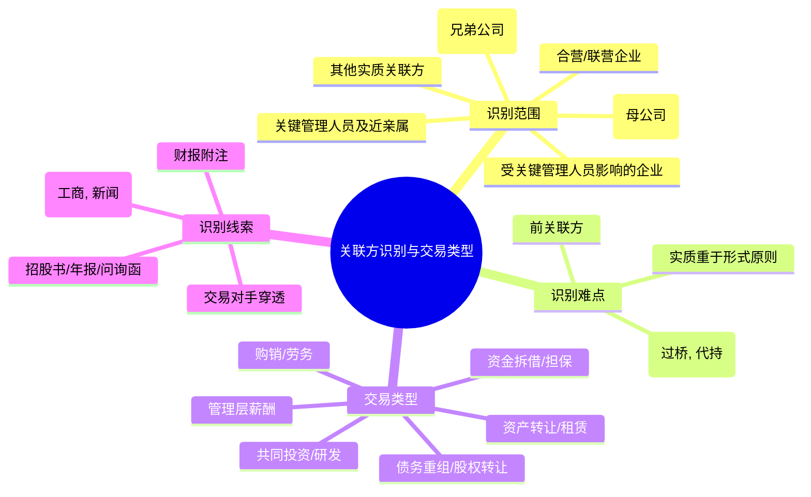

# 第八章：特定风险专题：深入"雷区"腹地

本章我们将深入探讨财务报表中常见的特定风险领域，这些领域往往是财务舞弊或经营危机的"重灾区"。作为财报使用者，尤其是以 CFO 的视角进行分析时，必须对这些"雷区"保持高度警惕，掌握识别和评估这些风险的方法，才能真正做到穿透数字，洞察风险。

## 8.1 关联交易风险：利益输送的"隐秘通道"

关联交易本身并非洪水猛兽，许多企业的正常经营活动都离不开关联方支持。然而，由于关联方关系的特殊性，关联交易也常常成为上市公司进行盈余管理、利益输送甚至掏空上市公司的"隐秘通道"。识别和评估关联交易风险，是判断财报质量和公司治理水平的关键环节。

### 8.1.1 关联方的识别与关联交易的类型

**关联方的定义与范围：**

根据会计准则（例如中国的 CAS 36号——关联方披露），关联方通常指一方控制、共同控制另一方或对另一方施加重大影响，以及两方或多方同受一方控制、共同控制或重大影响。这不仅包括母子公司、兄弟公司，还可能涵盖合营企业、联营企业、关键管理人员及其关系密切的家庭成员、受关键管理人员或其家庭成员控制或重大影响的企业等。

**常见的关联方识别难点：**

*   **隐性关联方：** 通过非关联第三方"过桥"、代持股份、复杂股权结构设计等方式隐藏的关联关系。
*   **"前关联方"：** 刚解除关联关系不久，但可能存在利益惯性或潜在安排的实体。
*   **实质重于形式：** 不能仅看法律形式，更要关注经济实质上的控制或影响关系。

**关联交易的主要类型：**

*   **购销商品或提供/接受劳务：** 最常见的类型，需关注定价公允性。
*   **资产转让/租赁：** 如购买/出售固定资产、无形资产，租赁房产设备等。
*   **提供资金（借款/担保）：** 关联方之间拆借资金或提供担保。
*   **关键管理人员薪酬：** 高管薪酬水平的合理性。
*   **共同投资或研发：** 合作项目中的资源投入与利益分配。
*   **债务重组/股权转让：** 在特殊时点进行的关联交易。

**识别关联交易的线索：**

*   **财报附注：** 最直接的来源，关注关联方清单、交易类型、金额、定价政策、余额等。
*   **招股说明书、年报、问询函回复：** 包含更详细的历史沿革、业务模式和关联交易信息。
*   **公开信息：** 通过工商信息、新闻报道、行业信息等交叉验证。
*   **交易对手分析：** 对主要客户、供应商进行穿透，看是否存在潜在关联关系。



### 8.1.2 关联交易的定价公允性判断

关联交易的核心风险在于定价不公允，从而实现利益输送。判断定价是否公允是分析的重点。

**判断原则：**

*   **独立交易原则 (Arm's Length Principle)：** 关联交易的定价应参照独立第三方之间在可比情况下进行类似交易所采用的价格。

**判断方法：**

1.  **可比非受控价格法：** 最直接的方法。寻找关联方与独立第三方之间相同或类似交易的价格。
2.  **再销售价格法：** 适用于关联购入后再销售给独立第三方的情况。以再销售价格扣除合理毛利和费用后确定关联购入价格。
3.  **成本加成法：** 以关联方的成本为基础，加上合理的利润加成确定交易价格。
4.  **交易净利润法：** 比较关联交易产生的净利润与可比非关联交易产生的净利润。
5.  **利润分割法：** 根据各关联方对交易整体利润的贡献程度来分配利润。

**实践中的挑战：**

*   **可比信息获取难：** 找到完全可比的非关联交易往往很困难。
*   **信息不对称：** 外部投资者难以掌握交易的全部细节和背景。
*   **"一揽子"交易：** 将公允与不公允的交易打包，难以单独评估。
*   **商业合理性考量：** 有些看似不公允的定价可能有其特定的商业理由（如战略协同、市场开拓），需要结合具体情况分析。

**需要警惕的信号：**

*   **交易价格显著偏离市场：** 明显高于或低于同期同类非关联交易价格。
*   **缺乏商业逻辑：** 交易对手选择、交易时点、交易条件等不符合常规商业逻辑。
*   **交易条件异常：** 如超长账期、无息借款、不需担保等。
*   **毛利率/净利率异常：** 与关联交易相关的业务利润率显著高于或低于公司其他业务或同行业水平。
*   **交易集中且依赖：** 对少数关联方的交易占比过高，形成依赖。

### 8.1.3 警惕通过关联交易进行的利润调节与资金占用

关联交易是调节利润和占用上市公司资金的常用手段。

**利润调节手法：**

*   **虚增收入/利润：**
    *   通过向关联方销售商品/提供劳务，并设定较高价格，虚增收入和利润。
    *   将本应费用化的支出通过关联交易转移给关联方承担。
    *   在资产处置时，将资产高价出售给关联方，确认大额处置收益。
*   **平滑利润/转移亏损：**
    *   在业绩较好年份，通过向关联方低价采购或承担额外费用，隐藏部分利润。
    *   在业绩较差年份，通过关联方"输血"或承担亏损，粉饰报表。
    *   将亏损业务或不良资产剥离给关联方。

**资金占用手法：**

*   **经营性占用：**
    *   向关联方提供长账期的应收账款。
    *   向关联方支付大额预付款项，但采购长期未执行或价格虚高。
    *   关联方拖欠上市公司款项。
*   **非经营性占用：**
    *   直接向关联方提供借款或委托贷款。
    *   为关联方提供担保，导致银行划扣上市公司资金。
    *   通过关联方代付投资款、费用等。

**识别线索：**

*   **应收/预付关联方款项余额巨大且账龄长：** 提示资金被占用风险。
*   **其他应收款中关联方占比高：** 可能是非经营性占用的直接体现。
*   **关联采购/销售占比与利润贡献不匹配：** 可能存在定价不公允或费用转移。
*   **频繁且复杂的关联资产交易：** 尤其是年底或业绩承诺期。
*   **为关联方提供大额担保：** 增加或有负债风险和潜在资金流出风险。
*   **现金流与利润背离：** 利润增长但经营现金流恶化，可能与关联方占款有关。

**案例警示：** 历史上许多 ST 公司或退市公司都曾爆出大股东及其关联方通过各种隐蔽手段占用上市公司巨额资金的问题，最终拖垮上市公司。对关联交易和关联方资金往来保持高度敏感性至关重要。

## 8.2 并购重组风险：商誉"爆雷"与整合难题

并购重组是企业实现外延式增长的重要手段，但也常常伴随着巨大的风险，尤其是高溢价并购形成的巨额商誉，以及并购后的整合难题。

### 8.2.1 并购估值过高与业绩承诺风险

**高估值的成因：**

*   **市场情绪与"风口"追逐：** 在热门行业或概念驱动下，标的估值水涨船高。
*   **交易双方信息不对称：** 收购方可能对标的资产的真实价值缺乏充分了解。
*   **"忽悠式"重组：** 部分并购意在炒作股价，而非真正着眼于产业整合。
*   **管理层过度自信或代理问题：** 管理层为了扩大规模或个人利益而推动高价并购。

**高估值的直接后果：**

*   **形成巨额商誉：** 收购价格超过标的可辨认净资产公允价值的部分确认为商誉。
*   **推高未来减值风险：** 一旦标的经营不及预期，商誉将面临减值，冲击利润。

**业绩承诺 (Earn-out) 安排：**

为了缓解高估值争议，并购交易中常常设置业绩承诺条款，即标的原股东承诺未来一定期限内（通常三年）标的公司的业绩达到一定水平，否则需进行补偿（现金或股份）。

**业绩承诺的风险：**

*   **承诺期内的"粉饰"：** 标的管理层可能有动机在承诺期内采取短期行为甚至财务造假来"完成"业绩。
*   **承诺期后的"业绩变脸"：** 一旦承诺期结束，约束消失，标的业绩可能迅速下滑。
*   **补偿执行风险：** 原股东可能无力支付补偿，或通过各种方式规避补偿责任。
*   **"精准"达标的疑点：** 每年业绩都"踩线"完成，可能并非真实经营结果。

**分析要点：**

*   **评估并购估值的合理性：** 对比同行业可比交易、标的自身盈利能力和增长前景。
*   **分析业绩承诺的可实现性：** 结合行业趋势、标的核心竞争力、管理层能力等判断。
*   **关注承诺期内的财务指标异常：** 如收入增长与现金流背离、利润率异常波动等。
*   **跟踪承诺期后的业绩表现及补偿执行情况。**

### 8.2.2 大额商誉的减值风险评估

商誉不进行摊销，但每年需要进行减值测试。商誉减值会对当期利润产生巨大冲击，是投资者高度关注的风险点。

**商誉减值测试的基本方法：**

将商誉分摊至相关的资产组或资产组组合（通常是被收购的企业或业务单元），然后比较包含商誉的资产组或资产组组合的可收回金额与其账面价值。

*   **可收回金额：** 取以下两者之孰高者：
    *   **公允价值减去处置费用后的净额：** 通常参考市场交易价格、评估价值等。
    *   **预计未来现金流量的现值 (Present Value of Future Cash Flows)：** 基于管理层对资产组未来现金流量的预测，并选择合适的折现率进行折现。

*   **账面价值：** 资产组或资产组组合中所有资产（包括分摊的商誉）的账面价值总和。

**如果可收回金额低于账面价值，则确认减值损失。** 减值损失首先冲减分摊至该资产组的商誉，商誉减记至零后，再按比例冲减资产组内其他各项资产的账面价值。

**商誉减值风险的识别信号：**

*   **宏观经济或行业环境恶化：** 导致被收购业务前景黯淡。
*   **技术变革或竞争加剧：** 削弱被收购业务的核心竞争力。
*   **被收购业务整合失败或协同效应未达预期：** 经营效率低下，盈利能力下滑。
*   **关键人员流失：** 影响被收购业务的持续运营。
*   **被收购业务持续亏损或经营现金流为负。**
*   **公司市值持续低于净资产：** 市场对公司整体价值的悲观预期可能预示着商誉减值风险。
*   **监管政策变化：** 对特定行业（如游戏、教育、医药）的并购标的产生重大不利影响。

**分析要点：**

*   **关注商誉占总资产/净资产的比重：** 比重越高，潜在风险越大。
*   **分析形成商誉的并购标的质量：** 盈利能力、行业地位、整合进展等。
*   **审阅财报附注中关于商誉减值测试的披露：** 关注关键假设（如增长率、利润率、折现率）的合理性。管理层在这些假设上有较大的调整空间。
*   **警惕"洗大澡"行为：** 公司可能在业绩较差的年份，一次性计提大额商誉减值，为未来"轻装上阵"做准备。
*   **将商誉减值风险纳入估值考量。**

```mermaid
graph LR
    A[并购交易] --> B{支付对价 > 可辨认净资产公允价值?};
    B -- 是 --> C(确认商誉);
    B -- 否 --> D(确认负商誉/营业外收入);
    C --> E{每年进行减值测试};
    E --> F[资产组/组合的可收回金额];
    E --> G[资产组/组合的账面价值(含商誉)];
    F & G --> H{可收回金额 < 账面价值?};
    H -- 是 --> I(确认商誉减值损失);
    H -- 否 --> J(无需减值);
    I --> K(冲击当期利润);

    subgraph "可收回金额 (取孰高)"
        F1[公允价值 - 处置费用]
        F2[预计未来现金流现值]
    end

    subgraph "减值测试触发因素"
        T1[宏观/行业恶化]
        T2[技术/竞争加剧]
        T3[整合失败/协同未达标]
        T4[关键人员流失]
        T5[持续亏损/负现金流]
        T6[市值低于净资产]
        T7[监管政策变化]
    end

    T1 & T2 & T3 & T4 & T5 & T6 & T7 -.-> E;
```

### 8.2.3 并购后的整合效果与协同效应检验

成功的并购不仅在于"买得好"，更在于"管得好"。并购后的整合是决定并购成败的关键，也是协同效应能否实现的前提。

**整合涉及的方面：**

*   **战略整合：** 明确并购后的战略定位、业务组合。
*   **组织与文化整合：** 调整组织架构、统一管理体系、融合企业文化。
*   **业务整合：** 优化供应链、共享客户资源、交叉销售、技术融合。
*   **财务整合：** 统一会计政策、财务系统、资金管理。
*   **人力资源整合：** 人员安置、薪酬体系、绩效考核。

**整合不力的表现：**

*   **被收购团队核心人员流失。**
*   **文化冲突导致内耗严重。**
*   **业务协同效果甚微，甚至产生负面影响。**
*   **财务指标（如收入增长、利润率）未达预期或恶化。**
*   **管理层精力分散，主业受到影响。**
*   **持续的组织架构调整和高管变动。**

**协同效应的类型：**

*   **收入协同：** 交叉销售、扩大市场份额、提升定价能力。
*   **成本协同：** 集中采购、共享生产设施、裁减冗余人员、降低管理费用。
*   **财务协同：** 优化资本结构、降低融资成本、税收筹划。

**检验协同效应的方法：**

*   **对比并购前后的财务数据：** 分析收入、成本、费用、利润率等指标的变化趋势，剔除其他因素影响后，评估并购带来的增量贡献。
*   **关注管理层的陈述与实际结果：** 将管理层在并购时描绘的协同效应蓝图与后续实际经营结果进行对比。
*   **分析非财务指标：** 如客户数量、市场份额、新产品推出速度、员工满意度等。
*   **与未进行并购的同行业公司对比：** 观察并购是否带来了相对竞争优势。

**分析要点：**

*   **并购整合是一个长期过程，需要持续跟踪。**
*   **警惕管理层夸大协同效应。**
*   **关注整合过程中的成本和风险。**
*   **将整合效果和协同效应的实现程度作为判断并购价值的重要依据。**

## 8.3 存货与应收账款风险：运营中的"堰塞湖"

存货和应收账款是企业运营资本的重要组成部分，但如果管理不善，过高的存货和应收账款会占用大量资金，并可能演变成减值损失，形成运营中的"堰塞湖"。

### 8.3.1 存货跌价准备计提充分性评估

存货需按照成本与可变现净值孰低计量，当可变现净值低于成本时，应计提存货跌价准备。计提是否充分，直接影响资产质量和当期利润。

**可变现净值：** 指在日常活动中，存货的估计售价减去至完工时估计将要发生的成本、估计的销售费用以及相关税费后的金额。

**需要计提跌价准备的情形：**

*   **产品滞销或过时：** 技术更新换代快、市场需求变化、产品有保质期。
*   **生产成本高于售价：** 原材料价格大幅上涨而售价无法同步提升。
*   **存货毁损或变质。**
*   **竞争对手大幅降价。**

**评估计提充分性的方法：**

1.  **分析存货库龄结构：** 库龄越长，跌价风险越大。关注长库龄存货占比及相应的跌价准备计提比例。
2.  **计算存货周转率并进行比较：** 周转率持续下降或显著低于同行，表明存货积压，跌价风险增加。
3.  **分析毛利率变化：** 毛利率异常下降可能预示着产品售价下跌或成本上升，需要关注存货跌价风险。若毛利率维持高位但存货周转率下降，需警惕跌价准备计提不足。
4.  **关注行业特性与产品特点：**
    *   **时尚、电子产品：** 更新换代快，跌价风险高。
    *   **大宗商品：** 价格波动大，需关注市场价格变化。
    *   **房地产：** 关注市场景气度、周边房价、去化周期。
    *   **定制化产品：** 一旦客户取消订单，跌价风险极高。
5.  **审阅财报附注关于存货跌价准备的计提政策和方法：** 关注计提方法是否一贯，有无变更。
6.  **结合新闻、行业报告等外部信息：** 判断市场环境、竞争格局的变化对存货价值的影响。
7.  **关注审计报告：** 存货监盘和跌价准备计提往往是审计的关键领域。

**计提不足的后果：**

*   **虚增资产和利润：** 未能真实反映存货价值。
*   **未来可能集中"爆雷"：** 问题积累到一定程度后，被迫大幅计提减值，对后续年度利润造成冲击。

### 8.3.2 应收账款账龄分析与坏账风险识别

应收账款代表企业未来收回现金的权利，但同时也面临客户无法支付的坏账风险。账龄越长，回收的可能性越低，坏账风险越高。

**坏账准备的计提方法：**

*   **账龄分析法：** 最常用。根据应收账款的账龄长短，设定不同的坏账计提比例。账龄越长，比例越高。
*   **余额百分比法：** 按期末应收账款余额的一定百分比计提。
*   **个别认定法：** 对有明确证据表明无法收回的款项，单独全额或部分计提。
*   **预期信用损失模型 (IFRS 9 / 新金融工具准则)：** 要求基于历史数据、当前状况和未来预测，评估整个存续期内的预期信用损失。比传统方法更具前瞻性，但也更复杂，主观性更强。

**评估坏账风险与计提充分性的方法：**

1.  **分析应收账款账龄结构：** 关注长账龄（如 1 年以上）应收账款的占比及其变化趋势。占比过高或快速增加是危险信号。
2.  **计算应收账款周转率并进行比较：** 周转率持续下降或显著低于同行，表明回款速度变慢，坏账风险加大。
3.  **分析客户集中度：** 对单一客户或少数几个客户的应收账款占比过高，一旦这些客户出现问题，将产生巨大坏账损失。
4.  **关注主要债务人的信用状况：** 通过公开信息、信用报告等了解主要客户的经营和财务状况。
5.  **分析关联方应收账款：** 关联方占款往往坏账风险更高。
6.  **审阅坏账准备计提政策：** 对比同行业公司的计提政策是否谨慎。过于宽松的计提政策可能隐藏风险。关注有无变更会计估计以调节利润的动机。
7.  **核对"销售商品收到的现金"与营业收入：** 两者差异过大且持续扩大，表明收入质量差，回款困难。
8.  **关注是否有大额应收账款核销或转让：** 分析核销的原因和转让的条件。
9.  **结合预期信用损失模型的要求：** 分析公司是否充分考虑了宏观经济、行业风险和客户特定信息。

**计提不足的后果：**

*   **虚增资产和利润。**
*   **掩盖真实的经营现金流压力。**
*   **未来可能集中计提坏账，侵蚀利润。**

### 8.3.3 存货与应收账款周转率的联合分析

单独分析存货周转率或应收账款周转率可能不够全面，将两者结合起来，计算营业周期，可以更深入地评估企业的营运效率和资金占用情况。

**营业周期 (Operating Cycle) = 存货周转天数 + 应收账款周转天数**

*   **存货周转天数 = 365 / 存货周转率** (存货周转率 = 营业成本 / 平均存货)
*   **应收账款周转天数 = 365 / 应收账款周转率** (应收账款周转率 = 营业收入 / 平均应收账款)

**营业周期的意义：** 反映了企业从取得存货到销售存货并收回现金所需的平均时间。营业周期越短，表明存货和应收账款周转速度越快，资金占用越少，营运效率越高。

**联合分析的视角：**

1.  **趋势分析：** 观察营业周期是延长还是缩短。持续延长是危险信号，表明营运效率下降，资金沉淀增加。
2.  **结构分析：** 分析是存货周转变慢还是应收账款回收变慢导致营业周期延长，从而定位问题的关键环节。
    *   **存货周转慢，应收周转快：** 问题可能在生产、采购或销售环节，产品竞争力下降或库存管理不善。
    *   **存货周转快，应收周转慢：** 问题可能在信用政策或收款环节，可能为扩大销售而放宽了信用条件，导致回款压力增大。
    *   **两者都变慢：** 公司整体运营可能面临较大困难。
3.  **横向比较：** 与同行业优秀公司对比，分析自身差距和潜在风险。行业不同，营业周期差异很大。
4.  **结合现金周期：**
    **现金周期 (Cash Conversion Cycle) = 营业周期 - 应付账款周转天数**
    (应付账款周转天数 = 365 / 应付账款周转率； 应付账款周转率 = 营业成本 / 平均应付账款)
    现金周期反映了企业从支付采购款到收回销售款所需的净时间。优秀的模式（如零售业某些巨头）甚至可以实现负的现金周期，意味着利用供应商的资金进行运营。

**风险信号：**

*   营业周期显著长于同行且持续延长。
*   存货周转天数和应收账款周转天数同时恶化。
*   为维持周转率而采取激进的销售政策（如大幅降价、放宽信用），损害盈利能力。

## 8.4 债务风险与流动性危机：压垮骆驼的"稻草"

过度负债和流动性管理不善是导致企业陷入财务困境甚至破产的关键因素。识别和评估债务风险与流动性状况至关重要。

### 8.4.1 短债长用与债务结构错配风险

**短债长用 (Borrowing Short to Lend Long / Fund Long-term Assets with Short-term Debt)：** 指企业使用短期借款（如一年内到期的贷款、短期融资券）来为长期资产（如固定资产投资、长期股权投资）提供资金。

**风险所在：**

*   **流动性风险：** 短期债务到期时，企业需要不断借入新的短期债务来偿还旧债（滚动融资）。一旦融资环境收紧（如银行抽贷、债券发行困难），或者企业自身信用状况恶化，将面临巨大的偿债压力，甚至引发流动性危机。
*   **利率风险：** 短期借款的利率通常会随市场波动，滚动融资可能面临利率上升，增加财务成本。
*   **期限错配：** 长期资产的投资回报周期较长，短期内难以产生足够的现金流来覆盖到期的短期债务。

**识别信号：**

1.  **流动比率、速动比率较低：** 流动资产难以覆盖流动负债。
2.  **短期借款占总负债/总资产的比重过高：** 尤其是显著高于同行业水平。
3.  **经营活动现金流持续为负或不足以覆盖短期债务：** 企业依赖外部融资维持运营和偿债。
4.  **投资活动现金流持续大额流出：** 大量资金用于长期投资项目。
5.  **筹资活动现金流中，偿还债务支付的现金与借款收到的现金规模巨大且频繁：** 显示滚动融资的特征。
6.  **资产负债表中存在大量"其他流动负债"：** 可能隐藏了短期融资券等。
7.  **关注借款期限结构披露：** 附注中通常会披露按期限划分的债务信息。

**债务结构错配：** 不仅指短债长用，也包括债务的币种、利率类型（固定/浮动）与企业资产、现金流的币种、利率敏感性不匹配带来的风险。例如，大量美元负债而收入主要为人民币的企业，会面临较大的汇率风险。

### 8.4.2 再融资风险与现金流覆盖能力评估

**再融资风险 (Refinancing Risk)：** 指企业在现有债务到期时，无法以可接受的成本获得新融资来偿还旧债的风险。这是短债长用风险的核心体现。

**影响再融资能力的因素：**

*   **宏观经济与金融环境：** 货币政策收紧、信贷紧缩、资本市场低迷会增加再融资难度。
*   **企业自身信用状况：** 经营恶化、财务指标下滑、评级下调、负面舆情会严重影响融资能力和成本。
*   **行业风险：** 所在行业被银行或市场视为高风险，可能遭遇"一刀切"式的融资限制。
*   **过度依赖单一融资渠道：** 如过度依赖银行贷款，一旦银行抽贷将陷入困境。
*   **资产质量与抵押能力：** 优质资产少、可用于抵押担保的资产不足。

**现金流覆盖能力评估：**

评估企业依靠自身经营产生的现金流偿还债务本息的能力。

**常用指标：**

1.  **利息保障倍数 (Interest Coverage Ratio) = (利润总额 + 利息费用) / 利息费用 或 EBIT / 利息费用**
    衡量企业利润覆盖利息支出的能力。通常认为大于 3 较安全，低于 1.5 则风险较高。
    *   **局限性：** 基于利润而非现金流，可能无法反映真实偿付能力。
2.  **现金利息保障倍数 = (经营活动现金流量净额 + 支付的利息 + 支付的所得税) / 支付的利息**
    衡量经营现金流覆盖利息支出的能力，更可靠。
3.  **经营活动现金流 / 总负债：** 衡量经营现金流覆盖全部债务的能力。比率越高越好。
4.  **经营活动现金流 / 流动负债：** 衡量经营现金流覆盖短期债务的能力。
5.  **自由现金流 (FCF) / 总负债：** 衡量企业在维持运营和必要资本开支后，可用于偿还债务的现金流能力。

**分析要点：**

*   **动态分析：** 观察现金流覆盖指标的变化趋势。持续下降是危险信号。
*   **结合债务到期结构：** 分析未来 1-3 年内到期债务的规模，评估届时的现金流能否覆盖。
*   **考虑营运资本波动：** 经营现金流会受存货、应收应付款项变化的影响，需考虑其可持续性。
*   **压力测试：** 模拟在收入下降、成本上升或融资成本增加等不利情况下的现金流覆盖能力。

### 8.4.3 关注交叉违约条款与评级下调风险

**交叉违约条款 (Cross Default Clause)：** 贷款或债券协议中的常见条款。指如果借款人在与其他债权人的任何债务上发生违约（未按时支付本息等），则本次贷款/债券也视为违约，债权人有权要求立即偿还全部本息。

**风险放大效应：** 交叉违约条款具有"多米诺骨牌"效应。企业在一笔小额债务上的违约，可能触发所有包含交叉违约条款的大额债务同时到期，迅速将企业推向流动性枯竭的边缘。

**识别与分析：**

*   **审阅主要借款合同和债券募集说明书：** 查看是否存在交叉违约条款及其触发条件。
*   **关注企业的任何债务逾期或违约信息：** 即使金额不大，也可能引发连锁反应。
*   **评估企业最薄弱的环节：** 哪一笔债务最有可能先发生违约？

**信用评级下调风险 (Rating Downgrade Risk)：** 信用评级机构（如穆迪、标普、惠誉以及国内的中诚信、联合资信等）对企业主体或其发行的债券信用等级进行下调。

**评级下调的影响：**

*   **增加再融资难度和成本：** 评级越低，投资者要求的风险溢价越高，融资成本越高，甚至可能无法获得融资。
*   **触发某些协议条款：** 部分贷款或债券协议可能规定，评级下调到某一级别以下即构成违约或需要追加担保。
*   **影响商业合作：** 供应商可能要求更严格的付款条件，客户可能担忧企业持续经营能力。
*   **股价下跌：** 市场通常会将评级下调视为重大利空。

**分析要点：**

*   **关注企业的信用评级及其变化趋势。**
*   **了解评级机构发布评级报告的理由：** 分析导致评级下调的关键因素（如盈利下滑、债务负担加重、公司治理问题等）。
*   **警惕"展望负面"的评级：** 这通常是未来可能下调评级的前兆。
*   **分析评级下调对企业融资和经营的具体影响。**

## 8.5 公司治理与内部控制风险

良好的公司治理和有效的内部控制是企业健康运营、财报信息可靠的基础。治理混乱、内控失效往往是财务舞弊和经营风险的温床。

### 8.5.1 股权结构集中与"一言堂"风险

**股权结构过于集中：** 指控股股东（实际控制人）持股比例过高，或者存在一致行动人合计持股比例过高。

**风险：**

*   **大股东利益输送：** 控股股东可能利用其控制地位，通过关联交易、资金占用等方式侵占上市公司利益。
*   **决策缺乏制衡：** 董事会、股东大会可能成为大股东的"橡皮图章"，"一言堂"现象严重，中小股东利益难以保障。
*   **战略决策失误风险：** 缺乏不同意见和充分论证，可能导致盲目扩张或投资失误。
*   **关键人物风险：** 公司命运过度依赖实际控制人个人，一旦其出现问题（健康、法律等），公司可能陷入混乱。

**识别信号：**

*   **第一大股东持股比例远超其他股东（如超过 50%甚至更高）。**
*   **存在股权质押比例过高的大股东：** 大股东自身资金紧张，可能更有动机掏空上市公司。
*   **董事会成员多数由大股东提名或委派，缺乏独立性。**
*   **监事会未能有效发挥监督作用。**
*   **历史上存在大股东侵害公司利益的行为。**

**股权过于分散的风险：** 虽然能避免"一言堂"，但也可能导致无人对公司真正负责、决策效率低下、易受外部"野蛮人"收购等问题。需要寻求一种相对均衡的股权结构。

### 8.5.2 董事会、监事会与管理层的制衡与独立性

有效的公司治理结构要求董事会、监事会和管理层之间形成权力的制衡 (Checks and Balances)。

**理想状态：**

*   **董事会 (Board of Directors)：** 负责制定公司战略、选举和监督管理层、保护股东利益。应包含足够数量、具备专业能力且真正独立的非执行董事（特别是独立董事）。
*   **监事会 (Board of Supervisors)：** （在中国公司法框架下）负责监督董事和高级管理人员的行为、检查公司财务。成员应具有独立性。
*   **管理层 (Management)：** 负责执行董事会决议，处理日常经营事务。

**常见的治理缺陷：**

*   **董事长与 CEO 两职合一 (Chairman and CEO Duality)：** 权力过于集中于一人。
*   **独立董事"不独立"：** 与大股东或管理层存在裙带关系、利益关联，或缺乏专业能力、不敢或不愿发表独立意见，成为"花瓶"或"人情董事"。
*   **董事会构成单一：** 成员背景、经验、性别等过于同质化，缺乏多元视角。
*   **监事会形同虚设：** 监督职能未能有效履行。
*   **内部审计部门地位不高，缺乏独立性。**
*   **信息披露不透明、不及时。**

**分析要点：**

*   **查阅公司章程、年报中的公司治理报告。**
*   **分析董事会、监事会成员的背景、履历、兼职情况，判断其独立性和专业性。**
*   **关注独立董事发表的意见，尤其是反对或弃权票。**
*   **留意董事、监事、高管的变动频率和原因。**
*   **观察公司对监管问询、投资者质疑的回应态度和质量。**
*   **将公司治理水平纳入风险评估和投资决策。**

### 8.5.3 内部控制缺陷及其对财报可靠性的影响

**内部控制 (Internal Control)：** 指由企业董事会、监事会、管理层和全体员工实施的、旨在实现控制目标（如保证资产安全、财务报告可靠、经营活动合规高效）的过程。

**萨班斯-奥克斯利法案 (SOX) 404 条款：** 要求在美国上市的公司管理层评估和报告公司内部控制的有效性，并由外部审计师进行审计。中国的《企业内部控制基本规范》及配套指引也有类似要求。

**内部控制缺陷的类型：**

*   **重大缺陷 (Material Weakness)：** 指一项或多项控制缺陷的组合，使得财务报表存在重大错报的可能性不能被合理预防或发现。这是最严重的问题。
*   **重要缺陷 (Significant Deficiency)：** 指一项或多项控制缺陷的组合，其严重程度低于重大缺陷，但足以引起治理层（如审计委员会）的重视。
*   **一般缺陷 (Control Deficiency)：** 指设计或运行上的缺陷，未能及时预防或发现错报。

**内部控制缺陷的影响：**

*   **增加财务报表错报风险：** 内控失效，财务数据的准确性和完整性无法保证，可能导致无意的错误或有意的舞弊。
*   **资产被盗用或流失风险：** 对货币资金、存货、固定资产等的控制不足。
*   **经营效率低下，资源浪费。**
*   **违反法律法规风险。**
*   **损害公司声誉。**

**识别内部控制缺陷的线索：**

*   **审计报告中的"内部控制审计报告"：** 如果出具了否定意见或无法表示意见的内控审计报告，表明存在重大缺陷。关注其中描述的具体缺陷内容。
*   **年报中管理层对内部控制自我评价的结论：** 是否认定为有效？披露了哪些缺陷？
*   **频繁的会计差错更正。**
*   **监管机构的处罚或调查，涉及内控问题。**
*   **媒体关于公司管理混乱、舞弊事件的报道。**
*   **关键岗位人员流失率高。**
*   **复杂的组织结构和交易流程，缺乏有效监控。**

**分析要点：**

*   **内部控制的有效性是财报可靠性的基础。**
*   **关注内控缺陷的性质、严重程度及其对财报可能产生的影响。**
*   **评估管理层对已识别缺陷的整改措施和效果。**
*   **将内控风险作为评估整体风险的重要组成部分。**

---
本章聚焦于关联交易、并购重组、存货与应收账款、债务与流动性以及公司治理与内控这五大特定风险领域。理解这些风险的成因、表现形式和识别方法，有助于财报使用者更深入地评估企业面临的潜在威胁，避免投资"踩雷"。下一章我们将探讨不同行业的财报特点和分析要点。 