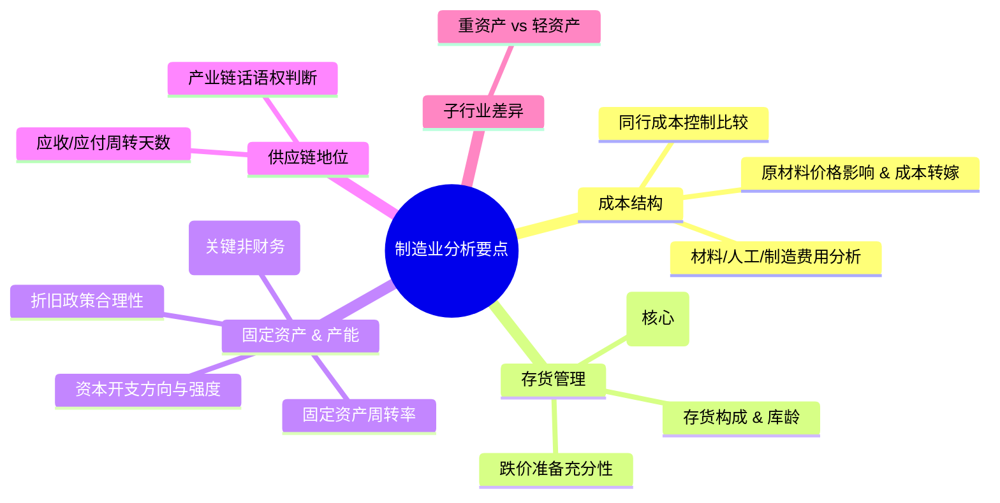

# 第九章：行业特性与财报分析要点

财务报表是企业经营活动的通用语言，但不同的行业如同不同的方言，有着各自独特的表达方式和关注重点。脱离行业背景进行财报分析，如同盲人摸象，难以把握企业的真实面貌和核心竞争力。本章将探讨不同行业的财报特点、关键指标以及分析时需要特别关注的要点，帮助读者建立基于行业的分析框架。

## 9.1 不同行业财报特点与分析侧重点

理解行业的商业模式、盈利驱动因素、竞争格局和监管环境，是进行有效财报分析的前提。我们将选取几个代表性行业进行剖析。

### 9.1.1 制造业：成本结构、存货周转、产能利用率

制造业是将原材料通过加工过程转化为产成品的行业，其核心在于生产效率和成本控制。

**财报特点：**

*   **资产负债表：**
    *   **存货占比高：** 包括原材料、在产品、产成品，是资产的重要组成部分。
    *   **固定资产占比高：** 厂房、机器设备等是生产的基础，折旧是重要的成本项。
    *   **应收账款和应付账款：** 在产业链中地位不同，导致这两项的规模和周转情况差异较大。
*   **利润表：**
    *   **营业成本是主要支出：** 材料成本、人工成本、制造费用（含折旧）是核心。
    *   **毛利率是关键盈利指标：** 反映产品竞争力和成本控制能力。
    *   **规模效应显著：** 固定成本占比较高，产量提升能摊薄单位成本，提升利润率。
*   **现金流量表：**
    *   **经营活动现金流：** 受存货、应收应付账款变动影响大。
    *   **投资活动现金流：** 购建固定资产是主要的现金流出项，反映产能扩张或设备更新。

**分析侧重点：**

1.  **成本结构分析：**
    *   分析材料、人工、制造费用的构成及变动趋势。
    *   关注原材料价格波动对成本和毛利率的影响，以及成本转嫁能力。
    *   比较同行业公司的成本控制水平。
2.  **存货管理分析：**
    *   **存货周转率：** 核心指标，反映存货管理效率和变现能力。周转率过低提示滞销和跌价风险。
    *   **存货构成与库龄：** 分析原材料、在产品、产成品的比例，关注长库龄存货。
    *   **存货跌价准备：** 评估计提是否充分。
3.  **固定资产与产能分析：**
    *   **固定资产周转率：** 衡量固定资产使用效率。
    *   **产能利用率 (Capacity Utilization Rate)：** 关键非财务指标，反映设备运转效率和市场需求匹配度。产能利用率过低会拉低毛利率。
    *   **资本开支 (Capex)：** 分析投资方向（维持性 vs. 扩张性）、投资强度及未来产能释放节奏。
    *   **折旧政策：** 对比同行业，判断是否合理，有无调节利润空间。
4.  **供应链地位：**
    *   通过应收账款周转天数和应付账款周转天数，判断企业在产业链中的话语权。
    *   强势企业通常应收账款周转快，应付账款周转慢（占用供应商资金）。

**子行业差异：**

*   **重资产制造业 (如钢铁、化工、汽车)：** 固定资产占比极高，规模效应和周期性更显著，环保投入大。
*   **轻资产制造业 (如消费电子组装)：** 固定资产相对较轻，但存货和应收账款管理至关重要，技术更新快，研发投入也是重点。



### 9.1.2 零售业：坪效、同店增长、库存管理

零售业是直接面向终端消费者的行业，核心在于渠道效率、商品管理和客户体验。

**财报特点：**

*   **资产负债表：**
    *   **存货是核心资产：** 商品的快速周转是生命线。
    *   **固定资产：** 门店（自有或租赁）是主要构成，租赁模式下使用权资产和租赁负债是重要项目（新租赁准则下）。
    *   **预付账款：** 可能涉及向供应商支付的定金或预付款。
    *   **应付账款：** 通常能占用供应商较长账期，是重要的无息融资来源。
*   **利润表：**
    *   **毛利率相对稳定但可能不高：** 取决于品类和议价能力。
    *   **期间费用（尤其是销售费用）占比高：** 门店租金、员工薪酬、营销推广是主要支出。
    *   **净利率通常不高：** 依赖高周转实现盈利。
*   **现金流量表：**
    *   **经营活动现金流通常较好：** 销售现款结算多，且能占用供应商资金。
    *   **投资活动现金流：** 主要用于门店开设、装修、信息系统投入。

**分析侧重点：**

1.  **营运效率分析：**
    *   **存货周转率：** 核心中的核心。周转越快越好，但过快也可能意味着缺货。
    *   **应付账款周转率/天数：** 衡量对供应商的资金占用能力。
    *   **现金转换周期：** 零售业往往能做到负的现金周期，是其商业模式优势。
2.  **门店效率与增长分析：**
    *   **坪效 (Sales per Square Foot/Meter)：** 衡量单店面积的销售产出能力，是重要的非财务指标。
    *   **同店增长率 (Same-Store Sales Growth, SSSG)：** 剔除新开店影响，衡量老店的内生增长能力，是判断零售企业健康度的关键指标。
    *   **客单价与客流量：** 驱动销售增长的两个维度。
    *   **关店率与开店速度：** 反映扩张策略和门店调整情况。
3.  **盈利能力分析：**
    *   **毛利率：** 分析品类结构、采购议价能力、促销活动的影响。
    *   **销售费用率/管理费用率：** 关注租金、人工成本的控制情况。
    *   **净利率：** 结合周转率看整体盈利水平。
4.  **库存管理与跌价风险：**
    *   尤其关注服装、生鲜等易过时、易损耗品类的库存状况。
    *   存货跌价准备计提是否充分。
5.  **线上线下融合 (O2O / Omnichannel)：**
    *   关注线上销售占比、增速及其对整体利润率的影响。
    *   分析线上引流成本、物流配送效率。

**子行业差异：**

*   **超市/便利店：** SKU 多，周转快，毛利率低，坪效和同店增长是关键。
*   **百货商场：** 联营模式多（收取扣点），自营模式少，更关注招商能力和客流。
*   **专业连锁 (如电器、家居、服饰)：** 毛利率相对较高，但库存管理和品牌建设更重要。
*   **电商：** 轻资产，无门店租金，但获客成本、物流成本、平台费用是关键支出，用户数据（GMV, Active Users, ARPU）是核心非财务指标。

### 9.1.3 科技/互联网：研发投入、用户数据、变现模式、Non-GAAP 指标

科技和互联网行业通常具有高成长、高风险、轻资产、网络效应显著等特点。

**财报特点：**

*   **资产负债表：**
    *   **无形资产（含商誉）可能占比较高：** 源于研发投入资本化和并购。
    *   **固定资产相对较轻：** 服务器、办公设备等，除非是重资产的硬件科技公司。
    *   **货币资金充裕：** 盈利能力强或持续融资。
    *   **递延收入 (Deferred Revenue)：** 预收的客户款项（如会员费、云服务费），未来需确认为收入。
*   **利润表：**
    *   **高毛利率：** 软件、平台型公司尤为突出，边际成本低。
    *   **高研发费用：** 持续投入是维持竞争力的关键，关注费用化与资本化的比例。
    *   **高销售与市场费用：** 用于获客和品牌建设。
    *   **股权激励费用 (Share-based Compensation, SBC)：** 常见且金额可能巨大，对 GAAP 净利润影响显著。
    *   **可能阶段性亏损：** 尤其是在快速扩张和投入期。
*   **现金流量表：**
    *   **经营活动现金流：** 可能与净利润差异较大（受递延收入、股权激励等非现金项目影响）。
    *   **投资活动现金流：** 研发投入资本化部分、对外投资、并购是主要流出。
    *   **筹资活动现金流：** 融资活动频繁，尤其是成长期公司。

**分析侧重点：**

1.  **用户数据与增长质量 (关键非财务指标)：**
    *   **用户规模：** MAU (月活跃用户), DAU (日活跃用户), 付费用户数等。
    *   **用户粘性与活跃度：** 使用时长、留存率 (Retention Rate)。
    *   **获客成本 (Customer Acquisition Cost, CAC)：** 衡量获取新用户的成本。
    *   **用户生命周期价值 (Customer Lifetime Value, LTV)：** 预测单个用户在整个生命周期内能带来的总价值。健康的模式要求 LTV > CAC。
    *   **市场份额与渗透率。**
2.  **变现模式与盈利能力：**
    *   **主要收入来源：** 广告、游戏、电商佣金、订阅费、云服务、软件授权等。
    *   **ARPU (Average Revenue Per User) / ARPPU (Average Revenue Per Paying User)：** 单用户平均收入/单付费用户平均收入。
    *   **毛利率：** 核心盈利能力指标。
    *   **关注 Non-GAAP 指标：** 剔除股权激励、并购相关摊销等非现金或一次性项目后的调整后净利润 (Adjusted Net Income) 或调整后 EBITDA，更能反映核心经营表现。
3.  **研发投入分析：**
    *   **研发费用占收入比重：** 衡量投入强度。
    *   **研发费用绝对额增长：** 持续投入的意愿。
    *   **研发费用资本化比例：** 过高的资本化比例可能虚增当期利润，需关注其合理性及未来摊销压力。
    *   **研发成果转化：** 新产品/服务上线情况、专利数量等（定性）。
4.  **现金流状况：**
    *   **经营活动现金流：** 是否能覆盖日常运营和部分投入？
    *   **自由现金流：** 衡量内生造血能力。
    *   **现金储备与融资能力：** 对于亏损公司尤为重要，判断能"烧钱"多久。
5.  **监管风险与政策影响：**
    *   反垄断、数据安全、隐私保护、内容审核等政策对互联网平台影响巨大。

**子行业差异：**

*   **SaaS (Software as a Service)：** 关注订阅收入、续约率、客户流失率 (Churn Rate)、递延收入。
*   **云计算 (IaaS, PaaS)：** 关注收入增速、市场份额、资本开支（数据中心建设）。
*   **游戏：** 关注流水 (Gross Billings)、新游戏表现、老游戏生命周期、研发能力。
*   **电商平台：** 关注 GMV (Gross Merchandise Volume)、活跃买家/卖家数、货币化率 (Take Rate)。
*   **硬件科技：** 更接近制造业，但研发投入和技术迭代速度要求更高。

```mermaid
graph TD
    A[科技/互联网分析要点] --> B(用户数据 & 增长质量);
    A --> C(变现模式 & 盈利能力);
    A --> D(研发投入);
    A --> E(现金流状况);
    A --> F(监管风险 & 政策);

    B --> B1[用户规模 (MAU/DAU/付费)];
    B --> B2[用户粘性 (留存率)];
    B --> B3[获客成本 (CAC)];
    B --> B4[用户生命周期价值 (LTV)];
    B --> B5[市场份额/渗透率];

    C --> C1[收入来源 (广告/游戏/订阅等)];
    C --> C2[ARPU / ARPPU];
    C --> C3[毛利率];
    C --> C4[Non-GAAP 指标 (Adj. NI/EBITDA)];

    D --> D1[研发费用率 & 绝对额];
    D --> D2[资本化比例 & 合理性];
    D --> D3[研发成果转化];

    E --> E1[经营现金流 vs 净利润];
    E --> E2[自由现金流];
    E --> E3[现金储备 & 融资能力];

    subgraph 子行业举例
        S1[SaaS: 续约率, 流失率, 递延收入]
        S2[云计算: 收入增速, Capex]
        S3[游戏: 流水, 生命周期]
        S4[电商: GMV, Take Rate]
        S5[硬件: 研发 & 技术迭代]
    end
```

### 9.1.4 金融业：资本充足率、不良贷款率、风险加权资产

金融业（以银行为代表）是经营风险的特殊行业，其资产主要是对外发放的贷款和投资，负债主要是吸收的存款和同业负债。高杠杆经营是其显著特点。

**财报特点：**

*   **资产负债表：**
    *   **规模巨大，高杠杆：** 总资产远大于净资产。
    *   **资产端：** 发放贷款和垫款、金融投资（债券、股票等）是主要构成。
    *   **负债端：** 吸收存款、同业负债、发行债券是主要来源。
    *   **所有者权益：** 核心一级资本、其他一级资本、二级资本构成复杂，满足监管要求。
*   **利润表：**
    *   **收入来源：** 净利息收入（利息收入-利息支出）是主体，手续费及佣金净收入、投资收益等也是重要组成。
    *   **主要支出：** 业务及管理费、信用减值损失（贷款拨备）。
*   **现金流量表：** 与非金融企业可比性差，分析意义相对较小，重点关注资产负债表和利润表。

**分析侧重点：**

1.  **资产质量分析：**
    *   **不良贷款率 (Non-Performing Loan Ratio, NPL Ratio)：** 核心风险指标。不良贷款余额 / 总贷款余额。需关注其变化趋势及认定标准（逾期90天以上通常计入）。
    *   **关注类贷款占比：** 不良贷款的"后备军"，占比过高预示未来不良率可能上升。
    *   **贷款损失准备 (拨备) 覆盖率：** 贷款损失准备 / 不良贷款余额。衡量银行抵御风险的能力，通常要求高于 150%。
    *   **拨备计提充足性 (拨贷比)：** 贷款损失准备 / 总贷款余额。监管有最低要求（如 2.5%）。
    *   **贷款行业/区域集中度：** 过度集中于某个高风险行业或区域会增加风险。
2.  **资本充足率分析 (Capital Adequacy Ratio, CAR)：**
    *   **核心一级资本充足率 / 一级资本充足率 / 资本充足率：** 衡量银行自有资本抵御风险的能力，必须满足监管最低要求（巴塞尔协议 III 及各国规定）。计算公式为：(各级资本 / 风险加权资产)。
    *   **风险加权资产 (Risk-Weighted Assets, RWA)：** 根据资产的不同风险水平赋予不同权重后加总，风险越高的资产（如信用贷款）权重越高，需要的资本越多。
    *   **资本补充压力：** 若逼近监管红线，银行需要通过利润留存、增发股票、发行资本补充债券等方式补充资本，否则会限制业务扩张。
3.  **盈利能力分析：**
    *   **净息差 (Net Interest Margin, NIM)：** (利息收入 / 平均生息资产) - (利息支出 / 平均付息负债)。衡量银行存贷款业务的盈利空间，是关键盈利驱动因素。
    *   **净利差 (Net Interest Spread)：** 平均生息资产收益率 - 平均付息负债成本率。
    *   **非利息收入占比：** 手续费、佣金、投行、资管等业务贡献。多元化收入结构有助于提升盈利稳定性和估值。
    *   **成本收入比 (Cost-to-Income Ratio)：** 业务及管理费 / 营业收入。衡量经营效率。
4.  **流动性风险分析：**
    *   **流动性覆盖率 (Liquidity Coverage Ratio, LCR)：** 优质流动性资产 / 未来 30 天现金净流出量。衡量短期流动性抗压能力。
    *   **净稳定资金比率 (Net Stable Funding Ratio, NSFR)：** 可用的稳定资金 / 业务所需的稳定资金。衡量中长期资金来源的稳定性。
    *   **存贷比 (Loan-to-Deposit Ratio)：** 贷款总额 / 存款总额。过高意味着依赖批发性融资，流动性风险较大。

**子行业差异：**

*   **大型国有银行：** 规模大，网点多，负债成本低，风控稳健，但成长性相对较低。
*   **股份制银行：** 机制灵活，创新意愿强，非息收入占比可能更高，但风险偏好和负债成本可能也更高。
*   **城商行/农商行：** 区域性经营，可能受益于地方经济，但也可能受区域风险影响更大。
*   **券商：** 业务包括经纪、投行、资管、自营等，业绩与资本市场景气度高度相关，关注杠杆率、风险控制能力、资本实力。
*   **保险：** "负债驱动资产"模式，保费收入是主要负债，投资端收益和风险管理是关键，关注偿付能力充足率、内含价值 (EV)、新业务价值 (VNB)。

### 9.1.5 房地产：预收账款、存货（土地储备）、负债结构（三道红线）

房地产业是典型的资金密集型和高杠杆行业，周期性强，受政策调控影响大。

**财报特点：**

*   **资产负债表：**
    *   **存货占比极高：** 主要包括土地储备（原材料）、在建开发产品（在产品）、已完工开发产品（产成品）。是资产的核心。
    *   **预收款项/合同负债占比高：** 房屋预售制度导致大量销售款提前收取，是重要的无息负债来源，但未来需结转为收入。
    *   **投资性房地产：** 持有用于出租或增值的物业。
    *   **高负债率：** 开发贷、债券、信托等有息负债规模大。
*   **利润表：**
    *   **收入确认滞后：** 通常在房屋交付时确认收入，因此利润释放滞后于销售。
    *   **营业成本：** 土地成本、建安成本是主要构成。
    *   **毛利率：** 受土地成本、房价、产品定位影响大。
    *   **期间费用：** 销售费用（营销推广）、管理费用、财务费用（利息资本化部分计入存货成本，费用化部分计入当期损益）。
*   **现金流量表：**
    *   **经营活动现金流波动大：** 收到的销售款（预售）流入，支付的土地款、建安款流出。拿地高峰期可能为负。
    *   **投资活动现金流：** 收购项目公司股权、处置资产等。
    *   **筹资活动现金流：** 借款、发债、股权融资是主要流入，偿还债务是主要流出。是维持运营的关键。

**分析侧重点：**

1.  **销售与回款分析 (领先指标)：**
    *   **合同销售额/销售面积：** 比报表收入更能反映当期经营情况和未来收入潜力。
    *   **销售回款率：** 销售额中实际收到的现金比例，衡量销售质量和现金流状况。
    *   **去化率：** 推盘量中实际销售的比例，反映市场接受度和营销能力。
2.  **土地储备分析：**
    *   **总土地储备面积/货值：** 决定未来发展潜力。
    *   **土地储备结构：** 一二线城市占比、区域分布、成本结构。
    *   **拿地策略：** 招拍挂、收并购、旧改等方式的成本和风险。
    *   **权益比例：** 合作开发项目中，实际归属公司的权益货值。
3.  **杠杆与偿债风险分析：**
    *   **"三道红线"监管指标 (中国)：**
        *   **剔除预收款后的资产负债率 < 70%**
        *   **净负债率 < 100%** (净负债 = 有息负债 - 货币资金)
        *   **现金短债比 > 1** (现金短债比 = 货币资金 / 短期有息负债)
    *   **有息负债规模与结构：** 总量、长短期比例、融资成本。
    *   **融资渠道：** 银行贷款、债券、非标融资（信托、资管计划）等的比例和风险。
    *   **表外负债风险：** 明股实债、对合联营企业的担保等。
4.  **盈利能力与利润结转：**
    *   **已售未结转资源：** 合同负债/预收款项对应未来可结转的收入和利润。
    *   **毛利率与净利率趋势：** 受地价、房价、费用控制影响。
    *   **利息资本化比例：** 过高可能虚增当期利润。
5.  **存货风险：**
    *   **存货周转率：** 通常较低，但需关注趋势和同行比较。
    *   **存货跌价风险：** 房价下跌区域的存货、滞销项目需要评估减值风险。
    *   **项目层面分析：** 对单个大项目的利润率、去化情况进行跟踪。

```mermaid
graph LR
    A[房地产分析要点] --> B(销售 & 回款);
    A --> C(土地储备);
    A --> D(杠杆 & 偿债);
    A --> E(盈利 & 结转);
    A --> F(存货风险);

    B --> B1[合同销售额/面积 (领先)];
    B --> B2[销售回款率];
    B --> B3[去化率];

    C --> C1[总土储/货值 & 结构];
    C --> C2[拿地策略 & 成本];
    C --> C3[权益比例];

    D --> D1["三道红线" (中国)];
    D --> D2[有息负债规模 & 结构 & 成本];
    D --> D3[融资渠道 & 风险];
    D --> D4[表外负债];

    E --> E1[已售未结转资源];
    E --> E2[毛利率 & 净利率趋势];
    E --> E3[利息资本化比例];

    F --> F1[存货周转率];
    F --> F2[存货跌价风险];
    F --> F3[项目层面分析];
```

## 9.2 周期性行业与成长性行业的分析差异

不同行业的景气度波动模式不同，主要可分为周期性行业和成长性行业，其分析逻辑和关注点存在显著差异。

### 9.2.1 周期性行业的景气度判断与逆周期分析

**周期性行业定义：** 指行业景气度与宏观经济周期或自身供需周期密切相关，呈现明显波峰波谷特征的行业。例如：钢铁、有色金属、化工、煤炭、航运、工程机械、房地产、汽车（部分）、券商等。

**特点：**

*   **产品同质化程度高：** 价格受供需关系影响大，企业议价能力弱。
*   **需求波动大：** 与宏观经济、固定资产投资、下游行业景气度关联度高。
*   **供给弹性相对滞后：** 新增产能建设周期长，容易在景气高点过度投资，在景气低点集中出清。
*   **盈利波动巨大：** 景气高点时量价齐升，盈利丰厚；景气低点时量价齐跌，甚至全行业亏损。
*   **高固定成本/高经营杠杆：** 导致盈利对价格和销量的变化非常敏感。

**分析侧重点：**

1.  **景气度判断 (核心)：**
    *   **宏观经济指标：** GDP 增速、PMI、固定资产投资增速、利率环境等。
    *   **行业供需数据：** 产能、产量、库存水平、进出口数据、下游需求变化。
    *   **产品价格走势：** 大宗商品价格指数、行业协会报价等是重要领先或同步指标。
    *   **政策导向：** 环保限产、供给侧改革、财政刺激、行业准入等政策会改变供需格局。
    *   **判断当前所处周期阶段：** 复苏、繁荣、衰退、萧条？顶部区域还是底部区域？
2.  **盈利预测的难度与重点：**
    *   由于价格波动剧烈，精确预测利润非常困难。
    *   **重点关注量、价、成本的变化趋势。** 尤其是在盈亏平衡点附近的弹性。
    *   **毛利率和 ROE 波动巨大：** 不能简单线性外推。
3.  **资产负债表分析：**
    *   **关注财务杠杆：** 景气低点时高杠杆企业风险巨大。
    *   **现金流状况：** 能否安全度过行业冬天？
    *   **存货价值波动：** 景气下行时面临跌价风险。
4.  **逆周期分析与投资：**
    *   **"在萧条时买入，在繁荣时卖出"？** 理论美好，实践困难，关键在于对周期拐点的判断。
    *   **关注底部区域的信号：** 产能出清、库存见底、龙头企业开始盈利改善、并购整合发生。
    *   **选择优质龙头：** 成本优势、管理优秀、财务稳健的企业更能穿越周期。
    *   **避免在景气高点追高：** 此时往往 P/E 较低，但盈利已达顶峰，是"价值陷阱"。

### 9.2.2 成长性行业的赛道、护城河与天花板分析

**成长性行业定义：** 指受益于技术进步、模式创新、需求扩张等因素，市场空间广阔，行业整体处于快速增长阶段的行业。例如：新能源汽车、人工智能、云计算、生物医药、半导体（部分）、消费升级相关领域等。

**特点：**

*   **市场需求快速增长：** 行业规模持续扩大。
*   **技术/模式创新驱动：** 不断有新产品、新服务、新业态涌现。
*   **竞争格局可能尚未稳定：** 群雄逐鹿，龙头地位可能变化。
*   **高研发投入：** 维持技术领先和产品迭代。
*   **前期可能亏损或微利：** 为了抢占市场份额和投入未来。
*   **高估值：** 市场给予较高的增长预期。

**分析侧重点：**

1.  **赛道分析 (行业空间与格局)：**
    *   **市场空间 (Total Addressable Market, TAM)：** 行业未来的潜在规模有多大？天花板在哪里？
    *   **渗透率：** 当前产品/服务在目标市场的普及程度，判断未来增长空间。
    *   **行业驱动因素：** 技术突破？政策支持？消费习惯变迁？这些因素的可持续性如何？
    *   **竞争格局：** 是蓝海还是红海？主要竞争对手有哪些？行业集中度如何？
    *   **进入壁垒：** 技术、资金、牌照、品牌、网络效应等，决定了新进入者的难度。
2.  **公司护城河 (竞争优势) 分析：**
    *   **技术优势：** 专利、独特的研发能力。
    *   **成本优势：** 规模效应、高效供应链、独特资源。
    *   **网络效应：** 用户越多，平台价值越大（如社交、电商平台）。
    *   **品牌优势/客户粘性：** 高转换成本、用户习惯。
    *   **管理层能力与战略眼光。**
    *   护城河的宽度和深度决定了公司能否在竞争中保持领先，并获得超额回报。
3.  **成长性分析 (增速与质量)：**
    *   **收入增长率：** 核心指标，关注历史增速、未来预期、增速的可持续性。
    *   **利润增长率：** 是否伴随着高质量的盈利增长？
    *   **用户增长、市场份额提升等非财务指标。**
    *   **增长的驱动力：** 内生增长 vs. 外延并购？量增 vs. 价升？
4.  **盈利能力与估值：**
    *   **关注毛利率、净利率的变化趋势：** 能否随着规模扩大而提升？
    *   **单位经济模型 (Unit Economics)：** 单个用户/单个产品能否盈利？LTV/CAC 比率如何？
    *   **估值方法：** P/E 可能很高甚至为负，常使用 P/S (市销率)、EV/EBITDA、DCF (现金流折现)、分部估值法 (SOTP) 等。
    *   **估值是否透支了未来预期？** 成长性陷阱。
5.  **风险分析：**
    *   **技术迭代风险：** 被新技术颠覆。
    *   **竞争加剧风险：** 利润率被压缩。
    *   **政策监管风险：** 行业规范、补贴退坡等。
    *   **核心人员流失风险。**
    *   **"伪成长"风险：** 短期概念炒作，缺乏实质性增长逻辑。

**周期性 vs. 成长性并非绝对：**
*   成长性行业发展到成熟阶段也可能出现周期性波动（如智能手机）。
*   周期性行业中的技术升级或环保要求也可能带来结构性成长机会（如新能源替代传统能源）。
*   分析时需要结合具体行业和公司的发展阶段进行判断。

## 9.3 轻资产与重资产公司的分析视角

根据固定资产、无形资产等在总资产中的占比和对经营模式的影响，可以将公司大致分为轻资产公司和重资产公司，它们的商业模式和分析重点有所不同。

### 9.3.1 轻资产公司的核心竞争力：品牌、技术、网络效应

**轻资产公司定义：** 指固定资产占比较低，主要依靠品牌、技术、专利、特许经营权、客户关系、网络平台等无形资产来创造价值的公司。例如：软件与互联网服务、品牌消费品、咨询服务、医药研发 (部分)、连锁加盟等。

**特点：**

*   **固定资产投资需求小：** 初始投入相对较低，扩张更容易。
*   **高毛利率、高净利率：** 边际成本较低，盈利能力强。
*   **高 ROE (净资产收益率)：** 净资产规模相对较小，盈利能力强。
*   **经营杠杆较低，财务杠杆灵活：** 对销量变化的敏感度相对较低。
*   **核心竞争力在于无形资产：** 品牌价值、技术壁垒、用户粘性、网络效应等。
*   **人才密集型：** 核心员工和研发人员是关键资源。

**分析侧重点：**

1.  **识别和评估核心无形资产：**
    *   **品牌：** 品牌知名度、美誉度、消费者忠诚度、定价能力。
    *   **技术：** 专利组合、研发实力、技术迭代速度、在行业中的领先地位。
    *   **网络效应：** 用户规模、用户活跃度、平台生态的构建。
    *   **客户关系/转换成本：** SaaS 公司的客户续约率、流失率。
    *   **特许经营权/牌照：** 稀缺性、政策壁垒。
2.  **盈利质量与可持续性：**
    *   **高毛利率能否维持？** 是否有强大的定价权或成本控制能力？
    *   **研发投入和销售费用的效率：** 投入能否有效转化为收入和利润增长？
    *   **自由现金流状况：** 轻资产公司通常现金流较好。
3.  **护城河的稳固性：**
    *   核心竞争力是否容易被模仿或颠覆？
    *   是否存在潜在的竞争威胁？
    *   公司是否在持续加固护城河？
4.  **人才与文化：**
    *   核心团队的稳定性和激励机制。
    *   企业文化是否支持创新和吸引人才？
5.  **估值：**
    *   由于高盈利、高成长，市场通常给予较高估值 (P/E, P/S)。
    *   需要判断估值是否合理，是否反映了无形资产的真实价值和未来增长潜力。

### 9.3.2 重资产公司的规模效应、折旧压力与资本回报率

**重资产公司定义：** 指固定资产（厂房、设备、基础设施等）在总资产中占比较高，生产经营活动严重依赖这些有形资产的公司。例如：制造业（钢铁、化工、汽车、能源）、交通运输（航空、铁路、港口）、公用事业（电力、水务）、酒店、房地产（部分持有型）等。

**特点：**

*   **初始投资巨大，建设周期长：** 进入壁垒高（资金壁垒）。
*   **高固定成本，高经营杠杆：** 产量/利用率对盈利影响巨大。
*   **规模效应显著：** 达到一定规模后，单位成本下降明显。
*   **折旧/摊销金额大：** 对利润侵蚀显著。
*   **资本开支需求大：** 需要持续投入进行设备维护、更新和产能扩张。
*   **财务杠杆通常较高：** 需要大量资金支持投资。

**分析侧重点：**

1.  **资产质量与效率：**
    *   **固定资产周转率：** 衡量资产使用效率。
    *   **产能利用率：** 关键指标，直接影响单位成本和盈利能力。
    *   **资产的新旧程度与技术水平：** 决定了效率和维护成本。
    *   **折旧政策与减值风险：** 折旧年限、残值率是否合理？是否存在资产减值迹象？
2.  **资本回报率分析：**
    *   **ROA (总资产报酬率)：** 衡量整体资产的获利能力。
    *   **ROIC (投入资本回报率)：** (税后经营利润 / 投入资本)，剔除杠杆影响，衡量核心经营活动的资本回报水平。是评估重资产公司价值创造能力的关键指标。
    *   **将 ROIC 与 WACC (加权平均资本成本) 比较：** ROIC > WACC 才说明在创造价值。
3.  **成本控制与规模效应：**
    *   **单位成本分析：** 与同行比较，分析成本优势来源。
    *   **规模扩张是否带来效率提升？** 关注边际成本变化。
4.  **资本开支与自由现金流：**
    *   **分析 Capex 的构成：** 维持性 vs. 扩张性？
    *   **自由现金流状况：** 能否覆盖维持性 Capex 和部分扩张性 Capex？是否持续依赖外部融资？
    *   **投资项目的回报前景：** 新项目能否带来足够的回报？
5.  **财务杠杆与偿债能力：**
    *   **资产负债率、净负债率、利息保障倍数等指标。**
    *   **融资成本与再融资风险。**
6.  **行业周期性影响：**
    *   许多重资产行业同时也是周期性行业，需要结合周期阶段进行分析。

**轻重资产并非绝对：**
*   一些公司可能同时具备轻重资产业务（如苹果，品牌是轻资产，但供应链管理和部分生产投入是重资产）。
*   随着技术发展，一些传统重资产行业也在向轻资产化转型（如云计算替代自建 IT 设施）。
*   分析时需理解公司商业模式的核心驱动力。

---
本章从不同行业的典型特征入手，探讨了制造业、零售业、科技/互联网、金融业和房地产业的财报分析要点。同时，区分了周期性与成长性、轻资产与重资产两类不同维度下的分析视角。理解这些差异，有助于我们跳出通用框架的束缚，更精准地把握特定企业的投资价值与风险。下一章我们将通过综合案例分析，将前面章节的理论知识应用于实践。 