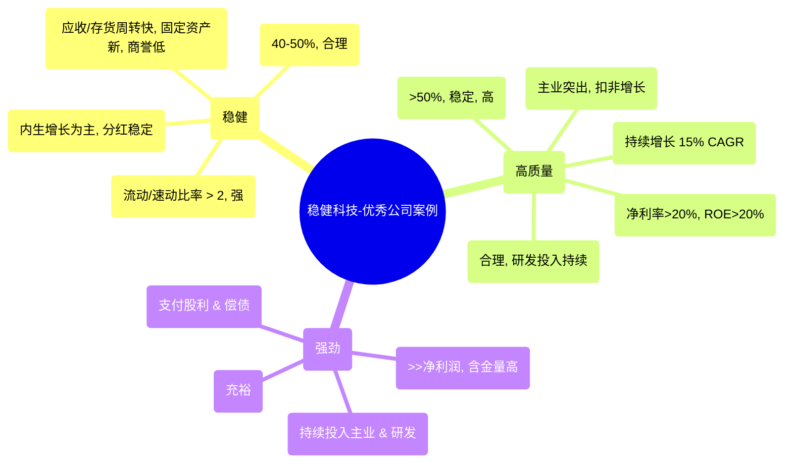
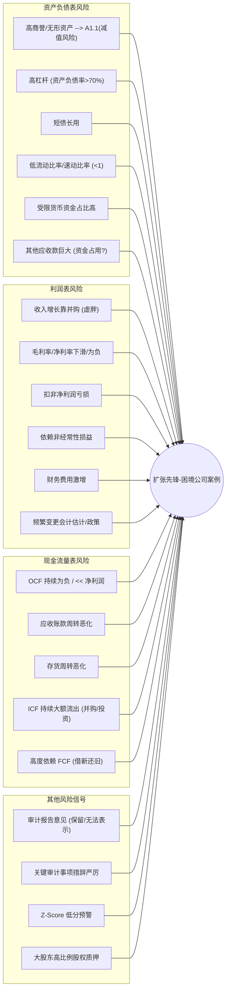

# 第十章：综合案例分析：从优秀到问题公司

经过前面章节对财报基础、进阶分析、风险识别和行业特性的学习，我们已经掌握了像 CFO 一样剖析财务报表的工具和视角。然而，理论知识最终需要应用于实践才能发挥价值。本章将通过三个不同类型的综合案例——一家持续创造价值的优秀公司、一家陷入困境或存在风险的公司、以及一家经历重大转型的公司——将前面所学的知识融会贯通，进行实战演练，展示如何从财务数据中洞察经营优劣、预警潜在风险、评估战略转型效果。

**重要提示：** 以下案例均为**虚构**，旨在演示分析方法和逻辑，并非对任何真实公司的评价。案例中可能简化了部分细节，重点在于展示分析思路。

## 10.1 案例一：一家持续创造价值的优秀公司财报解读——"稳健科技" (模拟)

**公司背景 (虚构)：** 稳健科技是一家专注于高端精密制造领域的龙头企业，产品应用于航空航天、医疗器械等高精尖行业。公司以技术创新和质量稳定著称，拥有较强的行业定价权。

**分析目标：** 解读稳健科技的财报，验证其"优秀"成色，探寻其持续创造价值的原因。

### 10.1.1 稳健的财务结构与高质量的盈利

**资产负债表分析：**

*   **适度的财务杠杆：** 资产负债率长期保持在 40%-50% 的合理区间，显著低于某些激进扩张的同业。有息负债占总资产比例不高，且以长期负债为主，短债长用风险低。
*   **健康的流动性：** 流动比率、速动比率常年维持在 2 左右，远高于警戒线，短期偿债能力强。货币资金充裕，且受限资金比例低。
*   **优质的资产结构：**
    *   应收账款周转快，坏账准备计提比例合理，客户质量高。
    *   存货周转稳定，无明显积压迹象，存货跌价准备计提充分。
    *   固定资产成新率较高，持续投入技改，保证生产效率和产品质量。
    *   无形资产以专利和专有技术为主，商誉占比低，并购风险小。
*   **稳健的权益结构：** 留存收益是所有者权益增长的主要来源，显示出强大的内生增长能力。分红政策稳定，持续回报股东。

**利润表与盈利质量分析：**

*   **持续增长的营业收入：** 过去五年收入复合增长率达到 15% 左右，增长稳健。
*   **高且稳定的毛利率：** 凭借技术壁垒和品牌优势，毛利率维持在 50% 以上，且波动较小，显示强定价权和成本控制能力。
*   **合理的费用管控：** 销售费用率、管理费用率保持稳定或略有下降，规模效应体现。研发费用率持续提升，投入未来。
*   **高质量的净利润：**
    *   营业利润占利润总额比例高，主营业务突出。
    *   非经常性损益影响小。
    *   扣非净利润持续增长，与净利润趋势一致。
*   **优秀的盈利能力指标：**
    *   净利率常年保持在 20% 以上。
    *   ROE (净资产收益率) 持续高于 20% (可通过杜邦分析拆解，发现高净利率和稳健的总资产周转率是主要驱动力，权益乘数适中)。

**现金流量表分析：**

*   **强劲的经营活动现金流：** OCF 长期大幅超过净利润，显示盈利"含金量"高，利润转化为现金的能力强。主要得益于良好的回款和对营运资本的有效管理。
*   **持续的投资活动流出：** 主要用于购建固定资产（技术改造、产能优化）和研发投入，保障长期竞争力，符合公司战略。
*   **健康的筹资活动现金流：** 主要为支付稳定增长的股利，以及偿还少量到期债务。对外部融资依赖度低。
*   **自由现金流充裕：** OCF 扣除维持性资本开支后，仍有大量现金可用于分红、战略性投资或偿债。

### 10.1.2 高效的运营能力与持续的内生增长

*   **高存货周转率与应收账款周转率：** 体现了高效的供应链管理和强大的客户议价能力。
*   **总资产周转率稳定：** 虽然是重资产行业，但通过精细化管理和持续技改，维持了较好的资产运用效率。
*   **持续的研发投入转化为成果：** 新产品销售占比逐年提升，技术专利数量持续增长，不断巩固其技术护城河。
*   **内生增长驱动：** 收入和利润的增长主要来源于现有业务的有机增长（市场拓展、产品升级），而非依赖大规模并购。
*   **产能利用率维持高位：** 订单饱满，生产安排合理。

### 10.1.3 透明的治理结构与合理的股东回报

*   **股权结构相对分散且稳定：** 无单一绝对控股股东，治理结构制衡有效。
*   **专业且独立的董事会：** 独立董事占比较高，具备相关专业背景，能够发挥监督作用。
*   **管理层激励到位且与股东利益绑定：** 实施了股权激励计划，但方案设计合理，不过度稀释股东权益。
*   **信息披露透明、及时、充分：** 定期报告、临时公告质量高，积极回应投资者关切。
*   **持续稳定的分红政策：** 每年将净利润的约 30%-40% 用于现金分红，给予股东实实在在的回报。

**总结：** 稳健科技通过聚焦主业、持续研发投入构建了强大的护城河，实现了高质量的盈利和强劲的现金流。同时，稳健的财务结构、高效的运营能力和透明的公司治理共同支撑了其长期价值创造，是优秀公司的典型代表。

## 10.2 案例二：一家陷入困境或存在风险的公司财报剖析——"扩张先锋" (模拟)

**公司背景 (虚构)：** 扩张先锋是一家多元化经营的集团公司，过去几年通过激进的并购和投资，业务版图迅速扩张至 TMT、环保、大健康等多个热门领域。市场曾一度追捧其"生态化反"的故事。

**分析目标：** 识别扩张先锋财报中的异常信号和风险点，分析其陷入困境的原因及可能的演化路径。

### 10.2.1 识别财报中的异常信号与"预警"指标

*   **激增的商誉与无形资产：** 资产负债表中商誉和无形资产占比畸高（可能超过净资产），主要来自高溢价并购。减值风险巨大。
*   **高企的财务杠杆：** 资产负债率超过 70% 甚至 80%，有息负债规模庞大，且短期债务占比高，"短债长用"特征明显。
*   **紧张的流动性：** 流动比率、速动比率低于 1，货币资金中受限资金（保证金、质押存款）比例高，可动用资金匮乏。
*   **"虚胖"的收入与微薄的利润：** 营业收入虽然增长快（靠并购并表），但毛利率、净利率持续下滑，甚至为负。扣非净利润亏损严重，依赖非经常性损益（如处置资产）粉饰报表。
*   **经营活动现金流持续净流出或远低于净利润：**
    *   应收账款周转天数不断拉长，坏账风险急剧增加。
    *   存货周转缓慢，跌价风险高。
    *   "其他应收款"余额巨大且增长快，可能存在大股东或关联方资金占用。
    *   盈利无法转化为现金，造血能力枯竭。
*   **投资活动现金流持续大额净流出：** 并购支付的现金、对参控股公司的投资居高不下。
*   **高度依赖筹资活动现金流：** 不断借新还旧，发行高成本债券、信托融资，甚至进行股权质押融资。筹资现金流一旦断裂，公司将面临崩溃。
*   **财务费用激增：** 高额有息负债导致利息支出巨大，侵蚀利润。
*   **频繁变更会计估计或会计政策：** 如延长固定资产折旧年限、放宽坏账计提标准等，试图调节利润。
*   **审计报告：** 可能出现带强调事项段的无保留意见、保留意见，甚至无法表示意见。关注关键审计事项中关于商誉减值、关联交易、持续经营能力的措辞。
*   **Z-Score 等预警模型得分低：** 进入危险区间。

### 10.2.2 分析风险的来源与可能的演化路径

*   **风险根源：**
    *   **战略失焦：** 盲目追求多元化扩张，进入不熟悉的领域，缺乏核心竞争力。
    *   **激进并购：** 高估值并购大量质地不佳的资产，形成巨额商誉，整合效果差。
    *   **管理失控：** 摊子铺得太大，集团管控能力跟不上，效率低下，内耗严重。
    *   **过度融资：** 依靠高成本负债支撑扩张，资金链紧绷。
    *   **公司治理缺陷：** 实际控制人"一言堂"，缺乏风险制约机制，可能存在利益输送。
*   **可能的演化路径：**
    1.  **债务违约：** 某笔债务到期无法偿还，触发交叉违约条款，导致债务危机全面爆发。
    2.  **资产大幅减值：** 商誉、无形资产、长期股权投资等进行大额减值，导致巨额亏损，净资产可能为负。
    3.  **变卖资产求生：** 不断出售旗下资产（包括核心资产）以偿还债务，但可能"饮鸩止渴"，导致业务进一步萎缩。
    4.  **司法重整或破产清算：** 若无法自救，可能进入重整程序，引入战略投资者，或最终走向破产清算。
    5.  **监管介入与处罚：** 若存在财务造假、信息披露违规、资金占用等问题，可能面临监管处罚甚至退市。

### 10.2.3 如何结合公开信息进行交叉验证

*   **新闻舆情监控：** 关注关于公司债务逾期、诉讼仲裁、高管离职、项目停滞、供应商/客户纠纷、监管关注等的负面报道。
*   **大股东股权质押与冻结信息：** 通过交易所公告、中国结算等渠道查询大股东股权质押比例、平仓风险、是否被司法冻结等。
*   **债券评级报告与市场价格：** 关注信用评级机构对公司主体/债券的评级调整，以及债券在二级市场的价格走势（如大幅折价交易）。
*   **监管问询函与公司回复：** 交易所通常会对存在风险的公司进行问询，关注问询的问题和公司的回复，从中寻找线索。
*   **行业数据与竞争对手比较：** 将公司的财务指标（利润率、周转率、负债率等）与同行业公司对比，异常之处往往是风险点。
*   **关联方信息挖掘：** 通过天眼查、企查查等工具，深挖关联方关系、对外投资、担保信息等，判断是否存在隐性关联交易或表外风险。

**总结：** 扩张先锋的案例警示我们，脱离基本面的激进扩张和高杠杆运作蕴藏着巨大风险。通过仔细审阅财报三大表，结合关键财务比率、现金流状况、附注信息以及外部公开信息进行交叉验证，可以有效识别这类"问题公司"的预警信号，避免落入"价值陷阱"。

## 10.3 案例三：一家经历重大转型或并购的公司财报跟踪——"智变制造" (模拟)

**公司背景 (虚构)：** 智变制造原是一家传统机械设备制造商，面临行业增长瓶颈。两年前，公司决定向"智能制造解决方案服务商"转型，并为此收购了一家专注于工业软件与物联网技术的公司"科智联"。

**分析目标：** 通过跟踪分析转型/并购前后的财报变化，评估智变制造战略转型的逻辑、财务影响、整合效果及长期价值创造潜力。

### 10.3.1 分析转型/并购的战略逻辑与财务影响

*   **转型/并购的战略逻辑 (定性分析)：**
    *   **行业背景：** 传统制造业面临成本上升、效率瓶颈，智能化、数字化是行业趋势。
    *   **公司动机：** 摆脱低附加值加工环节，向高附加值的服务和解决方案延伸，提升盈利能力和估值。
    *   **并购标的选择：** 科智联的技术（工业软件、物联网平台）与公司现有业务（设备）具有协同潜力，可以打造"硬件+软件+服务"一体化方案。
    *   **管理层陈述：** 阅读公司公告、投资者交流纪要，理解管理层对转型/并购的战略构想和预期协同效应。
*   **对财务报表的即期影响 (并购当年)：**
    *   **资产负债表：**
        *   **商誉/无形资产增加：** 因收购科智联产生。
        *   **负债增加/现金减少：** 支付并购对价导致。
        *   **资产/负债/权益总额扩大：** 因并表科智联。
    *   **利润表：**
        *   **收入/成本/费用并表增加：** 但可能因交易费用、整合初期成本导致当期利润承压。
        *   **产生新的摊销费用：** 收购产生的可辨认无形资产（如客户关系、技术专利）需要摊销。
    *   **现金流量表：**
        *   **投资活动现金流：** 大额流出（支付并购款）。
        *   **筹资活动现金流：** 可能有流入（为并购融资）。

### 10.3.2 跟踪整合效果与承诺兑现情况

**跟踪周期：** 并购完成后至少 2-3 年。

**关键跟踪指标与分析：**

1.  **收入结构变化：**
    *   **原主业 vs. 新业务（科智联）收入占比变化：** 新业务占比是否逐步提升？增速是否符合预期？
    *   **"硬件+软件+服务"一体化解决方案的订单/收入贡献：** 协同效应是否体现在收入端？
2.  **盈利能力变化：**
    *   **整体毛利率/净利率趋势：** 是否因新业务（通常毛利率更高）占比提升而改善？
    *   **分部利润贡献：** 新收购的科智联自身盈利能力如何？是否达到业绩承诺（如有）？
    *   **费用控制：** 整合过程中是否产生额外的管理费用？规模效应是否降低了整体费用率？
3.  **营运效率变化：**
    *   **周转率指标：** 转型是否改善了整体营运效率？（如存货周转率可能因软件业务占比提升而改善）
    *   **人员结构与效率：** 研发人员占比是否提升？人均创收/创利有无改善？
4.  **商誉减值风险：**
    *   **每年关注商誉减值测试情况：** 科智联的经营业绩是否支持商誉不减值？关注附注中披露的关键假设。
5.  **协同效应落地情况：**
    *   **交叉销售：** 是否成功将软件/服务销售给原有硬件客户？
    *   **成本协同：** 采购、管理等方面是否实现成本节约？
    *   **技术融合：** 研发层面是否产生"1+1>2"的效果？
    *   **对比管理层最初的预期：** 实际效果与承诺是否一致？
6.  **现金流状况：**
    *   **经营活动现金流是否改善？** 新业务能否带来更好的现金流？
    *   **自由现金流能否覆盖整合投入和后续发展所需资金？**
7.  **非财务信息：**
    *   **客户反馈/市场口碑：** 对新解决方案的接受度如何？
    *   **核心团队稳定性：** 原科智联团队是否稳定？整合过程中有无文化冲突？
    *   **组织架构调整：** 是否顺利完成？

**业绩承诺跟踪 (如适用)：**
*   科智联原股东是否有业绩承诺？
*   每年是否"精准"达标？是否存在疑点？
*   承诺期结束后业绩是否"变脸"？
*   补偿机制能否顺利执行？

### 10.3.3 评估转型/并购的长期价值创造潜力

*   **转型方向是否符合行业大趋势？** 新业务是否具备长期增长空间？
*   **公司是否在新领域建立了可持续的竞争优势（护城河）？** 技术、品牌、客户粘性等。
*   **整合是否成功？** 协同效应是否真正实现并能持续？
*   **财务指标是否持续改善？** ROIC 是否提升并超过 WACC？
*   **市场估值逻辑是否发生变化？** 是否从传统制造业估值转向科技/服务业估值？
*   **潜在风险：** 技术迭代风险、竞争加剧风险、整合失败风险、核心人才流失风险等。

**总结：** 跟踪分析经历重大转型或并购的公司，需要超越短期财务数据的波动，深入理解其战略意图，持续关注整合进展和协同效应的落地情况。通过对收入结构、盈利能力、营运效率、现金流、商誉以及关键非财务指标的长期动态跟踪，结合对行业趋势和公司竞争力的判断，才能评估转型的真实效果和长期价值创造潜力。

---
本章通过三个不同类型的虚构案例，实战演练了如何综合运用财报分析知识。无论是挖掘优秀公司的价值源泉，识别问题公司的风险信号，还是评估转型公司的战略效果，其核心都在于深入数据背后，理解商业逻辑，并结合宏观、行业和公司自身情况进行动态、全面的分析。下一章，我们将探讨如何将这些分析成果有效地呈现出来，撰写高质量的财报分析报告。 