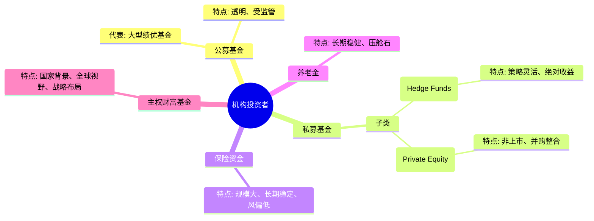

# 第一章：谁是真正的"聪明资金"？

在波诡云谲的金融市场中，"聪明资金"（Smart Money）是一个既令人敬畏又充满神秘色彩的词汇。它似乎总能领先一步，洞察先机，获取超额收益。然而，究竟谁才能被冠以"聪明"之名？它们又具备哪些与众不同的特质？本章将深入探讨"聪明资金"的定义、核心特征、主要派系，并破除一些常见的迷思，最终勾勒出不同"聪明钱"的投资哲学图谱。

## 1.1 定义与核心特征

"聪明资金"并非指某一个具体的实体或个人，而是对一类特定市场参与者的统称。这些参与者通常具备以下一个或多个核心特征，使其在信息获取、研究分析、决策执行以及资金体量等方面拥有相对优势，从而能够在市场博弈中占据更有利的位置。

### 1.1.1 信息、研究与决策优势

这是"聪明资金"最本质的特征。它们往往能够通过各种合法途径，比普通投资者更早、更全面、更深入地获取影响资产价格的关键信息。

*   **信息优势 (Information Advantage):** 这不仅仅指内幕信息（虽然现实中灰色地带难以完全杜绝），更多是指通过公开渠道挖掘、整合、解读信息的能力。例如，通过深入的产业链调研、与上下游企业的访谈、对专家网络的利用、对海量数据的分析（如卫星图像、信用卡数据、招聘信息等替代数据）等方式，拼凑出更接近事实的图景。它们能够从纷繁复杂的信息中筛选出高价值的信号，过滤掉噪音。
*   **研究优势 (Research Advantage):** "聪明资金"通常拥有专业的投研团队，配备经济学家、行业分析师、数据科学家等。他们能够对宏观经济、行业趋势、公司基本面进行系统性、前瞻性的深度研究。这种研究不仅停留在财务报表层面，更深入到商业模式、竞争格局、管理层能力、技术壁垒等多个维度。强大的研究能力使其能够更准确地评估资产的内在价值，识别市场的错误定价。
*   **决策优势 (Decision-Making Advantage):** 基于信息和研究优势，"聪明资金"往往能建立起更完善、更理性的投资决策框架。它们通常拥有明确的投资哲学、严格的投资纪律和科学的风险管理体系。相比于容易被市场情绪左右的散户，它们的决策过程更少受到贪婪和恐惧的影响，能够更客观地评估风险收益比，做出更符合长期利益的决策。并且，它们通常拥有更强大的执行力，能够将决策快速有效地转化为实际行动。

### 1.1.2 资金规模与市场影响力

"聪明资金"通常管理着庞大的资金规模。这不仅赋予了它们获取更好研究资源和服务的能力（如券商的定制化研究、优先的路演机会等），更重要的是，其资金的进出本身就可能对市场价格产生显著影响。

*   **规模效应 (Scale Effect):** 大规模资金使其能够投资于流动性相对较低但潜在回报更高的市场（如私募股权、某些细分债券市场），或者进行需要大量资金支持的复杂策略（如并购套利、统计套利）。同时，规模也意味着更高的交易成本和更严格的流动性要求，这也是其投资行为的制约因素。
*   **价格影响力 (Price Impact):** 当"聪明资金"集中买入或卖出某项资产时，其巨大的交易量往往会直接推动价格上涨或下跌。这种影响力使得它们的行为本身就成为其他市场参与者关注的焦点。其他投资者可能会试图解读"聪明资金"的意图，并跟随其操作，从而进一步放大价格的波动，形成所谓的"趋势"。
*   **议价能力 (Bargaining Power):** 在某些交易中（如大宗交易、定向增发），庞大的资金规模使其拥有更强的议价能力，能够以更优惠的价格获取筹码或实现退出。

需要强调的是，信息、研究、决策优势与资金规模往往是相辅相成的。"聪明资金"利用其规模优势获取更好的信息和研究资源，而卓越的投研能力和决策水平又能吸引更多的资金委托管理，形成正向循环。

## 1.2 "聪明资金"的主要派系

"聪明资金"并非铁板一块，内部构成复杂多样，投资风格、运作模式、时间视野各不相同。理解不同派系的特点，有助于我们更精准地解读它们的行为信号。主要可以分为以下几类：

### 1.2.1 机构投资者 (Institutional Investors)

这是"聪明资金"最主要的组成部分，管理着社会上的大部分财富。它们内部差异也很大。

*   **公募基金 (Mutual Funds):** 面向公众募集资金，投资风格相对透明，受到严格监管。大型、绩优的公募基金经理，凭借其研究能力和选股水平，被视为"聪明资金"的一部分。但需注意，部分基金可能因规模限制、排名压力等因素，行为出现短期化或"抱团"现象。
*   **私募基金 (Private Equity & Hedge Funds):** 面向少数高净值客户或机构投资者募集，监管相对宽松，策略灵活多样。**对冲基金 (Hedge Funds)** 尤其以其复杂的交易策略（多空、套利、宏观对冲等）和追求绝对收益的目标而著称，被广泛认为是"聪明资金"的典型代表。**私募股权基金 (Private Equity)** 则专注于非上市公司的投资和并购整合，其对产业的理解和长期布局能力也体现了"聪明"的特质。
*   **保险资金 (Insurance Funds):** 以其规模庞大、追求长期稳定回报、风险偏好较低而著称。险资的资产配置动向，尤其是在权益市场的长期布局，往往被视为市场底部区域或价值投资的重要信号。
*   **养老金 (Pension Funds):** 与保险资金类似，追求长期、稳健的回报，是资本市场重要的"压舱石"。它们的投资决策通常基于对宏观经济和资产类别的长期判断。
*   **主权财富基金 (Sovereign Wealth Funds):** 代表国家进行投资，资金规模巨大，投资视野全球化、长期化，其战略布局往往具有风向标意义。

### 1.2.2 产业资本 (Industrial Capital)

指上市公司的大股东（控股股东、实际控制人）以及核心高管。他们对自身经营的企业和所处行业有着最直接、最深入的了解，其增减持行为往往被视为重要的内部人信号。

*   **大股东:** 其增持通常被解读为对公司未来发展充满信心，或是认为当前股价被低估。而大额减持（尤其是在股价高位或公司基本面出现问题时）则可能预示着风险。但也需区分战略性减持（如引入战略投资者）或资金周转需求等非基本面因素。
*   **核心高管:** 尤其是董事长、CEO、CFO等对公司战略和运营有决策权的高管，其买卖自家股票的行为更具参考价值。高管集体增持通常是强烈的看多信号，反之亦然。

产业资本的优势在于其对"自家"信息的掌握程度，这是外部投资者难以比拟的。但他们的行为也可能受到个人资金需求、股权质押、市值管理等非基本面因素的影响，需要结合具体情况分析。

### 1.2.3 顶级游资与超级牛散 (Top Traders & Whales)

这类资金在某些市场（尤其是A股）扮演着重要角色。他们可能并非传统意义上的机构，但凭借其敏锐的市场嗅觉、高超的交易技巧和强大的资金实力，能够在短期内对特定股票价格产生巨大影响。

*   **顶级游资:** 通常指那些在龙虎榜上频繁现身、操作风格剽悍、擅长把握题材热点和市场情绪的短线交易者。他们对市场流动性、投资者心理有深刻理解，擅长制造和利用波动。
*   **超级牛散:** 指那些资金量巨大、投资经验丰富、风格自成一派的个人投资者。他们可能长期跟踪某些公司，也可能像游资一样参与短线博弈。他们的持仓变动有时也能引发市场关注。

这类资金的"聪明"更多体现在对市场博弈和交易时机的把握上，其投资决策可能并非完全基于基本面研究，追踪他们需要理解其独特的行为模式和风险偏好。

### 1.2.4 量化基金与高频交易者 (Quantitative Funds & HFT)

这是近年来崛起的新势力。它们依赖复杂的数学模型和强大的计算机系统进行交易决策，是技术驱动型"聪明资金"的代表。

*   **量化基金:** 通过建立数学模型，利用历史数据分析市场规律，寻找统计套利机会或进行趋势预测、因子投资等。策略覆盖面广，从低频的量化选股到高频的做市策略都有。
*   **高频交易者 (HFT):** 利用极快的交易速度和算法优势，捕捉市场微小的价差或流动性变化，进行快速、大量的交易。它们是市场流动性的提供者，但也可能在极端情况下加剧市场波动。

这类资金的"聪明"体现在模型构建、算法优化和技术执行上。它们的行为模式与传统投资者差异较大，理解它们需要具备一定的数理和技术背景。

## 1.3 破除迷思：聪明资金并非永远正确

尽管"聪明资金"拥有诸多优势，但将其神化，认为它们永远正确、稳赚不赔，是一种危险的误解。事实上，"聪明资金"也会犯错，甚至可能成为市场波动的牺牲品。

### 1.3.1 认知局限与行为偏差

即使是顶级的投资者，也无法完全摆脱人性的弱点和认知的局限。

*   **过度自信 (Overconfidence):** 过去的成功可能导致"聪明资金"高估自己的判断能力，在不熟悉的领域或市场环境下做出错误决策。
*   **羊群效应 (Herding):** 尤其在机构投资者中，由于信息趋同、考核压力、避免偏离基准等原因，也可能出现"抱团取暖"的行为，导致某些资产被过度追捧，积累风险。
*   **锚定效应 (Anchoring):** 过分依赖初始信息或过去的成功经验，未能及时根据市场变化调整判断。
*   **确认偏差 (Confirmation Bias):** 倾向于寻找支持自己观点的证据，而忽略可能证伪自己判断的信息。

### 1.3.2 策略失误与市场误判案例

历史上，"聪明资金"折戟沉沙的案例并不鲜见。

*   **长期资本管理公司 (LTCM) 的覆灭 (1998):** 这家由诺贝尔经济学奖得主和华尔街交易精英组成的对冲基金，因过度依赖模型、忽视极端风险（黑天鹅事件），在俄罗斯债务危机中几乎破产，引发全球金融震荡。这警示我们，即便是最"聪明"的模型也可能失效。
*   **2008年金融危机:** 许多大型投资银行和对冲基金在危机中损失惨重，它们未能预见到次贷风险的传染性和严重性，过度承担了风险。
*   **特定投资失误:** 即便是巴菲特、索罗斯等投资大师，也曾有过失败的投资案例。例如，巴菲特早期投资伯克希尔·哈撒韦这家纺织厂本身并非成功的决策，后来才将其转型为投资平台；索罗斯也曾在俄罗斯等市场遭遇重大亏损。

这些案例表明，"聪明资金"的优势是相对的，而非绝对的。它们也可能因为模型假设的缺陷、对宏观环境的误判、风险管理的疏漏、突发的黑天鹅事件等原因而遭受损失。

## 1.4 不同"聪明钱"的投资哲学概览

不同派系的"聪明资金"，其投资哲学和决策逻辑存在显著差异。理解这些差异，有助于我们辨别不同信号的含义，避免将其混为一谈。

### 1.4.1 价值导向 vs 趋势导向

*   **价值导向 (Value-Oriented):** 以巴菲特、格雷厄姆为代表。核心是寻找价格低于其内在价值的资产（"捡烟蒂"或投资于具有护城河的优秀公司）。他们关注企业的长期基本面，如盈利能力、现金流、资产负债表、管理层等。这类资金通常持股周期较长，交易频率较低，是市场的"稳定器"。代表：部分公募基金、保险资金、养老金、产业资本（增持时）、一些基本面驱动的私募基金。
*   **趋势导向 (Trend-Following):** 核心是"顺势而为"，认为趋势一旦形成，往往会持续一段时间。他们更关注市场的动量、价格形态、技术指标、资金流向等，试图在趋势的早期介入，在趋势结束前退出。这类资金交易相对频繁，持股周期可长可短。代表：部分对冲基金、量化趋势策略基金、顶级游资。

### 1.4.2 长期持有 vs 波段交易

*   **长期持有 (Long-Term Holding):** 基于对公司长期价值的认可，买入并持有较长时间（数年甚至数十年），分享企业成长的红利，忽略短期市场波动。这是价值投资者的典型特征。代表：养老金、保险资金、主权财富基金、部分价值型公募/私募基金、坚定的产业资本。
*   **波段交易 (Swing Trading / Positional Trading):** 试图捕捉市场中期（数周至数月）的波动。他们可能结合基本面、技术面和事件驱动等因素，在判断一个上涨或下跌波段可能开始时介入，在波段结束迹象出现时了结。持股周期介于短线交易和长期持有之间。代表：部分对冲基金、风格灵活的公募基金、超级牛散。

此外，还有**事件驱动 (Event-Driven)** 策略（如并购套利、财报发布、政策变动）、**宏观对冲 (Global Macro)** 策略（基于对全球宏观经济、利率、汇率等的判断进行跨资产、跨市场配置）、**相对价值 (Relative Value)** 策略（寻找相关资产之间的错误定价进行套利）等等。

**重要提示:** 现实中，各类"聪明资金"的策略并非泾渭分明，很多机构会融合多种方法。例如，一个基金可能以基本面研究为基础，但会结合技术分析和市场情绪进行择时。一个产业资本也可能利用其信息优势进行波段操作。

理解"聪明资金"的复杂性和多样性，是有效追踪和解读其行为信号的第一步。下一章，我们将探讨关注"聪明资金"的核心价值所在。 