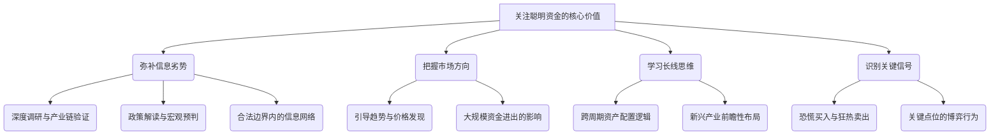

# 第二章：关注"聪明资金"的核心价值

上一章我们界定了"聪明资金"的内涵、特征与主要派系，并强调了它们并非永远正确。既然如此，为何我们仍然要投入精力去追踪和分析它们？普通投资者关注"聪明资金"的动向，其核心价值究竟体现在哪里？本章将从信息优势、市场指示、战略启示和行为信号四个维度，深入剖析关注"聪明资金"的核心意义，帮助投资者理解如何从这些"巨人"的足迹中汲取智慧，提升自身的投资决策水平。

## 2.1 信息不对称的优势解密

金融市场在理论上追求有效性，即价格反映所有可知信息。然而，现实远非如此完美，信息不对称（Information Asymmetry）是市场的常态。"聪明资金"之所以"聪明"，很大程度上源于它们在信息获取、处理和解读方面拥有的显著优势。关注它们，有助于我们在一定程度上弥补自身的信息劣势。

### 2.1.1 深度调研与产业链验证

"聪明资金"，尤其是大型机构投资者和产业资本，拥有普通投资者难以企及的资源和能力进行深度调研。

*   **草根调研 (Grassroots Research):** 它们会派遣研究员深入一线，走访上市公司及其上下游供应商、客户、竞争对手，甚至实地考察工厂、门店。通过访谈、观察、问卷等方式，获取无法从公开财报或新闻中得知的"活"信息，例如产品的真实销售情况、库存水平、技术迭代进展、管理层执行力等。
*   **产业链交叉验证 (Cross-Chain Verification):** 通过对整个产业链的广泛覆盖和研究，它们能够相互印证信息的真伪和可靠性。例如，通过分析上游设备商的订单判断下游厂商的扩产意愿，通过调研经销商了解终端产品的动销情况，从而形成对某个行业或公司更立体、更准确的判断。
*   **专家网络 (Expert Networks):** 许多机构会付费咨询行业专家、科学家、前高管等，获取对特定技术、政策或市场趋势的专业见解。这种"外脑"资源能够显著提升研究的深度和前瞻性。

**对普通投资者的价值：** 虽然我们无法复制这种规模的调研，但理解"聪明资金"的研究路径和关注点，可以指导我们更有针对性地挖掘公开信息。例如，关注券商深度报告中提及的产业链调研细节，留意上市公司投资者关系活动记录中机构关心的问题，尝试从行业新闻、招聘信息、技术论坛等多渠道搜集信息，进行交叉验证。当我们看到某只股票被多家以深度研究著称的机构密集调研或买入时，这本身就是一个值得关注的信号，暗示其背后可能存在未被市场充分认知的价值点。

### 2.1.2 政策解读与宏观预判能力

宏观经济环境和产业政策对市场走向有着至关重要的影响。"聪明资金"通常设有专门的宏观策略团队，密切跟踪国内外经济数据、货币政策、财政政策、监管动向以及地缘政治风险等。

*   **政策敏感度:** 它们对政策的变化极其敏感，能够更早地预判政策可能带来的影响，并据此调整资产配置。例如，在新能源、半导体、生物医药等国家重点支持的战略性新兴产业中，往往能看到"聪明资金"提前布局的身影。
*   **宏观框架:** 它们拥有成熟的宏观分析框架，能够将碎片化的信息整合起来，判断经济周期所处的阶段、通胀与利率的走向、不同资产类别的相对吸引力等，从而做出自上而下的战略决策。

**对普通投资者的价值：** 关注"聪明资金"对宏观政策的解读和资产配置的调整，可以帮助我们理解当前市场的主要逻辑和潜在的结构性机会。例如，当看到社保基金、养老金等长线资金开始增加权益配置比例时，可能预示着市场长期价值的显现。当顶尖对冲基金开始做多某个特定行业或做空某个货币时，其背后往往有深刻的宏观逻辑支撑。阅读权威机构的宏观策略报告，理解其分析框架和核心观点，有助于提升我们对市场大方向的把握。

### 2.1.3 （合法边界内的）信息网络

"聪明资金"通常处在信息传递链条的相对上游，能够通过更广泛、更高效的信息网络获取有价值的情报。

*   **机构间的交流:** 基金经理、分析师之间存在着非正式或正式的交流圈，虽然有合规限制，但对于行业趋势、市场情绪、某些公司的普遍看法等信息仍在一定范围内流动。
*   **与上市公司的沟通:** 机构投资者有更多机会与上市公司高管进行直接沟通，了解公司的战略规划、经营细节和管理层的想法。
*   **券商服务:** 顶级机构能够获得券商更优质、更及时的研究服务和交易支持。

**重要提示：** 这里的"信息网络"强调的是在合法合规框架内，通过资源优势和人脉积累获得的信息处理和解读上的优先性，而非指非法内幕交易。监管机构对内幕交易有严格的规定和处罚。

**对普通投资者的价值：** 了解"聪明资金"可能的信息来源和网络优势，有助于我们认识到自身的信息局限性。在分析公司时，不能仅仅停留在公开披露的信息，要思考哪些信息是市场可能已经提前获知或正在消化的。关注机构的持仓变动、调研记录、券商的目标价调整等，可以间接捕捉到这些信息网络中可能传递的信号。

## 2.2 资金流向的市场指示意义

"聪明资金"管理的资金体量巨大，其动向本身就构成了市场的重要力量。它们的流入流出，往往会对资产价格产生直接影响，并可能引导市场趋势。

### 2.2.1 引导趋势与价格发现

*   **趋势的"点火者":** 在市场底部区域或某个板块启动初期，"聪明资金"的率先介入，往往能够吸引后续资金的跟随，从而点燃一轮上涨行情。它们凭借研究优势发现价值洼地，通过持续买入锁定筹码，其行为本身就向市场传递了积极信号。
*   **价格发现功能 (Price Discovery):** 市场的价格并非总是有效的。"聪明资金"通过其专业的分析和判断，识别出资产的错误定价，并通过交易行为推动价格向其认为合理的价值回归。这个过程就是价格发现。例如，当一家公司的真实价值被低估时，"聪明资金"的买入会推高股价；反之，当泡沫出现时，它们的卖出则会加速泡沫的破裂。
*   **强化趋势:** 在趋势形成后，"聪明资金"的持续加仓或减仓，会进一步强化现有趋势。右侧交易者（趋势追随者）会密切关注这些资金的动向，作为判断趋势是否延续的重要依据。

**对普通投资者的价值：** 观察"聪明资金"的流向，是判断市场或个股趋势的重要参考。例如，北向资金（通过沪深港通流入A股的香港及海外资金，被广泛视为"聪明资金"的风向标之一）的持续净流入，通常预示着市场整体风险偏好的提升。机构资金对某个行业的集中加仓，则可能意味着该行业景气度的提升或存在结构性机会。当然，资金流向并非唯一决定因素，需要结合基本面、技术面等综合判断。

### 2.2.2 大规模资金进出对股价的影响

"聪明资金"的交易规模远超普通散户，其单笔交易或一段时间内的持续买卖，足以改变个股的供求关系，从而对股价产生立竿见影的影响。

*   **买入推动上涨:** 当机构集中建仓某只股票时，大量的买盘会迅速消耗卖方力量，推动股价上涨。尤其是在流通盘较小的股票上，这种影响更为显著。
*   **卖出导致下跌:** 反之，当机构决定集中减持或清仓时，巨大的卖压可能导致股价快速下跌，甚至引发"踩踏"效应。
*   **关键位置的博弈:** 在重要的技术关口（如前期高点、支撑位），"聪明资金"的行为往往具有决定性意义。它们的放量突破或跌破，通常被视为趋势确认的信号。

**对普通投资者的价值：** 理解大规模资金对股价的直接冲击力，有助于我们更好地解读盘面信息。例如，观察到某只股票在关键支撑位出现持续的大单买入，可能意味着有"聪明资金"在护盘或吸筹。而在高位出现连续的大单卖出，则需要警惕主力出货的风险。追踪龙虎榜、大宗交易等数据，可以直接观察到这些大资金的进出情况。

## 2.3 战略布局与长线思维的启示

许多"聪明资金"，尤其是养老金、保险资金、主权财富基金以及价值投资型的机构，以其长远的投资视角和战略性的资产配置而著称。学习它们的思维方式，有助于我们摆脱短期波动的干扰，建立更稳健的投资体系。

### 2.3.1 跨周期资产配置逻辑

长线"聪明资金"的决策往往超越单一的市场周期，着眼于未来数年甚至数十年的宏大叙事。

*   **经济周期视角:** 它们会根据对经济周期所处阶段的判断，调整在股票、债券、大宗商品、现金等大类资产之间的配置比例。例如，在经济复苏初期增加对顺周期股票的配置，在经济过热、面临衰退风险时增加防御性资产（如债券、黄金）的比例。
*   **长期趋势把握:** 它们关注人口结构变化、技术革命、能源转型、消费升级等长期结构性趋势，并在这些领域进行前瞻性布局，即使短期内可能不被市场看好。
*   **逆向布局:** 在市场极度悲观、资产价格被严重低估时，长线资金往往敢于逆市买入，进行长期布局。

**对普通投资者的价值：** 学习长线"聪明资金"的跨周期思维，有助于我们培养战略定力，避免追涨杀跌。理解它们在不同经济周期下的资产配置偏好，可以为我们自己的资产配置提供参考。关注它们重点布局的长期赛道，有助于我们发现具有长远增长潜力的投资方向。

### 2.3.2 对新兴产业的前瞻性布局

"聪明资金"往往是新兴产业和创新技术的重要支持者。它们通过风险投资（VC）、私募股权（PE）等方式，在早期介入具有颠覆性潜力的新兴企业。

*   **发掘"下一个巨头":** 它们投入大量资源研究前沿科技，判断新兴商业模式的可行性，试图在众多初创企业中发掘出未来的行业领导者。
*   **推动创新:** 它们的资金支持和投后管理，为新兴产业的发展提供了关键动力。
*   **二级市场映射:** VC/PE阶段的投资热点和估值变化，往往会对二级市场的相关概念股产生映射效应。"聪明资金"在这些领域的布局，预示着未来可能的高成长方向。

**对普通投资者的价值：** 关注"聪明资金"（尤其是顶级VC/PE机构）的投资动向和重点赛道，是把握科技前沿和新兴产业投资机会的重要途径。了解哪些领域正在获得大量资金的青睐，有助于我们判断未来的产业发展趋势。当然，新兴产业投资风险较高，普通投资者需要谨慎评估，切勿盲目跟风。

## 2.4 行为信号：识别市场转折点

在市场的关键时刻，尤其是极端情绪弥漫的转折点，"聪明资金"的行为往往能提供宝贵的信号，帮助我们保持理性，甚至逆向操作。

### 2.4.1 恐慌时的买入与狂热时的卖出

*   **逆向操作者:** 真正的"聪明资金"往往具有逆向思维的能力。当市场因突发利空或非理性抛售而陷入极度恐慌时，股价可能远低于其内在价值，此时正是它们眼中的买入良机。它们能够克服恐惧，冷静分析，寻找"错杀"的机会。
*   **泡沫的警惕者:** 相反，当市场情绪极度亢奋，泡沫不断膨胀，股价远超其基本面支撑时，"聪明资金"往往会保持警惕，逐步减仓甚至获利了结。它们不会被市场的狂热冲昏头脑，而是坚持自己的价值判断和风险控制原则。
*   **巴菲特指标的启示:** "在别人贪婪时恐惧，在别人恐惧时贪婪"这句名言，正是"聪明资金"逆向操作哲学的精髓体现。

**对普通投资者的价值：** 观察"聪明资金"在市场极端情绪下的行为，是判断市场是否见顶或见底的重要参考。例如，当市场暴跌，但机构席位却在龙虎榜上呈现大幅净买入时，可能预示着底部区域的临近。当市场一片狂热，但产业资本却开始密集减持时，则需要警惕见顶风险。学习"聪明资金"的逆向思维，有助于我们在关键时刻做出更理性的决策，避免成为情绪的奴隶。

### 2.4.2 关键点位的博弈行为

在重要的技术支撑位或阻力位附近，"聪明资金"的行为模式往往更加清晰，其博弈意图也更容易被解读。

*   **支撑位的"吸筹"或"护盘":** 在股价下跌至关键支撑区域时，如果出现持续的、温和放大的买盘，且股价不再创新低，可能是有"聪明资金"在悄悄吸纳筹码或阻止股价进一步下跌。
*   **阻力位的"试盘"或"出货":** 当股价上涨至重要阻力区域时，"聪明资金"可能会通过少量卖出测试上方抛压（试盘），也可能利用散户的追涨热情，在此区域大量派发筹码（出货）。观察此时的成交量变化、大单流向和盘口语言，有助于判断其真实意图。
*   **突破/跌破的确认:** 关键点位的有效突破或跌破，往往需要"聪明资金"动用真金白银来确认。放量突破通常意味着上涨空间的打开，而放量跌破则可能预示着下跌趋势的开始。

**对普通投资者的价值：** 结合技术分析，关注"聪明资金"在关键点位的行为特征，可以提高我们交易决策的胜率。理解它们可能的吸筹、洗盘、拉升、出货等不同阶段的操作手法，有助于我们更好地跟随趋势或规避风险。

总之，关注"聪明资金"并非目的，而是手段。其核心价值在于，通过分析它们的行为，我们可以获得更丰富的信息维度、更清晰的市场方向感、更长远的战略视角以及更敏锐的关键信号识别能力。下一部分，我们将进入实操层面，详细介绍追踪"聪明资金"足迹的具体工具和方法。 