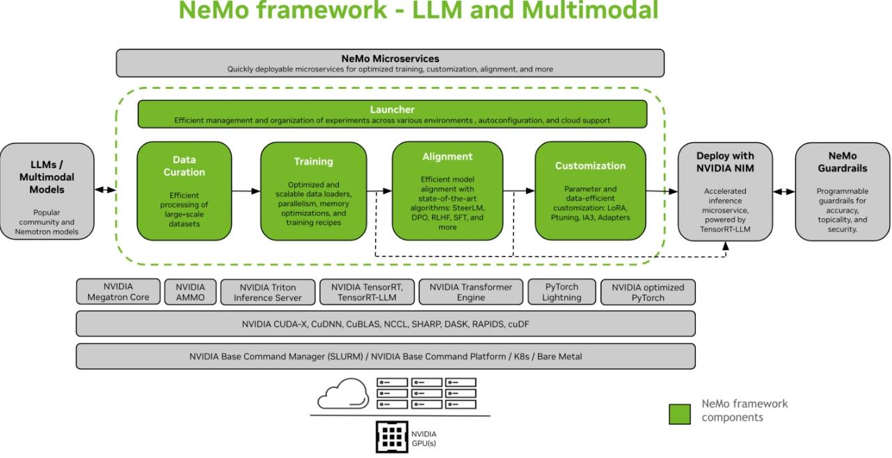

所有的事务本质上都是一种映射？

- 从问题域空间映射到解决方案空间
- 解决方案空间又会存在从需求到设计到解决的映射
- 从一个人到另一个人的映射
- 所有事务都可以表征为一个向量

customer LLM将如同BI一样进入每个500强公司
参考Nvidia [NeMo](https://docs.nvidia.com/nemo-framework/user-guide/latest/overview.html)，构筑**基于HW的CPU与NPU的统一框架**，兜售给500强公司，进行自定义的数据准备，模型训练与模型推理。

## 管理

- HW 的洞察太多，除了SP/Charter 的专项洞察以外，还有专门的规划部，其好处是带来前沿技术视野的同时，导致聚焦于实际的开发减少，同时由于规划与开发的割裂到时设计与实现存在 Gap
- 