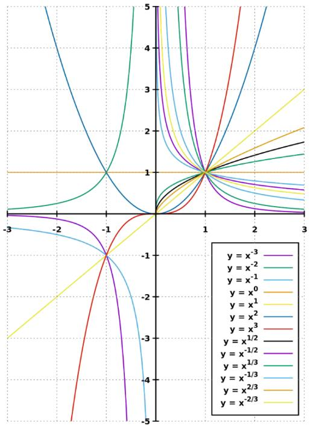

当你觉得一件事难时，通常有两个原因，**一个是看不见事物的全貌，另一个，则是看不透事物的本质。**

## 知识地图：

## OpenAI的终极形态：

## [推荐系统](推荐系统.md)
## 特征工程
特征工程其实是数据工程的一部分，我们把它单独拿出来讲是因为特征工程是数据工程的灵魂，而且它与模型工程也密切相关。

其实特征工程和模型工程没有特别明显的边界，许多特征工程的动作，在足够复杂的模型中已经被自动化掉了，所以特征工程主要是为了帮助模型减轻压力。

特征处理的过程**是对数据进行微观和宏观投影的过程**，所以虽然叫特征处理，但特征本身其实没有变化，变的只是你观察的维度

