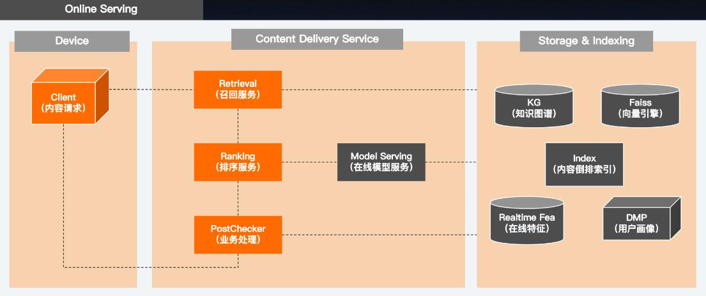
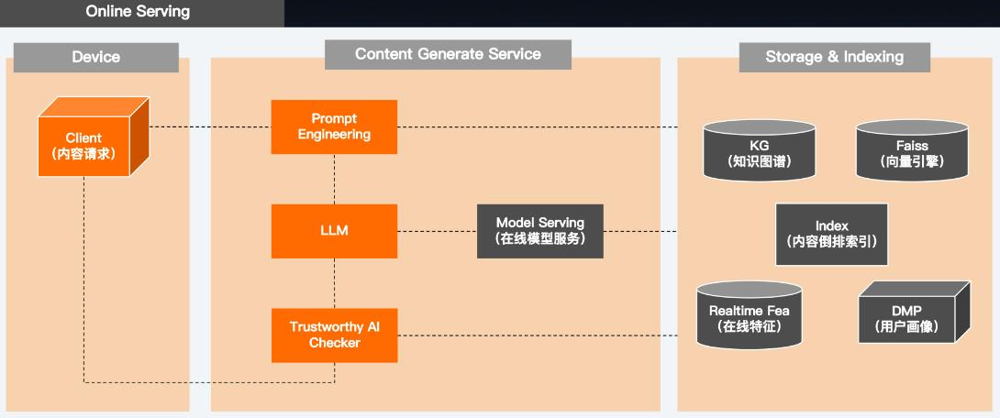
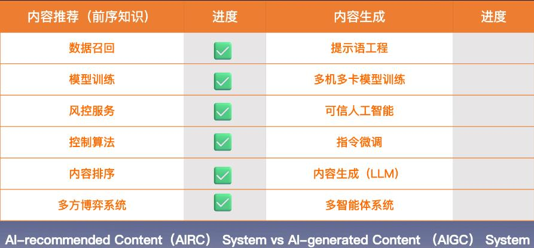

当你觉得一件事难时，通常有两个原因，**一个是看不见事物的全貌，另一个，则是看不透事物的本质。**

## 知识地图：

## OpenAI的终极形态：

## 架构基础
#### [推荐系统](推荐系统.md)
#### [特征工程](特征工程.md)
#### 模型工程
人工智能在学术上的三大学派，它们分别是符号主义学派、连接主义学派和行为主义学派，其中的代表分别是知识图谱、深度学习和强化学习。
1. 监督学习是在正确答案的指导下进行学习。通过建立方程Y=AX+B，定义损失函数，根据样本值，进行梯度下降调整参数，得到最终模型参数A和B
2. 对比学习的目标是通过样本之间的相似度，来学习它们之间的距离，进而表示它们的关系，类似Word2Vec
3. 强化学习的核心思想，是利用感知和行动的闭环进行学习。典型的如PID控制算法；强化学习不依赖于预先标记的数据，而是通过与环境的交互来进行自主学习，根据奖励信号的反馈进行实时的策略更新，同样是行为主义派的经典方法

## 系统构建

