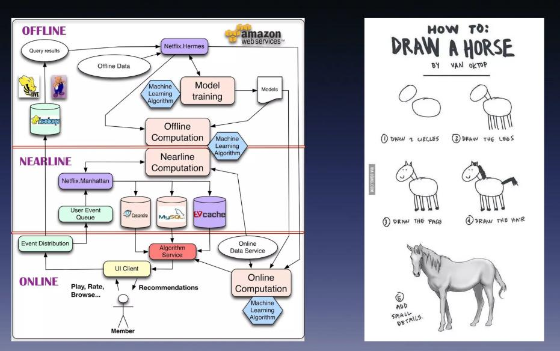

## 推荐系统
如何对海量的内容进行在线实时的排序?

#### 转化漏斗
商品期望收益=点击率 * 加购率 * 付款率 * 客单价
**将用户对每个商品的期望收益进行排序，将排名靠前的商品，展示给用户**，早期的AIRC系统采用的就是这种方式。
**对于海量的数据规模（商品、文档等），在线实时打分排序是不现实的。**
AIRC系统往往会拆分为召回和排序两个模块，这是在线系统中常用的效率权衡方法

- 召回模块
搜索引擎，常常会通过搜索词中的关键字，在倒排索引中拉取内容，大幅度地降低排序规模，让用户更快得到搜索结果
	- 关键词召回
	- 性别召回
	- 向量召回
- 排序模块

- 控制&博弈 
广告系统当中为了让预算不在一早就全部花光，能在24小时中均匀的消耗，要求系统有能力，控制内容的曝光分布。面对快速、大量的流量请求，我们如何准确地控制分布呢？
- 风控模块
	- 内容安全系统
内容安全系统会对各种模态（视频，图像，语音，文字）物料做安全审核，确保平台投放的内容是符合你们平台形象和法律法规要求。该系统由机审和人审配合完成。

由于不合规内容占比相对较低，所以机审会采用高召回的策略，也就是“宁可错杀也不漏过”。在机筛之后，会把相对少量的内容交给运营人员做二次确认。
[准确率（accuracy）、精确率（precision）、召回率（recall）](https://blog.csdn.net/Cheese_pop/article/details/78228156)
- True Positive(真正, TP)：将正类预测为正类数.
- True Negative(真负 , TN)：将负类预测为负类数.
- False Positive(假正, FP)：将负类预测为正类数 → 误报 (Type I error).
- False Negative(假负 , FN)：将正类预测为负类数 →  漏报 (Type II error).

反作弊系统，在技术上可分成实时和离线反作弊这两个部分。实时反作弊一般会通过流量的行为模式还有动作频次来识别攻击者，这部分工作可以防御80%以上的攻击者。

但是根据二八定律，剩下的攻击会造成了客户更大的损失，通常这些攻击者的技术能力比较强，要靠离线反作弊来发现，因为离线系统能用到的数据和技术手段更多，可以发现长周期的异常流量、挖掘作案团伙