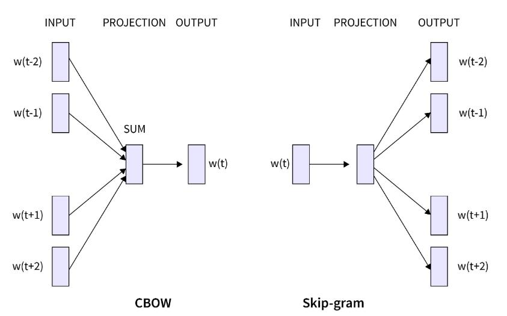

**特征工程的本质是空间投影的过程**
特征工程其实是数据工程的一部分，我们把它单独拿出来讲是因为特征工程是数据工程的灵魂，而且它与模型工程也密切相关。

其实特征工程和模型工程没有特别明显的边界，许多特征工程的动作，在足够复杂的模型中已经被自动化掉了，所以特征工程主要是为了帮助模型减轻压力。

特征处理的过程**是对数据进行微观和宏观投影的过程**，所以虽然叫特征处理，但特征本身其实没有变化，变的只是你观察的维度
#### 从一个特征到另一个特征
常用特征方法：离散化、归一化、函数化等

如果我们将数值型特征直接给到线性模型，可能会导致模型很难发现特征中的一些非线性特点，这时你可以让它做幂函数、指数函数、三角函数等等这些变化之后再给到线性模型，就可以更好地处理非线性特征了。

#### 从低维到高维
不能将这些存在线性关系的数值直接传递给模型，**你应该先假设男性、女性和未知之间没有线性数值关系，它们是相互独立的**， 否则可能导致模型根据数值关系推导出二者的数值联系。
为保证不同特征之间在数值上是正交的，确保每个值只占据空间中的一个维度，简而言之就是用各个维度的单位向量表示一个分类，这种编码方式叫独热编码（one-hot encoding）。

#### 特征之间的语义关系
**把这种真实世界中的关系传递给模型**
将单词抽象为vec，并通过CBOW或者Skip-Gram建立文本概率模型，找出一个单词或者一段文本下一个出现最高概率的词，这就是Word2Vec的思想，也是NLP预训练模型（PTM）的重要工作

这也涉及到AI大模型的关键技术——**预训练模型**，你可以用它来刻画真实世界中各个实体之间的关系，让模型知道“羽毛球”与“高尔夫”和“插花”之间哪一个“距离”更近。

- 首先，你需要将上述语料中所有的单词做独热编码，映射到高维空间中，得到单词的高维向量表达。
- 不过，这时独热编码所投影出来的全部单词之间，都是正交的关系。所以接下来，我们需要用相邻单词之间的字面距离，来描述它们的空间关系。
- 那你可能会问，该如何去衡量，语料中词与词的关系呢？这里有两种方法，第一种是跳字模型Skip-gram，第二种是连续词袋模型CBOW（Continuous Bag of Words）。
	- 跳字模型的目标是，通过给定一个中心词用它来预测前后单词；
	- 而在连续词袋模型中，模型的目标是通过前后词来预测中心词。
	- 这里有一个假设，那就是在字面上相近位置经常出现的单词之间，相关性会更大。
	
	