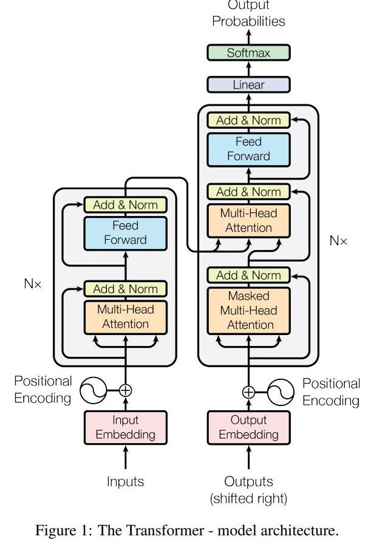

[Large language models, explained with a minimum of math and jargon](https://www.understandingai.org/p/large-language-models-explained-with)

[Exploring Large Language Models: A Guide to LLM Architectures](https://www.aporia.com/learn/exploring-architectures-and-capabilities-of-foundational-llms/)

