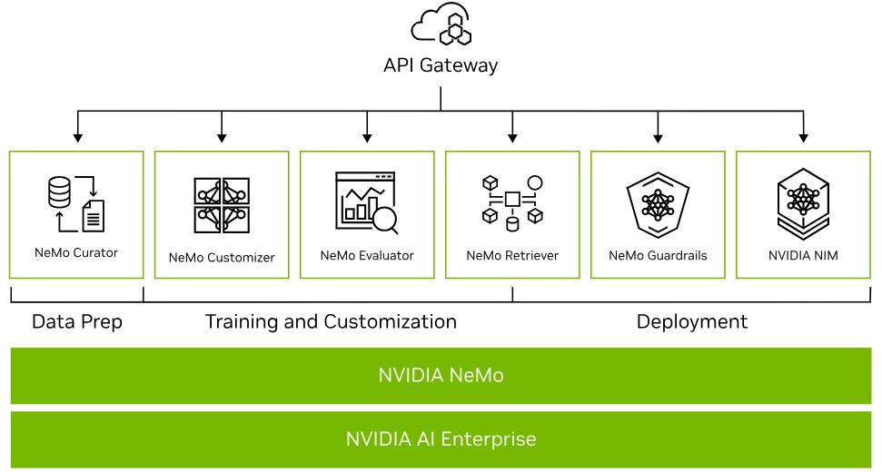

[百度千帆大模型平台+英特尔 AI 软件栈](https://www.infoq.cn/article/44aSfCiMd905NBRMSFY6)优化大模型推理，包括 oneDNN、oneMKL、IG、oneCCL 等高性能库：
- **系统层面**：利用英特尔® AMX/AVX512 等硬件特性，高效快速地完成矩阵 / 向量计算；优化实现针对超长上下文和输出的 Flash Attention/Flash Decoding 等核心算子，降低数据类型转换和数据重排布等开销；统一内存分配管理，降低推理任务的内存占用。
- **算法层面**：在精度满足任务需求的条件下，提供多种针对网络激活层以及模型权重的低精度和量化方法，大幅度降低访存数据量的同时，充分发挥出英特尔® AMX 等加速部件对 BF16/INT8 等低精度数据计算的计算能力。 
- **多节点并行**：支持张量并行（Tensor Parallelism）等对模型权重进行切分的并行推理部署。使用异构集合通信的方式提高通信效率，进一步降低 70b 规模及以上 LLM 推理时延，提高较大批处理请求的吞吐。
[看至强® 可扩展处理器如何为千帆大模型平台推理加速](https://www.intel.cn/content/www/cn/zh/artificial-intelligence/baidu-ai-cloud-accelerates-llm.html?cid=soc&source=Wechat&article_id=5682)

Phi-3 微软
Gemma Google
Llama-3 Meta
Mistral MistralAI成立于23年5月，由DeepMind和Meta的前科学家创立，被称为“欧洲版OpenAI”。

## Nvidia NeMo
Complete Solution for Building Enterprise-Ready LLMs
NVIDIA NeMo™ is an end-to-end platform for developing custom generative AI—including large language models (LLMs), multimodal, vision, and [speech AI](https://www.nvidia.com/en-us/ai-data-science/solutions/speech-ai/) —anywhere. Deliver enterprise-ready models with precise data curation, cutting-edge customization, retrieval-augmented generation (RAG), and accelerated performance.

- NeMo Curator
	- NVIDIA NeMo Curator is a GPU-accelerated data-curation tool that enables large-scale, high-quality datasets for pretraining LLMs.
- NeMo Customizer
	- NVIDIA NeMo Customizer is a high-performance, scalable microservice that simplifies fine-tuning and alignment of LLMs for domain-specific use cases, making it easier to adopt generative AI across industries.
- NeMo Evaluator
	- NVIDIA NeMo Evaluator provides automatic assessment of custom generative AI models across academic and custom benchmarks on any platform.
- NeMo Retriever
	- NVIDIA NeMo Retriever is a collection of generative AI microservices that enable organizations to seamlessly connect custom models to diverse business data and deliver highly accurate responses.
- NeMo Guardrails
	- NVIDIA NeMo Guardrails orchestrates dialog management, ensuring accuracy, appropriateness, and security in smart applications with LLMs. It safeguards organizations overseeing generative AI systems.
- #### Generative AI Inference：NVIDIA NIM
	- NVIDIA NIM, part of NVIDIA AI Enterprise, is an easy-to-use software designed to accelerate deployment of generative AI across clouds, data centers, and workstations.
