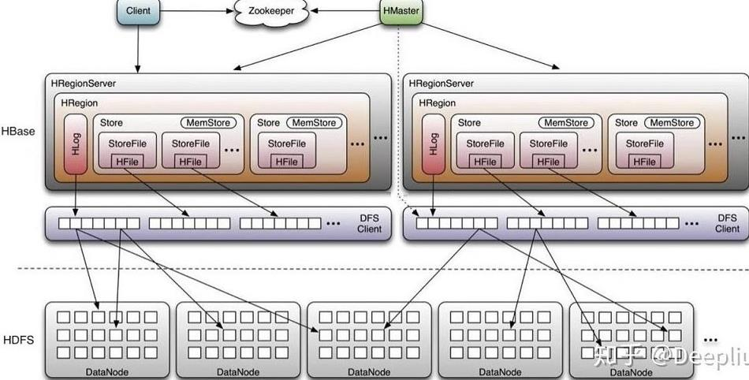
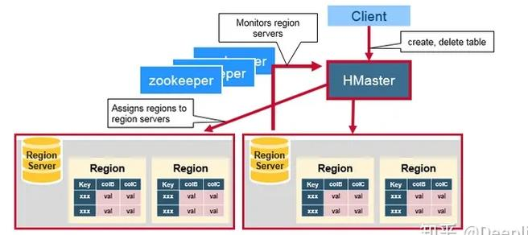
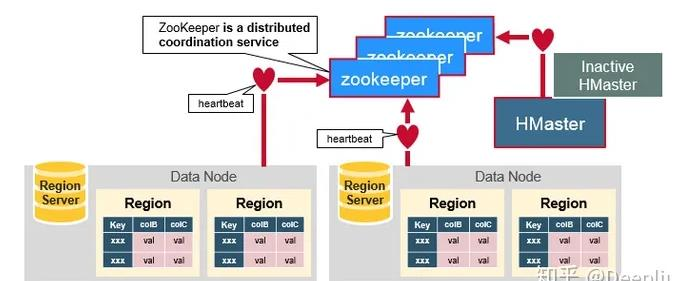
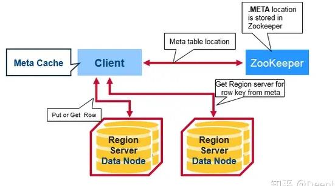
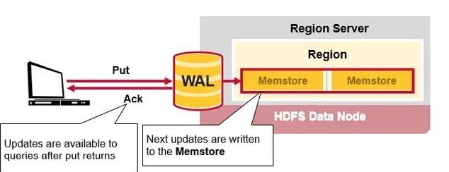
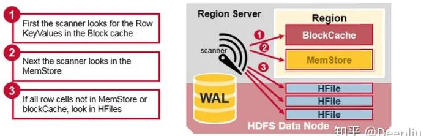
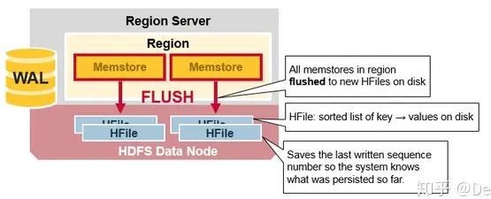
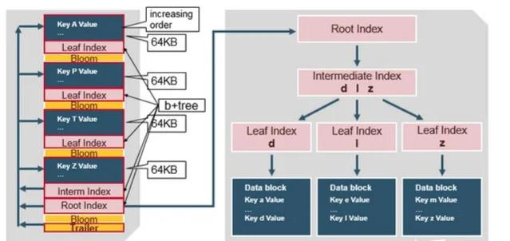

## 简介
Hbase是一个分布式的NoSQL KV数据库，是开源社区基于谷歌BigTable的实现。

Hbase的主要应用场景如下：
- Hbase适合做海量数据（亿万条记录）的底层数据源，由于其LSM-Tree的数据结构，适合海量数据的快速写入
- 需要存储历史记录场景，由于每行记录都有TimeStamp，因而便于查询用户的历史记录
- 高并发的点查场景，HBase查询条件简单，只支持基于主键rowkey进行查询，即点查或小范围查询
整体架构如下，由HMaster，HRegionServer，Zookeeper加上底层存储HDFS构成。
`一句话概括：一种基于LSM-Tree的分布式KV存储系统，依托ZooKeeper的主从系统，支持高吞吐数据写入，适用于海量数据的点查或小范围查询场景`

## HMaster

- 调控Region server的工作

    - 在集群启动的时候分配region，根据恢复服务或者负载均衡的需要重新分配region。

    - 监控集群中的Region server的工作状态。（通过监听zookeeper对于ephemeral node状态的通知）。

- 管理数据库
    - 提供创建，删除或者更新表格的接口。
   
   

## ZooKeeper

- 维护服务器是否存活，是否可访问的状态并提供服务器故障/宕机的通知。

- 使用一致性算法来保证服务器之间的同步。

- 负责Master选举的工作。

## Region Server
- WAL：即Write Ahead Log。WAL是HDFS分布式文件系统中的一个文件，即HLog。WAL用来存储尚未写入永久性存储区中的新数据。WAL也用来在服务器发生故障时进行数据恢复。
- Block Cache：Block cache是读缓存。Block cache将经常被读的数据存储在内存中来提高读取数据的效率。当Block cache的空间被占满后，其中被读取频率最低的数据将会被杀出。
- MemStore：MemStore是写缓存。其中存储了从WAL中写入但尚未写入硬盘的数据。MemStore中的数据在写入硬盘之前会先进行排序操作。每一个region中的每一个column family对应一个MemStore。
- Hfiles：Hfiles存在于硬盘上，根据排序号的键存储数据行。

### META Table

HBase中有一个特殊的起目录作用的表格，称为META table。META table中保存集群region的地址信息。ZooKeeper中会保存META table的位置,**注意而不是META TABLE**。

META table中保存了HBase中所有region的信息，格式类似于B tree。其结构如下：  
- 键：region的起始键，region id。  
- 值：Region server

### 第一次数据读
当用户第一次从HBase中进行读或写操作时，执行以下步骤：
1. 客户端从ZooKeeper中得到保存META table的Region server的信息。
2. 客户端向该Region server查询负责管理自己想要访问的row key的所在的region的Region server的地址。客户端会缓存这一信息以及META table所在位置的信息。
3. 客户端与负责其row所在region的Region Server通信，实现对该行的读写操作。
	在未来的读写操作中，客户端会根据缓存寻找相应的Region server地址。除非该Region server不再可达。这时客户端会重新访问META table并更新缓存。这一过程如下图所示：

### 写操作

当HBase的用户发出一个 PUT 请求时（也就是HBase的写请求），HBase进行处理的第一步是将数据写入HBase的write-ahead log（WAL）中。

- WAL文件是顺序写入的，也就是所有新添加的数据都被加入WAL文件的末尾。WAL文件存在硬盘上。  

- 当server出现问题之后，WAL可以被用来恢复尚未写入HBase中的数据（因为WAL是保存在硬盘上的）。
	当数据被成功写入WAL后，HBase将数据存入MemStore。这时HBase就会通知用户PUT操作已经成功了。

### 读操作

1. HBase会首先从Block cache（HBase的读缓存）中寻找所需的数据。

2. 接下来，HBase会从MemStore中寻找数据。因为作为HBase的写缓存，MemStore中包含了最新版本的数据。

3. 如果HBase从Block cache和MemStore中没有找到行所对应的cell所有的数据，系统会接着根据索引和 bloom filter（布隆过滤器） 从相应的HFile中读取目标行的cell的数据。
	由于可能需要查找多个地方，因而存在一定的读放大

### MemStore flush到磁盘

MemStore存在于内存中，其中存储的是按键排好序的待写入硬盘的数据。数据也是按键排好序写入HFile中的。每一个Region中的每一个Column family对应一个MemStore文件。因此对数据的更新也是对应于每一个Column family。

当MemStore中积累了足够多的数据之后，整个MemCache中的数据会被一次性写入到HDFS里的一个新的HFile中。因此HDFS中一个Column family可能对应多个HFile。这个HFile中包含了相应的cell，或者说键值的实例。这些文件随着MemStore中积累的对数据的操作被flush到硬盘上而创建。

需要注意的是，MemStore存储在内存中，这也是为什么HBase中Column family的数目有限制的原因。每一个Column family对应一个MemStore，当MemStore存满之后，里面所积累的数据就会一次性flush到硬盘上。同时，为了使HDFS能够知道当前哪些数据已经被存储了，MemStore中还保存最后一次写操作的序号。

每个HFile中最大的序号作为meta field存储在其中，这个序号标明了之前的数据向硬盘存储的终止点和接下来继续存储的开始点。当一个region启动的时候，它会读取每一个HFile中的序号来得知当前region中最新的操作序号是什么（最大的序号）。

  
### HFile

HFile中包含了一个多层索引系统。这个多层索引是的HBase可以在不读取整个文件的情况下查找数据。这一多层索引类似于一个B+树。

- 键值对根据键大小升序排列。
- 索引指向64KB大小的数据块。
- 每一个数据块还有其相应的叶索引（leaf-index）。
- 每一个数据块的最后一个键作为中间索引（intermediate index）。
- 根索引（root index）指向中间索引。

### Compaction

由于Memstore多次flush形成多个HFile，大量的小文件不利于HDFS的性能，故需要Compaction操作。

- Minor Compaction

HBase会自动选取一些较小的HFile进行合并，并将结果写入几个较大的HFile中。这一过程称为Minor compaction。Minor compaction通过Merge sort的形式将较小的文件合并为较大的文件，从而减少了存储的HFile的数量，提升HBase的性能。

- Major Compaction

Major Compaction指的是HBase将对应于某一个Column family的所有HFile重新整理并合并为一个HFile，并在这一过程中删除已经删除或过期的cell，更新现有cell的值。这一操作大大提升读的效率。但是因为Major compaction需要重新整理所有的HFile并写入一个HFile，这一过程包含大量的硬盘I/O操作以及网络数据通信。这一过程也称为写放大（Write amplification）。在Major compaction进行的过程中，当前Region基本是处于不可访问的状态。  

Major compaction会将当前Region所服务的所有远程数据下载到本地Region server上。这些远程数据可能由于服务器故障或者负载均衡等原因而存储在于远端服务器上。  

### Region 切分

- HBase中的表格可以根据行键水平分割为一个或几个region。每个region中包含了一段处于某一起始键值和终止键值之间的连续的行键。

- 每一个region的默认大小为1GB。

- 相应的Region server负责向客户端提供访问某一region中的数据的服务。

- 每一个Region server能够管理大约1000个region（这些region可能来自同一个表格，也可能来自不同的表格）。

## 使用注意事项

#####  查询条件

HBase查询条件简单，只支持基于主键rowkey索引，即只能通过rowkey进行查询，不能像其他数据库一样使用多条件复杂查询，不支持二级索引，因此选型前，需确认是否能满足业务需求。

#####  rowkey设计要求较高

HBase是Key/vale数据库，也只能通过key（即rowkey）来查询数据，rowkey的设计非常重要，一个优秀的rowkey设计，即可以满足查询业务需求，同时也能让数据均衡分布在集群中的节点上。提升读写性能。

一般是将常用的谓词条件组合成rowkey，比如用户经常查询phone与age，则可以将phone与age组合成Key。

#####  不太适合大范围key查询

从HBase的存储原理可知，其根据rowkey字节范围进行分区分文件存储，大范围的数据查询会使查询落到多个不同的RegionServer上，所以大范围的rokey查询，查询效率会比较低下。

##### Hbase部署相对复杂，运维成本高：

部署Hbase集群之前，首先要部署Hadoop集群，这包括HDFS、Yarn、Mapredue等一系列组件，其次还要部署Zookeeper集群。

在这两块的服务都正常部署启动后，才能部署HBase集群，此外还包括监控运维等服务组件。

## 与Cassandra对比  

HBase是LSM-Tree数据结构在分布式KV数据系统的典型应用，另一款基于该数据结构的竞品是Cassandra，二者的区别：

- 架构上：

    - Cassandra：Cassandra采用分布式的、去中心化的架构。数据在多个节点上进行分片和复制，每个节点都是对等的。Cassandra使用一致性哈希算法来确定数据的分布和复制策略。

    - HBase：HBase是构建在Hadoop分布式文件系统（HDFS）之上的分布式数据库。它采用主从架构，其中一个节点作为主节点（称为主服务器），负责管理数据的分片和复制，其他节点（称为从服务器）存储和提供数据访问。

- 数据模型：

    - Cassandra：Cassandra使用基于列的数据模型，数据以表的形式组织，每个表包含多行和多列。表由主键标识，支持灵活的列定义，每行可以具有不同的列集合。  

    - HBase：HBase使用基于列族的数据模型，数据存储在表中，表由行键和列族组成。每个列族可以包含多个列限定符。列族和列限定符需要在表创建时定义。

  

**参考文献**

[HBase架构与原理详解](https://zhuanlan.zhihu.com/p/159052841)

[架构视角：什么业务场景用Hbase？](https://www.modb.pro/db/46149)

[HBase和Cassandra的分布式架构深度对比](https://developer.aliyun.com/article/841604)