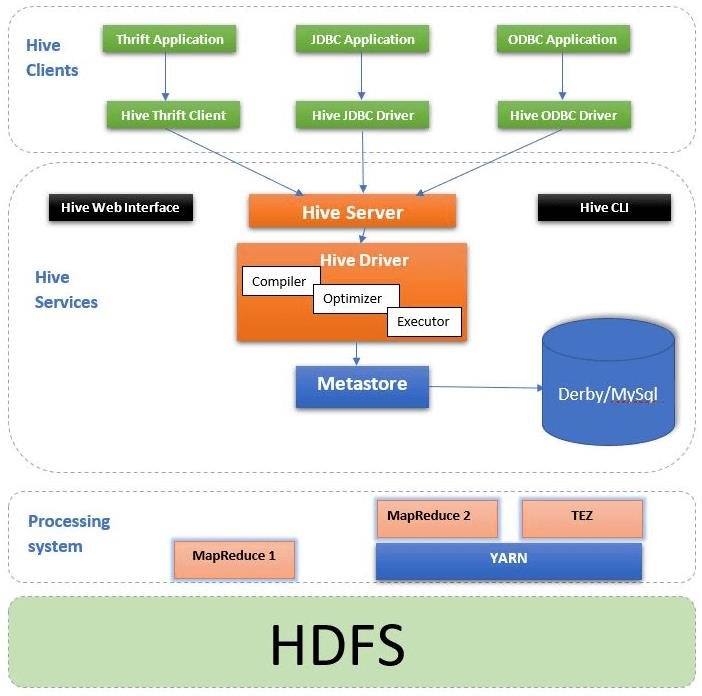
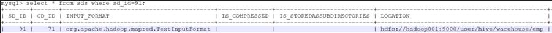

**一句话概括：一个包含元数据管理与SQL解析执行的分析引擎，其解析执行的部分被Spark、Presto组件侵蚀，而元数据管理被广泛继承并兼容**
构建于hadoop之上的数据仓库，通过一种类SQL语言HiveQL为用户提供数据的归纳、查询和分析等功能。底层使用MapReduce或TEZ计算框架

  
#### Hive的组件如下：
- Hive CLI（Command-Line Interface）：Hive CLI是Hive的命令行接口工具，允许用户通过命令行交互方式与Hive进行交互。用户可以在Hive CLI中输入HiveQL查询语句，并获取查询结果。
- HiveServer2：HiveServer2是Hive的服务接口，提供了对外部客户端的访问接口。它允许远程客户端通过JDBC、ODBC或Thrift等协议连接到Hive，以执行查询和操作。
- Hive Metastore：Hive Metastore是Hive的元数据存储和管理组件。它负责存储表、分区、列、表之间的关系以及数据的位置等元数据信息。Hive Metastore通常使用关系型数据库（如MySQL）来存储元数据。
- Hive Driver：Hive Driver负责解析和执行HiveQL查询。它接收用户提交的查询请求，将查询转化为适当的执行计划，并将计划提交给底层的执行引擎（如MapReduce或Tez）执行。Driver负责解析HiveQL，HiveQL是Hive的查询语言，类似于SQL。
- Hive执行引擎：Hive可以通过不同的执行引擎来执行查询和任务。最常用的执行引擎是MapReduce和Tez。MapReduce引擎将查询转换为一系列的Map和Reduce任务，而Tez引擎使用更高效的图计算模型来执行查询。
### Hive Metastore与HDFS的逻辑联系
从用户查询的表，到实际读取的文件块，中间经历了两次映射:

- 从表映射到文件路径，这个映射关系保存在Hive的后端存储引擎mysql中

- 从文件路径映射到多个文件块，这个映射关系保存在HDFS的NameNode中

**从这两层映射也反映了一个软件工程的基本思想，即通过一层中间层，来屏蔽、扩展原有直接做无法做或难以做的事**  

查看Hive Metastore后端存储引擎Mysql的表结构，可参考[Hive MetaStore的结构](https://www.jianshu.com/p/1ad4ec012763)
