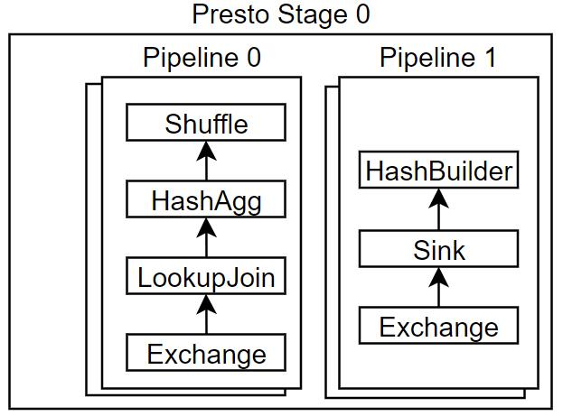
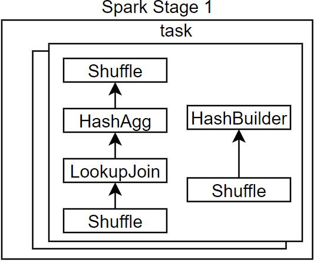

## 简介
**一句话概括：一种Stage by Stage执行的计算引擎，具备良好的开源生态，支持多种业务，但在各个细分领域都有强劲且主流的对手**
Spark生态中包含了Spark Core、Spark SQL、Spark Streaming、Spark ML与Pyspark等多种组件，本文主要涉及数据分析使用最多的Spark SQL，所提到的Spark，默认都指的是Spark SQL。
## RDD

Spark RDD（Resilient Distributed Dataset）是Apache Spark中的核心抽象概念之一。它是一种分布式的、可容错的数据集合，用于在Spark中进行并行计算。
以下是关于Spark RDD的一些重要特点和用法：  
- 分布式数据集：RDD是由数据元素组成的分布式集合，可以分布在Spark集群的多个节点上进行并行处理。每个节点上的RDD可以被划分为`多个分区`，每个分区可以在不同的节点上进行计算。  
- 可容错性：RDD具有容错性，这意味着在节点故障时可以自动恢复。通过记录RDD的转换操作历史，Spark可以重新计算丢失的分区，从而保证计算的正确性和可靠性。  
- 不可变性：RDD是不可变的，一旦创建就不能被修改。这意味着RDD的数据和转换操作是确定性的，可以被多个并行任务共享和重用。  
- 转换和动作操作：Spark提供了一系列的转换操作（Transformation）和动作操作（Action），用于对RDD进行操作和处理。转换操作会生成新的RDD，而动作操作会触发计算并返回结果或将数据存储到外部系统。
- 惰性计算：Spark采用惰性计算的策略，即RDD上的转换操作并不会立即执行，而是在遇到动作操作时才触发计算。这种延迟计算的机制可以优化计算过程，避免不必要的中间结果生成。
- 数据持久化：Spark支持将RDD的数据持久化到内存或磁盘中，以便在后续计算中重用。这可以提高计算性能，避免重复计算和数据传输。

总结而言，RDD是对不同节点上正在按分区被处理的数据的一种横向抽象。

## 工作流程

Spark 的Sql执行流程与其他引擎类似，可以分为Parser、Analyzer、Optimizer、Planner、Scheduler与Executor等角色。
> [SQL process procedure](绘图/SQL%20process%20procedure.md)

1. 将用户提交的SQL经过解析成AST树，进而形成一个DAG图。
2. 使用RBO和CBO优化DAG，并拆分为不同的stage，每个stage内部由并行的任务处理不同的数据
3. Driver通过App Master向Yarn的Resource Manager申请资源，Node Manager负责分配对应的executor资源。Driver将拥有所有executor的视图
4. Driver监控executor的执行，如果任务失败将重新发送任务。前一个Stage任务完成后，才会调度下一个stage的任务
### 与Presto的工作流程的差异
- Presto与Spark的整体流程是类似，其中coordinator对应Spark的Driver，worker对应executor
- 其中presto是stage内包含多个pipeline，每个pipeline包含一系列的Operator，每个pipeline由一个driver驱动，driver引入了一个block机制，当某些算子依赖的其他内容没有完成时，且其状态会block时，上游不会再提供输入。
#### Presto算子Block原因：
1. LookupJoinOp依赖的build侧还未完成状态，持有lookupSourceProviderFuture
2. HashbuilderOp发生spill时，采用异步spill机制，持有一个spill状态的future
3. TableScanOp依赖pagesource的输入，持有一个pagesource是否block的future
4. ExchangeOp依赖exchangeClient是否block，比如PageBuffer满了，将block住
**而Spark不存在上述的block机制，其通过Iterator模式从子Operator拉取结果，在hasNext方法中，如果子Operator需要长期处理大量数据，那么会同步等待，直到子Operator完成。当hashNext返回false时，表示子算子的数据已经处理完毕。**
- Presto Stage内的执行模式

- Spark Stage内的执行模式

## Shuffle  
![[绘图/Spark Shuffle]]
- Shuffle是指对数据进行重组，使其按照某种规则（基于hash或者range）重新分布的一种方式。
- Spark与Presto的另外一大区别就在于Shuffle，Spark采用的stage by stage，每个stage结果落盘的方式来进行数据的Shuffle处理，而Presto采用的是内存中Shuffle的方式，通过在内存构建buffer来进行数据的交换。
- Spark提供了shuffle manager接口，可用于定义自己的ESS或RSS
### Hash Shuffle机制
- 在spark1.6之前，使用的是HashShuffle，但是由于Hashshuffle导致的小文件问题，后续版本全部切换到了sort shuffle。
- 每一个上游ShufflleMapTask 根据下游 ReduceTask数量，产生对应多个的bucket内存，这个bucket存放的数据是经过Partition操作（默认是Hashpartition）之后找到对应的 bucket 然后放进去。
- bucket内存大小默认是32k，最后将bucket缓存的数据溢写到磁盘，即为对应的block file。
- 接下来Reduce Task底层通过 BlockManager 将数据拉取过来。拉取过来的数据会组成一个内部的 ShuffleRDD，优先放入内存，内存不够用则放入磁盘。
- **缺点**：生成大量小文件，文件数量=maptask * executor * reducetask，当存在20个executor，每个executor运行200个map task与200个reduce task时，将产生20*200*200=800000个文件，则极大的增加的磁盘负担。
#### 优化后的hash shuffle
- 核心优化点：每个map task不再单独针对每个reduce 输出文件，而是让多个map task共享一个输出给reduce的文件，因为在一个executor进程内，因此可以共享同一个文件句柄。
- 优化后的文件数=executor* reduce task，当存在20个executor，每个executor运行200个map task与200个reduce task时，产生文件数=20*200=4000个，虽然减少了不少，但是依然存在大量小文件。
- 上述两种shuffle的文件个数与Reducer有关，乘以executor数后，可能仍然很大
### Sort Shuffle机制
- 为了缓解 Shuffle 过程产生文件数过多和 Writer 缓存开销过大的问题，spark 引入了类似 于 hadoop Map-Reduce 的 shuffle 机制。
- 该机制每一个 ShuffleMapTask 不会为后续的任务创建单独的文件，而是会将所有的 Task 结果写入同一个文件，并且对应生成一个索引文件。 
- 以前的数据是放在内存缓存中，等到缓存读取完数据后再刷到磁盘，现在为了减少内存的使用，在内存不够用的时候，可以将输出溢写到磁盘。
- 结束的时候，再将这些不同的文件联合内存（缓存）的数据一起进行归并，从而减少内存的使用量。一方面文件数量显著减少，另 一方面减少 Writer 缓存所占用的内存大小，而且同时避免 GC 的风险和频率。
#### 普通的SortShuffle
- 在普通模式下，数据会先写入一个内存数据结构中，如果是由聚合操作的shuffle算子用map数据结构，如果是join算子就用Array数据结构。
- 在写入的过程中如果达到了临界值，就会将内存数据结构中的数据溢写到磁盘，然后清空内存数据结构。
- 在溢写磁盘之前，会先根据key对内存数据结构中的数据进行排序，排序好的数据，会以每批次1万条数据的形式分批写入磁盘文件。
- 然后通过一个类似于MergeSort的排序算法TimSort对AppendOnlyMap 集合底层的 Array 排序
- 排序的逻辑是:**先按照PartitionId 排序, 后按照Key的HashCode 排序**

  

在task将所有数据写入内存数据结构的过程中，会发生多次磁盘溢写，会产生多个临时文件，最后会将之前所有的临时文件都进行合并，最后会合并成为一个大文件。  

> 每个Map任务最后只会输出两个文件（一个数据文件，一个是索引文件记录每个分区的偏移量），中间过程采用归并排序,输出完成后，Reducer会根据索引文件得到属于自己的分区。
> 上图中多个排序并列，可能存在误导，内存数据结构实例可以只有一个，因而可以节省内容

#### BypassMergeSortShuffleWriter
- 上游stage的task会为每个下游stage的task都创建一个临时磁盘文件，并将数据按key进行hash然后根据key的hash值，将key写入对应的磁盘文件之中。当然，写入磁盘文件时也是先写入内存缓冲，缓冲写满之后再溢写到磁盘文件的。最后，同样会将所有临时磁盘文件都合并成一个磁盘文件，并创建一个单独的索引文件。

>Bypass的模式和未优化的hashshuffle其实很类似，不同之处是合并了每个task的输出，并用一个索引文件记录了不同reduce task需要拉取的offset
>Bypass模式与优化的hashffle的区别是，bypass基于map task确定文件个数，而优化的hashshuffle基于reduce task确定文件个数

## Spark on Yarn部署
在Spark SQL中，`--deploy-mode`和`--master`是两个重要的启动参数，用于指定Spark应用程序的部署模式和集群管理器。
1. `--deploy-mode`参数：该参数用于指定Spark应用程序的部署模式，即应用程序运行的方式。它可以设置为以下两个值：  
   - `client`（默认值）：在客户端模式下，驱动程序进程运行在提交Spark应用程序的客户端机器上。这意味着驱动程序与客户端的会话是交互式的，并且客户端需要一直保持连接，直到应用程序运行完成。  
   
   - `cluster`：在集群模式下，Driver进程将由集群管理器（如YARN）分配到一个独立的容器中，并在集群中独立运行。这意味着客户端只需要提交应用程序，并不需要一直保持连接，应用程序将在集群上独立运行。

   

2. `--master`参数：该参数用于指定Spark应用程序的集群管理器。它决定了Spark应用程序在哪个集群上运行。常见的选项包括：  

   - `local`：在本地模式下运行，即在单机上运行Spark应用程序，不连接到任何集群管理器。  

   - `local[n]`：在本地模式下运行，使用n个线程。例如，`local[2]`表示在本地使用两个线程进行并行计算。

   - `yarn`：在YARN集群上运行，通过YARN进行资源管理和任务调度。

  - `spark://host:port`：连接到指定的Spark独立集群，其中`host:port`是Spark独立集群的地址和端口。

部署差异汇总如下表：  

## 参考文献
1. [Running Spark Jobs on YARN](https://medium.com/@goyalsaurabh66/running-spark-jobs-on-yarn-809163fc57e2)
2. [Spark Shuffle原理详解](https://developer.aliyun.com/article/927120)