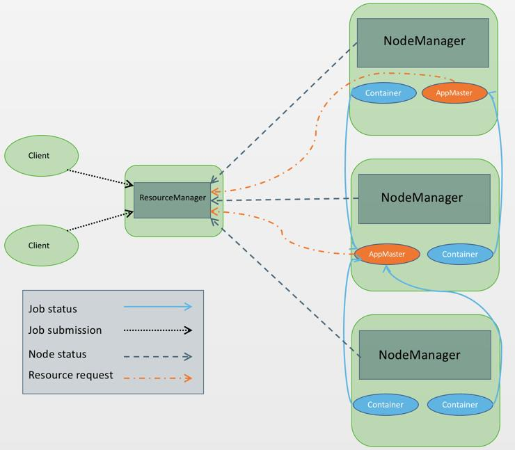

### 任务调度与资源管理框架

**一句话概括：一种通用的任务调度与资源管理框架，支持多租户管理，是大数据资源管理的事实标准** 

YARN（Yet Another Resource Negotiator）是Apache Hadoop生态系统中用于集群资源管理和作业调度的关键组件。以下是YARN的主要组件：

- ResourceManager（RM）：ResourceManager是整个YARN集群的主节点，负责管理集群中的资源分配和作业调度。它接收客户端提交的作业请求，并将资源分配给各个应用程序的ApplicationMaster。  

- NodeManager（NM）：NodeManager是每个工作节点（节点）上的代理，负责管理该节点上的资源和任务执行。它接收ResourceManager的指令，启动和监控容器，管理节点上的资源和任务生命周期。  

- ApplicationMaster（AM）：ApplicationMaster是**特定应用程序**的管理器，由ResourceManager分配给每个应用程序。它负责在集群中协调和管理应用程序的资源需求，与ResourceManager交互以获取所需的资源，并与NodeManager交互以启动和监控任务容器。  

	当你在YARN集群上提交一个Spark应用程序时，YARN会为该应用程序分配一个唯一的ApplicationMaster，AM的任务名称一般是application_1681546579054_0076。ApplicationMaster会被启动在一个独立的容器中，通常是在一个专门的节点上（这个节点由YARN的ResourceManager根据资源可用性和调度策略进行选择），AM的进程名字在spark on yarn上叫做org.apache.spark.deploy.yarn.ExecutorLauncher。  
	
	ApplicationMaster在运行过程中与YARN的ResourceManager进行通信，请求资源分配、监控任务状态、报告任务进度等。它负责协调Spark应用程序中的任务执行、资源的申请与释放，并处理任务的失败和重试等操作。

- Container：Container是YARN中的一个抽象概念，代表一个运行应用程序的任务实例。每个应用程序都可以被分解为多个任务，每个任务运行在一个Container中，Container由NodeManager启动和管理。Spark on Yarn的executor进程名字一般叫做org.apache.spark.executor.YarnCoarseGrainedExecutorBackend  
