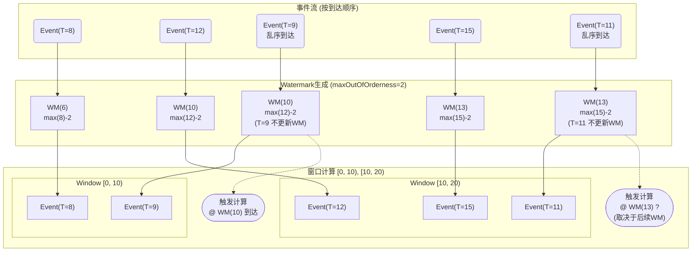

#myblog
# 前言

笔者在参与华为大数据 OmniRuntime Native Engine 的架构设计与代码开发过程中，深感大数据物理执行引擎算子之复杂与设计之精妙。
本文采众家之所长，结合在设计OmniRuntime架构，并开发OmniOperator与OmniVector过程中累积的经验与感悟，希望能对大数据物理执行算子进行一个全面的概述 。
本文介绍的大数据算子算法思想主要来自OmniRuntime，Spark，Presto，Clickhouse、DuckDB、Velox等多个引擎，具体实现上主要参考并对比了业界主流与高性能的Spark与Presto引擎。

本文虽然介绍的是传统大数据算子，甚至有些经典的算法诞生的时间超过笔者的年龄，但放眼来看，其与诸多计算机领域技术都颇有相似之处，比如当下火热的大模型的分布式训练，其三种并行模式都能在大数据执行引擎中找到相似之处：
1. Data Parallelism：不同节点处理不同数据子集，相当于大数据中的数据分区，特别地，在这种模式下大模型中每个GPU持有一份全量参数（而大数据节点可能仅参与部分stage算子计算），一个epoch后需要根据梯度更新全量参数
2. Model Parallelism：模型的不同部分（如不同层）分布到不同的计算节点上，每个节点仅负责模型的一部分计算，数据从0层流过不同节点到第N层，这相当于大数据中的stage划分，区别在于大模型每个节点的层都不一样，而大数据则是多个节点处理相同的Stage。
3. Tensor Parallelism：属于Model Parallelism的一个变种，不是按层切分模型参数，而是按矩阵的行或列切分为更小的矩阵进行运算再聚合的方式，这有点类似Sort算子先Partial Sort再聚合的过程，都是为了避免由于同一个节点内存有限导致无法存储所有数据或者模型参数的问题。
现在大模型训练框架都旨在融合上述三种并行模式，而对于大数据分析引擎来说，上述三种模式的融合早已是默认设计，并以此产生了许许多多的调度与执行优化。大模型Transformer架构下的编码器与解码器、多头自注意力与位置编码等关键技术也总是能在经典的计算机技术中找到原始Idea。

希望通过本文，不仅能加强对大数据引擎执行算子的理解，同时也能打开视野，触类旁通，在大模型等新兴领域产生效用。

# 大数据计算引擎概述

大数据引擎是处理海量数据的主要抓手，可以一句话概括为：将用户意图sql解析为逻辑计划，再具体化为物理算子，用于处理不同业务逻辑，最终给出结果的应用程序

典型的大数据处理流程，以开源Spark的执行流程为例：
![[attachments/大数据分析算子算法分析_2025-01-17_14.53.45.excalidraw]]
其中物理执行部分是典型的CPU intensive负载，一般需要分布式执行，消耗数百到数千个不等的CPU
本文主要聚焦的是物理执行算子的算法介绍，希望通过本文能概括性的讲通讲透大数据算子的常见算法与优化方法。

大数据算子的实现过程中涉及许多细节，比如如何根据负载特征选取合适算子算法，如何处理null值，如何组织内存等等，需要考虑的细节很多。
由于用户负载多变，在实践过程中，也需要根据不同负载针对性的进行了算子算法优化。
如果大数据引擎在某个客户负载下表现较差，可能就是因为客户负载的独特性而引擎尚未支撑或代码未优化的缘故。

PS：要想sql执行的快，加快算子执行速度是一个重要方向，而如何组织这些算子，即执行计划的优化往往发挥着更大的作用。
两者的关系类似手脚和大脑的关系，优秀的大脑可以让手脚少做很多无用功，商业化的数据库或大数据分析引擎花了大量的精力在CBO优化上，不过“手脚”并不是无关紧要，其关系到具体算子算法执行，是SQL运行时的主要载体，一个sql从用户发出到收到结果，绝大部分时间是花在物理算子执行上，也是本文主要关注的部分。
# 内存数据结构

数据结构是进行数据处理的基础，优秀的数据组织方式有利于cache与cache line预取，同时也有利于CPU计算。
由于大数据分析的主要特征便是对同一列数据的大量运算，因而列式内存数据结构便从数据库主流的行式存储结构中脱颖而出，成为大数据计算的主要数据格式。
当然大数据持久化存储也采用了列式数据结构，一方面是为了匹配内存列式数据结构，更重要的是列式结构具备良好的压缩特征以便于减少数据存储空间，同时列式数据结构便于匹配数据分析的工作负载，即数据分析往往仅需要查询某些列数据，而不会关注到所有列，因而列式存储也方便减少不必要列的数据读取。

列式内存数据结构一般称作Vector，主要分为定长和变长两类。在此之上还有字典编码，Run Length等编码，其中用的最多的是字典编码。
#### 定长数据类型
列式定长Vector的主要成员变量为类型数组与bool数组，支持的类型包括：boolean，int，long，double，decimal等
![[attachments/大数据分析算子算法分析_2025-01-16_16.52.46.excalidraw]]
存储空值也可以使用bitmap数组，但解码bitmap数组需要额外的计算，使用bool数组而不是null bitmap相当于使用了经典的空间换时间战术
#### 变长数据类型
##### 连续存储
变长数据类型顾名思义，需要额外的offset数组来用于计算变长类型的长度，即values[i]的长度等于offset[i+1]-offset[i]
![[attachments/大数据分析算子算法分析_2025-01-16_17.06.53.excalidraw]]
##### 离散存储
另一种常见的变长类型的内存管理方式是每个字符串离散存储，区别于上述连续存储的方案。核心思想是用一个8或16byte的数组存储原始varchar（长度较小时）或varchar地址（长度较大时）。
这种方案的优缺点十分明显，即当大量成员都是短字符串时，连续的数组寻址效率很高。反之则是，如果存在大量长字符串，则需要通过指针间接访问长字符串，无法享受cache预取的便利。

![[attachments/大数据分析算子算法分析_2025-01-16_20.13.12.excalidraw]]
#### Dictionary Encoding Vector
字典编码包含一个原始vector以及一个ids数组，ids的大小为真正的该vector的大小
字典编码的好处：
1. 当原始vector很小而ids很大时，可以节约内存空间（字典编码同样可以用在持久化存储，如ORC/Parquet格式上以节约磁盘）
2. 减少数据的复制，节约内存复制的计算开销
字典编码一般用在join operator的build侧输出或filter算子过滤后的输出
![[attachments/大数据分析算子算法分析_2025-01-16_20.24.24.excalidraw||100%]]
#### VectorBatch
多个vector组成VectorBatch，Vectorbatch 可以认为是一张表的N 行数据的切片，且数据是列式存储的，这区别于传统的关系型数据库行式存储（OLTP数据库往往仅查询一行数据，较少多行计算，便于通过主键得出整行数据）
行存和列存在逻辑上都可以看做一张表，在物理内存的获取上存在差异而已
![[attachments/大数据分析算子算法分析_2025-01-17_14.21.57.excalidraw]]
#### 内存申请
一般而言，Vector的类型数组封装在buffer中，buffer通过单独的allocator申请内存
![[大数据分析算子算法分析_2025-01-16_17.30.18.excalidraw]]
##### 注意点
针对变长类型的连续存储方式，多个字符串是连续存储在一块buffer中（buffer可以是std::vector形式的char，也可以是char*，而基础类型是Raw_type*），**不支持乱序赋值；**
当buffer大小不足以存储最新的字符串时，需要将buffer扩容一倍，并copy旧buffer到新buffer中，**扩容涉及复制，会严重影响性能**
一种避免复制的方式是根据varchar(length)，直接申请size * length的内存，但这样势必存在较大内存浪费，除非对Workload十分了解否则一般不会采用该方法。

# 算子执行模式

大数据算子的执行模式依然是数据库系统中经典的火山模型
所谓火山模型的本质是一个operator的输出是另一个operator的输入，一般通过迭代器模式的next（Spark）或者addInput/getOutput（Presto）来实现
在数据库中火山模型的输入是one row，而在大数据引擎中，输入为一个vectorbatch，便于对每个vector进行批量操作，顾常被叫做 **“向量化执行”模式** 

![[attachments/大数据分析算子算法分析_2025-01-17_11.49.05.excalidraw|20%]]

这里的operator一般是通过多态实现的，代码上是通过父类operator来操作各子类，因而存在一定的虚函数开销。
为了减少虚函数的开销，产生了另外一种执行模式：Codegen
即运行时根据算子种类、算子处理的数据类型等信息，直接生成stage级别的算子，在spark中叫做wholestage codegen
除了减少虚函数开销，代码生成还有利于cache：上个算子处理外的数据可以尽快被下游算子处理，减少了内存物化 。同时代码生成可以针对列式数据生成优化的标量代码，甚至结合循环展开和 SIMD 指令实现向量化执行

#### Pipeline内的算子吞吐
Pipeline设计理念贯穿了计算机系统设计的各个领域，典型的如CPU的流水线设计。
SQL引擎的算子执行也采用Pipeline理念。

首先需要明确算子吞吐的定义：
实际吞吐=Page number/(last page time - frist page time)
理论吞吐=page number/processing time

我们常说的算子吞吐，其实是理论吞吐，而实际吞吐整个pipeline的算子都是一样的或者说相差不大的，原因在于每个算子接受到第一个page和最后一个page的绝对时间其实是一样的，比如scan在第1s 接受到first page，计算5s后，传递给filter，filter在第6s接受到first page，然后scan在第100s接受到last page，那么filter则在105s接受到last page，两个算子的实际吞吐时间都是99s
所以我们所说的吞吐就是理论吞吐，其实就是算子处理数据所花费的时间。
下面通过算子吞吐提升与下降两种场景来分析对Pipeline性能的影响。

![[attachments/万字长文一次性搞懂常见大数据算子算法_2025-01-21_20.37.22.excalidraw]]
##### 算子吞吐提升
假设从磁盘读取100GB，Scan由于做了优化（比如data cache等）吞吐从10GB/s提升到20GB/s，那么scan算子将加速5s
**下游算子由于输入数据变快了，比如filter也将加速5s吗？----答案是No**
filter算子处理的数据不变，那么其处理时间则是固定的，除非提升filter算子的性能。
也许你会说，filter吞吐应该提升了，原来等待的时间现在没有了，当然加速了呀
其实filter等待的时间，正是因为scan慢，这个时间其实已经算在scan的执行时间里。

##### 算子吞吐下降
下游算子通过addInput拉取上游算子的getOutput，下游算子如果吞吐下降，那么执行addInput的频率下降，那么上游getOutput的次数将相应下降，但上游算子getOutput处理的时间并不会变，因为物理世界计时的是算子处理数据的时间，拉长的时间其实还算在下游算子的执行时间上。
下游算子如果处理效率降低，这会导致该算子吞吐下降，但并不影响Pipeline其他算子的性能，原因同提升算子吞吐一样。

**因此综上，每个算子都只能影响自己的执行时间，而无法提升或降低PIpeline内其他算子的执行性能**
#### 算子吞吐案例
让我们参考Presto的Pipeline执行方式，实现具体的算子吞吐Pipeline[代码示例](https://github.com/gravitys169/train/tree/main/java/operator-demo)，来分析算子不同吞吐情况下的表现
###### Case 1： 每个算子处理速度相同
每个算子的执行时间通过sleep time模拟，均为5ms，处理100个Page，每个算子处理时间约为500ms，总处理时间约为2000ms（由各算子的处理时间相加）

| 算子类型     | 处理页面数 | 输入时间(ms/页) | 输出时间(ms/页) | 总时间(ms/页) | 总处理时间(ms) | 实际吞吐(页/秒) | 理论吞吐(页/秒) | 执行时间占比(%) |
| -------- | ----- | ---------- | ---------- | --------- | --------- | --------- | --------- | --------- |
| Source   | 100   | 0.00       | 5.14       | 5.14      | 514       | 48.96     | 194.55    | 25.20     |
| Process1 | 100   | 0.00       | 5.10       | 5.10      | 510       | 48.94     | 196.08    | 25.00     |
| Process2 | 100   | 5.08       | 0.00       | 5.08      | 508       | 48.94     | 196.85    | 24.90     |
| Sink     | 100   | 0.00       | 5.08       | 5.08      | 508       | 48.94     | 196.85    | 24.90     |
###### Case 2：上游算子处理速度加快
source算子执行速度提升5倍（代码中将sleep时间缩短为1ms）

| 算子类型     | 处理页面数 | 输入时间(ms/页) | 输出时间(ms/页) | 总时间(ms/页) | 总处理时间(ms) | 实际吞吐(页/秒) | 理论吞吐(页/秒) | 执行时间占比(%) |
| -------- | ----- | ---------- | ---------- | --------- | --------- | --------- | --------- | --------- |
| Source   | 100   | 0.00       | 1.04       | 1.04      | 104       | 61.15     | 961.54    | 6.36      |
| Process1 | 100   | 0.00       | 5.10       | 5.10      | 510       | 61.11     | 196.08    | 31.19     |
| Process2 | 100   | 5.15       | 0.00       | 5.15      | 515       | 61.11     | 194.17    | 31.50     |
| Sink     | 100   | 0.00       | 5.06       | 5.06      | 506       | 61.15     | 197.63    | 30.95     |
###### Case 3：下游算子处理速度下降
sink算子执行速度下降4倍

| 算子类型     | 处理页面数 | 输入时间(ms/页) | 输出时间(ms/页) | 总时间(ms/页) | 总处理时间(ms) | 实际吞吐(页/秒) | 理论吞吐(页/秒) | 执行时间占比(%) |
| -------- | ----- | ---------- | ---------- | --------- | --------- | --------- | --------- | --------- |
| Source   | 100   | 0.00       | 5.11       | 5.11      | 511       | 28.27     | 195.69    | 14.48     |
| Process1 | 100   | 0.00       | 5.07       | 5.07      | 507       | 28.27     | 197.24    | 14.37     |
| Process2 | 100   | 5.09       | 0.00       | 5.09      | 509       | 28.27     | 196.46    | 14.43     |
| Sink     | 100   | 0.00       | 20.01      | 20.01     | 2001      | 28.27     | 49.98     | 56.72     |
###### Case 4：中间算子处理速度下降
process1和process2算子执行速度下降3倍

| 算子类型     | 处理页面数 | 输入时间(ms/页) | 输出时间(ms/页) | 总时间(ms/页) | 总处理时间(ms) | 实际吞吐(页/秒) | 理论吞吐(页/秒) | 执行时间占比(%) |
| -------- | ----- | ---------- | ---------- | --------- | --------- | --------- | --------- | --------- |
| Source   | 100   | 0.00       | 5.08       | 5.08      | 508       | 24.76     | 196.85    | 12.60     |
| Process1 | 100   | 0.00       | 15.07      | 15.07     | 1507      | 24.77     | 66.36     | 37.37     |
| Process2 | 100   | 15.08      | 0.00       | 15.08     | 1508      | 24.77     | 66.31     | 37.39     |
| Sink     | 100   | 0.00       | 5.10       | 5.10      | 510       | 24.77     | 196.08    | 12.65     |

**结合上述案例表格与理论分析可知，每个算子的性能变化只会拉长或缩短自己部分的时间，而无法提升或降低其他算子的执行时间**
##### Note
凡事无绝对，Pipeline算子吞吐也不例外，下述两种情况需要单独说明下算子之间的相互影响
1. 在实际的执行引擎中，往往还存在block机制，比如在Presto中，Join的probe侧需要block直到build侧完成，统计Join probe算子时间的时候，join的probe一般会加上block time，但这个block time就完全受build的执行时间影响，可以算做上游影响下游的一个特例。
2. 上面也提到shuffle引起的背压机制，当下游不再接受数据时，上游的buffer可能需要额外申请内存来存储生产的数据，如果这部分buffer内存是之前从来没有申请过的，那么便会触发Page Fault，导致产生额外的开销，也可以算作上游影响下游的一个特例
#### PIpeline间的算子吞吐
在大数据执行框架中，往往需要将agg、join等算子的输出分区打散到下游的不同算子中，下游算子也需要接受来之不同分区的上游算子输出，因而产生了shuffle。而在Shuffle中，涉及到网络交互，就需要考虑buffer机制，不同stage的吞吐是不一样的，固定的buffer大小无法满足吞吐不一样的stage的数据存储要求，因而诞生了反压，或者叫block机制。

shuffle sink通过cient-server架构拉取shuffle output结果，在client和server端各有一个buffer，如果shuffle下游算子执行慢了，为了防止sink buffer爆仓，从而会降低拉取shuffle上游 output的速度，相应的上游output为了避免buffer爆仓，也会降低前一个算子addInput执行频率，这是一种常见的全内存计算架构的背压机制

**需要注意的是，因为buffer满会反压上游buffer前的一个算子，导致该算子的吞吐下降，上游Pipeline的整体时间也被拉走。
# 典型算子算法
## Scan
Scan算子读取持久化的数据并经过解压缩、解码等操作转化为内存数据结构，主要处理的对象是ORC 和Parquet这两种大数据格式。
ORC和Parquet在设计理念上有诸多类似之处，从逻辑上都是文件--行组--列 的方式。
以Parquet为例，其与内存数据结构的逻辑组织相仿：一个vectoBatch对应一个RowGroup，column对应vector。物理上实际进行数据存储的结构，Parquet是column（可能拆成多个page），而内存中是vector
内存与持久化数据结构的区别在于持久化的RowGroup size远大于vectorBatch（1MB），一般为一个HDFS Block（64/128/256 MB等），以便于分析引擎的一个task处理 

##### ORC格式结构

##### Parquet格式结构


在大数据存储格式中，使用较多的压缩算法是：Gzip、Snappy、ZSTD等；常用的编码方式包括：RLE与字典编码
#### Scan读取算法过程
1. 先读取RowGroup级别元数据，再读取Column级别的元数据，行数等元数据通常用于执行计划进行Join Reorder等CBO优化
2. 根据元数据或者索引确定需要读取的Page
3. 读取指定列的page，进行解压缩
4. Decode解压后的数据生成内存数据格式Vector

Scan的过程是将持久化字节流转成可处理的内存字节流的过程，这其中涉及多次字节流的转换，比如压缩前后，解码前后（可能不止一次数据格式的转换），减少数据转换开销是提升性能的关键。
#### 元数据
Parquet与ORC格式的细微差别在于二者如何处理元数据以及提供索引粒度的不同。
二者在file级别、Stripe（orc）/RowGroup（Parquet）级别都有元数据，用于统计行数、max/min/sum等信息。
而不同点在于 ORC在Row Group（约10000行，与Parquet的row group概念不同）级别有统计信息，而Parquet在 Column Chunk 级别的统计信息（如最大值、最小值）

二者的对比如下表：

| 特性         | ORC                          | Parquet                  |
| ---------- | ---------------------------- | ------------------------ |
| **元数据**    | 包含文件级、Stripe 级和Row group级元数据 | 包含文件级、Row Group 级和列块级元数据 |
| **索引结构**   | 支持行组索引、布隆过滤器、轻量级索引           | 支持列块索引、谓词下推、页级别索引        |
| **嵌套数据支持** | 支持，但不如 Parquet 灵活            | 支持复杂嵌套数据，元数据更详细          |
| **查询优化**   | 通过索引和布隆过滤器优化查询性能             | 通过谓词下推和列统计信息优化查询性能       |
| **适用场景**   | 适合 Hive 环境和大规模数据分析           | 适合跨平台和复杂嵌套数据处理           |
#### 索引
为了提升过滤效率，一种常见的做法是提供额外的Index。
比如在openLooKeng中，用户可以对指定列在文件或RowGroup级别建立bloom filter，在查询的执行计划排布阶段就可以使用index根据过滤条件进行过滤，减少需要调度的task。
在openLooKeng中，Index一旦命中即可大幅减少数据读取，从而提升查询性能。
笔者曾做过一个实验，对一万亿行的原始数据，构建bloom filter，对于scan+filter+X 这种负载，openLookeng可以在秒级返回查询结果。
这其中的黑科技便是通过index在执行计划阶段过滤掉了大量原始文件或者RowGroup，实际处理的数据远远少于万亿行。

当然额外的Index也面临诸多挑战：
1. 构建Index需要额外的计算与存储资源
2. index的大小可能超过coordinator大小，需要分布式存储index的系统（ps. 针对此挑战，笔者有[专利](https://www.xjishu.com/zhuanli/55/202211096488.html)详细描述解决方案）。
3. Index的更新也是一个大挑战，难点在于如何管理增量与存量Index，以避免每次全量构建index以及如何管理太琐碎的增量Index
因此，需要综合这些挑战与Index的效果来进行综合研判，是否启用额外的Index服务。

## FilterAndProject
filter和project算子本质上都是求解表达式的过程
由于其表达式可能非常复杂，遍历表达式与数据类型需要大量分支判断且性能不高，同时支持范围有限，因而软件上往往采取code gen的方式。
codegen可以有效避免数据类型判断、分支判断与虚函数等操作，能有效提升数据处理性能。
#### 代码生成过程
![[attachments/万字长文一次性搞懂常见大数据算子算法_2025-01-20_19.42.56.excalidraw]]

llvm生成的函数都是逐行处理的，很难生成向量化的函数。在向量化执行引擎中，代码生成对列式数据结构并不友好。

代码生成的编译时间较长（特别是开启了较多编译优化的时候），如果sql执行时间较短，那么代码生成可能得不偿失
#### UDF
UDF是为了满足用户的业务逻辑而编写的自定义函数，主要包括：
1. 单进单出的UDF，用的最多
2. 多进单出的UDAF，聚合函数
3. 单进多出的UDTF，不过用的很少

大数据引擎往往都会提供UDF框架与接口，用户只需实现具体的接口即可，如典型的Hive/Spark UDF，只需实现evaluate接口就可嵌入引擎进行分布式计算
##### 跨引擎UDF
当需要在不同引擎间支持存量UDF，往往面临较大挑战，当前主流的方法有：
1. 对于同一种语言的引擎，例如Presto支持Hive UDF，可以在presto中提供框架，获取hive udf定义并注册到presto引擎中，反射调用hive udf的evaluate方法
2. 为了避免第三方udf的安全与运行时问题，可以通过搭建remote udf server，通过rpc获取udf结果，trick的地方在于udf server要搭建原UDF的运行环境，在增加系统安全性的同时也增加了系统复杂性与维护性难度。
3. 跨语言的引擎，例如Native Engine支持Java Hive UDF，可以通过在native层注册函数，然后在native侧通过JNI构建JVM环境，再反射调用evaluate方法
4. 还有一种很fancy的编译器方案，比如直接将Java Hive UDF通过编译器编译成C++ function，从而在C++侧执行
##### Note
**跨语言的UDF翻译，对传统编译器是巨大的挑战，不过随着LLM的火热，使用LLM代替编译器进行翻译，可以说不费吹灰之力，毕竟什么语言在LLM看来都不过是一个个向量token，做翻译是大模型最擅长的事**

## HashAgg

HashAgg简而言之，根据某些列进行分组，然后根据分组后的结果，针对部分列做聚合运算。
这个过程主要通过实现一个高度优化、定制化的hashtable来完成。
![[attachments/大数据分析算子算法分析_2025-01-17_15.19.31.excalidraw]]
#### 算法过程
HashAgg 算子的实现主要步骤如下：
1. 输入一个vectorbatch，计算 group by 列的hash 值，根据group by列的个数与大小可以分为三种情况：
	1. group size>16B，则序列化为字符串，再求hash
	2. <2B, 直接强转为int16，不用计算hash
	3. <=16B, 强转为int32[4]， 对这个数组求hash
2. hash值对数组size取模后
    a. 如果该槽位为空，则直接将序列化值、初始化state以及hash值，放入该槽位
    b. 如果槽位不为空，则比较其真实数据  
        i. 如果真实数据相等（比较序列化后的值，原始vector可以释放），则将其state值的引用放入State Array对应vector的行号，以便后期一次性计算整个VectorBatch。注意：这里没有采用就地更新state的方法  
        ii.如果真实数据不等，将槽位+1，重复步骤a 判断下一个槽位的状况  
3. 根据 AggStateArray 批量计算一个 vectorBatch
	1. 针对每个state，构建一个与vector同行数的vector state array，array引用state的值
	2. 针对vector和state array进行向量化计算
4. 释放本vectorbatch，输入下一个vectorbatch；在所有Batch处理完成后，deserialize hashtable Key获得group by的Key列，同时输出state
#### Note
1. 在Hashtable的处理过程中，涉及到两个扩容以及对应的数据copy，如何复用内存，减少memory allocate是提升性能的关键
	1. hashtable array slot不够时，如何扩容
	2. 存储Key序列化值的chunk的扩容
	3. key每次都需要序列化，且申请内存来自chunk，如果该key已经在hashtable中，那么涉及到将该序列化内存释放以便后续复用，否则在低基数场景内存开销非常大
2. HashAgg的向量化
	1. agg的状态更新十分适合向量化，即一个add/max指令完成一个vector多行计算
	2. 典型的Arm Neon向量化指令：

| base type | neon type   | init        | load      | compute   |
| --------- | ----------- | ----------- | --------- | --------- |
| int16_t   | int16x8_t   | vdupq_n_s16 | vld1q_s16 | vaddq_s16 |
| int32_t   | int32x4_t   | vdupq_n_s32 | vld1q_s32 | vaddq_s32 |
| double    | float64x2_t | vdupq_n_f64 | vld1q_f64 | vaddq_f64 |
## HashJoin

Join 是指将两张表根据 join key 进行关联，并输出某些列的操作。
presto 在传给 LookupJoinOperatorFactory 的类中，附带了所有的 build 侧的 hashtable 信息，在 probe 时，LookupJoinOperator 需要找到对应分区的 hashtable 进行 join。
而 Spark 的实现则简单一些，一个 LookupJoinOperator 对应一个 hashtable，且当 hashtable 完成后，lookupJoinOp 才开始构建。
二者的区别是presto一个task可能要处理多个分区，而spark一个task仅处理一个分区（在某些优化场景（如 bucket join 或小分区合并）中，一个 task 可能处理多个分区。）

HashJoin 算子主要分为两个阶段：build和probe

#### 构建 HashTable
![[attachments/大数据分析算子算法分析_2025-01-20_10.53.50.excalidraw||100%]]
##### 算法过程
1. 接受输入 VB，构建出 PageIndex，即编码得到valuesAdress
2. 计算每列的 join key 的 hash 值，如果多列，则求 combineHash 值
3. 建立 hash 表的核心数据结构 int* slot，查看slot[hash]
	1. 如果数组的槽位没被填充，则直接令 slot[hash]=VA
	2. 该槽位被填充
		1. 如果Key列数据真实相等，令 key[hash]=新 VA ，同时填充 positionLinks[新va]=旧va
		    1. 这里构造了一个positionLinks来存储key值相同的行，也可以采用更直接的方法，不使用valueAddress，直接保存batch号和行号，多个重复值构成一个数组
		   **note：在软件实现中，针对同一功能，经常存在数组与链表数据结构的不同实现**
		1. 如果不相等，则递增 hash 值，试探下一槽位  
###### 基于workload的array table优化
基于hash构建hash table是最常见的实现，但如果我们对workload有一定了解，或者可以通过较小抽样成本获取workload特征，那么就可以构造出非hash的hashtable
**由于join的build table需要累积所有数据，这是与hash agg的hash table的核心不同，因而可以很好的profile workload**， 如果key值为整型，且其range较小时，则可以直接将（key值-min）作为slot下标，从而避免hash计算。
如上图的hash table array可以简化为下图，其他不变：![[attachments/大数据分析算子算法分析_2025-01-20_11.25.44.excalidraw]]
#### Probe  过程
##### 算法过程
![[attachments/一文搞懂大数据分析算子算法_2025-01-20_11.58.33.excalidraw]]

1. probe 侧输入一个 vectorBatch，计算出整个 vectorBatch 列对应 join key 的 hash 值
2. 对 probe 的每一行，计算出 probe 行的 hash 值，如果build侧 slot[hash]不为空，且probe侧值与 build侧 数据行侧相同
	1. 如果有 join 条件为表达式，则解析出 build 和 probe 的值，通过 simplefilter 进行计算
3. 记录下 probe 和 build 的行号信息，以便后续构造使用
4. 如果 positionLinks[va]的 value 不为空，则获取该 value  重复 Step2的值比较
5. probe侧所有vector Batch都计算完成后，收集 probe 和 build 侧的数据，构造输出vectorbatch
	1. probe 侧数据根据选中的情况，分为
		1. 完全复用：即所有行都join上
		2. slice 部分数据：部分连续的行join上
		3. dict 输出：离散的部分行join上，这是最常见的情况
	2. build 侧根据 step3 记录的 VA 信息，解析出行数据，并复制到 output vector 中   
 
## HashTable 归一
由于HashAgg与HashJoin均是基于hashtable完成主要计算逻辑的算子，因此有必要考虑二者共用同一套hashtable，以便简化维护代价
![[attachments/万字长文一次性搞懂常见大数据算子算法_2025-01-21_17.16.07.excalidraw]]
#### 共同点
1. hashtable 计算hash的方式相同，根据key 列的size来选择是否序列化，一般采用crc32 hash或者MurmurHash
2. slot存储的信息如Key、Hash等字段相同，特别的agg存储了State，而Join存储了batchID和rowID
#### 不同点
1. 扩容：HashAgg处理一个batch后即丢弃，Hashtable包含了所有输出需要的信息，因而起始Slot 数组较小，随着输入增多需要扩容，一般采用开放地址法。而hashjoin因为会累积所有数据以用于输出，所以是可以直接根据行数与稀疏度，设定slot数组的大小。
2. 重复key：Hashagg中重复key的行，就是需要计算state的行，而join中重复Key的行是需要输出的行
3. null：Hashagg中空值为一个组别，需要计算state，而join中只要key列中有一列为null，那么就不应该join上

## Sort  
![[attachments/大数据分析算子算法分析_2025-01-20_09.56.19.excalidraw]]

Sort 主要对全量数据进行排序，其重点是如何在大数据量下组织数据进行排序。
#### 算法过程
Sort 算子主要需要累积数据，然后根据 Sort Key 进行快排。

1. 累积数据的工作主要由 PageIndex 完成，其通过将不同 VectorBatch 统一编码到一个叫 valueAddress 的数组来实现对所有数据行的访问。
	1. 使用valueAddress可以使用较小的内存快速定位到Batch中的一行，一种更浅显的做法直接保存batch号和行号（clickhouse）
2. 然后构造一个 valuePtrs pair，first 为排序 key，second 为 valueAddress，进而全局排序
3. 针对多个排序列的情况，在第一列已经排好的情况下，对第一列的相同值，刷新 pair 的 first 为第二排序列的值，继续排序
4. 最后根据排序后的pair，decode valueAddress构造输出Vector

## SortMergeJoin

#### 算法过程
![[attachments/一文搞懂大数据分析算子算法_2025-01-20_14.36.43.excalidraw||100%]]
sort merge join主要涉及3个步骤：
1. 待join的两表的按照分区分别排序，并采用range shuffle将相同range分区到同一个节点
2. merge sort算子的游标根据join key在两表上移动
3. join匹配，输出结果
#### 注意点
1. sort一般在stage1完成，merge join一般在stage2完成（相同range的数据分到同一个分区），两个阶段都涉及到不同vector batch的value Address表示，因此需要考虑复用
## Broadcast Hash Join
上述两种join算法适用于join的build和probe表都较大的时候，如果其中一个表的size较小，比如小于10MB，那么可以将小表广播到各task中，直接进行小表和大表的join，以避免hash运算以及shuffle操作，从而大幅提升性能。

BHJ算法构建hash与probe的过程与HashJoin类似，区别在于第一步，driver需要广播小表的数据到各executor。
![[attachments/万字长文搞懂常见大数据分析算子算法_2025-01-20_17.34.54.excalidraw]]

在广播小表的时候，一般的做法是driver将小表的数据序列化后发往各个task，task反序列化后构建hash表。
这里存在两种优化方案：
1. 在driver侧构建好hash表，序列化hash表后分发到各个task，这涉及到hash表的序列化，需要额外工作
2. driver分发数据给excutor的多个task，但只在其中一个task构建hash表，构建好后复制或共享给其他task
## Shuffle

shuffle是对数据按照一定规则（hash分桶或排序range）进行分组的算子，以便下游算子按照分组进行计算。
shuffle一般用于切分stage，在spark中也是可靠性的承载算子。
对于窄依赖的算子一般不切分stage，需要切分stage的一般是宽依赖的算子，即下游算子的输入来自多个executor的多个task
**对于宽依赖的算子，如groupbykey、reducebykey、join、sortbykey，如果基于index与file结构shuffle，那么需要等待上游stage的所有task都执行完成，以确定每个分区的offset后，方可以开始下游task**。

**可以说，shuffle算子是Spark与Presto的最大不同，二者存在根本性区别，而其他算子二者则都存在相互借鉴的地方，甚至在最近的Trino版本上（Presto的分叉）也开始完善Stage by Stage的执行能力了，二者的差异日益缩小。
而Clickhouse从立项伊始就对shuffle，特别是shuffle join支持不够**
#### 基于线程的hash shuffle
![[attachments/一文搞懂大数据分析算子算法_2025-01-20_14.58.09.excalidraw]]
算法实现简单直接，每个task线程维度，按hashagg groupby或join key进行hash分桶
最大的问题：单个节点上生成的小文件太多，比如map 200，reduce 200，executor 10，那么生成文件400000个，甚至可能超过linux默认的文件句柄上限（1048576）
##### Note
1. **对于全内存的执行引擎，比如presto，不存在上图的file落盘操作，也就不存在小文件问题**
2. 由于上游stage的输出各自独立，因而下游任务可以即时运行，将不同task的输出当做不同批次的输入，无需等待所有task执行完成，**从而形成pipeline，大幅提升性能**
#### 基于进程的hash shuffle
![[attachments/一文搞懂大数据分析算子算法_2025-01-20_15.12.51.excalidraw]]
优化了每个task的输出，在executor维度即进程维度，按hashagg groupby或join key进行hash分桶
最大的问题：由于跨线程共享分区buffer，需要多线程操作，增加了锁开销
#### 基于reduce的hash shuffle
![[attachments/一文搞懂大数据分析算子算法_2025-01-20_15.21.38.excalidraw]]
基于进程的hash shuffle主要针对map进行优化，本算法针对的reduce进行优化，通过引入额外的index文件，来记录不同分区的offset
相比而言，减少了多进程锁开销，但引入了额外的index，综合而言，这是当前主流的hash shuffle方法
#### sort shuffle
![[attachments/一文搞懂大数据分析算子算法_2025-01-20_15.38.06.excalidraw]]

#### Note
无论是hash shuffle还是sort shuffle，储存分区好或排序好数据的buffer的大小非常关键，需要平衡内存占用与性能来设置buffer大小，更大的buffer可以减少生成的file数量以及减少file合并次数，但同时意味着更高的内存占用
在spark中该buffer的设置为spark.shuffle.file.buffer，默认为32KB，在某些内存充足的场景，可以考虑设置为1GB甚至更大，以获得更好的性能，但过大的buffer，可能导致多个executor并行执行时超出节点可用内存，导致进程crash。

## window
#### 传统Window
传统的窗口计算，主要基于分区通过Rank、Sum等窗口函数进行window运算，用于统计窗口内数据。
传统的窗口运算语法大致如下，其中分区、排序、Range与Rows 视具体情况可选
```
Rank/Row_Number/SUM/Max/(column3) OVER (PARTITION BY column1 ORDER BY column2 RANGE/ROWS BETWEEN 1 PRECEDING AND 1 FOLLOWING) AS abc
```

# Flink 流处理
时间是流处理中一个至关重要的维度。与批处理不同，流数据天然带有时间属性，并且往往存在乱序和延迟。Flink以其强大的时间语义支持和灵活的窗口机制在流处理引擎中脱颖而出。

## 时间序列Window
传统窗口运算，往往是进行分区后，在分区内进行排序、聚合等运算
典型的流式计算引擎Flink则更加关注的是时间序列的流式计算，也是更符合现实世界人类认知的一类计算。
##### tumbling window
窗口大小固定且不重叠，将数据流按固定长度切分成独立的窗口。常用于对数据进行定期统计，如每小时的销售额统计。
![[attachments/万字长文搞懂常见大数据分析算子算法_2025-01-20_16.44.04.excalidraw]]
##### sliding window
窗口大小固定，但可以重叠。通过指定窗口大小和滑动步长，使得窗口可以以一定间隔在数据流上滑动。
适用于需要在不同时间粒度上进行统计，且统计范围有重叠的场景，**可以提供实时性更好的统计数据**，如每 10 分钟统计过去 1 小时的销售额。
![[attachments/万字长文搞懂常见大数据分析算子算法_2025-01-20_16.51.26.excalidraw]]
## 时间语义

Flink支持三种不同的时间概念，用户可以根据应用需求选择合适的时间语义：

1.  **事件时间 (Event Time):**
    *   **定义:** 事件实际发生的时间，通常由产生事件的设备或系统记录在事件数据中（例如，日志时间戳、传感器读数时间）。
    *   **特点:**
        *   最能反映业务发生的真实顺序。
        *   独立于处理引擎，不受处理延迟或速度的影响。
        *   数据可能**乱序**到达，即较晚发生的事件可能先于较早发生的事件被处理。
    *   **应用:** 需要精确基于事件发生时间进行分析的场景，如用户行为分析、金融交易处理、物联网数据监控等。这是Flink中最常用且推荐的时间语义。
    *   **挑战:** 需要处理乱序数据，依赖Watermark机制来判断时间的进展。

2.  **处理时间 (Processing Time):**
    *   **定义:** 事件被Flink算子处理时，处理机器的本地系统时间。
    *   **特点:**
        *   实现简单，无需处理乱序。
        *   结果**不确定**且**不可重现**，因为同一事件在不同时间、不同机器或不同运行速度下处理，其处理时间会不同。
        *   对网络延迟、系统负载等因素敏感。
    *   **应用:** 对实时性要求极高，且能容忍结果不精确的场景。或者，当无法获取可靠的事件时间戳时。
    *   **使用注意:** 结果的准确性无法保证，通常不推荐用于需要精确结果的业务。

3.  **摄入时间 (Ingestion Time):**
    *   **定义:** 事件进入Flink Source算子时，Source算子机器的本地系统时间。事件会自动分配此时间戳。
    *   **特点:**
        *   介于事件时间和处理时间之间的一种折衷。
        *   比处理时间更稳定，因为时间戳在进入系统时就确定了，后续处理不会改变它。
        *   仍然无法完全避免乱序（Source前的乱序无法处理），但比事件时间简单，无需自定义时间戳提取和Watermark生成。
    *   **应用:** 既需要一定的时间准确性，又无法方便地处理事件时间或生成Watermark的场景。

## 12.2 Watermark：原理、生成与传播

当使用**事件时间 (Event Time)** 时，如何处理乱序数据并判断一个时间窗口何时应该关闭计算？这就是**Watermark（水位线）**发挥作用的地方。

*   **原理:**
    *   Watermark是一种特殊的**时间戳（Timestamp）**，由Flink系统生成或用户定义，并随数据流向下游传递。
    *   `Watermark(t)`表示**时间戳小于等于`t`的事件已经全部到达**（或者说，系统认为不会再有时间戳小于等于`t`的事件到达了）。
    *   Watermark本质上是Flink对事件时间进展的一种**估计**或**断言**。
    *   当一个窗口的结束时间小于等于接收到的Watermark时，Flink认为该窗口已经收集到了所有应该包含的数据（允许一定的延迟），可以触发窗口计算了。

*   **作用:**
    *   **触发窗口计算:** Watermark是基于事件时间驱动窗口触发的主要机制。
    *   **处理乱序:** Watermark允许系统等待一定时间的乱序数据，然后再关闭窗口。等待的时间由Watermark的生成策略决定。
    *   **推进事件时间:** 系统内部的事件时间时钟由流经算子的Watermark驱动。

*   **传播 (Propagation):**
    *   Watermark会像普通数据记录一样在Task之间流动。
    *   当一个Task有多个输入流时（例如`union`, `keyBy`, `partition`之后），它的当前事件时间等于其所有输入流中**最小**的那个Watermark。这意味着一个多输入Task的时间进展受限于最慢的那个输入流。
    *   这确保了多输入Task在处理数据时，其内部时钟不会超过任何一个输入流能保证的时间进度，从而维持时间一致性。

**Watermark示意图 (处理乱序):**



*   **延迟数据处理:** 如果一个事件的事件时间小于当前Watermark，它就被认为是**延迟数据 (Late Event)**。默认情况下，窗口关闭后到达的延迟数据会被丢弃(**如上图的T=9即可能被丢弃**)。Flink提供了机制（如`allowedLateness()`, `sideOutputLateData()`) 来处理延迟数据。
## 流处理算子

流处理的核心挑战在于数据是**无界 (Unbounded)** 的、**持续到达 (Continuous)** 的，并且可能**乱序 (Out-of-Order)**。这意味着算子不能假设所有数据都已到达，必须基于已有的数据和时间概念（如窗口）来产生结果。状态管理和时间处理是流处理算子的关键。

### 1. 流式聚合 (Stream Aggregation)

#### a. Keyed Aggregation (基于 Key 的聚合)

这是最常见的流式聚合。数据首先按 Key 分区 (逻辑上)，然后在每个 Key 内部进行聚合。

*   **实现原理:**
    1.  **State (状态):** Flink 为每个活动的 Key 维护一个聚合状态。这个状态存储了到目前为止该 Key 聚合的中间结果（累加器）。例如，计算 `SUM` 时，状态就是当前的和；计算 `COUNT` 时，状态就是当前的计数。
    2.  **Incremental Aggregation (增量聚合):** 当新数据到达时，Flink 不会重新计算整个 Key 的聚合值，而是读取该 Key 的当前状态，将新数据与状态进行合并（更新），然后将更新后的状态写回。这大大提高了效率。`AggregateFunction` 是实现增量聚合的核心接口，它包含 `createAccumulator()`, `add()`, `getResult()`, `merge()` 等方法。
    3.  **Windowing (窗口):** 由于流是无界的，聚合通常在窗口上进行。窗口定义了聚合的范围。
        *   **Tumbling Window (滚动窗口):** 不重叠的固定大小窗口。
        *   **Sliding Window (滑动窗口):** 重叠的固定大小窗口。
        *   **Session Window (会话窗口):** 基于活动间隙的动态窗口。
        当窗口触发时（通常基于 Event Time watermark或 Processing Time），窗口内的聚合结果会被计算并输出。
    4.  **Watermarks (水位线):** 在 Event Time 处理模式下，Watermarks 用于指示某个时间点之前的数据应该都已经到达。当 Watermark 超过窗口的结束时间时，窗口可以安全地触发计算。
    5.  **State Backend:** 状态存储在 State Backend 中（如 MemoryStateBackend, FsStateBackend, RocksDBStateBackend），确保了状态的持久性和容错性（通过 Checkpointing）。

*   **示例 (DataStream API):**
    ```java
    DataStream<Tuple2<String, Integer>> input = ...;
    input.keyBy(value -> value.f0) // 按第一个字段 (String) 分组
         .window(TumblingEventTimeWindows.of(Time.seconds(5))) // 5秒滚动窗口
         .sum(1); // 对第二个字段 (Integer) 求和
    ```

#### b. Non-Keyed Aggregation (全局聚合)

对整个流进行聚合，不区分 Key。这通常用于计算整个流的统计信息。

*   **实现原理:**
    1.  **Parallelism = 1:** 全局聚合通常需要将所有数据汇集到一个 Task Manager 实例上进行处理，因此其并行度通常为 1（或者在 `windowAll` 之后）。
    2.  **Windowing:** 同样，全局聚合也几乎总是与窗口结合使用 (`.windowAll(...)`)。
    3.  **State:** 维护一个全局的聚合状态。

*   **示例 (DataStream API):**
    ```java
    DataStream<Integer> numbers = ...;
    numbers.windowAll(TumblingEventTimeWindows.of(Time.minutes(1))) // 1分钟全局滚动窗口
           .sum(0); // 求和
    ```

### 2. 流式连接 (Stream Join)

流式 Join 的核心挑战在于两个流都是无界的，需要定义何时以及如何匹配两个流中的元素。

#### a. Window Join (窗口连接)

这是最常见的流式 Join 类型，两个流中的元素只有当它们落在同一个窗口内时才会被连接。

*   **实现原理:**
    1.  **Keyed Streams:** Join 通常在两个 KeyedStream 上进行，只有相同 Key 的元素才会被考虑连接。
    2.  **State:** 每个输入流为每个 Key 在每个活动窗口内维护一个状态，用于缓存该窗口内已到达的元素。
    3.  **Window Trigger:** 当窗口触发时 (基于 Watermark)，Flink 会取出两个流在该窗口内缓存的所有元素，并执行笛卡尔积（或根据 `where().equalTo()` 条件进行匹配）来生成 Join 结果。
    4.  **State Pruning:** 一旦窗口计算完成并输出结果，其对应的状态可以被清除，以防止状态无限增长。

*   **示例 (DataStream API):**
    ```java
    DataStream<Tuple2<String, Integer>> stream1 = ...;
    DataStream<Tuple2<String, String>> stream2 = ...;

    stream1.join(stream2)
           .where(s1 -> s1.f0) // Key from stream1
           .equalTo(s2 -> s2.f0) // Key from stream2
           .window(TumblingEventTimeWindows.of(Time.seconds(10)))
           .apply((s1, s2) -> new Tuple3<>(s1.f0, s1.f1, s2.f1)); // JoinFunction
    ```

适当的窗口大小非常重要，如果窗口过大，会导致两个流的状态（两个hash表）非常大，带来很大backend的压力（特别是内存backend），同时也会增加checkpoint的压力。
#### b. Interval Join (间隔连接)

一个流的元素会与另一个流中在特定时间间隔内的元素进行连接。

*   **实现原理:**
    1.  **Keyed Streams:** 必须在两个 KeyedStream 上进行。
    2.  **Time Bounds:** 定义一个时间间隔 `[lowerBound, upperBound]`。对于 `stream1` 中的每个元素 `e1`，它会与 `stream2` 中满足 `e1.timestamp + lowerBound <= e2.timestamp <= e1.timestamp + upperBound` 的元素 `e2` 进行连接（前提是 Key 相同）。
    3.  **State:** Flink 为每个 Key 维护两个缓冲区（状态），分别存储来自两个流的元素。当一个元素到达时，它会与另一个流缓冲区中符合时间间隔条件的元素进行 Join。
    4.  **State Pruning:** 基于 Watermark，Flink 可以安全地清除那些不再可能与未来元素匹配的旧元素，防止状态无限增长。

*   **示例 (DataStream API):**
    ```java
    KeyedStream<Tuple2<String, Long>, String> keyedStream1 = stream1.keyBy(e -> e.f0);
    KeyedStream<Tuple2<String, Long>, String> keyedStream2 = stream2.keyBy(e -> e.f0);

    keyedStream1.intervalJoin(keyedStream2)
                .between(Time.milliseconds(-5), Time.milliseconds(10)) // e1.ts - 5ms <= e2.ts <= e1.ts + 10ms
                .process(new ProcessJoinFunction<Tuple2<String, Long>, Tuple2<String, Long>, String>() {
                    @Override
                    public void processElement(Tuple2<String, Long> left, Tuple2<String, Long> right, Context ctx, Collector<String> out) {
                        out.collect(left + "," + right);
                    }
                });
    ```

#### c. CoProcessFunction / KeyedCoProcessFunction (低级别 Join)

这是实现自定义 Join 逻辑的更底层方式。它允许你分别处理来自两个流的元素，并显式管理状态和定时器。

*   **实现原理:**
    1.  **Shared State:** 两个输入流的元素可以访问共享的 Keyed State。
    2.  **Timers:** 可以注册 Event Time 或 Processing Time 定时器，用于在未来某个时间点触发操作（例如，等待匹配元素或超时清除状态）。
    3.  **Flexibility:** 提供了最大的灵活性，可以实现复杂的 Join 逻辑，如 Temporal Join（用一个流的数据去丰富另一个流的数据，类似于查找）。

*   **用途:** 实现非标准 Join 逻辑，例如，一个流更新状态，另一个流读取该状态进行丰富。

# 性能优化

大数据引擎物理执行算子优化的过程也是结合CPU硬件系统、软件工程、性能工程进行综合优化的历程。
正如Andy Pavlo所说，数据库工程师是世界上最好的程序员，这是对数据管理系统工程师所具备的能力的一种认可。
不过要值得起这一称谓，自然也需要数据管理系统开发人员掌握广泛的编程知识，做出卓越的技术贡献。

下面笔者根据自己经验，粗略列举可能的性能优化技术。
## 算法创新
算法创新分为两种，一种是类似Join中通过Hash table代替粗暴的双重循环进行数据匹配，从而将Join时间复杂度从N平方降为N的创举；另一种是基于对workload的深刻认知，选择workload specific的算法，比如使用array join代替hash join。

其中第一种是颠覆性的，经过先贤们数十年的挖掘，现在已鲜有完全创新且普适性的算法创新了，留给吾辈们的机会的确不是太多了。
而第二种基于Workload的优化，随着对特定应用、特定场景认知的不断加深，这其中还有不少空间可以挖掘。
以下为常见的基于Workload的算子算法创新优化：
1. Join中根据主键的极值选择是否使用array join，甚至如何业务许可，可以反过来修改业务逻辑，确保主键极值维持在一个适当的整型范围内。
2. HashAgg中根据group by列的基数（重复次数）选择是否Partial Agg，如果基数很高，即group by后与原行数相当，那么可以省略Partial agg
3. 谓词下推，通过将filter下推到scan侧提前过滤数据，这在存算分离的场景特别有用。动态过滤作为join运行时的优化方案，其分区裁剪可以直接减少probe侧分区数据读取，效果上较行裁剪更好。
## 资源优化
在租户模式下，多个用户共享同一个租户资源，而用户任务往往“就高”申请资源，即每个任务都会申请峰值时可能用到的CPU与内存资源，这会导致租户资源快速耗尽（**但实际上，物理内存利用率可能并不高**），后续任务因没有足够的资源而排队，从而导致系统整体吞吐下降。

解决上述挑战的主要方法是资源超分，资源超分主要针对的是内存，因为CPU如果不主动配置Cgroup的话天然是具备超分能力的。
通过让每个任务可以申请“就高”资源，一个任务峰值时可以“侵入式”使用其他任务的资源。这要求workload适合资源池，即在同一个时刻，不同任务不能全在峰值内存上，同时池子越大，任务间能够提供的峰值缓冲空间也越大。

CXL等总线技术的出现给内存池化提供了可能，以往CPU是通过QPI等CPU间总线互联在一起的，虽然带宽高，时延低，但是可扩展性差，无法互联多个CPU，新的总线协议在牺牲一定时延和带宽的代价后，能互联更多的芯片，从而获取更多的内存，形成逻辑上的内存池。

除此之外，还可以通过CXL等总线技术构建物理上的内存池，即统一纳管内存，多个CPU通过总线访问共享的内存池。
![[attachments/万字长文讲透大数据物理执行引擎 2025-05-22 20.12.20.excalidraw]]

## 向量化
向量化执行是区别于代码生成的主要执行优化策略，通过SIMD指令进行批量数据处理，提升数据吞吐。
向量化执行的前提条件是数据连续存储，对于列式内存格式来说，先天具备这种优势。如果是离散的数据，需要先通过gather指令将数据收集到连续的内存空间中（相反的操作是scatter）
SIMD指令一般包含三个过程：
1. load数据到向量寄存器
2. 进行向量化计算，主要包括add、sub、mul、div等算术运算指令，and、or与xor等逻辑运算指令
3. store回内存
要使用SIMD指令，一般有两种方式
4. 一种是依靠编译器自动生成SIMD指令，这要求编程时在循环中代码应尽量简单，仅包含可能向量化的运算，如add等；
5. 另一种是显式的使用SIMD Intrinsics指令，比如mm256_loadu_ps、_mm256_add_ps、_mm256_storeu_ps等。

在上面介绍的算子中不少都存在进行向量化优化的空间：
1. 算子中涉及不少内存的批量操作，比如典型的shuffle Gather：同一VectorBatch中，Gather同一分区多个离散值到一个连续的分区buffer中
2. Agg算子的Sum，Count运算可以通过SIMD add指令加速。
3. Hash运算中涉及的异或等逻辑运算可以通过SIMD xor指令加速

不过，向量化对数据对齐（alignment）和连续性要求较高，若数据离散存储（如变长类型的指针访问），需额外的 gather/scatter 操作，加速效果将打折扣。

## 内存优化
内存优化是软件开发永恒的话题。
对于Java、Go等具备垃圾回收型的语言，选择合适的GC算法，通过监测Full GC状态来评估对象New是否合理，是常规的调优方法
而对于C++，经典的内存坑就包括：
1. 内存泄漏（忘delete、异常导致走不到delete等）
2. 悬空指针
3. double free

另外选择合适的内存数据结构，以增强cache友好性，以及便于Cache Line预取，这是列式Vector大行其道的原因

内存优化另一个需要注意的点是page fault，内存申请是一个相当费时的操作，频繁的内存申请会使得火焰图上看见大块的page fault。
如何做好内存的复用需要仔细思考，除了借用Jemalloc等底层allocate工具以外，业务上如何构建buffer，避免申请新内存对性能影响十分关键。
## 异构加速
上面讲的所有算子算法或优化都是基于CPU来讲的，而在CPU之外，通过ASIC加速器来加速数据分析算子在业界有多有尝试。

作为除CPU之外的主要算力，使用GPU进行加速，是客户提升资源利用率和厂商扩大市场空间的内在需求。
英伟达Rapids加速器为Spark 算子提供了加速插件，可以方便的通过Rapids调用到CUDA元语利用GPU进行计算加速。最近英伟达在自己的Rapids加速库之外，也可以复用Velox的生态，通过SPark+Gluten+Velox+CUDA+GPU的技术堆栈来实现GPU对大数据通用算力负载的加速。

基于网卡的DPU方案具有随路计算的优势，数据在流过网卡时就进行解压缩、解码或过滤并发出，而无需CPU算力参与，减少了数据在设备间以及OS不同态的复制。

通过ASIC进行大数据算子加速的关键在于识别典型的Workload并进行针对性的硬化，需要在芯片实现面积、使用率与应用的覆盖率上仔细权衡。

# 总结

纸上得来终觉浅，绝知此事要躬行。
回看笔者在大数据引擎上的设计与开发工作，愈发感到hands on的重要性。
宏观的算法理念或设计讲出来，似乎都能理解，但实际上魔鬼往往在细节，比如直接对share_ptr进行传参而忽略了该函数在大数据场景下可能的调用次数，比如Agg中申请buffer存储序列化的Key但忽略了重复key的内存回收，这些实现上的细节对于算子性能的影响不亚于设计上选型的优劣。

无论是Photon，Velox，OmniRuntime掀起的一轮传统大数据算子加速的热潮，还是以大模型为代表的人工智能技术带来AI-Native BI的新机会，笔者相信大数据分析技术将持续进化，历久弥新。

长路漫漫，上下求索，道阻且长，行则将至！