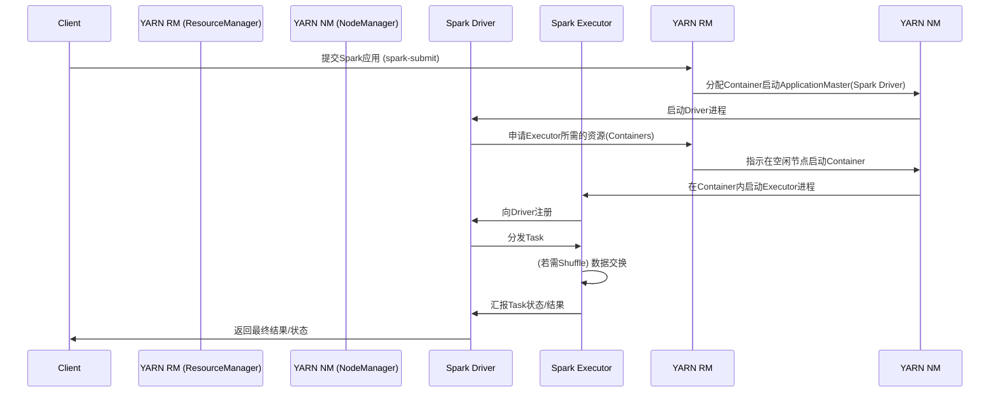
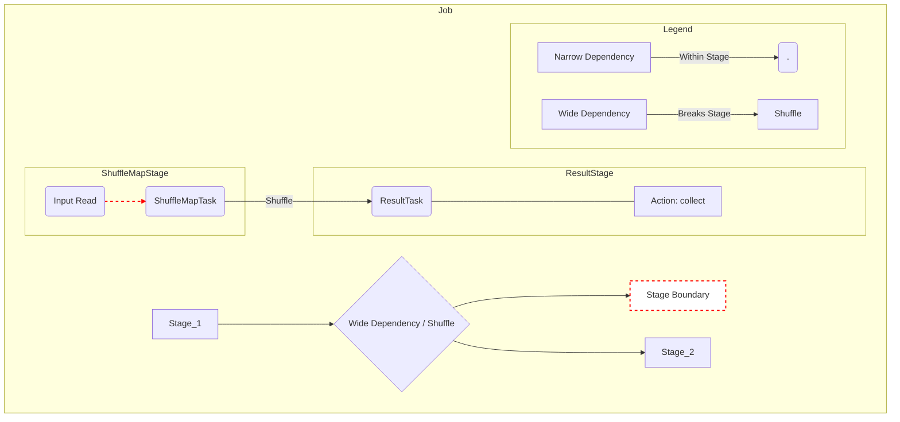

好的，作为大数据资深专家，我很乐意为您构思一本关于大数据内核原理与设计的书籍目录。这本书将面向有一定大数据基础的工程师、架构师和研究人员，深入探讨主流引擎的内部机制、设计哲学和实现权衡。

**书名：** 《大数据引擎内核：原理、设计与实现 - Spark、Flink、Presto深度解析与比较》

**副标题：** 洞悉分布式计算引擎的架构精髓与演进之路

**目标读者：**
*   大数据平台工程师、架构师
*   分布式系统研发工程师
*   对大数据引擎内部实现感兴趣的技术专家
*   相关领域的研究人员和学生

**核心特色：**
*   **深度优先：** 聚焦内核原理，而非API使用。
*   **对比视角：** 突出不同引擎在相似问题上的不同设计选择与权衡。
*   **设计驱动：** 强调设计哲学、架构演进和背后的思考。
*   **覆盖主流：** 以Spark、Flink、Presto为核心，辐射其他相关引擎。

---

## 目录

**前言 (Preface)**
*   大数据处理的挑战与演进
*   为什么需要理解引擎内核？
*   本书的定位、目标读者与内容结构
*   阅读建议

**第一部分：大数据处理引擎基础 (Foundations of Big Data Processing Engines)**

*   **第1章：分布式计算基石 (Fundamentals of Distributed Computing)**
    *   1.1 分布式系统核心概念 (CAP理论、一致性模型、共识协议简介)
    *   1.2 大数据处理模式演进 (MapReduce -> DAG -> MPP/Streaming)
    *   1.3 计算与存储分离架构趋势
    *   1.4 数据序列化与网络传输基础 (Kryo, Protobuf, Arrow等)
    *   1.5 资源管理与调度概览 (YARN, Kubernetes, Mesos)

*   **第2章：大数据引擎通用设计挑战 (Common Design Challenges)**
    *   2.1 可扩展性 (Scalability): 水平扩展与垂直扩展
    *   2.2 容错性 (Fault Tolerance): Checkpointing, Lineage, Task Retry
    *   2.3 性能优化 (Performance Optimization): I/O, Network, CPU, Memory
    *   2.4 数据模型与抽象 (Data Models & Abstractions): RDD, DataFrame, DataStream, RowSet
    *   2.5 状态管理 (State Management): 无状态 vs 有状态计算
    *   2.6 时间语义 (Time Semantics): 处理时间 vs 事件时间

**第二部分：Spark内核深度解析 (Deep Dive into Spark Kernel)**

*   **第3章：Spark架构与核心抽象 (Spark Architecture & Core Abstractions)**
    *   3.1 Spark整体架构 (Driver, Executor, Cluster Manager)
    *   3.2 RDD：弹性分布式数据集的设计与实现
    *   3.3 从RDD到DataFrame/Dataset：演进与优势
    *   3.4 Spark SQL与Catalyst优化器概览

*   **第4章：Spark作业执行流程 (Spark Job Execution Flow)**
    *   4.1 作业提交与逻辑计划生成
    *   4.2 Catalyst优化器：逻辑优化与物理计划生成 (Rule-based, Cost-based)
    *   4.3 DAG划分：Stage的切分原理 (宽依赖与窄依赖)
    *   4.4 Task的生成与调度 (DAGScheduler, TaskScheduler)
    *   4.5 作业执行与结果回传

*   **第5章：Spark调度系统详解 (Spark Scheduling System in Detail)**
    *   5.1 DAGScheduler：Stage提交与任务集管理
    *   5.2 TaskScheduler：资源分配与任务分发 (FIFO, Fair Scheduler)
    *   5.3 任务推测执行 (Speculative Execution)
    *   5.4 调度策略与资源管理集成 (Standalone, YARN, K8s)

*   **第6章：Spark内存管理机制 (Spark Memory Management)**
    *   6.1 统一内存管理模型 (Unified Memory Management)
    *   6.2 堆内内存 (On-Heap) vs 堆外内存 (Off-Heap)
    *   6.3 执行内存 (Execution Memory) 与存储内存 (Storage Memory)
    *   6.4 Tungsten项目：内存与CPU效率优化

*   **第7章：Spark Shuffle详解 (Understanding Spark Shuffle)**
    *   7.1 Shuffle的原理与必要性
    *   7.2 Hash Shuffle Writer vs Sort Shuffle Writer
    *   7.3 Shuffle Read 流程
    *   7.4 Shuffle优化：BypassMergeSort, Tungsten-Sort, External Shuffle Service

*   **第8章：Spark容错与Structured Streaming内核 (Fault Tolerance & Structured Streaming Kernel)**
    *   8.1 RDD Lineage与容错机制
    *   8.2 Structured Streaming：Micro-Batch模型原理
    *   8.3 State Management in Structured Streaming
    *   8.4 Checkpointing机制与端到端一致性保证

**第三部分：Flink内核深度解析 (Deep Dive into Flink Kernel)**

*   **第9章：Flink架构与核心概念 (Flink Architecture & Core Concepts)**
    *   9.1 Flink整体架构 (JobManager, TaskManager, Client)
    *   9.2 核心抽象：DataStream API 与 Table API/SQL
    *   9.3 Flink编程模型：算子(Operator)、流(Stream)、转换(Transformation)
    *   9.4 作业图：StreamGraph -> JobGraph -> ExecutionGraph

*   **第10章：Flink作业执行与调度 (Flink Job Execution & Scheduling)**
    *   10.1 作业提交与图转换过程
    *   10.2 分布式执行：Task、Subtask、Operator Chain
    *   10.3 资源管理与任务槽 (Task Slot)
    *   10.4 调度策略：Eager Scheduling, Lazy from Source, Slot Sharing
    *   10.5 反压机制 (Backpressure) 原理与实现

*   **第11章：Flink状态管理与容错 (Flink State Management & Fault Tolerance)**
    *   11.1 状态类型：Keyed State vs Operator State
    *   11.2 State Backend：Memory, FS, RocksDB 实现与选择
    *   11.3 Checkpointing机制：分布式快照算法 (Asynchronous Barrier Snapshotting)
    *   11.4 Savepoint机制：原理与应用
    *   11.5 一致性保证：Exactly-Once vs At-Least-Once

*   **第12章：Flink时间与窗口机制 (Flink Time & Windowing Mechanism)**
    *   12.1 时间语义：Event Time, Processing Time, Ingestion Time
    *   12.2 Watermark：原理、生成与传播
    *   12.3 窗口类型：滚动(Tumbling)、滑动(Sliding)、会话(Session)、全局(Global)
    *   12.4 窗口触发器 (Trigger) 与移除器 (Evictor)

*   **第13章：Flink网络与数据传输 (Flink Networking & Data Transfer)**
    *   13.1 网络栈：Netty基础
    *   13.2 数据序列化与网络缓冲管理 (Network Buffer)
    *   13.3 Task之间的数据传输模式 (Pipelined, Blocking)
    *   13.4 信用度控制机制 (Credit-based Flow Control)

*   **第14章：Flink批处理内核 (Flink Batch Processing Kernel)**
    *   14.1 批流统一：Batch as a Bounded Stream
    *   14.2 批处理执行模式的优化
    *   14.3 与Spark Batch的对比

**第四部分：Presto/Trino内核深度解析 (Deep Dive into Presto/Trino Kernel)**

*   **第15章：Presto/Trino架构与设计哲学 (Presto/Trino Architecture & Design Philosophy)**
    *   15.1 MPP (Massively Parallel Processing) 架构详解 (Coordinator, Worker)
    *   15.2 计算存储分离与Connector架构 (SPI)
    *   15.3 交互式查询引擎的设计目标
    *   15.4 Presto与Trino的渊源与差异

*   **第16章：Presto/Trino查询执行流程 (Presto/Trino Query Execution Flow)**
    *   16.1 查询解析与分析 (Parsing & Analysis)
    *   16.2 逻辑计划生成与优化 (Logical Planning & Optimization)
    *   16.3 物理计划生成：Stage划分与Task生成
    *   16.4 分布式执行调度 (Coordinator的作用)
    *   16.5 Pipelined Execution Model

*   **第17章：Presto/Trino优化器与调度 (Presto/Trino Optimizer & Scheduling)**
    *   17.1 规则优化 (Rule-Based Optimization)
    *   17.2 成本优化 (Cost-Based Optimization - CBO) 与统计信息
    *   17.3 谓词下推 (Predicate Pushdown) 与其他下推优化
    *   17.4 任务调度与资源管理 (Query Queuing, Resource Groups)

*   **第18章：Presto/Trino内存管理与数据交换 (Presto/Trino Memory Management & Data Exchange)**
    *   18.1 查询内存池管理 (User Memory, System Memory, Revocable Memory)
    *   18.2 分布式内存追踪
    *   18.3 Spill to Disk 机制 (可选)
    *   18.4 Worker间数据交换机制 (Exchange Operator)

*   **第19章：Presto/Trino Connector 机制 (Presto/Trino Connector Mechanism)**
    *   19.1 SPI (Service Provider Interface) 核心接口解析
    *   19.2 Metadata API, Data Location API, Data Source API
    *   19.3 主流Connector实现分析 (Hive, Kafka, RDBMS等)
    *   19.4 Connector开发实践要点

**第五部分：主流引擎设计比较与思考 (Comparison and Reflection on Mainstream Engines)**

*   **第20章：架构模型对比 (Architectural Model Comparison)**
    *   20.1 Master-Slave vs MPP vs Disaggregated
    *   20.2 计算抽象对比 (RDD/Dataset vs DataStream vs Operator Tree)
    *   20.3 部署模型差异 (Library vs Standalone Service)

*   **第21章：处理模型与执行机制对比 (Processing Model & Execution Mechanism Comparison)**
    *   21.1 Batch vs Micro-Batch vs True Streaming vs Interactive Query
    *   21.2 Lazy Evaluation vs Pipelined Execution
    *   21.3 DAG执行 vs Stage-based MPP执行

*   **第22章：调度与资源管理对比 (Scheduling & Resource Management Comparison)**
    *   22.1 调度粒度 (Stage vs Task vs Query Fragment)
    *   22.2 资源分配策略 (Slot vs Container vs Worker Core)
    *   22.3 与外部资源管理器集成方式

*   **第23章：内存管理与Shuffle对比 (Memory Management & Shuffle Comparison)**
    *   23.1 内存模型差异 (Unified vs Pool-based)
    *   23.2 On-Heap/Off-Heap 使用策略
    *   23.3 Shuffle实现机制与优化策略对比

*   **第24章：容错与状态管理对比 (Fault Tolerance & State Management Comparison)**
    *   24.1 容错机制 (Lineage vs Checkpointing vs Query Retry)
    *   24.2 一致性保证级别与实现
    *   24.3 状态后端支持与性能权衡 (针对流处理)

*   **第25章：优化器对比 (Optimizer Comparison)**
    *   25.1 Catalyst vs Flink Optimizer vs Presto Optimizer
    *   25.2 RBO vs CBO 的侧重与实现
    *   25.3 Runtime优化对比 (AQE vs Adaptive Scheduling)

*   **第26章：生态与适用场景 (Ecosystem & Use Cases)**
    *   26.1 各引擎生态系统概览
    *   26.2 典型适用场景分析与技术选型建议
    *   26.3 混合使用与平台化建设思路

**第六部分：其他主流引擎与未来趋势 (Other Engines & Future Trends)**

*   **第27章：其他代表性引擎简析 (Brief Analysis of Other Representative Engines)**
    *   27.1 MapReduce & Tez: 历史地位与设计影响
    *   27.2 Impala: 类Presto的MPP引擎对比
    *   27.3 ClickHouse: OLAP分析引擎的设计特点
    *   27.4 (可选) 新兴引擎简介 (如Doris, StarRocks等)

*   **第28章：大数据引擎的未来展望 (Future Trends in Big Data Engines)**
    *   28.1 云原生与Serverless化
    *   28.2 Lakehouse架构的兴起与挑战
    *   28.3 流批一体的深度融合
    *   28.4 AI for Systems: 智能化调优与管理
    *   28.5 硬件加速 (FPGA, GPU) 的应用

**结论 (Conclusion)**
*   核心设计哲学的总结与反思
*   技术演进的驱动力
*   对大数据从业者的建议

**附录 (Appendices)**
*   A: 关键术语表 (Glossary)
*   B: 主要配置参数解读 (Key Configuration Parameters)
*   C: 参考文献与推荐阅读 (References & Further Reading)

**致谢 (Acknowledgements)**

**索引 (Index)**

---

这个目录结构力求逻辑清晰，从基础到底层，从单个引擎到横向对比，最后展望未来。每个引擎部分都遵循相似的结构（架构、执行、调度、内存、网络/Shuffle、容错等），便于读者对比理解。重点放在"为什么这么设计"以及"不同设计带来的权衡"，符合资深专家的阅读需求。


---

# 第一部分：大数据处理引擎基础 (Foundations of Big Data Processing Engines)

欢迎进入大数据处理引擎的内核世界。在深入探索 Spark、Flink、Presto 等具体引擎的内部机制之前，我们需要建立一个坚实的理论基础。本部分将重点介绍分布式计算的基本原理、大数据处理模式的演变、常见的架构趋势以及大数据引擎设计中普遍面临的挑战。理解这些基础知识，将有助于我们更好地理解后续章节中各个引擎的设计选择和技术权衡。

## 第1章：分布式计算基石 (Fundamentals of Distributed Computing)

大数据处理本质上是分布式计算的一个重要应用领域。将庞大的数据集和复杂的计算任务分散到多台机器上进行处理，是应对数据爆炸式增长的必然选择。本章将介绍构建可靠、高效分布式系统的核心概念和技术。

### 1.1 分布式系统核心概念

*   **分布式系统定义：** 由多台独立计算机组成，这些计算机通过网络互相连接，协作完成共同的任务。用户感知到的通常是一个统一的整体，而非多台独立的机器。
*   **挑战：** 相比单机系统，分布式系统面临诸多挑战，包括节点故障、网络分区、消息延迟、数据一致性等。
*   **CAP理论：**
    *   **一致性 (Consistency):** 所有节点在同一时间看到的数据是相同的。这意味着任何写操作完成后，后续的读操作必须能返回最新的值。
    *   **可用性 (Availability):** 系统在任何时候都能对用户的请求做出响应（不保证数据最新）。即使部分节点故障，系统整体依然可用。
    *   **分区容错性 (Partition Tolerance):** 系统在遇到网络分区（节点间通信中断）时，仍能继续运行。
    *   **权衡：** CAP理论指出，任何分布式系统最多只能同时满足上述三个特性中的两个。在现代面向互联网的分布式系统中，网络分区是不可避免的，因此 P 通常是必须保证的。设计者需要在 C 和 A 之间做出权衡：选择强一致性（CP）可能牺牲部分可用性（如网络分区时，为保证一致性可能拒绝服务）；选择高可用性（AP）则可能牺牲强一致性（如网络分区时，节点可能返回旧数据）。大数据处理引擎通常根据场景需求在 C 和 A 之间进行不同程度的取舍，例如流处理的 Exactly-Once 通常追求 C，而一些批处理或交互式查询可能更偏向 A。
*   **一致性模型 (Consistency Models):**
    *   描述了分布式系统中数据读写操作的顺序和可见性规则。
    *   **强一致性 (Strong Consistency):** 最严格的模型，要求所有读操作都能立即看到最近完成的写操作结果，如同单机系统。实现成本高，性能开销大。
    *   **顺序一致性 (Sequential Consistency):** 所有进程看到的写操作顺序一致，但这个顺序不一定是实时的。
    *   **最终一致性 (Eventual Consistency):** 是 AP 系统常用的模型。系统保证如果没有新的更新，最终所有副本的数据会达到一致状态，但不保证实时性。在达到一致状态的过程中，读取可能返回旧值。许多 NoSQL 数据库和大数据系统采用此模型以获得高可用性和扩展性。
    *   **因果一致性 (Causal Consistency):** 比最终一致性更强，保证有因果关系的写操作（如写后读）的顺序被所有进程看到。
*   **共识协议 (Consensus Protocols):**
    *   用于在一组可能发生故障的节点之间就某个值或状态达成一致的协议。是实现强一致性的关键。
    *   **Paxos:** 经典的共识算法，理论上完备但理解和实现复杂。
    *   **Raft:** 以易于理解和实现为目标设计的共识算法，被广泛应用于 Etcd、Consul 等系统。包含 Leader Election, Log Replication, Safety 等机制。
    *   **ZooKeeper (ZAB - ZooKeeper Atomic Broadcast):** ZooKeeper 使用的协议，类似于 Paxos，常用于分布式协调服务，如 Master 选举、配置管理等。大数据生态系统（如 HDFS NameNode HA, Kafka Controller Election, Flink JobManager HA）广泛依赖 ZooKeeper 或类似机制实现高可用。

### 1.2 大数据处理模式演进

随着数据规模和处理需求的不断变化，大数据处理模式也经历了重要的演进：

*   **MapReduce (批处理鼻祖):**
    *   Google 提出的分布式计算模型，简化了大规模数据集的并行处理。
    *   核心思想：`Map` (映射/转换) 和 `Reduce` (规约/聚合)。
    *   优点：简单、容错性好（基于 HDFS）、易于扩展。
    *   缺点：
        *   **I/O密集：** 每个 MapReduce 作业的中间结果都需要写入磁盘（HDFS），导致延迟高。
        *   **表达能力有限：** 对于复杂的计算流程（如迭代计算、多阶段处理）需要串联多个 MapReduce 作业，效率低下。
        *   **编程模型僵化：** 开发者需要手动编写 Map 和 Reduce 函数。
    *   代表实现：Apache Hadoop MapReduce v1/v2。
*   **DAG (Directed Acyclic Graph) 模型 (通用批处理):**
    *   **动机：** 克服 MapReduce 的局限性，支持更复杂的计算流程，并优化执行效率。
    *   **核心思想：** 将计算任务表示为一个有向无环图（DAG）。图中的节点代表计算操作（算子），边代表数据流向。
    *   **优势：**
        *   **灵活的表达能力：** 可以表示任意复杂的、多阶段的计算流程。
        *   **优化空间大：** 引擎可以对整个 DAG 进行全局优化（如流水线执行、算子融合）。
        *   **中间结果内存化：** 允许将 Stage 之间的中间结果缓存在内存中，显著减少磁盘 I/O，提高性能（如 Spark 的核心优势之一）。
    *   代表引擎：Apache Spark, Apache Tez (作为 Hive/Pig 的执行引擎)。
*   **MPP (Massively Parallel Processing) / 交互式查询:**
    *   **目标：** 提供低延迟的 SQL 查询能力，支持对大规模数据的即席分析（Ad-hoc Analysis）。
    *   **架构特点：** 通常采用无共享 (Shared-Nothing) 架构，每个节点独立处理一部分数据。查询被分解成多个片段（Fragment）并行执行。
    *   **执行模型：** 通常采用 Pipelined (流水线) 执行，数据在节点间直接流式传输，避免像 MapReduce 那样将中间结果完全物化到磁盘。
    *   **优化重点：** 查询优化（CBO/RBO）、列式存储、向量化执行、内存计算。
    *   代表引擎：Presto/Trino, ClickHouse, Impala, Greenplum。
*   **Streaming (流处理):**
    *   **目标：** 处理持续不断的、无边界的数据流，实现低延迟的实时计算。
    *   **核心挑战：** 状态管理、时间语义（事件时间处理）、容错与一致性保证 (Exactly-Once)。
    *   **处理模型：**
        *   **Native Streaming (逐条处理):** Flink 采用的核心模型，数据记录到达后立即处理，延迟最低。
        *   **Micro-Batching (微批处理):** Spark Structured Streaming 采用的模型，将数据流切分成非常小的批次进行处理，兼顾吞吐量和延迟。
    *   代表引擎：Apache Flink, Apache Spark Structured Streaming, Apache Kafka Streams, Apache Storm。

### 1.3 计算与存储分离架构趋势

这是现代大数据平台架构的一个重要趋势，对引擎的设计产生了深远影响。

*   **传统架构 (计算存储耦合):** 以早期 Hadoop MapReduce + HDFS 为代表。计算节点通常也承担数据存储节点的角色。
    *   **优点：** 数据本地性（Data Locality）好，计算任务可以调度到数据所在的节点执行，减少网络传输。
    *   **缺点：**
        *   **资源利用率低：** 计算资源和存储资源的需求往往不匹配，导致资源浪费（例如，存储密集型任务需要大量磁盘但 CPU 空闲，反之亦然）。
        *   **扩展性受限：** 计算和存储需要同时扩展，不够灵活。
        *   **运维复杂：** 集群升级、维护、扩缩容都比较复杂。
*   **计算存储分离架构:**
    *   **核心思想：** 将计算集群和存储系统独立部署、独立扩展。计算引擎从远程的、独立的存储系统（如对象存储 S3、阿里云 OSS、HDFS 集群、数据湖存储 Delta Lake/Hudi/Iceberg 等）读取数据进行处理。
    *   **优点：**
        *   **弹性伸缩：** 计算和存储可以根据实际需求独立、弹性地扩展或缩减，更符合云环境的特性。
        *   **资源优化：** 按需分配资源，提高利用率，降低成本。
        *   **灵活性：** 可以方便地接入多种不同的存储系统；多个不同的计算引擎可以共享同一份数据。
        *   **运维简化：** 计算和存储的生命周期管理分离。
    *   **挑战：**
        *   **数据本地性减弱：** 数据需要通过网络传输到计算节点，可能引入更高的网络 I/O 开销和延迟。
        *   **性能优化：** 需要引擎具备更强的网络 I/O 处理能力、缓存机制（如 Alluxio 等）以及数据格式优化（如 Parquet, ORC）来缓解远程读取的性能影响。
    *   **趋势：** 云原生大数据平台、数据湖架构广泛采用计算存储分离。Spark、Flink、Presto 都很好地支持了这种架构。

### 1.4 数据序列化与网络传输基础

在分布式计算中，数据需要在不同节点之间进行传输（如 Shuffle 过程、任务分发、结果回传），也需要持久化存储（如 Checkpoint、状态）。数据序列化和网络传输的效率直接影响引擎的整体性能。

*   **序列化 (Serialization):** 将内存中的数据对象转换为字节流的过程，以便于网络传输或持久化存储。反序列化 (Deserialization) 则是将字节流恢复为内存对象的过程。
*   **序列化框架选择的考量因素:**
    *   **速度 (Speed):** 序列化和反序列化的速度。
    *   **空间 (Space):** 序列化后字节流的大小。
    *   **易用性 (Ease of Use):** API 是否友好。
    *   **跨语言支持 (Cross-language Support):** 是否支持不同编程语言间的数据交换。
    *   **Schema 演进支持 (Schema Evolution):** 当数据结构发生变化时，能否兼容旧数据。
*   **常见序列化框架:**
    *   **Java Serialization:** Java 内置，易用但性能和空间效率较差，存在安全风险。
    *   **Kryo:** 高性能的 Java 序列化库，速度快，序列化后体积小。Spark 和 Flink 广泛使用 Kryo 作为默认或推荐的序列化方式。缺点是线程不安全，需要池化使用。
    *   **Protobuf (Protocol Buffers):** Google 开发的，语言无关、平台无关、可扩展的序列化结构数据的方法。定义好 `.proto` 文件后生成代码。性能好，空间效率高，跨语言支持好，Schema 演进能力强。常用于 RPC 和持久化。
    *   **Avro:** Hadoop 生态系统常用的数据序列化系统。设计目标是支持丰富的数据结构和模式演进。自带 Schema，序列化数据紧凑。
    *   **Apache Arrow:** 专注于 **内存中列式数据** 的标准和库。旨在加速分析工作负载，减少不同系统（如 Spark、Pandas、Impala）之间数据传输的序列化/反序列化开销。通过共享内存格式，可以实现零拷贝数据读取。Presto、Spark 等引擎都在积极集成 Arrow 以提升性能，尤其是在 Python UDF 等场景。
*   **网络传输:**
    *   **网络库：** 大数据引擎通常依赖底层的高性能网络库进行节点间通信。
        *   **Netty:** 一个异步事件驱动的网络应用程序框架，用于快速开发可维护的高性能协议服务器和客户端。Spark 和 Flink 的网络层都基于 Netty 构建。
    *   **传输协议：** 通常基于 TCP/IP。一些场景下也可能探索 RDMA (Remote Direct Memory Access) 等技术以追求更低延迟。
    *   **数据传输优化：**
        *   **缓冲管理 (Buffer Management):** 高效的内存缓冲池管理，减少内存分配和拷贝开销。Flink 的网络缓冲管理机制是其高性能的关键之一。
        *   **零拷贝 (Zero-copy):** 利用操作系统特性（如 `sendfile`, `mmap`）减少数据在内核空间和用户空间之间的拷贝次数。
        *   **数据压缩 (Data Compression):** 在网络传输前对数据进行压缩（如 Snappy, LZ4, Zstd），减少网络带宽消耗，但会增加 CPU 开销。需要在 CPU 和带宽之间权衡。

### 1.5 资源管理与调度概览

大数据引擎运行在集群之上，需要与资源管理器协作，获取计算所需的资源（CPU、内存、磁盘等），并将计算任务调度到这些资源上执行。

*   **资源管理器 (Cluster Resource Manager):** 负责整个集群资源的统一管理和分配。
    *   **Apache Hadoop YARN (Yet Another Resource Negotiator):** Hadoop 2.x 引入的通用资源管理系统。将 JobTracker 的资源管理和作业调度功能分离。包含 ResourceManager (全局资源管理器) 和 NodeManager (节点资源管理器)。Spark, Flink, MapReduce 等都可以运行在 YARN 之上。是企业内部署最常见的资源管理器之一。
    *   **Kubernetes (K8s):** 最初为容器编排设计，但已成为通用的分布式应用部署和管理平台。大数据引擎（Spark, Flink, Presto 等）越来越多地提供对 Kubernetes 的原生支持。允许将大数据作业作为 K8s Pod 运行，利用 K8s 的弹性伸缩、服务发现、滚动更新等能力。是云原生环境下的主流选择。
    *   **Apache Mesos:** 另一个通用的集群资源管理器，采用两级调度架构。曾在大规模集群（如 Twitter）中有广泛应用，但近年来 Kubernetes 的势头更猛。
    *   **Standalone Mode:** 一些引擎（如 Spark, Flink）也提供独立的集群模式，自带简单的 Master/Worker 资源管理和调度功能，适用于测试或特定部署场景。
*   **应用调度器 (Application Scheduler):** 引擎内部负责将作业逻辑（如 DAG, JobGraph）映射到具体资源上的任务，并进行调度执行的组件。
    *   **YARN 模式下的调度：** 应用（如 Spark Driver, Flink JobManager）首先向 YARN ResourceManager 申请资源（Containers），获取到资源后，再由应用内部的调度器（如 Spark TaskScheduler, Flink Scheduler）将 Task 分配到这些 Container 中执行。
    *   **Kubernetes 模式下的调度：** 应用 Master (如 Spark Driver, Flink JobManager) 通过 K8s API 创建 Worker Pods，K8s Scheduler 负责将这些 Pods 调度到合适的 K8s Node 上。应用内部调度器再将 Task 分配到这些 Pods 中执行。
*   **调度策略：** 资源管理器和应用调度器通常支持不同的调度策略，以满足多租户、公平性、优先级等需求。
    *   **FIFO (First-In, First-Out):** 先提交的作业先获得资源。简单但可能导致大作业阻塞小作业。
    *   **Fair Scheduler (公平调度):** 尝试为所有运行中的作业公平地分配资源。通常基于用户或队列进行资源划分。YARN 和 Spark 都支持公平调度。
    *   **Capacity Scheduler (容量调度):** YARN 的另一种调度器，将集群资源划分为多个队列，每个队列分配一定的容量，支持优先级和资源抢占。

理解这些分布式计算的基石，对于深入把握 Spark、Flink、Presto 等引擎如何构建其核心功能至关重要。下一章我们将探讨这些引擎在设计中普遍面临的挑战。

## 第2章：大数据引擎通用设计挑战 (Common Design Challenges)

在构建任何一个大数据处理引擎时，无论是批处理、流处理还是交互式查询引擎，设计者都需要面对一系列共同的、基础性的挑战。如何有效地应对这些挑战，直接决定了引擎的性能、可靠性、可扩展性和易用性。本章将探讨这些核心的设计挑战。

### 2.1 可扩展性 (Scalability)

随着数据量和计算复杂度的增长，引擎必须能够有效地利用更多资源来提升处理能力或处理更大规模的数据。

*   **水平扩展 (Horizontal Scaling / Scale Out):** 通过增加更多的机器（节点）来扩展系统的能力。这是分布式系统最主要的扩展方式。
    *   **优势：** 潜力巨大，可以通过增加普通商用硬件线性提升性能（理想情况下）；成本相对较低。
    *   **挑战：** 需要精心设计的分布式算法和架构来协调众多节点；节点增加可能带来更高的通信开销和管理复杂性；需要解决单点瓶颈问题（如 Master 节点的扩展性）。
    *   **大数据引擎实践：** Spark、Flink、Presto 等都设计为可水平扩展的架构，其 Worker/Executor/TaskManager 节点都可以动态增减。
*   **垂直扩展 (Vertical Scaling / Scale Up):** 通过增加单台机器的资源（如更多 CPU 核、更大内存、更快的磁盘/网络）来提升性能。
    *   **优势：** 相对简单，不需要改变分布式协调逻辑。
    *   **缺点：** 单机硬件资源存在物理上限；高端硬件成本昂贵，性价比可能不如水平扩展。
    *   **大数据引擎实践：** 虽然主要依赖水平扩展，但单个节点（如 Spark Executor, Flink TaskManager）的配置（内存、CPU 核数）也需要合理设置，属于垂直扩展的范畴。优化单节点性能（如 Tungsten, RocksDB 调优）也是提升整体性能的重要手段。
*   **弹性 (Elasticity):** 指系统根据负载变化自动调整资源规模的能力。云原生环境下尤其重要。引擎需要与资源管理器（如 K8s HPA/VPA, YARN Dynamic Allocation）配合，实现 Worker/Executor/TaskManager 数量的动态伸缩。流处理引擎的弹性伸缩尤其具有挑战性，需要考虑状态的迁移和一致性。

### 2.2 容错性 (Fault Tolerance)

在由大量廉价商用机构成的集群中，节点故障、网络中断是常态而非例外。引擎必须具备容错能力，确保在部分组件失效时，计算任务仍能最终成功完成，并保证结果的正确性。

*   **故障检测 (Failure Detection):** 需要机制来检测节点或进程是否发生故障。常用的方式是心跳机制（Heartbeat）。
*   **故障恢复策略:**
    *   **任务重试 (Task Retry):** 当某个 Task 失败时，调度器在另一个健康的节点上重新启动该 Task。这是最基本的容错方式。
        *   **挑战：** 需要确保 Task 的执行是幂等的（Idempotent），即多次执行产生相同的结果。对于有副作用的操作需要特别处理。需要管理重试次数，避免无限重试。
    *   **基于血缘的重计算 (Lineage-based Recomputation):** 以 Spark RDD 为代表。RDD 记录了其计算依赖关系（血缘图 Lineage）。当某个 RDD 分区的数据丢失（如 Executor 故障），可以通过血缘关系从上游 RDD 重新计算得到丢失的数据。
        *   **优点：** 对于无状态或转换类操作非常有效，无需存储大量中间数据。
        *   **缺点：** 恢复时间可能较长，尤其是在计算链条很长的情况下。对于 Shuffle 等宽依赖操作，可能需要重算上游多个 Stage。
    *   **检查点/快照 (Checkpointing / Snapshotting):** 以 Flink 为代表，广泛用于流处理和有状态计算。定期将计算任务的 **一致性状态** (包括算子状态、数据源偏移量等) 持久化到可靠存储（如 HDFS, S3）。当发生故障时，从最近一次成功的 Checkpoint 恢复所有任务的状态，并从对应的数据源位置重新消费数据。
        *   **优点：** 恢复速度通常比完全重计算快；能够保证有状态计算的 Exactly-Once 或 At-Least-Once 语义。
        *   **缺点：** Checkpoint 操作本身会带来一定的开销（状态持久化、Barrier 对齐等）；需要可靠的外部存储。
    *   **查询重试 (Query Retry):** 对于 Presto 等交互式查询引擎，如果查询执行过程中部分 Worker 失败，Coordinator 可能会中止整个查询并要求用户重新提交，或者尝试只重试失败的 Task/Stage（取决于具体实现和故障类型）。由于查询通常是短时的，完全重试是常见的策略。
*   **高可用 (High Availability - HA):** 除了 Worker 节点的容错，Master 节点（如 Spark Driver, Flink JobManager, Presto Coordinator）的单点故障问题也需要解决。通常采用 Active-Standby 模式，利用 ZooKeeper 或 Etcd 等进行 Leader 选举和状态同步，实现 Master 节点的自动故障切换。

### 2.3 性能优化 (Performance Optimization)

性能是大数据引擎永恒的追求。优化涉及硬件利用率、算法效率、数据处理方式等多个层面。

*   **I/O 优化:**
    *   **磁盘 I/O:**
        *   **顺序读写 vs 随机读写:** 磁盘顺序读写远快于随机读写。引擎设计应尽量避免随机 I/O。
        *   **缓存 (Caching):** 将热数据缓存在内存中（如 Spark RDD Cache/Persist, Flink 分布式缓存），减少磁盘访问。
        *   **数据压缩 (Compression):** 减少磁盘空间占用和 I/O 带宽，但增加 CPU 负担。
        *   **列式存储 (Columnar Storage):** 如 Parquet, ORC。对于分析型查询，只需读取所需的列，极大减少 I/O 量。支持下推优化（谓词下推、投影下推）。
    *   **网络 I/O:**
        *   **数据序列化效率:** 选择高效的序列化库（Kryo, Protobuf, Avro）。
        *   **Shuffle 优化:** Shuffle 是网络 I/O 的主要瓶颈之一。优化包括减少 Shuffle 数据量（如 Map 端聚合）、优化数据传输方式（如 Netty, RDMA）、使用 External Shuffle Service 避免 Executor 故障影响等。
        *   **数据本地性 (Data Locality):** 尽量将计算调度到数据所在的节点，减少网络传输。在计算存储分离架构下，需要通过缓存、预取等方式缓解。
*   **CPU 优化:**
    *   **代码生成 (Code Generation):** 如 Spark Tungsten 和 Flink Table API/SQL。将用户逻辑（如 SQL 查询、DataFrame 操作）在运行时动态编译成高效的 Java 字节码，减少虚函数调用、利用 CPU 寄存器、消除中间数据结构，提升 CPU 执行效率。
    *   **向量化执行 (Vectorized Execution):** 如 Presto、Spark (with Arrow/Columnar)。一次处理一批数据（一个向量/列块），而不是逐条处理。利用 CPU 的 SIMD (Single Instruction, Multiple Data) 指令，减少指令分支和函数调用开销，提高 Cache 命中率。
    *   **算子融合 (Operator Fusion):** 将多个可以串行执行的算子（如 map -> filter）融合在一个 Task 内部执行，避免数据的序列化/反序列化和网络传输开销。Flink 的 Operator Chaining 是典型的例子。
*   **内存优化:**
    *   **内存管理模型:** 高效的内存分配、回收机制。避免频繁的 GC (Garbage Collection) 暂停。
    *   **堆外内存 (Off-Heap Memory):** 直接在 JVM 堆外分配和管理内存。优点是：减少 GC 压力；可以存储更大的数据量；方便实现零拷贝等操作。缺点是：需要手动管理内存分配和释放，容易出错。Spark Tungsten 和 Flink 的网络缓冲、状态后端 (RocksDB) 都大量使用了堆外内存。
    *   **内存数据结构:** 使用更紧凑、CPU 缓存友好的数据结构，如 Tungsten UnsafeRow。
    *   **内存池 (Memory Pooling):** 重用内存对象（如网络缓冲区），减少分配和 GC 开销。

### 2.4 数据模型与抽象 (Data Models & Abstractions)

引擎需要提供简洁、强大、易于使用的数据模型和编程接口，让用户能够方便地表达复杂的计算逻辑，同时隐藏底层的分布式细节。

*   **模型选择:**
    *   **结构化 (Structured):** 类 SQL 接口，数据有明确的 Schema。如 DataFrame (Spark), Table (Flink), RowSet (Presto)。易于优化（基于 Schema 和 SQL 语义），用户学习成本低。
    *   **半结构化/非结构化 (Semi-structured / Unstructured):** 如 RDD (Spark), DataStream (Flink)。提供更灵活的编程接口（函数式 API），可以处理任意类型的数据。优化相对困难，需要用户编写高效的代码。
*   **核心抽象:**
    *   **RDD (Resilient Distributed Dataset - Spark):** 不可变的、分区的、可并行操作的数据集合。核心特性是血缘关系（Lineage）用于容错。提供丰富的转换（map, filter, groupBy）和动作（count, collect, save）算子。
    *   **DataFrame/Dataset (Spark):** 在 RDD 基础上增加了 Schema 信息，提供类 SQL 的、类型安全的 API。可以利用 Catalyst 优化器进行深度优化。Dataset 是类型安全的 DataFrame。
    *   **DataStream (Flink):** 表示持续不断的、可能无限的数据流。提供流式转换算子，支持状态管理和时间窗口。
    *   **Table (Flink):** Flink 的结构化数据抽象，提供关系型（类 SQL）接口，统一了流处理和批处理的 API。
    *   **RowSet / Page (Presto):** Presto 内部处理数据的基本单元，通常是按列组织的、包含多行数据的数据块 (Page)。面向列式、向量化处理设计。
*   **API 设计:**
    *   **声明式 (Declarative) vs 命令式 (Imperative):**
        *   **声明式:** 用户只描述"做什么"（如 SQL），引擎负责决定"怎么做"。优化空间大。DataFrame/Table API/SQL 属于此类。
        *   **命令式:** 用户需要明确指定计算的步骤和流程。如 RDD API, DataStream API。更灵活，但优化依赖用户。
    *   **语言绑定:** 支持多种编程语言（Java, Scala, Python, R, SQL）可以扩大用户群体。

### 2.5 状态管理 (State Management)

对于流处理和一些复杂的批处理（如图计算、机器学习迭代），引擎需要能够管理计算过程中的状态。

*   **无状态计算 (Stateless Computation):** 每个输入事件/记录的处理独立于其他事件/记录，不依赖历史状态。如简单的 `map`, `filter`。易于并行化和容错。
*   **有状态计算 (Stateful Computation):** 当前事件/记录的处理依赖于之前处理过的数据所积累的状态。如 `count`, `sum`, `window aggregation`, 复杂的事件处理 (CEP)。
*   **状态管理的挑战:**
    *   **存储 (Storage):** 状态可能非常大，需要高效的存储机制。
        *   **内存 (Memory):** 速度快，但容量有限，易丢失。
        *   **外部存储 (External Storage):** 如 HDFS, S3, 本地磁盘 (配合 RocksDB)。容量大，可靠性高，但访问速度慢。
    *   **一致性 (Consistency):** 在分布式环境下，尤其是有故障发生时，如何保证状态的一致性？（与容错机制 Checkpointing 紧密相关）
    *   **访问效率 (Access Efficiency):** 如何快速地读取和更新状态？
    *   **扩展性 (Scalability):** 当状态空间变得巨大时，如何水平扩展状态存储和访问能力？（如 Flink 的 Keyed State）
*   **Flink 的状态管理:** 是其核心优势之一。
    *   **Keyed State:** 与 Key 相关联的状态，分布在不同的 TaskManager 上。
    *   **Operator State:** 每个算子实例维护的状态。
    *   **State Backends:** 提供不同的状态存储实现（Memory, FS, RocksDB），用户可以根据需求选择。RocksDB 支持将状态存储在本地磁盘，允许状态大小超过内存限制。

### 2.6 时间语义 (Time Semantics)

在流处理中，如何定义和处理"时间"至关重要，直接影响计算结果的准确性和业务逻辑的实现。

*   **处理时间 (Processing Time):** 事件/记录被处理节点 **系统时钟** 处理的时间。
    *   **优点：** 实现简单，无需协调。
    *   **缺点：** 结果不确定，受系统负载、网络延迟等因素影响。同一事件在不同运行环境下或重放时可能得到不同结果。适用于对实时性要求极高但对精确性要求不高的场景。
*   **事件时间 (Event Time):** 事件/记录 **实际发生** 的时间，通常嵌入在数据本身中。
    *   **优点：** 结果具有确定性和可重现性，不受处理延迟影响，符合业务逻辑的直觉。
    *   **缺点：** 实现复杂，需要处理事件乱序（Out-of-Order）、延迟到达等问题。需要 Watermark 机制来追踪事件时间的进展并触发计算。
*   **摄入时间 (Ingestion Time):** 事件/记录 **进入** Flink/Spark Streaming 系统的时间（Source Operator 读取到数据的时间）。是处理时间和事件时间的一种折中。
*   **Watermark (水位线):** 在事件时间模式下，表示"小于该时间戳的事件应该都已经到达"的一种逻辑时钟。用于触发窗口计算等基于事件时间的操作。Watermark 的生成和传播是事件时间处理的关键。

以上这些通用设计挑战贯穿于 Spark、Flink、Presto 等引擎的架构设计和功能实现中。理解这些挑战以及不同引擎的应对策略，是深入理解其内核原理的关键一步。在接下来的部分，我们将逐一深入这些主流引擎的内部世界。

# 第二部分：Spark内核深度解析 (Deep Dive into Spark Kernel)

在第一部分奠定了分布式计算和大数据引擎设计的基础之后，我们将目光投向当今最流行和广泛使用的批处理与（微批）流处理引擎之一：Apache Spark。Spark 以其内存计算能力、通用性（支持 SQL、流处理、机器学习、图计算）和相对易用的 API 而闻名。本部分将深入剖析 Spark 的内核机制，从其基础架构、核心数据抽象 RDD，到更高级的 DataFrame/Dataset，再到作业执行流程、调度、内存管理、Shuffle 以及容错等关键环节。理解 Spark 的内部工作原理，有助于我们更高效地使用它，并为后续与其他引擎（如 Flink, Presto）的对比打下基础。

## 第3章：Spark架构与核心抽象 (Spark Architecture & Core Abstractions)

本章作为深入 Spark 内核的第一站，将重点介绍 Spark 运行时的整体架构，厘清 Driver、Executor 和 Cluster Manager 之间的关系与职责。接着，我们将详细探讨 Spark 最核心、最基础的数据抽象——RDD（弹性分布式数据集），理解其设计理念和关键特性。最后，我们将探讨从 RDD 到 DataFrame/Dataset 的演进过程，分析这一演进带来的优势，并简要介绍 Spark SQL 及其强大的 Catalyst 优化器。

### 3.1 Spark整体架构 (Driver, Executor, Cluster Manager)

Spark 应用程序的运行依赖于一个主从（Master-Slave）架构，主要由三个核心组件构成：Driver、Executor 和 Cluster Manager。理解这三者的角色和交互方式是理解 Spark 如何执行分布式任务的基础。

*   **Driver (驱动程序):**
    *   **角色:** Spark 应用程序的"大脑"和入口点。它负责运行应用程序的 `main` 函数，创建 `SparkContext`（或 `SparkSession`，是 `SparkContext` 的封装和扩展）。
    *   **职责:**
        *   **解析用户代码:** 将用户编写的 Spark 操作（如 `map`, `filter`, `reduceByKey` 等）转化为逻辑执行计划 (DAG)。
        *   **优化执行计划:** 对 DAG 进行优化。
        *   **任务划分与调度:** 将优化后的 DAG 划分成多个阶段 (Stage)，每个阶段包含一组任务 (Task)。然后，Driver 将这些 Task 分发给 Executor 执行。
        *   **协调 Executor:** 跟踪 Task 的执行状态，处理失败重试。
        *   **与 Cluster Manager 交互:** 向 Cluster Manager 申请 Executor 运行所需的资源。
    *   **位置:** Driver 进程可以运行在客户端机器上（`client` 模式），也可以由 Cluster Manager 在集群内部启动（`cluster` 模式）。

*   **Executor (执行器):**
    *   **角色:** 分布在集群各个工作节点 (Worker Node) 上的工作进程。每个 Spark 应用都拥有一组独立的 Executor 进程。
    *   **职责:**
        *   **执行任务 (Task):** 接收来自 Driver 的 Task，并在其 JVM 内部执行计算。
        *   **数据存储:** 缓存 RDD 分区数据（`cache()` 或 `persist()` 操作）。Executor 负责管理其分配到的内存、磁盘资源。
        *   **与 Driver 通信:** 向 Driver 汇报 Task 的执行状态和结果。
        *   **Executor 间通信:** 在需要 Shuffle 操作时，Executor 之间会进行数据传输。
    *   **生命周期:** Executor 的启动和销毁由 Driver 通过 Cluster Manager 进行管理。

*   **Cluster Manager (集群管理器):**
    *   **角色:** 外部资源管理服务，负责为 Spark 应用程序分配集群资源（CPU、内存等）。
    *   **职责:**
        *   **资源分配:** 接收 Driver 的资源申请请求，在集群的 Worker Node 上为应用程序分配 Container (YARN) 或启动 Executor Pod (Kubernetes)。
        *   **监控 Worker Node:** 跟踪集群中 Worker Node 的状态。
    *   **类型:** Spark 支持多种 Cluster Manager：
        *   **Standalone:** Spark 自带的简单集群管理器，易于部署，适合测试或特定环境。
        *   **Apache Hadoop YARN:** 最常用的集群管理器，与 Hadoop 生态紧密集成。
        *   **Apache Mesos:** 另一个通用的集群管理器（相对少用）。
        *   **Kubernetes (K8s):** 云原生环境下的主流选择，提供更好的弹性和容器化管理能力。

**交互流程示意 (以 YARN 为例):**



上图简要展示了 Spark 应用在 YARN 上的提交流程。Driver 首先被启动，然后向 YARN 申请资源来启动 Executor。一旦 Executor 启动并向 Driver 注册，Driver 就可以开始分发任务，协调整个应用程序的执行。

### 3.2 RDD：弹性分布式数据集的设计与实现

RDD (Resilient Distributed Dataset) 是 Spark 1.x 时代的核心抽象，也是理解 Spark 分布式计算模型的基础。虽然现在 DataFrame/Dataset API 更为常用，但它们底层仍然是基于 RDD 实现的。

*   **定义:** RDD 是一个 **不可变的 (Immutable)**、**分区的 (Partitioned)**、可 **并行操作 (Parallelizable)** 的分布式数据集合。
*   **核心特性:**
    *   **分区 (Partitioning):** RDD 中的数据被划分为多个分区 (Partitions)，每个分区可以在集群的不同节点上独立计算。分区是 Spark 并行计算的基本单位。用户可以控制 RDD 的分区方式（如 Hash Partitioning, Range Partitioning）。
    *   **不可变性 (Immutability):** RDD 一旦创建就不能被修改。对 RDD 的任何转换操作（Transformation）都会生成一个新的 RDD。这种设计简化了数据一致性和容错处理。
    *   **血缘关系 (Lineage):** 每个 RDD 都记录了它是如何从其他 RDD 转换而来的依赖关系。这个依赖关系图被称为 RDD 的血缘 (Lineage)。当某个 RDD 分区的数据丢失时，Spark 可以根据血缘关系重新计算该分区，从而实现容错。
    *   **惰性求值 (Lazy Evaluation):** 对 RDD 的转换操作（如 `map`, `filter`）并不会立即执行。Spark 会记录下这些转换操作，构建一个 DAG。只有当遇到一个行动操作 (Action)（如 `count`, `collect`, `save`）时，Spark 才会真正触发计算，根据 DAG 将计算任务分发到集群执行。这使得 Spark 可以进行优化，例如将多个转换操作流水线化执行。
    *   **可控制的持久化 (Controllable Persistence):** 用户可以调用 `persist()` 或 `cache()` 方法，将 RDD 的分区数据显式地缓存在内存、磁盘或堆外内存中。这对于需要被多次访问的 RDD 非常有用，可以避免重复计算，显著提高性能。
*   **操作类型:**
    *   **转换 (Transformations):** 从一个已有的 RDD 生成一个新的 RDD。例如 `map()`, `filter()`, `flatMap()`, `groupByKey()`, `reduceByKey()`, `join()`。转换操作是惰性的。
        *   **窄依赖 (Narrow Dependency):** 父 RDD 的每个分区最多只被子 RDD 的一个分区所依赖（如 `map`, `filter`）。窄依赖允许在同一个节点上进行流水线 (Pipelined) 执行，无需数据混洗 (Shuffle)。
        *   **宽依赖 (Wide Dependency / Shuffle Dependency):** 子 RDD 的一个分区可能依赖于父 RDD 的所有分区（如 `groupByKey`, `reduceByKey`, `join`）。宽依赖通常需要在节点间进行数据 Shuffle，开销较大。宽依赖也是划分 Stage 的依据。
    *   **行动 (Actions):** 触发实际计算，并将结果返回给 Driver 程序或写入外部存储。例如 `count()`, `collect()`, `first()`, `take()`, `saveAsTextFile()`。
*   **简单示例:**

```python
# 假设 spark 是一个 SparkSession 对象
# 创建 RDD
lines = spark.sparkContext.textFile("hdfs://path/to/your/file.txt")

# 转换操作 (惰性)
wordCounts = lines.flatMap(lambda line: line.split(" ")) \
                  .map(lambda word: (word, 1)) \
                  .reduceByKey(lambda a, b: a + b)

# 行动操作 (触发计算)
results = wordCounts.collect() # 将结果收集到 Driver

# 打印结果
for word, count in results:
    print(f"{word}: {count}")

# 另一个行动操作 (写入 HDFS)
# wordCounts.saveAsTextFile("hdfs://path/to/output")
```

在这个例子中，`textFile`, `flatMap`, `map`, `reduceByKey` 都是转换操作，它们定义了 RDD 之间的血缘关系并构建了 DAG。`collect` 是一个行动操作，它触发了从读取文件到计算词频的整个流程。

RDD 的设计巧妙地结合了分区、不可变性、血缘和惰性求值，提供了一种高效且容错的分布式数据处理模型。

### 3.3 从RDD到DataFrame/Dataset：演进与优势

虽然 RDD 功能强大且灵活，但在某些方面也存在不足：

*   **缺乏 Schema 信息:** RDD API 通常操作的是原始的 Java/Scala/Python 对象，Spark 本身不了解数据的内部结构。这限制了优化空间（如列裁剪、谓词下推无法自动应用）。
*   **性能:** 对 JVM 对象的操作涉及较多的序列化/反序列化开销和 GC 压力，尤其是在 Python 中。
*   **易用性:** 对于习惯 SQL 或关系型数据库的用户，RDD 的函数式 API 可能不够直观。

为了解决这些问题，Spark 引入了更高级的抽象：DataFrame 和 Dataset。

*   **DataFrame:**
    *   **概念:** 一个分布式的数据集合，其数据被组织成 **带命名的列 (Named Columns)**，类似于关系型数据库中的表或 R/Python 中的 DataFrame。
    *   **起源:** 最初作为 Spark SQL 的一部分引入。
    *   **特点:**
        *   **携带 Schema:** DataFrame 拥有 Schema 信息，明确了每列的名称和数据类型。
        *   **优化:** Spark 可以利用 Schema 信息和代表计算逻辑的表达式树，通过 **Catalyst 优化器** 进行深入的优化（逻辑优化、物理计划生成、代码生成）。
        *   **多种数据源:** 可以轻松地从多种结构化数据源（如 JSON, Parquet, JDBC, Hive 表）创建 DataFrame。
        *   **跨语言:** 提供了统一的 API，在 Scala, Java, Python, R 中表现一致。
    *   **API:** 提供了一套丰富的领域特定语言 (DSL) 来操作数据，如 `select()`, `filter()`, `groupBy()`, `agg()`, `join()` 等，也支持直接执行 SQL 查询。
    *   **内部实现:** 在 Scala/Java 中，DataFrame 是 `Dataset[Row]` 的类型别名，其中 `Row` 是一个通用的、不带类型的行对象。

*   **Dataset:**
    *   **概念:** DataFrame API 的一个扩展，旨在提供 **类型安全 (Type Safety)** 和 **面向对象编程** 的优势，同时保留 DataFrame 的性能优点（Catalyst 优化）。
    *   **特点:**
        *   **编译时类型安全:** Dataset API 是参数化类型的 (`Dataset[T]`)。在 Scala 和 Java 中，很多错误可以在编译时被捕获（例如，你尝试访问一个不存在的字段名，或者对错误类型的列进行操作）。Python 由于其动态类型特性，不支持 Dataset 的编译时类型安全，其 DataFrame API 基本等同于 Dataset 的功能。
        *   **结合 RDD 和 DataFrame 优点:** 既提供了 RDD 那样方便的函数式 API（`map`, `filter`, `flatMap`，作用于强类型的 Scala/Java 对象），又可以通过 Catalyst 进行优化。
        *   **Encoder:** Dataset 使用一种称为 Encoder 的机制在 JVM 对象和 Spark 内部高效的 Tungsten 二进制格式之间进行转换，减少了序列化开销和内存占用。
    *   **关系:** 可以将 DataFrame 看作是 `Dataset[Row]`，即元素类型为通用 `Row` 对象的 Dataset。任何 Dataset 都可以通过 `toDF()` 方法转换为 DataFrame。

**演进总结:**

RDD -> DataFrame -> Dataset

*   **RDD:** 基础抽象，灵活，无 Schema，性能优化受限。
*   **DataFrame:** 引入 Schema 和 Catalyst 优化器，性能大幅提升，提供类 SQL API，是 `Dataset[Row]`。
*   **Dataset:** 结合了 RDD 的易用性（强类型函数式 API）和 DataFrame 的性能优势（Catalyst 优化），提供编译时类型安全（Scala/Java）。

在现代 Spark 开发中（Spark 2.x 及以后），推荐优先使用 DataFrame/Dataset API，因为它们通常能提供更好的性能和更简洁的代码，同时 Spark SQL 引擎会为你处理大部分优化工作。只有在需要对数据进行非常底层、非结构化的控制时，才需要直接操作 RDD。

### 3.4 Spark SQL与Catalyst优化器概览

Spark SQL 是 Spark 中用于处理结构化数据的模块。它不仅允许你通过 SQL 查询数据，还统一了 DataFrame 和 Dataset API。其核心是 **Catalyst 优化器**。

*   **Spark SQL:**
    *   **目标:** 让 Spark 能够处理结构化数据，提供标准的 SQL (SQL-2003 兼容) 查询能力，并与 Spark 的其他组件（如 MLLib, Streaming）无缝集成。
    *   **功能:**
        *   可以直接对 Hive 表、Parquet 文件、JSON、JDBC 数据源等执行 SQL 查询。
        *   提供了 DataFrame/Dataset API 作为其编程接口。
        *   可以方便地在 SQL 查询和 DataFrame/Dataset 操作之间切换。
*   **Catalyst 优化器:**
    *   **角色:** Spark SQL 的查询优化框架，负责将用户编写的 DataFrame/Dataset 操作或 SQL 查询转换成高效的物理执行计划。它是 Spark 性能优势的关键来源之一。
    *   **基于树的操作:** Catalyst 使用 Scala 的函数式编程特性来操作代表查询计划的树形结构 (Trees) 和转换规则 (Rules)。
    *   **主要阶段:**
        1.  **解析 (Analysis):** 将 SQL 字符串或 DataFrame/Dataset API 调用解析成"未解析的逻辑计划 (Unresolved Logical Plan)"。然后，利用元数据信息（Catalog）进行绑定，生成"逻辑计划 (Logical Plan)"。此阶段会检查表名、列名是否存在，类型是否匹配等。
        2.  **逻辑优化 (Logical Optimization):** 应用一系列基于规则 (Rule-Based Optimization, RBO) 的优化策略到逻辑计划上，例如谓词下推 (Predicate Pushdown)、列裁剪 (Column Pruning)、常量折叠 (Constant Folding) 等。目标是生成一个优化后的逻辑计划。
        3.  **物理计划生成 (Physical Planning):** 将优化后的逻辑计划转换成一个或多个"物理计划 (Physical Plan)"。物理计划描述了如何在集群上具体执行查询（例如，选择哪种 Join 算法 - Broadcast Hash Join, Sort Merge Join 等）。Catalyst 会根据成本模型 (Cost-Based Optimization, CBO，需要统计信息) 选择最优的物理计划。
        4.  **代码生成 (Code Generation):** 将最优物理计划转换成高效的 Java 字节码（使用 Janino 编译器），这个过程称为 **Whole-Stage Code Generation**。生成的代码直接操作 Spark 内部的 Tungsten 二进制数据格式，避免了大量的虚函数调用和对象创建开销，极大提升了 CPU 和内存效率。
    *   **可扩展性:** Catalyst 设计为可扩展的，允许开发者添加自定义的优化规则和数据源。

我们将在后续章节（特别是第4章 Spark作业执行流程）更详细地探讨 Catalyst 优化器的各个阶段和具体优化规则。

本章我们了解了 Spark 的宏观架构以及其核心数据抽象 RDD、DataFrame 和 Dataset 的设计理念与演进关系。这些构成了理解 Spark 如何工作的基础。下一章，我们将深入探讨一个 Spark 作业从提交到最终执行的完整流程。

## 第4章：Spark作业执行流程 (Spark Job Execution Flow)

上一章我们了解了 Spark 的基本架构和核心数据抽象。本章我们将深入探讨一个 Spark 应用程序从用户代码提交到最终在集群上分布式执行并返回结果的完整生命周期。理解这个流程对于优化 Spark 作业性能、排查问题至关重要。我们将依次剖析作业提交、逻辑计划与物理计划的生成、DAG 与 Stage 的划分、Task 的生成与调度，以及最终的执行与结果回传。

### 4.1 作业提交与逻辑计划生成

Spark 作业的执行始于用户编写的代码，通常是通过 `SparkSession` (推荐) 或 `SparkContext` 与 Spark 集群进行交互。

1.  **用户代码编写:** 用户使用 Spark API (DataFrame/Dataset DSL, SQL, 或 RDD API) 来定义数据处理逻辑，包括一系列的转换 (Transformations) 和行动 (Actions)。
    ```python
    # 示例 DataFrame/SQL 代码
    from pyspark.sql import SparkSession
    from pyspark.sql.functions import count

    spark = SparkSession.builder.appName("JobFlowExample").getOrCreate()

    # 读取数据 (创建 DataFrame)
    df = spark.read.json("path/to/people.json")

    # 转换操作 (惰性)
    filtered_df = df.filter(df.age > 21)
    grouped_df = filtered_df.groupBy("gender").agg(count("*").alias("count"))

    # 行动操作 (触发作业)
    results = grouped_df.collect()
    print(results)

    spark.stop()
    ```
2.  **触发行动操作 (Action):** Spark 的转换操作是惰性的。只有当一个行动操作（如 `collect()`, `count()`, `save()`, `foreach()`）被调用时，Spark 才会真正开始规划和执行计算。一个行动操作通常对应一个 Spark 作业 (Job)。
3.  **生成逻辑计划:** 当行动操作被触发时：
    *   **对于 DataFrame/Dataset/SQL:** 用户代码（DSL 调用或 SQL 查询字符串）首先被 **解析 (Parse)** 成一个 **未绑定的逻辑计划 (Unresolved Logical Plan)**。这是一个抽象语法树 (AST)，表示了计算的结构，但可能包含未经验证的表名、列名等。
    *   接着，Catalyst 优化器会利用 **元数据目录 (Catalog)**（包含了表结构、函数信息等）来 **分析 (Analyze)** 这个未绑定的逻辑计划，进行绑定（例如，将列名 `age` 绑定到输入数据源的具体列）和类型检查，生成一个 **逻辑计划 (Logical Plan)**。逻辑计划清晰地描述了需要执行的操作序列以及操作之间的数据依赖关系，但它只关心“做什么”，不关心“怎么做”。

    ```mermaid
    graph LR

    A["User Code (DSL/SQL)"] --> B["Parse"]

    B --> C{"Unresolved Logical Plan"}

    C -- Catalog --> D["Analyze"]

    D --> E["Logical Plan"]
    ```
    *   **对于 RDD:** RDD API 调用会直接构建一个 RDD 的 **血缘关系图 (Lineage Graph)**，这本身就可以看作是一种逻辑计划，描述了 RDD 之间的依赖关系。

### 4.2 Catalyst优化器：逻辑优化与物理计划生成

生成初始逻辑计划后，Catalyst 优化器介入，进行一系列优化，目标是生成最高效的执行方式。

1.  **逻辑优化 (Logical Optimization):**
    *   **目的:** 在不改变计算结果的前提下，重写逻辑计划，使其更易于高效执行。
    *   **方法:** 应用一系列 **基于规则的优化 (Rule-Based Optimization, RBO)**。这些规则通常是启发式的，基于常见的优化模式。
    *   **常见规则示例:**
        *   **谓词下推 (Predicate Pushdown):** 将 `filter` 操作尽可能地下推到数据源（如 Parquet 文件、数据库），从而在数据加载时就过滤掉大部分无关数据，减少后续处理的数据量和 I/O。例如，`spark.read.parquet("...").filter("age > 30")` 会在读取 Parquet 文件时就只扫描满足 `age > 30` 的 Row Group。
        *   **列裁剪 (Column Pruning):** 只扫描和处理查询最终需要的列，避免读取和传输不必要的列数据。例如，`df.select("name").filter("age > 30")` 在读取数据时只需要读取 `name` 和 `age` 列。
        *   **常量折叠 (Constant Folding):** 在编译时计算出结果为常量的表达式，例如将 `col + 1 + 2` 优化为 `col + 3`。
        *   **合并操作 (Combining Operations):** 将连续的 `filter` 合并为一个，将连续的 `select` (投影) 合并等。
    *   **结果:** 生成一个 **优化后的逻辑计划 (Optimized Logical Plan)**。

2.  **物理计划生成 (Physical Planning):**
    *   **目的:** 将优化后的逻辑计划转换为一个或多个可在集群上具体执行的 **物理计划 (Physical Plan)**。物理计划描述了数据如何在集群节点间移动，以及具体的算法实现（如使用哪种 Join 算法）。
    *   **方法:**
        *   Catalyst 会为同一个逻辑操作生成多种可能的物理执行策略。例如，对于 Join 操作，可能有 Broadcast Hash Join, Shuffle Sort Merge Join, Shuffle Hash Join 等物理实现。
        *   **成本优化 (Cost-Based Optimization, CBO):** 如果可用（需要数据的统计信息，如表大小、列的基数、数据分布直方图等），Catalyst 会使用 **成本模型** 来估算每种物理计划的执行成本（考虑 CPU、I/O、网络开销），并选择成本最低的一个物理计划作为最终执行方案。统计信息可以通过 `ANALYZE TABLE COMPUTE STATISTICS` 等命令收集。如果缺乏统计信息，则主要依赖启发式规则选择。
    *   **结果:** 生成一个 **选定的物理计划 (Selected Physical Plan)**。这个计划由一系列具体的 Spark 内部物理操作符 (Physical Operators) 组成。

3.  **代码生成 (Code Generation):**
    *   这是 Spark (尤其是 Tungsten 项目) 性能优化的关键一步。Catalyst 会将选定的物理计划（特别是其中的多个操作符构成的 Stage）编译成 **高效的 Java 字节码**。
    *   **Whole-Stage Code Generation:** 它将一个 Stage 内的多个物理操作符融合 (fuse) 到单个 Java 函数中，直接操作内存中的 Tungsten 二进制格式数据。这极大地减少了虚函数调用开销、CPU 指令分支预测失败、内存访问次数，并能更好地利用 CPU 寄存器。
    *   **结果:** 生成可在 Executor 上直接运行的、高度优化的代码。

### 4.3 DAG划分：Stage的切分原理

选定的物理计划本质上是一个描述了 RDD 转换和依赖关系的 DAG (Directed Acyclic Graph)。为了在集群上执行，这个 DAG 需要被划分成多个 **阶段 (Stage)**。

*   **Stage 定义:** Stage 是一组可以 **在同一个 Executor 上流水线式 (Pipelined) 执行** 的、没有 Shuffle 依赖的任务 (Task) 的集合。
*   **划分依据:** **宽依赖 (Wide Dependency / Shuffle Dependency)**。
    *   **窄依赖 (Narrow Dependency):** 父 RDD 的每个分区最多被子 RDD 的一个分区所依赖（1:1 或 N:1 关系，如 `map`, `filter`, `union`）。窄依赖的操作可以在同一个 Stage 内部、同一个节点上链式执行，无需等待所有父分区计算完成，也无需数据在网络间传输。
    *   **宽依赖 (Wide Dependency):** 子 RDD 的一个分区依赖于父 RDD 的所有（或多个）分区（M:N 关系，如 `groupByKey`, `reduceByKey`, `join` (非广播)，`repartition`）。宽依赖通常意味着需要 **Shuffle** 操作：父 Stage 的 Task 需要将其输出数据按照某种分区规则（如 Hash）写入本地磁盘（或内存），然后子 Stage 的 Task 再通过网络从所有相关的父 Task 所在节点拉取所需的数据。
    *   **划分规则:** Spark 从 DAG 的最终 RDD（触发 Action 的 RDD）开始，**从后往前** 追溯依赖关系。每当遇到一个 **宽依赖 (Shuffle Dependency)**，就在此 **切分出一个新的 Stage**。窄依赖的操作则被尽可能地划分在同一个 Stage 内。

*   **Stage 类型:**
    *   **ShuffleMapStage:** 非最终 Stage，其输出结果需要作为下一个 Stage 的输入，并且需要进行 Shuffle。该 Stage 的任务称为 `ShuffleMapTask`，其任务是将计算结果按分区写入 Shuffle 文件。
    *   **ResultStage:** DAG 中的最后一个 Stage，负责计算最终结果并将其返回给 Driver 或写入外部系统。该 Stage 的任务称为 `ResultTask`，其任务是将计算结果直接发送给 Driver 或执行输出操作。


上图示意了一个包含两个 Stage 的 Job。Stage 1 是 ShuffleMapStage，执行读取和一些窄依赖转换，最后进行 Shuffle 写。宽依赖（Shuffle）是 Stage 1 和 Stage 2 的边界。Stage 2 是 ResultStage，读取 Shuffle 数据，执行后续计算，并将结果返回。

### 4.4 Task的生成与调度

Stage 划分完成后，就需要将每个 Stage 转换成具体的、可以在 Executor 上执行的任务 (Task)。这个过程由 Driver 端的 `DAGScheduler` 和 `TaskScheduler` 协作完成。

*   **DAGScheduler:**
    *   **职责:** 负责将逻辑上的 DAG 划分成物理上的 Stage，并跟踪 Stage 的完成情况。它决定了作业的执行顺序。
    *   **输入:** 优化后的逻辑计划（或 RDD 血缘）和触发的 Action。
    *   **输出:** Stage 集合。
    *   **工作流程:**
        1.  接收到 Action 触发的 Job 提交请求。
        2.  从最终 RDD 回溯，根据宽依赖划分 Stage。
        3.  提交准备就绪的 Stage（没有父 Stage 或父 Stage 已完成的 Stage）。优先提交 ShuffleMapStage。
        4.  对于每个提交的 Stage，根据其最终 RDD 的 **分区数量**，为每个分区创建一个 **Task**。例如，一个 Stage 的最终 RDD 有 100 个分区，那么这个 Stage 就会生成 100 个 Task。
        5.  将一个 Stage 对应的所有 Task 组合成一个 **任务集 (TaskSet)**，交给 `TaskScheduler`。
        6.  监控 TaskSet 的完成状态，如果 Stage 失败（如 Shuffle 文件丢失），则重新提交该 Stage；如果 Stage 成功，则提交后续的 Stage。

*   **TaskScheduler:**
    *   **职责:** 负责实际的任务调度，将 `DAGScheduler` 提交的 TaskSet 中的 Task 分发到可用的 Executor 上执行。它与底层的 Cluster Manager (YARN, K8s, Standalone) 交互来获取资源和启动任务。
    *   **输入:** TaskSet (来自 `DAGScheduler`)。
    *   **输出:** 将 Task 发送给 Executor 执行。
    *   **工作流程:**
        1.  接收 TaskSet。
        2.  通过 Cluster Manager 感知当前可用的 Executor 及其资源状况。
        3.  根据调度策略 (FIFO, Fair) 和 **数据本地性 (Data Locality)** 将 Task 分配给最优的 Executor。数据本地性是重要的优化原则，调度优先级通常为：
            *   `PROCESS_LOCAL`: Task 在持有该分区数据的 Executor 进程内执行（最优，无网络传输）。
            *   `NODE_LOCAL`: Task 在持有该分区数据的节点上的其他 Executor 执行（需要节点内数据传输）。
            *   `RACK_LOCAL`: Task 在与数据节点同机架的其他节点上执行（需要跨节点、同机架网络传输）。
            *   `ANY`: Task 在集群中任意可用 Executor 上执行（跨机架网络传输，最差）。TaskScheduler 会等待一小段时间，尝试获取更好的本地性级别，如果等待超时则降低本地性要求。
        4.  向选定的 Executor 发送 LaunchTask 消息。
        5.  接收 Executor 返回的 Task 状态更新 (Running, Finished, Failed, Killed)。
        6.  处理 Task 失败：记录失败次数，如果未超过最大重试次数，则在另一个 Executor 上重试该 Task。如果 TaskSet 内的 Task 失败次数过多，则报告给 `DAGScheduler`，可能导致 Stage 失败。
        7.  向 `DAGScheduler` 汇报 TaskSet 的完成情况。

### 4.5 作业执行与结果回传

最终，具体的计算任务在 Executor 上执行。

1.  **Executor 接收任务:** Executor 内部维护一个线程池。当接收到 Driver 发来的 LaunchTask 消息后，Executor 从线程池中取出一个线程来执行该 Task。
2.  **反序列化任务代码:** Task 本身（包括闭包，即在 Driver 端定义并在 Executor 端使用的变量和函数）需要被序列化后发送到 Executor，Executor 首先需要反序列化得到可执行的代码。
3.  **获取数据:** Task 需要处理其对应的 RDD 分区数据。
    *   如果是 Stage 的第一个 RDD，通常是从外部存储（如 HDFS, S3）读取数据块。
    *   如果是 Shuffle Read，则需要从上一个 Stage 的 Shuffle 输出文件中（可能位于其他 Executor 的本地磁盘）拉取所需的数据。
4.  **执行计算逻辑:** 执行 Task 包含的计算逻辑（由 Whole-Stage Code Generation 生成的高效代码），处理数据分区。
5.  **存储结果:**
    *   对于 `ShuffleMapTask`，将计算结果（按下一个 Stage 的分区规则分区后）写入本地磁盘的 Shuffle 文件中。写操作通常会进行排序和/或聚合以优化 Shuffle 过程。
    *   对于 `ResultTask`，如果结果数据量较小（由 `spark.driver.maxResultSize` 控制），则将计算结果直接序列化后发送回 Driver。如果结果集过大，会抛出异常。对于 `saveAsTextFile` 等输出 Action，则将结果写入指定的外部存储。
6.  **状态汇报:** Task 执行过程中及完成后，Executor 会向 Driver (TaskScheduler) 汇报状态（成功、失败、进度等）。
7.  **结果聚合:** 对于 `collect()`, `count()` 等需要将结果聚合到 Driver 的 Action，Driver 在收到所有 ResultTask 的成功状态和结果片段后，进行最终的合并，然后返回给用户程序或完成作业。

至此，一个 Spark 作业从提交到执行完成的流程就结束了。理解这个流程中的各个环节——逻辑计划、物理计划、Stage 划分、Task 调度、Shuffle、数据本地性——是进行 Spark 应用开发和性能调优的基础。