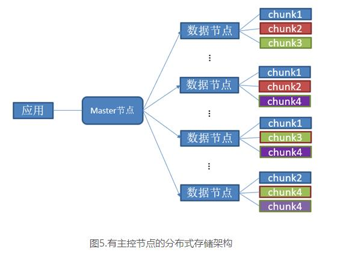
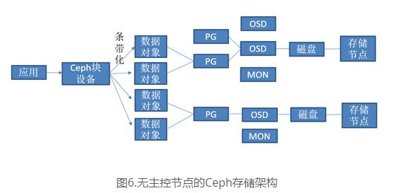
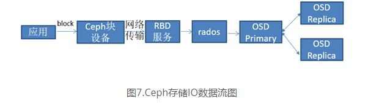

## SAN与NAS的本质区别
- **访问级别：** NAS 是文件级别的存储，而 SAN 是块级别的存储。
- **连接方式：** NAS 连接到现有的网络，而 SAN 使用专用的存储网络。
- **适用场景：** NAS 适用于简单的文件共享和数据存储需求，而 SAN 适用于需要更高性能和复杂数据管理的场景。

## SAN

## NAS

## 分布式存储

## Ceph
以Ceph块存储的使用方式为例，除了Mon等集群管理监控组件之外，Ceph中OSD组件用于管理物理磁盘，基于OSD去构建PG，而PG上存放着数据对象，数据对象则对应着Ceph块设备，Ceph块设备可被格式化分区，从而被应用使用，其架构图如图6所示。

## 参考文献
[超实用总结：各种存储性能瓶颈场景下的分析和优化](https://www.infoobs.com/article/20230213/57059.html)