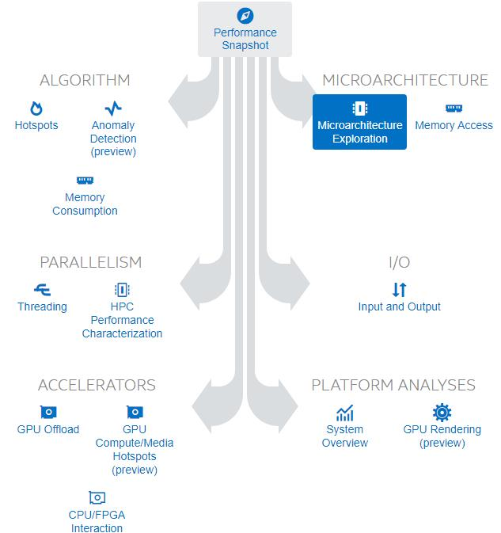

## 工具
- perf
- arthas
- Intel VTune
    - where
        - local
        - remote: ssh、tcp/ip
    - what
        - attach to process
        - run application
        - profile system
    - How
        - 
    - 好处
        - 除了常规的火焰图，还可以抓取front end and back end bound，进一步挖掘memory bound、vectorization数据
        - microarchitecture exploration可以查看方法级别的cpu瓶颈数据
        - 特别适合函数级 性能调优
    - 不足
        - 分析数据比较底层，对于上层的应用逻辑无感知，难以对上层应用给出整体的建议，需要结合具体函数栈展开函数级别的cpu数据分析