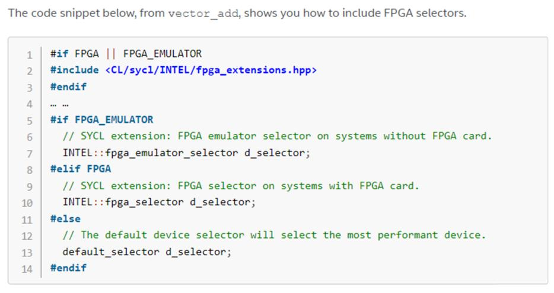
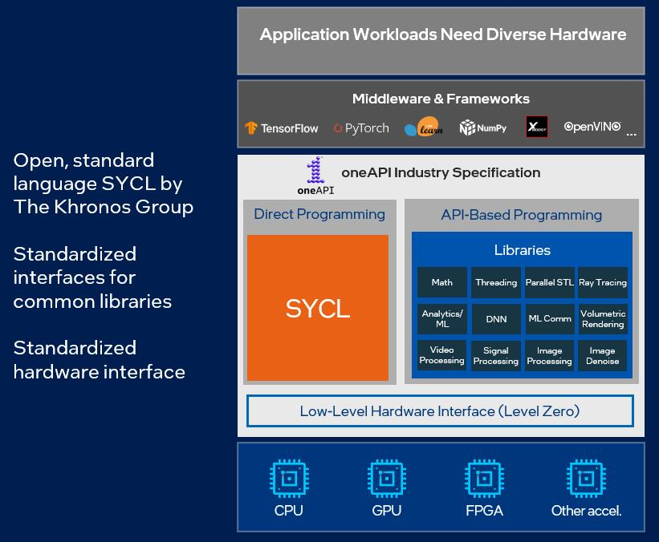

# Intel

## Software
- [OneAPI](https://www.intel.cn/content/www/cn/zh/developer/articles/technical/oneapi-what-is-it.html#gs.4kztoc)
    - oneAPI is an open source specification that aims to simplify the life of developers looking to create accelerator-based applications and who want to **support a variety of hardware architectures and hardware vendors**. As a major supporter of this effort, Intel has provided implementations of the specification and tooling to support developers writing oneAPI applications. However, this is not a unilateral effort. The implementation of this specification is supported by various software and hardware companies and this number will grow over time.
    - SYCL
        - SYCL is an open alternative to single-architecture proprietary languages. It allows developers to reuse code across hardware targets (CPUs and accelerators such as GPUs and FPGAs) and also perform custom tuning for a specific accelerator. These code walkthroughs introduce you to basic principles and practices of SYCL programming.
        - 
    - 
    - ![[Pasted image 20230901095255.png]]
    - ![[Pasted image 20230901095505.png]]
- OAP
    - 架构
        - 架构图有点out of date，gazelle被gluten替换， CloudTik等都没有列上来。
        - 当前除了gluten与CloudTik外，其他子项目都不再活跃
        - ![[Pasted image 20230901110434.png]]
    - Optimized Analytics Package for Spark* Platform (OAP for Spark* Platform) is a project to optimize Apache Spark* in various aspects including cache, shuffle, execution engine, MLlib and so on. Currently, OAP for Spark Platform includes the following optimizations:
        - SQL Data Source Cache: Optimize Spark* SQL Data Source using PMem as input data cache.
        - RDD Cache PMem Extension: Optimize Spark* RDD Cache using PMem.
        - Shuffle Remote PMem Extension: Optimize Spark* shuffle using remote PMem and RDMA.
        - Remote Shuffle: Shuffle implementation for writing shuffle to HDFS Filesystem compatible remote storage.
        - OAP MLlib: Optimized implementation of part of MLlib agorithms.
        - CloudTik： enables researchers, data scientists, and enterprises to easily create and manage analytics and AI platform on public clouds, with out-of-box optimized functionalities and performance, and to go quickly to focus on running the business workloads in hours or in even minutes instead of spending months to construct and optimize the platform.
        - Unified Arrow Data Source and Native SQL Engine: Optimize SQL execuiton engine using vectorization, native, and columnar data.
            - Gazelle Plugin ：A Native Engine for Spark SQL with vectorized SIMD optimizations；Gazelle引擎已停止开发
            - **Gluten**：当前的重点，不在发力自身的native engine，而依靠社区的其他native engine，如Velox、Clickhouse
                - ![[Pasted image 20230901110613.png]]
- BDTK
    - Purpose：assembling & building becomes a new trend for data analytic solution providers. More and more SQL based solutions were built based on some primitive building blocks over the last five years. Having some performt OOB building blocks (as libraries) can significantly reduce time-to-value for building everything from scratch. With such general-purpose toolkit, it can significantly reduce time-to-value for analytic solution developers.
    - Modules[¶](https://intel.github.io/BDTK/user/modules.html#modules "Permalink to this headline")
        - [Intel Codec Library User Guide](https://intel.github.io/BDTK/user/modules/ICL-module.html)
        - [Expression Evaluation Module Introduction](https://intel.github.io/BDTK/user/modules/expr-eval-module.html)
        - [Hash Table Module Introduction](https://intel.github.io/BDTK/user/modules/hash-table-module.html)
    - ![[Pasted image 20230901101904.png]]
    - ![[Pasted image 20230901101917.png]]
- BigDL
    - BigDL makes it easier for data scientists and data engineers to build end-to-end, distributed AI applications. The BigDL release provides the following features:
        - DLlib: A distributed deep learning library for Apache Spark* (that is, the original BigDL framework with a Keras*-style API and Spark machine learning pipeline support).With _DLlib_, you can write distributed deep learning applications as standard (**Scala** or **Python**) Spark programs, using the same **Spark DataFrames** and **ML Pipeline** APIs.
        - Orca: Seamlessly scales out TensorFlow* and PyTorch* pipelines for distributed big data.
            - The _Orca_ library seamlessly scales out your single node **TensorFlow**, **PyTorch** or **OpenVINO** programs across large clusters (so as to process distributed Big Data).
            - In addition, you can also run standard **Ray** programs on Spark cluster using _**RayOnSpark**_ in Orca.
        - Nano:You can transparently accelerate your TensorFlow or PyTorch programs on your laptop or server using _Nano_. With minimum code changes, _Nano_ automatically applies modern CPU optimizations (e.g., SIMD, multiprocessing, low precision, etc.) to standard TensorFlow and PyTorch code, with up-to 10x speedup.
            - 这个特性可能最有用，用户写python代码，用native的方法加速
        - LLM：Low-bit (INT3/INT4/INT5/INT8) large language model library for Intel CPU/GPU. **`bigdl-llm`** is a library for running _**LLM**_ (large language model) on your Intel _**laptop**_ or _**GPU**_ using INT4 with very low latency[1](https://github.com/intel-analytics/BigDL/tree/main/python/llm#user-content-fn-1-cd763b16b7b8044cf19323066386636c) (for any Hugging Face _Transformers_ model).
        - Friesian: A large-scale, end-to-end recommender framework
        - Chronos: Scalable time-series analysis using AutoML
        - PPML: Privacy preserving big data analysis and machine learning
    - 如何选择组件：
        - ![[Pasted image 20230901111928.png]]
- SGX

## Processor
- Intel Core
    - ![[Pasted image 20230809170315.png]]
    - 历史代号
        - [Haswell](https://zh.wikipedia.org/zh-cn/Haswell)
        - [Broadwel](https://zh.wikipedia.org/wiki/Broadwell "Broadwell")
        - [Skylake](https://zh.wikipedia.org/zh-cn/Skylake%E5%BE%AE%E6%9E%B6%E6%A7%8B "Skylake微架构")
        - [Kaby Lake](https://zh.wikipedia.org/zh-cn/Kaby_Lake "Kaby Lake")
- Intel Xeon
    - ![[Pasted image 20230809165857.png]]
    - Scalable Processors
        - 加速器
            - Advanced Matrix Extensions， AMX
                - 可加速自然语言处理 (NLP)、推荐系统和 图像识别等深度学习 (DL) 推理和训练工作负载。
            - Advanced Vector Extensions， AVX
                - 在相同功耗范围内可将虚拟无线接入网络 (vRAN) 的密度较上一代产品提高多达 2 倍。
            - Advanced Vector Extensions 512， AVX-512
                - 支持多达两个融合乘加 (FMA) 单元， 并包含多项优化，可为要求严苛的计算任务提高性能。
            - Data Streaming Accelerator， DSA
                - 可通过优化流数据的传输和转换操作，大幅 提升存储、网络和数据密集型工作负载的性能。
            - In-Memory Analytics Accelerator， IAA
                - 可提高数据分析性能，同时从 CPU 内核上卸载任务，为数据库查询及其他工作负载加速。
            - 数据保护与压缩加速技术,英特尔® QAT
                - 可加速加解密和数据压缩，它通过从处理器内核卸载这些任务，帮助 降低系统资源消耗。
            - 密码操作硬件加速（Intel® Crypto Acceleration）
                - 降低 了实施普遍数据加密的影响，并提高了安全套接字层 (SSL) Web 服务器、5G 基础设施和 VPN/防火墙等加密敏感型工作 负载的性能。
            - Dynamic Load Balancer， 英特尔® DLB
                - 可随系统负载的变化将网络数据动态地分配 到多个 CPU 内核上，基于硬件高效实现负载平衡。
        - SKU
           -![[Pasted image 20230811143649.png]]
        - 历史架构代号
            - ![[Paste image 1690773631695image.png]]
    - MAX
        - 首款也是唯一一款 x86 高带宽内存 (HBM) 处理器，可最大程度提高带宽。
    - D Processor
        - 在空间和电源受限的环境中提供工作负载优化的性能，从数据中心到智能边缘。
    - Xeon Phi
        - 至強融核（Xeon Phi）協處理器，是首款英特爾集成眾核（Many Integrated Core，MIC）架構產品。[1]用作高性能計算（HPC）的超級計算機或伺服器的加速卡。最多72個處理器核心，每個核心擁有4個超線程，最多288個線程，超線程無法關閉。與之競爭的是GPGPU（通用圖形處理器）在HPC領域應用的普及。英特爾至強融核協處理器提供了類似於英特爾至強處理器編程環境的通用編程環境。多個英特爾至強融核協處理器可安裝在單個主機系統中，這些協處理器可通過 PCIe 對等互連相互通信，不受主機的任何干擾。
        - intel Phi 已停產。[75]2017年上市銷售。(沒上市)(2019/1/10)