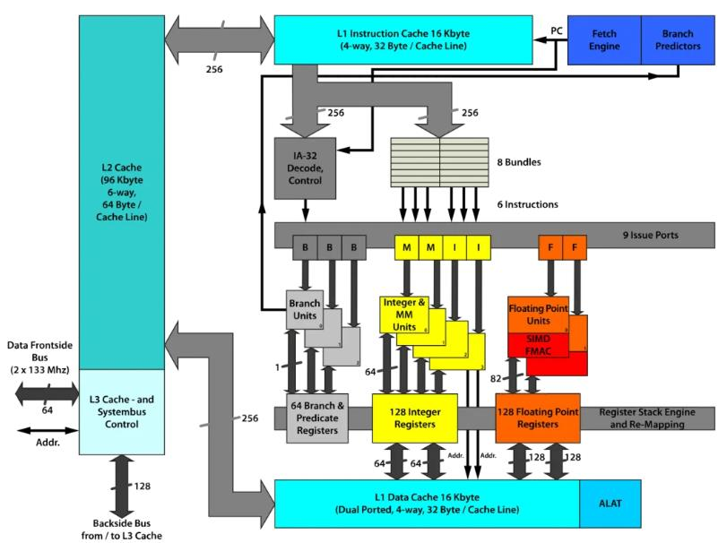
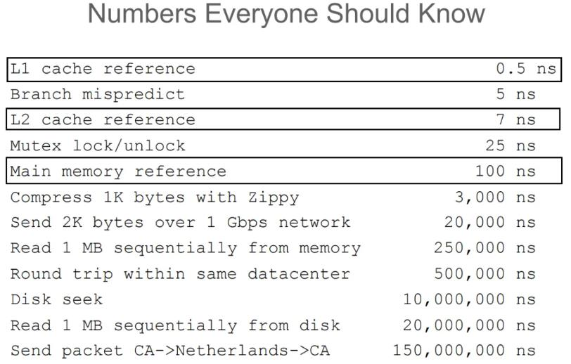
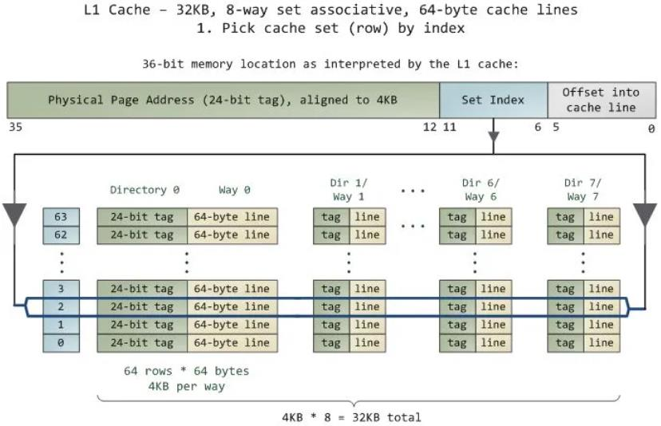
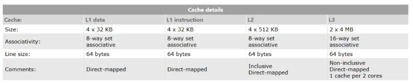
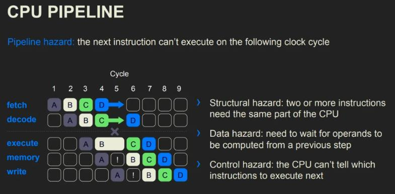

[原文](https://mp.weixin.qq.com/s?__biz=MjM5ODYwMjI2MA==&mid=2649783116&idx=1&sn=c9ac909295a595759431ed5f93093ba9&chksm=becce83789bb6121102d2a621a425c7aac933f3221f1cf31b7c86f02c24e8c4d714a73d99fa2#rd)

## Cache Miss

而当 `cpu` 读取一个数据的时候，会先尝试从 `cache` 中读取。如果发生 `cache miss` 的时候，才会将数据从主存中加载到 `cache` 中再读取。而值得注意的是，`cpu` 每一次的读取都是以 `cache line` (**一般为64Byte，8个 long**)为单位的。也就是说，`cpu` 在读取一个数据的时候，也会将该数据相邻的、一个 `cache line` 内的数据也加载到 `cache` 中。而二维数组在内存中是按行排布的，换句话说，数组中相邻的两行是首尾相连排列的。所以在读取 `arr[i]` 的时候，`arr[i + 1]` 、`arr[i + 2]` 等相邻的数组元素也会被加载到 `cache` 中，而当下一次迭代中，需要读取数组元素 `arr[i + 1]` 时，就能直接从 `cache` 中取出，速度非常快。而因为以列读取数组时，`arr[i][j]` 和 `arr[i + 1][j]` 在内存中的位置就不再是紧密相连，而是相距一个数组行大小。这也导致了在读取 `arr[i][j]` 时，`arr[i + 1][j]` 并没有被加载到 `cache` 中。在下一次迭代时就会发生 `cache miss` 也就导致读取速度大幅下降。

## Prefetch
Cache prefetching can be accomplished either by hardware or by software.

- **Hardware based prefetching** is typically accomplished by having a dedicated hardware mechanism in the processor that watches the stream of instructions or data being requested by the executing program, recognizes the next few elements that the program might need based on this stream and prefetches into the processor's cache.
- **Software based prefetching** is typically accomplished by having the compiler analyze the code and insert additional "prefetch" instructions in the program during compilation itself.
而 `random_access` 会让 `prefetching` 的机制失效，使得运行效率进一步下降。

## cache associativity

`cache` 的大小是要远小于主存的。这就意味着我们需要通过某种方式将主存的不同位置映射到缓存中。一般来说，共有 3 种不同的映射方式。

##### 全相联映射

全相联映射允许主存中的行可以映射到缓存中的任意一行。这种映射方式灵活性很高，但会使得缓存的查找速度下降。

##### 直接映射

直接映射则规定主存中的某一行只能映射到缓存中的特定行。这种映射方式查找速度高，但灵活性很低，会经常导致缓存冲突，从而导致频繁 `cache miss` 。

##### 组相联映射

组相联映射则尝试吸收前两者的优点，**将缓存中的缓存行分组，主存中某一行只能直接映射到特定的一组，在组内则采取全相联的映射方式**。如果一组之内有 `n` 个缓存行，我们就称这种映射方式为 `n` 路组相联（n-way set associative）。

典型的32KB 大小的 L1 cache 组相联映射：

回到真实的 `cpu` 中，如：`AMD Ryzen 7 4700u`

我们可以看到，`L1 cache` 大小为 `4 x 32 KB (128KB)` ，采取 8 路组相联，缓存行大小为 `64 bytes` 。也就是说，该缓存共有 `4x32x1024 byte/64 byte = 2048` 行，共分为 `2048/8 = 256` 组。也就是说，当迭代数组的步长为 2^n时，数据更可能会被分到同一个组内，导致 `cache miss` 更加频繁，从而导致效率下降。

## Pipeline
CPU流水线（Pipeline）是现代处理器提高指令吞吐率的一种技术。在流水线中，指令的执行被分解成多个阶段，每个阶段由不同的硬件单元处理。然而，流水线的设计和执行过程中可能会遇到以下三种冒险（Hazard），它们会导致流水线的性能下降：

1. **结构冒险（Structural Hazard）**： 结构冒险发生在硬件资源冲突时，即两个或多个指令在同一时间需要使用同一个硬件资源。例如，如果流水线中的两个阶段需要同时访问缓存，而缓存只有一个访问端口，就会发生结构冒险。
        - **解决方法**：通常通过增加硬件资源来避免结构冒险，比如增加缓存端口、寄存器文件或者其他必要的硬件单元。
2. **数据冒险（Data Hazard）**： 数据冒险是最常见的一类冒险，它发生在指令之间存在数据依赖时。数据冒险分为以下几种类型：
        - **RAW（Read After Write）**：后一条指令需要读取前一条指令写入的结果，但在流水线中该结果尚未准备好。
    - **WAR（Write After Read）**：后一条指令写入一个寄存器或内存位置，而这个位置是前一条指令需要读取的。
    - **WAW（Write After Write）**：后一条指令写入一个寄存器或内存位置，而这个位置前一条指令也要写入。
    - **解决方法**：可以通过转发（Forwarding）/旁路（Bypassing）、插入气泡（Stall）或指令重排（Reordering）等技术来解决数据冒险。
3. **控制冒险（Control Hazard）**： 控制冒险发生在分支指令（如条件跳转或函数调用）导致的程序控制流改变时。由于分支指令的结果通常在执行阶段才能确定，这可能导致流水线中的后续指令需要被取消或者重新取指。
        - **解决方法**：可以通过分支预测（Branch Prediction）、延迟分支（Branch Delay）或者动态调度（Dynamic Scheduling）等技术来减少控制冒险的影响。

