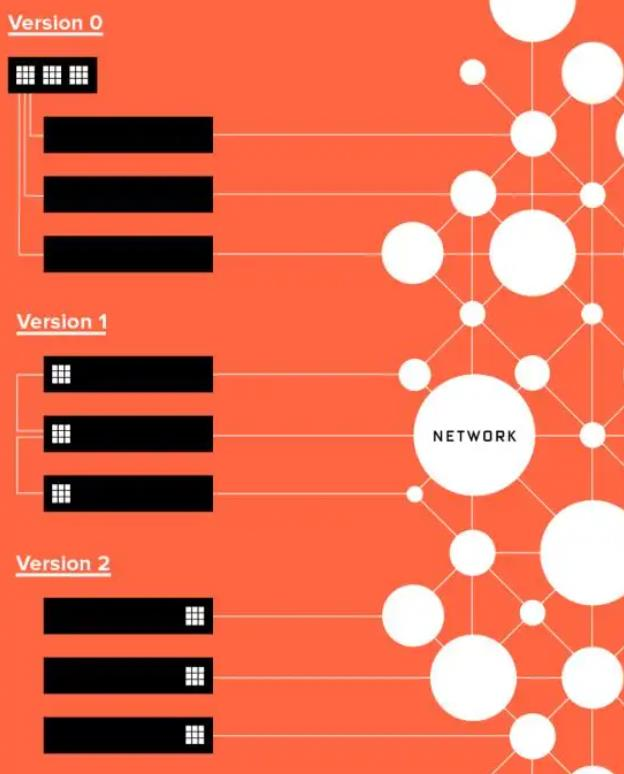

#### 参考文献
[FPGA, CPU, GPU, ASIC区别，FPGA为何这么牛 - 知乎](https://zhuanlan.zhihu.com/p/471174552#:~:text=FPGA%2C%20CPU%2C%20GPU%2C%20ASIC%E5%8C%BA%E5%88%AB%EF%BC%8CFPGA%E4%B8%BA%E4%BD%95%E8%BF%99%E4%B9%88%E7%89%9B)
[CPU，GPU和FPGA的计算体系结构比较 - 知乎](https://zhuanlan.zhihu.com/p/372518433)
[FPGA和CPU、GPU有什么区别？为什么越来越重要？](https://www.bilibili.com/read/cv25712075/)
## CPU

#### 优势
- 无序超标量执行
- 复杂的控制可提取巨大的指令级并行度
- 准确的分支预测
- 顺序代码上的自动并行
- 大量受支持的指令
- 与卸载加速相比，延迟更短
- 顺序执行代码可简化开发过程

## GPU

#### 优势
- 大规模并行，多达数千个小型高效SIMD内核/ EU
- 高效执行数据并行代码
- 高动态随机存取存储器（DRAM）带宽

## FPGA

#### 无共享与流水线并行
CPU、GPU 都属于冯·诺依曼结构，指令译码执行、共享内存。FPGA 之所以比 CPU 甚至 GPU 能效高，本质上是无指令、无需共享内存的体系结构带来的福利。

冯氏结构中，由于执行单元（如 CPU 核）可能执行任意指令，就需要有指令存储器、译码器、各种指令的运算器、分支跳转处理逻辑。由于指令流的控制逻辑复杂，不可能有太多条独立的指令流，因此 GPU 使用 SIMD（单指令流多数据流）来让多个执行单元以同样的步调处理不同的数据，CPU 也支持 SIMD 指令。

**FPGA 同时拥有流水线并行和数据并行，而 GPU 几乎只有数据并行（流水线深度受限）。**
例如处理一个数据包有 10 个步骤，FPGA 可以搭建一个 10 级流水线，流水线的不同级在处理不同的数据包，每个数据包流经 10 级之后处理完成。每处理完成一个数据包，就能马上输出。
而 GPU 的数据并行方法是做 10 个计算单元，每个计算单元也在处理不同的数据包，然而所有的计算单元必须按照统一的步调，做相同的事情（SIMD，Single Instruction Multiple Data）。这就要求 10 个数据包必须一起输入、一起输出，输入输出的延迟增加了。
**当任务是逐个而非成批到达的时候，流水线并行比数据并行可实现更低的延迟**。因此对流式计算的任务，FPGA 比 GPU 天生有延迟方面的优势。

**FPGA 和 GPU 最大的区别在于体系结构，FPGA 更适合做需要低延迟的流式处理，GPU 更适合做大批量同构数据的处理。**
由于很多人打算把 FPGA 当作计算加速卡来用，两大 FPGA 厂商推出的高层次编程模型也是基于 OpenCL，模仿 GPU 基于共享内存的批处理模式。CPU 要交给 FPGA 做一件事，需要先放进 FPGA 板上的 DRAM，然后告诉 FPGA 开始执行，FPGA 把执行结果放回 DRAM，再通知 CPU 去取回。

CPU 和 FPGA 之间本来可以通过 PCIe 高效通信，为什么要到板上的 DRAM 绕一圈？也许是工程实现的问题，我们发现通过 OpenCL 写 DRAM、启动 kernel、读 DRAM 一个来回，需要 1.8 毫秒。而通过 PCIe DMA 来通信，却只要 1~2 微秒。
#### 重定义优势
与可以通过软件编程的固定架构的CPU和GPU不同，FPGA是可重新配置的，其计算引擎由用户定义。**当编写针对FPGA的软件时，已编译的指令成为硬件组件，这些组件在空间上排列在FPGA架构上，并且这些组件都可以并行执行。**

FPGA是由大量小型处理单元组成的阵列，其中包含多达**数百万个可编程的1位自适应逻辑模块**（每个模块都可以像一个位的ALU一样工作），**多达数万个可配置的存储块以及成千上万个数学引擎，称为数字信号处理（DSP）块**，支持可变精度浮点和定点运算。所有这些资源都是通过可根据需要激活的可编程导线网格连接的。

在FPGA上“执行”软件时，其执行方式与在CPU和GPU上执行已编译和汇编的指令的意义不同。取而代之的是，数据流经过与软件中表达的操作相匹配的FPGA上定制的硬件流水线。由于数据流管道硬件与软件匹配，因此消除了控制开销，从而提高了性能和效率。

#### 优势
- 效率：数据处理管道完全根据软件需求进行调整。**无需控制单元，指令获取单元，寄存器写回和其他执行开销**。
- 定制指令：CPU / GPU本身不支持的指令可以在FPGA上轻松实现并有效执行（例如，位操作）。
- 可以解决跨并行工作的数据依赖性，而不会导致流水线停滞。
- 灵活性：可以重新配置FPGA，以适应不同的功能和数据类型，包括非标准数据类型。
- 定制的片上存储器拓扑已调整为算法：内置大带宽的片上存储器以适应访问模式，以最大程度地减少或消除停顿。
- 丰富的I / O：FPGA内核可以直接与各种网络，内存以及自定义接口和协议进行交互，从而实现了低确定性的延迟解决方案。
## 微软实践
微软部署 FPGA 并不是一帆风顺的。对于把 FPGA 部署在哪里这个问题，大致经历了三个阶段：
- 专用的 FPGA 集群，里面插满了 FPGA；
- 每台机器一块 FPGA，采用专用网络连接；
- 每台机器一块 FPGA，放在网卡和交换机之间，共享服务器网络。

## 总结
当我们用 FPGA 加速了 Bing 搜索、深度学习等越来越多的服务；当网络虚拟化、存储虚拟化等基础组件的数据平面被 FPGA 把持；当 FPGA 组成的「数据中心加速平面」成为网络和服务器之间的天堑……似乎有种感觉，FPGA 将掌控全局，CPU 上的计算任务反而变得碎片化，受 FPGA 的驱使。以往我们是 CPU 为主，把重复的计算任务卸载（offload）到 FPGA 上；以后会不会变成 FPGA 为主，把复杂的计算任务卸载到 CPU 上呢？随着 Xeon + FPGA 的问世，古老的 SoC 会不会在数据中心焕发新生？