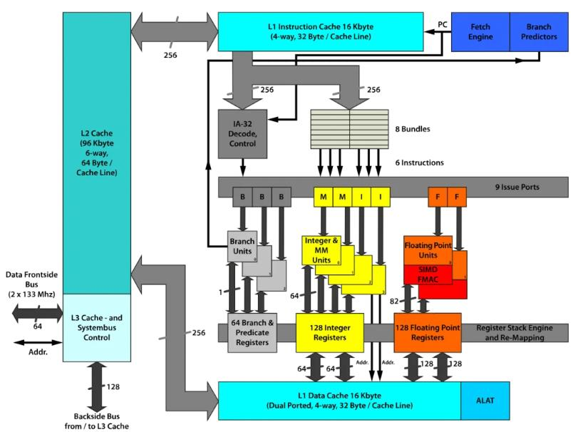

[原文](https://mp.weixin.qq.com/s?__biz=MjM5ODYwMjI2MA==&mid=2649783116&idx=1&sn=c9ac909295a595759431ed5f93093ba9&chksm=becce83789bb6121102d2a621a425c7aac933f3221f1cf31b7c86f02c24e8c4d714a73d99fa2#rd)

## Cache Miss

而当 `cpu` 读取一个数据的时候，会先尝试从 `cache` 中读取。如果发生 `cache miss` 的时候，才会将数据从主存中加载到 `cache` 中再读取。而值得注意的是，`cpu` 每一次的读取都是以 `cache line` (**一般为64Byte，8个 long**)为单位的。也就是说，`cpu` 在读取一个数据的时候，也会将该数据相邻的、一个 `cache line` 内的数据也加载到 `cache` 中。而二维数组在内存中是按行排布的，换句话说，数组中相邻的两行是首尾相连排列的。所以在读取 `arr[i]` 的时候，`arr[i + 1]` 、`arr[i + 2]` 等相邻的数组元素也会被加载到 `cache` 中，而当下一次迭代中，需要读取数组元素 `arr[i + 1]` 时，就能直接从 `cache` 中取出，速度非常快。而因为以列读取数组时，`arr[i][j]` 和 `arr[i + 1][j]` 在内存中的位置就不再是紧密相连，而是相距一个数组行大小。这也导致了在读取 `arr[i][j]` 时，`arr[i + 1][j]` 并没有被加载到 `cache` 中。在下一次迭代时就会发生 `cache miss` 也就导致读取速度大幅下降。

## Prefetch
Cache prefetching can be accomplished either by hardware or by software.

- **Hardware based prefetching** is typically accomplished by having a dedicated hardware mechanism in the processor that watches the stream of instructions or data being requested by the executing program, recognizes the next few elements that the program might need based on this stream and prefetches into the processor's cache.
- **Software based prefetching** is typically accomplished by having the compiler analyze the code and insert additional "prefetch" instructions in the program during compilation itself.
而 `random_access` 会让 `prefetching` 的机制失效，使得运行效率进一步下降。

## cache associativity

`cache` 的大小是要远小于主存的。这就意味着我们需要通过某种方式将主存的不同位置映射到缓存中。一般来说，共有 3 种不同的映射方式。

##### 全相联映射

全相联映射允许主存中的行可以映射到缓存中的任意一行。这种映射方式灵活性很高，但会使得缓存的查找速度下降。

##### 直接映射

直接映射则规定主存中的某一行只能映射到缓存中的特定行。这种映射方式查找速度高，但灵活性很低，会经常导致缓存冲突，从而导致频繁 `cache miss` 。

##### 组相联映射

组相联映射则尝试吸收前两者的优点，将缓存中的缓存行分组，主存中某一行只能映射到特定的一组，在组内则采取全相联的映射方式。如果一组之内有 `n` 个缓存行，我们就称这种映射方式为 `n` 路组相联（n-way set associative）。

