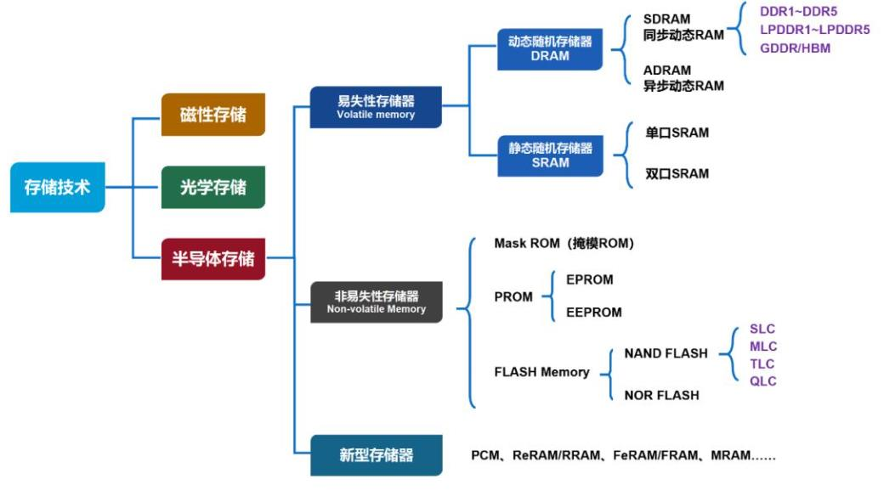
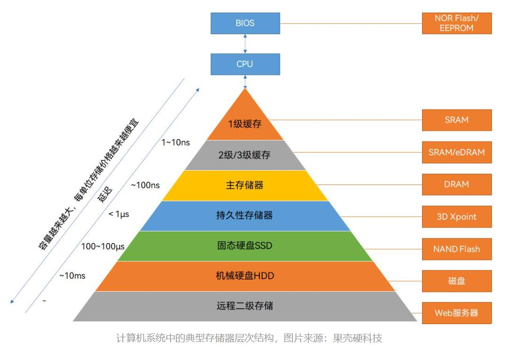

## 参考
[关于半导体存储的最强入门科普-36氪](https://36kr.com/p/1933583910734464?utm_source=pocket_saves#:~:text=%E5%9F%8E%E5%B8%82%E5%90%88%E4%BD%9C-,%E5%85%B3%E4%BA%8E%E5%8D%8A%E5%AF%BC%E4%BD%93%E5%AD%98%E5%82%A8%E7%9A%84%E6%9C%80%E5%BC%BA%E5%85%A5%E9%97%A8%E7%A7%91%E6%99%AE,-%E9%B2%9C%E6%9E%A3%E8%AF%BE%E5%A0%82)
[新型存储之我见（科普长文）\_腾讯新闻](https://new.qq.com/rain/a/20230413A04NUQ00#:~:text=%E5%88%86%E4%BA%AB-,%E6%96%B0%E5%9E%8B%E5%AD%98%E5%82%A8%E4%B9%8B%E6%88%91%E8%A7%81%EF%BC%88%E7%A7%91%E6%99%AE%E9%95%BF%E6%96%87%EF%BC%89,-%E5%90%AF%E5%93%A5%E6%9C%89%E4%BD%95)
