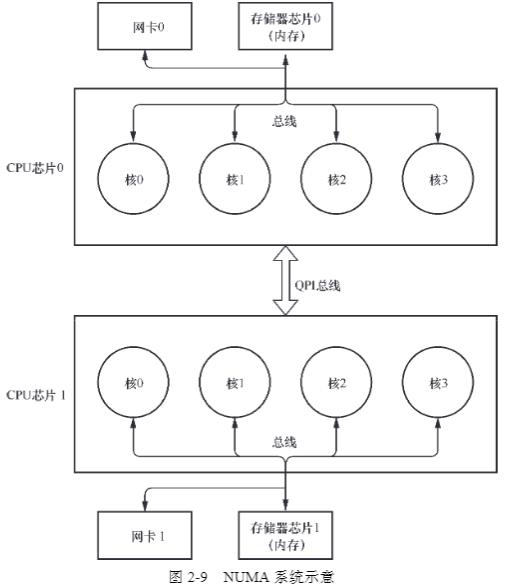

[豆瓣评分 9.1](https://book.douban.com/subject/36322557/)

## 计算机网络
#### 五层协议
- 应用层：http
- 传输层：TCP、UDP
- 网络层：IP
- 链路层：Mac
- 物理层：光电接口

最大传输单元 MTU：数据链路层上能通过的最大负载，标准以太网（对应链路层+物理层）是1500Bytes

## 硬件 

#### 体系结构

#### Cache

cache line 一次从内存取 N 个字节到 Cache 中，N 一般为64Byte

cache 写策略：

1. write-through：同时写 cache 和内存
2. write-back：只写 cache，cache line 标记为 dirty，不同步写内存
#### cache 一致性

###### 挑战
- 线程 A 若采用 write-through 方法更新了内存，但是线程 B cache 了 flag，如果感知不到内存修改，那么 B 将数据不一致
- 线程 A 若采用 write-back 方法更新自己的 cache，而不更新内存，那么线程 B 无论是否 cache，都将不一致
###### 解决方案
- Snooping-based 方案：所有 cache 通过共享总线互联，每个 cache 控制器监控着共享总线的操作。当某个核对 cache line 进行写操作后，其他 cache 控制器会无效自己相同地址的 cache line---分布式监听方案
- Directory-based 方案：某个位置（directory）集中存储所有被多核共享的 cache line 的状态，一个核更新了自己的 cache line 后，如果在 directory 发现被共享，那么向其他核发送无效信号---集中式分发方案
###### cache 一致性场景
- 多核 L1、L2 与内存之间的读写一致性
- 单核 Cache（L1/2/3） 、外设（当做一个核）与内存之间的读写一致性
###### 三种 cache 指令
- Clean：dirty （cache 修改过，但尚未写回内存）的 cache line 写到内存中
- Invalid：将目标地址范围的所有 cache line 设置为无效，下次直接访问内存
- Flush：将目标地址范围的所有 cache line，先 clean 再 Invalid
#### NUMA

除了内存存在 non-unifor memory access 以外，外设（如网卡）也存在直连与非直连的情况

因而网卡0写入内存0，比写入内存1快

#### 总线

总线带宽（bit/s）=频率 * 宽度

###### PCI Express 总线

