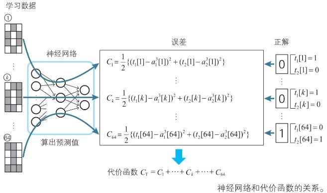
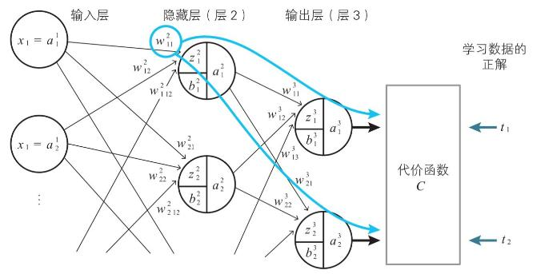
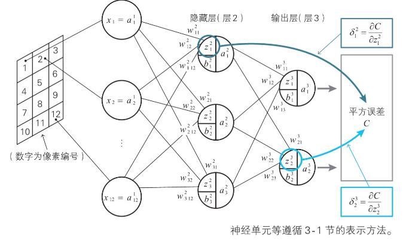
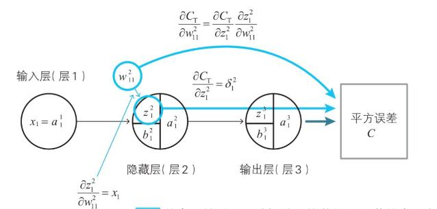
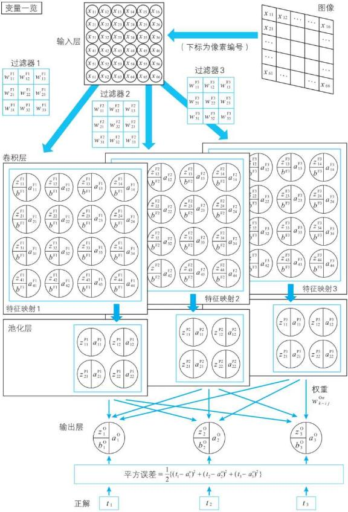
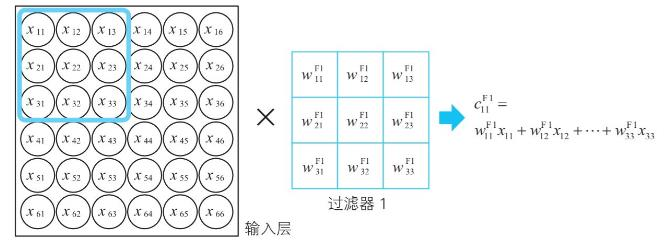
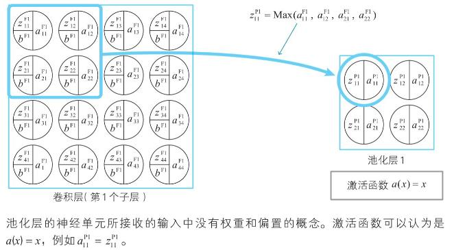
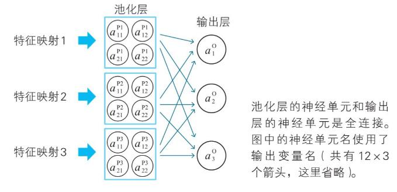

求最小值的两种方案：
1. 根据输入数据，按照各变量偏导数为0，联立各参数求解方程，得出参数
2. 因联立求解方程困难，使用梯度下降法，逐步逼近最小值

导数：

常用导数公式

偏导数

链式法则

多变量函数的近似公式

梯度下降法：
这里使用了向量的余弦距离公式

回归分析

基于以下公式，联立方程求得对应参数p,q

条件的数据规模要大于模型参数的个数，方程方可求解

神经网络

代价函数

- 通过偏导数为0，求解参数方程十分困难

- 梯度下降法求解

相对求解参数方程已相对容易很大，但依然需要求解代价函数相对参数的偏导，这里依然困难：

神经单元误差

delta与权重参数偏导的关系

输出层的delta误差

L与L+1层的递推公式：

## 卷积神经网络

卷积运算

一般的：
池化层

输出层

代价函数

### 附件
[图灵社区](http://www.ituring.com.cn/book/2593)