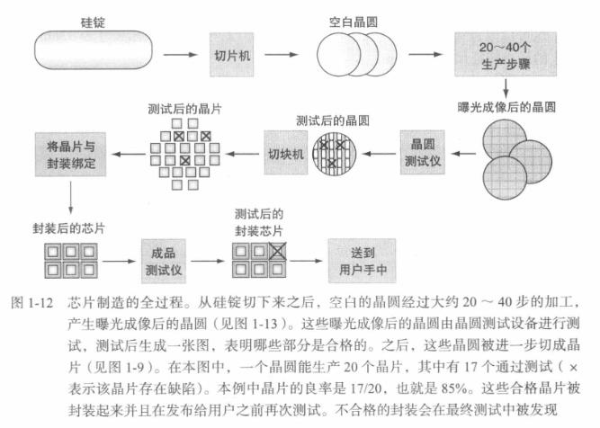
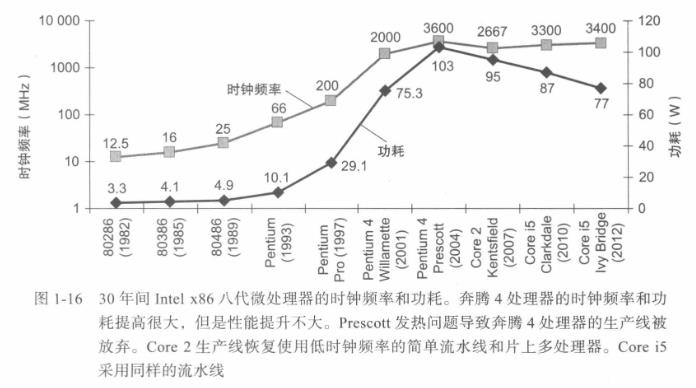
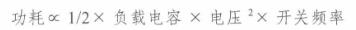
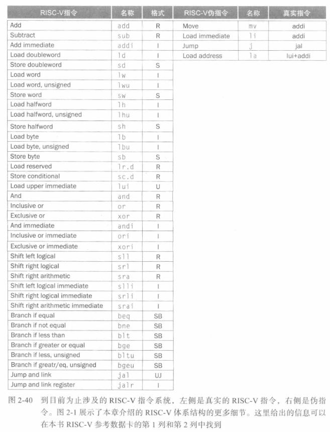
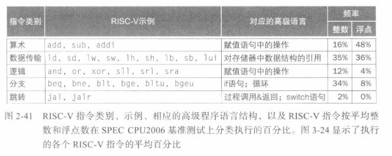

## 计算机抽象及相关技术
### 8个伟大思想
- 面向摩尔定律
- **分层抽象**
- make the common case fast
- 并行
- Pipeline
- 预测执行
- 存储层次
- 冗余提高可靠性
### 处理器和存储制造技术
- 硅锭->晶圆->晶片（die，独立的电子单元，具有自己的功能与引脚）

### 性能
- 定义：吞吐率、执行(响应)时间
- Wall time, CPU time
- CPU性能公式：CPU time=Instructions * CPI * Clock time(or divide Hz)
- 功耗墙

 
 
 功耗主要来自于晶体管从0-1-0的翻转开销
 
 晶体管功耗公式： ，所以通过降电压对冲时钟频率的提升

## 指令
### 有符号数
- 正整数的补码表示与其二进制表示相同
- 负整数的补码表示有以下步骤：
	1. 将负整数的绝对值转换为二进制。
	2. 取这个二进制数的反码（按位取反）。
	3. 将反码加 1。
- 在补码中，加法、减法等操作可以通过相同的硬件逻辑进行，简化了运算的实现。
### 小结

