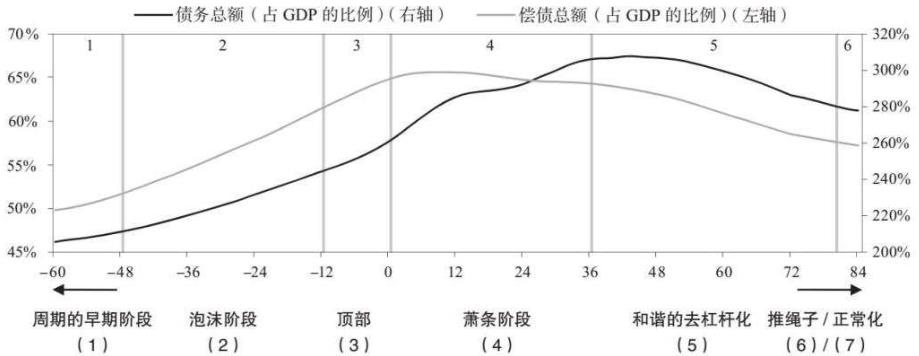
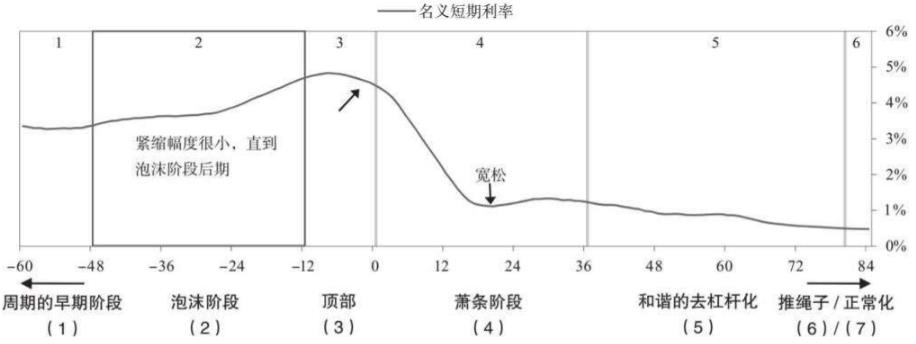
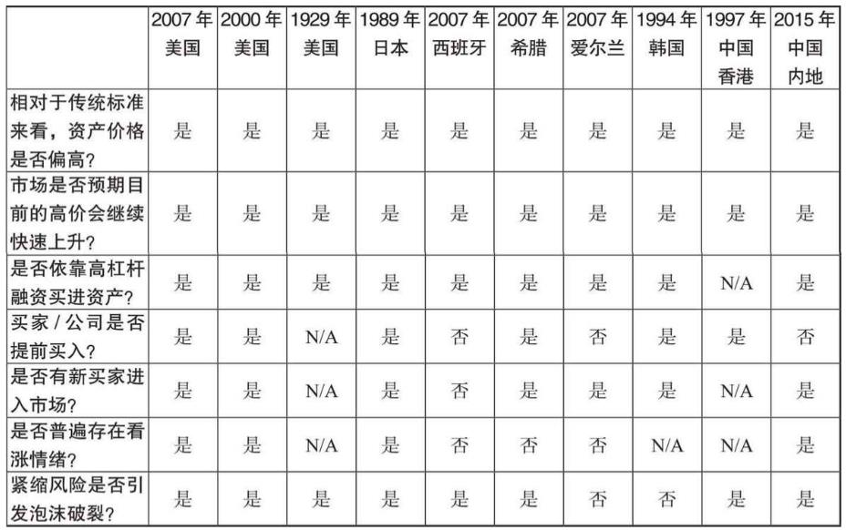
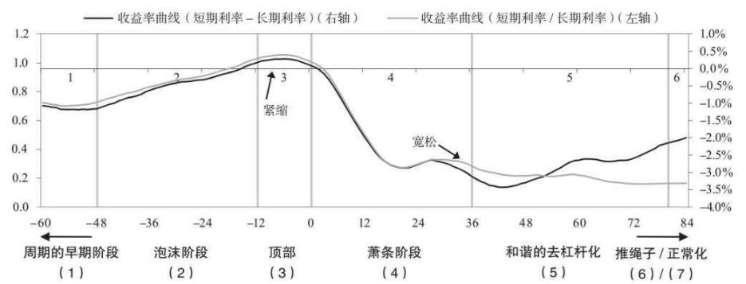
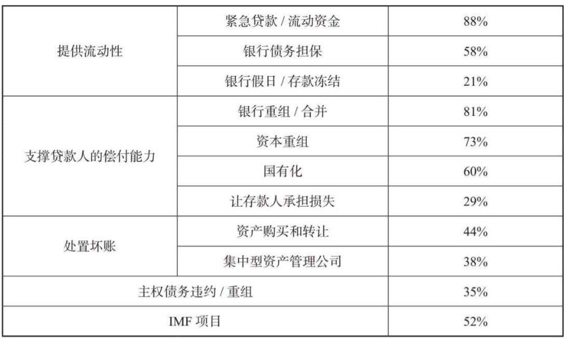
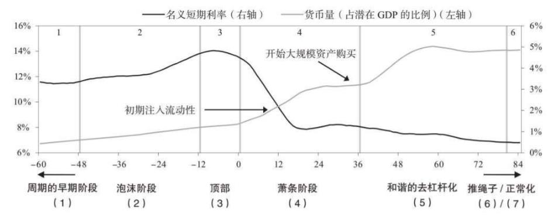
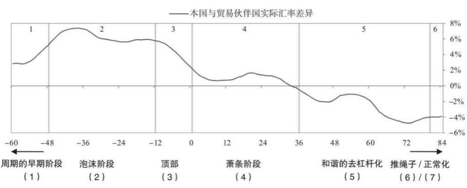

**劳动、金钱与资产的关系**：劳动（人月）是金钱、资产的最终申索物，金钱（现金）可以直接用于换取劳动，流动性好，而资产（房产、股票、债券等）可以用于换取金钱，保值性好。在不同的债务周期阶段，金钱与资产的转换比例不同，通过在周期中合理的布局现金与资产（在周期顶部卖出资产实现高位套现，在周期底部买入资产实现抄底，反之则为接盘侠或韭菜），从而获取超越周期的收益。---重远投资观
## 典型债务大周期

信贷同时创造了购买力和债务，因此增加信贷是好是坏，取决于能否把借款用于生产性目的，从而创造出足够多的收入来还本付息。
- 信贷/债务能产生足够大的经济效益，能使债务得到偿还，则信贷/债务是件好事
- 但有时，信贷/债务的代价是我们难以看清的。贷款标准过严，债务人几乎铁定能偿还债务，很少会产生债务问题，但缺点是经济发展不足。贷款标准宽松，可能会促进经济发展，但之后可能带来严重的债务问题，使已经取得的经济成果化为乌有。

大量举债的风险主要在于**决策者是否有意愿和能力将坏账损失分摊到多年**。在我经历和研究的所有案例中，我都看到了这种情况。决策者能不能做到这一点，取决于两个因素：(1) 债务是否以决策者能够控制的货币计价；(2) 决策者能否对债权人和债务人施加影响。

M2中除了基础货币供应（比如根据外汇储备发现基础货币）以外，大量货币由信贷产生，即货币乘数产生，货币乘数到一定上限，对应的则是居民部门的负债比例到达上限，此时通过降息不足以还本付息，不得不缩减开支，形成通缩性债务周期

长期债务周期的两类国家
- (1) 以外币计价的债务占比较低，出现通缩性萧条的国家，这包括对汇率有较大影响力的国家，如日本、中国等
- (2) 以外币计价的债务占比较高，出现了通胀性萧条的国家，这一般以小型国家为代表，比如委内瑞拉、斯里兰卡等

通常情况下，一个国家之所以会爆发债务危机，**是因为债务和偿债成本的增速高于偿债所需收入的增速**，最后不得不去杠杆化。在典型的债务危机中，央行可以通过降低实际利率和名义利率缓解危机，但当央行无法降息时，就会出现严重的债务危机（即萧条）​。

在典型情况下，每个短期债务周期（即经济周期）的顶部和底部的债务与收入比率都会高于此前一个短期债务周期，多个短期债务周期叠加，就形成了长期债务周期，直到推动债务扩张的降息无法继续

金钱有两个功能：**交换媒介和财富储藏手段**。金钱的这两个功能决定了它服务于两个主人：(1) 希望获得生活必需品的人，这些人一般为金钱而劳动；(2) 用金钱的价值来储藏财富的人。纵观历史，这两类群体被冠以不同的称谓，第一类群体被称为工人、无产阶级或“穷人”​，第二类群体被称为资本家、投资者或“富人”​。

无产阶级工人通过出售自己的时间赚钱，而资本投资者的赚钱方式是“借出”自己对金钱的使用权，以换取债务人还本付息的承诺、业务所有权（我们称之为股权或股票）​，或其他资产（例如房地产）​。这两类群体通常都可以从借贷交易中受益，但有时交易会导致一方受益、另一方受损。债务人和债权人尤其如此。

#### 总结
通缩性萧条和通胀性萧条是两种主要的债务危机，在开始之前，我想先说明两者的差异。
- 通缩性萧条中，决策者会通过**降息**应对最初的经济萎缩。但当利率接近0%时，这一政策工具就无法有效地刺激经济。此时，**债务重组和财政紧缩政策（加息）** 占主导地位，但没有适度的刺激措施（尤其是**印钞购债和货币贬值**）产生平衡效果。在这个阶段，收入下降速度快于债务重组速度，偿债会减少债务存量，但为了支付更高的利息成本，许多借款人不得不承担更多债务，因此债务负担（债务和偿债总额占收入的比例）上升。如上所述，通缩性萧条往往出现在大多数债务是国内融资的、以本币计价的国家，因此最终的债务危机会带来强制抛售和违约，但不会造成汇率问题或国际收支问题。
- 通胀性萧条经常出现在依赖外资流动的国家。这些国家已经积累了大量以外币计价的债务，无法对债务进行货币化（即央行印钞购债）​。当外资流动放缓时，信用创造就会变成信贷紧缩。在通胀性去杠杆化进程中，**资本外流导致贷款水平和流动性急剧下降，同时汇率下跌拉高通胀率**。由于决策者分散不良影响的能力非常有限，大量债务以外币计价的通胀性萧条特别难以管理。

## 通缩性债务周期

通缩性的周期一个伴随特征是利率的变化，在顶部之前，不断降息，促进泡沫发展；萧条阶段不断加息，
#### 周期的早期阶段

在周期的早期阶段，债务增长强劲，但债务增速不会快于收入增速。这是因为债务增长被用来支撑那些可使收入快速增长的经济活动。例如，企业通过借钱拓展业务，提高生产率，从而支撑收入增长。在这一阶段，债务负担很小，资产负债表较为健康。因此，**私营部门、政府和银行都有足够的空间来增加负债**。债务增长率、经济增长率和通胀率既不太热，也不太冷。这就是所谓的“黄金”时期。

#### 泡沫阶段
在泡沫阶段初期，债务增速快于收入增速。快速增长的债务导致资产回报率和经济增长率加速上扬。这一过程通常会自我强化，因为收入、净值和资产价值的增加提高了借款人的借款能力。

这种上行阶段通常持续数十年，主要是由于央行定期收紧和放松信贷而出现波动。央行调整货币政策带来短期债务周期，若干个短期债务周期叠加，形成长期债务周期。

长期债务周期得以持续的一个主要原因是央行降息是循序渐进的。**降息会增加资产价格的现值，提高资产价格，进而增加财富。这样一来，偿债负担就不会增加，信贷购物的月度偿还成本也会降低**。但这个阶段不可能永远持续下去。最终，债务人的偿债总额将等于或大于可借入的资金，债务总额（即偿还资金的承诺）严重超出现有的资金数量。当债务总额相对于资金和信贷不能再增加时，这个过程就会逆转，于是开始去杠杆化

贷款人和投机者轻松赚钱，迅速发财。投机者抵押资产的净值上涨，又可以获得新的贷款，进一步助长泡沫膨胀。这时，大多数人认为这不是问题。相反，他们认为这恰好反映和证实了经济繁荣的景象。债务周期的这个阶段通常会自我强化。在这种情况下，大多数人认为资产是宝贵的财富，**认为没有资产的人都错失了良机**

泡沫最有可能发生在经济周期、国际收支平衡周期或长期债务周期的顶部。**随着泡沫阶段接近顶峰，经济最为脆弱，但人们自认为富裕程度最高，对未来的信心最大**。在我们研究的案例中，泡沫阶段债务总额占 GDP 的比例平均约为300%。

##### 货币政策的作用

**央行政策以控制通胀率和经济增长率为目标**，并不针对泡沫管理，但在通胀率和经济增长率似乎并不过高的情况下，央行政策带来的债务增长为泡沫的产生提供了资金。在我看来，央行应当把“保持债务水平的可持续性”作为目标之一，确保无论信贷被用于何处，收入增长都足以偿债。这一点非常重要。央行决策者有时会说，泡沫难以发现，评估和控制泡沫不是其职责，控制通胀率和经济增长率才是。但资金和信贷是由央行控制的，当这些资金和信贷卷入债务问题时，会对通胀率和经济增长率造成巨大影响。泡沫破裂会带来最严重的萧条，如果助长债务增长的央行不来控制泡沫，还有谁能控制呢？

当通胀率过高，经济增长过热时，央行通常会适度收紧货币政策，上调短期利率

当泡沫破裂时，形势急转直下，造成泡沫的那些因素同样使经济衰退出现自我强化的特点。资产价格下跌拉低杠杆投机者的股票和抵押品价值，导致贷款人撤回资金，投机者不得不进行抛售，进一步压低资产价格。此外，风险较高的金融中介机构和风险投资会出现贷款人和投资者“挤兑”​（提取资金）的现象，从而导致流动性问题。通常情况下，如果受影响的一个市场或多个市场规模很大，杠杆率很高，存量债务可能会带来系统性威胁，债务问题可能会摧毁整个经济。

**利率在债务周期中的变化**

##### 泡沫特征

仅靠一个指标就可以预测债务危机是否即将到来是错误的。例如整个经济体的债务与收入比率、偿债与收入比率，虽然这些指标都很有用，但仍不足以说明情况。为了更好地预测债务危机，我们必须考察单个实体的具体偿债能力，而这是平均值无法体现的。更具体地说，**即使整个经济体的债务与收入比率或偿债与收入比率较高，只要债务在整个经济体中的分布较为平均，也不会造成太严重的问题，相对糟糕的情况是，大量债务集中在某几个重要实体中**。

#### 顶部

虽然顶部的形成是由不同的事件造成的，但大多数情况下，顶部出现于央行开始收紧货币政策，提升利率时。

#### 萧条阶段

在正常的经济衰退阶段，货币政策仍然有效，资金总量与偿债需求之间的不平衡可以通过降息来解决，因为充分降息可以带来以下影响：(1) 产生积极的财富效应；(2) 刺激经济活动；(3) 减轻偿债负担。**但在经济萧条时期无法采取大幅降息的方法，因为此时的利率已经接近0%**。如果处于萧条阶段的经济体还存在严重的货币外流或货币贬值问题，最低利率就不可能太低，因为还要考虑信贷和汇率面临的风险。

去杠杆化进程基本上就是，**人们发现自己所谓的财富其实大部分不过是他人的付款承诺，一旦对方不遵守承诺，自己的财富就不复存在了**。当投资者需要现金，试图把投资变现时，变现能力就会面临考验，一旦未通过考验，就会造成恐慌，引发“挤兑”和证券抛售。显然，那些遭遇“挤兑”的实体（特别是银行，也包括大多数依赖短期融资的实体）难以筹集资金和信贷，无法满足投资者的变现需求，于是爆发债务违约

债务违约和重组会给人们带来重创，尤其是对杠杆贷款人（例如银行）​。恐慌心理在金融体系内加速传递，且愈演愈烈，大家都想要现金，导致现金短缺（即流动性危机）​。具体发展进程如下：最初，债务人的收入和借款不足以偿债，因此必须出售资产，削减开支，以筹集现金；抛售导致资产价值下跌，从而降低了抵押品的价值，使收入进一步减少。借款人信誉度的评估标准有两个：一是资产/抵押品相对于债务的价值（即借款人的净值）​，二是收入相对于偿债总额的规模。由于借款人的净值和收入都比债务减少得快，信誉度恶化，贷款人更不愿意放贷，导致形势每况愈下。

萧条阶段的主导因素是债务减免（即债务违约和重组）和财政紧缩等通缩性力量，债务货币化的力度不足。一个人的债务是另一个人的资产，大幅削减这些资产的价值会大大减少对商品、服务和投资性资产的需求。若想债务减记发挥效果，减记规模必须较大，这样债务人才能还得起重组后的贷款。如果债务减记30%，那么债权人的资产就会相应减少30%。30%的减记幅度听上去已经很大了，而其实际影响更大。由于大多数债权人都加了杠杆（例如，借钱购买资产）​，因此债权人资产减记30%对其净值的影响可能会大得多。例如，假设债权人的杠杆率为2∶1，则资产减记30%的情况下，其净值将下降60%（由于他们的资产是净值的两倍，资产价值下降对净值的影响也是成倍的）​。由于银行的杠杆率一般约为12∶1或15∶1，债务减记会对银行乃至整个经济造成毁灭性打击。

#### 萧条的管理

减轻债务负担的政策工具分为四大类：(1) 财政紧缩；(2) 债务违约/重组；(3) 债务货币化/印钞；(4) 财富转移（从富人转移到穷人）​。

重申一下，债务危机的管理存在两大障碍：(1) 政府不知道如何妥善处理债务危机；(2) 存在政策或法律限制，政府没有采取必要行动的权力。

刚开始的时候，政府往往找不到**财政紧缩、印钞和财富重新分配的正确比例**。纳税人对债务人和金融机构感到愤怒（因为后者的过度杠杆和借款引发了债务危机）​，不希望政府用自己的钱去救助他们，这种情绪可以理解。政府也有理由相信，如果不让贷款人和借款人承担自身行为带来的不良后果，过度借债将再次发生（即所谓的“道德风险”问题）​。由于这些原因，决策者往往不愿意提供政府支持，在采取刺激性补救措施前往往会观望很久。但决策者等待得越久，去杠杆化进程就会越痛苦。最终，决策者选择进行**大规模担保、印钞和债务货币化**，推动去杠杆化的经济体进入通货再膨胀阶段。如果央行能迅速找到正确的政策组合，那么萧条持续的时间可能会相对短暂（例如2008年美国债务危机后短暂的萧条）​。否则，萧条可能会持续很长时间（例如美国20世纪30年代的大萧条，或日本20世纪80年代后期泡沫经济崩溃后的“失去的十年”​）​。

##### 1 财政紧缩

削减支出，提高税收是作者认为大错特错的两种处理方式

##### 2 印钞止血

贷款机构，特别是那些不受政府担保保护的机构，经常会遭遇“挤兑”​。此时，央行和中央政府必须决定应该让哪些存款人/贷款人免受损失，应该让哪些存款人/贷款人承担损失，确认哪些机构具有系统重要性，需要施救。与此同时，中央政府还需要尽力确保金融/经济体系的安全，最大限度地降低政府/纳税人的成本。在这种情况下，政府会为具有系统重要性的金融机构提供各种担保，其中一些机构往往会被国有化。通常情况下，会存在诸多法律和政治障碍，影响政府施救的速度和效果。施救所需的资金一部分来自政府（通过预算程序拨款）​，一部分来自央行（印钞）​。这两种做法政府最终都会采用，但具体实施程度可能不同。除了向一些核心银行提供资金外，政府通常还向其认为必不可少的一些非银行实体提供资金。

接下来，政府必须缓解信贷危机，刺激整体经济。**政府可能难以通过税收和借款筹集资金，因此央行被迫增加印钞量，提供更多资金，用于购买国债**。如果不这么做，政府就必须跟私营部门争夺有限的资金，导致资金面进一步紧张。因此，央行最后会不可避免地选择印钞

虽然高度刺激性的货币政策对于去杠杆化必不可少，但一般不能完全解决问题。当系统重要性机构出现失败的风险时，决策者必须采取措施使这些机构保持运转。他们必须立即采取如下行动：

- **减少恐慌，提供债务担保**。政府可以增加对存款和债务发行的担保。央行可以为系统重要性机构（指的是那些一旦倒闭会威胁金融系统和经济体持续运行的机构）注资。有时，政府可以实施存款冻结，强制把流动性留在银行体系中。这种做法通常不受欢迎，因为会加剧恐慌，但有时也很有必要，因为这是提供资金或流动性的唯一方式。
- **提供流动性**。面对私人信贷收缩、流动性紧张的局势，央行可以扩大抵押品范围，或为更多此前不被视为贷款对象的金融机构提供贷款，确保为金融系统提供充足的流动性。
- **支撑系统重要性机构的偿付能力**。第一步通常是激励私营部门解决问题，常用方法是支持出现问题的银行与状况良好的银行合并，并在监管层面推动向私营部门提供更多资本。此外，通过调整会计准则，减少立即需要的资金，维持机构的偿付能力，为机构提供解决问题的时间。
- **对系统重要性金融机构进行资本重组/国有化/损失覆盖**。如果以上方法不足以处理系统重要性金融机构的偿付能力问题，那么政府需采取措施对出现问题的银行进行资本重组。为防止危机恶化，稳定贷款人并维持信贷供应至关重要。

##### 3 债务违约/重组

根本而言，要想使未来的资金和信贷健康流动，经济恢复繁荣，处理现有不良债务的过程至关重要。决策者面临的挑战是让这一过程有条不紊地进行，确保经济和社会稳定。在最佳的债务危机管理案例中，决策者一般有如下特点：

(1) 能迅速认识到信贷问题的严重程度；

(2) 政府不会拯救每个非核心机构，而是评估让出现问题的机构破产并重组所带来的益处及其对其他信誉良好的贷款人和借款人产生的不利影响，加以平衡；

(3) 打造或恢复强大的信贷渠道，这样信誉良好的借款人未来就可以获得借款；

(4) 在应对坏账的同时，确保经济增长率和通胀率处于可接受的水平。

从长远来看，决策者必须做出的最重要的决定是，他们是要进行体制改革，解决造成债务问题的根本原因，还是只进行债务重组，分散债务危机的影响，使痛苦不至于难以忍受。

债务问题管理中政策工具的使用频率（根据案例统计）

###### 政府保护对象
- 小型存款人被赋予优先权，损失极少或为零（几乎在每个案例中均是如此）​。通常这是存款保险制度明确定义的一部分。在危机期间，存款保险制度的承保范围会扩大，以确保银行的流动性。即使在没有明确的存款保险制度的情况下，存款人也经常被优先保护。在我们研究的案例中，30%的情况下，存款人承担了损失，但损失往往来源于外汇存款，因为兑换利率低于市场汇率。
- 在大多数情况下，如果机构倒闭，股权持有人、次级债务持有人和大型存款人吸收损失，无论该机构是否具有系统重要性。在发达国家，最常见的做法是保护高级债务和次级债务持有人，进行股权重组，稀释现有股权持有人的股权。
- 有时，决策者优先考虑国内债权人，其次是外国债权人，尤其是当国内债权人的贷款流向私营部门参与者，在资本结构中地位较低时。在存款保险制度资金不足时尤其如此。但与此同时，政府往往最终优先支付 IMF（国际货币基金组织）和国际清算银行等跨国机构的贷款，因为确保获得这些公共实体的支持非常重要，这些公共实体实际上是承压国家的最后贷款人。
通常情况下，处理倒闭贷款人的过程伴随着一系列监管制度改革。有的改革力度较小，有的改革力度较大；有的改革卓有成效，有的改革却导致事态恶化。

倒闭贷款人的资产或现存贷款人的不良资产有两种主要的管理方式：(1) 将资产转移到一个单独的实体（资产管理公司）​，以进行重组和资产处置（约占研究案例的40%）​；(2) 将资产留在原贷款机构的资产负债表上进行管理（约占研究案例的60%）​。之后，处理不良贷款的主要工具有以下几种：(1) 贷款重组（例如，通过延长还款期限使借款人偿还贷款）​；(2) 债转股和资产没收；(3) 直接把贷款或资产出售给第三方；(4) 贷款证券化。

##### 4 重新分配财富

泡沫期间，贫富差距会拉大，而在困难时期，贫富差距会变得巨大

在某些情况下，对富人增税变得具有政治吸引力，因为富人在经济繁荣时期赚得盆满钵满（尤其是金融从业人员）​，造成问题的根源也被归咎于他们的贪婪。央行购买金融资产的行为也令富人大大获利，因为富人持有的金融资产更多。政治风向大幅“左倾”往往会加速财富再分配进程，**导致富人设法把资金转移到有安全保护的地方，这一行为本身就会影响资产市场和货币市场**。增税还可能导致区域经济“空洞化”​，因为收入较高的群体，也就是纳税大户会离开此地，使这些地区的整体税收收入减少，进而导致这些地区的房地产价值急剧下降，服务需求大幅减少

通常情况下，增税会以增加**所得税、不动产税和消费税税率**的形式实施，因为对这些税种增税能够最有效地提高政府收入。有时，政府会提高财产税和遗产税的税率，但征收的税额很小，因为很多财产流动性差，实际上很难征税，迫使纳税人出售流动性良好的金融资产来纳税，会减少资本形成。**无论采取哪种形式，财富转移的规模基本都不足以对去杠杆化进程做出实质性贡献**（除非发生“革命”​，使巨额财富国有化）​。

#### 和谐的去杠杆化

和谐的去杠杆化关键在于4种政策措施平衡推进，从而减少难以承受的冲击，减少债务与收入比率，并保持可接受的经济增长率和通胀率。如果有足够的刺激（印钞/债务货币化（债务货币化（Debt Monetization）是一种中央银行通过购买政府债券来增加货币供应量的过程。这种做法通常发生在政府需要资金来弥补财政赤字，而通过传统手段（如增税或削减开支）筹集资金不可行的情况下）和货币贬值）​，可以抵消通缩性去杠杆化力量（财政紧缩或债务违约）​，使名义经济增长率高于名义利率，但又不会因刺激过度造成通胀加速，货币严重贬值，从而引发新的债务泡沫，就可以产生和谐的去杠杆化。

抵消通缩性萧条的最好的方式是由央行提供充足的流动性和信贷支撑，同时由中央政府参与满足不同重要实体的资本需求。上文指出，支出来自资金或信贷。如果债务远远高出偿债的资金，无法通过增加负债来支撑新增支出，则支出和偿债救济的增加必须来自资金的增加。结果就是，央行不得不增加系统中的资金量。

名义收入增长率必须高于名义利率，越高越好，前提是这种增长不会带来不可接受的通胀或不可接受的汇率下跌。

人们想知道印钞是否会导致通胀率上升。如果印钞可以抵销信贷的减少，令通缩的力量被通货再膨胀的力量平衡，则不会导致通胀率上升。这并非是理论，而是经历了历史一次次验证的结论。

**请记住，支出是关键因素。一美元的支出，无论是用资金支付，还是用信贷支付，其对价格的影响是一样的**。央行可以通过印钞增加资金量，以弥补消失的信贷。印钞采取的形式是，由央行购买政府证券（主要包括国库券和公债两大类：国库券（Treasury Bills）：通常是由财政部发行的短期债务工具，用以弥补政府的财政收支不平衡。国库券的期限较短，一般不超过一年；公债（Government Bonds）：是指政府为筹集建设资金或其他长期资金需求而发行的一种债券。公债的期限较长，可以从几年到几十年不等。）和非政府资产（例如公司证券、股票和其他资产）​，表现为在信贷和实际经济活力收缩之际，货币量以极快的速度增加。

但是，存在滥用刺激性工具的情况。相对于其他工具而言，刺激性工具的作用非常好，因此存在滥用的切实风险，从而导致“痛苦的通胀性去杠杆化”​（例如20世纪20年代德国魏玛共和国的恶性通胀，20世纪80年代阿根廷和巴西的恶性通胀）​。关键是要避免过量印钞。如果政策工具能达到适当的平衡，去杠杆化进程就不会那么波折。**在那些以外币计价的债务占比较高，且大量债务由外国投资者拥有的国家，由于这些债务不容易被货币化或重组，实现这种适当的平衡就要难得多。**

在萧条时期（降低利率无效）​，印钞/债务货币化和政府担保是不可避免的，但在印钞受限或缺乏资产来支撑印钞且无法轻易重新分配债务负担的国家，这些工具几乎没有价值。我们研究的所有去杠杆化案例（囊括过去100年间绝大多数的去杠杆化进程）​，最终都出现了大规模的货币创造、财政赤字和货币贬值（货币兑换黄金、大宗商品和股票贬值）现象。

下图是21个通缩性去杠杆化案例中印钞的典型路径。一般会出现两轮印钞，首先是央行为承压机构提供流动性，其次是央行进行大规模的资产购买，广泛刺激经济。
 

下图是一国货币兑贸易伙伴国货币的平均实际汇率，反映了该国货币相对于贸易伙伴国货币的强弱。

通常情况下，与采用法定货币体系的政府相比，货币体系与黄金、大宗商品或外币挂钩的政府被迫实施更为紧缩的货币政策。但最终，债务紧缩带来巨大的痛苦，政府不得不放弃这一政策，打破挂钩，并开始印钞（它们或放弃原有的货币体系，或改变单位货币所能交换的大宗商品的数量或定价）​。例如，在美国大萧条时期，美元的价值（及货币总量）与黄金挂钩，美国政府最重要的一项政策举动就是打破美元兑黄金的承诺，这样美元便可以贬值，美联储可以创造更多货币，使股市、大宗商品市场和整体经济触底反弹。到2008年金融危机时，美元已经不与黄金挂钩，美联储印钞、购买资产和提供担保更容易，因为实施这些举措不需要对货币体系进行法律或官方上的调整。在美国大萧条时期，当罗斯福打破美元与黄金的挂钩时，黄金价格在一夜之间上涨。在最近的金融危机之后，美联储的举措帮助压低了美元兑所有货币（包括黄金）的价值。

**决策者最终总是选择印钞**。这是因为财政紧缩带来的痛苦大于收益，重大债务重组会导致大量财富迅速蒸发，除非发生革命，否则从富人到穷人的大规模财富转移很难实现。如果货币创造的规模和性质可以抵销信贷收缩的规模和性质，则印钞不具有通胀性，只是抵消了通缩。但在过去几乎所有的去杠杆化进程中，决策者都只有通过亲身实践才能发现这一点，他们往往会首先尝试其他途径，无果后才会选择大量印钞。历史表明，决策者迅速采取有效政策（如2008—2009年的美国）的结果要远远好过行动过晚（如1930—1933年的美国）​。

