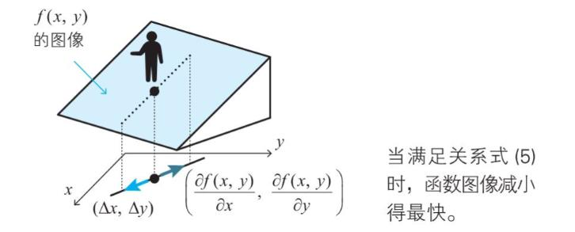

## 导数

  
常用导数公式

偏导数

#### 链式法则

#### 多变量函数的近似公式

###### 单变量：从导数定义到近似公式

###### 多变量
- 
- 

#### **梯度下降法**

由
可知，可表示为向量内积，使用向量的余弦距离公式（a*b=|a|b|cosx, x=180度时，内积最小）
- 
- 

两个向量方向相反时，梯度最大

**通过梯度更新 delta x 和 delta y，然后得到新的 x 和 y，直到 x 和 y 不再变化（或经过一定迭代次数，此时梯度趋近于0），函数取得极值**

**梯度下降法的 excel 演示**

**回归分析**

基于以下公式，联立方程求得对应参数p,q

**求最小值的两种方案**
1. 根据输入数据，按照各变量偏导数为 0，联立各参数求解方程，得出参数，不过条件的数据规模要大于模型参数的个数，方程方可求解
2. 因联立求解方程困难，使用梯度下降法，逐步逼近最小值

神经网络

矩阵表示：

代价函数

- 方法 1：通过偏导数为0，求解参数方程（十分困难）

- 方法 2：梯度下降法求解

相对求解参数方程已相对容易许多，但依然需要求解代价函数相对参数的偏导，这里依然困难：

通过求解器计算 loss

#### 反向传播
神经单元误差delta

delta与权重参数偏导的关系

输出层的delta误差

#### L与L+1层的递推公式：

由上图可知

根据     

可得： 

一般的：

利用误差反向传播法确定神经网络的权重和偏置的算法：

###### Excel 演示反向传播：

关键公式：

## 卷积神经网络

卷积运算

一般的：

池化层

输出层

代价函数

梯度下降法

delta与卷积层偏导数

输出层的梯度分量

卷积层梯度分量

#### 反向传播

输出层delta

反向递推

一般的：只需要求出输出层的神经单元误差delta，就可求出卷积层的误差delta

例：

### 附件

[图灵社区](http://www.ituring.com.cn/book/2593)