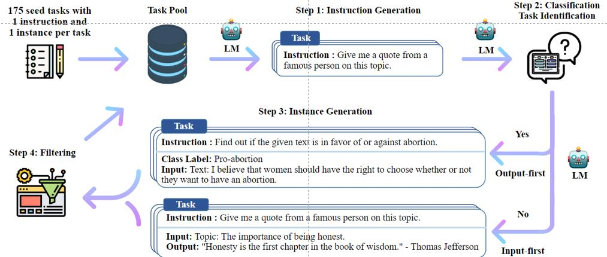

## 有监督微调

有监督微调（Supervised Finetuning，SFT）又称指令微调（Instruction Tuning），是指在已经训练好的语言模型的基础上，通过使用有标注的特定任务数据进行进一步的微调，使模型具备遵循指令的能力。

经过海量数据预训练后的语言模型虽然具备了大量的“知识”，但是由于其训练时的目标仅是进行下一个词的预测，因此不能够理解并遵循人类自然语言形式的指令。为了使模型具有理解并响应人类指令的能力，还需要使用指令数据对其进行微调。

如何构造指令数据，如何高效低成本地进行指令微调训练，以及如何在语言模型基础上进一步扩大上下文等问题，是大语言模型在有监督微调阶段的核心。

#### LoRA
本节将以LoRA（Low-Rank Adaptation of Large Language Models）为例，介绍高效模型微调方法。LoRA 方法可以在缩减训练参数量和GPU 显存占用的同时，使训练后的模型具有与全量微调相当的性能。

语言模型针对特定任务微调之后，权重矩阵通常具有很低的本征秩（Intrinsic Rank，Intrinsic Rank 是一个反映数据或矩阵本质结构复杂度的概念。它对于理解数据的内在维度、进行有效的数据降维以及去除噪声等方面有着重要的作用）。研究人员认为，参数更新量即便投影到较小的子空间中，也不会影响学习的有效性。因此，提出固定预训练模型参数不变，在原本权重矩阵旁路添加低秩矩阵的乘积作为可训练参数，用以模拟参数的变化量。

Intinsic Rank：
A=​{  1 2 3
    2 4 6
    ​3 6 9}​​

在这个矩阵中，第三行是第一行的3倍，第二行是第一行的2倍。这意味着矩阵实际上是由第一行线性扩展而来的。因此，尽管矩阵 𝐴A 是一个 3x3 的矩阵，它的 Intrinsic Rank 实际上只有 1，因为所有的行都可以通过第一行来线性表示。

LoRA 算法不仅在RoBERTa、DeBERTa、GPT-3 等大语言模型上取得了很好的效果，也应用到了Stable Diffusion 等视觉大模型中，同样也可以用很小的成本达到微调大语言模型的目的。

###### AdaLoRA
LoRA 算法给所有的低秩矩阵指定了唯一的秩，从而忽略了不同模块、不同层的参数对于微调特定任务的重要性差异。因此，文献[155] 提出了AdaLoRA（Adaptive Budget Allocation for Parameter-Efficient Fine-Tuning）算法，在微调过程中根据各权重矩阵对下游任务的重要性动态调整秩的大小，用以进一步减少可训练参数量，同时保持或提高性能。

为了达到降秩且最小化目标矩阵与原矩阵差异的目的，常用的方法是对原矩阵进行奇异值分解并裁去较小的奇异值。然而，对于大语言模型来说，在训练过程中迭代地计算那些高维权重矩阵的奇异值是代价高昂的。

#### 指令数据构建

指令数据的质量会直接影响有监督微调的最终效果，所以指令数据的构建应是一个非常精细的过程。从获得来源上看，构建指令数据的方法可以分为**手动构建指令和利用大语言模型的生成能力自动构建指令两种**。

手动构建指令的方法比较直观，可以在网上收集大量的问答数据再人为加以筛选过滤，或者通过标注者直接手动编写提示与相应的回答。虽然这是一个比较耗费人力的过程，但其优势在于可以很好地把控指令数据的标注过程，并对整体质量进行很好的控制。

指令数据的质量和多样性通常被认为是衡量指令数据的两个最重要的维度。

LIMA 的实验结果说明指令数据的质量和多样性是影响有监督微调过程的关键因素。LIMA仅使用1 000 条这样的指令数据，就可以媲美甚至超过指令数据是其几十倍的同等参数规模的其他模型。

###### 模型自动构建

###### 开源指令数据集

