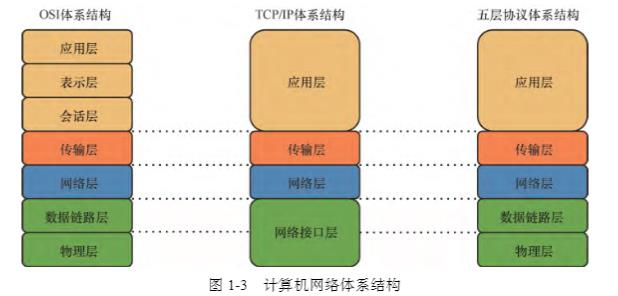
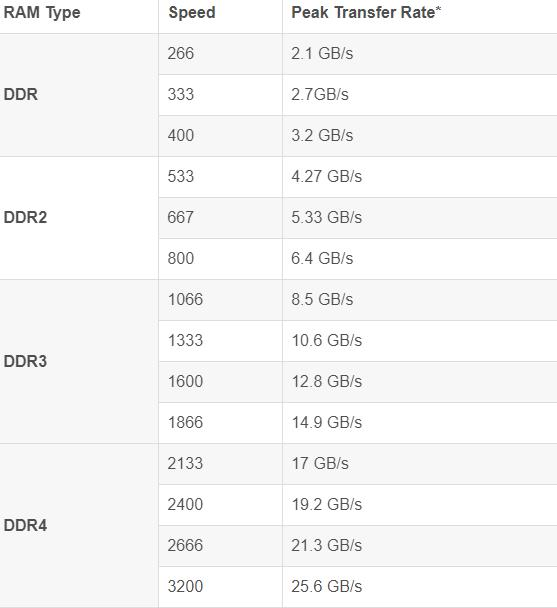
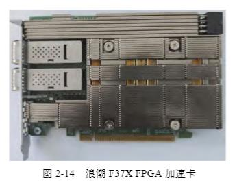
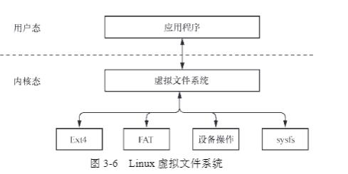
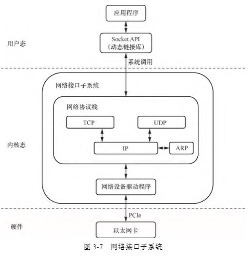
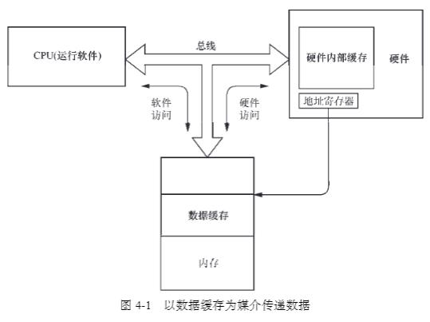

[豆瓣评分 9.1](https://book.douban.com/subject/36322557/)

## 计算机网络

#### 五层协议
- 应用层：http
- 传输层：TCP、UDP
- 网络层：IP
- 链路层：Mac
- 物理层：光电接口

最大传输单元 MTU：数据链路层上能通过的最大负载，标准以太网（对应链路层+物理层）是1500Bytes

所谓的以太网对应的是链路层和物理层

封装和解析

## 计算机硬件 

#### 体系结构

#### Cache

cache line 一次从内存取 N 个字节到 Cache 中，N 一般为64Byte

cache 写策略：

1. write-through：同时写 cache 和内存
2. write-back：只写 cache，cache line 标记为 dirty，不同步写内存
#### cache 一致性

###### 挑战
- 线程 A 若采用 write-through 方法更新了内存，但是线程 B cache 了 flag，如果感知不到内存修改，那么 B 将数据不一致
- 线程 A 若采用 write-back 方法更新自己的 cache，而不更新内存，那么线程 B 无论是否 cache，都将不一致
###### 解决方案
- Snooping-based 方案：所有 cache 通过共享总线互联，每个 cache 控制器监控着共享总线的操作。当某个核对 cache line 进行写操作后，其他 cache 控制器会无效自己相同地址的 cache line---分布式监听方案
- Directory-based 方案：某个位置（directory）集中存储所有被多核共享的 cache line 的状态，一个核更新了自己的 cache line 后，如果在 directory 发现被共享，那么向其他核发送无效信号---集中式分发方案
###### cache 一致性场景
- 多核 L1、L2 与内存之间的读写一致性
- 单核 Cache（L1/2/3） 、外设（当做一个核）与内存之间的读写一致性
###### 三种 cache 指令
- Clean：dirty （cache 修改过，但尚未写回内存）的 cache line 写到内存中
- Invalid：将目标地址范围的所有 cache line 设置为无效，下次直接访问内存
- Flush：将目标地址范围的所有 cache line，先 clean 再 Invalid

#### NUMA

除了内存存在 non-unifor memory access 以外，外设（如网卡）也存在直连与非直连的情况

因而网卡0写入内存0，比写入内存1快

#### 内存

**内存带宽（以字节/秒为单位）= 数据宽度（位）× 总线时钟频率（Hz） × 2 / 8**

例如，假设有一个DDR4内存，数据宽度为64位（一般服务器通道数 2，每个通道32位），总线时钟频率为3200Mhz（厂商公布的是已经 double 的），那么其内存带宽可以这样计算：

**内存带宽 = 64位 × 3.2GHz / 8 = 25.6 GB/s**

典型的 DDR 带宽速率如下

#### 总线

总线带宽（bit/s）=频率 * 宽度

###### PCI Express 总线

PCIe 域与内存域

处理器核能直接使用的地址是内存域，而 PCIe 设备能使用的则是 PCIe 总线域的地址

处理器核要访问 PCIe 设备，先发送地址信号到内部总线，此地址会被 PCIe 控制器截获，并翻译为 PCIe 总线域的地址，在转发到对应 PCIe 设备。

为了编程方便，处理器核发出的地址和 PCIe 总线域的地址在数值上是一样的。

#### 网卡

###### DMA
- Host to Device：cpu 将数据写入内存，通知网卡直接通过内部总线+PCIe 读取
- Device：网卡将数据写入内存，通知 CPU 读取

###### 典型网卡
- RJ45接口的双端口以太网网卡，每个端口1GE，PCIe2.0 * 4

- 双端口，通过光模块链接，支持10/1GE 速率，PCIe3.0 * 8，支持以太网和 RoCE

 
- 高性能单端口网卡，支持100/50/40/25/10/1GE，通过光模块（QSFP28）+光纤对外连接，支持以太网、ROCE、DPDK 和 XDP（后两者依靠软件实现）

- 浪潮 FPGA 加速卡

这是一个 AI 计算加速卡，不过其带有 100GE 的FPGA 芯片，再加上 Corundum 开源网卡解决方案，即可形成一个100GE 网卡使用

## Linux 操作系统

#### 虚拟地址

32位虚拟地址的最大内存空间是4GB，其中
###### 页表

一级页表的弊端：32到12位共2^20 项，每个表项占据4Byte，那么需要4MB 的内存空间，如果程序代码段加数据段只占据几 KB 的话，页表内存占用浪费巨大

###### TLB（translation lookaside buffer）

专门的 Cache 来缓存内存页表，一般缓存几十到几百个表项，TLB 缓存前20位（31:12），如果匹配到虚拟地址，再“与”上虚拟地址的后12位

#### 内核组成

- 进程调度：微观串行、宏观并行
- 内存管理：页表、malloc/free
- 虚拟文件系统：一切皆文件，socket、硬件设备（如磁盘）等都被映射为文件，对上层应用程序提供统一的 vfs_read () 与 vfs_write () 接口

- 进程间通信：信号量，共享内存，消息队列，管道，socket
- 网络接口

## 软硬件交互
#### 寄存器

#### 数据缓存

写和读都通过DMA操作， CPU通过数据发送寄存器通知硬件，而硬件通过中断通知CPU

###### 队列

描述符和对应数据均位于内存中，这是一种非常常见的数据映射方法

**环形队列**

生产者（sw）消费者（hw）

两个问题边界问题：
- 如何判断队列已满
- 如何判断队列为空

#### 中断

中断提高了计算机处理机性能（保存上下文信息，如寄存器值等将损失部分性能），没有中断，则 CPU 只能 busy waiting，反复轮询该设备的状态寄存器

有三个 level 的中断使能控制：1. 外围中断控制器 2. 可编程中断控制器 3. Cpu核中断控制器

#### DMA

DMA 控制器（网卡自带）通过总线将内存中的数据复制到 DMA 控制器内部的寄存器/缓存中，在复制到设备的存储空间中。DMA 做的事情与 CPU 无二，只是卸载了 CPU 的数据复制负载。CPU 只需关注任务的启停等控制流即可。

## 网络协议栈

详述一次完整的数据收发流程：

数据流：数据共复制了 5 次，其中 2, 3，4 为不同硬件不可避免

问题：

- 内核态和用户态上下文（程序调用栈，寄存器等）频繁切换，TLB miss
- 数据复制，消耗大量 CPU 时间
- 网络协议包封装与解包消耗 CPU 时钟

解决上述问题的方案包括: RDMA/DPDK/XDP 等

## Corundum--FPGA 100 GE 网卡方案

#### Corundum 队列

## DPDK

#### Why DPDK

Intel 使用通用 cpu 芯片+DPDK 干掉 ASIC+专属软件的性价比网络协议方案

****

#### PMD（poll mode driver）

通过轮询方式直接访问接收、发送队列的描述符与寄存器，无需处理中断，实现在用户态的应用程序中快速接收、处理与发送数据包

两种模式

#### 内存管理

